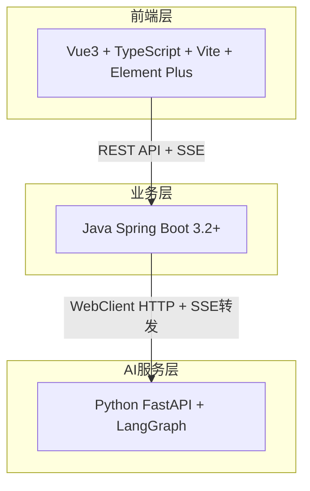
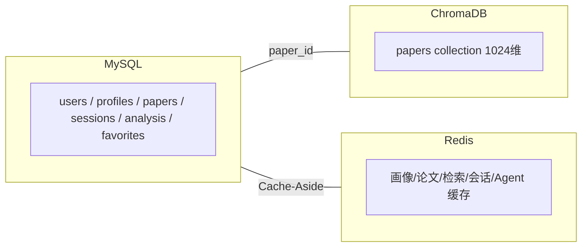

# AGENTS.md — XH-202630 科研文献智能助手

> **渐进式加载入口**：本文档为精简核心上下文（始终加载 ~100行）。详细内容分布在 `docs/agents/` 目录下，按需按场景触发加载。

---

## 项目身份卡

| 项目 | 内容 |
|------|------|
| **课题编号** | XH-202630 |
| **子项目** | 科研文献助手 |
| **团队** | 1名开发者 + 2名非开发者 |
| **三层架构** | Vue3 → Java Spring Boot → Python FastAPI + LangGraph |

---

## 系统架构（始终上下文）





---

## 速查表

### 技术栈

| 层级 | 核心技术 |
|------|---------|
| 前端 | Vue3 + TS + Vite + Element Plus + ECharts + Pinia |
| 后端 | Java 17 + Spring Boot 3.2 + JPA + Redis |
| AI | Python 3.10 + FastAPI + LangGraph + ChromaDB |

### 命名规范（核心）

| 对象 | Java | Python | TypeScript |
|------|------|--------|------------|
| 类/组件 | PascalCase | PascalCase | PascalCase |
| 方法/函数 | camelCase | snake_case | camelCase |
| 文件名 | PascalCase.java | snake_case.py | PascalCase.vue |

### 统一响应格式

```json
{"code": 200, "message": "success", "data": {...}, "timestamp": "..."}
```

---

## 渐进式加载指南

> **使用方式**：Agent 先根据当前任务匹配场景，再用 Read 工具按需加载对应文件。外部项目文档（策划案、需求规格等）仍按 `docs/` 下的原有路径加载。

### 场景 → Agent文件映射

| 场景 | 需加载的 Agent 文件 |
|------|---------------------|
| 🔍 **理解项目全貌** / 规划任务 / 答辩准备 | [01-overview.md](file:///Users/achieve/Documents/AchiEVE_MacBook_Air/Veritas(求真)/docs/agents/01-overview.md) |
| ☕ **写 Java 后端代码** | [02-tech-stack.md](file:///Users/achieve/Documents/AchiEVE_MacBook_Air/Veritas(求真)/docs/agents/02-tech-stack.md) + [06-api-contract.md](file:///Users/achieve/Documents/AchiEVE_MacBook_Air/Veritas(求真)/docs/agents/06-api-contract.md) + [07-standards.md](file:///Users/achieve/Documents/AchiEVE_MacBook_Air/Veritas(求真)/docs/agents/07-standards.md) |
| 🐍 **写 Python AI 代码** | [02-tech-stack.md](file:///Users/achieve/Documents/AchiEVE_MacBook_Air/Veritas(求真)/docs/agents/02-tech-stack.md) + [03-agent-system.md](file:///Users/achieve/Documents/AchiEVE_MacBook_Air/Veritas(求真)/docs/agents/03-agent-system.md) + [07-standards.md](file:///Users/achieve/Documents/AchiEVE_MacBook_Air/Veritas(求真)/docs/agents/07-standards.md) |
| 🎨 **写前端代码** | [02-tech-stack.md](file:///Users/achieve/Documents/AchiEVE_MacBook_Air/Veritas(求真)/docs/agents/02-tech-stack.md) + [06-api-contract.md](file:///Users/achieve/Documents/AchiEVE_MacBook_Air/Veritas(求真)/docs/agents/06-api-contract.md) + [07-standards.md](file:///Users/achieve/Documents/AchiEVE_MacBook_Air/Veritas(求真)/docs/agents/07-standards.md) |
| 🗄️ **数据库 / 缓存 / 向量存储** | [05-database.md](file:///Users/achieve/Documents/AchiEVE_MacBook_Air/Veritas(求真)/docs/agents/05-database.md) |
| 🔀 **API设计 / 跨服务调用** | [06-api-contract.md](file:///Users/achieve/Documents/AchiEVE_MacBook_Air/Veritas(求真)/docs/agents/06-api-contract.md) |
| 🎯 **个性化功能** | [04-personalization.md](file:///Users/achieve/Documents/AchiEVE_MacBook_Air/Veritas(求真)/docs/agents/04-personalization.md) + [03-agent-system.md](file:///Users/achieve/Documents/AchiEVE_MacBook_Air/Veritas(求真)/docs/agents/03-agent-system.md) |
| 🏗️ **架构决策 / 重构** | [01-overview.md](file:///Users/achieve/Documents/AchiEVE_MacBook_Air/Veritas(求真)/docs/agents/01-overview.md) + [03-agent-system.md](file:///Users/achieve/Documents/AchiEVE_MacBook_Air/Veritas(求真)/docs/agents/03-agent-system.md) |

### Agent文件索引

| 编号 | 文件 | 内容 | 行数 |
|------|------|------|------|
| 01 | [docs/agents/01-overview.md](file:///Users/achieve/Documents/AchiEVE_MacBook_Air/Veritas(求真)/docs/agents/01-overview.md) | 项目概况、里程碑、功能编号、ADR、验收标准、风险、学习路线 | ~137 |
| 02 | [docs/agents/02-tech-stack.md](file:///Users/achieve/Documents/AchiEVE_MacBook_Air/Veritas(求真)/docs/agents/02-tech-stack.md) | 技术栈版本、本机环境、环境变量、目录结构、Docker部署 | ~152 |
| 03 | [docs/agents/03-agent-system.md](file:///Users/achieve/Documents/AchiEVE_MacBook_Air/Veritas(求真)/docs/agents/03-agent-system.md) | Agent角色定义、LangGraph工作流、降级策略、RAG架构 | ~86 |
| 04 | [docs/agents/04-personalization.md](file:///Users/achieve/Documents/AchiEVE_MacBook_Air/Veritas(求真)/docs/agents/04-personalization.md) | 用户画像4维度、PersonalizationService | ~28 |
| 05 | [docs/agents/05-database.md](file:///Users/achieve/Documents/AchiEVE_MacBook_Air/Veritas(求真)/docs/agents/05-database.md) | MySQL核心表、Redis Key、ChromaDB、Neo4j | ~64 |
| 06 | [docs/agents/06-api-contract.md](file:///Users/achieve/Documents/AchiEVE_MacBook_Air/Veritas(求真)/docs/agents/06-api-contract.md) | Java/Python API端点、响应格式、请求契约、SSE | ~73 |
| 07 | [docs/agents/07-standards.md](file:///Users/achieve/Documents/AchiEVE_MacBook_Air/Veritas(求真)/docs/agents/07-standards.md) | 命名规范、Java/Python/前端规范、Git规范、安全规范 | ~76 |

---

## 关键规则（始终生效）

1. **三层分离架构** — 前端不直连AI服务，必须经过Java后端代理
2. **统一响应格式** — 所有API返回 `{code, message, data, timestamp}`
3. **Entity与DTO分离** — 禁止直接返回Entity给前端
4. **跨系统字段转换** — Java camelCase ↔ Python/JSON snake_case
5. **Agent超时30s** — 异常不阻塞后续Agent，三级降级
6. **缓存Cache-Aside** — 写后删Redis，读时先查Redis再查MySQL
7. **安全底线** — JWT认证 + BCrypt密码 + 参数化查询 + 数据隔离

---

## 外部项目文档（按需加载）

> 以下为 `docs/` 下的外部项目文档。当需要需求细节、UI设计规范、详细架构说明时，按场景加载。

| 场景 | 需加载的外部文档 |
|------|------------------|
| 理解需求 / 确认验收标准 | [02-需求规格说明书](file:///Users/achieve/Documents/AchiEVE_MacBook_Air/Veritas(求真)/docs/XH-202630-科研文献助手/01-策划阶段/02-需求规格说明书.md) |
| 写技术报告 / 答辩PPT | [01-项目策划案](file:///Users/achieve/Documents/AchiEVE_MacBook_Air/Veritas(求真)/docs/XH-202630-科研文献助手/01-策划阶段/01-项目策划案.md) + [09-项目方案](file:///Users/achieve/Documents/AchiEVE_MacBook_Air/Veritas(求真)/docs/XH-202630-科研文献助手/05-风险管理/09-项目方案.md) |
| 写前端UI代码 | [前端UI-UX设计手册](file:///Users/achieve/Documents/AchiEVE_MacBook_Air/Veritas(求真)/docs/frontend/前端UI-UX设计手册.md) + [信息架构文档(IA)](file:///Users/achieve/Documents/AchiEVE_MacBook_Air/Veritas(求真)/docs/信息架构文档(IA).md) |
| 架构决策评估 | [03-系统架构设计文档](file:///Users/achieve/Documents/AchiEVE_MacBook_Air/Veritas(求真)/docs/XH-202630-科研文献助手/02-设计阶段/03-系统架构设计文档.md) + [架构决策记录(ADR)](file:///Users/achieve/Documents/AchiEVE_MacBook_Air/Veritas(求真)/docs/架构决策记录(ADR).md) |
| 规划开发顺序 | [版本里程碑功能清单](file:///Users/achieve/Documents/AchiEVE_MacBook_Air/Veritas(求真)/docs/版本里程碑功能清单.md) + [05-功能实现顺序](file:///Users/achieve/Documents/AchiEVE_MacBook_Air/Veritas(求真)/docs/XH-202630-科研文献助手/03-开发阶段/05-功能实现顺序.md) |
| 环境配置 / 依赖管理 | [06-技术栈](file:///Users/achieve/Documents/AchiEVE_MacBook_Air/Veritas(求真)/docs/XH-202630-科研文献助手/03-开发阶段/06-技术栈.md) + [开发规范文档](file:///Users/achieve/Documents/AchiEVE_MacBook_Air/Veritas(求真)/docs/开发规范文档.md) |
| 风险评估 | [08-潜在风险清单](file:///Users/achieve/Documents/AchiEVE_MacBook_Air/Veritas(求真)/docs/XH-202630-科研文献助手/05-风险管理/08-潜在风险清单.md) |
| 数据库DDL / 索引细节 | [数据库设计文档](file:///Users/achieve/Documents/AchiEVE_MacBook_Air/Veritas(求真)/docs/database/数据库设计文档.md) |
| 全链路业务流程 | [系统完整工作流程文档](file:///Users/achieve/Documents/AchiEVE_MacBook_Air/Veritas(求真)/docs/系统完整工作流程文档.md) + [项目模块功能与联系文档](file:///Users/achieve/Documents/AchiEVE_MacBook_Air/Veritas(求真)/docs/项目模块功能与联系文档.md) |
