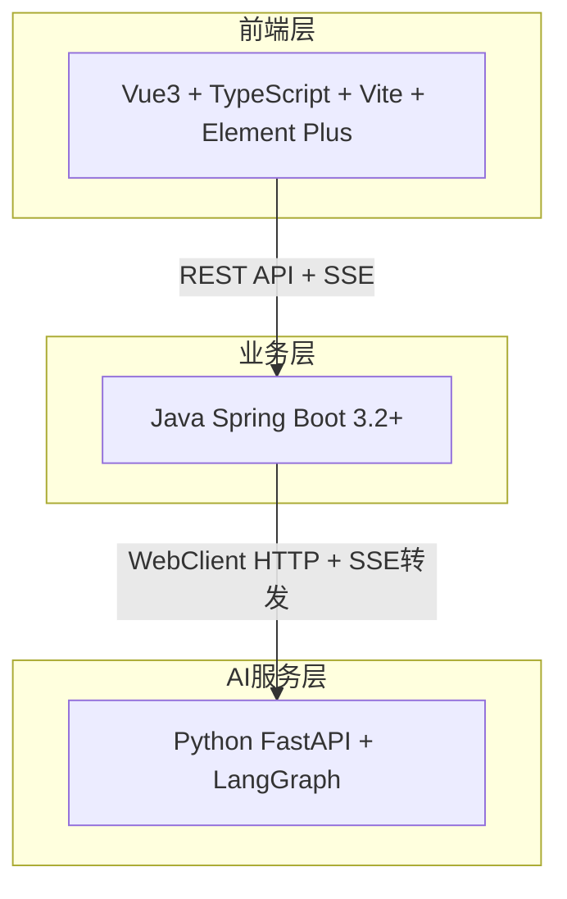
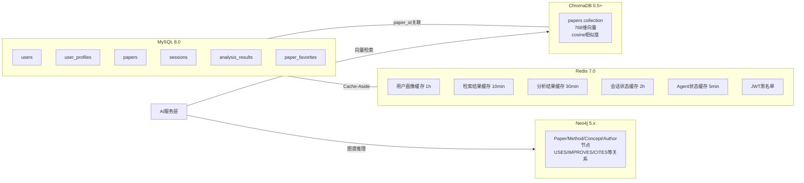
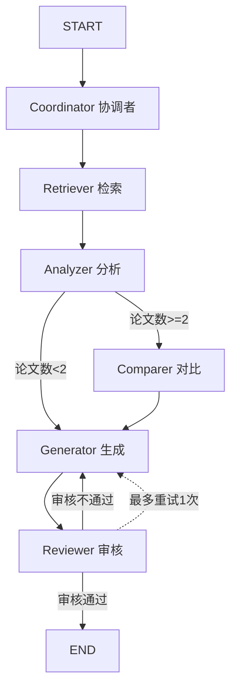
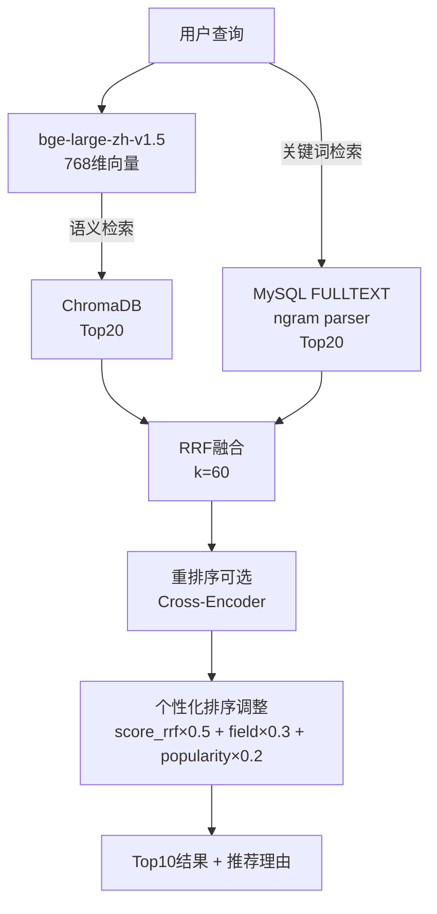

# AGENTS.md — XH-202630 科研文献智能助手

> 本文档为 AI Agent 提供项目全景上下文，涵盖架构、技术栈、编码规范、数据模型、API契约、开发计划等所有关键信息。

---

## 1 项目概况

| 项目 | 内容 |
|------|------|
| **课题编号** | XH-202630 |
| **课题名称** | 领域知识个性化生成与多智能体协同决策系统研究 |
| **子项目** | 科研文献助手 |
| **发榜单位** | 上海云之脑智能科技有限公司（科大讯飞全资子公司） |
| **开发周期** | 14周（2026年5月23日 - 9月30日） |
| **预算** | ≤ ¥1,500 |
| **团队** | 1名开发者（AI Coding辅助）+ 2名非开发者（数据/文档） |

### 1.1 核心功能

1. **智能文献检索** — 语义+关键词混合检索，RRF融合排序
2. **论文深度分析** — 5维度结构化提取（研究问题/核心方法/主要实验/核心结论/局限性）
3. **多论文对比** — 方法对比矩阵+矛盾自动发现
4. **个性化综述生成** — 用户画像驱动的Prompt个性化
5. **Agent协同可视化** — SSE实时推送6个Agent执行状态
6. **知识溯源** — 引用标注→原文跳转

### 1.2 四大创新点

1. 科研场景多Agent分工协同（6个专业Agent）
2. 用户画像驱动的个性化生成（4维度画像→Prompt适配）
3. 论文矛盾自动发现（对比Agent检测观点冲突）
4. Agent协同过程可视化（ECharts流程图+SSE实时推送）

---

## 2 系统架构

### 2.1 三层分离架构



| 层级 | 技术栈 | 职责 |
|------|--------|------|
| 前端层 | Vue3 + TypeScript + Vite + Element Plus + ECharts + Pinia | 用户交互、可视化、状态管理 |
| 业务层 | Java Spring Boot 3.2+ + Spring Data JPA + Spring Data Redis | 用户认证、论文管理、会话管理、缓存、AI服务代理 |
| AI服务层 | Python FastAPI + LangGraph + ChromaDB + bge-large-zh-v1.5 | 多Agent编排、RAG检索、LLM调用、个性化生成 |

### 2.2 数据存储架构



---

## 3 多Agent系统设计

### 3.1 Agent角色定义

| Agent | 角色 | 职责 | 超时 | 输入 | 输出 |
|-------|------|------|------|------|------|
| **Coordinator** | 协调者 | 任务分解与调度 | 30s | query, user_profile | sub_tasks[] |
| **Retriever** | 检索员 | 语义+关键词混合检索 | 30s | sub_tasks → 检索关键词 | search_results[] (Top10) |
| **Analyzer** | 分析员 | 深度文献分析 | 30s | search_results → 论文列表 | analysis_results[] (5维度JSON) |
| **Comparer** | 对比员 | 多文献对比（条件执行） | 30s | analysis_results | compare_result (对比+矛盾) |
| **Generator** | 生成员 | 报告生成 | 30s | analysis + profile | report (个性化综述) |
| **Reviewer** | 审核员 | 质量审核与反馈 | 30s | report + original_papers | review_result (审核+修改建议) |

### 3.2 LangGraph工作流



**WorkflowState (TypedDict)**:
```python
class AgentState(TypedDict):
    query: str
    user_profile: Dict[str, Any]
    sub_tasks: List[str]
    search_results: List[Dict]
    analysis_results: List[Dict]
    compare_result: Optional[Dict]
    report: Optional[str]
    review_result: Optional[Dict]
    final_output: Optional[str]
    agent_states: Dict[str, Dict]
    errors: List[Dict]
```

### 3.3 降级策略（三级）

| 级别 | 触发条件 | 降级行为 |
|------|---------|---------|
| **Agent级** | 单Agent超时30s | 跳过该Agent，继续后续流程 |
| **工作流级** | 多Agent失败 | 降级为单Agent模式（仅Retriever+Generator） |
| **LLM级** | 连续3次调用失败/超时30s/HTTP 5xx | 自动切换到下一级Provider |

**LLM三路Provider**:
```
优先级1: BuiltinLLMProvider（软件方模型）→ 优先级2: APILLMProvider（外接API）→ 优先级3: LocalLLMProvider（本地Qwen2）
```
降级恢复：每5分钟尝试恢复到更高级别Provider。

---

## 4 个性化引擎

### 4.1 用户画像4维度

| 维度 | 字段 | 枚举值 | 个性化策略 |
|------|------|--------|-----------|
| 学历层次 | education_level | undergraduate / master / phd / faculty | 通俗解释+类比 / 方法对比+代码 / 前沿分析+创新建议 / 知识体系+教学案例 |
| 研究方向 | research_field | NLP / CV / RL / 多模态 / ... | 检索排序权重、领域上下文注入 |
| 知识水平 | knowledge_level | beginner / intermediate / advanced / expert | 术语密度<5% / ~20% / ~40% / >50% |
| 偏好风格 | preferred_style | simple / balanced / technical | 日常用语+比喻 / 标准学术 / 正式学术+引用 |

### 4.2 PersonalizationService映射

```python
DIFFICULTY_MAP = {
    "beginner": 1, "intermediate": 2, "advanced": 3, "expert": 4
}
STYLE_MAP = {
    "simple": "casual", "balanced": "standard", "technical": "formal"
}
```

---

## 5 技术栈与环境

### 5.1 技术栈版本

| 层级 | 技术 | 版本 |
|------|------|------|
| 前端 | Vue3 + Composition API + `<script setup>` | 3.4+ |
| 前端 | TypeScript | 5.0+ |
| 前端 | Vite | 5.0+ |
| 前端 | Element Plus | 2.5+ |
| 前端 | ECharts | 5.4+ |
| 前端 | Pinia | 2.1+ |
| 前端 | Axios | 1.6+ |
| 后端 | Java | 17 |
| 后端 | Spring Boot | 3.2+ |
| 后端 | Spring Data JPA | — |
| 后端 | Spring Data Redis | — |
| 后端 | HikariCP | max=20 |
| AI服务 | Python | 3.10+ |
| AI服务 | FastAPI | 0.110+ |
| AI服务 | LangGraph | — |
| AI服务 | chromadb | 0.5+ |
| AI服务 | pydantic-settings | — |
| 数据库 | MySQL | 8.0 |
| 数据库 | Redis | 7.0 |
| 向量库 | ChromaDB | 0.5+ |
| 图数据库 | Neo4j | 5.x Community |
| Embedding | bge-large-zh-v1.5 | 768维 |
| 部署 | Docker Compose | — |

### 5.2 本机环境

| 服务 | 地址 | 用户/密码 |
|------|------|----------|
| 本机MySQL 9 | localhost:3306 | root / Aa2105268075. |
| Docker MySQL 8 | Docker内 | root / root123 |
| Docker MinIO | Docker内 | admin / A2105268075 |
| Docker Redis | localhost:6379 | 无密码（内网） |

### 5.3 关键环境变量

```bash
MYSQL_ROOT_PASSWORD=your_password
MYSQL_DATABASE=literature_assistant
REDIS_HOST=redis
REDIS_PORT=6379
JWT_SECRET=your_jwt_secret
AI_SERVICE_URL=http://ai-service:8000
LLM_MODE=auto                    # auto|builtin|api|local
LLM_BUILTIN_URL=https://llm.literature-assistant.com/v1
LLM_API_KEY=
LLM_API_BASE=
LLM_MODEL_NAME=
CHROMA_PATH=./data/vector_db
EMBEDDING_MODEL_NAME=BAAI/bge-large-zh-v1.5
```

---

## 6 项目目录结构

```
Veritas(求真)/
├── docs/                                    # 项目文档
├── Veritas/
│   ├── backend/                             # Java后端
│   │   ├── src/main/java/com/literatureassistant/
│   │   │   ├── config/                      # 配置类
│   │   │   ├── controller/                  # API控制器
│   │   │   ├── service/                     # 业务逻辑
│   │   │   ├── repository/                  # 数据访问
│   │   │   ├── entity/                      # JPA实体
│   │   │   ├── dto/                         # 数据传输对象
│   │   │   │   ├── request/                 # 请求DTO
│   │   │   │   ├── response/                # 响应DTO
│   │   │   │   └── common/                  # 通用DTO
│   │   │   ├── client/                      # 外部服务客户端
│   │   │   ├── mapper/                      # MapStruct映射器
│   │   │   ├── filter/                      # 过滤器/拦截器
│   │   │   ├── exception/                   # 异常定义
│   │   │   ├── enums/                       # 枚举定义
│   │   │   ├── aspect/                      # 切面
│   │   │   └── util/                        # 工具类
│   │   └── src/main/resources/application.yml
│   ├── ai-service/                          # Python AI服务
│   │   ├── app/
│   │   │   ├── main.py                      # FastAPI入口
│   │   │   ├── api/router.py                # API路由
│   │   │   ├── core/config.py               # 配置
│   │   │   ├── agents/                      # Agent模块
│   │   │   │   ├── coordinator.py / retriever.py / analyzer.py
│   │   │   │   ├── comparer.py / generator.py / reviewer.py
│   │   │   │   └── graph.py                 # LangGraph工作流
│   │   │   ├── services/                    # 服务层
│   │   │   │   ├── llm_service.py / embedding_service.py
│   │   │   │   ├── vector_store_service.py / personalization_service.py
│   │   │   └── models/schemas.py            # Pydantic数据模型
│   │   ├── prompts/                         # Prompt模板
│   │   └── requirements.txt
│   ├── frontend/                            # 前端
│   │   ├── src/
│   │   │   ├── views/                       # 页面组件
│   │   │   ├── components/                  # 可复用组件
│   │   │   ├── stores/                      # Pinia状态管理
│   │   │   ├── api/                         # API封装
│   │   │   ├── router/                      # 路由配置
│   │   │   ├── composables/                 # 组合式函数
│   │   │   ├── types/                       # TypeScript类型
│   │   │   └── utils/                       # 工具函数
│   │   └── vite.config.ts
│   ├── docker-compose.yml                   # Docker编排
│   ├── .env.example                         # 环境变量模板
│   └── nginx.conf                           # Nginx反向代理配置
└── AGENTS.md                                # 项目全景上下文
```

---

## 7 数据库设计

### 7.1 MySQL核心表

| 表名 | 用途 | 核心字段 | 索引 |
|------|------|---------|------|
| `users` | 用户账号 | user_id(UQ), username, email, password_hash | PK(id), UQ(user_id) |
| `user_profiles` | 用户画像 | user_id(FK), education_level(ENUM), research_field, knowledge_level(ENUM), preferred_style(ENUM), profile_data(JSON) | PK(id), FK(user_id) |
| `papers` | 论文元数据 | paper_id(UQ), title, authors(JSON), abstract(TEXT), year, venue, keywords(JSON), citation_count | PK(id), UQ(paper_id), IDX(year/venue/citation), FULLTEXT(title,abstract) |
| `sessions` | 分析会话 | session_id(UQ), user_id(FK), topic, status(ENUM:active/completed/expired) | PK(id), UQ(session_id), IDX(user_id/status) |
| `analysis_results` | 分析结果 | analysis_id(UQ), session_id(FK), type(ENUM:paper_analysis/compare/report), result(JSON), status(ENUM:pending/processing/completed/failed) | PK(id), UQ(analysis_id), IDX(session_id/status/type) |
| `paper_favorites` | 论文收藏 | user_id(FK), paper_id(FK) | PK(id), UQ(user_id,paper_id) |

**枚举值**:
- education_level: `undergraduate` / `master` / `phd` / `faculty`
- knowledge_level: `beginner` / `intermediate` / `advanced` / `expert`
- preferred_style: `simple` / `balanced` / `technical`
- session status: `active` / `completed` / `expired`
- analysis type: `paper_analysis` / `compare` / `report`
- analysis status: `pending` / `processing` / `completed` / `failed`

### 7.2 Redis缓存Key

| Key模式 | TTL | 数据结构 | 用途 |
|---------|-----|---------|------|
| `user:profile:{userId}` | 1小时 | String(JSON) | 用户画像缓存 |
| `user:info:{userId}` | 1小时 | String(JSON) | 用户信息缓存 |
| `paper:detail:{paperId}` | 30分钟 | String(JSON) | 论文详情缓存 |
| `paper:list:{queryHash}` | 10分钟 | String(JSON) | 论文列表缓存 |
| `search:result:{queryHash}` | 10分钟 | String(JSON) | 检索结果缓存 |
| `analysis:result:{analysisId}` | 30分钟 | String(JSON) | 分析结果缓存 |
| `session:state:{sessionId}` | 2小时 | String(JSON) | 会话状态缓存 |
| `agent:state:{analysisId}` | 5分钟 | Hash | Agent执行状态 |
| `auth:blacklist:{tokenHash}` | Token有效期 | String | JWT黑名单 |
| `ai:provider:status` | 5分钟 | String | AI降级状态 |

**缓存策略**: Cache-Aside模式 — 写操作先更新MySQL再删除Redis缓存；读操作先查Redis，未命中查MySQL后回填。

### 7.3 ChromaDB

- Collection: `papers`
- 向量维度: 768 (bge-large-zh-v1.5)
- 相似度: cosine
- HNSW参数: M=16, construction_ef=200
- 元数据: paper_id, title, year, venue, citation_count, chunk_index, chunk_type
- 分块: 500-1000字/块，重叠50-100字

### 7.4 Neo4j知识图谱

- 节点: Paper / Method / Concept / Author
- 关系: USES / IMPROVES / RELATED_TO / AUTHORED_BY / CITES / BELONGS_TO
- 端口: 7687(Bolt) / 7474(HTTP)

---

## 8 API契约

### 8.1 Java后端API

```
/api/users/register          POST   注册
/api/users/login             POST   登录
/api/users/{userId}          GET    查询用户
/api/users/{userId}/profile  GET/POST/PUT  画像CRUD
/api/papers                  GET    论文列表(分页)
/api/papers/{paperId}        GET    论文详情
/api/papers/search           GET    论文搜索
/api/papers/{paperId}/favorite  POST/DELETE  收藏/取消
/api/sessions                POST/GET  创建/列表会话
/api/sessions/{sessionId}    GET/DELETE  详情/删除
/api/analysis/paper          POST   论文分析
/api/analysis/compare        POST   对比分析
/api/analysis/report         POST   综述生成
/api/analysis/{analysisId}   GET    分析结果
/api/analysis/{analysisId}/status  GET    分析状态
/api/analysis/{analysisId}/agent-stream  GET(SSE)  Agent状态流
```

### 8.2 Python AI服务API

```
/api/agent/analyze           POST   启动Agent工作流
/api/search                  POST   语义检索
/api/model/status            GET    模型状态
/health                      GET    健康检查
```

### 8.3 统一响应格式

```json
{"code": 200, "message": "success", "data": {...}, "timestamp": "..."}
```

### 8.4 Java→Python请求契约

```json
{
  "topic": "Multi-Agent协同决策",
  "paper_ids": ["arxiv_2024_001"],
  "user_id": "usr_001",
  "user_profile": {
    "education_level": "master",
    "research_field": "NLP",
    "knowledge_level": "intermediate",
    "preferred_style": "balanced"
  }
}
```

### 8.5 SSE事件格式

```
event: agent_state_update
data: {"agent_name": "retriever", "status": "running", "progress": 0.6, "intermediate_result": "找到15篇相关论文"}
```

---

## 9 编码规范

### 9.1 命名规范

| 对象 | Java | Python | TypeScript |
|------|------|--------|------------|
| 类名 | PascalCase | PascalCase | PascalCase |
| 方法/函数 | camelCase | snake_case | camelCase |
| 变量 | camelCase | snake_case | camelCase |
| 常量 | UPPER_SNAKE_CASE | UPPER_SNAKE_CASE | UPPER_SNAKE_CASE |
| 文件名 | PascalCase.java | snake_case.py | PascalCase.vue |
| 枚举值 | UPPER_SNAKE_CASE | lower_case | PascalCase |
| 配置键 | kebab-case | UPPER_SNAKE_CASE | camelCase |
| 数据库表/列 | snake_case | — | — |

**跨系统字段转换**: Java camelCase ↔ Python/JSON snake_case（通过@JsonProperty / Pydantic field alias）

### 9.2 Java后端规范

- **分层架构**: Controller → Service → Repository → Client，禁止跨层调用
- **Entity与DTO分离**: 禁止直接返回Entity给前端
- **异常处理**: 全局@RestControllerAdvice + BusinessException体系
- **缓存**: @Cacheable/@CacheEvict + Cache-Aside
- **事务**: @Transactional，方法粒度，避免大事务
- **Entity注解**: @Data @NoArgsConstructor @Builder + @PrePersist

### 9.3 Python AI服务规范

- **FastAPI**: 路由在api/endpoints/，逻辑在services/，模型在models/schemas.py
- **Agent统一接口**: execute(state) → state，超时30s，异常不阻塞后续Agent
- **Prompt管理**: 模板存prompts/目录，使用string.Template变量替换
- **配置**: pydantic-settings BaseSettings + .env
- **异步**: I/O用async/await，CPU密集用run_in_executor

### 9.4 前端规范

- **组件**: `<script setup lang="ts">` + Composition API + scoped样式
- **状态管理**: Pinia setup store风格，按业务域划分
- **API调用**: Axios实例统一配置，请求拦截器注入JWT，响应拦截器统一错误处理
- **SSE**: useSSE composable封装，自动重连(3s间隔，最多5次)
- **路由**: 懒加载 + meta.requiresAuth + 全局前置守卫
- **命名**: 页面{Name}View.vue，组件{Name}.vue，Store{domain}Store.ts，组合函数use{Name}.ts

### 9.5 Git规范

- **分支**: main → develop → feature/xxx | fix/xxx | refactor/xxx
- **Commit**: `<type>(<scope>): <subject>` — feat/fix/docs/style/refactor/perf/test/chore
- **.gitignore**: .env, node_modules/, target/, __pycache__/, models/, data/vector_db/

---

## 10 安全规范

| 安全项 | 措施 |
|--------|------|
| 密码存储 | BCrypt哈希，盐值随机 |
| 认证 | JWT Token (24h有效期) + Redis黑名单 |
| 传输加密 | 生产环境HTTPS |
| SQL注入防护 | JPA参数化查询，禁止SQL拼接 |
| XSS防护 | 前端输入转义 |
| 数据隔离 | 用户只能访问自己的会话和分析结果（WHERE user_id = currentUserId） |
| 敏感配置 | .env环境变量注入，不硬编码 |
| AI内容标注 | 生成内容标注"AI生成，仅供参考" |

---

## 11 混合检索架构（RAG）



---

## 12 架构决策记录（ADR）

| ADR | 标题 | 核心决策 |
|-----|------|---------|
| ADR-001 | 三层分离架构 | Vue3 + Spring Boot + FastAPI，关注点分离 |
| ADR-002 | 多智能体协同编排 | LangGraph StateGraph编排6个Agent |
| ADR-003 | LLM三级降级 | 软件方模型→外接API→本地Qwen2 |
| ADR-004 | 三数据库存储 | MySQL(结构化) + Redis(缓存) + ChromaDB(向量) |
| ADR-005 | 混合RAG检索 | 语义+关键词双路检索 + RRF融合 |
| ADR-006 | 个性化引擎 | 用户画像→Prompt个性化片段注入 |
| ADR-007 | Cache-Aside缓存 | 写后删 + TTL分层(5min~2h) |
| ADR-008 | JWT认证 | JWT + Redis黑名单，BCrypt密码 |
| ADR-009 | SSE实时推送 | Python→Java→前端，Agent状态实时可视化 |
| ADR-010 | Docker Compose部署 | 5服务编排，healthcheck启动顺序 |
| ADR-011 | 知识图谱增强RAG | Neo4j补充向量检索的关系推理能力 |

---

## 13 里程碑与开发计划

| 里程碑 | 时间 | 核心交付 | 状态 |
|--------|------|---------|------|
| **M1 基础设施就绪** | Week 1-2 | 数据库+模型+3个项目骨架+Docker Compose | ⬜ |
| **M2 单Agent可用** | Week 3-4 | RAG检索+检索/分析/生成3个Agent+LangGraph基础流程 | ⬜ |
| **M3 前后端联调** | Week 5-6 | 用户认证+论文管理+前端基础页面+全链路联调 | ⬜ |
| **M4 多Agent协同** | Week 7-8 | 6-Agent完整工作流+降级机制+个性化引擎+SSE推送 | ⬜ |
| **M5 功能完整** | Week 9-10 | Agent可视化+报告导出+引用溯源+矛盾发现+筛选排序 | ⬜ |
| **M6 交付就绪** | Week 11-14 | 性能优化+测试+技术报告+演示视频+答辩PPT | ⬜ |

**关键路径**: M1→M2→M3→M4→M5→M6，最关键里程碑为M4（多Agent协同）。

---

## 14 风险管理

### 14.1 高风险

| 风险 | 应对 |
|------|------|
| 大模型幻觉 | RAG强约束+审核Agent+引用核查 |
| 多Agent协同不稳定 | 渐进式开发(2→3→6个Agent)+降级机制 |
| 个性化效果不明显 | 显式画像+强Prompt+对比演示 |
| 团队单点故障 | AI Coding辅助+文档先行 |
| 需求不明确 | 与发榜单位确认+迭代开发 |

### 14.2 中风险

| 风险 | 应对 |
|------|------|
| 知识库质量 | 人工审核+分块质量检查 |
| API成本 | 软件方模型优先+本地模型兜底 |
| 响应速度 | 缓存+流式输出+异步调用 |
| 评委认为"调API" | 强调RAG+Agent编排+个性化+知识图谱创新 |
| 前端粗糙 | Element Plus组件库+核心页面优先 |

---

## 15 Docker部署

### 15.1 启动顺序

```
mysql → redis → ai-service → java-backend → frontend(Nginx)
```

### 15.2 服务配置

| 服务 | 镜像 | 端口 | 健康检查 |
|------|------|------|---------|
| MySQL | mysql:8.0 | 3306 | — |
| Redis | redis:7-alpine | 6379 | — |
| AI Service | python:3.10-slim | 8000 | /health |
| Java Backend | eclipse-temurin:17-jre-alpine | 8080 | /actuator/health |
| Frontend | nginx:alpine | 80 | — |

### 15.3 Nginx关键配置

- `/` → 静态文件（SPA路由 try_files）
- `/api/*` → proxy_pass java-backend:8080
- SSE支持: `proxy_buffering off; proxy_cache off; proxy_read_timeout 300s;`

---

## 16 功能编号体系

```
F1  前端模块
  F1.1 用户界面    F1.2 论文检索    F1.3 论文分析    F1.4 综述生成    F1.5 Agent可视化
F2  Java后端模块
  F2.1 用户管理    F2.2 论文管理    F2.3 会话管理    F2.4 分析服务    F2.5 AI服务调用    F2.6 缓存管理
F3  Python AI服务模块
  F3.1 多Agent协同引擎    F3.2 RAG检索    F3.3 LLM服务    F3.4 个性化引擎    F3.5 API服务
F4  数据模块
  F4.1 MySQL    F4.2 Redis    F4.3 Chroma向量库    F4.4 论文数据采集
F5  模型模块
  F5.1 大语言模型    F5.2 Embedding模型
```

---

## 17 学习路线优先级

| 优先级 | 技术栈 |
|--------|--------|
| **P0** | Python+FastAPI, SQL+MySQL, Docker, Prompt Engineering, RAG+LangChain, Embedding+ChromaDB, **LangGraph（核心中的核心）** |
| **P1** | Java+Spring Boot, Vue3+Element Plus, JPA+Redis, Qwen2部署, bge-large-zh |

**关键提醒**: LangGraph是核心中的核心；先跑通最小闭环（检索→分析→生成）。

---

## 18 验收标准

| 验收项 | 目标值 |
|--------|--------|
| 智能检索 Top10相关性 | >80% |
| 论文分析5维度准确率 | >85% |
| 个性化综述差异度 | >60% |
| 知识溯源引用正确率 | >90% |
| 检索响应 | ≤3秒 |
| 分析响应 | ≤30秒 |
| 综述生成 | ≤60秒 |
| 流式首字节 | ≤2秒 |
| 95%请求响应 | ≤5秒 |
| 并发能力 | ≥50用户 |
| 缓存命中率 | >50% |

---

## 19 文档索引

| 文档 | 路径 |
|------|------|
| 项目策划案 | docs/XH-202630-科研文献助手/01-策划阶段/01-项目策划案.md |
| 需求规格说明书 | docs/XH-202630-科研文献助手/01-策划阶段/02-需求规格说明书.md |
| 系统架构设计文档 | docs/XH-202630-科研文献助手/02-设计阶段/03-系统架构设计文档.md |
| 模块清单 | docs/XH-202630-科研文献助手/02-设计阶段/04-模块清单.md |
| 功能实现顺序 | docs/XH-202630-科研文献助手/03-开发阶段/05-功能实现顺序.md |
| 技术栈 | docs/XH-202630-科研文献助手/03-开发阶段/06-技术栈.md |
| 零基础学习路线图 | docs/XH-202630-科研文献助手/04-学习资料/07-零基础学习路线图.md |
| 潜在风险清单 | docs/XH-202630-科研文献助手/05-风险管理/08-潜在风险清单.md |
| 项目方案 | docs/XH-202630-科研文献助手/05-风险管理/09-项目方案.md |
| Java后端架构文档 | docs/backend/Java后端模块系统架构文档.md |
| AI服务架构文档 | docs/ai-service/AI服务模块系统架构文档.md |
| 前端架构文档 | docs/frontend/前端模块系统架构文档.md |
| 数据库设计文档 | docs/database/数据库设计文档.md |
| 信息架构文档 | docs/信息架构文档(IA).md |
| 开发规范文档 | docs/开发规范文档.md |
| 架构决策记录 | docs/架构决策记录(ADR).md |
| 项目里程碑文档 | docs/项目里程碑文档.md |
