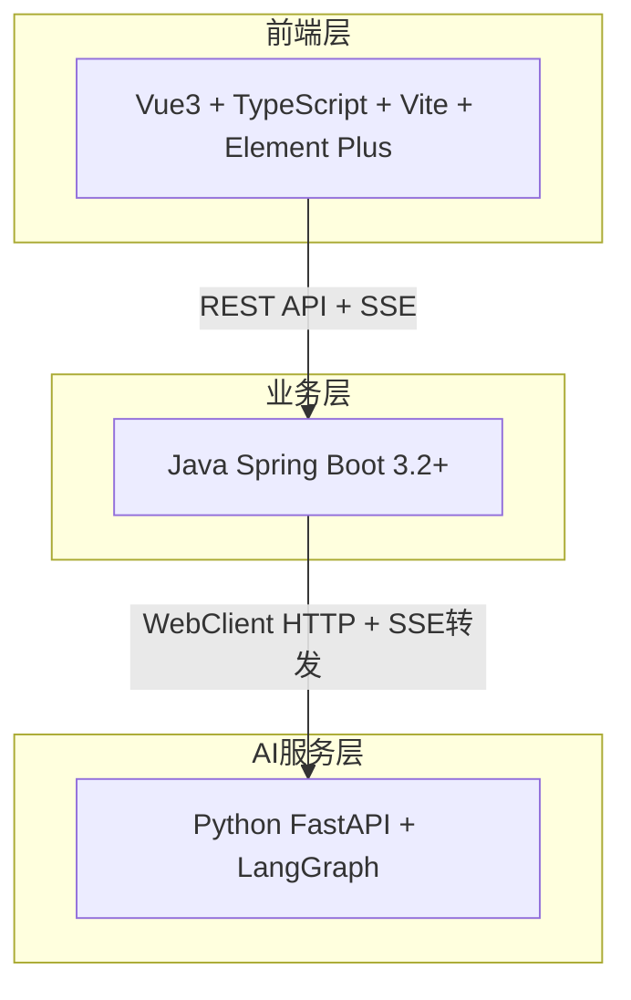
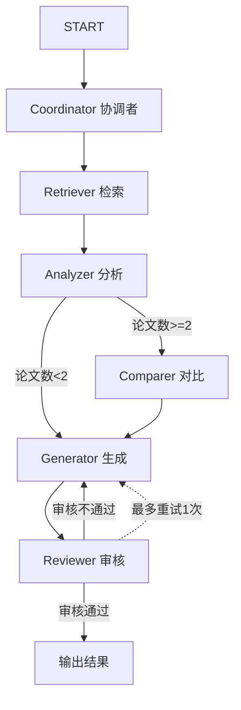
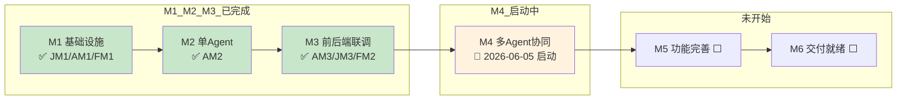
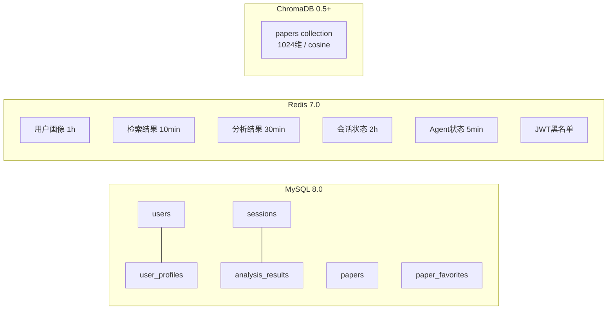
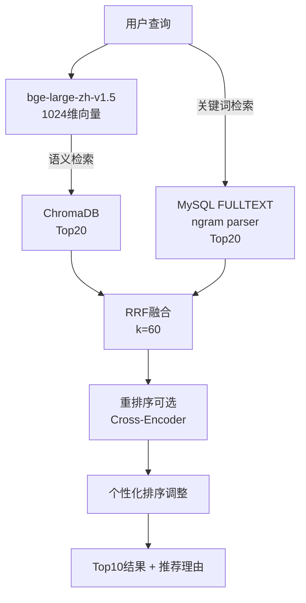

<div align="center">

# Veritas（求真）

**科研文献智能助手 — 领域知识个性化生成与多智能体协同决策系统**

课题编号：XH-202630 | 发榜单位：上海云之脑智能科技有限公司（科大讯飞全资子公司）

</div>


<br />

***

## 项目简介

Veritas（求真）是一个面向科研文献分析领域的**多智能体协同系统**。研究者输入研究主题后，6个AI Agent自动协作完成**文献检索、内容分析、知识提取、综述生成**，并根据研究者的方向和水平输出个性化的文献分析报告。


### 四大创新点

| 创新点                | 说明                                |
| ------------------ | --------------------------------- |
| **科研场景多Agent分工协同** | 6个专业Agent（协调者/检索/分析/对比/生成/审核）协同工作 |
| **用户画像驱动的个性化生成**   | 4维度画像（学历/方向/水平/风格）→ Prompt适配      |
| **论文矛盾自动发现**       | 对比Agent检测不同论文间的观点冲突               |
| **Agent协同过程可视化**   | ECharts流程图 + SSE实时推送执行状态          |

***

## 系统架构



| 层级    | 技术栈                                                         | 职责                         |
| ----- | ----------------------------------------------------------- | -------------------------- |
| 前端层   | Vue3 + TypeScript + Vite + Element Plus + ECharts + Pinia   | 用户交互、可视化、状态管理              |
| 业务层   | Java Spring Boot 3.2+ + Spring Data JPA + Spring Data Redis | 用户认证、论文管理、会话管理、缓存、AI服务代理   |
| AI服务层 | Python FastAPI + LangGraph + ChromaDB + bge-large-zh-v1.5   | 多Agent编排、RAG检索、LLM调用、个性化生成 |

***

## 多Agent协同引擎



| Agent       | 角色  | 职责          | 超时  |
| ----------- | --- | ----------- | --- |
| Coordinator | 协调者 | 任务分解与调度     | 30s |
| Retriever   | 检索员 | 语义+关键词混合检索  | 30s |
| Analyzer    | 分析员 | 深度文献分析（5维度） | 30s |
| Comparer    | 对比员 | 多文献对比+矛盾发现  | 30s |
| Generator   | 生成员 | 个性化综述生成     | 30s |
| Reviewer    | 审核员 | 质量审核与反馈     | 30s |

### 降级策略

| 级别     | 触发条件        | 降级行为                              |
| ------ | ----------- | --------------------------------- |
| Agent级 | 单Agent超时30s | 跳过该Agent，继续后续流程                   |
| 工作流级   | 多Agent失败    | 降级为单Agent模式（仅Retriever+Generator） |
| LLM级   | 连续3次调用失败    | 软件方模型 → 外接API → 用户本地模型            |

***

## 技术栈

| 层级        | 技术                                        | 版本            |
| --------- | ----------------------------------------- | ------------- |
| 前端        | Vue3 + Composition API + `<script setup>` | 3.5+          |
| 前端        | TypeScript                                | 6.0+          |
| 前端        | Vite                                      | 8.0+          |
| 前端        | Element Plus                              | 2.14+         |
| 前端        | ECharts                                   | 5.6+          |
| 前端        | Pinia                                     | 2.3+          |
| 前端        | Axios                                     | 1.16+         |
| 前端        | markdown-it                               | 14.2+         |
| 后端        | Java                                      | 17            |
| 后端        | Spring Boot                               | 3.2.5         |
| 后端        | Spring Data JPA / Redis                   | —             |
| 后端        | JJWT                                      | 0.12.5        |
| 后端        | MapStruct                                 | 1.5.5         |
| AI服务      | Python                                    | 3.10+         |
| AI服务      | FastAPI                                   | 0.115+        |
| AI服务      | LangGraph                                 | 0.2.28        |
| AI服务      | LangChain                                 | 0.3.0         |
| AI服务      | ChromaDB                                  | 0.5+          |
| AI服务      | Pydantic                                  | 2.9+          |
| AI服务      | sentence-transformers                     | 3.1+          |
| 数据库       | MySQL                                     | 8.0           |
| 数据库       | Redis                                     | 7.0           |
| 向量库       | ChromaDB                                  | 0.5+          |
| 图数据库      | Neo4j                                     | 5.x Community |
| Embedding | bge-large-zh-v1.5                         | 1024维         |
| 部署        | Docker Compose                            | —             |

***

## 当前开发进度

> 最后更新：2026-06-05

### M1/M2/M3 已完成 ✅，M4 启动中 🔄



**关键里程碑摘要**：

- **M1 ✅**：MySQL 6 表 + 全文索引 / Redis / ChromaDB / Java+Python+前端 3 骨架 / Embedding(text-embedding-v4 1024维) / LLM 三路降级 / 6 Prompt 模板
- **M2 ✅**：200+ 论文向量入库 / SearchService(RRF+重排序) / 3-Agent(Retriever/Analyzer/Generator) / LangGraph 基础流程 / PersonalizationService
- **M3 ✅**：12 项验收 12/12 / 统一响应 + 422 中文友好 + Enum 严格校验 / SSE 7 事件 + ping + 重连 / 健康检查 6 组件 / 模型状态 12 字段 / 三级降级链 / Java→Python 联调 / 全链路注册→登录→检索→分析打通

### 各模块实现状态

| 模块                  | 骨架 | 数据层 | 服务层 | API层 | 前端页面 |
| ------------------- | -- | --- | --- | ---- | ---- |
| Backend (Java)      | ✅  | ✅   | ✅   | ✅    | —    |
| AI Service (Python) | ✅  | ✅   | ✅   | ✅    | —    |
| Frontend (Vue3)     | ✅  | —   | ✅   | ✅    | 🔄   |
| Docker/Deploy       | ✅  | —   | —   | —    | —    |

> ✅ 完成 | 🔄 部分完成（M4 进行中）| ⬜ 未开始

### Backend (Java) 详细状态

| 层级            | 状态 | 说明                                                                                         |
| ------------- | -- | ------------------------------------------------------------------------------------------ |
| 配置层 (config/) | ✅  | Security/Redis/WebClient/CORS/JWT全部配置                                                      |
| Entity层       | ✅  | 6个实体+枚举+JPA转换器                                                                             |
| Repository层   | ✅  | 8个Repository含自定义FULLTEXT查询                                                                 |
| DTO层          | ✅  | 全套请求/响应DTO + AnalysisResultDTO + AgentStateResponse + AgentSseEvent + ModelStatusDTO(12字段) |
| 异常层           | ✅  | 全局异常处理+5个业务异常 + GlobalExceptionHandler                                                     |
| 过滤器层          | ✅  | JWT认证+请求ID                                                                                 |
| 工具层           | ✅  | JWT/RedisKey/DateTime                                                                      |
| Service层      | ✅  | User/Paper/Session/Analysis/AgentClient(三级降级+Redis缓存回退)                                    |
| Controller层   | ✅  | Health/User/Paper/Session/Analysis(含SSE转发端点)                                               |
| Client层       | ✅  | PythonAIClient(普通+analyzeStream 150s超时)                                                    |
| Mapper层       | ✅  | MapStruct映射器                                                                               |

### AI Service (Python) 详细状态

| 模块           | 状态 | 说明                                                                                   |
| ------------ | -- | ------------------------------------------------------------------------------------ |
| FastAPI骨架    | ✅  | 入口+路由+生命周期+异常处理 + 6 异常类                                                              |
| 配置系统         | ✅  | pydantic-settings + .env                                                             |
| 日志系统         | ✅  | loguru控制台+文件轮转                                                                       |
| Embedding服务  | ✅  | DashScope API优先（text-embedding-v4 1024维）                                             |
| 向量存储服务       | ✅  | ChromaDB PersistentClient + 1024维校验 + HNSW cosine                                    |
| LLM服务        | ✅  | 三路Provider(Builtin/API/Local) + 5分钟自动恢复 + DeepSeek V4 Flash 当前生效                     |
| Prompt管理     | ✅  | 6个模板文件(coordinator/retriever/analyzer/comparer/generator/reviewer)                   |
| API端点        | ✅  | 7 端点(analyze/analyze-stream/search/search-hybrid/search-suggest/model-status/health) |
| Pydantic模型   | ✅  | AnalyzeRequest+Alias / SearchRequest / ModelStatusResponse(12字段)                     |
| Agent模块      | ✅  | 3-Agent(Retriever/Analyzer/Generator) + BaseAgent超时30s + AgentOrchestrator(SSE 7 事件) |
| LangGraph工作流 | ✅  | graph.py 顺序图(retrieve→analyze→generate) + Orchestrator 流式版                           |
| 个性化引擎        | ✅  | PersonalizationService(4维度画像+术语密度+DIFFICULTY\_MAP+STYLE\_MAP)                        |
| 论文数据         | ✅  | data/papers/sample\_papers.json + 200+篇实测入库                                          |
| Reranker     | ✅  | RRF(0.5) + 领域匹配(0.3) + 流行度(0.2)                                                      |
| 三级降级         | ✅  | LLM 3 路 + Agent 跳过 + 全流程 120s 超时 + 降级 DTO                                            |

### Frontend (Vue3) 详细状态

| 模块        | 状态 | 说明                                              |
| --------- | -- | ----------------------------------------------- |
| 项目骨架      | ✅  | Vite+Vue3+TS+Element Plus+ECharts+Pinia         |
| 路由系统      | ✅  | 9条路由+认证守卫+懒加载                                   |
| API层      | ✅  | Axios实例+JWT拦截+4个API模块(user/paper/session/agent) |
| 状态管理      | ✅  | 4个Pinia Store(user/paper/session/agent)         |
| 类型定义      | ✅  | 6个TypeScript类型文件                                |
| 布局组件      | ✅  | Header+Footer                                   |
| 登录/注册页    | ✅  | FM2 已通过                                         |
| 画像设置页     | ✅  | FM2 已通过                                         |
| 首页+检索结果页  | ✅  | FM2 已通过                                         |
| 论文详情+分析卡片 | ✅  | FM2 已通过                                         |
| 业务组件      | 🔄 | FM3 启动中（论文选择器、对比表格待开发）                          |

***

## 项目目录结构

```
Veritas(求真)/
├── docs/                                    # 项目文档
│   ├── XH-202630-科研文献助手/              # 阶段文档
│   │   ├── 01-策划阶段/                     # 策划案、需求规格说明书
│   │   ├── 02-设计阶段/                     # 架构设计、模块清单
│   │   ├── 03-开发阶段/                     # 功能实现顺序、技术栈
│   │   ├── 04-学习资料/                     # 零基础学习路线图
│   │   └── 05-风险管理/                     # 风险清单、项目方案
│   ├── backend/                             # Java后端架构文档+里程碑文档
│   ├── ai-service/                          # AI服务架构文档+里程碑文档
│   ├── frontend/                            # 前端架构文档+里程碑文档
│   ├── database/                            # 数据库设计文档
│   ├── 信息架构文档(IA).md
│   ├── 开发规范文档.md
│   ├── 架构决策记录(ADR).md
│   ├── 版本里程碑功能清单.md
│   ├── 项目模块功能与联系文档.md
│   └── 项目里程碑文档.md
├── Veritas/                                 # 主项目代码
│   ├── backend/                             # Java后端
│   │   ├── Dockerfile
│   │   ├── pom.xml
│   │   └── src/main/java/com/literatureassistant/
│   │       ├── LiteratureAssistantApplication.java
│   │       ├── config/                      # Security/Redis/WebClient/CORS配置
│   │       ├── controller/                  # HealthController（业务API待开发）
│   │       ├── service/                     # ⬜ 待开发
│   │       ├── repository/                  # 8个Repository含FULLTEXT搜索
│   │       ├── entity/                      # 6个JPA实体
│   │       ├── dto/                         # 通用DTO完成，请求/响应DTO待开发
│   │       │   ├── common/                  # ApiResponse / ErrorCode / PageResponse
│   │       │   ├── request/                 # ⬜ 待开发
│   │       │   └── response/                # ⬜ 待开发
│   │       ├── client/                      # ⬜ AI服务客户端待开发
│   │       ├── mapper/                      # ⬜ MapStruct映射器待开发
│   │       ├── filter/                      # JwtAuthFilter / RequestIdFilter
│   │       ├── exception/                   # 全局异常处理+5个业务异常
│   │       ├── enums/                       # 完整枚举体系+JPA转换器
│   │       ├── aspect/                      # ⬜ 待开发
│   │       └── util/                        # JwtUtil / RedisKeyUtil / DateTimeUtil
│   │   └── src/main/resources/
│   │       ├── application.yml
│   │       └── db/                          # 01_create_tables / 02_indexes / 03_seed_data
│   ├── ai-service/                          # Python AI服务
│   │   ├── Dockerfile
│   │   ├── requirements.txt
│   │   ├── .env.example
│   │   ├── app/
│   │   │   ├── main.py                      # FastAPI入口+健康检查
│   │   │   ├── exception.py                 # 5个自定义异常
│   │   │   ├── core/
│   │   │   │   ├── config.py                # pydantic-settings配置
│   │   │   │   ├── events.py                # 启动/关闭生命周期
│   │   │   │   └── logging.py               # loguru日志配置
│   │   │   ├── api/
│   │   │   │   ├── router.py                # API路由注册
│   │   │   │   └── endpoints/               # agent / search / model
│   │   │   ├── services/                    # 服务层
│   │   │   │   ├── llm_service.py           # 三路Provider+降级+恢复
│   │   │   │   ├── embedding_service.py     # DashScope API+本地bge双模式
│   │   │   │   ├── vector_store_service.py  # ChromaDB CRUD+搜索
│   │   │   │   └── prompt_manager.py        # Prompt模板加载
│   │   │   ├── agents/                      # ⬜ 6个Agent待开发
│   │   │   ├── models/
│   │   │   │   └── schemas.py               # Pydantic数据模型
│   │   │   └── utils/                       # ⬜ 待开发
│   │   ├── prompts/                         # 6个Prompt模板
│   │   │   ├── coordinator.txt / retriever.txt / analyzer.txt
│   │   │   └── comparer.txt / generator.txt / reviewer.txt
│   │   ├── data/papers/                     # ⬜ 论文数据待采集
│   │   ├── scripts/                         # ⬜ 数据处理脚本待开发
│   │   └── tests/                           # 7个测试文件
│   ├── frontend/                            # 前端
│   │   ├── Dockerfile
│   │   ├── package.json
│   │   ├── vite.config.ts
│   │   ├── tsconfig.json
│   │   ├── .env.development
│   │   └── src/
│   │       ├── main.ts                      # 应用入口
│   │       ├── App.vue                      # 根组件(Header+RouterView+Footer)
│   │       ├── env.d.ts                     # 环境类型声明
│   │       ├── router/index.ts              # 9条路由+认证守卫
│   │       ├── api/                         # Axios实例+4个API模块
│   │       │   ├── index.ts                 # Axios实例+JWT拦截器
│   │       │   ├── user.ts / paper.ts / session.ts / analysis.ts
│   │       ├── stores/                      # 4个Pinia Store
│   │       │   ├── userStore.ts / paperStore.ts / sessionStore.ts / agentStore.ts
│   │       ├── types/                       # 6个TypeScript类型文件
│   │       │   ├── user.ts / paper.ts / session.ts / analysis.ts / agent.ts / common.ts
│   │       ├── views/                       # 页面组件
│   │       │   ├── HomeView.vue             # ✅ 首页(搜索框+最近搜索)
│   │       │   └── 8个占位页面              # ⬜ 待开发
│   │       ├── components/
│   │       │   ├── layout/                  # ✅ AppHeader + AppFooter
│   │       │   └── agent/analysis/common/paper/report/  # ⬜ 待开发
│   │       ├── composables/                 # ⬜ useSSE等待开发
│   │       ├── utils/                       # ⬜ 待开发
│   │       └── styles/                      # global.scss + variables.scss
│   ├── docker-compose.yml                   # Docker编排（5服务）
│   ├── .env.example                         # 环境变量模板
│   └── nginx.conf                           # Nginx反向代理+SSE支持
├── json_prompt/                             # AI Coding提示词
├── log/                                     # 开发日志
├── .gitignore
├── AGENTS.md                                # AI Agent全景上下文
└── README.md                                # 本文件
```

***

## 快速开始

### 环境要求

| 依赖             | 版本要求  |
| -------------- | ----- |
| JDK            | 17+   |
| Python         | 3.10+ |
| Node.js        | 18+   |
| Docker         | 20+   |
| Docker Compose | 2.0+  |

### 1. 克隆项目

```bash
git clone <repository-url>
cd Veritas\(求真\)
```

### 2. 配置环境变量

```bash
cd Veritas
cp .env.example .env
# 编辑 .env 填写实际配置
```

关键环境变量说明：

```bash
# 数据库
MYSQL_ROOT_PASSWORD=your_password
MYSQL_DATABASE=literature_assistant

# Redis
REDIS_HOST=redis
REDIS_PORT=6379

# JWT
JWT_SECRET=your_jwt_secret

# AI服务
AI_SERVICE_URL=http://ai-service:8000

# LLM配置（三路降级，默认auto模式优先使用软件方模型）
LLM_MODE=auto                    # auto|builtin|api|local
LLM_BUILTIN_URL=https://llm.literature-assistant.com/v1
LLM_API_KEY=                     # 外接API密钥（可选）
LLM_API_BASE=                    # 外接API端点（可选）
LLM_MODEL_NAME=                  # 外接API模型名（可选）

# Embedding
CHROMA_PATH=./data/vector_db
EMBEDDING_MODEL_NAME=BAAI/bge-large-zh-v1.5
```

### 3. Docker Compose 一键启动

```bash
cd Veritas
docker-compose up -d
```

启动顺序：`mysql → redis → ai-service → java-backend → frontend`

### 4. 验证服务

```bash
# Java后端健康检查
curl http://localhost:8080/actuator/health

# Python AI服务健康检查
curl http://localhost:8000/health

# 前端访问
open http://localhost
```

### 本地开发模式

如需本地开发调试（非Docker），分别启动各服务：

```bash
# 1. 启动MySQL和Redis（Docker）
cd Veritas
docker-compose up -d mysql redis

# 2. 启动Python AI服务
cd Veritas/ai-service
pip install -r requirements.txt
uvicorn app.main:app --host 0.0.0.0 --port 8000 --reload

# 3. 启动Java后端
cd Veritas/backend
./mvnw spring-boot:run -Dspring-boot.run.profiles=dev

# 4. 启动前端
cd Veritas/frontend
npm install
npm run dev
```

***

## API概览

### Java后端API

| 接口                                        | 方法           | 说明       | 状态            |
| ----------------------------------------- | ------------ | -------- | ------------- |
| `/api/users/register`                     | POST         | 用户注册     | ✅（JM2 通过）     |
| `/api/users/login`                        | POST         | 用户登录     | ✅（JM2 通过）     |
| `/api/users/{userId}/profile`             | GET/POST/PUT | 画像CRUD   | ✅（JM2 通过）     |
| `/api/papers`                             | GET          | 论文列表（分页） | ✅             |
| `/api/papers/{paperId}`                   | GET          | 论文详情     | ✅             |
| `/api/papers/search`                      | GET          | 论文搜索     | ✅             |
| `/api/papers/{paperId}/favorite`          | POST/DELETE  | 收藏/取消    | ⬜（M5）         |
| `/api/sessions`                           | POST/GET     | 创建/列表会话  | ✅             |
| `/api/sessions/{sessionId}`               | GET/DELETE   | 详情/删除    | ✅             |
| `/api/analysis/paper`                     | POST         | 论文分析     | ✅             |
| `/api/analysis/compare`                   | POST         | 对比分析     | ⬜（M4）         |
| `/api/analysis/report`                    | POST         | 综述生成     | ✅             |
| `/api/analysis/{analysisId}`              | GET          | 分析结果     | ✅             |
| `/api/analysis/{analysisId}/status`       | GET          | 分析状态     | ✅             |
| `/api/analysis/{analysisId}/agent-stream` | GET(SSE)     | Agent状态流 | ✅（JM3 阶段前置实现） |

### Python AI服务API

| 接口                          | 方法        | 说明         | 状态 |
| --------------------------- | --------- | ---------- | -- |
| `/api/agent/analyze`        | POST      | 启动Agent工作流 | ✅  |
| `/api/agent/analyze/stream` | POST(SSE) | Agent状态流   | ✅  |
| `/api/search`               | POST      | 语义检索       | ✅  |
| `/api/search/hybrid`        | POST      | 混合检索       | ✅  |
| `/api/search/suggest`       | GET       | 检索建议       | ✅  |
| `/api/model/status`         | GET       | 模型状态（12字段） | ✅  |
| `/health`                   | GET       | 健康检查（6组件）  | ✅  |

### 统一响应格式

```json
{
  "code": 200,
  "message": "success",
  "data": {},
  "timestamp": "2026-05-24T10:00:00Z"
}
```

***

## 数据存储架构



| 存储       | 用途    | 核心表/Key                                                                             |
| -------- | ----- | ----------------------------------------------------------------------------------- |
| MySQL    | 结构化数据 | users, user\_profiles, papers, sessions, analysis\_results, paper\_favorites        |
| Redis    | 缓存/会话 | user:profile:*, search:result:*, analysis:result:*, session:state:*, agent:state:\* |
| ChromaDB | 向量检索  | papers collection (1024维, cosine, HNSW M=16)                                        |

***

## 个性化引擎

用户画像4维度驱动内容个性化：

| 维度   | 字段               | 枚举值                                         | 个性化策略                                     |
| ---- | ---------------- | ------------------------------------------- | ----------------------------------------- |
| 学历层次 | education\_level | undergraduate / master / phd / faculty      | 通俗解释+类比 / 方法对比+代码 / 前沿分析+创新建议 / 知识体系+教学案例 |
| 研究方向 | research\_field  | NLP / CV / RL / 多模态 / ...                   | 检索排序权重、领域上下文注入                            |
| 知识水平 | knowledge\_level | beginner / intermediate / advanced / expert | 术语密度<5% / \~20% / \~40% / >50%            |
| 偏好风格 | preferred\_style | simple / balanced / technical               | 日常用语+比喻 / 标准学术 / 正式学术+引用                  |

***

## 里程碑与开发计划

| 版本   | 里程碑         | 时间         | 核心交付                                | 状态                 |
| ---- | ----------- | ---------- | ----------------------------------- | ------------------ |
| v0.1 | M1 基础设施就绪   | Week 1-2   | 数据库+模型+3个项目骨架+Docker Compose        | ✅ 已完成              |
| v0.2 | M2 单Agent可用 | Week 3-4   | RAG检索+检索/分析/生成3个Agent+LangGraph基础流程 | ✅ 已完成（代码就绪，待数据实测）  |
| v0.3 | M3 前后端联调    | Week 5-6   | 用户认证+论文管理+前端基础页面+全链路联调              | ✅ 已完成（12/12验收通过）   |
| v0.4 | M4 多Agent协同 | Week 7-8   | 6-Agent完整工作流+降级机制+个性化引擎+SSE推送       | 🔄 启动中（2026-06-05） |
| v0.5 | M5 功能完整     | Week 9-10  | Agent可视化+报告导出+引用溯源+矛盾发现+筛选排序        | ⬜ 未开始              |
| v1.0 | M6 交付就绪     | Week 11-14 | 性能优化+测试+技术报告+演示视频+答辩PPT             | ⬜ 未开始              |

**关键路径**：M1→M2→M3→M4→M5→M6，最关键里程碑为M4（多Agent协同）。
**当前进度**：3/6 里程碑完成，M4 启动准备就绪。

### M4 启动项（2026-06-05 起）

| 任务                   | 优先级 | 说明                           |
| -------------------- | --- | ---------------------------- |
| CoordinatorAgent     | P0  | 任务分解与调度，汇总多Agent结果           |
| ComparerAgent        | P1  | 对比2-5篇论文+矛盾检测                |
| ReviewerAgent        | P1  | 引用核查+事实审核                    |
| 6-Agent 完整 LangGraph | P0  | 条件边（论文≥2 → 对比）+ 审核重试(最多1次)   |
| AnalyzerAgent 并行化    | P1  | asyncio.gather + 信号量(并发=3)   |
| 分析结果摘要注入             | P1  | 按 5 维度压缩后注入 Generator Prompt |
| LLM Token 监控         | P1  | Prometheus 暴露 usage 指标       |

***

## 混合检索架构（RAG）



***

## 验收标准

| 验收项           | 目标值   |
| ------------- | ----- |
| 智能检索 Top10相关性 | >80%  |
| 论文分析5维度准确率    | >85%  |
| 个性化综述差异度      | >60%  |
| 知识溯源引用正确率     | >90%  |
| 检索响应          | ≤3秒   |
| 分析响应          | ≤30秒  |
| 综述生成          | ≤60秒  |
| 流式首字节         | ≤2秒   |
| 95%请求响应       | ≤5秒   |
| 并发能力          | ≥50用户 |
| 缓存命中率         | >50%  |

***

## 文档索引

| 文档          | 路径                                                                                           |
| ----------- | -------------------------------------------------------------------------------------------- |
| 项目策划案       | [docs/XH-202630-科研文献助手/01-策划阶段/01-项目策划案.md](docs/XH-202630-科研文献助手/01-策划阶段/01-项目策划案.md)       |
| 需求规格说明书     | [docs/XH-202630-科研文献助手/01-策划阶段/02-需求规格说明书.md](docs/XH-202630-科研文献助手/01-策划阶段/02-需求规格说明书.md)   |
| 系统架构设计文档    | [docs/XH-202630-科研文献助手/02-设计阶段/03-系统架构设计文档.md](docs/XH-202630-科研文献助手/02-设计阶段/03-系统架构设计文档.md) |
| 模块清单        | [docs/XH-202630-科研文献助手/02-设计阶段/04-模块清单.md](docs/XH-202630-科研文献助手/02-设计阶段/04-模块清单.md)         |
| 功能实现顺序      | [docs/XH-202630-科研文献助手/03-开发阶段/05-功能实现顺序.md](docs/XH-202630-科研文献助手/03-开发阶段/05-功能实现顺序.md)     |
| 技术栈         | [docs/XH-202630-科研文献助手/03-开发阶段/06-技术栈.md](docs/XH-202630-科研文献助手/03-开发阶段/06-技术栈.md)           |
| 零基础学习路线图    | [docs/XH-202630-科研文献助手/04-学习资料/07-零基础学习路线图.md](docs/XH-202630-科研文献助手/04-学习资料/07-零基础学习路线图.md) |
| 潜在风险清单      | [docs/XH-202630-科研文献助手/05-风险管理/08-潜在风险清单.md](docs/XH-202630-科研文献助手/05-风险管理/08-潜在风险清单.md)     |
| 项目方案        | [docs/XH-202630-科研文献助手/05-风险管理/09-项目方案.md](docs/XH-202630-科研文献助手/05-风险管理/09-项目方案.md)         |
| Java后端架构文档  | [docs/backend/Java后端模块系统架构文档.md](docs/backend/Java后端模块系统架构文档.md)                             |
| Java后端里程碑文档 | [docs/backend/Java后端模块项目里程碑文档.md](docs/backend/Java后端模块项目里程碑文档.md)                           |
| AI服务架构文档    | [docs/ai-service/AI服务模块系统架构文档.md](docs/ai-service/AI服务模块系统架构文档.md)                           |
| AI服务里程碑文档   | [docs/ai-service/AI服务模块项目里程碑文档.md](docs/ai-service/AI服务模块项目里程碑文档.md)                         |
| 前端架构文档      | [docs/frontend/前端模块系统架构文档.md](docs/frontend/前端模块系统架构文档.md)                                   |
| 前端里程碑文档     | [docs/frontend/前端模块项目里程碑文档.md](docs/frontend/前端模块项目里程碑文档.md)                                 |
| 数据库设计文档     | [docs/database/数据库设计文档.md](docs/database/数据库设计文档.md)                                         |
| 信息架构文档      | [docs/信息架构文档(IA).md](docs/信息架构文档\(IA\).md)                                                   |
| 开发规范文档      | [docs/开发规范文档.md](docs/开发规范文档.md)                                                             |
| 架构决策记录      | [docs/架构决策记录(ADR).md](docs/架构决策记录\(ADR\).md)                                                 |
| 版本里程碑功能清单   | [docs/版本里程碑功能清单.md](docs/版本里程碑功能清单.md)                                                       |
| 项目模块功能与联系文档 | [docs/项目模块功能与联系文档.md](docs/项目模块功能与联系文档.md)                                                   |
| 项目里程碑文档     | [docs/项目里程碑文档.md](docs/项目里程碑文档.md)                                                           |

***

## Git规范

### 分支策略

```
main        ─── 生产分支
  └── develop ─── 开发分支
        ├── feature/xxx ─── 功能分支
        ├── fix/xxx     ─── 修复分支
        └── refactor/xxx ── 重构分支
```

### Commit格式

```
<type>(<scope>): <subject>

类型：feat / fix / docs / style / refactor / perf / test / chore
范围：frontend / backend / ai-service / database / deploy / docs
```

***

## 安全规范

| 安全项     | 措施                            |
| ------- | ----------------------------- |
| 密码存储    | BCrypt哈希，盐值随机                 |
| 认证      | JWT Token (24h有效期) + Redis黑名单 |
| 传输加密    | 生产环境HTTPS                     |
| SQL注入防护 | JPA参数化查询，禁止SQL拼接              |
| XSS防护   | 前端输入转义                        |
| 数据隔离    | 用户只能访问自己的会话和分析结果              |
| 敏感配置    | .env环境变量注入，不硬编码               |
| AI内容标注  | 生成内容标注"AI生成，仅供参考"             |

***

## License

本项目为 XH-202630 课题参赛作品，版权归属项目团队所有。
