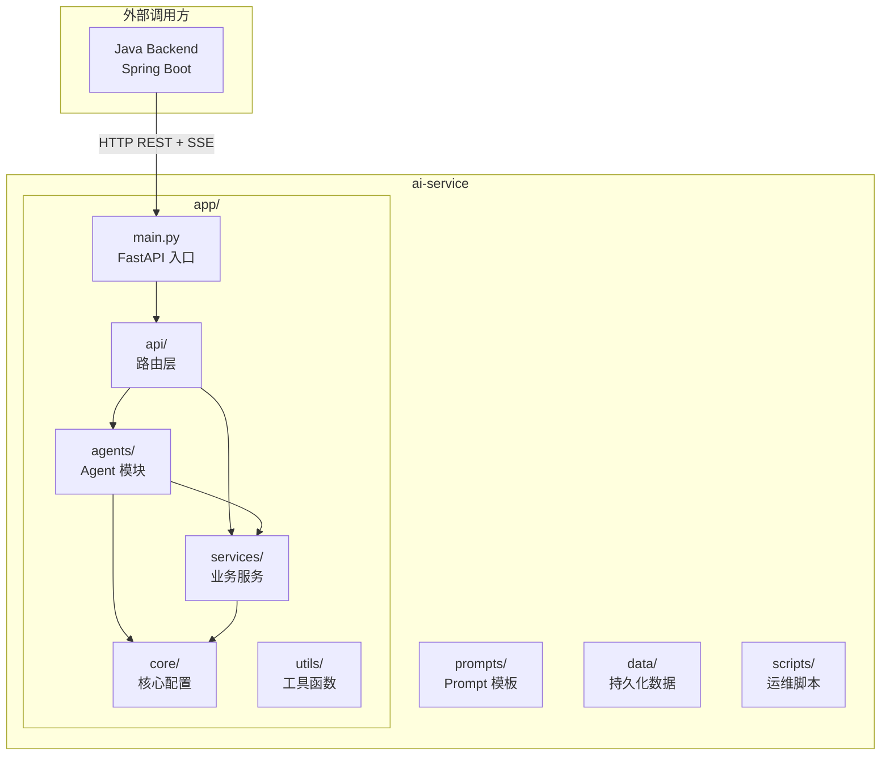

# AI Service — 智能文献助手 Python AI 服务

## 1 项目概述

AI Service 是"XH-202630 科研文献智能助手"项目的 **AI 服务层**，基于 **Python FastAPI + LangGraph** 构建。本服务负责多 Agent 工作流编排、RAG 语义检索、LLM 调用、个性化综述生成等核心 AI 能力。

| 属性 | 值 |
|------|-----|
| **运行环境** | Python 3.10+ |
| **Web 框架** | FastAPI 0.115+ |
| **Agent 编排** | LangGraph 0.2+ |
| **向量数据库** | ChromaDB 0.5+ |
| **Embedding 模型** | bge-large-zh-v1.5 (1024维) |
| **默认端口** | 8000 |
| **日志框架** | Loguru |

---

## 2 整体架构



---

## 3 完整目录树

```
ai-service/
├── README.md                          # 本文件 — 模块说明文档
├── requirements.txt                   # Python 依赖清单
├── .env.example                       # 环境变量模板
├── .gitignore                         # Git 忽略规则
│
├── app/                               # 主应用包
│   ├── __init__.py                    # 包标记（空文件）
│   ├── main.py                        # FastAPI 应用入口
│   ├── exception.py                   # 自定义异常体系
│   │
│   ├── api/                           # API 路由层
│   │   ├── __init__.py                # 包标记
│   │   ├── router.py                  # 顶层路由聚合
│   │   └── endpoints/                 # 各业务端点
│   │       ├── __init__.py            # 包标记
│   │       ├── agent.py               # Agent 工作流端点
│   │       ├── search.py              # 语义检索端点
│   │       └── model.py               # 模型状态端点
│   │
│   ├── core/                          # 核心配置层
│   │   ├── __init__.py                # 包标记
│   │   ├── config.py                  # 应用配置（pydantic-settings）
│   │   ├── events.py                  # 启动/关闭生命周期事件
│   │   └── logging.py                 # 日志系统配置
│   │
│   ├── agents/                        # 多 Agent 模块
│   │   └── __init__.py                # 包标记（Agent 待实现）
│   │
│   ├── services/                      # 业务服务层
│   │   └── __init__.py                # 包标记（服务待实现）
│   │
│   └── utils/                         # 工具函数
│       └── __init__.py                # 包标记（工具待实现）
│
├── data/                              # 持久化数据目录
│   └── papers/                        # 论文文件存储
│       └── .gitkeep                   # 保持目录在 Git 中可见
│
├── prompts/                           # Prompt 模板目录
│   └── .gitkeep                       # 保持目录在 Git 中可见
│
├── scripts/                           # 运维/工具脚本
│   └── .gitkeep                       # 保持目录在 Git 中可见
│
└── tests/                             # 测试代码
    └── __init__.py                    # 包标记（测试待实现）
```

---

## 4 根目录文件详解

### 4.1 `requirements.txt` — Python 依赖清单

定义了项目的全部 Python 依赖，按功能分组：

| 分类 | 核心依赖 | 用途 |
|------|---------|------|
| **Web 框架** | `fastapi`, `uvicorn`, `python-multipart`, `sse-starlette` | FastAPI 应用 + SSE 流式推送 |
| **AI/ML** | `langgraph`, `langchain`, `langchain-community`, `transformers`, `torch`, `sentence-transformers` | 多 Agent 编排 + LLM 调用 + Embedding |
| **向量数据库** | `chromadb` | 向量存储与语义检索 |
| **LLM API** | `openai`, `httpx` | 兼容 OpenAI 的 API 调用 + HTTP 客户端 |
| **数据处理** | `pydantic`, `pydantic-settings`, `numpy` | 数据模型校验 + 配置管理 + 数值计算 |
| **PDF 处理** | `pymupdf` | PDF 论文解析 |
| **arXiv** | `arxiv` | arXiv 论文检索 API |
| **工具** | `python-dotenv`, `loguru` | 环境变量加载 + 结构化日志 |
| **测试** | `pytest`, `pytest-asyncio` | 异步测试框架 |

### 4.2 `.env.example` — 环境变量模板

提供完整的环境变量配置示例，分为 7 个配置区：

- **应用配置**: `APP_NAME`, `DEBUG`, `HOST`, `PORT`
- **ChromaDB 配置**: 向量数据库存储路径
- **Embedding 配置**: 模型路径、设备、备选 API
- **LLM 配置**: 三路 Provider 降级链（软件方模型 → 外接 API → 本地模型）
- **Agent 配置**: 超时、全流程超时、最大重生成次数
- **日志配置**: 级别控制

使用方法：
```bash
cp .env.example .env
# 编辑 .env 填入实际配置
```

### 4.3 `.gitignore` — Git 忽略规则

忽略以下内容不纳入版本控制：

- Python 编译缓存 (`__pycache__/`, `*.pyc`)
- 敏感配置 (`.env`)
- 虚拟环境 (`.venv/`, `env/`)
- 构建产物 (`dist/`, `build/`, `*.egg-info/`)
- 向量数据库持久化数据 (`data/vector_db/`)
- 模型文件 (`models/`)
- 日志文件 (`*.log`, `logs/`)
- 系统文件 (`.DS_Store`)
- 测试缓存 (`.pytest_cache/`)

---

## 5 `app/` — 主应用包详解

### 5.1 `app/main.py` — FastAPI 应用入口

**职责**: 创建 FastAPI 实例、注册路由、配置生命周期、全局异常处理。

关键代码结构：

```
FastAPI 应用实例 (lifespan 管理)
├── POST /api/agent/analyze       → agent.router
├── POST /api/search/              → search.router
├── GET  /api/model/status         → model.router
├── GET  /health                   → 健康检查
├── 异常处理器: AIServiceException  → JSON 统一响应
└── 异常处理器: RequestValidationError → 422 校验失败
```

- **Lifespan**: 使用 `@asynccontextmanager` 管理启动/关闭生命周期，分别调用 `on_startup()` 和 `on_shutdown()`
- **健康检查 `/health`**: 返回服务状态、时间戳、LLM/Embedding/ChromaDB 加载状态
- **异常处理**: 将 `AIServiceException` 和 `RequestValidationError` 转为统一 JSON 响应格式

### 5.2 `app/exception.py` — 自定义异常体系

定义了分层异常类，用于业务逻辑中的错误传递：

```
AIServiceException (基类, code + message)
├── LLMException              (code=503)  LLM 调用失败
├── VectorStoreException       (code=503)  向量数据库异常
├── AgentTimeoutException      (code=408)  Agent 执行超时
└── ModelNotLoadedException    (code=503)  模型未加载
```

所有异常在 `main.py` 中被全局异常处理器捕获，统一转换为标准 JSON 响应格式。

---

## 6 `app/core/` — 核心配置层详解

### 6.1 `app/core/config.py` — 应用配置

使用 `pydantic-settings` 的 `BaseSettings` 从环境变量/`.env` 文件加载配置。核心配置项：

| 配置项 | 默认值 | 说明 |
|--------|--------|------|
| `APP_NAME` | Literature Assistant AI Service | 应用名称 |
| `DEBUG` | `False` | 调试模式开关 |
| `HOST` / `PORT` | `0.0.0.0` / `8000` | 服务监听地址 |
| `CHROMA_PATH` | `./data/vector_db` | ChromaDB 存储路径 |
| `EMBEDDING_MODEL_PATH` | `BAAI/bge-large-zh-v1.5` | Embedding 模型 |
| `EMBEDDING_DEVICE` | `cpu` | Embedding 推理设备 |
| `LLM_MODE` | `auto` | LLM 模式 (auto/builtin/api/local) |
| `LLM_TIMEOUT` | `30` | LLM 调用超时（秒） |
| `LLM_RETRY_COUNT` | `1` | LLM 调用重试次数 |
| `AGENT_TIMEOUT` | `30` | 单 Agent 超时（秒） |
| `AGENT_FULL_TIMEOUT` | `120` | 整个工作流超时（秒） |
| `AGENT_MAX_REGENERATE` | `1` | Generator 最大重生成次数 |
| `LOG_LEVEL` | `INFO` | 日志级别 |

配置通过 `settings` 模块级单例全局使用。

### 6.2 `app/core/events.py` — 生命周期事件

- **`on_startup()`**: 初始化日志系统、打印关键配置信息（LLM_MODE、模型路径、超时参数等）
- **`on_shutdown()`**: 记录服务关闭日志

### 6.3 `app/core/logging.py` — 日志系统

基于 **Loguru** 的日志配置：

- **控制台输出**: 彩色格式，级别由配置决定（默认 INFO）
- **文件输出**: 按天轮转（`logs/ai-service-YYYY-MM-DD.log`），保留 7 天，自动 zip 压缩，级别 DEBUG

日志格式：`时间 | 级别 | 模块:函数:行号 | 消息`

---

## 7 `app/api/` — API 路由层详解

### 7.1 `app/api/router.py` — 顶层路由聚合

将三个业务子路由聚合到 `api_router`，并注册前缀：

| 前缀 | Tag | 路由模块 | 说明 |
|------|-----|---------|------|
| `/api/agent` | `agent` | `endpoints/agent.py` | Agent 工作流相关 |
| `/api/search` | `search` | `endpoints/search.py` | 语义检索相关 |
| `/api/model` | `model` | `endpoints/model.py` | 模型状态相关 |

### 7.2 `app/api/endpoints/agent.py` — Agent 工作流端点

```
POST /api/agent/analyze
```

启动多 Agent 协同分析工作流。当前为占位实现，待接入 LangGraph 编排的 6 个 Agent（Coordinator → Retriever → Analyzer → Comparer → Generator → Reviewer）。

### 7.3 `app/api/endpoints/search.py` — 语义检索端点

```
POST /api/search/
```

执行语义 + 关键词混合检索，返回 RRF 融合排序后的论文列表。当前为占位实现，待接入 ChromaDB 向量检索 + MySQL 全文检索双路召回。

### 7.4 `app/api/endpoints/model.py` — 模型状态端点

```
GET /api/model/status
```

查询当前 LLM 模型和 Embedding 模型的加载状态、可用性。当前为占位实现，待接入实际的模型状态检查逻辑。

---

## 8 `app/agents/` — 多 Agent 模块

本目录将承载 6 个专业 Agent 及其 LangGraph 工作流编排：

| 文件（待创建） | Agent | 职责 |
|---------------|-------|------|
| `coordinator.py` | Coordinator | 任务分解与调度 |
| `retriever.py` | Retriever | 语义+关键词混合检索 |
| `analyzer.py` | Analyzer | 深度文献分析（5 维度） |
| `comparer.py` | Comparer | 多文献对比 + 矛盾发现 |
| `generator.py` | Generator | 个性化综述生成 |
| `reviewer.py` | Reviewer | 质量审核与反馈 |
| `graph.py` | — | LangGraph StateGraph 工作流定义 |

每个 Agent 遵循统一接口：`execute(state: AgentState) -> AgentState`，超时 30 秒，异常不阻塞后续 Agent。

---

## 9 `app/services/` — 业务服务层

业务逻辑服务，与 API 端点解耦。待创建的核心服务：

| 文件（待创建） | 服务 | 职责 |
|---------------|------|------|
| `llm_service.py` | LLM Service | 三路 Provider 管理与降级 |
| `embedding_service.py` | Embedding Service | Embedding 向量生成 |
| `vector_store_service.py` | VectorStore Service | ChromaDB 向量存储操作 |
| `personalization_service.py` | Personalization Service | 用户画像 → Prompt 个性化映射 |

---

## 10 `app/utils/` — 工具函数

通用工具函数目录，用于存放跨模块复用的辅助代码（如文本处理、格式转换、时间工具等）。

---

## 11 数据与配置目录

### 11.1 `data/papers/` — 论文文件存储

存放上传的论文 PDF 文件和解析后的文本提取结果。在 `.gitignore` 中已忽略 `data/vector_db/`，但本目录纳入版本控制（通过 `.gitkeep` 占位）。

### 11.2 `prompts/` — Prompt 模板目录

存放各 Agent 使用的 Prompt 模板文件。模板使用 `string.Template` 进行变量替换，支持用户画像注入和上下文注入。

### 11.3 `scripts/` — 运维脚本

存放数据处理、向量库初始化、模型下载等运维脚本。

### 11.4 `tests/` — 测试代码

基于 **pytest + pytest-asyncio** 的异步测试代码目录。测试文件命名规范为 `test_*.py`。

---

## 12 快速启动

### 12.1 环境准备

```bash
# 1. 创建虚拟环境
python3.10 -m venv .venv
source .venv/bin/activate

# 2. 安装依赖
pip install -r requirements.txt

# 3. 配置环境变量
cp .env.example .env
# 编辑 .env，填入实际配置
```

### 12.2 启动服务

```bash
# 开发模式（热重载）
uvicorn app.main:app --reload --host 0.0.0.0 --port 8000

# 生产模式
uvicorn app.main:app --host 0.0.0.0 --port 8000 --workers 4
```

### 12.3 验证

```bash
# 健康检查
curl http://localhost:8000/health

# 查看 API 文档
open http://localhost:8000/docs        # Swagger UI
open http://localhost:8000/redoc       # ReDoc
```

---

## 13 API 总览

| 方法 | 路径 | 说明 | 状态 |
|------|------|------|------|
| `GET` | `/health` | 服务健康检查 | 已实现 |
| `GET` | `/docs` | Swagger UI 文档 | FastAPI 内置 |
| `POST` | `/api/agent/analyze` | 启动 Agent 工作流 | 待实现 |
| `POST` | `/api/search/` | 语义检索 | 待实现 |
| `GET` | `/api/model/status` | 模型状态查询 | 待实现 |

---

## 14 开发状态

| 模块 | 状态 | 说明 |
|------|------|------|
| `app/main.py` | ✅ 已完成 | FastAPI 入口 + 健康检查 + 异常处理 |
| `app/core/` | ✅ 已完成 | 配置 + 生命周期 + 日志 |
| `app/exception.py` | ✅ 已完成 | 4 级异常体系 |
| `app/api/` | 🟡 骨架完成 | 路由注册就绪，端点待实现 |
| `app/agents/` | 🔲 待开发 | 6 个 Agent + LangGraph 工作流 |
| `app/services/` | 🔲 待开发 | LLM/Embedding/向量库/个性化服务 |
| `app/utils/` | 🔲 待开发 | 工具函数 |
| `tests/` | 🔲 待开发 | 测试用例 |

---

## 15 下一步建议

1. **实现 LLM Service**：先完成三路 Provider 降级链，确保 LLM 调用通路可用
2. **实现 Embedding Service**：加载 bge-large-zh-v1.5 模型，验证向量生成
3. **搭建 ChromaDB**：初始化向量库，跑通向量写入与检索
4. **实现 Retriever Agent**：第一个完整 Agent，串联 Embedding → 检索 → 返回结果
5. **搭建 LangGraph**：在 `agents/graph.py` 中定义 WorkflowState 和最小工作流