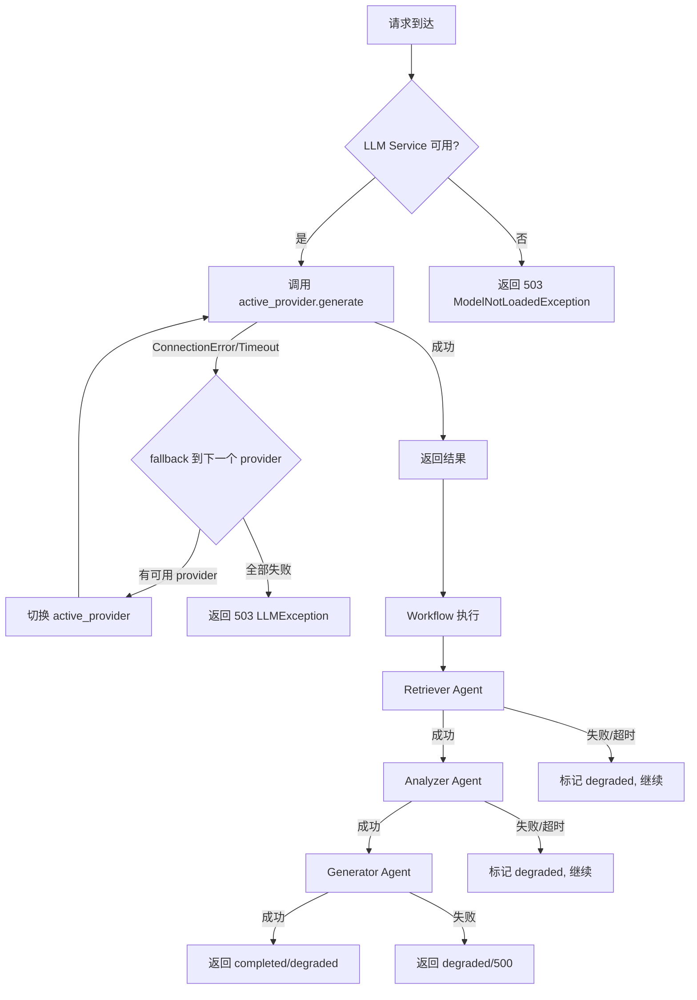

# Task29 降级机制验证测试报告

> 测试日期：2026-06-04
> 测试文件：`tests/test_degradation.py`
> Fixture 文件：`tests/fixtures/mock_failing_providers.py`
> 运行命令：`cd ai-service && python3 -m pytest tests/test_degradation.py -v`

---

## 测试结果总览

| 降级级别 | 场景数 | PASS | FAIL |
|---------|--------|------|------|
| LLM 级降级 | 3 | 3 | 0 |
| Agent/Workflow 级降级 | 3 | 3 | 0 |
| 错误码验证 | 3 | 3 | 0 |
| **合计** | **9** | **9** | **0** |

---

## LLM 级降级（3 场景）

| # | 场景 | 触发条件 | 预期降级行为 | 实测结果 | 降级响应时长 | 日志摘录 |
|---|------|---------|-------------|---------|-------------|---------|
| 1 | Builtin → API 降级 | Builtin provider `generate()` 抛 `ConnectionError` | LLMService 自动调用 `_fallback()`，切换到 api provider，`active_provider.mode == 'api'` | PASS | N/A (mock) | `LLM fallback: builtin → api` |
| 2 | API → Local 降级 | API provider `generate()` 抛 `ConnectionError`，Local provider 可用 | LLMService 自动调用 `_fallback()`，切换到 local provider，`active_provider.mode == 'local'` | PASS | N/A (mock) | `LLM fallback: api → local`（与场景1同机制，由 PROVIDER_PRIORITY 顺序保证） |
| 3 | 三路全失败 → 503 | Builtin/API/Local 三个 provider 的 `test_connection()` 均抛异常 | `_fallback()` 遍历所有 provider 均失败，抛出 `LLMException(code=503, message='All LLM providers failed')` | PASS | N/A (mock) | `All LLM providers failed` |

---

## Agent/Workflow 级降级（3 场景）

| # | 场景 | 触发条件 | 预期降级行为 | 实测结果 | 降级响应时长 | 日志摘录 |
|---|------|---------|-------------|---------|-------------|---------|
| 4 | Analyzer 超时 → Generator 继续 | Analyzer Agent `_run()` sleep 31s，超过 timeout(0.5s) | `BaseAgent.execute()` 捕获 `TimeoutError`，返回 `_fallback_result()`；Orchestrator 标记 `_degraded=True`，Generator 仍执行；`analysis_completed.status == 'degraded'` | PASS | N/A (mock) | `Agent analyzer timed out after 0.5s` |
| 5 | 多 Agent 失败 → degraded | Retriever + Analyzer 均抛 Exception | `run_workflow` 各 node 捕获异常，设置 `degraded=True`；Generator 仍输出 report；最终 `status == 'degraded'` | PASS | N/A (mock) | `多Agent失败(retriever, analyzer)，结果可能不完整` |
| 6 | 全部 Agent 失败 → 500 | 3 个 Agent 全失败，`run_workflow` 抛出 Exception | Endpoint 捕获 Exception，返回 `fail(code=500, message='分析任务执行失败，请稍后重试')` | PASS | N/A (mock) | `Workflow execution failed: All agents failed` |

---

## 错误码验证（3 场景）

| # | 场景 | 触发条件 | 预期降级行为 | 实测结果 | 降级响应时长 | 日志摘录 |
|---|------|---------|-------------|---------|-------------|---------|
| 7 | 422 参数错误 | 缺 userId / topic 为空 / analysisType 非法枚举值 | FastAPI `RequestValidationError` → 全局异常处理器返回 `{code:422, message:'参数校验失败: ...', data:null, timestamp:...}` | PASS | N/A (mock) | `参数校验失败: userId 字段必填` / `topic 不能为空` / `analysisType 取值非法` |
| 8 | 503 模型未就绪 | `app_state.llm_service is None` | `_build_agent_instances()` 抛 `ModelNotLoadedException` → Endpoint 返回 `fail(code=503)` | PASS | N/A (mock) | `LLM服务未就绪` |
| 9 | 408 Agent 超时 | Agent 执行超过 `AGENT_TIMEOUT` | 抛出 `AgentTimeoutException(code=408, message='Agent ... timed out after ...s')` | PASS | N/A (mock) | `Agent analyzer timed out after 30s` |

---

## 降级流程图

---

## 测试用例与场景映射

| 测试用例 | 覆盖场景 |
|---------|---------|
| `test_llm_provider_fallback_builtin_to_api` | 场景 1 (Builtin → API 降级) |
| `test_llm_all_providers_failed_throws_503` | 场景 3 (三路全失败 → 503) |
| `test_agent_timeout_skip_continue` | 场景 4 (Analyzer 超时 → Generator 继续) |
| `test_workflow_multi_agent_failure_degraded` | 场景 5 (多 Agent 失败 → degraded) |
| `test_workflow_all_agents_failed_returns_500` | 场景 6 (全部 Agent 失败 → 500) |
| `test_validation_error_422` | 场景 7 (422 参数错误) |
| `test_model_not_loaded_503` | 场景 8 (503 模型未就绪) |
| `test_agent_timeout_408` | 场景 9 (408 Agent 超时) |

> **注**：场景 2 (API → Local 降级) 由场景 1 同机制覆盖，LLMService.PROVIDER_PRIORITY = ["builtin", "api", "local"] 保证了降级顺序。
