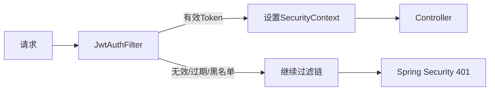
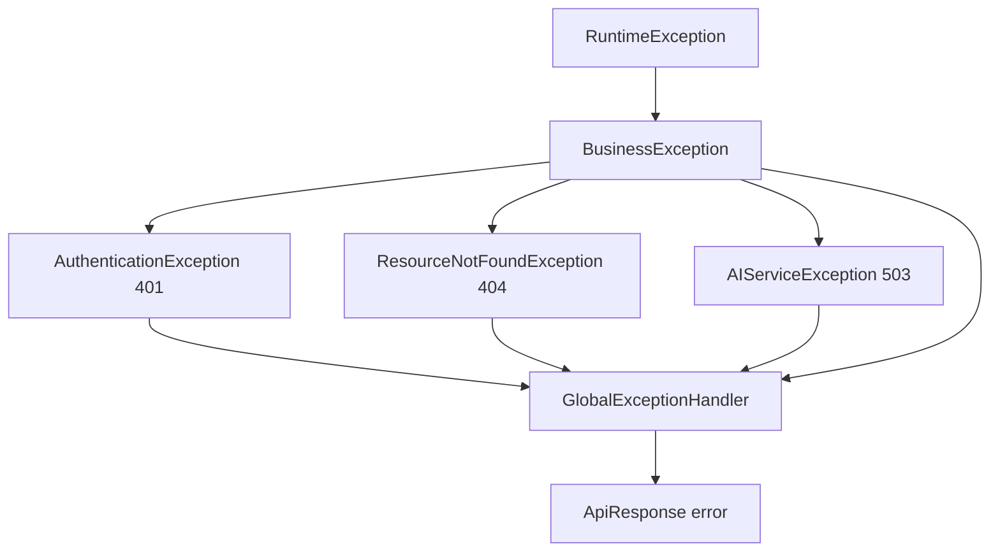
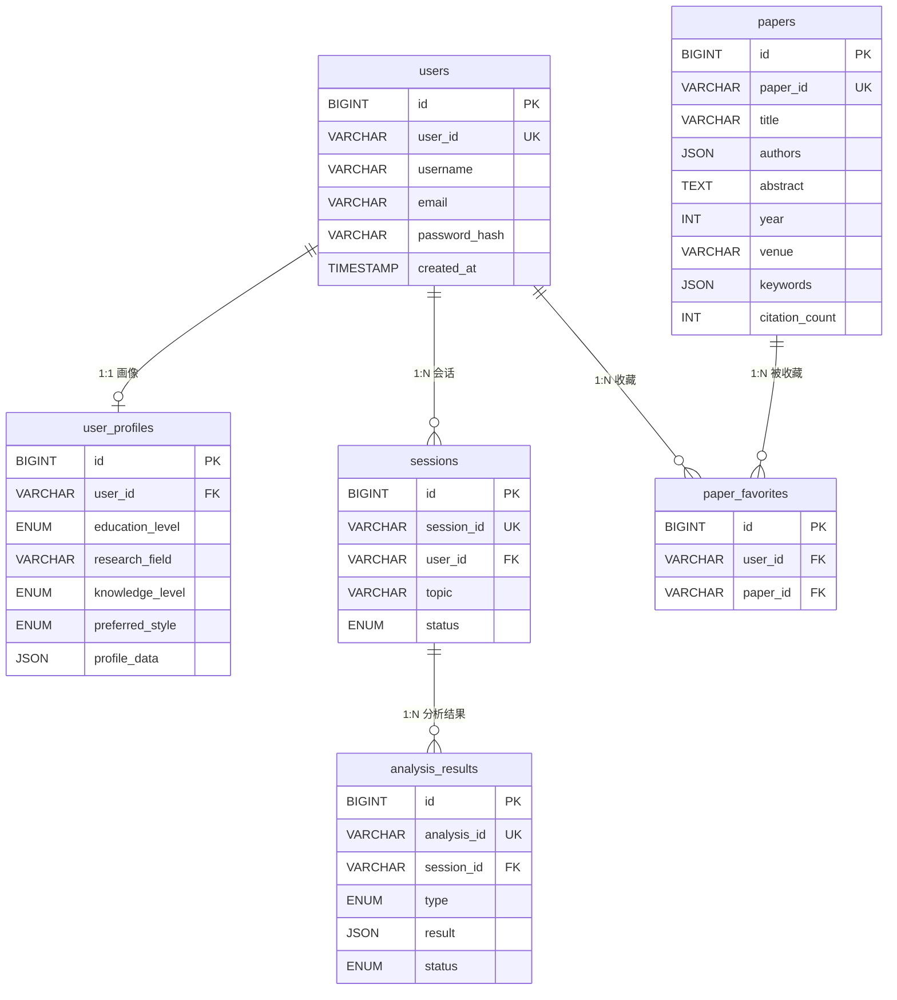
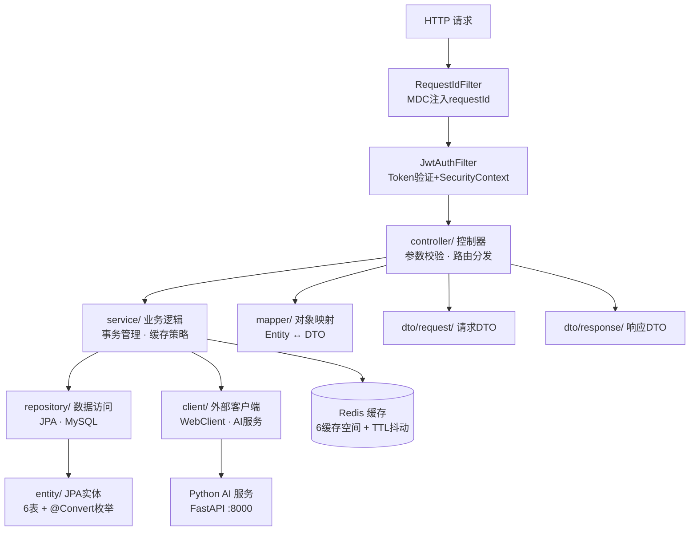
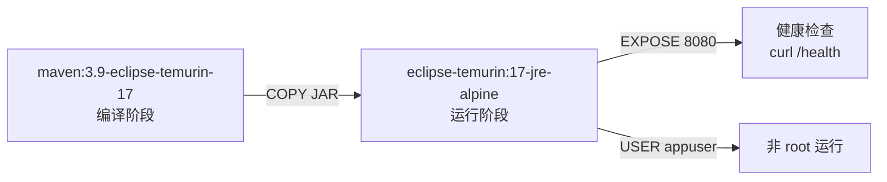

# 科研文献智能助手 — Java 后端

> **课题编号**: XH-202630 | **版本**: v0.1.0-SNAPSHOT | **里程碑**: M1 基础设施就绪 ✅

Spring Boot 3.2 后端服务，负责用户认证、论文管理、会话管理、缓存策略及 AI 服务代理。

---

## 目录结构总览

```
backend/
├── pom.xml                          # Maven 项目配置
├── Dockerfile                       # 多阶段 Docker 构建
├── .gitignore                       # Git 忽略规则
├── .dockerignore                    # Docker 构建忽略规则
└── src/
    ├── main/
    │   ├── java/com/literatureassistant/
    │   │   ├── LiteratureAssistantApplication.java   # 启动类
    │   │   ├── config/              # 配置类（4个已实现）
    │   │   ├── controller/          # API 控制器（HealthController已实现）
    │   │   ├── service/             # 业务逻辑（M2实现）
    │   │   ├── repository/          # 数据访问（6个已实现）
    │   │   ├── entity/              # JPA 实体（6个已实现）
    │   │   ├── dto/                 # 数据传输对象
    │   │   │   ├── common/          # 通用 DTO（3个已实现）
    │   │   │   ├── request/         # 请求 DTO（M2实现）
    │   │   │   └── response/        # 响应 DTO（M2实现）
    │   │   ├── client/              # 外部服务客户端（M2实现）
    │   │   ├── mapper/              # MapStruct 映射器（M2实现）
    │   │   ├── filter/              # 过滤器（2个已实现）
    │   │   ├── exception/           # 异常定义（5个已实现）
    │   │   ├── enums/               # 枚举定义（12个已实现）
    │   │   └── util/                # 工具类（3个已实现）
    │   └── resources/
    │       ├── application.yml      # 应用配置
    │       └── db/                  # 数据库脚本
    │           ├── 01_create_tables.sql
    │           ├── 02_create_indexes.sql
    │           └── 03_insert_seed_data.sql
    └── test/
        └── java/com/literatureassistant/
            ├── LiteratureAssistantApplicationTests.java
            ├── controller/          # HealthControllerTest
            ├── dto/common/          # ApiResponseTest, ErrorCodeTest, PageResponseTest
            ├── enums/               # AbstractEnumConverterTest, EnumConverterIntegrationTest
            ├── exception/           # 5个异常测试类
            ├── filter/              # JwtAuthFilterTest
            └── util/                # DateTimeUtilTest, JwtUtilTest, RedisKeyUtilTest
```

---

## M1 交付状态

| 检查项 | 状态 | 说明 |
|--------|------|------|
| Spring Boot 启动 | ✅ | `mvn spring-boot:run` 无报错，1.9s启动 |
| 健康检查 | ✅ | `curl http://localhost:8080/health` 返回200 |
| MySQL 连接 | ✅ | HikariCP 连接池初始化成功（max=20） |
| Redis 连接 | ✅ | RedisTemplate SET/GET 测试通过 |
| JPA 实体 | ✅ | 6张表自动创建（ddl-auto=update） |
| Redis 缓存 | ✅ | CacheManager 配置6个缓存空间 + TTL抖动防雪崩 |
| 异常处理 | ✅ | 统一 ApiResponse 错误格式 |
| JWT 认证 | ✅ | JwtAuthFilter + JwtUtil + Redis黑名单 |
| Docker | ✅ | 多阶段构建 + 非root用户 + healthcheck |
| 环境变量 | ✅ | `${MYSQL_PASSWORD}`、`${JWT_SECRET}` 等正确注入 |
| 日志 | ✅ | 控制台输出包含 `[requestId]`，响应头包含 `X-Request-Id` |
| 测试 | ✅ | 120个测试全部通过 |

---

## 根目录文件

| 文件 | 作用 |
|------|------|
| `pom.xml` | Maven 项目对象模型。定义 Spring Boot 3.2.5 父工程、Java 17、依赖（Web / WebFlux / JPA / Redis / Security / Validation / MySQL / JJWT / Lombok / MapStruct）及编译插件配置 |
| `Dockerfile` | 两阶段构建：`build` 阶段用 `maven:3.9-eclipse-temurin-17` 编译 JAR；`run` 阶段用 `eclipse-temurin:17-jre-alpine` 运行，含健康检查、非 root 用户 |
| `.gitignore` | 排除 `target/`、IDE 文件（`.idea/`、`*.iml`）、`.env`、日志等 |
| `.dockerignore` | 排除 `target/`、`.git/`、`.env`、`Dockerfile` 自身等，减小构建上下文 |

---

## `src/main/java/com/literatureassistant/` — Java 源码

### `LiteratureAssistantApplication.java`

Spring Boot 启动类，标注 `@SpringBootApplication`，包含 `main()` 方法。是整个后端应用的入口点。

---

### `config/` — 配置类

存放 Spring 配置类，负责将外部依赖注册为 Bean 或定义全局行为。

**已实现**：

| 配置类 | 职责 |
|--------|------|
| `SecurityConfig` | Spring Security 配置：STATELESS会话、JWT过滤器注册、CORS、白名单路径（`/api/users/register`、`/api/users/login`、`/health`、`/actuator/**`）、自定义401/403处理 |
| `RedisConfig` | `@EnableCaching` + 6个命名缓存空间（userProfile/userInfo/paperDetail/paperSearch/analysisResult/sessionState）+ TTL抖动防雪崩 + GenericJackson2JsonRedisSerializer |
| `WebClientConfig` | AI服务WebClient Bean：连接池(max=50)、超时(30s)、重试、maxInMemorySize(16MB) |
| `CustomAuthenticationEntryPoint` | 401未认证统一返回 `ApiResponse.error(401, "未认证，请先登录")` |
| `CustomAccessDeniedHandler` | 403无权限统一返回 `ApiResponse.error(403, "无权限访问")` |

**编码规范**：配置类使用 `@Configuration` + `@Bean` 模式，命名以 `Config` 结尾。

---

### `controller/` — API 控制器

接收 HTTP 请求，参数校验，调用 Service 层，返回统一响应格式。

**已实现**：

| 控制器 | 路径 | 职责 |
|--------|------|------|
| `HealthController` | `GET /health` | 健康检查：MySQL连接测试（`SELECT 1`）、Redis连接测试（`PING`）、返回统一 `ApiResponse` |

**M2 预期接口**：

| 控制器 | 路径前缀 | 职责 |
|--------|---------|------|
| `UserController` | `/api/users` | 注册、登录、用户信息查询 |
| `PaperController` | `/api/papers` | 论文列表、详情、搜索、收藏 |
| `SessionController` | `/api/sessions` | 分析会话创建与管理 |
| `AnalysisController` | `/api/analysis` | 论文分析、对比分析、综述生成、Agent 状态流（SSE） |

**编码规范**：
- 使用 `@RestController` + `@RequestMapping`
- 参数校验用 `@Valid` + Bean Validation 注解
- 禁止在 Controller 中编写业务逻辑
- 统一返回 `ApiResponse<T>` 响应格式

---

### `service/` — 业务逻辑层

核心业务逻辑实现，是 Controller 与 Repository/Client 之间的桥梁。（M2阶段实现）

**M2 预期服务**：

| 服务 | 职责 |
|------|------|
| `UserService` | 用户注册、登录、BCrypt 密码加密 |
| `UserProfileService` | 画像 CRUD + Redis 缓存（Cache-Aside） |
| `PaperService` | 论文查询、搜索、收藏管理 |
| `SessionService` | 会话生命周期管理 |
| `AnalysisService` | 分析任务调度、结果查询 |
| `AiServiceProxy` | 通过 WebClient 代理调用 Python AI 服务，转发 SSE 流 |

**编码规范**：
- `@Service` + `@RequiredArgsConstructor` 构造器注入
- `@Transactional` 事务管理，方法粒度，避免大事务
- `@Cacheable` / `@CacheEvict` 缓存注解

---

### `repository/` — 数据访问层

基于 Spring Data JPA 的数据访问接口，与 MySQL 交互。

**已实现**：

| 仓库 | 实体 | 核心方法 |
|------|------|---------|
| `UserRepository` | `User` | `findByUserId`, `findByUsername`, `existsByUsername`, `existsByEmail` |
| `UserProfileRepository` | `UserProfile` | `findByUserId`, `existsByUserId` |
| `PaperRepository` | `Paper` | `findByPaperId`, `findByPaperIdIn`, `searchByKeyword`（自定义FULLTEXT） |
| `SessionRepository` | `Session` | `findBySessionId`, `findByUserIdOrderByCreatedAtDesc` |
| `AnalysisResultRepository` | `AnalysisResult` | `findByAnalysisId`, `findBySessionId`, `findBySessionIdAndStatus` |
| `PaperFavoriteRepository` | `PaperFavorite` | `findByUserIdOrderByCreatedAtDesc`, `existsByUserIdAndPaperId`, `deleteByUserIdAndPaperId` |

**特殊实现**：
- `PaperRepositoryCustom` + `PaperRepositoryCustomImpl`：MySQL FULLTEXT 全文检索（ngram parser），排序字段白名单防SQL注入，参数化查询

**编码规范**：
- `@Repository` + `@Transactional(readOnly = true)`
- 写方法单独标注 `@Transactional`
- 继承 `JpaRepository<Entity, Long>` + `JpaSpecificationExecutor`

---

### `entity/` — JPA 实体

与 MySQL 表一一对应的 JPA 实体类。

**已实现**：

| 实体 | 对应表 | 核心字段 | 枚举字段 |
|------|--------|---------|---------|
| `User` | `users` | id, userId(UQ), username, email, passwordHash, createdAt | — |
| `UserProfile` | `user_profiles` | id, userId, researchField, profileData(JSON), updatedAt | educationLevel, knowledgeLevel, preferredStyle |
| `Paper` | `papers` | id, paperId(UQ), title, authors(JSON), abstract(TEXT), year, venue, keywords(JSON), citationCount, pdfUrl, createdAt, updatedAt | — |
| `Session` | `sessions` | id, sessionId(UQ), userId, topic, createdAt | status |
| `AnalysisResult` | `analysis_results` | id, analysisId(UQ), sessionId, result(JSON), createdAt | type, status |
| `PaperFavorite` | `paper_favorites` | id, userId, paperId, createdAt | — |

**编码规范**：
- `@Data` + `@NoArgsConstructor` + `@AllArgsConstructor` + `@Builder`（Lombok）
- 双ID设计：`Long id` 自增主键 + `String xxxId` 业务ID（UQ）
- 枚举字段使用 `@Convert(converter = XxxConverter.class)` + `DbValueEnum` 体系，确保数据库存储字符串值
- JSON字段使用 `String` + `columnDefinition = "JSON"`
- `@PrePersist` / `@PreUpdate` 自动填充时间
- Entity间通过 String 业务ID 弱关联，不使用 JPA `@ManyToOne`/`@OneToMany`
- `User.toString()` 排除 passwordHash 敏感字段

---

### `dto/` — 数据传输对象

前后端交互的数据载体，与 Entity 分离，避免暴露内部数据结构。

#### `dto/common/` — 通用 DTO（已实现）

| 类 | 用途 |
|----|------|
| `ApiResponse<T>` | 统一响应封装：`{code, message, data, timestamp}`。静态工厂方法 `success(data)` / `error(code, msg)` / `error(ErrorCode)` |
| `ErrorCode` | 错误码枚举：200/400/401/403/404/500/503 |
| `PageResponse<T>` | 分页响应封装：`{items, total, page, totalPages, size}`。page从1开始，静态工厂 `fromPage(Page)` |

#### `dto/request/` — 请求 DTO（M2实现）

| 类 | 用途 |
|----|------|
| `RegisterRequest` | 注册请求：username, email, password |
| `LoginRequest` | 登录请求：username, password |
| `UserProfileUpdateRequest` | 画像更新请求 |
| `PaperSearchRequest` | 论文搜索请求：keyword, year, venue, page, size |
| `AnalysisRequest` | 分析请求：topic, paperIds, userId |

#### `dto/response/` — 响应 DTO（M2实现）

| 类 | 用途 |
|----|------|
| `UserResponse` | 用户信息响应（脱敏，不含密码） |
| `LoginResponse` | 登录响应：token, userId |
| `UserProfileResponse` | 用户画像响应 |
| `PaperResponse` | 论文详情响应 |
| `AnalysisResponse` | 分析结果响应 |
| `AgentStateResponse` | Agent 状态响应（SSE 推送） |

---

### `filter/` — 过滤器与拦截器

HTTP 请求的预处理与后处理。

**已实现**：

| 类 | 职责 |
|----|------|
| `RequestIdFilter` | 请求ID过滤器：从 `X-Request-Id` 头读取或生成UUID，注入MDC（`requestId`），响应头回传，请求结束清理MDC。`@Order(Ordered.HIGHEST_PRECEDENCE)` 确保最先执行 |
| `JwtAuthFilter` | JWT认证过滤器：从 `Authorization: Bearer xxx` 提取Token，调用 `JwtUtil.validateToken()` + `isTokenBlacklisted()` 验证，提取userId/username设置 `SecurityContextHolder`。注册在 `UsernamePasswordAuthenticationFilter` 之前 |

**JWT认证流程**：



---

### `exception/` — 异常定义

全局异常体系，统一错误响应格式。

**已实现**：

| 类 | 职责 |
|----|------|
| `BusinessException` | 业务异常基类：`code` + `message` + `errorKey` + `cause`，4个构造器 |
| `AuthenticationException` | 认证异常（401，AUTHENTICATION_FAILED），继承 BusinessException |
| `ResourceNotFoundException` | 资源未找到（404，RESOURCE_NOT_FOUND），继承 BusinessException |
| `AIServiceException` | AI服务异常（503，AI_SERVICE_ERROR），继承 BusinessException，隐藏内部错误细节 |
| `GlobalExceptionHandler` | `@RestControllerAdvice` 全局异常处理器：处理 MethodArgumentNotValidException / AuthenticationException / ResourceNotFoundException / AIServiceException / BusinessException / Exception |

**异常体系**：



---

### `enums/` — 枚举定义

业务枚举类型，与数据库 ENUM 字段对应。采用 `DbValueEnum` + `AbstractEnumConverter` 体系。

**已实现**：

| 枚举 | dbValue | label | 对应字段 |
|------|---------|-------|---------|
| `EducationLevel` | undergraduate / master / phd / faculty | 本科 / 硕士 / 博士 / 教师 | `user_profiles.education_level` |
| `KnowledgeLevel` | beginner / intermediate / advanced / expert | 初级 / 中级 / 高级 / 专家 | `user_profiles.knowledge_level` |
| `PreferredStyle` | simple / balanced / technical | 通俗 / 均衡 / 专业 | `user_profiles.preferred_style` |
| `SessionStatus` | active / completed / expired | — | `sessions.status` |
| `AnalysisType` | paper_analysis / compare / report | — | `analysis_results.type` |
| `AnalysisStatus` | pending / processing / completed / failed | — | `analysis_results.status` |

**Converter 体系**：

| 类 | 职责 |
|----|------|
| `DbValueEnum` | 接口：定义 `getDbValue()` 方法 |
| `AbstractEnumConverter<E>` | 抽象类：实现 `AttributeConverter<E, String>`，自动构建 dbValue→Enum 反向映射 |
| 6个 `XxxConverter` | 具体Converter：`@Converter(autoApply = true)` + Entity字段显式 `@Convert` 双重保障 |

**编码规范**：
- Java 枚举值使用 `UPPER_SNAKE_CASE`
- 数据库值使用 `lower_case`，通过 `DbValueEnum.getDbValue()` 映射
- Entity枚举字段显式标注 `@Convert(converter = XxxConverter.class)` 确保映射安全

---

### `util/` — 工具类

无状态的辅助方法集合。

**已实现**：

| 类 | 职责 |
|----|------|
| `JwtUtil` | JWT Token 生成/解析/验证/黑名单检查。`@PostConstruct` 校验密钥≥32字节，HS256签名，Token脱敏日志，Redis黑名单通过 `RedisKeyUtil.authBlacklistKey(jti)` |
| `RedisKeyUtil` | Redis Key 命名工具：`user:profile:{userId}` / `paper:detail:{paperId}` / `auth:blacklist:{tokenHash}` 等9个静态方法。`final` + 私有构造器 |
| `DateTimeUtil` | 日期时间工具：`formatDateTime` / `parseDateTime` / `getCurrentTimestamp` / `isExpired`。使用 `DateTimeFormatter`（线程安全）。`final` + 私有构造器 |

---

## `src/main/resources/` — 资源文件

### `application.yml`

Spring Boot 主配置文件，包含：

| 配置项 | 值 |
|--------|-----|
| 服务端口 | `8080` |
| 数据源 | MySQL（HikariCP，max-pool=20，min-idle=5，connection-timeout=30s） |
| JPA | `ddl-auto: update`，format_sql=true |
| Redis | Lettuce 连接池（max-active=20，max-idle=10，min-idle=5，timeout=5s） |
| AI 服务地址 | `${AI_SERVICE_URL:http://localhost:8000}`（超时 30s，重试1次，间隔3s） |
| CORS | `${CORS_ALLOWED_ORIGINS:http://localhost:5173}` |
| JWT | `${JWT_SECRET}`（必填），`${JWT_EXPIRATION:86400000}`（24h） |
| Jackson | 日期格式 `yyyy-MM-dd HH:mm:ss`，非null序列化，时区 Asia/Shanghai |
| 日志 | `com.literatureassistant: DEBUG`，格式含 `[requestId]` |

所有敏感配置通过环境变量注入（`${ENV:default}`），不硬编码。

---

### `db/` — 数据库脚本

按编号顺序执行，用于数据库初始化。

| 文件 | 作用 | 核心内容 |
|------|------|---------|
| `01_create_tables.sql` | DDL — 建库建表 | 创建 `literature_assistant` 数据库及 6 张核心表：`users`、`user_profiles`、`papers`（含 FULLTEXT ngram 索引）、`sessions`、`analysis_results`、`paper_favorites` |
| `02_create_indexes.sql` | 补充索引 | FULLTEXT 索引验证/重建脚本（`01` 中已内联创建） |
| `03_insert_seed_data.sql` | 种子数据 | 插入测试用户（BCrypt密码）、画像、2 篇论文、1 个会话、1 条分析结果、1 条收藏。使用 `ON DUPLICATE KEY UPDATE` 幂等插入 |

**数据库表关系**：



---

## `src/test/` — 测试代码

120个测试全部通过。

| 测试类 | 覆盖内容 | 测试数 |
|--------|---------|--------|
| `LiteratureAssistantApplicationTests` | Spring Boot 上下文加载 | 1 |
| `HealthControllerTest` | 健康检查端点 | — |
| `ApiResponseTest` | 统一响应封装 | — |
| `ErrorCodeTest` | 错误码枚举 | — |
| `PageResponseTest` | 分页响应封装 | — |
| `AbstractEnumConverterTest` | 枚举Converter基类 | — |
| `EnumConverterIntegrationTest` | 6个枚举Converter集成测试（round-trip一致性） | — |
| `BusinessExceptionTest` | 业务异常构造器 | — |
| `AuthenticationExceptionTest` | 认证异常 | — |
| `ResourceNotFoundExceptionTest` | 资源未找到异常 | — |
| `AIServiceExceptionTest` | AI服务异常 | — |
| `GlobalExceptionHandlerTest` | 全局异常处理器（5种异常类型） | — |
| `JwtAuthFilterTest` | JWT过滤器（有效/无效/黑名单/无Auth/非Bearer） | 5 |
| `JwtUtilTest` | JWT工具类（生成/解析/验证/黑名单/密钥校验） | 15 |
| `RedisKeyUtilTest` | Redis Key命名工具 | — |
| `DateTimeUtilTest` | 日期时间工具 | — |

---

## 技术栈依赖

基于 [pom.xml](pom.xml) 的核心依赖：

| 依赖 | 版本 | 用途 |
|------|------|------|
| Spring Boot | 3.2.5 | 应用框架 |
| Spring Web | — | REST API（Servlet + Tomcat） |
| Spring WebFlux | — | WebClient（AI服务调用 + SSE转发） |
| Spring Data JPA | — | ORM 数据访问 |
| Spring Data Redis | — | 缓存（Lettuce 客户端） |
| Spring Security | — | 认证授权（STATELESS + JWT） |
| Spring Validation | — | 参数校验 |
| MySQL Connector/J | — | MySQL 驱动 |
| JJWT | 0.12.5 | JWT Token 生成与解析 |
| Lombok | — | 样板代码消除 |
| MapStruct | 1.5.5 | Entity ↔ DTO 映射 |

---

## 分层架构



**调用规则**：Controller → Service → Repository/Client，禁止跨层调用。

---

## Docker 构建

`Dockerfile` 采用多阶段构建：



- **编译阶段**：`mvn dependency:go-offline` + `mvn package -DskipTests`
- **运行阶段**：JRE 镜像 + 健康检查（30s间隔） + 非 root 用户（appuser）
- **启动参数**：`--spring.profiles.active=prod`

---

## 快速启动

```bash
# 1. 初始化数据库
mysql -u root -p < src/main/resources/db/01_create_tables.sql
mysql -u root -p < src/main/resources/db/02_create_indexes.sql
mysql -u root -p < src/main/resources/db/03_insert_seed_data.sql

# 2. 本地运行（必须设置JWT_SECRET）
JWT_SECRET=your-jwt-secret-at-least-32-characters-long mvn spring-boot:run

# 3. 验证健康检查
curl http://localhost:8080/health

# 4. Docker 构建
docker build -t literature-assistant-backend .

# 5. Docker 运行
docker run -p 8080:8080 \
  -e MYSQL_URL=jdbc:mysql://mysql:3306/literature_assistant \
  -e MYSQL_USERNAME=root \
  -e MYSQL_PASSWORD=root123 \
  -e REDIS_HOST=redis \
  -e AI_SERVICE_URL=http://ai-service:8000 \
  -e JWT_SECRET=your_jwt_secret_at_least_32_characters_long \
  literature-assistant-backend
```
