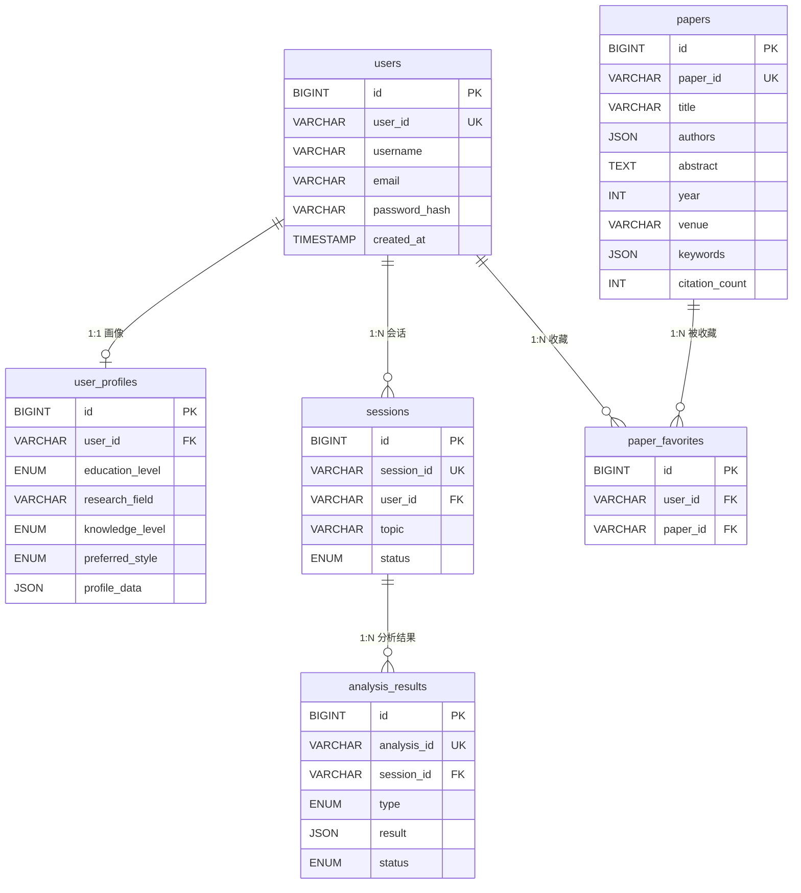
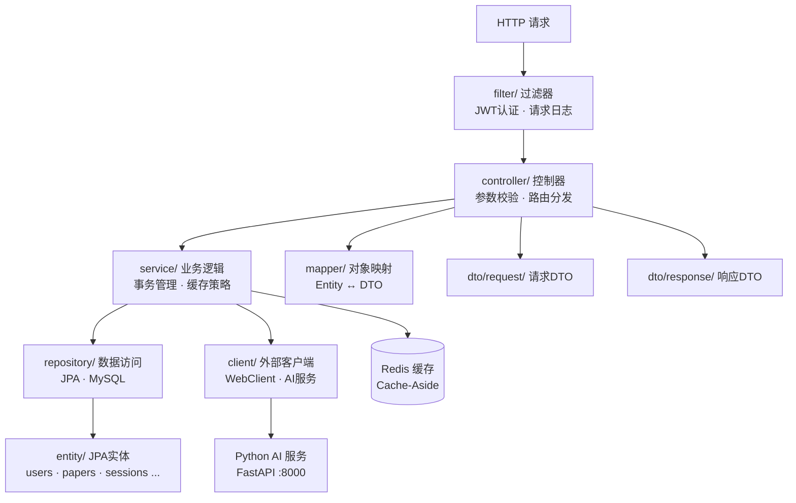
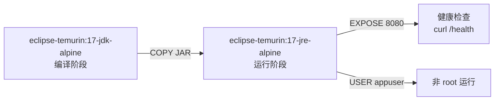

# 科研文献智能助手 — Java 后端

> **课题编号**: XH-202630 | **版本**: v0.1.0-SNAPSHOT | **里程碑**: M1 基础设施就绪

Spring Boot 3.2 后端服务，负责用户认证、论文管理、会话管理、缓存策略及 AI 服务代理。

---

## 目录结构总览

```
backend/
├── pom.xml                          # Maven 项目配置
├── Dockerfile                       # 多阶段 Docker 构建
├── .gitignore                       # Git 忽略规则
├── .dockerignore                    # Docker 构建忽略规则
└── src/
    ├── main/
    │   ├── java/com/literatureassistant/
    │   │   ├── LiteratureAssistantApplication.java   # 启动类
    │   │   ├── config/              # 配置类
    │   │   ├── controller/          # API 控制器
    │   │   ├── service/             # 业务逻辑
    │   │   ├── repository/          # 数据访问
    │   │   ├── entity/              # JPA 实体
    │   │   ├── dto/                 # 数据传输对象
    │   │   │   ├── common/          # 通用 DTO
    │   │   │   ├── request/         # 请求 DTO
    │   │   │   └── response/        # 响应 DTO
    │   │   ├── client/              # 外部服务客户端
    │   │   ├── mapper/              # MapStruct 映射器
    │   │   ├── filter/              # 过滤器/拦截器
    │   │   ├── exception/           # 异常定义
    │   │   ├── enums/               # 枚举定义
    │   │   └── util/                # 工具类
    │   └── resources/
    │       ├── application.yml      # 应用配置
    │       └── db/                  # 数据库脚本
    │           ├── 01_create_tables.sql
    │           ├── 02_create_indexes.sql
    │           └── 03_insert_seed_data.sql
    └── test/
        └── java/com/literatureassistant/
            └── LiteratureAssistantApplicationTests.java
```

---

## 根目录文件

| 文件 | 作用 |
|------|------|
| `pom.xml` | Maven 项目对象模型。定义 Spring Boot 3.2.5 父工程、Java 17、依赖（WebFlux / JPA / Redis / Validation / MySQL / JJWT / Lombok / MapStruct）及编译插件配置 |
| `Dockerfile` | 两阶段构建：`build` 阶段用 `eclipse-temurin:17-jdk-alpine` 编译 JAR；`run` 阶段用 `eclipse-temurin:17-jre-alpine` 运行，含健康检查、非 root 用户 |
| `.gitignore` | 排除 `target/`、IDE 文件（`.idea/`、`*.iml`）、`.env`、日志等 |
| `.dockerignore` | 排除 `target/`、`.git/`、`.env`、`Dockerfile` 自身等，减小构建上下文 |

---

## `src/main/java/com/literatureassistant/` — Java 源码

### `LiteratureAssistantApplication.java`

Spring Boot 启动类，标注 `@SpringBootApplication`，包含 `main()` 方法。是整个后端应用的入口点。

---

### `config/` — 配置类

存放 Spring 配置类，负责将外部依赖注册为 Bean 或定义全局行为。

**预期内容**：

| 配置类 | 职责 |
|--------|------|
| `RedisConfig` | Redis 连接工厂、序列化策略、TTL 配置 |
| `WebClientConfig` | 调用 AI 服务的 WebClient Bean（超时、重试） |
| `SecurityConfig` | Spring Security 配置、JWT 过滤器注册、白名单路径 |
| `CorsConfig` | 跨域策略 |
| `JacksonConfig` | JSON 序列化规则（日期格式、null 处理） |

**编码规范**：配置类使用 `@Configuration` + `@Bean` 模式，命名以 `Config` 结尾。

---

### `controller/` — API 控制器

接收 HTTP 请求，参数校验，调用 Service 层，返回统一响应格式。

**预期接口**：

| 控制器 | 路径前缀 | 职责 |
|--------|---------|------|
| `UserController` | `/api/users` | 注册、登录、用户信息查询 |
| `UserProfileController` | `/api/users/{userId}/profile` | 用户画像 CRUD |
| `PaperController` | `/api/papers` | 论文列表、详情、搜索、收藏 |
| `SessionController` | `/api/sessions` | 分析会话创建与管理 |
| `AnalysisController` | `/api/analysis` | 论文分析、对比分析、综述生成、Agent 状态流（SSE） |

**编码规范**：
- 使用 `@RestController` + `@RequestMapping`
- 参数校验用 `@Valid` + Bean Validation 注解
- 禁止在 Controller 中编写业务逻辑
- 统一返回 `ApiResponse<T>` 响应格式

---

### `service/` — 业务逻辑层

核心业务逻辑实现，是 Controller 与 Repository/Client 之间的桥梁。

**预期服务**：

| 服务 | 职责 |
|------|------|
| `UserService` | 用户注册、登录、BCrypt 密码加密 |
| `UserProfileService` | 画像 CRUD + Redis 缓存（Cache-Aside） |
| `PaperService` | 论文查询、搜索、收藏管理 |
| `SessionService` | 会话生命周期管理 |
| `AnalysisService` | 分析任务调度、结果查询 |
| `AiServiceProxy` | 通过 WebClient 代理调用 Python AI 服务，转发 SSE 流 |
| `CacheService` | 缓存管理（TTL 分层：5min ~ 2h） |

**编码规范**：
- 接口 + 实现分离（`UserService` / `UserServiceImpl`）
- `@Service` 注解
- `@Transactional` 事务管理，方法粒度，避免大事务
- `@Cacheable` / `@CacheEvict` 缓存注解

---

### `repository/` — 数据访问层

基于 Spring Data JPA 的数据访问接口，与 MySQL 交互。

**预期仓库**：

| 仓库 | 实体 | 核心方法 |
|------|------|---------|
| `UserRepository` | `User` | `findByUserId`, `findByUsername`, `existsByEmail` |
| `UserProfileRepository` | `UserProfile` | `findByUserId` |
| `PaperRepository` | `Paper` | `findByPaperId`, 全文搜索（`@Query` + FULLTEXT） |
| `SessionRepository` | `Session` | `findByUserIdAndStatus` |
| `AnalysisResultRepository` | `AnalysisResult` | `findBySessionIdAndType` |
| `PaperFavoriteRepository` | `PaperFavorite` | `findByUserIdAndPaperId` |

**编码规范**：
- 继承 `JpaRepository<Entity, Long>`
- 复杂查询使用 `@Query` + 参数化查询，禁止 SQL 拼接
- 方法命名遵循 Spring Data 派生查询规范

---

### `entity/` — JPA 实体

与 MySQL 表一一对应的 JPA 实体类。

**预期实体**：

| 实体 | 对应表 | 核心字段 |
|------|--------|---------|
| `User` | `users` | id, userId, username, email, passwordHash, createdAt |
| `UserProfile` | `user_profiles` | id, userId, educationLevel, researchField, knowledgeLevel, preferredStyle, profileData(JSON) |
| `Paper` | `papers` | id, paperId, title, authors(JSON), abstract, year, venue, keywords(JSON), citationCount |
| `Session` | `sessions` | id, sessionId, userId, topic, status(ENUM) |
| `AnalysisResult` | `analysis_results` | id, analysisId, sessionId, type(ENUM), result(JSON), status(ENUM) |
| `PaperFavorite` | `paper_favorites` | id, userId, paperId |

**编码规范**：
- `@Data` + `@NoArgsConstructor` + `@Builder`（Lombok）
- `@PrePersist` 生成 UUID 主键
- Entity 与 DTO 严格分离，禁止直接返回 Entity 给前端

---

### `dto/` — 数据传输对象

前后端交互的数据载体，与 Entity 分离，避免暴露内部数据结构。

#### `dto/common/` — 通用 DTO

| 类 | 用途 |
|----|------|
| `ApiResponse<T>` | 统一响应封装：`{code, message, data, timestamp}` |
| `PageRequest` | 分页请求参数 |
| `PageResponse<T>` | 分页响应封装 |

#### `dto/request/` — 请求 DTO

| 类 | 用途 |
|----|------|
| `RegisterRequest` | 注册请求：username, email, password |
| `LoginRequest` | 登录请求：username, password |
| `UserProfileUpdateRequest` | 画像更新请求 |
| `PaperSearchRequest` | 论文搜索请求：keyword, year, venue, page, size |
| `AnalysisRequest` | 分析请求：topic, paperIds, userId |
| `CompareRequest` | 对比分析请求：paperIds[] |

#### `dto/response/` — 响应 DTO

| 类 | 用途 |
|----|------|
| `UserResponse` | 用户信息响应（脱敏，不含密码） |
| `LoginResponse` | 登录响应：token, userId |
| `UserProfileResponse` | 用户画像响应 |
| `PaperResponse` | 论文详情响应 |
| `PaperListResponse` | 论文列表响应（含分页） |
| `AnalysisResponse` | 分析结果响应 |
| `AgentStateResponse` | Agent 状态响应（SSE 推送） |

**编码规范**：
- 使用 `@Data` + `@Builder`
- 请求 DTO 用 `@NotBlank` / `@NotNull` / `@Size` 等校验注解
- 命名以 `Request` / `Response` 结尾

---

### `client/` — 外部服务客户端

封装对 Python AI 服务的 HTTP 调用逻辑。

**预期内容**：

| 类 | 职责 |
|----|------|
| `AiServiceClient` | 通过 WebClient 调用 AI 服务的 REST API（`/api/agent/analyze`、`/api/search` 等） |
| `AiServiceSseClient` | SSE 流式转发：订阅 AI 服务的 Agent 状态流，转发给前端 |

**编码规范**：
- 使用 Spring WebFlux `WebClient`（非 RestTemplate）
- 超时 30s，重试 1 次，间隔 3s
- SSE 使用 `Flux<ServerSentEvent>` 处理

---

### `mapper/` — MapStruct 映射器

Entity ↔ DTO 之间的类型转换，基于 MapStruct 编译期代码生成。

**预期映射器**：

| 映射器 | 转换方向 |
|--------|---------|
| `UserMapper` | `User` ↔ `UserResponse` |
| `UserProfileMapper` | `UserProfile` ↔ `UserProfileResponse` / `UserProfileUpdateRequest` |
| `PaperMapper` | `Paper` ↔ `PaperResponse` |
| `AnalysisMapper` | `AnalysisResult` ↔ `AnalysisResponse` |

**编码规范**：
- `@Mapper(componentModel = "spring")` 注解
- 复杂映射使用 `@Mapping` 注解指定字段对应关系
- camelCase ↔ snake_case 转换由 Jackson `@JsonProperty` 处理

---

### `filter/` — 过滤器与拦截器

HTTP 请求的预处理与后处理。

**预期内容**：

| 类 | 职责 |
|----|------|
| `JwtAuthenticationFilter` | JWT Token 解析与验证，将用户信息注入 SecurityContext |
| `RequestLoggingFilter` | 请求日志记录（requestId、耗时、路径） |

**编码规范**：
- 实现 `OncePerRequestFilter`（JWT 过滤器）
- 或实现 `HandlerInterceptor`（日志拦截器）
- JWT 黑名单通过 Redis 校验

---

### `exception/` — 异常定义

全局异常体系，统一错误响应格式。

**预期内容**：

| 类 | 职责 |
|----|------|
| `BusinessException` | 业务异常基类（errorCode + message） |
| `AuthenticationException` | 认证异常 |
| `ResourceNotFoundException` | 资源未找到 |
| `AiServiceException` | AI 服务调用异常 |
| `GlobalExceptionHandler` | `@RestControllerAdvice` 全局异常处理器 |

**编码规范**：
- 所有业务异常继承 `BusinessException`
- `GlobalExceptionHandler` 捕获异常后返回 `ApiResponse` 统一格式
- 区分客户端错误（4xx）和服务端错误（5xx）

---

### `enums/` — 枚举定义

业务枚举类型，与数据库 ENUM 字段对应。

**预期枚举**：

| 枚举 | 值 | 对应字段 |
|------|----|---------|
| `EducationLevel` | UNDERGRADUATE / MASTER / PHD / FACULTY | `user_profiles.education_level` |
| `KnowledgeLevel` | BEGINNER / INTERMEDIATE / ADVANCED / EXPERT | `user_profiles.knowledge_level` |
| `PreferredStyle` | SIMPLE / BALANCED / TECHNICAL | `user_profiles.preferred_style` |
| `SessionStatus` | ACTIVE / COMPLETED / EXPIRED | `sessions.status` |
| `AnalysisType` | PAPER_ANALYSIS / COMPARE / REPORT | `analysis_results.type` |
| `AnalysisStatus` | PENDING / PROCESSING / COMPLETED / FAILED | `analysis_results.status` |

**编码规范**：
- Java 枚举值使用 `UPPER_SNAKE_CASE`
- 数据库 ENUM 值使用 `lower_case`，通过 `@Enumerated(EnumType.STRING)` 映射

---

### `util/` — 工具类

无状态的辅助方法集合。

**预期内容**：

| 类 | 职责 |
|----|------|
| `JwtUtil` | JWT Token 生成、解析、验证 |
| `UuidUtil` | UUID 生成（`usr_` / `ses_` / `anl_` 前缀） |
| `CacheKeyUtil` | Redis Key 拼接（`user:profile:{userId}` 等模式） |
| `JsonUtil` | JSON 序列化/反序列化辅助 |

**编码规范**：
- 工具类使用 `final` + 私有构造器
- 方法均为 `static`
- 无状态，不注入 Spring Bean

---

## `src/main/resources/` — 资源文件

### `application.yml`

Spring Boot 主配置文件，包含：

| 配置项 | 值 |
|--------|-----|
| 服务端口 | `8080` |
| 数据源 | MySQL（HikariCP，max-pool=20） |
| JPA | `ddl-auto: update`，MySQLDialect |
| Redis | Lettuce 连接池（max-active=20） |
| AI 服务地址 | `http://localhost:8000`（超时 30s） |
| JWT | 24h 有效期 |
| Jackson | 日期格式 `yyyy-MM-dd HH:mm:ss`，非 null 序列化 |
| 日志 | `com.literatureassistant: DEBUG`，含 requestId |

所有敏感配置通过环境变量注入（`${ENV:default}`），不硬编码。

---

### `db/` — 数据库脚本

按编号顺序执行，用于数据库初始化。

| 文件 | 作用 | 核心内容 |
|------|------|---------|
| `01_create_tables.sql` | DDL — 建库建表 | 创建 `literature_assistant` 数据库及 6 张核心表：`users`、`user_profiles`、`papers`（含 FULLTEXT ngram 索引）、`sessions`、`analysis_results`、`paper_favorites` |
| `02_create_indexes.sql` | 补充索引 | FULLTEXT 索引验证/重建脚本（`01` 中已内联创建） |
| `03_insert_seed_data.sql` | 种子数据 | 插入测试用户、画像、2 篇论文、1 个会话、1 条分析结果、1 条收藏 |

**数据库表关系**：



---

## `src/test/` — 测试代码

| 文件 | 作用 |
|------|------|
| `LiteratureAssistantApplicationTests.java` | Spring Boot 上下文加载测试（`@SpringBootTest`），验证应用能正常启动 |

**后续测试规划**：
- `controller/` — 控制器集成测试（`@WebMvcTest`）
- `service/` — 服务单元测试（`@ExtendWith(MockitoExtension.class)`）
- `repository/` — 仓库集成测试（`@DataJpaTest`）

---

## 技术栈依赖

基于 [pom.xml](pom.xml) 的核心依赖：

| 依赖 | 版本 | 用途 |
|------|------|------|
| Spring Boot | 3.2.5 | 应用框架 |
| Spring WebFlux | — | 响应式 Web + WebClient（SSE 转发） |
| Spring Data JPA | — | ORM 数据访问 |
| Spring Data Redis | — | 缓存（Lettuce 客户端） |
| Spring Validation | — | 参数校验 |
| MySQL Connector/J | — | MySQL 驱动 |
| JJWT | 0.12.5 | JWT Token 生成与解析 |
| Lombok | — | 样板代码消除 |
| MapStruct | 1.5.5 | Entity ↔ DTO 映射 |

---

## 分层架构



**调用规则**：Controller → Service → Repository/Client，禁止跨层调用。

---

## Docker 构建

`Dockerfile` 采用多阶段构建：



- **编译阶段**：`mvn dependency:go-offline` + `mvn package -DskipTests`
- **运行阶段**：JRE 镜像 + 健康检查 + 非 root 用户
- **启动参数**：`--spring.profiles.active=prod`

---

## 快速启动

```bash
# 1. 初始化数据库
mysql -u root -p < src/main/resources/db/01_create_tables.sql
mysql -u root -p < src/main/resources/db/02_create_indexes.sql
mysql -u root -p < src/main/resources/db/03_insert_seed_data.sql

# 2. 本地运行
mvn spring-boot:run

# 3. Docker 构建
docker build -t literature-assistant-backend .

# 4. Docker 运行
docker run -p 8080:8080 \
  -e MYSQL_URL=jdbc:mysql://mysql:3306/literature_assistant \
  -e MYSQL_USERNAME=root \
  -e MYSQL_PASSWORD=root123 \
  -e REDIS_HOST=redis \
  -e AI_SERVICE_URL=http://ai-service:8000 \
  -e JWT_SECRET=your_jwt_secret \
  literature-assistant-backend
```
