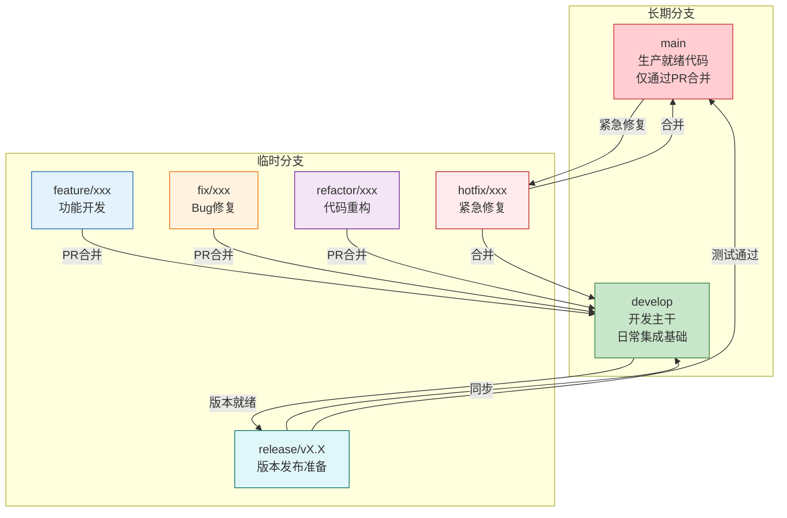
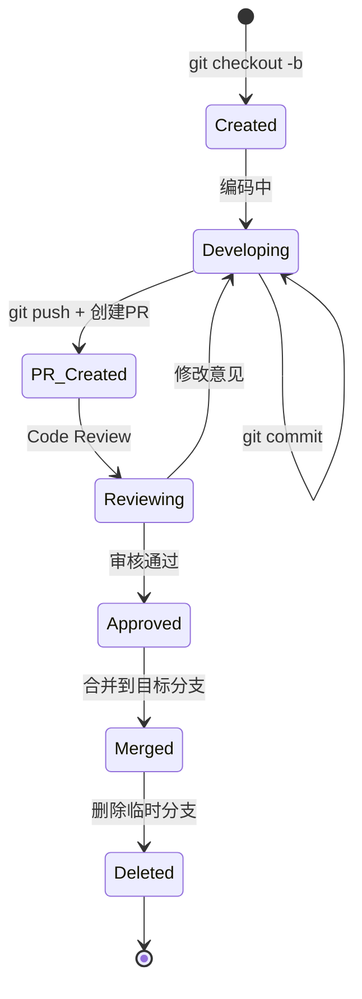
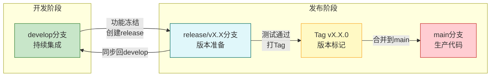
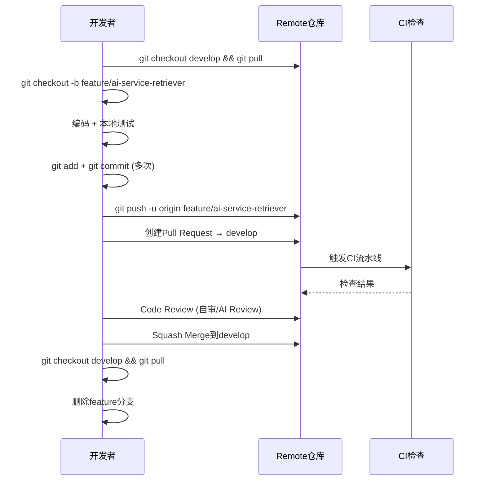
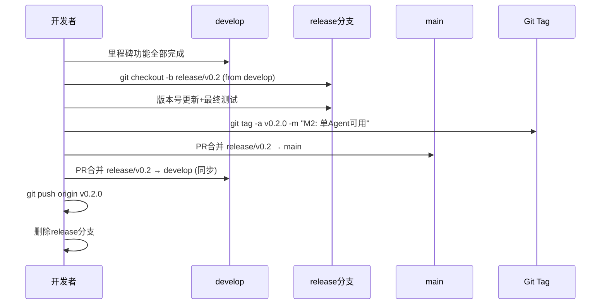
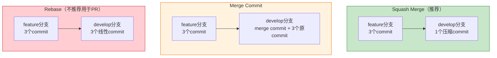
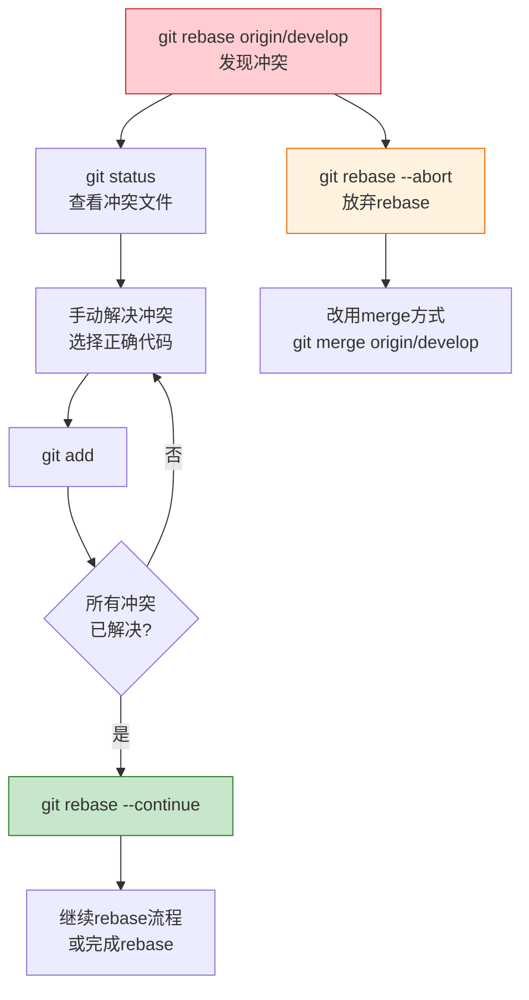
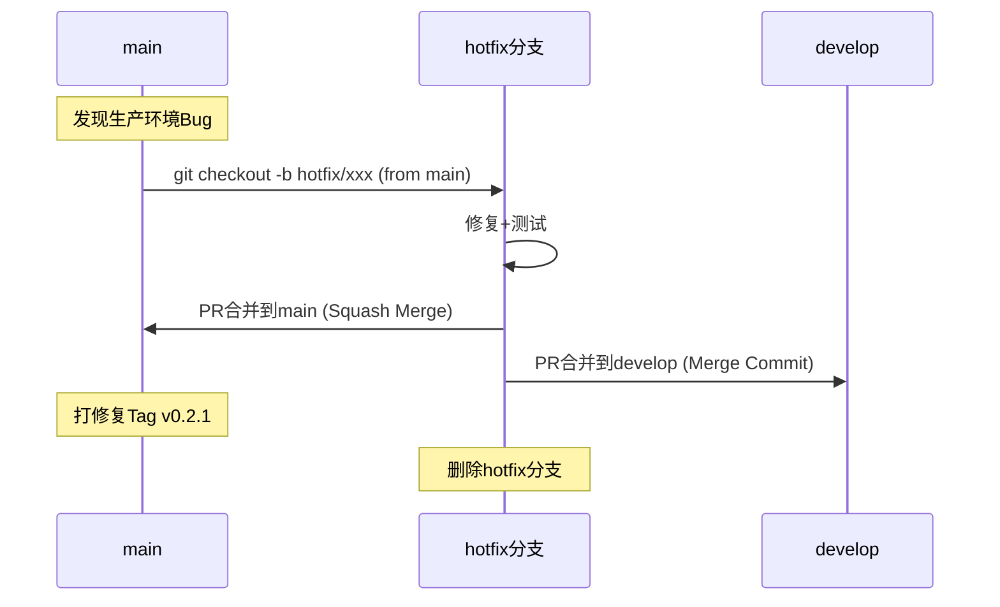
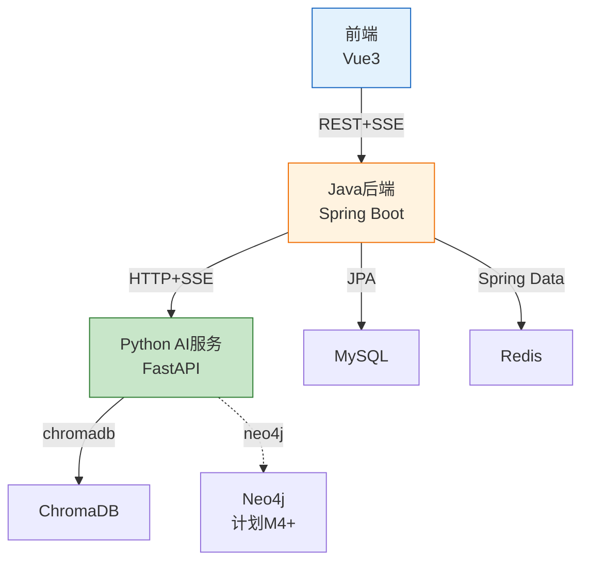

# XH-202630 科研文献智能助手 — Git工作流文档

> **课题编号**：XH-202630  
> **课题名称**：领域知识个性化生成与多智能体协同决策系统研究  
> **文档版本**：v1.0  
> **创建日期**：2026年5月28日  
> **文档状态**：初稿

---

## 修订历史

| 版本 | 日期 | 修订人 | 修订内容 |
|------|------|--------|---------|
| v1.0 | 2026-05-28 | 项目组 | 初始版本 |

---

## 目录

- [1 引言](#1-引言)
- [2 仓库架构](#2-仓库架构)
- [3 分支策略](#3-分支策略)
- [4 版本标签与里程碑映射](#4-版本标签与里程碑映射)
- [5 Commit规范](#5-commit规范)
- [6 开发工作流](#6-开发工作流)
- [7 Code Review流程](#7-code-review流程)
- [8 合并策略](#8-合并策略)
- [9 冲突处理](#9-冲突处理)
- [10 .gitignore规范](#10-gitignore规范)
- [11 Git Hooks自动化](#11-git-hooks自动化)
- [12 紧急修复流程](#12-紧急修复流程)
- [13 多模块协同开发](#13-多模块协同开发)
- [14 Git操作速查表](#14-git操作速查表)

---

## 1 引言

### 1.1 编写目的

本文档为 XH-202630 科研文献智能助手项目制定统一的Git工作流规范，旨在：

1. 保证代码版本的可追溯性和可回滚性
2. 规范多模块（前端/Java后端/Python AI服务）的协同开发
3. 确保里程碑交付物与Git版本标签精确对应
4. 降低因操作不当导致的代码丢失风险

### 1.2 工作流选型

| 候选方案 | 评估 | 结论 |
|---------|------|------|
| Git Flow | 分支类型完整，但流程较重，适合大型团队 | ❌ 不采用 |
| GitHub Flow | 仅main+feature，简洁但缺乏版本管理 | ❌ 不采用 |
| **Trunk-Based + Release Branch** | 主干开发+发布分支，适合1-3人小团队+CI/CD | ✅ **采用** |

**选型理由**：

- 本项目为1名核心开发者+AI Coding辅助，不需要复杂的分支模型
- 里程碑驱动的版本发布需要release分支支撑
- Trunk-Based开发保持develop分支始终可部署，降低集成风险

### 1.3 工作流总览



---

## 2 仓库架构

### 2.1 单仓库（Monorepo）策略

本项目采用**单仓库**策略，所有代码统一在一个Git仓库中管理：

```
Veritas(求真)/
├── docs/                    # 项目文档
├── Veritas/
│   ├── backend/             # Java后端
│   ├── ai-service/          # Python AI服务
│   ├── frontend/            # 前端
│   ├── docker-compose.yml
│   ├── .env.example
│   └── nginx.conf
└── AGENTS.md
```

**选型理由**：

| 因素 | Monorepo | 多仓库 |
|------|----------|--------|
| 跨模块原子提交 | ✅ 一次提交跨模块变更 | ❌ 需多次提交+协调 |
| 版本一致性 | ✅ 统一版本标签 | ❌ 各仓库独立版本 |
| CI/CD复杂度 | ✅ 单流水线 | ❌ 多流水线+触发协调 |
| 代码检索 | ✅ 全局搜索 | ❌ 跨仓库搜索不便 |
| 目录权限 | ❌ 无细粒度权限 | ✅ 仓库级权限控制 |

本项目为小团队，权限控制非刚需，Monorepo优势显著。

### 2.2 初始化配置

```bash
git init
git remote add origin <repository-url>

git config user.name "developer"
git config user.email "developer@example.com"

git config core.autocrlf input
git config core.eol lf

git config pull.rebase true

git config alias.lg "log --color --graph --pretty=format:'%Cred%h%Creset -%C(yellow)%d%Creset %s %Cgreen(%cr) %C(bold blue)<%an>%Creset' --abbrev-commit"
```

### 2.3 首次提交结构

```bash
git add .
git commit -m "chore: 初始化项目仓库结构

- 添加docs/项目文档目录
- 添加Veritas/backend/ Java后端骨架
- 添加Veritas/ai-service/ Python AI服务骨架
- 添加Veritas/frontend/ 前端骨架
- 添加docker-compose.yml和.env.example
- 添加AGENTS.md项目全景上下文"
```

---

## 3 分支策略

### 3.1 分支类型定义

| 分支类型 | 命名格式 | 生命周期 | 来源 | 合并目标 | 保护 |
|---------|---------|---------|------|---------|------|
| **main** | `main` | 永久 | — | — | ✅ 强制保护 |
| **develop** | `develop` | 永久 | main初始化 | — | ✅ 强制保护 |
| **feature** | `feature/<scope>-<name>` | 临时 | develop | develop | ❌ |
| **fix** | `fix/<scope>-<name>` | 临时 | develop | develop | ❌ |
| **refactor** | `refactor/<scope>-<name>` | 临时 | develop | develop | ❌ |
| **release** | `release/v<version>` | 临时 | develop | main + develop | ❌ |
| **hotfix** | `hotfix/<name>` | 临时 | main | main + develop | ❌ |

### 3.2 分支命名规范

```
格式：<类型>/<范围>-<简短描述>

范围(scope)取值：
├── frontend    - 前端模块
├── backend     - Java后端模块
├── ai-service  - Python AI服务模块
├── database    - 数据库相关
├── deploy      - 部署配置
├── docs        - 文档
└── cross       - 跨模块变更
```

**命名示例**：

```bash
feature/ai-service-retriever-agent
feature/backend-user-auth
feature/frontend-search-page
feature/cross-sse-integration
fix/backend-cache-eviction
fix/ai-service-llm-timeout
refactor/frontend-component-split
refactor/backend-dto-mapping
release/v0.2
hotfix/production-jwt-expiry
```

### 3.3 分支保护规则

#### main分支保护

```
【强制】main分支保护规则：

1. 禁止直接push（仅通过PR合并）
2. 合并前必须通过CI检查
3. 合并前至少1人Approve（自审项目可为自身Approve+AI Review）
4. 禁止force push
5. 禁止删除分支
6. 合并方式：Squash Merge（保持main历史线性）
```

#### develop分支保护

```
【强制】develop分支保护规则：

1. 禁止直接push大段代码（鼓励PR合并，但允许小修复直接push）
2. 禁止force push
3. 禁止删除分支
4. develop必须始终可编译可启动
```

### 3.4 分支生命周期管理



**临时分支清理**：

```bash
git branch -d feature/ai-service-retriever-agent
git push origin --delete feature/ai-service-retriever-agent

git fetch --prune
```

---

## 4 版本标签与里程碑映射

### 4.1 语义化版本（SemVer）

本项目采用语义化版本号：`v<MAJOR>.<MINOR>.<PATCH>`

| 位段 | 含义 | 递增条件 |
|------|------|---------|
| MAJOR | 主版本 | 不兼容的API变更（本项目仅v1.0） |
| MINOR | 次版本 | 新增功能，向后兼容 |
| PATCH | 修订版本 | Bug修复，向后兼容 |

### 4.2 里程碑版本映射

| 里程碑 | 版本标签 | 时间窗口 | Git Tag | 分支 |
|--------|---------|---------|---------|------|
| M1：基础设施就绪 | v0.1.0 | Week 1-2 | `v0.1.0` | `release/v0.1` |
| M2：单Agent可用 | v0.2.0 | Week 3-4 | `v0.2.0` | `release/v0.2` |
| M3：前后端联调成功 | v0.3.0 | Week 5-6 | `v0.3.0` | `release/v0.3` |
| M4：多Agent协同完成 | v0.4.0 | Week 7-8 | `v0.4.0` | `release/v0.4` |
| M5：功能完整 | v0.5.0 | Week 9-10 | `v0.5.0` | `release/v0.5` |
| M6：交付就绪 | v1.0.0 | Week 11-14 | `v1.0.0` | `release/v1.0` |

### 4.3 Tag操作规范

```bash
git tag -a v0.2.0 -m "M2: 单Agent可用

交付物：
- RAG语义检索API
- 检索/分析/生成3个Agent
- LangGraph基础工作流
- Prompt模板体系
- LLM三路降级机制"

git push origin v0.2.0
```

**Tag命名规范**：

```
里程碑版本：v0.1.0, v0.2.0, v0.3.0, v0.4.0, v0.5.0, v1.0.0
里程碑内修复：v0.2.1, v0.2.2（仅M6阶段允许）
```

### 4.4 版本演进流程



---

## 5 Commit规范

### 5.1 Commit Message格式

```
<type>(<scope>): <subject>

[body]

[footer]
```

### 5.2 Type定义

| Type | 含义 | 是否影响版本 | 示例 |
|------|------|------------|------|
| **feat** | 新功能 | MINOR+1 | feat(ai-service): 实现检索Agent语义检索 |
| **fix** | Bug修复 | PATCH+1 | fix(backend): 修复画像缓存未失效问题 |
| **refactor** | 重构（无功能变更） | 否 | refactor(frontend): 拆分PaperCard组件 |
| **perf** | 性能优化 | 否 | perf(ai-service): 优化向量检索批量查询 |
| **docs** | 文档更新 | 否 | docs: 更新Git工作流文档 |
| **style** | 代码格式调整 | 否 | style(backend): 统一import排序 |
| **test** | 测试相关 | 否 | test(ai-service): 添加检索Agent单元测试 |
| **chore** | 构建/工具/依赖 | 否 | chore(deploy): 更新Docker Compose配置 |
| **ci** | CI配置变更 | 否 | ci: 配置GitHub Actions流水线 |

### 5.3 Scope定义

| Scope | 对应模块 | 说明 |
|-------|---------|------|
| `frontend` | Veritas/frontend/ | Vue3前端 |
| `backend` | Veritas/backend/ | Java Spring Boot后端 |
| `ai-service` | Veritas/ai-service/ | Python FastAPI AI服务 |
| `database` | SQL脚本/Chroma配置 | 数据库变更 |
| `deploy` | docker-compose/nginx | 部署配置 |
| `docs` | docs/ | 项目文档 |
| `cross` | 多模块 | 跨模块变更 |

### 5.4 Subject规范

```
【强制】Subject编写规则：

1. 使用中文描述（与团队沟通语言一致）
2. 不超过50个字符
3. 不以句号结尾
4. 使用祈使语气（"实现"而非"实现了"）
5. 首字母不大写（中文无此限制）
```

### 5.5 Body规范

```
【推荐】Body编写规则：

1. 解释"为什么"而非"是什么"（代码本身说明是什么）
2. 每行不超过72个字符
3. 与Subject空一行
4. 多条原因用列表格式
```

### 5.6 Footer规范

```
【推荐】Footer用于标记：

1. 关联Issue：Closes #12, Refs #15
2. 破坏性变更：BREAKING CHANGE: 用户画像API响应格式变更
3. 关联里程碑：Milestone: M2
```

### 5.7 Commit示例

```bash
git commit -m "feat(ai-service): 实现检索Agent语义检索功能

- 基于BAAI/bge-m3生成查询向量
- ChromaDB cosine相似度检索Top10
- 结果包含paper_id、title、similarity_score

Refs #5"

git commit -m "fix(backend): 修复用户画像缓存未失效的Bug

Cache-Aside模式下更新画像后未执行Redis DEL操作，
导致用户修改画像后仍返回旧缓存数据。

Closes #8"

git commit -m "feat(cross): 实现Java到Python的SSE状态转发

- Java WebClient接收Python SSE流
- 转发为前端可消费的SSE事件
- 支持Agent状态实时可视化

Milestone: M4"

git commit -m "chore(deploy): 添加Neo4j到docker-compose（M4+计划）

仅添加配置模板，默认不启用，
M4阶段集成知识图谱时再启用。"
```

### 5.8 原子提交原则

```
【强制】每个Commit应是一个逻辑完整的原子变更：

✅ 正确示例：
  feat(backend): 实现用户注册API           — 单一功能
  fix(ai-service): 修复LLM超时未降级问题    — 单一修复
  refactor(frontend): 拆分PaperCard组件     — 单一重构

❌ 错误示例：
  feat: 实现用户注册+登录+画像管理          — 多功能混合
  fix: 修复Bug+顺便重构了缓存逻辑           — 修复+重构混合
  update: 改了一堆东西                      — 无意义的描述
```

### 5.9 跨模块提交规范

```
【推荐】跨模块变更的提交策略：

方案A：单次提交（强关联变更）
  git add Veritas/backend/src/.../PythonAIClient.java
  git add Veritas/ai-service/app/api/...
  git commit -m "feat(cross): 实现Java→Python Agent调用链路"

方案B：顺序提交（弱关联变更，先接口后实现）
  git commit -m "feat(backend): 定义PythonAIClient接口和DTO"
  git commit -m "feat(ai-service): 实现Agent分析API端点"
  git commit -m "feat(backend): 对接PythonAIClient到AnalysisService"

优先选择方案B，便于回滚和Code Review。
```

---

## 6 开发工作流

### 6.1 功能开发流程



### 6.2 详细操作步骤

#### Step 1：创建功能分支

```bash
git checkout develop
git pull origin develop
git checkout -b feature/ai-service-retriever-agent
```

#### Step 2：开发与提交

```bash
# 编码...
git add app/agents/retriever.py app/agents/tools.py
git commit -m "feat(ai-service): 实现检索Agent核心逻辑"

# 继续编码...
git add app/services/vector_store_service.py
git commit -m "feat(ai-service): 实现向量存储服务查询接口"

# 补充测试...
git add tests/test_retriever.py
git commit -m "test(ai-service): 添加检索Agent单元测试"
```

#### Step 3：同步develop变更

```bash
git fetch origin
git rebase origin/develop

# 如有冲突，解决后：
git add <resolved-files>
git rebase --continue
```

#### Step 4：推送与创建PR

```bash
git push -u origin feature/ai-service-retriever-agent

# 在Git平台上创建Pull Request：
# Title: feat(ai-service): 实现检索Agent语义检索功能
# Description: 
#   - 基于BAAI/bge-m3向量检索
#   - Top10结果+相似度评分
#   - 关联Issue: #5
#   - 里程碑: M2
```

#### Step 5：合并与清理

```bash
# PR合并后（Squash Merge）
git checkout develop
git pull origin develop

# 删除本地和远程分支
git branch -d feature/ai-service-retriever-agent
git push origin --delete feature/ai-service-retriever-agent
```

### 6.3 版本发布流程



**详细步骤**：

```bash
# 1. 从develop创建release分支
git checkout develop
git pull origin develop
git checkout -b release/v0.2

# 2. 更新版本号（如pom.xml、package.json、config.py）
# 3. 最终集成测试
# 4. 提交版本变更
git commit -m "chore: 更新版本号至v0.2.0"

# 5. 打Tag
git tag -a v0.2.0 -m "M2: 单Agent可用

交付物：
- RAG语义检索API
- 检索/分析/生成3个Agent
- LangGraph基础工作流"

# 6. 合并到main（通过PR，Squash Merge）
git checkout main
git merge --squash release/v0.2
git commit -m "release: v0.2.0 M2单Agent可用"

# 7. 同步回develop
git checkout develop
git merge release/v0.2

# 8. 推送所有变更
git push origin main
git push origin develop
git push origin v0.2.0

# 9. 删除release分支
git branch -d release/v0.2
git push origin --delete release/v0.2
```

---

## 7 Code Review流程

### 7.1 Review策略

本项目为1名核心开发者+AI Coding辅助，采用**自审+AI辅助Review**策略：

```
Code Review策略：

1. 自审（Self Review）
   ├── PR创建后，作者自行Review一遍
   ├── 使用开发规范文档附录B的Code Review检查清单
   └── 确认无遗漏后再请求合并

2. AI辅助Review
   ├── 使用AI Coding工具进行代码审查
   ├── 重点检查：安全漏洞、性能问题、规范遵守
   └── AI Review结果作为参考，最终由开发者决定

3. 关键节点人工Review
   ├── 跨模块API契约变更
   ├── 数据库Schema变更
   ├── 安全相关代码（认证/授权/加密）
   └── Agent核心逻辑变更
```

### 7.2 PR模板

```markdown
## 变更类型
- [ ] feat: 新功能
- [ ] fix: Bug修复
- [ ] refactor: 重构
- [ ] perf: 性能优化
- [ ] docs: 文档
- [ ] chore: 构建/工具

## 变更描述
<!-- 描述本次变更的内容和原因 -->

## 影响范围
- [ ] 前端 (frontend)
- [ ] Java后端 (backend)
- [ ] Python AI服务 (ai-service)
- [ ] 数据库 (database)
- [ ] 部署 (deploy)

## 测试情况
- [ ] 单元测试通过
- [ ] 集成测试通过
- [ ] 手动测试通过

## 关联信息
- 关联Issue: #
- 里程碑: M?
- 破坏性变更: 是/否

## Code Review自检
- [ ] 命名符合规范
- [ ] 无安全风险（SQL注入/XSS/敏感信息泄露）
- [ ] 异常处理完整
- [ ] 日志输出合理
- [ ] 无未处理的TODO
- [ ] 遵守分层架构
```

### 7.3 PR大小规范

```
【推荐】PR大小控制：

理想大小：200-400行变更
最大上限：800行变更（超过需拆分为多个PR）

例外情况：
├── 项目初始化PR：允许超过上限
├── 大规模重构：需提前说明，可适当放宽
└── 数据库Schema变更：可独立为大PR
```

---

## 8 合并策略

### 8.1 合并方式选择

| 场景 | 合并方式 | 原因 |
|------|---------|------|
| feature → develop | **Squash Merge** | 压缩功能分支的多个commit为1个，保持develop历史清晰 |
| release → main | **Squash Merge** | main上每个commit对应一个版本，历史线性 |
| release → develop | **Merge Commit** | 保留版本同步的记录，便于追溯 |
| hotfix → main | **Squash Merge** | 紧急修复保持main简洁 |
| hotfix → develop | **Merge Commit** | 同上，保留记录 |

### 8.2 合并策略对比



### 8.3 禁止的操作

```
【强制】以下操作禁止执行：

1. 禁止 force push 到 main 和 develop
2. 禁止 rebase 已推送到远程的共享分支
3. 禁止 merge 不兼容的分支（如 feature → main）
4. 禁止 cherry-pick 替代正常的merge流程（hotfix除外）
5. 禁止在 main 上直接 commit
```

---

## 9 冲突处理

### 9.1 冲突预防

```
【推荐】冲突预防措施：

1. 频繁同步：每天至少一次 git fetch + git rebase origin/develop
2. 小步提交：功能拆分为小PR，减少冲突面积
3. 模块隔离：各模块独立开发，减少跨模块文件冲突
4. 通信先行：修改共享接口前通知相关开发者
5. 接口先行：先定义接口（DTO/Schema），再实现逻辑
```

### 9.2 冲突解决流程



### 9.3 常见冲突场景与处理

| 冲突场景 | 处理策略 |
|---------|---------|
| 同一文件不同位置 | 自动合并或手动选择双方变更 |
| 同一文件同一位置 | 手动判断保留哪个版本，或合并两者 |
| 依赖文件冲突（pom.xml/package.json） | 保留双方新增依赖，版本号取最新 |
| 配置文件冲突（application.yml） | 根据环境选择，dev配置优先 |
| 数据库迁移脚本冲突 | 合并双方DDL，注意执行顺序 |

---

## 10 .gitignore规范

### 10.1 完整.gitignore

```gitignore
# ==========================================
# 通用
# ==========================================
.DS_Store
.env
*.log
*.tmp
*.swp
*.swo
*~

# ==========================================
# Java后端
# ==========================================
target/
*.class
*.jar
*.war
*.ear
!.mvn/wrapper/maven-wrapper.jar

# ==========================================
# Python AI服务
# ==========================================
__pycache__/
*.pyc
*.pyo
*.pyd
.Python
.venv/
venv/
env/
*.egg-info/
*.egg
dist/
build/
*.so

# ==========================================
# 前端
# ==========================================
node_modules/
dist/
.vite/
*.local

# ==========================================
# IDE
# ==========================================
.idea/
.vscode/
*.iml
*.ipr
*.iws
.project
.classpath
.settings/

# ==========================================
# 模型文件（体积大，不提交Git）
# ==========================================
models/qwen2-*/
models/bge-m3/
*.bin
*.gguf
*.safetensors

# ==========================================
# 数据文件
# ==========================================
data/papers/
data/vector_db/
data/raw/
*.csv
*.xlsx

# ==========================================
# 敏感信息
# ==========================================
*.pem
*.key
*.jks
*.p12
credentials.json
service-account.json

# ==========================================
# Docker
# ==========================================
docker-compose.override.yml

# ==========================================
# 测试覆盖率
# ==========================================
coverage/
htmlcov/
.coverage
.nyc_output/
```

### 10.2 大文件管理

```
【强制】大文件处理策略：

以下文件不提交Git，通过其他方式管理：

1. 模型文件（>100MB）
   ├── 使用模型服务API（优先）
   ├── 本地部署时手动下载
   └── 可选：Git LFS管理（需额外配置）

2. 论文PDF（>10MB/篇）
   ├── 存储在MinIO对象存储
   └── MySQL仅存储元数据和MinIO路径

3. 向量数据库（ChromaDB数据目录）
   ├── 不提交Git
   ├── 通过初始化脚本重建
   └── 可选：定期备份到MinIO

4. Docker镜像
   ├── 不提交Git
   └── 通过Dockerfile和docker-compose.yml定义
```

---

## 11 Git Hooks自动化

### 11.1 pre-commit Hook

```bash
#!/bin/bash
# .git/hooks/pre-commit

echo "🔍 执行pre-commit检查..."

STAGED_FILES=$(git diff --cached --name-only --diff-filter=ACM)

# 检查1：禁止提交.env文件
for FILE in $STAGED_FILES; do
    if [[ "$FILE" == *".env" ]] && [[ "$FILE" != *".env.example" ]]; then
        echo "❌ 错误：禁止提交.env文件（$FILE）"
        echo "   请使用.env.example作为模板"
        exit 1
    fi
done

# 检查2：禁止提交敏感文件
for FILE in $STAGED_FILES; do
    if [[ "$FILE" == *".pem" ]] || [[ "$FILE" == *".key" ]]; then
        echo "❌ 错误：禁止提交敏感文件（$FILE）"
        exit 1
    fi
done

# 检查3：检查大文件（>5MB）
for FILE in $STAGED_FILES; do
    FILESIZE=$(stat -f%z "$FILE" 2>/dev/null || stat -c%s "$FILE" 2>/dev/null)
    if [ "$FILESIZE" -gt 5242880 ]; then
        echo "❌ 错误：文件超过5MB限制（$FILE: $FILESIZE bytes）"
        echo "   大文件应使用Git LFS或对象存储"
        exit 1
    fi
done

# 检查4：Java文件格式检查（可选）
JAVA_FILES=$(echo "$STAGED_FILES" | grep "\.java$")
if [ -n "$JAVA_FILES" ]; then
    echo "☕ Java文件变更，建议执行：./mvnw spotless:check"
fi

# 检查5：Python文件格式检查（可选）
PYTHON_FILES=$(echo "$STAGED_FILES" | grep "\.py$")
if [ -n "$PYTHON_FILES" ]; then
    echo "🐍 Python文件变更，建议执行：ruff check ."
fi

echo "✅ pre-commit检查通过"
exit 0
```

### 11.2 commit-msg Hook

```bash
#!/bin/bash
# .git/hooks/commit-msg

COMMIT_MSG=$(cat "$1")
FIRST_LINE=$(echo "$COMMIT_MSG" | head -1)

# 检查Commit Message格式
PATTERN='^(feat|fix|refactor|perf|docs|style|test|chore|ci)(\([a-z-]+\))?: .{1,50}'

if ! echo "$FIRST_LINE" | grep -qE "$PATTERN"; then
    echo "❌ Commit Message格式错误！"
    echo ""
    echo "正确格式：<type>(<scope>): <subject>"
    echo ""
    echo "Type: feat|fix|refactor|perf|docs|style|test|chore|ci"
    echo "Scope: frontend|backend|ai-service|database|deploy|docs|cross"
    echo ""
    echo "示例："
    echo "  feat(ai-service): 实现检索Agent语义检索功能"
    echo "  fix(backend): 修复画像缓存未失效的Bug"
    echo "  refactor(frontend): 拆分PaperCard组件"
    exit 1
fi

# 检查Subject长度
SUBJECT=$(echo "$FIRST_LINE" | sed 's/^[^:]*: //')
if [ ${#SUBJECT} -gt 50 ]; then
    echo "❌ Subject超过50个字符限制（当前：${#SUBJECT}字符）"
    exit 1
fi

exit 0
```

### 11.3 使用Husky/Lint-staged（推荐）

```bash
# 前端项目可使用Husky管理Git Hooks
cd Veritas/frontend
npm install --save-dev husky lint-staged
npx husky init

# package.json配置
# {
#   "lint-staged": {
#     "*.{ts,vue}": ["eslint --fix", "prettier --write"],
#     "*.py": ["ruff check --fix", "ruff format"]
#   }
# }
```

---

## 12 紧急修复流程

### 12.1 Hotfix流程



### 12.2 详细操作

```bash
# 1. 从main创建hotfix分支
git checkout main
git pull origin main
git checkout -b hotfix/jwt-expiry-bug

# 2. 修复Bug
git add src/.../JwtUtil.java
git commit -m "fix(backend): 修复JWT过期时间未正确设置的Bug

JWT过期时间硬编码为1小时，配置文件中的24小时未生效。
原因：@Value注解未添加到过期时间字段。

Closes #15"

# 3. 测试通过后，合并到main
git checkout main
git merge --squash hotfix/jwt-expiry-bug
git commit -m "fix(backend): 修复JWT过期时间未正确设置的Bug"

# 4. 打修复Tag
git tag -a v0.2.1 -m "Hotfix: 修复JWT过期时间Bug"

# 5. 同步到develop
git checkout develop
git merge hotfix/jwt-expiry-bug

# 6. 推送
git push origin main
git push origin develop
git push origin v0.2.1

# 7. 清理
git branch -d hotfix/jwt-expiry-bug
git push origin --delete hotfix/jwt-expiry-bug
```

### 12.3 紧急程度分级

| 级别 | 定义 | 处理方式 | 时限 |
|------|------|---------|------|
| **P0** | 系统不可用/数据丢失 | 立即hotfix，中断当前开发 | 2小时内 |
| **P1** | 核心功能异常 | 当日hotfix | 24小时内 |
| **P2** | 次要功能异常 | 排入下一个迭代 | 下个迭代 |
| **P3** | 体验优化 | 正常feature流程 | 视排期 |

---

## 13 多模块协同开发

### 13.1 模块依赖关系



### 13.2 跨模块变更规则

```
【强制】跨模块变更规则：

1. API契约变更（Java↔Python↔前端）
   ├── 先更新API文档/Schema定义
   ├── 后端先实现，前端后对接
   ├── Python AI服务先实现，Java后端后对接
   └── 一次PR中包含所有模块的契约变更

2. 数据库Schema变更
   ├── 先编写DDL脚本（docs/database/）
   ├── 执行DDL变更
   ├── 更新Java Entity和DTO
   └── 同步更新Python Schema

3. 配置变更（.env / docker-compose）
   ├── 先更新.env.example
   ├── 后更新docker-compose.yml
   └── 提交时说明新增的环境变量
```

### 13.3 模块开发顺序约定

```
里程碑内的模块开发顺序：

M1: database → ai-service(模型) → backend(骨架) → frontend(骨架)
M2: ai-service(Agent) → backend(API) → frontend(页面)
M3: backend(API) → frontend(页面) → 联调
M4: ai-service(Agent扩展) → backend(SSE) → frontend(可视化)
M5: frontend(完善) → backend(缓存) → ai-service(优化)
M6: 全模块测试+修复+文档
```

### 13.4 同步编译检查

```
【推荐】每次提交前执行同步检查：

1. Java后端：./mvnw compile（确保编译通过）
2. Python AI服务：python -c "from app.main import app"（确保导入正常）
3. 前端：npm run type-check（确保TypeScript类型正确）
4. Docker：docker-compose config（确保配置有效）
```

---

## 14 Git操作速查表

### 14.1 日常操作

```bash
# 查看状态
git status
git lg                          # 美化的日志（需配置alias）
git diff                        # 查看未暂存的变更
git diff --cached               # 查看已暂存的变更

# 同步远程
git fetch --prune               # 拉取远程变更+清理已删除的远程分支
git pull --rebase               # 拉取并rebase（避免merge commit）

# 暂存与提交
git add -p                      # 交互式暂存（逐块选择）
git commit -m "feat(scope): 描述"
git commit --amend              # 修改最近一次提交（仅限未推送的）

# 分支操作
git branch -a                   # 查看所有分支
git checkout -b feature/xxx     # 创建并切换到新分支
git branch -d feature/xxx       # 删除已合并的本地分支
```

### 14.2 撤销操作

```bash
# 撤销工作区修改（未暂存）
git checkout -- <file>

# 撤销暂存（已git add，未commit）
git reset HEAD <file>

# 撤销最近一次提交（保留变更在工作区）
git reset --soft HEAD~1

# 撤销最近一次提交（丢弃所有变更）⚠️ 危险
git reset --hard HEAD~1

# 撤销已推送的提交（公共分支禁止使用）⚠️ 危险
git revert <commit-hash>
```

### 14.3 查询操作

```bash
# 查看某个文件的变更历史
git log --follow -p <file>

# 查看某个commit的详细内容
git show <commit-hash>

# 查看两个版本之间的差异
git diff v0.1.0..v0.2.0

# 查看某个Tag的详细信息
git show v0.2.0

# 查看谁修改了某行代码
git blame <file>

# 查看当前分支基于develop的变更
git log develop..HEAD --oneline
```

### 14.4 紧急操作

```bash
# 紧急暂存当前工作
git stash save "WIP: 正在开发检索Agent"
git stash pop                   # 恢复暂存
git stash list                  # 查看暂存列表

# 紧急切换分支修复Bug
git stash
git checkout -b hotfix/xxx main
# ... 修复 ...
git checkout develop
git stash pop

# 找回已删除的分支
git reflog                      # 查看操作日志
git checkout -b <branch> <hash> # 基于reflog的hash恢复
```

### 14.5 里程碑检查命令

```bash
# 查看两个里程碑之间的所有变更
git log v0.1.0..v0.2.0 --oneline

# 查看某个里程碑的代码统计
git diff v0.1.0 v0.2.0 --stat

# 查看当前版本距上个Tag的提交数
git describe --tags --abbrev=0
git log $(git describe --tags --abbrev=0)..HEAD --oneline | wc -l

# 导出某个版本的代码
git archive --format=zip --prefix=veritas-v0.2.0/ v0.2.0 -o veritas-v0.2.0.zip
```

---

> **文档维护**：工作流变更需在项目组内同步并更新本文档  
> **生效日期**：本文档自创建之日起生效  
> **适用期限**：XH-202630项目全生命周期（2026年5月23日 - 9月30日）
