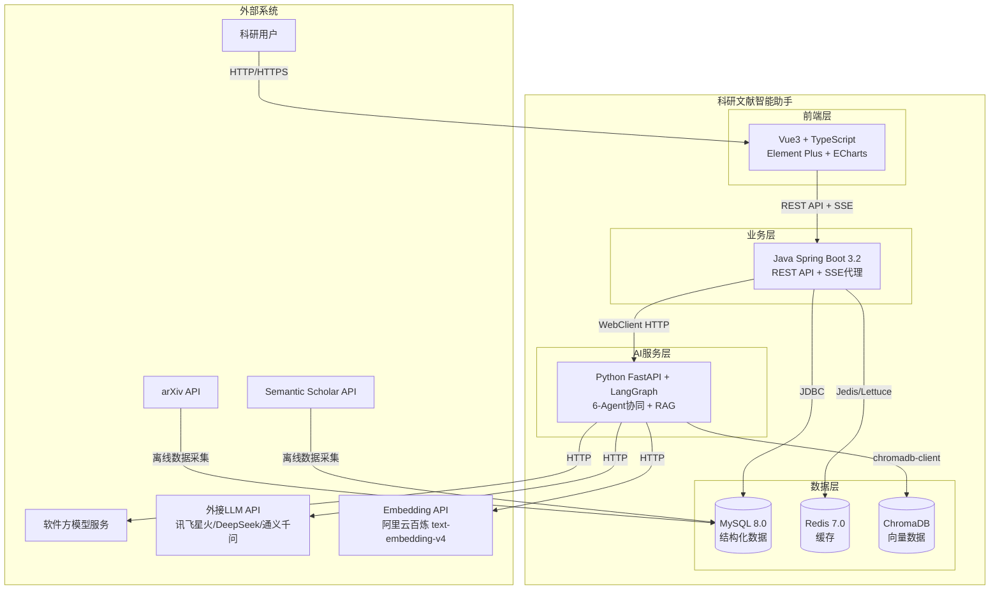
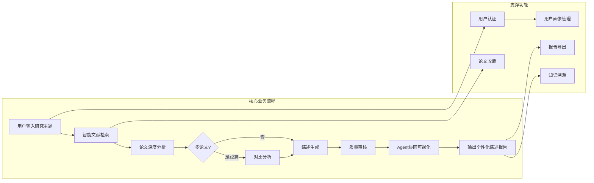
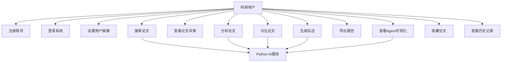

# XH-202630 科研文献智能助手

## 软件需求规格说明书（SRS）

---

> **课题编号**：XH-202630
> **课题名称**：领域知识个性化生成与多智能体协同决策系统研究
> **发榜单位**：上海云之脑智能科技有限公司（科大讯飞全资子公司）
> **文档版本**：v1.0
> **创建日期**：2026年5月29日
> **文档状态**：正式稿
> **编制依据**：IEEE 830-1998 软件需求规格说明书标准

---

## 修订历史

| 版本 | 日期 | 修订人 | 修订内容 |
|------|------|--------|---------|
| v1.0 | 2026-05-29 | 项目组 | 初始版本，基于项目策划案、系统架构设计、模块清单、技术栈、现有代码实现综合编写 |

---

## 目录

- [1 引言](#1-引言)
  - [1.1 编写目的](#11-编写目的)
  - [1.2 项目范围](#12-项目范围)
  - [1.3 定义、缩略语与术语](#13-定义缩略语与术语)
  - [1.4 参考文献](#14-参考文献)
  - [1.5 文档概述](#15-文档概述)
- [2 总体描述](#2-总体描述)
  - [2.1 产品视角](#21-产品视角)
  - [2.2 产品功能](#22-产品功能)
  - [2.3 用户特征](#23-用户特征)
  - [2.4 约束条件](#24-约束条件)
  - [2.5 假设与依赖](#25-假设与依赖)
- [3 具体需求](#3-具体需求)
  - [3.1 外部接口需求](#31-外部接口需求)
  - [3.2 功能需求](#32-功能需求)
  - [3.3 性能需求](#33-性能需求)
  - [3.4 设计约束](#34-设计约束)
  - [3.5 软件系统属性](#35-软件系统属性)
  - [3.6 其他需求](#36-其他需求)
- [4 数据需求](#4-数据需求)
  - [4.1 数据实体定义](#41-数据实体定义)
  - [4.2 数据量估算](#42-数据量估算)
  - [4.3 数据存储策略](#43-数据存储策略)
- [5 系统用例](#5-系统用例)
  - [5.1 用例图](#51-用例图)
  - [5.2 核心用例描述](#52-核心用例描述)
- [6 需求追踪矩阵](#6-需求追踪矩阵)
- [7 当前实现状态](#7-当前实现状态)
  - [7.1 各模块完成度](#71-各模块完成度)
  - [7.2 待实现功能清单](#72-待实现功能清单)
- [附录 A：验收标准](#附录-a验收标准)
- [附录 B：风险清单](#附录-b风险清单)

---

## 1 引言

### 1.1 编写目的

本软件需求规格说明书（SRS）旨在全面、精确地定义"科研文献智能助手"系统的全部功能需求、非功能需求、数据需求、接口需求与验收标准。本文档是后续系统设计、编码实现、测试验证、项目验收的**唯一基准依据**。

本文档的预期读者包括：

| 读者角色 | 使用目的 |
|---------|---------|
| 项目开发者 | 理解需实现的功能，指导编码 |
| 测试人员 | 编写测试用例，验证功能完整性 |
| 技术报告编写者 | 撰写技术报告时引用需求 |
| 发榜单位评审人员 | 评估系统是否满足课题要求 |
| 非开发团队成员 | 理解系统功能边界 |

### 1.2 项目范围

#### 1.2.1 系统身份

科研文献智能助手是一个基于多智能体协同的科研文献分析系统。研究者输入研究主题后，多个AI Agent自动协作完成**文献检索、内容分析、知识提取、综述生成**，并根据研究者的方向和水平输出个性化的文献分析报告。

#### 1.2.2 系统范围内（In-Scope）

| 编号 | 功能域 | 说明 |
|------|--------|------|
| IS-01 | 用户注册、登录与画像管理 | 用户账号管理及4维度科研画像 |
| IS-02 | 基于研究主题的智能论文检索 | 语义+关键词混合检索，RRF融合排序 |
| IS-03 | 单篇论文的AI深度分析 | 5维度结构化提取（研究问题/核心方法/主要实验/核心结论/局限性） |
| IS-04 | 多篇论文的对比分析 | 方法对比矩阵+矛盾自动发现 |
| IS-05 | 个性化文献综述生成 | 用户画像驱动的Prompt个性化 |
| IS-06 | Agent协同过程可视化 | SSE实时推送6个Agent执行状态 |
| IS-07 | 分析报告导出 | PDF/Word格式导出 |
| IS-08 | 知识溯源与引用核查 | 引用标注→原文跳转 |

#### 1.2.3 系统范围外（Out-of-Scope）

| 编号 | 排除项 | 原因 |
|------|--------|------|
| OS-01 | 论文PDF全文运行时解析 | 仅支持摘要和元数据级分析（PDF解析为离线预处理） |
| OS-02 | 实时在线论文数据库同步 | 论文数据为离线采集，非实时同步 |
| OS-03 | 用户之间的社交功能 | 不涉及社交、评论、分享 |
| OS-04 | 论文写作辅助 | 仅生成综述，不辅助论文写作 |
| OS-05 | 移动端原生应用 | 仅Web端，移动端通过响应式布局基础适配 |

### 1.3 定义、缩略语与术语

| 术语/缩略语 | 全称 | 定义 |
|------------|------|------|
| **Agent** | 智能体 | 具有自主决策能力的AI程序模块，拥有独立的Prompt和工具集 |
| **RAG** | Retrieval-Augmented Generation | 检索增强生成，结合知识库检索与大模型生成的技术范式 |
| **LLM** | Large Language Model | 大语言模型，本系统支持三路Provider（软件方模型/外接API/本地模型） |
| **Embedding** | 文本向量化 | 将文本转换为高维向量表示，本系统使用1024维向量 |
| **LangGraph** | — | 基于图结构的多Agent编排框架，用于定义Agent协同工作流 |
| **ChromaDB** | — | 轻量级开源向量数据库 |
| **Prompt** | 提示词 | 输入给大模型的指令文本，本系统为每个Agent维护独立Prompt模板 |
| **用户画像** | User Profile | 描述用户身份、知识水平、偏好的4维度结构化数据 |
| **RRF** | Reciprocal Rank Fusion | 倒数排序融合算法，用于合并语义检索和关键词检索的结果 |
| **SSE** | Server-Sent Events | 服务器推送事件，用于实时推送Agent执行状态 |
| **BGE** | BAAI General Embedding | 北京智源研究院发布的中文向量模型系列 |
| **JWT** | JSON Web Token | 无状态身份认证令牌 |

### 1.4 参考文献

| 编号 | 文档名称 | 版本 | 路径 |
|------|---------|------|------|
| [REF-01] | XH-202630-项目策划案 | v1.1 | `docs/XH-202630-科研文献助手/01-策划阶段/01-项目策划案.md` |
| [REF-02] | XH-202630-系统架构设计文档 | v1.0 | `docs/XH-202630-科研文献助手/02-设计阶段/03-系统架构设计文档.md` |
| [REF-03] | XH-202630-项目方案 | v1.1 | `docs/XH-202630-科研文献助手/05-风险管理/09-项目方案.md` |
| [REF-04] | 架构决策记录(ADR) | v1.0 | `docs/架构决策记录(ADR).md` |
| [REF-05] | 模块清单 | v1.1 | `docs/XH-202630-科研文献助手/02-设计阶段/04-模块清单.md` |
| [REF-06] | 技术栈 | v1.0 | `docs/XH-202630-科研文献助手/03-开发阶段/06-技术栈.md` |
| [REF-07] | 版本里程碑功能清单 | v1.0 | `docs/版本里程碑功能清单.md` |
| [REF-08] | 数据库设计文档 | v1.0 | `docs/database/数据库设计文档.md` |
| [REF-09] | 功能实现顺序 | v1.0 | `docs/XH-202630-科研文献助手/03-开发阶段/05-功能实现顺序.md` |
| [REF-10] | 项目里程碑文档 | v1.0 | `docs/项目里程碑文档.md` |

### 1.5 文档概述

本文档按照IEEE 830-1998标准组织，各章节内容如下：

- **第1章 引言**：文档目的、项目范围、术语定义
- **第2章 总体描述**：产品宏观视角、用户特征、约束条件
- **第3章 具体需求**：接口需求、功能需求（80项）、性能需求、非功能需求
- **第4章 数据需求**：数据实体、数据量、存储策略
- **第5章 系统用例**：用例图与核心用例描述
- **第6章 需求追踪矩阵**：需求→功能→模块→版本映射
- **第7章 当前实现状态**：各模块完成度与待实现清单
- **附录**：验收标准、风险清单

---

## 2 总体描述

### 2.1 产品视角

#### 2.1.1 系统边界图



#### 2.1.2 与现有系统的关系

本系统为全新开发，不依赖任何现有系统。系统采用三层分离架构独立部署，通过Docker Compose编排MySQL、Redis、Java后端、Python AI服务、前端Nginx五个服务。

#### 2.1.3 主要接口概览

| 接口 | 类型 | 调用方 | 提供方 | 协议 |
|------|------|--------|--------|------|
| 前端 ↔ Java后端 | 内部 | Vue3前端 | Java Spring Boot | REST/HTTP + SSE |
| Java后端 ↔ Python AI | 内部 | Java后端 | Python FastAPI | REST/HTTP |
| Python AI ↔ LLM | 外部 | Python AI | 软件方模型/外接API | REST/HTTP |
| Python AI ↔ Embedding | 外部 | Python AI | 阿里云百炼API | REST/HTTP |
| Python AI ↔ ChromaDB | 内部 | Python AI | ChromaDB | Python SDK |
| 离线采集 ↔ arXiv | 外部 | 数据采集脚本 | arXiv | REST/HTTP |

### 2.2 产品功能

#### 2.2.1 功能全景图



#### 2.2.2 功能模块总览

系统共分为**6大功能模块、22个子模块、80项功能点**，按优先级划分：

| 优先级 | 数量 | 定义 | 交付要求 |
|--------|------|------|---------|
| **P0（必须实现）** | 46个 | 核心功能，项目成功的必要条件 | 必须在v0.5（M5）前100%完成 |
| **P1（重要功能）** | 20个 | 显著提升用户体验的功能 | v0.5前完成≥80%，剩余可延至v1.0 |
| **P2（锦上添花）** | 14个 | 时间充裕时实现的功能 | v1.0前视情况完成 |

### 2.3 用户特征

#### 2.3.1 用户角色定义

| 角色 | 学历层次 | 知识水平 | 使用场景 | 核心需求 |
|------|---------|---------|---------|---------|
| **本科生** | 本科在读 | 初级，对领域零基础 | 课程学习、毕业设计 | 通俗易懂的入门指南、类比解释 |
| **硕士生** | 硕士在读 | 中级，有基础 | 科研选题、论文发表 | 方法对比、实验分析、代码示例 |
| **博士生** | 博士在读 | 高级，深入研究 | 前沿探索、创新研究 | 研究空白识别、创新方向建议 |
| **教师/研究者** | 博士/教授 | 专家 | 教学备课、领域综述 | 知识体系梳理、教学案例 |

#### 2.3.2 用户画像4维度

| 维度 | 字段 | 枚举值 | 个性化策略 |
|------|------|--------|-----------|
| 学历层次 | `education_level` | `undergraduate` / `master` / `phd` / `faculty` | 通俗解释+类比 / 方法对比+代码 / 前沿分析+创新 / 知识体系+教学 |
| 研究方向 | `research_field` | NLP / CV / RL / 多模态 / ... | 检索排序权重调整、领域上下文注入 |
| 知识水平 | `knowledge_level` | `beginner` / `intermediate` / `advanced` / `expert` | 术语密度 <5% / ~20% / ~40% / >50% |
| 偏好风格 | `preferred_style` | `simple` / `balanced` / `technical` | 日常用语+比喻 / 标准学术 / 正式学术+引用 |

### 2.4 约束条件

| 编号 | 约束类型 | 约束描述 | 影响 |
|------|---------|---------|------|
| CON-01 | 团队规模 | 仅1名开发者（全栈）+ 2名非开发者（数据/文档） | 所有代码开发由1人完成，依赖AI Coding辅助 |
| CON-02 | 开发周期 | 14周（2026年5月23日 - 9月30日） | 必须在规定时间内完成全部交付 |
| CON-03 | 预算 | ≤ ¥1,500 | 需优先使用免费/开源方案 |
| CON-04 | 模型策略 | 软件方模型优先，三路降级 | 需确保至少一路模型可用 |
| CON-05 | 论文来源 | 以arXiv为主，免费获取 | 数据覆盖范围有限 |
| CON-06 | 部署方式 | Docker Compose单机部署 | 不支持分布式集群 |
| CON-07 | 发榜单位需求 | 需求尚不明确 | 需保持灵活性，预留调整空间 |

### 2.5 假设与依赖

| 编号 | 假设 | 验证方式 | 失效风险 |
|------|------|---------|---------|
| ASM-01 | 至少一路LLM模型可用 | 启动时检查 | 系统核心功能不可用 |
| ASM-02 | text-embedding-v4对中文学术文本有足够好的向量化效果 | 检索准确率评估 | 需更换Embedding模型 |
| ASM-03 | ChromaDB在万级论文规模有足够检索性能 | 性能测试 | 需迁移至Milvus |
| ASM-04 | LangGraph框架稳定可用 | 版本测试 | 需备选CrewAI |
| ASM-05 | 外接API有免费额度或成本在预算内 | 成本监控 | 需切换本地模型 |
| ASM-06 | 3人团队可维持到项目结束 | 定期沟通 | 项目延期或质量下降 |

---

## 3 具体需求

### 3.1 外部接口需求

#### 3.1.1 用户界面

##### 3.1.1.1 页面结构

```
├── /login                    登录页
├── /register                 注册页
├── /                         首页（主题输入）
├── /search?q={query}         检索结果页
├── /paper/{paperId}          论文详情页
├── /compare                  对比分析页
├── /report/{sessionId}       综述报告页
├── /agent-flow/{sessionId}   Agent协同可视化页
└── /user/center              用户中心
```

##### 3.1.1.2 设计约束

| 要求 | 说明 |
|------|------|
| 设计风格 | 液态玻璃（Glassmorphism）设计系统 |
| 响应式 | 支持桌面端（≥1024px）和移动端基础适配（≥375px） |
| 浏览器支持 | Chrome 90+、Firefox 88+、Safari 14+、Edge 90+ |
| 语言 | 默认中文，预留英文支持 |
| 无障碍 | 语义化HTML，ARIA标签 |

#### 3.1.2 软件接口

##### 3.1.2.1 Java后端 REST API

| 接口 | 方法 | 路径 | 鉴权 | 说明 |
|------|------|------|------|------|
| 用户注册 | `POST` | `/api/users/register` | 否 | 创建新用户 |
| 用户登录 | `POST` | `/api/users/login` | 否 | 返回JWT Token |
| 用户信息查询 | `GET` | `/api/users/{userId}` | 是 | 查询用户基本信息 |
| 用户信息更新 | `PUT` | `/api/users/{userId}` | 是 | 修改用户信息 |
| 用户画像查询 | `GET` | `/api/users/{userId}/profile` | 是 | 获取用户画像 |
| 用户画像创建 | `POST` | `/api/users/{userId}/profile` | 是 | 首次设置画像 |
| 用户画像更新 | `PUT` | `/api/users/{userId}/profile` | 是 | 修改画像 |
| 论文列表 | `GET` | `/api/papers?page=1&size=10` | 是 | 分页查询 |
| 论文详情 | `GET` | `/api/papers/{paperId}` | 是 | 论文完整信息 |
| 论文搜索 | `GET` | `/api/papers/search?q=...` | 是 | 关键词搜索 |
| 论文收藏 | `POST` | `/api/papers/{paperId}/favorite` | 是 | 收藏论文 |
| 取消收藏 | `DELETE` | `/api/papers/{paperId}/favorite` | 是 | 取消收藏 |
| 创建会话 | `POST` | `/api/sessions` | 是 | 创建分析会话 |
| 会话列表 | `GET` | `/api/sessions?userId={userId}` | 是 | 历史会话 |
| 会话详情 | `GET` | `/api/sessions/{sessionId}` | 是 | 会话完整信息 |
| 会话状态更新 | `PUT` | `/api/sessions/{sessionId}/status` | 是 | 更新状态 |
| 会话删除 | `DELETE` | `/api/sessions/{sessionId}` | 是 | 删除会话 |
| 论文分析请求 | `POST` | `/api/analysis/paper` | 是 | 创建分析任务 |
| 对比分析请求 | `POST` | `/api/analysis/compare` | 是 | 创建对比任务 |
| 综述生成请求 | `POST` | `/api/analysis/report` | 是 | 创建综述任务 |
| 分析结果查询 | `GET` | `/api/analysis/{analysisId}` | 是 | 获取分析结果 |
| 分析状态查询 | `GET` | `/api/analysis/{analysisId}/status` | 是 | 获取分析进度 |
| Agent状态流 | `GET` | `/api/analysis/{analysisId}/agent-stream` | 是 | SSE推送 |

##### 3.1.2.2 Python AI服务 API

| 接口 | 方法 | 路径 | 说明 |
|------|------|------|------|
| Agent工作流 | `POST` | `/api/agent/analyze` | 启动Agent协同工作流 |
| 语义检索 | `POST` | `/api/search` | 语义检索论文 |
| 模型状态 | `GET` | `/api/model/status` | 模型加载状态 |
| 健康检查 | `GET` | `/health` | 服务健康检查 |

##### 3.1.2.3 统一响应格式

```json
{
  "code": 200,
  "message": "success",
  "data": {},
  "timestamp": "2026-05-29T10:00:00Z"
}
```

##### 3.1.2.4 SSE事件格式

```
event: agent_state_update
data: {"agent_name": "retriever", "status": "running", "progress": 0.6, "intermediate_result": "找到15篇相关论文"}
```

##### 3.1.2.5 Java→Python请求契约

```json
{
  "topic": "Multi-Agent协同决策",
  "paper_ids": ["arxiv_2024_001"],
  "user_id": "usr_001",
  "user_profile": {
    "education_level": "master",
    "research_field": "NLP",
    "knowledge_level": "intermediate",
    "preferred_style": "balanced"
  }
}
```

#### 3.1.3 通信接口

| 通信方式 | 用途 | 配置 |
|---------|------|------|
| HTTP/1.1 REST | 常规API调用 | 超时30s，连接池max=20 |
| SSE | Agent状态实时推送 | `proxy_buffering off; proxy_read_timeout 300s` |
| JDBC | MySQL数据库连接 | HikariCP连接池，max=20 |
| Jedis/Lettuce | Redis缓存连接 | 连接池max=10 |

### 3.2 功能需求

#### 3.2.1 功能模块 F1：前端模块

##### F1.1 用户界面子模块

| 功能编号 | 功能名称 | 优先级 | 描述 | 输入 | 输出 | 验收标准 |
|---------|---------|--------|------|------|------|---------|
| **F1.1.1** | 用户登录/注册 | P0 | 用户注册新账号或登录已有账号。注册需提供用户名、邮箱、密码（BCrypt加密）。登录后返回JWT Token（24h有效期）。 | 用户名、邮箱、密码 | JWT Token + 用户基本信息 | 1. 注册成功返回201；2. 用户名重复返回409；3. 登录成功返回Token；4. 密码错误返回401；5. Token过期后重定向登录 |
| **F1.1.2** | 用户画像设置 | P0 | 首次登录后引导用户设置4维度画像。未设置画像时功能受限（仅可使用基础检索）。 | 学历层次、研究方向、知识水平、偏好风格 | 画像数据持久化存储 | 1. 四个维度全部必填；2. 数据持久化；3. 未设置画像时提示引导 |
| **F1.1.3** | 用户画像编辑 | P1 | 修改已设置的用户画像。修改后缓存失效，新画像即时生效。 | 修改的画像字段 | 更新后的画像 | 1. 修改成功后新请求使用更新画像；2. 历史分析结果不受影响 |
| **F1.1.4** | 历史记录查看 | P1 | 查看用户的历史分析会话和综述报告，按时间倒序，支持关键词搜索。 | 搜索关键词（可选） | 历史会话列表 | 1. 按时间倒序展示；2. 关键词搜索正确过滤 |

##### F1.2 论文检索子模块

| 功能编号 | 功能名称 | 优先级 | 描述 | 输入 | 输出 | 验收标准 |
|---------|---------|--------|------|------|------|---------|
| **F1.2.1** | 主题输入 | P0 | 首页提供研究主题输入框，支持自然语言（中英文），保留最近10条搜索历史。 | 研究主题文本 | 搜索历史展示 | 1. 中英文输入正常；2. 历史记录正确保存和展示 |
| **F1.2.2** | 智能检索 | P0 | 调用语义+关键词混合检索API，返回Top10相关论文，结合用户研究方向个性化排序。 | 研究主题 | 论文列表（Top10） | 1. Top10相关性 > 80%；2. 个性化排序生效 |
| **F1.2.3** | 结果展示 | P0 | 论文卡片列表展示：标题、作者（截断3人）、摘要（截断200字）、关键词标签、相关度评分、推荐理由。分页（每页10篇）。 | 检索结果 | 论文卡片列表 | 1. 信息展示完整；2. 推荐理由清晰；3. 分页正常 |
| **F1.2.4** | 筛选排序 | P1 | 筛选面板：年份范围、引用数范围、发表会议/期刊。排序：相关度、发表时间、引用数。 | 筛选条件 | 过滤后的论文列表 | 1. 筛选正确过滤；2. 排序正确生效 |
| **F1.2.5** | 论文收藏 | P2 | 收藏/取消收藏。个人中心查看收藏列表。 | 论文ID | 收藏状态变更 | 1. 收藏/取消正确；2. 收藏列表正确展示 |
| **F1.2.6** | 历史搜索 | P2 | 查看和管理历史搜索记录，可删除或复用。 | — | 历史搜索列表 | 1. 历史记录正确保存；2. 可删除和复用 |

##### F1.3 论文分析子模块

| 功能编号 | 功能名称 | 优先级 | 描述 | 输入 | 输出 | 验收标准 |
|---------|---------|--------|------|------|------|---------|
| **F1.3.1** | 论文详情 | P0 | 论文完整信息展示：标题、作者列表、完整摘要、关键词、发表年份、会议/期刊、引用数、PDF链接。 | 论文ID | 论文详情页 | 1. 所有元数据正确展示；2. PDF链接可跳转 |
| **F1.3.2** | 智能分析 | P0 | 调用分析Agent提取论文核心信息，5维度结构化卡片展示（研究问题/核心方法/主要实验/核心结论/局限性）。有加载动画和进度提示。 | 论文ID | 5维度分析卡片 | 1. 5维度提取完整；2. 输出JSON格式；3. 耗时 < 30s |
| **F1.3.3** | 通俗解释 | P0 | 知识水平为初级或中级时，自动展示通俗化解释，使用类比和日常例子。 | 分析结果 + 用户画像 | 通俗解释区域 | 1. 初级用户可见；2. 含类比；3. 高级用户不展示 |
| **F1.3.4** | 多论文选择 | P1 | 勾选2-5篇论文进行对比分析。 | 论文ID列表 | 选中状态 | 1. 支持2-5篇选择；2. 超出范围提示 |
| **F1.3.5** | 对比分析 | P1 | 多论文在方法、数据集、性能、结论等维度的对比表格+文字总结。 | 2-5篇论文分析结果 | 对比表格 + 总结 | 1. 对比维度完整；2. 文字总结连贯 |
| **F1.3.6** | 矛盾发现 | P2 | 自动标注论文间观点冲突，高亮显示矛盾点，引用原文佐证，给出可能原因。 | 对比分析结果 | 矛盾标注+原文引用 | 1. 能发现观点矛盾；2. 有原文引用 |

##### F1.4 综述生成子模块

| 功能编号 | 功能名称 | 优先级 | 描述 | 输入 | 输出 | 验收标准 |
|---------|---------|--------|------|------|------|---------|
| **F1.4.1** | 综述生成 | P0 | 启动多Agent协同流程，生成完整文献综述：引言、研究现状、方法对比、研究趋势、参考文献。 | 论文范围+用户画像 | 完整综述报告 | 1. 结构完整；2. 含引用标注；3. 有Agent可视化 |
| **F1.4.2** | 个性化输出 | P0 | 根据画像调整综述深度和风格。同一主题不同画像用户获得差异度 > 60%的综述。 | 用户画像 | 个性化综述 | 1. 不同画像输出差异明显；2. 差异度 > 60% |
| **F1.4.3** | 内容编辑 | P2 | 用户可手动编辑生成结果，修改后可保存。 | 编辑内容 | 保存后的综述 | 1. 编辑区可输入；2. 修改后可保存 |
| **F1.4.4** | 报告导出 | P1 | 导出PDF和Word格式。保留格式和引用标注。 | 综述内容 | PDF/Word文件 | 1. PDF格式正确；2. Word格式正确；3. 引用保留 |
| **F1.4.5** | 引用溯源 | P1 | 点击引用标注跳转原文片段弹窗，展示来源论文和原文内容。 | 引用标注 | 原文片段弹窗 | 1. 引用可点击；2. 跳转展示原文 |

##### F1.5 Agent可视化子模块

| 功能编号 | 功能名称 | 优先级 | 描述 | 输入 | 输出 | 验收标准 |
|---------|---------|--------|------|------|------|---------|
| **F1.5.1** | 工作流展示 | P1 | ECharts实时展示6个Agent节点和数据流向，当前活跃节点高亮。 | Agent状态数据 | 流程图 | 1. 6节点正确展示；2. 活跃节点高亮 |
| **F1.5.2** | 状态监控 | P1 | 各Agent运行状态：等待中（灰色）、执行中（蓝色动画）、已完成（绿色）、失败（红色）。SSE实时推送。 | Agent状态 | 状态面板 | 1. 颜色正确；2. 实时更新 |
| **F1.5.3** | 中间结果 | P1 | 展示各Agent产出摘要。如"找到15篇相关论文"、"已分析8/10篇"。 | Agent中间结果 | 摘要展示 | 1. 内容正确；2. 简洁清晰 |
| **F1.5.4** | 耗时统计 | P2 | 每个Agent执行耗时柱状图和总体进度百分比。 | 耗时数据 | 统计图表 | 1. 数据准确；2. 进度条正确 |
| **F1.5.5** | 流程回放 | P2 | 回放已完成Agent协同的完整过程，可暂停。 | 历史会话 | 回放动画 | 1. 回放流畅；2. 可暂停 |

---

#### 3.2.2 功能模块 F2：Java后端模块

##### F2.1 用户管理子模块

| 功能编号 | 功能名称 | 优先级 | 描述 | 关键逻辑 |
|---------|---------|--------|------|---------|
| **F2.1.1** | 用户注册 | P0 | 新建用户账号。验证用户名唯一性、邮箱格式、密码强度（≥6位）。密码BCrypt加密存储。 | `POST /api/users/register` → 验证用户名唯一 → BCrypt加密 → 保存users表 → 返回userId |
| **F2.1.2** | 用户登录 | P0 | 验证用户名密码，生成JWT Token（24h有效期），返回用户信息。 | `POST /api/users/login` → BCrypt验证 → 生成JWT → 返回Token+userId |
| **F2.1.3** | 用户信息查询 | P0 | 根据userId查询用户基本信息。 | `GET /api/users/{userId}` → 验证JWT → 查询users表 → 返回UserResponse |
| **F2.1.4** | 用户信息更新 | P1 | 修改邮箱、密码。验证权限（只能修改自己的信息）。 | `PUT /api/users/{userId}` → 验证JWT+权限 → 更新 → 返回成功 |
| **F2.1.5** | 用户画像管理 | P0 | 画像CRUD操作。PUT时更新MySQL + 删除Redis缓存。 | `GET/POST/PUT /api/users/{userId}/profile` → 读Redis缓存 → 未命中查MySQL → 写时先MySQL后删Redis |

##### F2.2 论文管理子模块

| 功能编号 | 功能名称 | 优先级 | 描述 |
|---------|---------|--------|------|
| **F2.2.1** | 论文列表查询 | P0 | 分页查询论文元数据。支持按年份、会议等筛选。 |
| **F2.2.2** | 论文详情查询 | P0 | 查询单篇论文完整信息（含所有字段）。 |
| **F2.2.3** | 论文搜索 | P0 | 关键词搜索（MySQL FULLTEXT索引），支持yearFrom/yearTo筛选和排序。 |
| **F2.2.4** | 论文收藏 | P2 | 收藏/取消收藏。用户只能操作自己的收藏。 |
| **F2.2.5** | 论文导入 | P2 | 批量导入论文元数据（JSON格式）。 |

##### F2.3 会话管理子模块

| 功能编号 | 功能名称 | 优先级 | 描述 |
|---------|---------|--------|------|
| **F2.3.1** | 创建会话 | P0 | 创建分析会话，关联用户和研究主题，初始状态为active。 |
| **F2.3.2** | 会话列表 | P0 | 查询用户历史会话，按时间倒序。 |
| **F2.3.3** | 会话详情 | P1 | 查询会话完整信息（含关联的分析结果）。 |
| **F2.3.4** | 会话状态更新 | P1 | 更新会话状态（active/completed/expired）。 |
| **F2.3.5** | 会话删除 | P1 | 删除会话及关联数据。 |

##### F2.4 分析服务子模块

| 功能编号 | 功能名称 | 优先级 | 描述 |
|---------|---------|--------|------|
| **F2.4.1** | 论文分析请求 | P0 | 接收论文ID和用户ID，创建分析任务，调用Python AI服务。 |
| **F2.4.2** | 对比分析请求 | P1 | 接收多个论文ID，创建对比分析任务。 |
| **F2.4.3** | 综述生成请求 | P0 | 接收主题、论文范围、用户画像，启动多Agent协同综述生成。 |
| **F2.4.4** | 分析结果查询 | P0 | 查询分析结果（结构化JSON）。 |
| **F2.4.5** | 分析状态查询 | P0 | 实时查询分析进度和当前执行的Agent。 |

##### F2.5 AI服务调用子模块

| 功能编号 | 功能名称 | 优先级 | 描述 |
|---------|---------|--------|------|
| **F2.5.1** | Python服务客户端 | P0 | 封装WebClient HTTP调用，连接池max=20，超时30s，重试1次。 |
| **F2.5.2** | 请求转换 | P0 | Java DTO → Python JSON（camelCase → snake_case）。 |
| **F2.5.3** | 响应解析 | P0 | Python JSON → Java DTO（snake_case → camelCase）。 |
| **F2.5.4** | 异步调用 | P1 | WebFlux异步调用AI服务，支持SSE转发。 |
| **F2.5.5** | 错误处理 | P1 | 处理超时/服务不可用/返回错误，降级返回缓存或提示重试。 |

##### F2.6 缓存管理子模块

| 功能编号 | 功能名称 | 优先级 | 缓存策略 |
|---------|---------|--------|---------|
| **F2.6.1** | 用户画像缓存 | P0 | `user:profile:{userId}`，TTL 1h，更新时主动失效 |
| **F2.6.2** | 论文检索缓存 | P1 | `search:result:{queryHash}`，TTL 10min |
| **F2.6.3** | 分析结果缓存 | P1 | `analysis:result:{analysisId}`，TTL 30min |
| **F2.6.4** | 会话状态缓存 | P1 | `session:state:{sessionId}`，会话期间有效 |

---

#### 3.2.3 功能模块 F3：Python AI服务模块

##### F3.1 多Agent协同引擎子模块

| 功能编号 | 功能名称 | 优先级 | 描述 | 输入 | 输出 | 超时 |
|---------|---------|--------|------|------|------|------|
| **F3.1.1** | 协调者Agent | P0 | 任务分解与调度。接收用户问题和画像，分解为2-5个子任务，分配给其他Agent，监督执行，汇总最终结果。 | query + user_profile | sub_tasks[] | 30s |
| **F3.1.2** | 检索Agent | P0 | 语义+关键词混合检索。调用向量检索工具从ChromaDB检索，返回Top10论文。 | sub_tasks → 检索关键词 | search_results[] (Top10) | 30s |
| **F3.1.3** | 分析Agent | P0 | 深度文献分析。使用LLM提取论文5维度核心信息，输出结构化JSON。 | search_results → 论文列表 | analysis_results[] (5维度JSON) | 30s |
| **F3.1.4** | 对比Agent | P1 | 多文献对比。在方法、数据集、性能、结论维度对比2-5篇论文，检测观点矛盾。条件执行（论文数≥2）。 | analysis_results | compare_result (对比+矛盾) | 30s |
| **F3.1.5** | 生成Agent | P0 | 综述生成。接收分析结果+用户画像，生成个性化文献综述。 | analysis + profile | report (个性化综述) | 30s |
| **F3.1.6** | 审核Agent | P1 | 质量审核。检查生成内容准确性和引用正确性，与知识库原文比对。 | report + original_papers | review_result (审核+修改建议) | 30s |
| **F3.1.7** | 工作流编排 | P0 | LangGraph StateGraph编排6-Agent协同流程。顺序执行+条件分支（对比Agent仅在论文数≥2时激活）。 | — | 完整工作流 | — |
| **F3.1.8** | 降级机制 | P1 | 三级降级：Agent级（单Agent超时跳过）→ 工作流级（降级为单Agent模式）→ LLM级（三路Provider切换）。 | — | 降级后返回部分结果+降级说明 | — |

##### F3.2 RAG检索子模块

| 功能编号 | 功能名称 | 优先级 | 描述 |
|---------|---------|--------|------|
| **F3.2.1** | 文档向量化 | P0 | BAAI/bge-m3 或 text-embedding-v4将论文标题+摘要转换为1024维向量 |
| **F3.2.2** | 向量存储 | P0 | ChromaDB存储向量+元数据（paper_id, title, year, venue, citation_count） |
| **F3.2.3** | 语义检索 | P0 | 查询向量 → cosine相似度 → TopK文档 |
| **F3.2.4** | 混合检索 | P1 | 关键词检索（MySQL FULLTEXT）+ 语义检索（ChromaDB）→ RRF融合（k=60） |
| **F3.2.5** | 重排序 | P1 | Cross-Encoder或规则方法重排序，提升Top5质量 |
| **F3.2.6** | 检索优化 | P2 | 调整chunk_size/top_k/similarity_threshold，优化准确率 > 85% |

##### F3.3 LLM服务子模块

| 功能编号 | 功能名称 | 优先级 | 描述 |
|---------|---------|--------|------|
| **F3.3.1** | 统一推理接口 | P0 | 封装`generate()`和`generate_stream()`，屏蔽底层Provider差异 |
| **F3.3.2** | 模型推理 | P0 | 输入Prompt → 输出生成文本。支持同步和流式 |
| **F3.3.3** | 流式输出 | P1 | 逐Token输出，首字节 < 2秒 |
| **F3.3.4** | Prompt管理 | P0 | 每个Agent独立Prompt模板，支持`{topic}`、`{user_level}`等变量替换 |
| **F3.3.5** | 自动降级 | P0 | 软件方模型 → 外接API → 用户本地模型，每5分钟尝试恢复 |
| **F3.3.6** | 外接API管理 | P0 | 统一管理多种API密钥、端点、模型名称，支持OpenAI兼容接口 |
| **F3.3.7** | 模型量化 | P2 | INT4/INT8量化推理，精度下降 < 5%，速度提升30%+ |

##### F3.4 个性化引擎子模块

| 功能编号 | 功能名称 | 优先级 | 描述 |
|---------|---------|--------|------|
| **F3.4.1** | 用户画像解析 | P0 | 解析Java后端传递的画像JSON，提取4维度字段 |
| **F3.4.2** | Prompt个性化 | P0 | 根据画像动态构建个性化Prompt片段，注入Agent系统Prompt |
| **F3.4.3** | 内容难度适配 | P0 | 根据knowledge_level调整术语密度和深度 |
| **F3.4.4** | 风格适配 | P1 | 根据preferred_style调整表达方式 |
| **F3.4.5** | 推荐策略 | P2 | 根据research_field+历史行为推荐论文 |

##### F3.5 API服务子模块

| 功能编号 | 功能名称 | 优先级 | API接口 |
|---------|---------|--------|---------|
| **F3.5.1** | Agent调用接口 | P0 | `POST /api/agent/analyze` |
| **F3.5.2** | 检索接口 | P0 | `POST /api/search` |
| **F3.5.3** | 健康检查 | P0 | `GET /health` |
| **F3.5.4** | 模型状态 | P1 | `GET /api/model/status` |

---

#### 3.2.4 功能模块 F4：数据模块

##### F4.1 MySQL数据子模块

| 功能编号 | 功能名称 | 优先级 | 描述 |
|---------|---------|--------|------|
| **F4.1.1** | 论文元数据存储 | P0 | papers表：paper_id(UQ)、title、authors(JSON)、abstract(TEXT)、year、venue、keywords(JSON)、citation_count、pdf_url |
| **F4.1.2** | 用户数据存储 | P0 | users表 + user_profiles表 |
| **F4.1.3** | 会话数据存储 | P0 | sessions表 + analysis_results表 |
| **F4.1.4** | 全文索引 | P1 | papers表title和abstract字段FULLTEXT索引（ngram parser） |

##### F4.2 Redis缓存子模块

| 功能编号 | 功能名称 | 优先级 | 描述 |
|---------|---------|--------|------|
| **F4.2.1** | 用户会话缓存 | P0 | JWT Token黑名单，登录状态缓存 |
| **F4.2.2** | 热点数据缓存 | P0 | 热门论文、检索结果缓存 |
| **F4.2.3** | Agent状态缓存 | P1 | 临时存储Agent执行状态，用于SSE推送 |
| **F4.2.4** | 分布式锁 | P2 | 并发控制，防止重复分析 |

##### F4.3 Chroma向量库子模块

| 功能编号 | 功能名称 | 优先级 | 描述 |
|---------|---------|--------|------|
| **F4.3.1** | 论文向量存储 | P0 | Collection: papers，维度1024，距离cosine |
| **F4.3.2** | 语义相似度检索 | P0 | HNSW参数：M=16, construction_ef=200 |
| **F4.3.3** | 向量索引管理 | P1 | 索引创建、更新、删除 |
| **F4.3.4** | 批量导入 | P0 | 200+篇论文向量批量导入 |

##### F4.4 论文数据采集子模块

| 功能编号 | 功能名称 | 优先级 | 描述 |
|---------|---------|--------|------|
| **F4.4.1** | arXiv数据采集 | P0 | 从arXiv API下载AI/Agent领域论文200+篇 |
| **F4.4.2** | 数据清洗 | P0 | 去重（按标题+作者）、格式统一、元数据标准化 |
| **F4.4.3** | 文档分块 | P0 | 500-1000字/块，重叠50-100字 |
| **F4.4.4** | 质量检查 | P0 | 检查数据完整性、格式正确性、内容准确性 |

---

#### 3.2.5 功能模块 F5：模型模块

##### F5.1 大语言模型子模块

| 功能编号 | 功能名称 | 优先级 | 描述 |
|---------|---------|--------|------|
| **F5.1.1** | 灵活模型配置 | P0 | 三路并行：软件方模型（P0）→ 外接API（P1）→ 用户本地模型（P2），按优先级自动选择 |
| **F5.1.2** | 模型推理服务 | P0 | 统一推理接口，屏蔽底层差异 |
| **F5.1.3** | 流式生成 | P1 | 首字节 < 2秒 |
| **F5.1.4** | 软件方模型对接 | P0 | 对接软件方云端模型，默认最高优先级 |
| **F5.1.5** | 自动降级 | P0 | 三路降级，每5分钟尝试恢复 |
| **F5.1.6** | 外接API管理 | P0 | 统一管理API密钥、端点 |

##### F5.2 Embedding模型子模块

| 功能编号 | 功能名称 | 优先级 | 描述 |
|---------|---------|--------|------|
| **F5.2.1** | 阿里云百炼API配置 | P0 | text-embedding-v4，1024维，0.0005元/千Token |
| **F5.2.2** | 文本向量化 | P0 | 优先API，备选本地模型 |
| **F5.2.3** | 批量向量化 | P0 | 100条/10秒 |
| **F5.2.4** | 本地模型备选 | P1 | 本地Embedding模型备选 |

---

### 3.3 性能需求

| 编号 | 需求 | 指标 | 优先级 | 验证方法 |
|------|------|------|--------|---------|
| **NFR-P01** | 论文检索响应时间 | ≤ 3秒 | P0 | 自动计时 |
| **NFR-P02** | 单篇论文分析响应时间 | ≤ 30秒 | P0 | 自动计时 |
| **NFR-P03** | 综述生成端到端响应时间 | ≤ 60秒 | P0 | 自动计时 |
| **NFR-P04** | 流式输出首字节响应时间 | ≤ 2秒 | P1 | 自动计时 |
| **NFR-P05** | 非AI调用API响应时间 | ≤ 500ms | P0 | 自动计时 |
| **NFR-P06** | 95%请求响应时间 | ≤ 5秒 | P1 | 压力测试 |
| **NFR-P07** | 批量向量化处理速度 | 100条/10秒 | P0 | 批量测试 |
| **NFR-P08** | 并发用户支持 | ≥ 50并发 | P1 | 压力测试 |
| **NFR-P09** | 缓存命中率 | > 50% | P1 | 监控统计 |

### 3.4 设计约束

#### 3.4.1 技术栈约束

| 层级 | 技术 | 版本 | 约束说明 |
|------|------|------|---------|
| 前端 | Vue3 + Composition API | 3.5+ | 必须使用 `<script setup lang="ts">` |
| 前端 | TypeScript | 5.0+ | 严格模式 |
| 前端 | Vite | 6.0+ | 构建工具 |
| 前端 | Element Plus | 2.14+ | UI组件库 |
| 前端 | ECharts | 5.6+ | Agent可视化 |
| 前端 | Pinia | 2.3+ | 状态管理 |
| 后端 | Java | 17 | LTS版本 |
| 后端 | Spring Boot | 3.2+ | 必须使用分层架构 |
| 后端 | Spring Data JPA | — | ORM |
| 后端 | HikariCP | max=20 | 连接池 |
| AI服务 | Python | 3.10+ | 必须使用类型注解 |
| AI服务 | FastAPI | 0.115+ | 异步框架 |
| AI服务 | LangGraph | — | Agent编排 |
| AI服务 | ChromaDB | 0.5+ | 向量数据库 |
| 数据库 | MySQL | 8.0 | 关系数据库 |
| 缓存 | Redis | 7.0 | 缓存 |
| 部署 | Docker Compose | — | 5服务编排 |

#### 3.4.2 架构约束

| 约束 | 说明 |
|------|------|
| 三层分离 | 前端层 ↔ 业务层（Java） ↔ AI服务层（Python），通过HTTP API通信 |
| Entity与DTO分离 | 禁止直接返回Entity给前端 |
| 分层架构 | Controller → Service → Repository → Client，禁止跨层调用 |
| 缓存策略 | Cache-Aside模式，写后删缓存 |
| 安全 | JWT认证 + BCrypt密码 + Redis黑名单 |

### 3.5 软件系统属性

#### 3.5.1 可靠性

| 编号 | 需求 | 指标 |
|------|------|------|
| **NFR-R01** | 系统可用性 | ≥ 99%（单机部署） |
| **NFR-R02** | Agent协同降级成功率 | ≥ 95%（降级后仍返回部分结果） |
| **NFR-R03** | AI服务调用成功率 | ≥ 99%（含重试和降级） |
| **NFR-R04** | 数据不丢失 | 异常重启后数据完整 |
| **NFR-R05** | 单Agent超时 | 30秒后跳过，继续后续流程 |

#### 3.5.2 安全性

| 编号 | 需求 | 优先级 |
|------|------|--------|
| **NFR-S01** | 用户密码BCrypt加密存储 | P0 |
| **NFR-S02** | API接口JWT Token鉴权（24h有效期） | P0 |
| **NFR-S03** | 敏感信息（API密钥）通过环境变量配置，不硬编码 | P0 |
| **NFR-S04** | 用户数据隔离（WHERE user_id = currentUserId） | P0 |
| **NFR-S05** | 生成内容标注"AI生成，仅供参考" | P1 |
| **NFR-S06** | 前端输入转义防XSS | P0 |
| **NFR-S07** | JPA参数化查询防SQL注入 | P0 |

#### 3.5.3 可维护性

| 编号 | 需求 | 优先级 |
|------|------|--------|
| **NFR-M01** | 代码注释覆盖率 > 30% | P1 |
| **NFR-M02** | 模块间通过API解耦，支持独立部署和升级 | P0 |
| **NFR-M03** | API文档（Swagger/OpenAPI格式） | P1 |
| **NFR-M04** | 配置项外置（application.yml + .env），不硬编码 | P0 |
| **NFR-M05** | 日志规范统一，包含请求ID（RequestIdFilter） | P1 |

#### 3.5.4 可扩展性

| 编号 | 需求 | 优先级 |
|------|------|--------|
| **NFR-E01** | Agent数量可扩展（新增Agent无需修改框架代码） | P1 |
| **NFR-E02** | 向量数据库可迁移（ChromaDB → Milvus） | P2 |
| **NFR-E03** | LLM可替换（已实现三路并行自动降级） | P0 |
| **NFR-E04** | 知识库可动态更新（新增论文后自动向量化入库） | P1 |

#### 3.5.5 可用性

| 编号 | 需求 | 优先级 |
|------|------|--------|
| **NFR-U01** | 界面响应时间 < 200ms（页面切换、数据加载） | P1 |
| **NFR-U02** | 支持中文和英文界面 | P0 |
| **NFR-U03** | Agent执行过程有进度提示和加载动画 | P0 |
| **NFR-U04** | 错误提示信息友好、明确 | P1 |
| **NFR-U05** | 移动端基础可用（响应式布局） | P2 |

---

### 3.6 其他需求

#### 3.6.1 运行环境

| 环境 | 要求 |
|------|------|
| 客户端 | 现代浏览器（Chrome 90+、Firefox 88+、Safari 14+、Edge 90+） |
| 服务端OS | Linux（推荐 Ubuntu 22.04+） |
| 运行时 | JDK 17+、Python 3.10+、Node.js 18+ |
| GPU | 可选。本地模型7B级推荐 ≥ 16GB显存，1.5B级CPU即可 |
| 内存 | 4GB（外接API模式）/ 8GB（本地小模型）/ 32GB（本地7B模型） |
| 磁盘 | 10GB+（外接API）/ 50GB+（本地模型） |
| 网络 | 外接API模式需稳定网络；本地模型模式无需外网 |

#### 3.6.2 部署需求

Docker Compose部署，5服务编排：

| 服务 | 镜像 | 端口 | 启动顺序 | 健康检查 |
|------|------|------|---------|---------|
| MySQL | mysql:8.0 | 3306 | 1 | `mysqladmin ping` |
| Redis | redis:7-alpine | 6379 | 2 | `redis-cli ping` |
| AI Service | python:3.10-slim | 8000 | 3 | `GET /health` |
| Java Backend | eclipse-temurin:17-jre-alpine | 8080 | 4 | `GET /actuator/health` |
| Frontend | nginx:alpine | 80 | 5 | `curl localhost` |

#### 3.6.3 交付物需求

| 交付物 | 格式 | 要求 |
|--------|------|------|
| 源代码 | Git仓库 | 可编译运行，含README和部署文档 |
| 技术研究报告 | PDF | 50-80页，含系统设计+实验数据+对比分析 |
| 演示视频 | MP4 | 10-15分钟，含所有核心功能演示 |
| 答辩PPT | PPT | 20-25页，含方案+创新点+实验结果 |
| 用户手册 | PDF | 非技术用户可按手册操作 |

---

## 4 数据需求

### 4.1 数据实体定义

#### 4.1.1 MySQL数据表

##### users表

| 字段 | 类型 | 约束 | 说明 |
|------|------|------|------|
| id | BIGINT | PK, AUTO_INCREMENT | 主键 |
| user_id | VARCHAR(50) | UQ, NOT NULL | 用户唯一ID（如usr_001） |
| username | VARCHAR(100) | UQ, NOT NULL | 用户名 |
| email | VARCHAR(200) | | 邮箱 |
| password_hash | VARCHAR(200) | NOT NULL | BCrypt加密密码 |
| created_at | DATETIME | NOT NULL, DEFAULT NOW() | 创建时间 |
| updated_at | DATETIME | NOT NULL | 更新时间 |

##### user_profiles表

| 字段 | 类型 | 约束 | 说明 |
|------|------|------|------|
| id | BIGINT | PK, AUTO_INCREMENT | 主键 |
| user_id | BIGINT | FK(users.id), UQ | 关联用户 |
| education_level | ENUM('undergraduate','master','phd','faculty') | NOT NULL | 学历层次 |
| research_field | VARCHAR(200) | NOT NULL | 研究方向 |
| knowledge_level | ENUM('beginner','intermediate','advanced','expert') | NOT NULL | 知识水平 |
| preferred_style | ENUM('simple','balanced','technical') | NOT NULL | 偏好风格 |
| profile_data | JSON | | 扩展画像数据 |
| created_at | DATETIME | NOT NULL | 创建时间 |
| updated_at | DATETIME | NOT NULL | 更新时间 |

##### papers表

| 字段 | 类型 | 约束 | 说明 |
|------|------|------|------|
| id | BIGINT | PK, AUTO_INCREMENT | 主键 |
| paper_id | VARCHAR(100) | UQ, NOT NULL | 论文唯一ID |
| title | VARCHAR(500) | NOT NULL | 论文标题 |
| authors | JSON | | 作者列表 |
| abstract | TEXT | | 摘要 |
| year | INT | | 发表年份 |
| venue | VARCHAR(200) | | 会议/期刊 |
| keywords | JSON | | 关键词列表 |
| citation_count | INT | DEFAULT 0 | 引用数 |
| pdf_url | VARCHAR(500) | | PDF链接 |
| created_at | DATETIME | NOT NULL | 创建时间 |
| updated_at | DATETIME | NOT NULL | 更新时间 |

索引：`INDEX idx_year (year)`, `INDEX idx_venue (venue)`, `INDEX idx_citation (citation_count)`, `FULLTEXT INDEX ft_title_abstract (title, abstract) WITH PARSER ngram`

##### sessions表

| 字段 | 类型 | 约束 | 说明 |
|------|------|------|------|
| id | BIGINT | PK, AUTO_INCREMENT | 主键 |
| session_id | VARCHAR(100) | UQ, NOT NULL | 会话唯一ID |
| user_id | BIGINT | FK(users.id) | 关联用户 |
| topic | VARCHAR(500) | NOT NULL | 研究主题 |
| status | ENUM('active','completed','expired') | NOT NULL | 状态 |
| created_at | DATETIME | NOT NULL | 创建时间 |
| updated_at | DATETIME | NOT NULL | 更新时间 |

##### analysis_results表

| 字段 | 类型 | 约束 | 说明 |
|------|------|------|------|
| id | BIGINT | PK, AUTO_INCREMENT | 主键 |
| analysis_id | VARCHAR(100) | UQ, NOT NULL | 分析结果唯一ID |
| session_id | BIGINT | FK(sessions.id) | 关联会话 |
| type | ENUM('paper_analysis','compare','report') | NOT NULL | 分析类型 |
| result | JSON | | 分析结果 |
| status | ENUM('pending','processing','completed','failed') | NOT NULL | 状态 |
| created_at | DATETIME | NOT NULL | 创建时间 |
| updated_at | DATETIME | NOT NULL | 更新时间 |

##### paper_favorites表

| 字段 | 类型 | 约束 | 说明 |
|------|------|------|------|
| id | BIGINT | PK, AUTO_INCREMENT | 主键 |
| user_id | BIGINT | FK(users.id) | 关联用户 |
| paper_id | BIGINT | FK(papers.id) | 关联论文 |
| created_at | DATETIME | NOT NULL | 创建时间 |

UQ约束：`UNIQUE KEY uk_user_paper (user_id, paper_id)`

#### 4.1.2 Redis缓存Key

| Key模式 | TTL | 数据结构 | 用途 |
|---------|-----|---------|------|
| `user:profile:{userId}` | 1h | String(JSON) | 用户画像缓存 |
| `user:info:{userId}` | 1h | String(JSON) | 用户信息缓存 |
| `paper:detail:{paperId}` | 30min | String(JSON) | 论文详情缓存 |
| `paper:list:{queryHash}` | 10min | String(JSON) | 论文列表缓存 |
| `search:result:{queryHash}` | 10min | String(JSON) | 检索结果缓存 |
| `analysis:result:{analysisId}` | 30min | String(JSON) | 分析结果缓存 |
| `session:state:{sessionId}` | 2h | String(JSON) | 会话状态缓存 |
| `agent:state:{analysisId}` | 5min | Hash | Agent执行状态 |
| `auth:blacklist:{tokenHash}` | Token有效期 | String | JWT黑名单 |
| `ai:provider:status` | 5min | String | AI降级状态 |

#### 4.1.3 ChromaDB向量数据

| 项目 | 配置 |
|------|------|
| Collection | `papers` |
| 向量维度 | 1024 |
| 相似度度量 | cosine |
| HNSW参数 | M=16, construction_ef=200 |
| 元数据字段 | paper_id, title, year, venue, citation_count, chunk_index, chunk_type |
| 分块策略 | 500-1000字/块，重叠50-100字 |

### 4.2 数据量估算

| 数据项 | 初始量 | 月增长 | 存储大小 |
|--------|--------|--------|---------|
| 论文元数据 | 200篇 | +300篇 | ~50MB |
| 论文向量 | 200条 | +300条 | ~800MB |
| 用户数据 | 0 | +10 | <1MB |
| 会话数据 | 0 | +50 | <10MB |
| 分析结果 | 0 | +100 | ~50MB |

### 4.3 数据存储策略

#### 4.3.1 缓存策略（Cache-Aside）

```
读操作：先查Redis → 命中返回 → 未命中查MySQL → 回填Redis
写操作：先更新MySQL → 删除Redis缓存
```

#### 4.3.2 数据安全

- 密码：BCrypt加密存储
- JWT：24h有效期 + Redis黑名单
- 用户数据隔离：所有查询必须带 `WHERE user_id = currentUserId`
- 敏感配置：.env文件注入，不进入Git

---

## 5 系统用例

### 5.1 用例图



### 5.2 核心用例描述

#### UC-01：智能文献检索与分析

| 项目 | 内容 |
|------|------|
| **用例编号** | UC-01 |
| **用例名称** | 智能文献检索与分析 |
| **参与者** | 科研用户（已登录） |
| **前置条件** | 用户已登录，画像已设置 |
| **后置条件** | 论文分析结果保存到会话 |

**基本流程**：

```
1. 用户在首页输入研究主题（如"Multi-Agent协同决策"）
2. 系统调用语义检索API，返回Top10相关论文
3. 系统展示论文卡片列表（含标题、作者、摘要、相关度、推荐理由）
4. 用户点击感兴趣的论文，进入论文详情页
5. 用户点击"分析"按钮
6. 系统启动分析Agent，提取论文5维度核心信息
7. 系统展示结构化分析卡片
8. 若用户知识水平为初级/中级，额外展示通俗解释
```

**备选流程**：

```
4a. 用户勾选2-5篇论文，点击"对比分析"
    → 系统启动对比Agent，生成对比表格+矛盾发现
    → 展示对比结果
```

#### UC-02：个性化综述生成

| 项目 | 内容 |
|------|------|
| **用例编号** | UC-02 |
| **用例名称** | 个性化综述生成 |
| **参与者** | 科研用户（已登录） |
| **前置条件** | 用户已登录，画像已设置，已完成论文检索 |
| **后置条件** | 综述报告保存到会话 |

**基本流程**：

```
1. 用户选择论文范围（全部检索结果或自选）
2. 用户点击"生成综述"
3. 系统启动6-Agent协同流程：
   a. 协调者Agent：分解任务
   b. 检索Agent：检索相关论文
   c. 分析Agent：提取论文核心信息
   d. 对比Agent：对比论文方法（若论文≥2篇）
   e. 生成Agent：根据用户画像生成个性化综述
   f. 审核Agent：质量审核，核查引用
4. Agent协同过程通过SSE实时推送到前端可视化面板
5. 系统展示完整综述报告（引言、研究现状、方法对比、研究趋势、参考文献）
6. 用户可导出PDF/Word报告
7. 用户可点击引用标注跳转原文片段
```

**个性化差异**：

| 用户类型 | 综述特征 |
|---------|---------|
| 本科生·初级 | 通俗语言、有类比、推荐入门资源 |
| 硕士生·中级 | 标准描述、方法对比、有示例 |
| 博士生·高级 | 专业术语、深入分析、研究空白、创新建议 |
| 教师·专业 | 系统化知识体系、教学建议、参考文献 |

---

## 6 需求追踪矩阵

### 6.1 功能→模块→版本映射

| 功能编号 | 功能名称 | 所属模块 | 优先级 | 目标版本 | 当前状态 |
|---------|---------|---------|--------|---------|---------|
| F1.1.1 | 用户登录/注册 | F1.1 用户界面 | P0 | v0.3 | ✅ 已实现 |
| F1.1.2 | 用户画像设置 | F1.1 用户界面 | P0 | v0.3 | ✅ 已实现 |
| F1.1.3 | 用户画像编辑 | F1.1 用户界面 | P1 | v1.0 | ⬜ 待实现 |
| F1.1.4 | 历史记录查看 | F1.1 用户界面 | P1 | v1.0 | ⬜ 待实现 |
| F1.2.1 | 主题输入 | F1.2 论文检索 | P0 | v0.3 | ✅ 已实现 |
| F1.2.2 | 智能检索 | F1.2 论文检索 | P0 | v0.3 | 🔄 部分实现 |
| F1.2.3 | 结果展示 | F1.2 论文检索 | P0 | v0.3 | ✅ 已实现 |
| F1.2.4 | 筛选排序 | F1.2 论文检索 | P1 | v0.5 | ⬜ 待实现 |
| F1.2.5 | 论文收藏 | F1.2 论文检索 | P2 | v1.0 | ⬜ 待实现 |
| F1.2.6 | 历史搜索 | F1.2 论文检索 | P2 | v1.0 | ⬜ 待实现 |
| F1.3.1 | 论文详情 | F1.3 论文分析 | P0 | v0.3 | ✅ 已实现 |
| F1.3.2 | 智能分析 | F1.3 论文分析 | P0 | v0.3 | 🔄 部分实现 |
| F1.3.3 | 通俗解释 | F1.3 论文分析 | P0 | v0.3 | ✅ 已实现 |
| F1.3.4 | 多论文选择 | F1.3 论文分析 | P1 | v0.4 | ✅ 已实现 |
| F1.3.5 | 对比分析 | F1.3 论文分析 | P1 | v0.4 | ⬜ 待实现 |
| F1.3.6 | 矛盾发现 | F1.3 论文分析 | P2 | v0.5 | ⬜ 待实现 |
| F1.4.1 | 综述生成 | F1.4 综述生成 | P0 | v0.4 | 🔄 部分实现 |
| F1.4.2 | 个性化输出 | F1.4 综述生成 | P0 | v0.4 | ⬜ 待实现 |
| F1.4.3 | 内容编辑 | F1.4 综述生成 | P2 | v1.0 | ⬜ 待实现 |
| F1.4.4 | 报告导出 | F1.4 综述生成 | P1 | v0.5 | ⬜ 待实现 |
| F1.4.5 | 引用溯源 | F1.4 综述生成 | P1 | v0.5 | ⬜ 待实现 |
| F1.5.1 | 工作流展示 | F1.5 Agent可视化 | P1 | v0.5 | ✅ 已实现 |
| F1.5.2 | 状态监控 | F1.5 Agent可视化 | P1 | v0.5 | ⬜ 待实现 |
| F1.5.3 | 中间结果 | F1.5 Agent可视化 | P1 | v0.5 | ⬜ 待实现 |
| F1.5.4 | 耗时统计 | F1.5 Agent可视化 | P2 | v0.5 | ⬜ 待实现 |
| F1.5.5 | 流程回放 | F1.5 Agent可视化 | P2 | v1.0 | ⬜ 待实现 |
| F2.1.1 | 用户注册 | F2.1 用户管理 | P0 | v0.3 | ✅ 已实现 |
| F2.1.2 | 用户登录 | F2.1 用户管理 | P0 | v0.3 | ✅ 已实现 |
| F2.1.3 | 用户信息查询 | F2.1 用户管理 | P0 | v0.3 | ✅ 已实现 |
| F2.1.4 | 用户信息更新 | F2.1 用户管理 | P1 | v1.0 | ⬜ 待实现 |
| F2.1.5 | 用户画像管理 | F2.1 用户管理 | P0 | v0.3 | ✅ 已实现 |
| F2.2.1 | 论文列表查询 | F2.2 论文管理 | P0 | v0.3 | ⬜ 待实现 |
| F2.2.2 | 论文详情查询 | F2.2 论文管理 | P0 | v0.3 | ⬜ 待实现 |
| F2.2.3 | 论文搜索 | F2.2 论文管理 | P0 | v0.3 | ⬜ 待实现 |
| F2.2.4 | 论文收藏 | F2.2 论文管理 | P2 | v1.0 | ⬜ 待实现 |
| F2.2.5 | 论文导入 | F2.2 论文管理 | P2 | v1.0 | ⬜ 待实现 |
| F2.3.1 | 创建会话 | F2.3 会话管理 | P0 | v0.3 | ⬜ 待实现 |
| F2.3.2 | 会话列表 | F2.3 会话管理 | P0 | v0.3 | ⬜ 待实现 |
| F2.4.1 | 论文分析请求 | F2.4 分析服务 | P0 | v0.3 | ⬜ 待实现 |
| F2.4.4 | 分析结果查询 | F2.4 分析服务 | P0 | v0.3 | ⬜ 待实现 |
| F2.4.5 | 分析状态查询 | F2.4 分析服务 | P0 | v0.3 | ⬜ 待实现 |
| F2.5.1 | Python服务客户端 | F2.5 AI服务调用 | P0 | v0.3 | ⬜ 待实现 |
| F3.1.2 | 检索Agent | F3.1 多Agent协同 | P0 | v0.2 | ✅ 已实现 |
| F3.1.3 | 分析Agent | F3.1 多Agent协同 | P0 | v0.4 | ⬜ 待实现 |
| F3.1.5 | 生成Agent | F3.1 多Agent协同 | P0 | v0.4 | ⬜ 待实现 |
| F3.1.1 | 协调者Agent | F3.1 多Agent协同 | P0 | v0.4 | ⬜ 待实现 |
| F3.1.4 | 对比Agent | F3.1 多Agent协同 | P1 | v0.4 | ⬜ 待实现 |
| F3.1.6 | 审核Agent | F3.1 多Agent协同 | P1 | v0.4 | ⬜ 待实现 |
| F3.1.7 | 工作流编排 | F3.1 多Agent协同 | P0 | v0.4 | ⬜ 待实现 |
| F3.2.1 | 文档向量化 | F3.2 RAG检索 | P0 | v0.1 | ✅ 已实现 |
| F3.2.2 | 向量存储 | F3.2 RAG检索 | P0 | v0.1 | ✅ 已实现 |
| F3.2.3 | 语义检索 | F3.2 RAG检索 | P0 | v0.2 | ✅ 已实现 |
| F3.2.5 | 重排序 | F3.2 RAG检索 | P1 | v0.2 | ✅ 已实现 |
| F3.3.1 | 统一推理接口 | F3.3 LLM服务 | P0 | v0.1 | ✅ 已实现 |
| F3.3.2 | 模型推理 | F3.3 LLM服务 | P0 | v0.1 | ✅ 已实现 |
| F3.3.4 | Prompt管理 | F3.3 LLM服务 | P0 | v0.1 | ✅ 已实现 |
| F3.3.5 | 自动降级 | F3.3 LLM服务 | P0 | v0.1 | ✅ 已实现 |
| F3.4.1 | 用户画像解析 | F3.4 个性化引擎 | P0 | v0.2 | ⬜ 待实现 |
| F4.1.1 | 论文元数据存储 | F4.1 MySQL | P0 | v0.1 | ✅ 已实现 |
| F4.1.2 | 用户数据存储 | F4.1 MySQL | P0 | v0.1 | ✅ 已实现 |
| F4.1.3 | 会话数据存储 | F4.1 MySQL | P0 | v0.1 | ✅ 已实现 |
| F5.2.1 | 阿里云百炼API配置 | F5.2 Embedding | P0 | v0.1 | ✅ 已实现 |
| F5.2.2 | 文本向量化 | F5.2 Embedding | P0 | v0.1 | ✅ 已实现 |

### 6.2 需求→非功能需求映射

| 功能需求 | 关联性能需求 | 关联安全需求 | 关联可靠性需求 |
|---------|-------------|-------------|--------------|
| F1.1.1 用户登录 | NFR-P05 | NFR-S01, S02 | NFR-R04 |
| F1.2.2 智能检索 | NFR-P01 | NFR-S04 | NFR-R03 |
| F1.3.2 智能分析 | NFR-P02 | — | NFR-R05 |
| F1.4.1 综述生成 | NFR-P03 | NFR-S05 | NFR-R02 |
| F1.5.2 状态监控 | NFR-P04 | — | — |
| F3.3.3 流式输出 | NFR-P04 | — | NFR-R03 |

---

## 7 当前实现状态

### 7.1 各模块完成度

#### 7.1.1 整体进度

| 层级 | 总功能数 | 已完成 | 部分实现 | 待实现 | 完成率 |
|------|---------|--------|---------|--------|--------|
| 前端（F1） | 24 | 8 | 3 | 13 | 33% |
| Java后端（F2） | 18 | 5 | 0 | 13 | 28% |
| Python AI（F3） | 22 | 9 | 0 | 13 | 41% |
| 数据（F4） | 12 | 5 | 0 | 7 | 42% |
| 模型（F5） | 6 | 4 | 0 | 2 | 67% |
| **总计** | **80** | **31** | **3** | **46** | **39%** |

#### 7.1.2 已实现详情

**Java后端（已实现 5/18）**：
- ✅ UserController、UserService（注册/登录/画像CRUD）
- ✅ User、UserProfile、Paper、PaperFavorite、Session、AnalysisResult 实体
- ✅ 全部6个枚举类 + 6个Converter
- ✅ 全部8个Repository（含PaperRepositoryCustomImpl）
- ✅ SecurityConfig、JwtAuthFilter、RequestIdFilter
- ✅ GlobalExceptionHandler + 4个自定义异常
- ✅ JwtUtil、DateTimeUtil、RedisKeyUtil
- ✅ ApiResponse、PageResponse、ErrorCode DTO
- ✅ WebClientConfig、RedisConfig
- ✅ 40+ 单元测试

**Python AI服务（已实现 9/22）**：
- ✅ LLM服务（llm_service.py，482行，三路Provider+自动降级）
- ✅ Embedding服务（embedding_service.py）
- ✅ 向量存储服务（vector_store_service.py）
- ✅ 搜索服务（search_service.py）
- ✅ 重排序器（reranker.py）
- ✅ Prompt管理器（prompt_manager.py）
- ✅ 检索Agent（retriever.py + tools.py）
- ✅ Agent基类（base.py）
- ✅ 核心配置（config.py）
- ✅ 文本处理工具（text_processing.py）
- ✅ 数据导入脚本（import_papers.py、build_vector_db.py）
- ✅ 综合测试套件（14+测试文件）

**前端（已实现 8+3/24）**：
- ✅ LoginView、RegisterView（登录/注册）
- ✅ HomeView（首页主题输入+搜索历史）
- ✅ SearchView（检索结果展示）
- ✅ PaperDetailView（论文详情）
- ✅ UserCenterView（用户中心）
- ✅ ReportView、CompareView、AgentFlowView（页面骨架）
- ✅ PaperCard、AnalysisCard、PlainExplanation 组件
- ✅ UserProfileForm 组件
- ✅ AppHeader、AppFooter 布局组件
- ✅ userStore、paperStore、sessionStore、agentStore
- ✅ 全部API模块（user.ts、paper.ts、session.ts、analysis.ts）
- ✅ 全部TypeScript类型定义
- ✅ 路由配置
- ✅ 综合测试（fullChain.spec.ts + 组件测试）

**数据层（已实现 5/12）**：
- ✅ 完整SQL初始化脚本（01_create_tables.sql，6张表）
- ✅ MySQL 8.0 Docker部署
- ✅ Redis 7.0 Docker部署
- ✅ ChromaDB初始化
- ✅ 论文数据采集

### 7.2 待实现功能清单

#### 7.2.1 下一个里程碑（v0.3 - M3）需完成

| 优先级 | 功能编号 | 功能名称 | 估计工作量 |
|--------|---------|---------|-----------|
| P0 | F2.2.1 | 论文列表查询 | 2h |
| P0 | F2.2.2 | 论文详情查询 | 1h |
| P0 | F2.2.3 | 论文搜索 | 2h |
| P0 | F2.3.1 | 创建会话 | 1h |
| P0 | F2.3.2 | 会话列表 | 1h |
| P0 | F2.4.1 | 论文分析请求 | 2h |
| P0 | F2.4.4 | 分析结果查询 | 1h |
| P0 | F2.4.5 | 分析状态查询 | 1h |
| P0 | F2.5.1 | Python服务客户端 | 2h |
| P0 | F2.5.2 | 请求转换 | 1h |
| P0 | F2.5.3 | 响应解析 | 1h |

#### 7.2.2 后续里程碑（v0.4-v1.0）

详见 [版本里程碑功能清单](file:///Users/achieve/Documents/AchiEVE_MacBook_Air/Veritas(求真)/docs/版本里程碑功能清单.md)。

---

## 附录 A：验收标准

### A.1 功能验收

| 验收项 | 验收标准 | 验收方法 |
|--------|---------|---------|
| 智能检索 | 输入"Multi-Agent协同决策"，Top10结果相关性 > 80% | 人工标注评估 |
| 论文分析 | 能提取论文5个维度核心信息，准确率 > 85% | 人工对比评估 |
| 个性化综述 | 不同画像用户获得差异度 > 60%的综述 | 文本相似度计算 |
| 多论文对比 | 支持2-5篇论文对比，对比维度完整 | 功能测试 |
| 知识溯源 | 引用正确率 > 90% | 自动+人工核查 |
| Agent可视化 | 实时展示6个Agent工作状态 | 功能演示 |
| 报告导出 | PDF/Word导出格式正确 | 导出验证 |

### A.2 性能验收

| 验收项 | 验收标准 | 验收方法 |
|--------|---------|---------|
| 检索响应 | ≤ 3秒 | 自动计时 |
| 分析响应 | ≤ 30秒 | 自动计时 |
| 综述生成 | ≤ 60秒 | 自动计时 |
| 流式首字节 | ≤ 2秒 | 自动计时 |
| 95%请求响应 | ≤ 5秒 | 压力测试 |
| 并发能力 | ≥ 50用户 | 压力测试 |
| 缓存命中率 | > 50% | 监控统计 |

### A.3 交付物验收

| 交付物 | 格式 | 验收标准 |
|--------|------|---------|
| 源代码 | Git仓库 | `git clone` + `docker-compose up` 即可运行 |
| 技术报告 | PDF 50-80页 | 含系统设计+实验数据+对比分析 |
| 演示视频 | MP4 10-15分钟 | 含所有核心功能演示 |
| 答辩PPT | PPT 20-25页 | 含方案+创新点+实验结果 |
| 用户手册 | PDF | 非技术用户可按手册操作 |

---

## 附录 B：风险清单

### B.1 高风险（≥3项）

| 编号 | 风险 | 概率 | 影响 | 应对措施 |
|------|------|------|------|---------|
| RSK-01 | 大模型幻觉导致分析不准确 | 中 | 高 | RAG强约束 + 审核Agent + 引用核查 |
| RSK-02 | 多Agent协同不稳定 | 中 | 高 | 渐进式开发 + 三级降级机制 |
| RSK-03 | 个性化效果不明显 | 中 | 高 | 显式画像 + 强Prompt + 对比演示 |
| RSK-04 | 单人开发瓶颈 | 高 | 高 | AI Coding辅助 + 文档先行 + 渐进式开发 |
| RSK-05 | 发榜单位需求不明确 | 中 | 高 | 保持沟通 + 预留调整空间 + 迭代开发 |

### B.2 中风险

| 编号 | 风险 | 概率 | 影响 | 应对措施 |
|------|------|------|------|---------|
| RSK-06 | 知识库质量不足 | 中 | 中 | 人工审核 + 分块质量检查 |
| RSK-07 | API成本超预算 | 中 | 中 | 软件方模型优先 + 本地模型兜底 |
| RSK-08 | 响应速度不达标 | 中 | 中 | 缓存 + 流式输出 + 异步调用 |
| RSK-09 | 评委认为"调API" | 中 | 中 | 强调RAG+Agent编排+个性化+知识图谱创新 |
| RSK-10 | 前端设计粗糙 | 中 | 中 | Element Plus组件库 + 核心页面优先 |

---

> **文档维护**：本SRS为项目需求基准文档。任何需求变更必须更新本文档并记录修订历史。
> **变更控制**：P0需求变更需项目负责人审批，P1/P2需求变更需开发团队协商。
> **下次评审**：每次里程碑完成后评审并更新第7章"当前实现状态"。