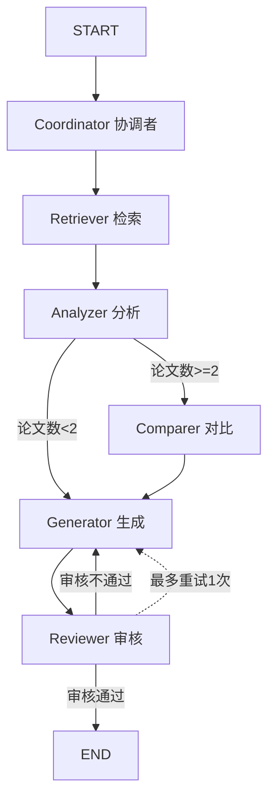
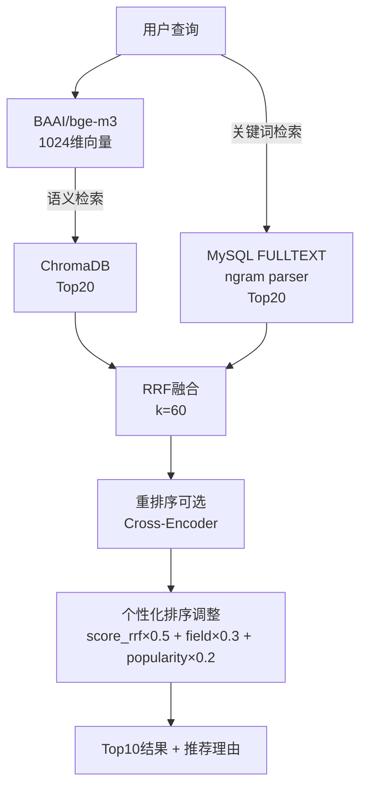

# 03 — 多Agent系统设计

> 加载时机：编写 Python AI 服务代码、修改 Agent 逻辑、理解 LangGraph 工作流时加载。
> 关联文件：[04-personalization.md](file:///Users/achieve/Documents/AchiEVE_MacBook_Air/Veritas(求真)/docs/agents/04-personalization.md) | [01-overview.md](file:///Users/achieve/Documents/AchiEVE_MacBook_Air/Veritas(求真)/docs/agents/01-overview.md)

---

## 1 Agent角色定义

| Agent | 角色 | 职责 | 超时 | 输入 | 输出 |
|-------|------|------|------|------|------|
| **Coordinator** | 协调者 | 任务分解与调度 | 30s | query, user_profile | sub_tasks[] |
| **Retriever** | 检索员 | 语义+关键词混合检索 | 30s | sub_tasks → 检索关键词 | search_results[] (Top10) |
| **Analyzer** | 分析员 | 深度文献分析 | 30s | search_results → 论文列表 | analysis_results[] (5维度JSON) |
| **Comparer** | 对比员 | 多文献对比（条件执行） | 30s | analysis_results | compare_result (对比+矛盾) |
| **Generator** | 生成员 | 报告生成 | 30s | analysis + profile | report (个性化综述) |
| **Reviewer** | 审核员 | 质量审核与反馈 | 30s | report + original_papers | review_result (审核+修改建议) |

---

## 2 LangGraph工作流



**WorkflowState (TypedDict)**:

```python
class AgentState(TypedDict):
    query: str
    user_profile: Dict[str, Any]
    sub_tasks: List[str]
    search_results: List[Dict]
    analysis_results: List[Dict]
    compare_result: Optional[Dict]
    report: Optional[str]
    review_result: Optional[Dict]
    final_output: Optional[str]
    agent_states: Dict[str, Dict]
    errors: List[Dict]
```

---

## 3 降级策略（三级）

| 级别 | 触发条件 | 降级行为 |
|------|---------|---------|
| **Agent级** | 单Agent超时30s | 跳过该Agent，继续后续流程 |
| **工作流级** | 多Agent失败 | 降级为单Agent模式（仅Retriever+Generator） |
| **LLM级** | 连续3次调用失败/超时30s/HTTP 5xx | 自动切换到下一级Provider |

**LLM三路Provider**:

```
优先级1: BuiltinLLMProvider（软件方模型）→ 优先级2: APILLMProvider（外接API）→ 优先级3: LocalLLMProvider（本地Qwen2）
```

**当前生效（2026-06 起）**: 方案B 外接API — `DeepSeek V4 Flash`（OpenAI 兼容，`https://api.deepseek.com/v1`）
- 选型理由：1M 上下文、推理接近 V4-Pro、价格仅为 Pro 的 1/3（输入 ¥1/百万 tokens）、支持思考模式
- 冒烟测试已验证：`POST /api/agent/analyze` 端到端跑通，generator 耗时 ~15s，报告完整

降级恢复：每5分钟尝试恢复到更高级别Provider。

---

## 4 混合检索架构（RAG）


