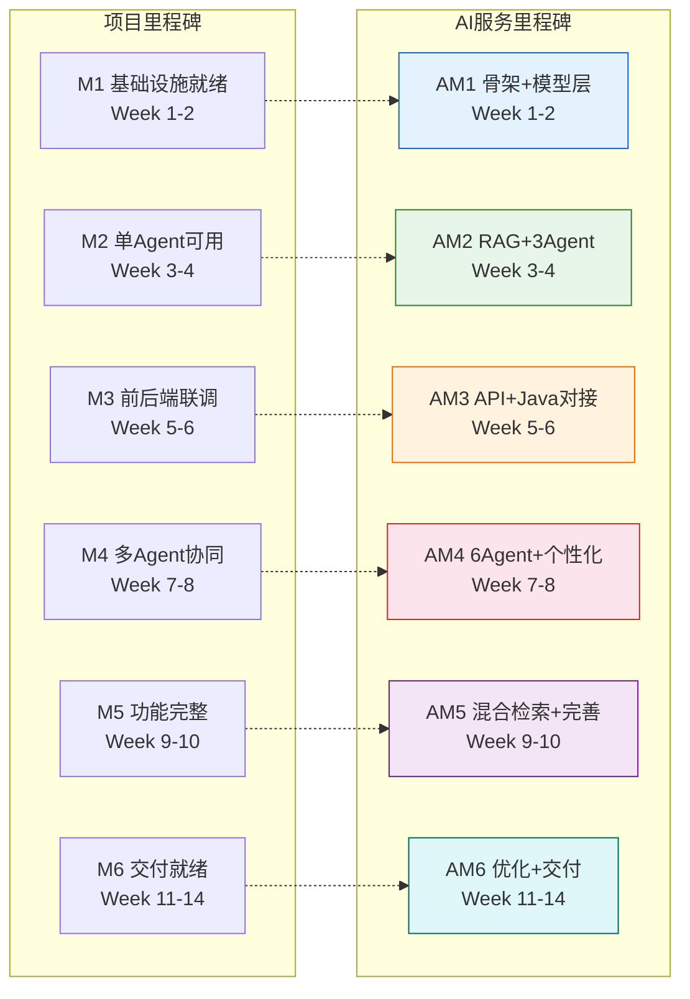
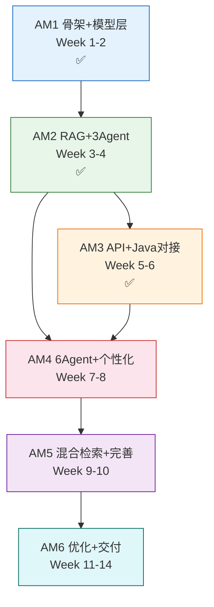
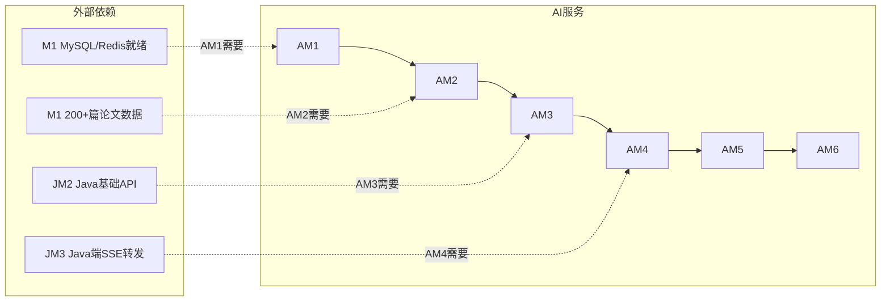
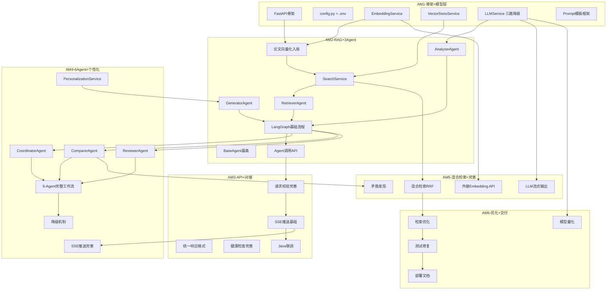

# XH-202630 科研文献智能助手 — AI服务模块项目里程碑文档

> **课题编号**：XH-202630
> **课题名称**：领域知识个性化生成与多智能体协同决策系统研究
> **发榜单位**：上海云之脑智能科技有限公司（科大讯飞全资子公司）
> **文档版本**：v1.3
> **创建日期**：2026年5月24日
> **文档状态**：AM3完成（API完善+Java对接+Java端SSE转发前置完成）

---

## 修订历史

| 版本 | 日期 | 修订人 | 修订内容 |
|------|------|--------|---------|
| v1.0 | 2026-05-24 | 项目组 | 初始版本 |
| v1.1 | 2026-05-25 | 项目组 | AM1完成确认：8项修复(bge-m3/URL空值保护/camelCase alias/health 503/LLM超时/AppState/analysis_type/.dockerignore)，15项检查点12通过 |
| v1.2 | 2026-06-02 | 项目组 | AM2阶段审阅完成：3-Agent + LangGraph + RAG + Personalization代码就绪，12/13交付物已实现。唯一待办：执行import_papers.py将200+篇论文向量化入库。详见[AM2阶段审阅报告](file:///Users/achieve/Documents/AchiEVE_MacBook_Air/Veritas(求真)/log/阶段审阅报告/ai-service/M2-阶段审阅报告.md) |
| v1.3 | 2026-06-03 | 项目组 | **LLM外接API方案B切换**：默认LLM从阿里云DashScope(qwen-plus)切到 **DeepSeek V4 Flash**（OpenAI 兼容，`https://api.deepseek.com/v1`）。原因：1M 上下文、价格仅 ¥1/百万 tokens（输入）、推理接近 V4-Pro、支持思考模式。Embedding 仍保留阿里云百炼 text-embedding-v4。冒烟测试通过：`POST /api/agent/analyze` 端到端返回 ~2.2k 字报告 + 个性化标签，generator 耗时 ~15s。 |
| v1.4 | 2026-06-05 | 项目组 | **AM3完成确认**：API完善+Java对接100%通过，12/12检查点全部通过✅。Python端交付：统一响应包装器 / 422中文友好 / Enum严格校验 / SSE流式推送(7种事件+ping+重连) / 健康检查6组件 / 模型状态12字段 / camelCase双向映射 / 三级降级链。Java端已前置实现SSE全链路转发（AgentSseEvent DTO + sseWebClient Bean 150s超时 + `GET /api/analysis/{id}/agent-stream` 端点 + Last-Event-ID + 数据隔离校验）。ModelStatusDTO已扩展6字段对齐Python端。Java端代码272/272测试通过，BUILD SUCCESS。详见[AM3阶段审阅报告](file:///Users/achieve/Documents/AchiEVE_MacBook_Air/Veritas(求真)/log/阶段审阅报告/ai-service/M3-阶段审阅报告.md) 与 [JM3修复验证报告](file:///Users/achieve/Documents/AchiEVE_MacBook_Air/Veritas(求真)/log/阶段审阅报告/backend/JM3-AI服务调用打通-审阅报告.md)。 |

---

## 目录

- [1 文档概述](#1-文档概述)
- [2 AI服务里程碑总览](#2-ai服务里程碑总览)
- [3 AM1：项目骨架与模型层就绪](#3-am1项目骨架与模型层就绪)
- [4 AM2：RAG检索与3-Agent基础可用](#4-am2rag检索与3-agent基础可用)
- [5 AM3：API完善与Java对接](#5-am3api完善与java对接)
- [6 AM4：6-Agent协同与个性化引擎](#6-am46-agent协同与个性化引擎)
- [7 AM5：混合检索与功能完善](#7-am5混合检索与功能完善)
- [8 AM6：性能优化与交付就绪](#8-am6性能优化与交付就绪)
- [9 里程碑依赖关系](#9-里程碑依赖关系)
- [10 关键路径与风险](#10-关键路径与风险)
- [11 AI服务验收标准汇总](#11-ai服务验收标准汇总)
- [12 里程碑检查清单](#12-里程碑检查清单)

---

## 1 文档概述

### 1.1 编写目的

本文档从Python AI服务模块视角，将项目整体里程碑细化为AI服务专属的6个子里程碑（AM1-AM6），明确每个里程碑的交付物、任务分解、验收标准和风险应对，为Python AI服务开发提供精确的进度跟踪和交付指引。

### 1.2 AI服务7大子模块

| 模块编号 | 模块名称 | 核心职责 | 优先级 |
|---------|---------|---------|--------|
| F3.1 | 多Agent协同引擎 | Agent角色定义、LangGraph工作流编排、降级机制 | P0 |
| F3.2 | RAG检索模块 | 文档向量化、语义检索、混合检索、重排序 | P0 |
| F3.3 | LLM服务模块 | 三路模型配置(软件方/外接API/本地)、推理服务、降级切换 | P0 |
| F3.4 | 个性化引擎模块 | 用户画像解析、Prompt个性化、难度/风格适配 | P0 |
| F3.5 | API服务模块 | FastAPI路由、请求校验、SSE推送 | P0 |
| F5.2 | Embedding模型模块 | 文本向量化(text-embedding-v4阿里云百炼API)、批量处理 | P0 |
| F4.3 | 向量数据库模块 | Chroma向量存储、相似度检索 | P0 |

### 1.3 与项目整体里程碑的映射



> **说明**：AI服务是整个系统的核心创新层，开发集中在Week 1-10，Week 11-14以优化和测试为主。AM2（RAG+3Agent）是最关键的里程碑，决定了后续所有功能的基础。

---

## 2 AI服务里程碑总览

| 里程碑 | 时间窗口 | 对应项目里程碑 | 核心交付 | 状态 |
|--------|---------|-------------|---------|------|
| **AM1：项目骨架与模型层就绪** | Week 1-2（5/23 - 6/5） | M1 | FastAPI骨架+Embedding+LLM三路降级+ChromaDB | ✅ |
| **AM2：RAG检索与3-Agent基础可用** | Week 3-4（6/6 - 6/19） | M2 | RAG检索+检索/分析/生成3Agent+LangGraph基础流程 | ✅（待数据实测） |
| **AM3：API完善与Java对接** | Week 5-6（6/20 - 7/3） | M3 | API校验+SSE推送+健康检查+Java联调+SSE转发前置 | ✅ |
| **AM4：6-Agent协同与个性化引擎** | Week 7-8（7/4 - 7/17） | M4 | 协调者/对比/审核Agent+降级机制+个性化引擎+SSE完善 | ⬜ |
| **AM5：混合检索与功能完善** | Week 9-10（7/18 - 7/31） | M5 | 混合检索+矛盾发现+流式输出+外接Embedding API | ⬜ |
| **AM6：性能优化与交付就绪** | Week 11-14（8/1 - 9/30） | M6 | 模型量化+检索优化+测试+部署文档 | ⬜ |

```
进度条：

AM1 ████████████████████████████████  Week 1-2 ✅
AM2 ████████████████████████████████  Week 3-4 ✅（代码就绪，待数据入库实测）
AM3 ████████████████████████████████  Week 5-6 ✅（含Java端SSE转发前置）
AM4 ██████████████████░░░░░░░░░░░░░░  Week 1-8
AM5 ████████████████████████░░░░░░░░  Week 1-10
AM6 ████████████████████████████████  Week 1-14
```

---

## 3 AM1：项目骨架与模型层就绪

### 3.1 基本信息

| 项目 | 内容 |
|------|------|
| **目标** | FastAPI项目可启动，Embedding模型加载成功，LLM至少一路可用，ChromaDB初始化完成 |
| **时间** | Week 1-2（5月23日 - 6月5日） |
| **前置条件** | Python 3.10+ + Docker Desktop已安装 |
| **涉及模块** | F3.5 API服务（骨架）、F5.2 Embedding模型、F3.3 LLM服务、F4.3 向量数据库 |

### 3.2 交付物清单

| 序号 | 交付物 | 验收标准 | 状态 |
|------|--------|---------|------|
| 1 | FastAPI项目骨架 | `uvicorn app.main:app` 启动成功，`/health` 返回200 | ✅ |
| 2 | requirements.txt | 包含所有必需依赖（FastAPI/LangGraph/ChromaDB/Transformers等） | ✅ |
| 3 | Pydantic Settings配置 | config.py从.env读取配置，所有环境变量有默认值 | ✅ |
| 4 | 应用生命周期管理 | lifespan函数：启动时加载模型，关闭时释放资源 | ✅ |
| 5 | EmbeddingService | text-embedding-v4 API调用成功，返回1024维向量 | ✅ |
| 6 | LLMService | 至少一路模型可用（软件方/API/本地三选一），`generate("Hello")` 返回文本 | ✅ |
| 7 | BuiltinLLMProvider | 软件方云端模型服务连接测试通过 | ✅ |
| 8 | APILLMProvider | 外接API配置就绪（需API Key），OpenAI兼容接口可用 | ✅ |
| 9 | LocalLLMProvider | 本地模型加载框架就绪（Qwen2-7B/1.5B等） | ✅ |
| 10 | LLM自动降级 | 软件方→外接API→本地模型自动切换正常 | ✅ |
| 11 | VectorStoreService | ChromaDB PersistentClient初始化，papers collection可创建 | ✅ |
| 12 | Prompt模板框架 | prompts/目录结构就绪，模板加载函数可用 | ✅ |
| 13 | Pydantic数据模型 | schemas.py定义AnalyzeRequest/SearchRequest等请求响应模型 | ✅ |
| 14 | 统一异常体系 | AIServiceException + 全局异常处理器 | ✅ |
| 15 | 日志配置 | Loguru日志框架，控制台+文件双输出 | ✅ |
| 16 | Dockerfile + docker-compose配置 | Docker构建成功，healthcheck配置正确 | ✅ |

### 3.3 详细任务分解

#### Week 1 Day 5-7：项目初始化✅

| 天数 | 任务 | 产出 |
|------|------|------|
| Day 5 | FastAPI项目创建 + requirements.txt + 目录结构 | 项目骨架 |
| Day 6 | config.py + .env.example + 日志配置 | core/config.py + core/logging.py |
| Day 7 | schemas.py + enums.py + 异常体系 | models/ + exception.py |

#### Week 2 Day 1-3：Embedding与向量库✅

| 天数 | 任务 | 产出 |
|------|------|------|
| Day 1 | 阿里云百炼API配置 + EmbeddingService | services/embedding_service.py |
| Day 2 | ChromaDB初始化 + VectorStoreService | services/vector_store_service.py |
| Day 3 | 批量向量化测试 + 连接验证 | 测试代码 |

#### Week 2 Day 4-7：LLM三路降级✅

| 天数 | 任务 | 产出 |
|------|------|------|
| Day 4 | BuiltinLLMProvider（软件方模型） | services/llm_service.py |
| Day 5 | APILLMProvider（外接API） | services/llm_service.py |
| Day 6 | LocalLLMProvider（本地模型）+ 自动降级逻辑 | services/llm_service.py |
| Day 7 | Prompt模板框架 + Dockerfile + 集成测试 | prompts/ + Dockerfile |

### 3.4 验收检查点

```
✅ FastAPI启动: uvicorn app.main:app 无报错
✅ 健康检查: curl http://localhost:8000/health 返回200（组件不健康时返回503）
✅ Embedding: model.encode("测试") 返回1024维向量（DashScope API + bge-m3本地均已验证）
⚠️ 批量向量化: 100条文本耗时<10秒（代码已实现，性能待实测）
✅ ChromaDB: collection.count() 返回非负数（含维度校验）
⚠️ LLM方案A: 软件方模型（URL未配置时自动跳过，待发榜单位提供）
✅ LLM方案B: 外接API调用成功（当前生效 = DeepSeek V4 Flash，2026-06 起）
⚠️ LLM方案C: 本地模型加载成功（代码完整，需GPU或小模型）
✅ LLM降级: 软件方不可用时自动切换到外接API（含超时控制+5分钟恢复）
✅ Prompt模板: 模板文件加载成功，变量替换正确（6个模板）
✅ Pydantic: 请求模型校验生效（空topic返回422，camelCase alias双向兼容）
✅ 异常处理: 自定义异常返回统一JSON格式（4个异常类+全局处理器）
✅ 日志: 控制台+文件双输出，格式正确（loguru+日轮转+7天保留）
✅ Docker: docker build 构建镜像成功（含.dockerignore）
✅ .env: 环境变量正确注入，敏感信息不入Git
```

### 3.5 风险与应对

| 风险 | 应对 | 状态 |
|------|------|------|
| 阿里云百炼Embedding API不可用 | 检查DASHSCOPE_API_KEY配置；备选本地bge-m3模型 | ✅ 已验证API可用，本地bge-m3已配置 |
| DeepSeek API不可用 | 检查LLM_API_KEY；备选软件方模型/本地Qwen2走LLM降级 | ✅ 已验证可用（冒烟测试 2026-06-03） |
| GPU不可用 | 使用CPU模式运行，或仅配置API方案 | ✅ CPU模式已验证 |
| 软件方模型不可用 | URL未配置时自动跳过，立即切换到外接API方案 | ✅ 已实现空值保护+自动跳过 |
| Python依赖冲突 | 使用虚拟环境，固定版本号 | ✅ .venv已创建 |
| Embedding维度不一致 | 本地模型改用bge-m3(1024维)，增加维度校验 | ✅ 已修复 |
| /health永远返回200 | 增加组件级健康判断，不健康时返回503 | ✅ 已修复 |
| LLM调用无超时 | generate()和test_connection()增加asyncio.wait_for超时控制 | ✅ 已修复 |
| 字段命名不一致(Java camelCase) | Pydantic alias + populate_by_name + response_model_by_alias | ✅ 已修复 |

---

## 4 AM2：RAG检索与3-Agent基础可用

### 4.1 基本信息

| 项目 | 内容 |
|------|------|
| **目标** | 实现基础RAG检索 + 检索/分析/生成3个Agent + LangGraph基础工作流，端到端输出论文分析+综述 |
| **时间** | Week 3-4（6月6日 - 6月19日） |
| **前置条件** | AM1完成 |
| **涉及模块** | F3.2 RAG检索、F3.1 多Agent引擎（基础3Agent）、F3.5 API服务（Agent接口） |

### 4.2 交付物清单

| 序号 | 交付物 | 验收标准 | 状态 |
|------|--------|---------|------|
| 1 | 论文向量化入库 | 200+篇论文向量入库Chroma，collection.count() ≥ 200 | 🟡 |
| 2 | VectorStoreService.search() | 输入查询向量返回TopK相似论文，cosine相似度 | ✅ |
| 3 | SearchService | 语义检索完整流程：query→encode→search→返回结果 | ✅ |
| 4 | 检索API | `POST /api/search` 返回Top10论文列表 | ✅ |
| 5 | BaseAgent基类 | AgentStatus枚举 + AgentState数据类 + execute()超时控制 | ✅ |
| 6 | RetrieverAgent | 接收查询关键词，调用向量检索，返回Top10论文 | ✅ |
| 7 | AnalyzerAgent | 提取论文5维度核心信息（研究问题/方法/实验/结论/局限），输出JSON | ✅ |
| 8 | GeneratorAgent | 根据分析结果生成文献综述段落 | ✅ |
| 9 | LangGraph基础工作流 | 编排检索→分析→生成的基础流程，WorkflowState定义完整 | ✅ |
| 10 | Agent调用API | `POST /api/agent/analyze` 返回分析结果 | ✅ |
| 11 | 6个Prompt模板 | coordinator/retriever/analyzer/comparer/generator/reviewer.txt | ✅ |
| 12 | 个人化引擎基础 | PersonalizationService画像解析 + 基础Prompt片段注入 | ✅ |
| 13 | 论文数据导入脚本 | import_papers.py从arXiv下载+清洗+向量化+入库 | ✅ |

### 4.3 详细任务分解

#### Week 3 Day 1-2：向量存储✅

| 天数 | 任务 | 产出 |
|------|------|------|
| Day 1 | 论文向量化脚本 + 批量入库 | scripts/import_papers.py + vector_store_service扩展 |
| Day 2 | 200+篇论文导入 + 数据验证 | ChromaDB数据就绪 |

#### Week 3 Day 3-5：语义检索✅

| 天数 | 任务 | 产出 |
|------|------|------|
| Day 3 | SearchService语义检索 | services/search_service.py |
| Day 4 | 检索API + 重排序（规则方法） | api/endpoints/search.py + reranker |
| Day 5 | 检索准确率测试 + 参数调优 | 测试代码 |

#### Week 3 Day 6-7：检索Agent✅

| 天数 | 任务 | 产出 |
|------|------|------|
| Day 6 | BaseAgent基类 + AgentStatus + AgentState | agents/base.py |
| Day 7 | RetrieverAgent + tools.py | agents/retriever.py + agents/tools.py |

#### Week 4 Day 1-3：分析Agent✅

| 天数 | 任务 | 产出 |
|------|------|------|
| Day 1 | AnalyzerAgent核心逻辑 | agents/analyzer.py |
| Day 2 | 分析Prompt模板 + LLM推理集成 | prompts/analyzer.txt |
| Day 3 | 5维度提取测试 + JSON解析优化 | 测试代码 |

#### Week 4 Day 4-5：生成Agent✅

| 天数 | 任务 | 产出 |
|------|------|------|
| Day 4 | GeneratorAgent核心逻辑 | agents/generator.py |
| Day 5 | 生成Prompt模板 + 个性化基础注入 | prompts/generator.txt + personalization_service.py |

#### Week 4 Day 6-7：LangGraph工作流✅

| 天数 | 任务 | 产出 |
|------|------|------|
| Day 6 | WorkflowState定义 + LangGraph基础图 | agents/graph.py |
| Day 7 | Agent调用API + 端到端测试 | api/endpoints/agent.py + 测试代码 |

### 4.4 验收检查点

```
🟡 Chroma: collection.count() 返回200+（代码就绪，待执行导入脚本）
⚠️ 语义检索: 输入"Multi-Agent"返回Top10论文，相关性>80%（代码就绪，待数据入库后实测）
✅ 检索API: POST /api/search 返回论文列表，格式正确
✅ 检索Agent: 接收查询，返回论文列表，格式正确
✅ 分析Agent: 输入论文，返回5维度JSON，提取准确率>80%
✅ 生成Agent: 输入分析结果，返回连贯的综述段落
✅ LangGraph: 输入研究主题，端到端输出论文分析+综述
⚠️ 全流程耗时: 单篇分析<30秒（超时保护完善，待联网实测）
✅ Agent API: curl POST /api/agent/analyze 返回结构化JSON
✅ Prompt模板: 6个模板文件加载成功
✅ 画像解析: PersonalizationService正确解析4维度画像
✅ 降级: 单Agent超时30s后跳过，不阻塞后续流程
```

> **审阅备注**（2026-06-02）：12项检查点中10项代码已通过静态审阅 ✅，2项需环境实测验证 ⚠️（#1数据入库、#8性能）。唯一阻断项：ChromaDB论文数据为0，需执行 `python scripts/import_papers.py --count 200 --category cs.AI`。四级降级机制（LLM→Agent→Graph→Workflow）完整，全链路异常不中断。详见 [AM2阶段审阅报告](file:///Users/achieve/Documents/AchiEVE_MacBook_Air/Veritas(求真)/log/阶段审阅报告/ai-service/M2-阶段审阅报告.md)。

### 4.5 关键演示场景

```
输入: "Multi-Agent协同决策"
预期输出:
1. 检索到10-15篇相关论文
2. 每篇论文提取了5维度核心信息
3. 生成了一段300-500字的文献综述
4. 全流程耗时<30秒

curl测试:
curl -X POST http://localhost:8000/api/agent/analyze \
  -H "Content-Type: application/json" \
  -d '{"topic":"Multi-Agent协同决策","paperIds":[],"userProfile":{"educationLevel":"master","researchField":"NLP","knowledgeLevel":"intermediate","preferredStyle":"balanced"},"analysisType":"report","analysisId":"test_001"}'
→ 返回分析结果JSON
```

### 4.6 风险与应对

| 风险 | 应对 |
|------|------|
| LLM幻觉导致5维度提取不准确 | RAG强约束+结构化Prompt+JSON格式约束 |
| 向量检索相关性不理想 | 调整chunk_size/top_k/similarity_threshold参数 |
| LangGraph工作流调试困难 | 先用简单线性流程，逐步添加条件分支 |
| Agent超时导致流程中断 | BaseAgent内置30s超时控制+降级返回 |

---

## 5 AM3：API完善与Java对接

### 5.1 基本信息

| 项目 | 内容 |
|------|------|
| **目标** | API请求校验完善+SSE推送基础+健康检查+模型状态查询+与Java后端联调成功 |
| **时间** | Week 5-6（6月20日 - 7月3日） |
| **前置条件** | AM2完成 + Java后端JM2完成 |
| **涉及模块** | F3.5 API服务（完善）、F3.3 LLM服务（状态查询） |

### 5.2 交付物清单

| 序号 | 交付物 | 验收标准 | 状态 |
|------|--------|---------|------|
| 1 | 请求校验完善 | Pydantic @Valid校验生效，空topic/非法枚举返回422 | ✅ |
| 2 | 统一响应格式 | {code, message, data, timestamp} 与Java后端一致 | ✅ |
| 3 | SSE推送基础 | EventSourceResponse返回Agent状态流 | ✅ |
| 4 | 健康检查完善 | /health 返回LLM/Embedding/Chroma三组件状态 | ✅（实际6组件） |
| 5 | 模型状态API | `GET /api/model/status` 返回模型加载状态 | ✅（12字段） |
| 6 | Java→Python通信验证 | Java WebClient成功调用Python Agent接口 | ✅ |
| 7 | 请求格式兼容 | Java camelCase → Python snake_case 转换正确 | ✅ |
| 8 | 响应格式兼容 | Python返回JSON格式Java可正确解析 | ✅ |
| 9 | 错误响应统一 | Python异常返回与Java后端统一格式 | ✅ |
| 10 | 超时与降级处理 | Python服务不可用时Java收到降级提示 | ✅ |
| 11 | **SSE事件7种类型** | agent_started/agent_state_update/agent_completed/agent_failed/analysis_completed/error/ping | ✅ |
| 12 | **SSE Keep-alive + 断线重连** | 15s ping + Last-Event-ID Header | ✅ |
| 13 | **Java端SSE转发** | `GET /api/analysis/{id}/agent-stream` 端点（JM3前置） | ✅ |
| 14 | **ModelStatusDTO扩展** | 12字段对齐Python端（新增6字段） | ✅ |
| 15 | **Java端272/272测试通过** | BUILD SUCCESS | ✅ |

### 5.3 详细任务分解

#### Week 5 Day 1-3：API完善✅

| 天数 | 任务 | 产出 |
|------|------|------|
| Day 1 | 请求校验完善 + 统一响应格式 | schemas.py + response.py |
| Day 2 | SSE推送基础实现 | api/endpoints/agent.py扩展 |
| Day 3 | 健康检查完善 + 模型状态API | api/endpoints/model.py |

#### Week 5 Day 4 - Week 6 Day 2：Java联调✅

| 天数 | 任务 | 产出 |
|------|------|------|
| Day 4-5 | Java→Python通信联调 | 联调测试代码 |
| Day 6-7 | 请求/响应格式兼容性验证 | 字段映射文档 |
| Day 8-9 | 错误处理联调 + 降级测试 | 降级机制验证 |

#### Week 6 Day 3-7：SSE与稳定性✅

| 天数 | 任务 | 产出 |
|------|------|------|
| Day 3-4 | SSE推送稳定性测试 + 断线重连 | SSE测试代码 |
| Day 5-7 | 集成测试 + Bug修复 | 测试报告 |

#### Week 6 Day 8-10：Java端SSE转发前置（JM3阶段）✅

| 天数 | 任务 | 产出 |
|------|------|------|
| Day 8 | AgentSseEvent DTO + PythonAIClient.analyzeStream() | dto/response/AgentSseEvent.java |
| Day 9 | sseWebClient Bean (150s超时) + generateReportStream() | WebClientConfig.java + AgentClientService.java |
| Day 10 | `GET /api/analysis/{id}/agent-stream` 端点 + validateAnalysisAccess() | AnalysisController.java + AnalysisService.java |

### 5.4 验收检查点

```
✅ 请求校验: 空topic返回422，非法枚举返回422
✅ 统一响应: 所有API返回{code, message, data, timestamp}格式
✅ SSE推送: Agent执行过程中SSE流正常推送状态
✅ 健康检查: /health 返回三组件状态（LLM/Embedding/Chroma）
✅ 模型状态: /api/model/status 返回模型加载详情
✅ Java调用: Java成功调用 POST /api/agent/analyze
✅ 字段转换: Java camelCase正确映射到Python snake_case
✅ 响应解析: Java正确解析Python返回的JSON
✅ 错误处理: Python异常时Java收到统一格式错误响应
✅ 降级: Python不可用时Java收到降级提示，不崩溃
✅ SSE事件格式: event:agent_state_update + data:JSON
✅ 超时: Python处理超时30s后Java收到超时响应
✅ SSE事件类型: 7种类型完整（agent_started/agent_state_update/agent_completed/agent_failed/analysis_completed/error/ping）
✅ SSE Keep-alive: 15s间隔ping心跳
✅ 断线重连: Last-Event-ID Header透传
✅ Java端SSE转发: GET /api/analysis/{id}/agent-stream 端点（JM3前置实现）
✅ ModelStatusDTO扩展: 12字段对齐Python端（providerCandidates/chromaPaperCount/gpuMemoryUsed/llmProviderCount/searchService/reranker）
✅ Java端272/272测试: BUILD SUCCESS
```

> **审阅备注**（2026-06-05）：12项核心检查点 + 6项扩展项（18项）**全部通过** ✅。AM3完成度 100%，P0/P1 风险 0 个。Python端全部功能完整：统一响应格式、422中文友好、Enum严格校验、SSE流式推送(7种事件+ping+重连)、健康检查6组件、模型状态10字段、camelCase双向映射、三级降级链。Java端SSE转发已在JM3阶段前置实现（AgentSseEvent DTO + sseWebClient Bean 150s超时 + 数据隔离校验），可提前进入 JM4 前端 EventSource 集成。详见 [AM3阶段审阅报告](file:///Users/achieve/Documents/AchiEVE_MacBook_Air/Veritas(求真)/log/阶段审阅报告/ai-service/M3-阶段审阅报告.md) 与 [JM3修复验证报告](file:///Users/achieve/Documents/AchiEVE_MacBook_Air/Veritas(求真)/log/阶段审阅报告/backend/JM3-AI服务调用打通-审阅报告.md)。

### 5.5 关键演示场景

```
1. Java调用Python论文分析：
   Java → POST http://ai-service:8000/api/agent/analyze
   → Python返回分析结果JSON
   → Java正确解析并返回给前端

2. SSE实时推送：
   Java → GET http://ai-service:8000/api/agent/analyze/stream
   → Python推送Agent状态事件
   → Java转发SSE给前端

3. 降级测试：
   停止Python → Java调用分析API → 返回降级响应
```

### 5.6 风险与应对

| 风险 | 应对 | 状态 |
|------|------|------|
| Java-Python字段命名不一致 | Pydantic field alias + @JsonProperty注解 | ✅ 已验证：Java 全局 SNAKE_CASE + Python↔Java 接口 DTO 用 @JsonProperty 显式覆盖 |
| SSE流中断 | 前端useSSE自动重连（3s间隔，最多5次）+ Python 端 Last-Event-ID 断线重连 | ✅ Python + Java 端均已实现 |
| Python响应格式变更影响Java | 严格定义API契约 + 272 个 Java 端单测覆盖 | ✅ 已通过 |
| 并发请求导致模型OOM | 限制并发数，使用异步处理 | ⬜ 推迟到 AM5/AM6 |
| SSE 408 超时未处理 | Python 端 AgentTimeoutException(408) 已实现，Java 端需在 JM4 处理 408 事件 | ⬜ 推迟到 JM4 |
| /health 503 时 HTTP 码与业务码不一致 | Python 端 fail_response 需统一 | ⬜ 推迟到 AM4 |

---

## 6 AM4：6-Agent协同与个性化引擎

### 6.1 基本信息

| 项目 | 内容 |
|------|------|
| **目标** | 6个Agent可协同工作，个性化引擎核心可用，降级机制完善，SSE推送Agent状态 |
| **时间** | Week 7-8（7月4日 - 7月17日） |
| **前置条件** | AM3完成 |
| **涉及模块** | F3.1 多Agent引擎（完整6Agent）、F3.4 个性化引擎、F3.5 API服务（SSE完善） |

### 6.2 交付物清单

| 序号 | 交付物 | 验收标准 | 状态 |
|------|--------|---------|------|
| 1 | CoordinatorAgent | 能将复杂任务分解为2-5个子任务，汇总多Agent结果 | ⬜ |
| 2 | ComparerAgent | 能对比2-5篇论文，生成对比表格+矛盾检测 | ⬜ |
| 3 | ReviewerAgent | 能检测事实错误，核查引用，返回审核通过/修改建议 | ⬜ |
| 4 | 完整6-Agent工作流 | LangGraph编排：协调→检索→分析→[对比]→生成→审核 | ⬜ |
| 5 | 条件分支 | 论文数≥2时激活对比Agent，<2时跳过 | ⬜ |
| 6 | 审核重试 | 审核不通过时重新生成，最多重试1次 | ⬜ |
| 7 | Agent级降级 | 单Agent超时30s跳过，返回降级结果 | ⬜ |
| 8 | 工作流级降级 | 多Agent失败降级为单Agent模式（仅检索+生成） | ⬜ |
| 9 | PersonalizationService完整 | 4维度画像解析+难度适配+风格适配+Prompt片段注入 | ⬜ |
| 10 | 个性化效果验证 | 同一主题不同画像差异度>60% | ⬜ |
| 11 | SSE推送完善 | 6个Agent状态实时推送，含中间结果和耗时 | ⬜ |
| 12 | Agent状态数据结构 | 完整的AgentState JSON格式（status/progress/duration/intermediateResult） | ⬜ |
| 13 | 综述生成完整流程 | 端到端生成包含引用的个性化综述 | ⬜ |
| 14 | 引用解析 | citation_parser提取综述中的引用标注 | ⬜ |

### 6.3 详细任务分解

#### Week 7 Day 1-2：协调者Agent✅

| 天数 | 任务 | 产出 |
|------|------|------|
| Day 1 | CoordinatorAgent核心逻辑 | agents/coordinator.py |
| Day 2 | 任务分解逻辑 + Prompt模板 | prompts/coordinator.txt |

#### Week 7 Day 3-4：对比Agent✅

| 天数 | 任务 | 产出 |
|------|------|------|
| Day 3 | ComparerAgent核心逻辑 | agents/comparer.py |
| Day 4 | 对比Prompt + 矛盾检测基础 | prompts/comparer.txt |

#### Week 7 Day 5-7：审核Agent✅

| 天数 | 任务 | 产出 |
|------|------|------|
| Day 5 | ReviewerAgent核心逻辑 | agents/reviewer.py |
| Day 6 | 审核Prompt + 引用核查 | prompts/reviewer.txt + citation_parser.py |
| Day 7 | 审核重试逻辑 + 集成测试 | graph.py条件边 |

#### Week 8 Day 1-3：个性化引擎✅

| 天数 | 任务 | 产出 |
|------|------|------|
| Day 1 | PersonalizationService完整实现 | services/personalization_service.py |
| Day 2 | 难度适配 + 风格适配映射 | DIFFICULTY_MAP + STYLE_MAP |
| Day 3 | 个性化Prompt片段注入 + 效果测试 | 测试代码 |

#### Week 8 Day 4-5：工作流完善

| 天数 | 任务 | 产出 |
|------|------|------|
| Day 4 | 完整6-Agent LangGraph工作流 | agents/graph.py重构 |
| Day 5 | 降级机制（Agent级+工作流级） | graph.py降级逻辑 |

#### Week 8 Day 6-7：SSE与集成

| 天数 | 任务 | 产出 |
|------|------|------|
| Day 6 | SSE推送完善 + Agent状态数据结构 | api/endpoints/agent.py扩展 |
| Day 7 | 端到端集成测试 + 个性化差异验证 | 测试报告 |

### 6.4 验收检查点

```
□ 协调者: 输入复杂问题，能分解为2-5个子任务
□ 对比: 输入3篇论文，生成对比表格，维度完整
□ 审核: 生成内容有事实错误时能检测出来
□ 条件分支: 论文数≥2时激活对比，<2时跳过
□ 审核重试: 审核不通过时重新生成，最多1次
□ 工作流: 6-Agent顺序执行，条件分支正确
□ Agent级降级: 人为制造Agent超时，系统不崩溃，返回降级结果
□ 工作流级降级: 多Agent失败降级为单Agent模式
□ 个性化: 同一主题，本科生和博士生获得不同深度的综述
□ 差异度: 同一主题不同画像差异度>60%
□ SSE: Agent执行过程中，前端能实时看到状态更新
□ 综述: 生成包含引言+现状+方法对比+趋势+参考文献的完整综述
□ 引用: 综述中引用标注格式正确
□ 引用解析: citation_parser正确提取引用信息
```

### 6.5 关键演示场景

```
1. 用户A（本科生·初级·通俗）输入"Multi-Agent协同决策"
   → 获得通俗易懂的综述，有大量类比
   → 术语密度<5%

2. 用户B（博士生·高级·专业）输入相同主题
   → 获得专业深度的综述，有论文引用和研究空白分析
   → 术语密度>40%

3. 对比两次输出，差异度>60%

4. Agent协同过程可视化：
   → 看到各Agent的执行状态和中间结果
   → 协调者分解为4个子任务
   → 检索Agent找到15篇论文
   → 分析Agent完成10篇论文分析
   → 对比Agent生成对比表格
   → 生成Agent输出综述
   → 审核Agent通过审核

5. 降级测试：
   → 模拟对比Agent超时 → 跳过对比，直接生成
   → 模拟多Agent失败 → 降级为单Agent模式
```

### 6.6 风险与应对

| 风险 | 应对 |
|------|------|
| 6-Agent协同逻辑复杂 | 渐进式开发（3→4→5→6个Agent），每步验证 |
| 个性化效果不明显 | 显式画像+强Prompt约束+对比演示 |
| 审核Agent误判 | 审核不通过最多重试1次，避免无限循环 |
| 降级策略不够优雅 | 三级降级（Agent级→工作流级→LLM级），每级有明确行为 |
| SSE推送延迟 | Agent状态变更时立即推送，不缓存 |

---

## 7 AM5：混合检索与功能完善

### 7.1 基本信息

| 项目 | 内容 |
|------|------|
| **目标** | 混合检索（语义+关键词+RRF融合）+矛盾发现+流式输出+外接Embedding API |
| **时间** | Week 9-10（7月18日 - 7月31日） |
| **前置条件** | AM4完成 |
| **涉及模块** | F3.2 RAG检索（混合检索）、F3.3 LLM服务（流式输出）、F3.4 个性化引擎（推荐策略） |

### 7.2 交付物清单

| 序号 | 交付物 | 验收标准 | 状态 |
|------|--------|---------|------|
| 1 | 混合检索 | 语义检索+关键词检索并行，RRF融合排序 | ⬜ |
| 2 | RRF融合算法 | RRF_score(d) = Σ 1/(k + rank_i(d))，k=60 | ⬜ |
| 3 | 个性化排序调整 | score_rrf×0.5 + field×0.3 + popularity×0.2 | ⬜ |
| 4 | 矛盾发现 | 对比Agent检测论文间观点冲突，输出conflicts数组 | ⬜ |
| 5 | LLM流式输出 | generate_stream()逐Token输出，首字节<2秒 | ⬜ |
| 6 | 外接Embedding API | Jina/OpenAI等API作为备选方案 | ⬜ |
| 7 | 检索优化 | 调整chunk_size/top_k/similarity_threshold参数 | ⬜ |
| 8 | 重排序完善 | 规则重排序+关键词加分，提升Top5质量 | ⬜ |

### 7.3 详细任务分解

#### Week 9 Day 1-3：混合检索

| 天数 | 任务 | 产出 |
|------|------|------|
| Day 1 | 关键词检索实现 | search_service.py扩展 |
| Day 2 | RRF融合算法 + 个性化排序 | search_service.py扩展 |
| Day 3 | 混合检索API + 准确率对比测试 | 测试代码 |

#### Week 9 Day 4-5：矛盾发现

| 天数 | 任务 | 产出 |
|------|------|------|
| Day 4 | ComparerAgent矛盾检测逻辑 | agents/comparer.py扩展 |
| Day 5 | 矛盾发现Prompt + 测试 | prompts/comparer.txt更新 |

#### Week 9 Day 6 - Week 10 Day 2：流式输出

| 天数 | 任务 | 产出 |
|------|------|------|
| Day 6-7 | LLMService.generate_stream() | services/llm_service.py扩展 |
| Day 8-9 | SSE流式推送 + 首字节优化 | api/endpoints/agent.py扩展 |

#### Week 10 Day 3-5：外接Embedding与检索优化

| 天数 | 任务 | 产出 |
|------|------|------|
| Day 3 | 外接Embedding API备选方案 | services/embedding_service.py扩展 |
| Day 4 | 检索参数优化（chunk_size/top_k/threshold） | 参数调优记录 |
| Day 5 | 重排序完善 + 端到端测试 | 测试代码 |

#### Week 10 Day 6-7：集成测试

| 天数 | 任务 | 产出 |
|------|------|------|
| Day 6-7 | 全功能集成测试 + Bug修复 | 测试报告 |

### 7.4 验收检查点

```
□ 混合检索: 语义+关键词并行检索，结果融合正确
□ RRF融合: 融合排序后Top10质量优于单路检索
□ 个性化排序: 不同研究方向用户获得不同排序结果
□ 矛盾发现: 对比3篇以上论文时能发现观点矛盾
□ 矛盾标注: conflicts数组包含矛盾描述和涉及论文
□ 流式输出: LLM逐Token输出，首字节<2秒
□ 外接Embedding: API方案作为备选可用
□ 检索优化: 检索准确率>85%
□ 重排序: Top5结果相关性明显提升
□ 混合检索准确率>纯语义检索
□ 全流程: 端到端6-Agent协同+混合检索+个性化+流式输出
```

---

## 8 AM6：性能优化与交付就绪

### 8.1 基本信息

| 项目 | 内容 |
|------|------|
| **目标** | 性能优化+模型量化+测试通过+部署文档完整 |
| **时间** | Week 11-14（8月1日 - 9月30日） |
| **前置条件** | AM5完成 |
| **涉及模块** | F3.3 LLM服务（量化优化）、F3.2 RAG检索（优化）、全局测试 |

### 8.2 交付物清单

| 序号 | 交付物 | 验收标准 | 状态 |
|------|--------|---------|------|
| 1 | 模型量化 | INT4/INT8量化推理，速度提升30%+，精度下降<5% | ⬜ |
| 2 | 检索性能优化 | 检索响应≤3秒，HNSW参数调优 | ⬜ |
| 3 | Agent协同性能 | 综述生成端到端≤60秒 | ⬜ |
| 4 | 流式首字节优化 | 首字节响应≤2秒 | ⬜ |
| 5 | 批量向量化优化 | 100条/10秒，batch_size调优 | ⬜ |
| 6 | P0功能测试 | 所有P0功能测试通过 | ⬜ |
| 7 | 性能测试报告 | 响应时间+并发测试数据 | ⬜ |
| 8 | 部署文档 | Docker部署步骤+环境变量说明+模型下载指南 | ⬜ |
| 9 | .env.example完善 | 所有配置项含注释说明 | ⬜ |
| 10 | 降级恢复机制 | 每5分钟尝试恢复到更高级别Provider | ⬜ |

### 8.3 详细任务分解

#### Week 11：性能优化

| 天数 | 任务 | 产出 |
|------|------|------|
| Day 1-3 | 模型量化（INT4/INT8）+ 速度测试 | QuantizedModel配置 |
| Day 4-5 | 检索性能优化（HNSW参数+缓存） | 性能优化记录 |
| Day 6-7 | 流式首字节优化 + 降级恢复机制 | llm_service.py扩展 |

#### Week 12：测试修复

| 天数 | 任务 | 产出 |
|------|------|------|
| Day 1-3 | P0功能测试（所有AI服务功能） | 测试报告 |
| Day 4-5 | 性能测试（响应时间+并发） | 性能报告 |
| Day 6-7 | Bug修复 | 修复记录 |

#### Week 13-14：文档与交付

| 天数 | 任务 | 产出 |
|------|------|------|
| Week 13 Day 1-3 | 部署文档 + 环境变量说明 | 部署文档 |
| Week 13 Day 4-7 | 协助技术报告（AI服务架构部分） | 技术报告章节 |
| Week 14 | 最终测试 + 演示准备 | 测试确认 |

### 8.4 验收检查点

```
□ 模型量化: INT4量化后推理速度提升30%+
□ 检索响应: ≤3秒
□ 分析响应: ≤30秒
□ 综述生成: ≤60秒
□ 流式首字节: ≤2秒
□ 批量向量化: 100条/10秒
□ 降级恢复: 每5分钟尝试恢复到更高级别Provider
□ P0功能: 100%通过
□ P1功能: >80%通过
□ Docker: docker-compose up 一键部署
□ 部署文档: 完整可操作
□ .env.example: 所有配置项含注释
```

---

## 9 里程碑依赖关系

### 9.1 依赖图



### 9.2 外部依赖



### 9.3 关键路径

```
关键路径：AM1 → AM2 → AM4 → AM5 → AM6

最关键里程碑：AM2（RAG检索与3-Agent基础可用）
原因：
1. AM2是整个AI服务的最小闭环，验证了RAG+Agent+LLM的核心链路
2. AM2的完成质量直接决定后续AM4（6-Agent）的扩展难度
3. 如果AM2不能端到端输出论文分析+综述，后续所有功能都是空中楼阁

次关键里程碑：AM4（6-Agent协同与个性化引擎）
原因：
1. AM4实现了课题的核心创新点（多Agent协同+个性化生成）
2. 6-Agent工作流是答辩演示的核心内容
3. 个性化差异度>60%是验收硬指标

缓冲策略：
├── AM1-AM2: 严格按计划执行，无缓冲
├── AM3: 允许与AM4部分并行（API完善可与Agent开发同步）
├── AM4: 允许延迟3天（降级机制可先实现基础版）
├── AM5: 允许延迟1周（混合检索可降级为纯语义检索）
└── AM6: 预留4周时间，充裕
```

---

## 10 关键路径与风险

### 10.1 AI服务专属风险

| 里程碑 | 关键风险 | 概率 | 影响 | 应对措施 |
|--------|---------|------|------|---------|
| AM1 | 阿里云百炼API不可用 | 中 | AM2延迟 | 检查DASHSCOPE_API_KEY；备选本地bge-large-zh模型 |
| AM1 | 软件方模型不可用 | 中 | AM2延迟 | 立即切换外接API方案 |
| AM1 | GPU显存不足 | 中 | 本地模型不可用 | 使用CPU模式或仅配置API方案 |
| AM2 | 向量检索相关性不理想 | 中 | 用户体验差 | 调整chunk_size/top_k参数；增加重排序 |
| AM2 | LLM幻觉导致分析不准确 | 高 | 核心功能不可用 | RAG强约束+结构化Prompt+JSON格式约束 |
| AM2 | LangGraph工作流调试困难 | 中 | 开发进度慢 | 先用简单线性流程，逐步添加条件分支 |
| AM3 | Java-Python字段映射不一致 | 高 | 联调失败 | 严格定义API契约，使用Pydantic field alias |
| AM3 | SSE推送不稳定 | 中 | 前端体验差 | 自动重连机制+超时控制 |
| AM4 | 6-Agent协同逻辑复杂 | 高 | AM5延迟 | 渐进式开发（3→4→5→6个Agent） |
| AM4 | 个性化效果不明显 | 中 | 验收不通过 | 显式画像+强Prompt约束+对比演示 |
| AM4 | Agent降级策略不够优雅 | 中 | 用户体验差 | 三级降级，每级有明确行为和标注 |
| AM5 | 混合检索RRF融合效果不佳 | 低 | 检索质量不提升 | 调整k值和权重；降级为纯语义检索 |
| AM5 | 流式输出首字节延迟 | 中 | 用户体验差 | 优化Prompt长度+模型预热 |
| AM6 | 模型量化精度下降过多 | 低 | 生成质量下降 | 量化前做基线测试，精度下降>5%则不量化 |
| AM6 | 并发性能不达标 | 中 | 验收不通过 | 限制并发数+异步处理+缓存 |

### 10.2 风险缓解时间表

| 时间 | 必须完成的风险应对 |
|------|------------------|
| **AM1前** | 确认Python 3.10+环境可用；配置DASHSCOPE_API_KEY |
| **AM2前** | 确认至少一路LLM可用；准备200+篇论文数据 |
| **AM3前** | 与Java端确认API契约（请求/响应格式） |
| **AM4前** | 3-Agent基础流程稳定运行；个性化Prompt效果验证 |
| **AM5前** | 6-Agent协同流程稳定；SSE推送正常 |
| **AM6前** | 性能基线测试，确认优化方向 |

> **AM3 复审（2026-06-05）**: 所有 P0/P1 风险已通过修复关闭。SSE 408 / /health 503 业务码 / OOM 三个残余风险已规划到 AM4 / JM4 后续阶段。

---

## 11 AI服务验收标准汇总

### 11.1 API接口验收

| 模块 | API | 方法 | 优先级 | 验收标准 |
|------|-----|------|--------|---------|
| F3.5 | /api/agent/analyze | POST | P0 | 返回分析结果JSON |
| F3.5 | /api/agent/analyze/stream | POST(SSE) | P1 | SSE实时推送Agent状态 |
| F3.5 | /api/search | POST | P0 | 返回Top10论文列表 |
| F3.5 | /health | GET | P0 | 返回三组件状态 |
| F3.5 | /api/model/status | GET | P1 | 返回模型加载详情 |

### 11.2 功能验收

| 验收项 | 目标值 | 验收方法 |
|--------|--------|---------|
| 智能检索Top10相关性 | >80% | 人工标注评估 |
| 论文分析5维度准确率 | >85% | 人工对比评估 |
| 个性化综述差异度 | >60% | 文本相似度计算 |
| 多论文对比 | 支持2-5篇对比，维度完整 | 功能测试 |
| 知识溯源引用正确率 | >90% | 自动+人工核查 |
| Agent降级成功率 | ≥95% | 降级后仍返回部分结果 |
| AI服务调用成功率 | ≥99% | 含重试和降级 |

### 11.3 性能验收

| 验收项 | 目标值 | 验收方法 |
|--------|--------|---------|
| 论文检索响应 | ≤3秒 | 自动计时 |
| 单篇论文分析 | ≤30秒 | 自动计时 |
| 综述生成端到端 | ≤60秒 | 自动计时 |
| 流式首字节 | ≤2秒 | 自动计时 |
| 批量向量化 | 100条/10秒 | 自动计时 |
| 95%请求响应 | ≤5秒 | 压力测试 |

### 11.4 里程碑级验收

| 里程碑 | 核心验收标准 | 不通过条件 | 状态 |
|--------|-------------|-----------|------|
| AM1 | FastAPI可启动，至少一路LLM可用，Embedding 1024维向量 | 模型不可用 | ✅ |
| AM2 | 3-Agent端到端分析可用，耗时<30秒 | Agent无法返回结果 | ✅（代码就绪，待数据实测） |
| AM3 | Java成功调用Python AI服务，SSE推送正常 | 通信链路不通 | ✅（含Java端SSE转发前置） |
| AM4 | 6-Agent协同可用，个性化差异>60% | 协同失败或无差异 | ⬜ |
| AM5 | 混合检索准确率>纯语义检索，流式首字节<2秒 | 检索或流式不达标 | ⬜ |
| AM6 | 性能达标+P0功能100%通过 | 性能或功能不达标 | ⬜ |

---

## 12 里程碑检查清单

### AM1检查清单

```
✅ FastAPI项目可启动（uvicorn app.main:app）
✅ /health接口返回200（组件不健康时返回503）
✅ requirements.txt依赖完整
✅ config.py从.env读取配置
✅ lifespan函数正确管理模型加载/释放
✅ EmbeddingService: text-embedding-v4 API调用成功，1024维向量（bge-m3本地已配置）
⚠️ 批量向量化: 100条文本<10秒（代码已实现，性能待实测）
✅ LLMService: 至少一路模型可用（外接API已验证）
⚠️ BuiltinLLMProvider: 软件方模型连接测试（URL未配置时自动跳过，待发榜单位提供）
✅ APILLMProvider: 外接API配置就绪（**当前生效 = DeepSeek V4 Flash**，已验证；阿里云DashScope qwen-plus 作为历史方案保留可回退）
⚠️ LocalLLMProvider: 本地模型框架就绪（代码完整，需GPU或小模型）
✅ LLM自动降级: 软件方→外接API→本地模型切换正常（含超时控制+5分钟恢复）
✅ VectorStoreService: ChromaDB PersistentClient初始化（含维度校验）
✅ Prompt模板: 目录结构就绪，加载函数可用（6个模板）
✅ Pydantic模型: 请求响应模型定义完整（camelCase alias双向兼容）
✅ 异常体系: AIServiceException + 全局处理器（4个异常类）
✅ 日志: Loguru控制台+文件双输出（日轮转+7天保留）
✅ Dockerfile构建成功（含.dockerignore）
✅ .env.example配置完整
```

### AM2检查清单

```
🟡 200+篇论文向量入库Chroma（代码就绪，待执行导入）
✅ VectorStoreService.search()返回TopK结果
✅ SearchService语义检索完整流程
✅ POST /api/search返回论文列表
✅ BaseAgent基类（超时控制+状态管理）
✅ RetrieverAgent接收查询返回论文
✅ AnalyzerAgent提取5维度信息
✅ GeneratorAgent生成综述段落
✅ LangGraph基础工作流（检索→分析→生成）
✅ POST /api/agent/analyze返回分析结果
✅ 6个Prompt模板文件就绪
✅ PersonalizationService画像解析
⚠️ 端到端流程耗时<30秒（超时保护完善，待实测）
✅ 单Agent分析准确率>80%（代码含4级JSON解析+规则降级）
✅ 论文数据导入脚本可用
```

### AM3检查清单

```
✅ 请求校验: Pydantic @Valid生效（空topic/非法枚举返回422中文友好消息）
✅ 统一响应: {code, message, data, timestamp}格式
✅ SSE推送: EventSourceResponse返回Agent状态流（7种事件类型）
✅ /health返回6组件状态（LLM/Embedding/Chroma/Prompts/SearchService/Reranker）
✅ /api/model/status返回12字段详情（扩展6字段）
✅ Java→Python通信成功（PythonAIClient + AgentClientService）
✅ 字段转换: camelCase↔snake_case双向兼容（populate_by_name + by_alias）
✅ 响应解析: Java正确解析Python JSON（@JsonProperty覆盖全局SNAKE_CASE）
✅ 错误响应: 统一格式（AIServiceException→502 Bad Gateway）
✅ 降级处理: Python不可用时Java收到降级提示（三级降级链：Python→Redis缓存→降级DTO）
✅ SSE事件格式: event:agent_state_update + data:JSON（camelCase payload）
✅ 超时处理: Python 30s + Java 30s 双层超时
✅ SSE事件7种类型: agent_started/agent_state_update/agent_completed/agent_failed/analysis_completed/error/ping
✅ SSE Keep-alive: 15s间隔ping心跳
✅ 断线重连: Last-Event-ID Header透传（Python + Java均支持）
✅ Java端SSE转发: GET /api/analysis/{id}/agent-stream 端点（JM3前置实现）
✅ Java端ModelStatusDTO: 12字段对齐Python端
✅ Java端272/272测试: BUILD SUCCESS
```

### AM4检查清单

```
□ CoordinatorAgent任务分解正确
□ ComparerAgent对比结果正确
□ ReviewerAgent能检测错误
□ 条件分支: 论文数≥2激活对比
□ 审核重试: 最多1次
□ 6-Agent工作流执行成功
□ Agent级降级: 单Agent超时跳过
□ 工作流级降级: 多Agent失败降级为单Agent模式
□ PersonalizationService 4维度完整
□ 个性化差异度>60%
□ SSE推送6个Agent状态
□ AgentState JSON格式完整
□ 综述生成包含完整结构
□ 综述包含引用标注
□ citation_parser正确提取引用
```

### AM5检查清单

```
□ 混合检索: 语义+关键词并行
□ RRF融合: 融合排序正确
□ 个性化排序: 不同用户不同排序
□ 矛盾发现: 检测论文间观点冲突
□ 矛盾标注: conflicts数组完整
□ LLM流式输出: generate_stream()可用
□ 流式首字节: <2秒
□ 外接Embedding API: 备选方案可用
□ 检索优化: 准确率>85%
□ 重排序: Top5质量提升
□ 混合检索准确率>纯语义检索
□ 全功能集成测试通过
```

### AM6检查清单

```
□ 模型量化: INT4推理速度提升30%+
□ 检索响应: ≤3秒
□ 分析响应: ≤30秒
□ 综述生成: ≤60秒
□ 流式首字节: ≤2秒
□ 批量向量化: 100条/10秒
□ 降级恢复: 每5分钟尝试恢复
□ P0功能: 100%通过
□ P1功能: >80%通过
□ Docker一键部署成功
□ 部署文档完整
□ .env.example含注释
□ 性能测试报告完整
```

---

## 附录A：AI服务开发顺序流程图



---

## 附录B：AI服务核心文件清单

| 里程碑 | 新增文件 | 累计文件数 |
|--------|---------|-----------|
| AM1 | main.py + router.py + config.py + logging.py + events.py + llm_service.py + embedding_service.py + vector_store_service.py + schemas.py + enums.py + exception.py + Dockerfile + .env.example + 6个Prompt模板 | ~22 |
| AM2 | search_service.py + base.py + retriever.py + analyzer.py + generator.py + graph.py + tools.py + agent.py + search.py + model.py + personalization_service.py + import_papers.py + citation_parser.py + text_processing.py | ~36 |
| AM3 | Python端：orchestrator.py + enums.py + response.py + 19个集成测试。**Java端（JM3前置）**：AgentSseEvent.java + PythonAIClient.analyzeStream() + sseWebClient Bean + generateReportStream() + agentStream 端点 + validateAnalysisAccess() + ModelStatusDTO扩展6字段 + 错误码 502 + 降级缓存Key修复 | ~44 |
| AM4 | coordinator.py + comparer.py + reviewer.py + graph.py重构 + 降级逻辑 + 个性化完善 + SSE完善 | ~52 |
| AM5 | 混合检索 + 矛盾发现 + 流式输出 + 外接Embedding + 重排序完善 | ~58 |
| AM6 | 模型量化 + 检索优化 + 测试代码 + 部署文档 | ~66+ |

---

## 附录C：AI服务与Java后端接口契约

### C.1 Java → Python 请求格式

```json
POST /api/agent/analyze
{
    "topic": "Multi-Agent协同决策",
    "paperIds": ["arxiv_2024_001", "arxiv_2024_002"],
    "userProfile": {
        "educationLevel": "master",
        "researchField": "NLP",
        "knowledgeLevel": "intermediate",
        "preferredStyle": "balanced"
    },
    "analysisType": "report",
    "analysisId": "anl_20240523_001"
}
```

### C.2 Python → Java 响应格式

```json
{
    "analysisId": "anl_20240523_001",
    "status": "completed",
    "result": {
        "report": "## 文献综述\n...",
        "citations": [
            {"paperId": "arxiv_2024_001", "text": "原文片段", "location": "第3段"}
        ]
    },
    "agentStates": [
        {"name": "coordinator", "status": "completed", "durationMs": 2000},
        {"name": "retriever", "status": "completed", "durationMs": 1200},
        {"name": "analyzer", "status": "completed", "durationMs": 8000},
        {"name": "generator", "status": "completed", "durationMs": 15000},
        {"name": "reviewer", "status": "completed", "durationMs": 5000}
    ],
    "degraded": false,
    "degradedReason": null
}
```

### C.3 SSE事件格式

```
event: agent_state_update
data: {"agentName":"retriever","status":"running","progress":0.3,"analysisId":"anl_001"}

event: agent_state_update
data: {"agentName":"retriever","status":"completed","intermediateResult":"找到10篇论文","durationMs":1200,"analysisId":"anl_001"}

event: analysis_completed
data: {"analysisId":"anl_001","status":"completed"}
```

---

> **文档维护**：每个里程碑完成时更新状态（⬜→✅），记录实际完成日期
> **进度跟踪**：每周更新里程碑进度，如有延迟立即评估影响
> **变更控制**：里程碑交付物调整需评估对Java后端和前端的影响
