# XH-202630 科研文献智能助手 — Java后端模块系统架构文档

> **课题编号**：XH-202630
> **课题名称**：领域知识个性化生成与多智能体协同决策系统研究
> **发榜单位**：上海云之脑智能科技有限公司（科大讯飞全资子公司）
> **文档版本**：v2.1
> **创建日期**：2026年5月23日
> **更新日期**：2026年6月28日
> **文档状态**：已更新

---

## 修订历史

| 版本 | 日期 | 修订人 | 修订内容 |
|------|------|--------|---------|
| v1.0 | 2026-05-23 | 项目组 | 初始版本 |
| v1.2 | 2026-05-25 | 项目组 | 枚举重构：引入DbValueEnum接口+AttributeConverter模式；移除Entity中@Enumerated注解；新增Security异常统一处理；新增6个Converter + 抽象基类 |
| v2.0 | 2026-06-08 | 项目组 | 全面更新：基于源码分析修正包结构/Controller/Service/DTO/配置/异常处理；新增SSE流式转发架构；新增WebClientConfig双连接池；新增测试体系章节；标记未实现功能 |
| v2.1 | 2026-06-28 | 项目组 | 同步实际代码：新增AgentController（SSE桥接端点）；AnalysisController已实现compare/report/export；PaperController已实现收藏/favorites；Service层新增AnalysisTransactionService/ExportService/FavoriteService；测试数更新为447；密码改为CHANGE_ME占位符 |

---

## 目录

- [1 文档概述](#1-文档概述)
- [2 Java后端总体架构](#2-java后端总体架构)
- [3 项目结构与规范](#3-项目结构与规范)
- [4 用户管理模块（F2.1）](#4-用户管理模块f21)
- [5 论文管理模块（F2.2）](#5-论文管理模块f22)
- [6 会话管理模块（F2.3）](#6-会话管理模块f23)
- [7 分析服务模块（F2.4）](#7-分析服务模块f24)
- [8 AI服务调用模块（F2.5）](#8-ai服务调用模块f25)
- [9 缓存管理模块（F2.6）](#9-缓存管理模块f26)
- [10 模块间依赖与交互](#10-模块间依赖与交互)
- [11 数据模型规范](#11-数据模型规范)
- [12 统一响应与异常处理](#12-统一响应与异常处理)
- [13 安全架构](#13-安全架构)
- [14 配置管理](#14-配置管理)
- [15 性能规范](#15-性能规范)
- [16 日志与监控](#16-日志与监控)
- [17 部署架构](#17-部署架构)
- [18 测试体系](#18-测试体系)
- [附录A：核心Maven依赖](#附录a核心maven依赖)
- [附录B：开发检查清单](#附录b开发检查清单)

---

## 1 文档概述

### 1.1 编写目的

本文档详细定义科研文献智能助手系统中Java后端6大模块的系统架构，包括模块职责、类设计、接口规范、数据流转、异常处理、缓存策略等内容。v2.0版本基于实际源码全面修订，确保文档与代码实现完全一致，为后续开发和维护提供准确的设计蓝图。

### 1.2 适用范围

本文档覆盖Java后端全部6个子模块：

| 模块编号 | 模块名称 | 核心职责 |
|---------|---------|---------|
| F2.1 | 用户管理模块 | 用户注册/登录、画像CRUD、JWT鉴权、数据隔离 |
| F2.2 | 论文管理模块 | 论文元数据查询、搜索（排序白名单+动态查询） |
| F2.3 | 会话管理模块 | 分析会话生命周期管理（状态机） |
| F2.4 | 分析服务模块 | 论文分析7步编排、自注入事务、SSE流式转发 |
| F2.5 | AI服务调用模块 | Java→Python通信、双连接池WebClient、降级机制 |
| F2.6 | 缓存管理模块 | Redis缓存策略、9大缓存空间、一致性保障 |

### 1.3 技术栈

| 技术 | 版本 | 用途 |
|------|------|------|
| **Spring Boot** | 3.2+ | 主框架 |
| **Spring WebFlux** | 6.1+ | 异步响应式编程、SSE流式转发 |
| **Spring Data JPA** | 3.2+ | 数据库访问（MySQL） |
| **Spring Data Redis** | 3.2+ | 缓存（Redis 7.0+） |
| **Spring Validation** | 3.2+ | 请求参数校验 |
| **Spring Security** | 6.1+ | JWT鉴权过滤器链 |
| **MySQL Connector** | 8.0+ | MySQL驱动 |
| **Lombok** | 1.18+ | 代码简化 |
| **MapStruct** | 1.5+ | DTO/Entity对象映射 |
| **JWT (jjwt)** | 0.12+ | Token生成与验证 |
| **Maven** | 3.9+ | 构建工具 |
| **JDK** | 17+ | 运行时环境 |

---

## 2 Java后端总体架构

### 2.1 分层架构

```
┌─────────────────────────────────────────────────────────────┐
│                      Controller 层                           │
│  接收HTTP请求 → 参数校验(@Valid) → 调用Service → 返回Response │
│  统一异常处理(@ControllerAdvice) → 统一响应格式(ApiResponse)  │
│  JWT鉴权拦截 → 用户身份注入请求上下文                         │
│  SSE流式端点 → Flux<ServerSentEvent<Object>>                 │
├─────────────────────────────────────────────────────────────┤
│                      Service 层                              │
│  业务逻辑编排 → @Transactional事务管理 → @Cacheable缓存管理   │
│  调用Repository → 调用AgentClientService → 调用RedisTemplate │
│  DTO/Entity转换（MapStruct + JsonStringListHelper）          │
│  自注入事务代理（AnalysisService @Lazy self-injection）      │
├─────────────────────────────────────────────────────────────┤
│                     Repository 层                            │
│  Spring Data JPA → 数据库CRUD → 自定义@Query查询            │
│  JpaRepository<Entity, ID> → 排序白名单+动态查询(CustomImpl) │
├─────────────────────────────────────────────────────────────┤
│                      Client 层                               │
│  PythonAIClient → 双WebClient调用Python AI服务               │
│  同步WebClient(30s) + SSE WebClient(150s) + 健康检查(5s)     │
│  超时控制 → 重试机制(1次) → 降级处理 → SSE流式接收           │
├─────────────────────────────────────────────────────────────┤
│                     Infrastructure 层                        │
│  RedisTemplate → 缓存读写 → Agent状态Hash存储               │
│  JwtUtil → Token生成/验证 → 黑名单管理                       │
│  WebClient → 双连接池HTTP调用（同步+SSE独立隔离）            │
│  ObjectMapper → JSON序列化/反序列化                           │
└─────────────────────────────────────────────────────────────┘
```

### 2.2 请求流转

```mermaid
graph TD
    A[客户端请求] --> B[JwtAuthFilter 鉴权拦截器]
    B -->|验证Token → 解析userId → 注入SecurityContext| C[Controller API控制器]
    C -->|@Valid参数校验 → 调用Service方法| D[Service 业务逻辑]
    D -->|查缓存 Redis| E{缓存命中?}
    E -->|是| F[返回缓存数据]
    E -->|否| G[查数据库 JPA]
    G --> H[Entity → DTO MapStruct]
    H --> I[缓存结果 Redis]
    I --> F
    D -->|调AI服务| J[AgentClientService]
    J --> K[PythonAIClient]
    K -->|HTTP/SSE| L[Python AI服务]
    F --> M[封装ApiResponse → JSON响应]
    M --> N[客户端]
```

### 2.3 Java后端与Python AI服务通信架构

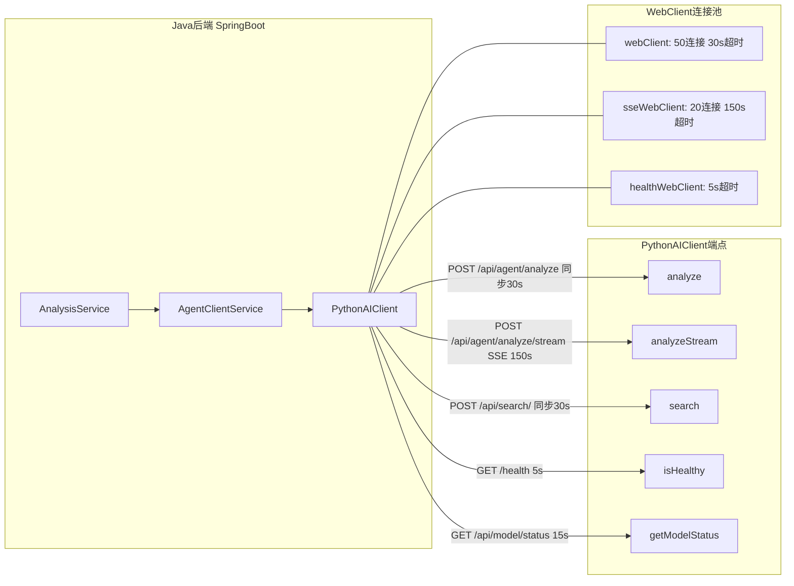

**通信协议**：HTTP REST + SSE
**数据格式**：JSON（Jackson SNAKE_CASE策略）
**超时设置**：同步调用30秒，SSE流150秒，健康检查5秒
**重试策略**：失败后重试1次，间隔3秒，4xx错误不重试
**降级策略**：Python服务不可用时返回缓存结果或降级提示

---

## 3 项目结构与规范

### 3.1 包结构

```
com.literatureassistant/
├── LiteratureAssistantApplication.java     # Spring Boot启动类
│
├── config/                                  # 配置类
│   ├── RedisConfig.java                    # Redis序列化、TTL、连接池配置
│   ├── WebClientConfig.java                # 双WebClient（同步30s + SSE 150s），独立连接池
│   ├── SecurityConfig.java                 # JWT鉴权过滤器链 + CORS + PasswordEncoder
│   ├── CustomAuthenticationEntryPoint.java # Security 401统一ApiResponse处理
│   └── CustomAccessDeniedHandler.java      # Security 403统一ApiResponse处理
│
├── controller/                              # API控制器层
│   ├── UserController.java                 # 用户管理API（F2.1）
│   ├── PaperController.java                # 论文管理API（F2.2）— 仅list/search/detail
│   ├── SessionController.java              # 会话管理API（F2.3）
│   ├── AnalysisController.java             # 分析服务API（F2.4）— 仅paper/result/status/agentStream
│   └── HealthController.java               # 健康检查（/health）
│
├── service/                                 # 业务逻辑层
│   ├── UserService.java                    # 用户管理业务（F2.1）
│   ├── PaperService.java                   # 论文管理业务（F2.2）— 仅list/detail/search
│   ├── SessionService.java                 # 会话管理业务（F2.3）
│   ├── AnalysisService.java                # 分析服务业务（F2.4）— 7步编排 + 自注入事务
│   └── AgentClientService.java             # AI服务调用编排（F2.5）— 降级 + SSE流式 + Agent状态Redis
│
├── repository/                              # 数据访问层
│   ├── UserRepository.java
│   ├── PaperRepository.java
│   ├── PaperRepositoryCustom.java          # 自定义搜索接口
│   ├── PaperRepositoryCustomImpl.java      # 排序白名单 + 动态查询
│   ├── SessionRepository.java
│   ├── UserProfileRepository.java
│   ├── AnalysisResultRepository.java
│   └── PaperFavoriteRepository.java
│
├── entity/                                  # JPA实体类
│   ├── User.java
│   ├── Paper.java
│   ├── Session.java
│   ├── UserProfile.java
│   ├── AnalysisResult.java
│   └── PaperFavorite.java
│
├── dto/                                     # 数据传输对象
│   ├── common/                             # 通用DTO
│   │   ├── ApiResponse.java                # 统一响应包装
│   │   ├── PageResponse.java               # 分页响应
│   │   ├── AgentRequest.java               # Java→Python请求体（6字段）
│   │   ├── UserProfileDTO.java             # 嵌入AgentRequest的用户画像（4字段）
│   │   └── ErrorCode.java                  # 错误码枚举（7值）
│   ├── request/                            # 请求DTO
│   │   ├── RegisterRequest.java            # username/email/password
│   │   ├── LoginRequest.java               # username/password
│   │   ├── ProfileUpdateRequest.java       # educationLevel/researchField/knowledgeLevel/preferredStyle
│   │   ├── UserUpdateRequest.java          # username/email（均可选）
│   │   ├── PaperAnalysisRequest.java       # paperId/topic/sessionId(可选)
│   │   ├── SessionCreateRequest.java       # topic
│   │   └── SessionStatusUpdateRequest.java # status(SessionStatus)
│   └── response/                           # 响应DTO
│       ├── UserResponse.java               # userId/username/email/hasProfile
│       ├── LoginResponse.java              # token/userId/username/hasProfile
│       ├── ProfileResponse.java            # userId/educationLevel/researchField/knowledgeLevel/preferredStyle
│       ├── PaperResponse.java              # paperId/title/authors/abstractText/year/venue/keywords/citationCount
│       ├── PaperDetailResponse.java        # PaperResponse + pdfUrl
│       ├── PaperSearchResultDTO.java       # paperId/title/abstractText/year/venue/score
│       ├── SessionResponse.java            # sessionId/userId/topic/status/createdAt
│       ├── SessionDetailResponse.java      # SessionResponse + analysisCount
│       ├── AnalysisResponse.java           # analysisId/sessionId/status/type/result/createdAt
│       ├── AnalysisResultDTO.java          # analysisId/status/report/citations/agentStates/degraded/degradedReason
│       ├── AnalysisTaskResponse.java       # analysis_id/status/message/created_at（@JsonProperty snake_case）
│       ├── AnalysisStatusResponse.java     # analysisId/status/progress/currentAgent/agentStates
│       ├── AgentStateResponse.java         # agentName/status/progress/intermediateResult/durationMs（@JsonProperty camelCase）
│       ├── AgentSseEvent.java              # id/event/data（SSE事件DTO）
│       └── ModelStatusDTO.java             # 12字段：llm/embedding/chroma/prompts/embeddingDimension/activeLlmProvider/providerCandidates/chromaPaperCount/gpuMemoryUsed/llmProviderCount/searchService/reranker
│
├── client/                                  # 外部服务客户端
│   └── PythonAIClient.java                # 5端点：analyze/analyzeStream/search/isHealthy/getModelStatus；3 WebClient Bean
│
├── mapper/                                  # MapStruct映射器
│   ├── UserMapper.java
│   ├── PaperMapper.java                    # + JsonStringListHelper处理JSON字段
│   ├── SessionMapper.java
│   └── JsonStringListHelper.java           # JSON字符串↔List<String>转换
│
├── filter/                                  # 过滤器/拦截器
│   ├── RequestIdFilter.java                # 请求ID过滤器（MDC注入requestId）
│   └── JwtAuthFilter.java                  # JWT鉴权过滤器
│
├── exception/                               # 异常定义
│   ├── BusinessException.java              # 4构造器 + errorKey字段
│   ├── AuthenticationException.java        # code=401, errorKey=AUTHENTICATION_FAILED
│   ├── ResourceNotFoundException.java      # code=404, errorKey=RESOURCE_NOT_FOUND
│   ├── AIServiceException.java             # code=502, errorKey=AI_SERVICE_ERROR
│   └── GlobalExceptionHandler.java         # 8个处理器
│
├── enums/                                   # 枚举定义
│   ├── DbValueEnum.java                    # 枚举接口：定义getDbValue()契约
│   ├── AbstractEnumConverter.java          # 抽象基类：通用双向转换逻辑
│   ├── EducationLevel.java                 # 学历层次
│   ├── EducationLevelConverter.java        # @Converter(autoApply=true)
│   ├── KnowledgeLevel.java                 # 知识水平
│   ├── KnowledgeLevelConverter.java        # @Converter(autoApply=true)
│   ├── PreferredStyle.java                 # 偏好风格
│   ├── PreferredStyleConverter.java        # @Converter(autoApply=true)
│   ├── SessionStatus.java                  # 会话状态
│   ├── SessionStatusConverter.java         # @Converter(autoApply=true)
│   ├── AnalysisType.java                   # 分析类型
│   ├── AnalysisTypeConverter.java          # @Converter(autoApply=true)
│   ├── AnalysisStatus.java                 # 分析状态
│   └── AnalysisStatusConverter.java        # @Converter(autoApply=true)
│
└── util/                                    # 工具类
    ├── JwtUtil.java                        # JWT工具
    ├── RedisKeyUtil.java                   # Redis Key生成工具
    └── DateTimeUtil.java                   # 日期工具
```

### 3.2 命名规范

| 类别 | 规范 | 示例 |
|------|------|------|
| Controller | `{Domain}Controller` | `UserController` |
| Service | `{Domain}Service` | `UserService` |
| Repository | `{Domain}Repository` | `UserRepository` |
| Entity | `{Domain}` | `User` |
| 请求DTO | `{Domain}Request` | `RegisterRequest` |
| 响应DTO | `{Domain}Response` | `UserResponse` |
| Mapper | `{Domain}Mapper` | `UserMapper` |
| API路径 | `/api/{domain}s` | `/api/users` |
| 方法名-查询 | `get/find/list/query` | `getUserById` |
| 方法名-创建 | `create/add/save` | `createUser` |
| 方法名-更新 | `update/modify` | `updateProfile` |
| 方法名-删除 | `delete/remove` | `deleteSession` |
| 业务ID前缀 | 领域缩写+下划线 | `usr_`, `ses_`, `anl_` |

### 3.3 跨系统字段转换规范

| 层级 | 命名策略 | 说明 |
|------|---------|------|
| Java Entity/DTO | camelCase | Java规范 |
| JSON序列化 | SNAKE_CASE | Jackson全局配置 `property-naming-strategy: SNAKE_CASE` |
| Python API | snake_case | Python规范 |
| 特殊DTO | @JsonProperty | AnalysisTaskResponse使用`@JsonProperty`标注snake_case字段 |

---

## 4 用户管理模块（F2.1）

### 4.1 模块概述

负责用户注册、登录鉴权、用户画像的全生命周期管理。是系统安全的基础模块，为其他模块提供用户身份上下文。核心特性包括：BCrypt密码加密、JWT Token管理、Redis黑名单、数据隔离校验。

### 4.2 类设计

#### 4.2.1 UserController

```java
@RestController
@RequestMapping("/api/users")
public class UserController {

    @PostMapping("/register")
    public ResponseEntity<ApiResponse<UserResponse>> register(
            @Valid @RequestBody RegisterRequest request);
    // → 201 Created

    @PostMapping("/login")
    public ApiResponse<LoginResponse> login(
            @Valid @RequestBody LoginRequest request);
    // → 200

    @GetMapping("/{userId}")
    public ApiResponse<UserResponse> getUserInfo(@PathVariable String userId);
    // → 200

    @PutMapping("/{userId}")
    public ApiResponse<UserResponse> updateUser(@PathVariable String userId,
                                                 @Valid @RequestBody UserUpdateRequest request);
    // → 200

    @PostMapping("/logout")
    public ApiResponse<Void> logout(
            @RequestHeader("Authorization") String authHeader);
    // → 200 (接收Authorization Header，调用logoutWithAuth)

    @GetMapping("/{userId}/profile")
    public ApiResponse<ProfileResponse> getProfile(@PathVariable String userId);
    // → 200

    @PostMapping("/{userId}/profile")
    public ApiResponse<ProfileResponse> createProfile(@PathVariable String userId,
                                                       @Valid @RequestBody ProfileUpdateRequest request);
    // → 200

    @PutMapping("/{userId}/profile")
    public ApiResponse<ProfileResponse> updateProfile(@PathVariable String userId,
                                                       @Valid @RequestBody ProfileUpdateRequest request);
    // → 200
}
```

#### 4.2.2 UserService

```java
@Service
public class UserService {

    // 用户注册
    public UserResponse register(RegisterRequest request);
    // 1. 检查username唯一性（UserRepository.findByUsername）
    // 2. 检查email唯一性
    // 3. BCrypt加密密码（BCryptPasswordEncoder.encode）
    // 4. 生成userId（"usr_" + UUID）
    // 5. 保存User实体（UserRepository.save）

    // 用户登录
    public LoginResponse login(LoginRequest request);
    // 1. 根据username查询User
    // 2. BCrypt验证密码（BCryptPasswordEncoder.matches）
    // 3. 验证失败 → 抛出AuthenticationException
    // 4. 生成JWT Token（JwtUtil.generateToken）
    // 5. 查询用户画像是否存在 → hasProfile

    // 查询用户信息
    @Cacheable(value = "userInfo", key = "#userId")
    public UserResponse getUserInfo(String userId);
    // 查缓存 → 查数据库 → 回填缓存

    // 更新用户信息
    @CacheEvict(value = "userInfo", key = "#userId")
    public UserResponse updateUser(String userId, UserUpdateRequest request);
    // validateDataIsolation → 部分更新（username/email均可选）

    // 退出登录（接收Authorization Header）
    public void logoutWithAuth(String authHeader);
    // 1. 提取Bearer Token
    // 2. getUserIdFromToken
    // 3. validateDataIsolation
    // 4. logout(token)

    // 退出登录（核心逻辑）
    public void logout(String token);
    // 1. getTokenJti
    // 2. blacklistToken → Redis黑名单（TTL=Token剩余有效期）

    // 获取用户画像
    @Cacheable(value = "userProfile", key = "#userId", unless = "#result == null")
    public ProfileResponse getProfile(String userId);
    // validateDataIsolation → 查缓存 → 查数据库 → 回填缓存

    // 创建用户画像
    @CacheEvict(value = {"userProfile", "userProfileJson", "userInfo"}, key = "#userId")
    public ProfileResponse createProfile(String userId, ProfileUpdateRequest request);
    // validateDataIsolation → 检查画像是否已存在（不允许重复创建） → 保存 → syncProfileToRedis

    // 更新用户画像
    @CacheEvict(value = {"userProfile", "userProfileJson", "userInfo"}, key = "#userId")
    public ProfileResponse updateProfile(String userId, ProfileUpdateRequest request);
    // validateDataIsolation → 保存更新 → syncProfileToRedis

    // === 私有方法 ===

    // 数据隔离校验
    private void validateDataIsolation(String userId);
    // 检查SecurityContext中currentUserId == userId，不匹配则抛出异常

    // 同步画像到Redis（供Python服务使用）
    private void syncProfileToRedis(String userId, UserProfile profile);
    // 将画像JSON写入Redis key，TTL=1小时
}
```

#### 4.2.3 JwtAuthFilter

```java
@Component
public class JwtAuthFilter extends OncePerRequestFilter {

    // 过滤逻辑：
    // 1. 从Header提取Bearer Token
    // 2. 校验Token格式、签名、过期时间
    // 3. 查Redis黑名单（已退出的Token不可用）
    // 4. 解析userId → 注入SecurityContext
    // 5. 放行请求

    // 白名单路径（无需鉴权）：
    // POST /api/users/register
    // POST /api/users/login
    // GET /health
    // /actuator/**
    // /error
}
```

#### 4.2.4 请求/响应DTO

**RegisterRequest：**
```java
public class RegisterRequest {
    @NotBlank(message = "用户名不能为空")
    @Size(min = 3, max = 50, message = "用户名长度3-50")
    private String username;

    @NotBlank(message = "邮箱不能为空")
    @Email(message = "邮箱格式不正确")
    private String email;

    @NotBlank(message = "密码不能为空")
    @Size(min = 8, max = 100, message = "密码长度8-100")
    private String password;
}
```

**LoginRequest：**
```java
public class LoginRequest {
    @NotBlank(message = "用户名不能为空")
    private String username;

    @NotBlank(message = "密码不能为空")
    private String password;
}
```

**UserUpdateRequest：**
```java
public class UserUpdateRequest {
    @Size(min = 3, max = 50, message = "用户名长度3-50")
    private String username;     // 可选

    @Email(message = "邮箱格式不正确")
    private String email;        // 可选
}
```

**ProfileUpdateRequest：**
```java
public class ProfileUpdateRequest {
    @NotNull(message = "学历层次不能为空")
    private EducationLevel educationLevel;  // UNDERGRADUATE/MASTER/PHD/FACULTY

    @NotBlank(message = "研究方向不能为空")
    private String researchField;

    @NotNull(message = "知识水平不能为空")
    private KnowledgeLevel knowledgeLevel;   // BEGINNER/INTERMEDIATE/ADVANCED/EXPERT

    @NotNull(message = "偏好风格不能为空")
    private PreferredStyle preferredStyle;   // SIMPLE/BALANCED/TECHNICAL
}
```

**UserResponse：**
```java
public class UserResponse {
    private String userId;
    private String username;
    private String email;
    private boolean hasProfile;
}
```

**LoginResponse：**
```java
public class LoginResponse {
    private String token;        // JWT Token
    private String userId;
    private String username;
    private boolean hasProfile;  // 是否已设置画像
}
```

**ProfileResponse：**
```java
public class ProfileResponse {
    private String userId;
    private EducationLevel educationLevel;
    private String researchField;
    private KnowledgeLevel knowledgeLevel;
    private PreferredStyle preferredStyle;
}
```

### 4.3 核心业务流程

#### 4.3.1 用户注册流程

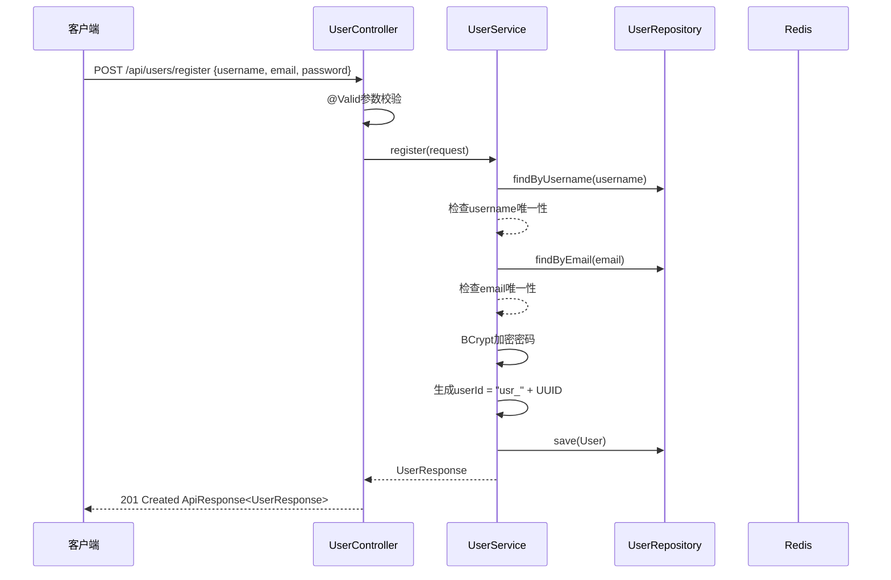

#### 4.3.2 用户登录流程

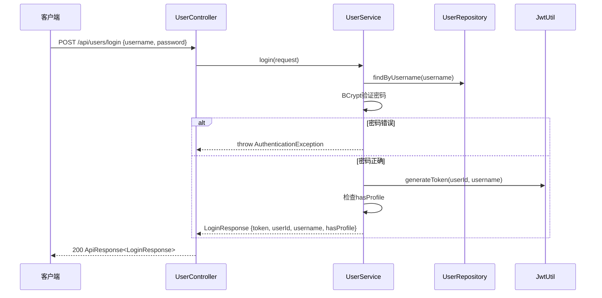

#### 4.3.3 画像管理流程

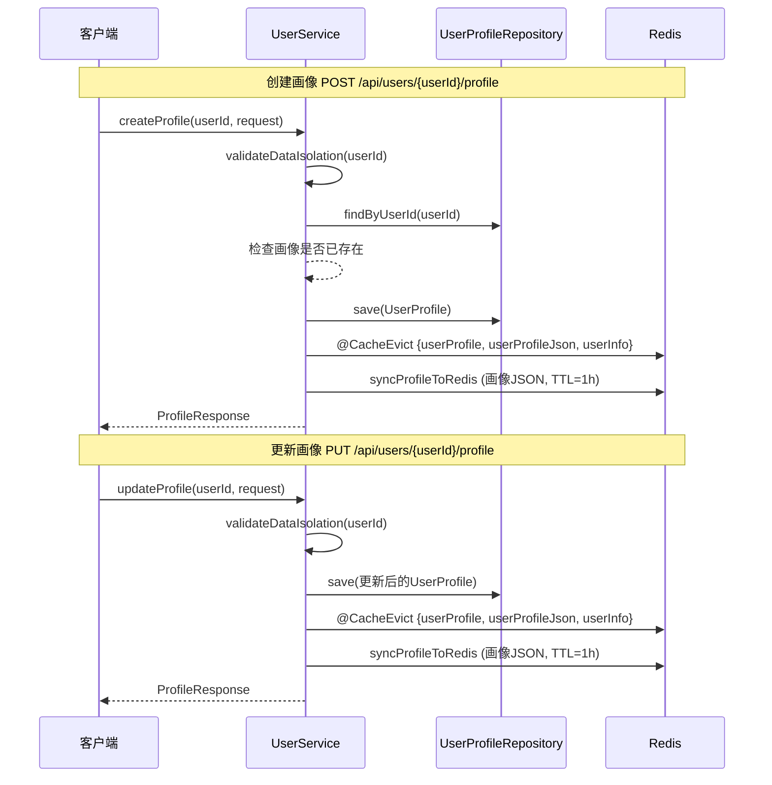

### 4.4 API接口清单

| 编号 | 方法 | 路径 | 优先级 | 鉴权 | HTTP状态码 | 说明 |
|------|------|------|--------|------|-----------|------|
| F2.1.1 | POST | `/api/users/register` | P0 | 否 | 201 Created | 用户注册 |
| F2.1.2 | POST | `/api/users/login` | P0 | 否 | 200 | 用户登录 |
| F2.1.3 | GET | `/api/users/{userId}` | P0 | 是 | 200 | 查询用户信息 |
| F2.1.4 | PUT | `/api/users/{userId}` | P1 | 是 | 200 | 更新用户信息 |
| F2.1.5 | GET | `/api/users/{userId}/profile` | P0 | 是 | 200 | 获取用户画像 |
| F2.1.6 | POST | `/api/users/{userId}/profile` | P0 | 是 | 200 | 创建用户画像 |
| F2.1.7 | PUT | `/api/users/{userId}/profile` | P0 | 是 | 200 | 更新用户画像 |
| - | POST | `/api/users/logout` | P1 | 是 | 200 | 退出登录 |

---

## 5 论文管理模块（F2.2）

### 5.1 模块概述

负责论文元数据的查询、搜索。是系统的核心数据模块，为分析服务模块提供论文数据支撑。当前实现仅包含列表查询、详情查询和搜索功能，收藏和导入功能尚未实现。

### 5.2 类设计

#### 5.2.1 PaperController

```java
@RestController
@RequestMapping("/api/papers")
public class PaperController {

    @GetMapping
    public ApiResponse<PageResponse<PaperResponse>> listPapers(
            @RequestParam(defaultValue = "1") int page,
            @RequestParam(defaultValue = "10") int size);

    @GetMapping("/search")
    public ApiResponse<PageResponse<PaperSearchResultDTO>> searchPapers(
            @RequestParam String q,
            @RequestParam(required = false) Integer yearFrom,
            @RequestParam(required = false) Integer yearTo,
            @RequestParam(required = false) String venue,
            @RequestParam(defaultValue = "relevance") String sort,
            @RequestParam(defaultValue = "1") int page,
            @RequestParam(defaultValue = "10") int size);

    @GetMapping("/{paperId}")
    public ApiResponse<PaperDetailResponse> getPaperDetail(@PathVariable String paperId);

    // ⚠️ 待实现：收藏相关端点
    // @PostMapping("/{paperId}/favorite")
    // @DeleteMapping("/{paperId}/favorite")
    // @GetMapping("/favorites")

    // ⚠️ 待实现：导入相关端点
    // @PostMapping("/import")
}
```

#### 5.2.2 PaperService

```java
@Service
public class PaperService {

    // 分页查询论文列表
    public PageResponse<PaperResponse> listPapers(int page, int size);
    // safePage/safeSize边界处理 → Sort.by(DESC, "createdAt") → PaperRepository.findAll(PageRequest)

    // 论文详情
    @Cacheable(value = "paperDetail", key = "#paperId", unless = "#result == null")
    public PaperDetailResponse getPaperDetail(String paperId);
    // 查缓存 → 查数据库 → 回填缓存

    // 论文搜索（核心方法）
    @Cacheable(value = "paperSearch",
        key = "T(java.lang.String).format('%s_%s_%s_%s_%s_%d_%d', #q, #yearFrom, #yearTo, #venue, #sort, #page, #size)")
    public PageResponse<PaperResponse> searchPapers(
            String q, Integer yearFrom, Integer yearTo,
            String venue, String sort, int page, int size);
    // 1. 校验q非空
    // 2. 校验yearFrom <= yearTo
    // 3. 排序白名单校验（relevance/year/citations），非法值降级为year DESC
    // 4. 委托PaperRepositoryCustomImpl动态查询
}
```

#### 5.2.3 PaperRepository 自定义查询

```java
public interface PaperRepository extends JpaRepository<Paper, Long> {

    Optional<Paper> findByPaperId(String paperId);

    List<Paper> findByPaperIdIn(List<String> paperIds);
}

// 自定义搜索接口
public interface PaperRepositoryCustom {
    Page<Paper> searchByKeyword(String keyword, Integer yearFrom,
                                 Integer yearTo, String venue,
                                 String sort, Pageable pageable);
}

// 自定义搜索实现
public class PaperRepositoryCustomImpl implements PaperRepositoryCustom {

    // 排序白名单映射
    private static final Map<String, Sort> SORT_MAPPING = Map.of(
        "relevance", Sort.by(Sort.Direction.DESC, "score"),
        "year", Sort.by(Sort.Direction.DESC, "year"),
        "citations", Sort.by(Sort.Direction.DESC, "citationCount")
    );

    @Override
    public Page<Paper> searchByKeyword(...) {
        // 1. 排序白名单校验，非法值降级为 year DESC
        // 2. 构建动态查询条件（keyword, yearFrom, yearTo, venue）
        // 3. 执行查询并返回分页结果
    }
}
```

### 5.3 搜索策略

```
论文搜索流程：

1. 参数校验
   ├── q（关键词）非空校验
   ├── yearFrom <= yearTo 校验
   └── 排序白名单校验：仅允许 relevance/year/citations

2. MySQL动态查询（PaperRepositoryCustomImpl）
   ├── 关键词匹配
   ├── 条件过滤：年份范围(yearFrom~yearTo)、会议(venue)
   └── 排序：白名单映射

3. 缓存策略
   ├── @Cacheable("paperSearch")，SpEL组合Key
   └── TTL=10分钟

4. 语义检索（委托Python AI服务）
   ├── Java后端调用 PythonAIClient.search()
   ├── Python端执行Chroma向量检索
   └── 结果返回Java后端

5. ⚠️ 待实现：混合检索（P1，RRF融合）
   ├── 并行执行：MySQL关键词检索 + Chroma语义检索
   ├── Reciprocal Rank Fusion融合两路结果
   └── 返回融合排序后的结果
```

### 5.4 API接口清单

| 编号 | 方法 | 路径 | 优先级 | 鉴权 | 说明 |
|------|------|------|--------|------|------|
| F2.2.1 | GET | `/api/papers` | P0 | 是 | 论文分页列表 |
| F2.2.2 | GET | `/api/papers/{paperId}` | P0 | 是 | 论文详情 |
| F2.2.3 | GET | `/api/papers/search` | P0 | 是 | 论文搜索 |
| F2.2.4 | POST | `/api/papers/{paperId}/favorite` | P2 | 是 | ⚠️ 待实现：收藏论文 |
| F2.2.5 | DELETE | `/api/papers/{paperId}/favorite` | P2 | 是 | ⚠️ 待实现：取消收藏 |
| F2.2.6 | GET | `/api/papers/favorites` | P2 | 是 | ⚠️ 待实现：收藏列表 |
| F2.2.7 | POST | `/api/papers/import` | P2 | 是 | ⚠️ 待实现：批量导入论文 |

---

## 6 会话管理模块（F2.3）

### 6.1 模块概述

管理用户的研究分析会话，一个会话代表一次完整的分析流程（从输入主题到获取结果）。会话是连接用户、论文和分析结果的纽带。核心特性包括：状态机驱动的生命周期管理、数据隔离校验、会话详情含分析计数。

### 6.2 类设计

#### 6.2.1 SessionController

```java
@RestController
@RequestMapping("/api/sessions")
public class SessionController {

    @PostMapping
    public ApiResponse<SessionResponse> createSession(
            @Valid @RequestBody SessionCreateRequest request);
    // 从SecurityContext提取userId

    @GetMapping
    public ApiResponse<PageResponse<SessionResponse>> listSessions(
            @RequestParam(defaultValue = "1") int page,
            @RequestParam(defaultValue = "10") int size);

    @GetMapping("/{sessionId}")
    public ApiResponse<SessionDetailResponse> getSessionDetail(
            @PathVariable String sessionId);

    @PutMapping("/{sessionId}/status")
    public ApiResponse<Void> updateStatus(
            @PathVariable String sessionId,
            @RequestBody SessionStatusUpdateRequest request);

    @DeleteMapping("/{sessionId}")
    public ApiResponse<Void> deleteSession(@PathVariable String sessionId);
}
```

#### 6.2.2 SessionService

```java
@Service
public class SessionService {

    // 创建会话
    public SessionResponse createSession(String userId, SessionCreateRequest request);
    // sessionId = "ses_" + UUID, status = ACTIVE

    // 会话列表
    public PageResponse<SessionResponse> listSessions(String userId, int page, int size);
    // findByUserIdOrderByCreatedAtDesc

    // 会话详情
    @Cacheable(value = "sessionState", key = "#sessionId")
    public SessionDetailResponse getSessionDetail(String sessionId);
    // validateDataIsolation → 查询会话 + analysisCount（从AnalysisResultRepository）

    // 更新会话状态
    @CacheEvict(value = "sessionState", key = "#sessionId")
    public void updateStatus(String sessionId, SessionStatus status);
    // validateDataIsolation → validateStatusTransition

    // 标记完成
    @CacheEvict(value = "sessionState", key = "#sessionId")
    public void markAsCompleted(String sessionId);
    // validateStatusTransition

    // 标记过期
    @CacheEvict(value = "sessionState", key = "#sessionId")
    public void markAsExpired(String sessionId);
    // validateStatusTransition

    // 删除会话
    @CacheEvict(value = "sessionState", key = "#sessionId")
    public void deleteSession(String sessionId);
    // validateDataIsolation

    // === 状态机 ===

    // 允许的状态转换映射
    private static final Map<SessionStatus, Set<SessionStatus>> ALLOWED_TRANSITIONS = Map.of(
        SessionStatus.ACTIVE, Set.of(SessionStatus.COMPLETED, SessionStatus.EXPIRED),
        SessionStatus.COMPLETED, Set.of(),    // 终态
        SessionStatus.EXPIRED, Set.of()       // 终态
    );

    // 状态转换校验
    private void validateStatusTransition(SessionId, newStatus);
    // 同状态 → 抛出 SAME_STATUS_NOOP
    // 不允许的转换 → 抛出 BusinessException
    // 终态不可变更
}
```

### 6.3 会话状态机

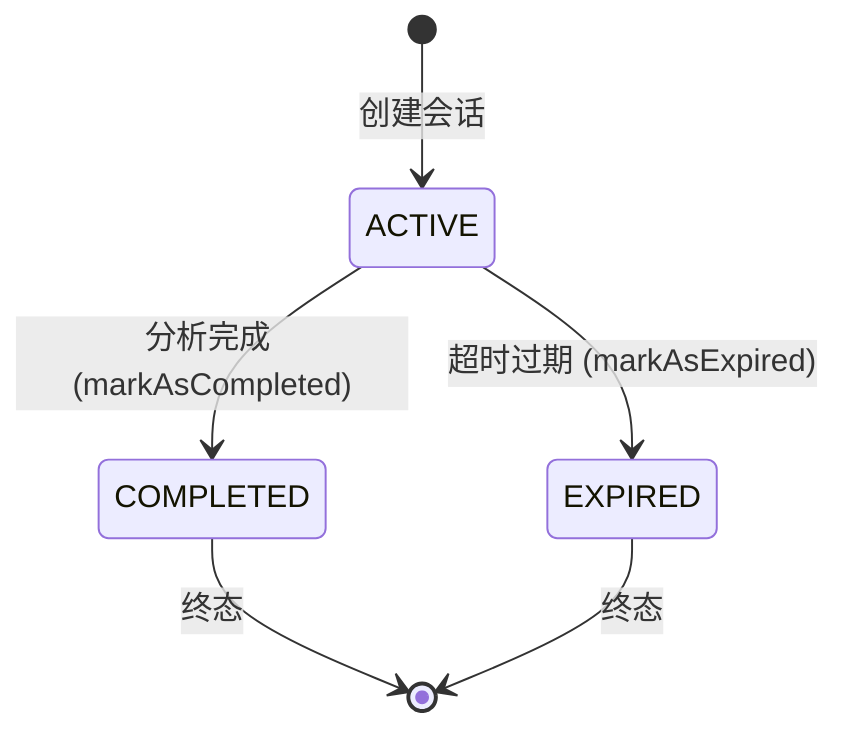

**状态转换规则**：

| 当前状态 | 允许转换 | 说明 |
|---------|---------|------|
| ACTIVE | → COMPLETED | 分析任务完成 |
| ACTIVE | → EXPIRED | 会话超时过期 |
| ACTIVE | → ACTIVE | ❌ 同状态NOOP，抛出异常 |
| COMPLETED | 无 | 终态，不可变更 |
| EXPIRED | 无 | 终态，不可变更 |

### 6.4 请求/响应DTO

**SessionCreateRequest：**
```java
public class SessionCreateRequest {
    @NotBlank(message = "主题不能为空")
    private String topic;
}
```

**SessionStatusUpdateRequest：**
```java
public class SessionStatusUpdateRequest {
    @NotNull(message = "状态不能为空")
    private SessionStatus status;
}
```

**SessionResponse：**
```java
public class SessionResponse {
    private String sessionId;
    private String userId;
    private String topic;
    private SessionStatus status;
    private LocalDateTime createdAt;
}
```

**SessionDetailResponse：**
```java
public class SessionDetailResponse {
    private String sessionId;
    private String userId;
    private String topic;
    private SessionStatus status;
    private LocalDateTime createdAt;
    private long analysisCount;    // 关联的分析结果数量
}
```

### 6.5 API接口清单

| 编号 | 方法 | 路径 | 优先级 | 鉴权 | 说明 |
|------|------|------|--------|------|------|
| F2.3.1 | POST | `/api/sessions` | P0 | 是 | 创建会话 |
| F2.3.2 | GET | `/api/sessions` | P0 | 是 | 会话列表 |
| F2.3.3 | GET | `/api/sessions/{sessionId}` | P1 | 是 | 会话详情（含analysisCount） |
| F2.3.4 | PUT | `/api/sessions/{sessionId}/status` | P1 | 是 | 更新状态（状态机校验） |
| F2.3.5 | DELETE | `/api/sessions/{sessionId}` | P1 | 是 | 删除会话 |

---

## 7 分析服务模块（F2.4）

### 7.1 模块概述

系统的核心业务模块，负责编排论文分析的完整流程。作为业务编排层，协调用户管理、论文管理、会话管理和AI服务调用模块。核心特性包括：7步编排、自注入事务代理、SSE流式转发、默认画像降级。当前仅实现论文分析（paper_analysis），对比分析和综述生成尚未实现。

### 7.2 类设计

#### 7.2.1 AnalysisController

```java
@RestController
@RequestMapping("/api/analysis")
public class AnalysisController {

    // 论文分析
    @PostMapping("/paper")
    public ResponseEntity<ApiResponse<AnalysisTaskResponse>> analyzePaper(
            @Valid @RequestBody PaperAnalysisRequest request);
    // → 202 Accepted

    // 查询分析结果
    @GetMapping("/{analysisId}")
    public ApiResponse<AnalysisResponse> getAnalysisResult(
            @PathVariable String analysisId);

    // 查询分析状态
    @GetMapping("/{analysisId}/status")
    public ApiResponse<AnalysisStatusResponse> getAnalysisStatus(
            @PathVariable String analysisId);

    // Agent状态SSE流式推送
    @GetMapping(value = "/{analysisId}/agent-stream",
                produces = MediaType.TEXT_EVENT_STREAM_VALUE)
    public Flux<ServerSentEvent<Object>> agentStream(
            @PathVariable String analysisId,
            @RequestHeader(value = "Last-Event-ID", required = false) String lastEventId);

    // ⚠️ 待实现：对比分析
    // @PostMapping("/compare")

    // ⚠️ 待实现：综述生成
    // @PostMapping("/report")
}
```

#### 7.2.2 AnalysisService（7步编排 + 自注入事务）

```java
@Service
public class AnalysisService {

    private final AgentClientService agentClientService;
    private final PaperService paperService;
    private final SessionService sessionService;
    private final AnalysisResultRepository analysisResultRepository;

    // 自注入：解决同类内@Transactional代理失效问题
    @Autowired
    @Lazy
    private AnalysisService self;

    // ========== 论文分析（7步编排） ==========
    public AnalysisTaskResponse analyzePaper(String userId, PaperAnalysisRequest request) {
        // Step 1: 构建用户画像（buildUserProfile）
        //   捕获ResourceNotFoundException → 返回默认画像(MASTER/INTERMEDIATE/BALANCED)
        // Step 2: 获取论文详情（paperService.getPaperDetail）
        // Step 3: 解析或创建会话（resolveOrCreateSession）
        //   复用现有ACTIVE会话 或 创建新会话
        // Step 4: 生成analysisId = "anl_" + UUID
        // Step 5: 保存PENDING记录（self.savePending — 事务代理）
        // Step 6: 调用AI服务（agentClientService.analyzePaper）
        // Step 7: 完成分析（self.completeAnalysis — 事务代理）
    }

    // 查询分析结果
    @Cacheable(value = "analysisResult", key = "#analysisId", unless = "#result == null")
    public AnalysisResponse getAnalysisResult(String userId, String analysisId);
    // validateDataIsolation → 查询AnalysisResult → 反序列化result JSON

    // 查询分析状态
    public AnalysisStatusResponse getAnalysisStatus(String userId, String analysisId);
    // validateDataIsolation → 从Redis获取agentStates → 计算progress → 找到currentAgent

    // 校验分析访问权限（供SSE端点使用）
    public void validateAnalysisAccess(String userId, String analysisId);
    // 公开方法，用于SSE端点的数据隔离校验

    // ========== 事务方法（通过self代理调用） ==========

    // 保存PENDING记录
    @Transactional
    public void savePending(String analysisId, String sessionId, AnalysisType type);
    // 创建AnalysisResult(status=PENDING)

    // 完成分析
    @Transactional
    public AnalysisTaskResponse completeAnalysis(Long id, AnalysisResultDTO result);
    // 更新status=COMPLETED + result → 返回AnalysisTaskResponse

    // ========== 私有方法 ==========

    // 构建用户画像（含默认降级）
    private UserProfileDTO buildUserProfile(String userId);
    // 捕获ResourceNotFoundException → 默认画像(MASTER/INTERMEDIATE/BALANCED)

    // 解析或创建会话
    private String resolveOrCreateSession(String userId, PaperAnalysisRequest request);
    // sessionId非空 → 复用现有ACTIVE会话
    // sessionId为空 → 创建新会话
}
```

### 7.3 自注入事务代理模式

```mermaid
graph TD
    AS[AnalysisService.analyzePaper] -->|Step 5| SELF1[self.savePending]
    AS -->|Step 7| SELF2[self.completeAnalysis]
    SELF1 -->|@Lazy代理| TX1[@Transactional 生效]
    SELF2 -->|@Lazy代理| TX2[@Transactional 生效]

    style SELF1 fill:#ff9,stroke:#333
    style SELF2 fill:#ff9,stroke:#333
    style TX1 fill:#9f9,stroke:#333
    style TX2 fill:#9f9,stroke:#333
```

**设计原因**：Spring AOP代理机制下，同类内部方法调用不会经过代理，`@Transactional`注解失效。通过`@Autowired @Lazy`自注入，调用`self.xxx()`时走代理对象，事务正确生效。

### 7.4 分析任务状态机

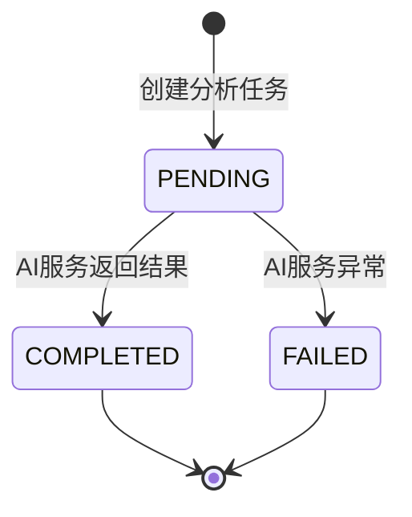

**注意**：当前实现中`AnalysisStatus`定义了PENDING/PROCESSING/COMPLETED/FAILED四种状态，但实际流程中PENDING直接到COMPLETED，PROCESSING状态暂未在Java端使用（由Python端Agent执行状态管理）。

### 7.5 请求/响应DTO

**PaperAnalysisRequest：**
```java
public class PaperAnalysisRequest {
    @NotBlank(message = "论文ID不能为空")
    private String paperId;

    @NotBlank(message = "分析主题不能为空")
    private String topic;

    private String sessionId;    // 可选，复用现有会话
}
```

**AnalysisTaskResponse：**
```java
public class AnalysisTaskResponse {
    @JsonProperty("analysis_id")
    private String analysisId;

    @JsonProperty("status")
    private String status;

    @JsonProperty("message")
    private String message;

    @JsonProperty("created_at")
    private LocalDateTime createdAt;
}
```

**AnalysisResultDTO：**
```java
public class AnalysisResultDTO {
    private String analysisId;
    private AnalysisStatus status;          // 枚举：PENDING/PROCESSING/COMPLETED/FAILED
    private String report;                  // 综述报告markdown
    private List<Map<String, Object>> citations; // 引用列表
    private List<AgentStateResponse> agentStates;
    private Boolean degraded;               // 是否降级
    private String degradedReason;          // 降级原因

    // 降级静态工厂
    public static AnalysisResultDTO degraded(String analysisId, String reason);
}
```

**AnalysisStatusResponse：**
```java
public class AnalysisStatusResponse {
    private String analysisId;
    private AnalysisStatus status;
    private Double progress;              // 0.0 ~ 1.0，可空
    private String currentAgent;          // 当前执行的Agent名称，可空
    private List<AgentStateResponse> agentStates;
}
```

**AgentStateResponse：**
```java
public class AgentStateResponse {
    @JsonProperty("agentName")
    private String agentName;

    private String status;              // waiting/running/completed/failed

    private Double progress;            // 0.0-1.0，可空

    @JsonProperty("intermediateResult")
    private String intermediateResult;  // 中间结果摘要，可空

    @JsonProperty("durationMs")
    private Long durationMs;            // 执行耗时（毫秒），可空
}
```

**AgentSseEvent：**
```java
public class AgentSseEvent {
    private Long id;                // 事件ID（单调递增，支持Last-Event-ID断线重连）
    private String event;           // 事件类型
    private Map<String, Object> data; // 事件数据（camelCase JSON）
}
```

**ModelStatusDTO：**
```java
public class ModelStatusDTO {
    private String llm;                     // LLM服务状态
    private String embedding;               // Embedding服务状态
    private String chroma;                  // ChromaDB连接状态
    private String prompts;                 // Prompt模板加载状态
    private Integer embeddingDimension;     // Embedding维度
    private String activeLlmProvider;       // 当前活跃LLM Provider（builtin/api/local）
    private List<String> providerCandidates; // 所有已加载的LLM provider mode列表
    private Integer chromaPaperCount;       // ChromaDB中论文数量
    private String gpuMemoryUsed;           // GPU显存使用（仅当本地模型加载时）
    private Integer llmProviderCount;       // 已加载的LLM provider数量
    private String searchService;           // SearchService状态: ready/not_initialized
    private String reranker;                // Reranker状态: ready/not_initialized
}
```

### 7.6 SSE流式转发架构

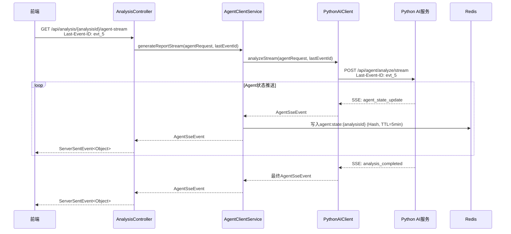

**SSE关键设计**：
- Controller返回`Flux<ServerSentEvent<Object>>`，支持背压
- 支持`Last-Event-ID`断线重连
- 每收到`agent_state_update`事件，AgentClientService将状态写入Redis Hash
- SSE WebClient独立连接池（20连接），150秒超时，与同步调用隔离

### 7.7 论文分析完整时序

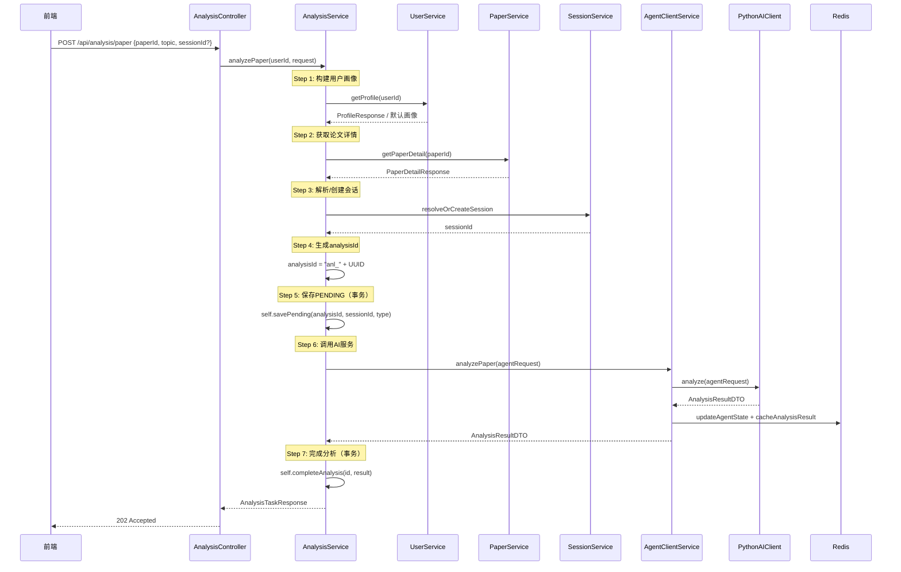

### 7.8 API接口清单

| 编号 | 方法 | 路径 | 优先级 | 鉴权 | HTTP状态码 | 说明 |
|------|------|------|--------|------|-----------|------|
| F2.4.1 | POST | `/api/analysis/paper` | P0 | 是 | 202 Accepted | 论文分析请求 |
| F2.4.2 | GET | `/api/analysis/{analysisId}` | P0 | 是 | 200 | 分析结果查询 |
| F2.4.3 | GET | `/api/analysis/{analysisId}/status` | P0 | 是 | 200 | 分析状态查询 |
| F2.4.4 | GET | `/api/analysis/{analysisId}/agent-stream` | P1 | 是 | 200 (SSE) | Agent状态SSE流式推送 |
| - | POST | `/api/analysis/compare` | P1 | 是 | - | ⚠️ 待实现：对比分析 |
| - | POST | `/api/analysis/report` | P0 | 是 | - | ⚠️ 待实现：综述生成 |

---

## 8 AI服务调用模块（F2.5）

### 8.1 模块概述

封装Java后端与Python AI服务之间的所有通信逻辑，是Java与Python混合架构的核心桥梁。负责请求转换、HTTP调用、SSE接收、错误处理和降级机制。核心特性包括：双WebClient连接池、5个Python端点、Agent状态Redis管理、三级降级策略。

### 8.2 类设计

#### 8.2.1 PythonAIClient

```java
@Component
public class PythonAIClient {

    private final WebClient webClient;       // 同步调用（30s超时，50连接）
    private final WebClient sseWebClient;    // SSE流式（150s超时，20连接）
    private final WebClient healthWebClient; // 健康检查（5s超时，内部构建）

    // === 5个端点 ===

    // 1. 同步分析调用
    public AnalysisResultDTO analyze(AgentRequest request);
    // POST /api/agent/analyze
    // 超时：30秒
    // 重试：1次（间隔3秒），4xx错误不重试
    // 使用webClient Bean

    // 2. SSE流式分析
    public Flux<AgentSseEvent> analyzeStream(AgentRequest request, String lastEventId);
    // POST /api/agent/analyze/stream
    // 超时：150秒
    // 支持Last-Event-ID断线重连
    // 使用sseWebClient Bean
    // Accept: text/event-stream

    // 3. 语义检索
    public List<PaperSearchResultDTO> search(String query, int topK, Map<String,Object> filters);
    // POST /api/search/
    // 超时：30秒
    // topK范围限制：1-50（超出自动裁剪）
    // 使用webClient Bean

    // 4. 健康检查
    public boolean isHealthy();
    // GET /health
    // 超时：5秒
    // 使用healthWebClient
    // 解析嵌套data.status字段

    // 5. 模型状态查询
    public ModelStatusDTO getModelStatus();
    // GET /api/model/status
    // 超时：15秒
    // 使用webClient Bean
}
```

#### 8.2.2 AgentClientService

```java
@Service
public class AgentClientService {

    private final PythonAIClient pythonAIClient;
    private final RedisTemplate<String, String> redisTemplate;

    // ========== 同步调用 ==========

    // 论文分析调用
    public AnalysisResultDTO analyzePaper(AgentRequest request);
    // 1. 调用pythonAIClient.analyze()
    // 2. 成功 → updateAgentState + cacheAnalysisResult
    // 3. AIServiceException → handleFallback

    // ========== 异步调用 ==========

    // 综述生成（Mono包装，占位）
    public Mono<AnalysisResultDTO> generateReport(AgentRequest request);
    // Mono包装around analyzePaper（异步占位实现）

    // ========== SSE流式调用 ==========

    // 综述生成SSE流
    public Flux<AgentSseEvent> generateReportStream(AgentRequest request, String lastEventId);
    // 1. 调用pythonAIClient.analyzeStream()
    // 2. 每收到agent_state_update事件 → 写入Redis Hash
    // 3. 返回Flux<AgentSseEvent>

    // ========== 搜索 ==========

    // 语义检索
    public List<PaperSearchResultDTO> search(String query, int topK, Map<String,Object> filters);
    // 委托pythonAIClient.search()

    // ========== 健康检查 ==========

    // AI服务健康检查
    public boolean isHealthy();
    // 委托pythonAIClient.isHealthy()

    // ========== Agent状态管理 ==========

    // 更新Agent状态到Redis
    public void updateAgentState(String analysisId, List<AgentStateResponse> agentStates);
    // Redis Hash: agent:state:{analysisId}
    // field = agentName, value = JSON
    // TTL = 5分钟

    // 获取Agent状态
    public List<AgentStateResponse> getAgentStates(String analysisId);
    // 从Redis Hash读取，反序列化为AgentStateResponse列表

    // ========== 私有方法 ==========

    // 降级处理
    private AnalysisResultDTO handleFallback(AgentRequest request, AIServiceException e);
    // 1. 读取Redis缓存 analysis:result:{analysisId}
    // 2. 有缓存 → 返回缓存结果 + degraded=true
    // 3. 无缓存 → 返回降级DTO（degraded=true, degradedReason="AI服务暂时不可用，请稍后重试"）

    // 缓存分析结果
    private void cacheAnalysisResult(String analysisId, AnalysisResultDTO result);
    // 写入Redis: analysis:result:{analysisId}, TTL=30分钟
}
```

### 8.3 WebClient双连接池架构

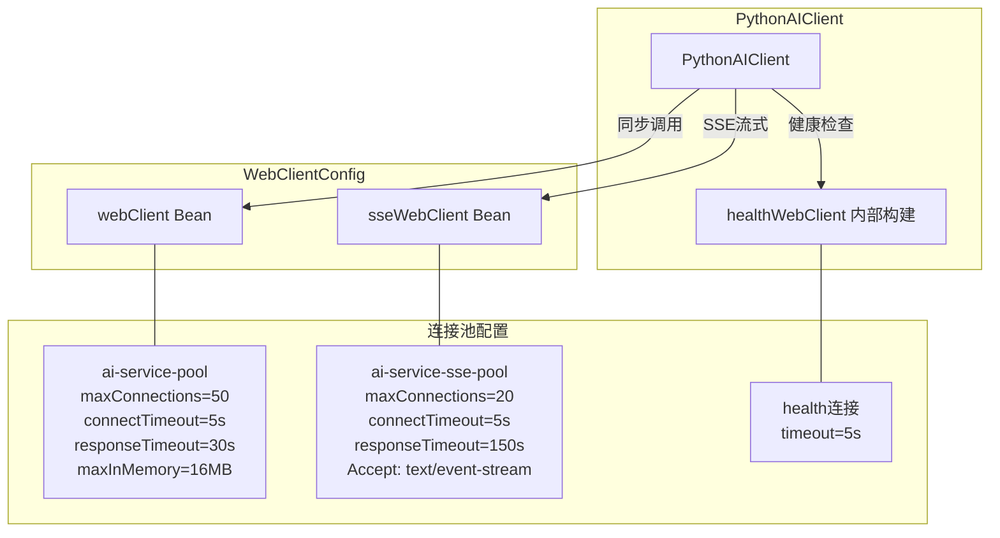

**设计原因**：同步调用和SSE流式调用使用独立连接池，避免长时间SSE连接占满连接池导致同步调用阻塞。

**WebClientConfig配置详情**：

```java
@Configuration
public class WebClientConfig {

    // 同步WebClient：用于analyze/search/getModelStatus
    @Bean
    @Primary
    public WebClient webClient() {
        ConnectionProvider provider = new ConnectionProvider(
            "ai-service-pool", 50);  // maxConnections=50
        HttpClient httpClient = HttpClient.create(provider)
            .option(ChannelOption.CONNECT_TIMEOUT_MILLIS, 5000)
            .responseTimeout(Duration.ofSeconds(30));
        return WebClient.builder()
            .baseUrl(aiServiceUrl)
            .clientConnector(new ReactorClientHttpConnector(httpClient))
            .codecs(configurer -> configurer
                .defaultCodecs()
                .maxInMemorySize(16 * 1024 * 1024))  // 16MB
            .build();
    }

    // SSE WebClient：用于analyzeStream
    @Bean("sseWebClient")
    public WebClient sseWebClient() {
        ConnectionProvider provider = new ConnectionProvider(
            "ai-service-sse-pool", 20);  // maxConnections=20
        HttpClient httpClient = HttpClient.create(provider)
            .option(ChannelOption.CONNECT_TIMEOUT_MILLIS, 5000)
            .responseTimeout(Duration.ofSeconds(150));
        return WebClient.builder()
            .baseUrl(aiServiceUrl)
            .clientConnector(new ReactorClientHttpConnector(httpClient))
            .defaultHeader(HttpHeaders.ACCEPT, MediaType.TEXT_EVENT_STREAM_VALUE)
            .build();
    }
}
```

### 8.4 请求/响应格式

#### 发送给Python服务的请求格式（AgentRequest）

```java
public class AgentRequest {
    private String topic;                    // 分析主题
    private List<String> paperIds;           // 论文ID列表
    private String userId;                   // 用户ID
    private UserProfileDTO userProfile;      // 用户画像
    private String analysisType;             // 分析类型：paper_analysis/compare/report
    private String analysisId;               // Java端生成的分析任务ID
}

// 嵌入AgentRequest的用户画像
public class UserProfileDTO {
    private String educationLevel;    // undergraduate/master/phd/faculty
    private String researchField;     // NLP/CV/RL/多模态/...
    private String knowledgeLevel;    // beginner/intermediate/advanced/expert
    private String preferredStyle;    // simple/balanced/technical
}
```

**JSON示例**：
```json
{
    "topic": "Multi-Agent协同决策",
    "paperIds": ["arxiv_2024_001", "arxiv_2024_002"],
    "userId": "usr_abc123",
    "userProfile": {
        "educationLevel": "master",
        "researchField": "NLP",
        "knowledgeLevel": "intermediate",
        "preferredStyle": "balanced"
    },
    "analysisType": "paper_analysis",
    "analysisId": "anl_def456"
}
```

#### Python服务返回的响应格式

```json
{
    "analysisId": "anl_def456",
    "status": "completed",
    "result": {
        "report": "## 文献综述\n...",
        "citations": [
            {"paperId": "arxiv_2024_001", "text": "原文片段", "location": "第3段"}
        ]
    },
    "agentStates": [
        {"agentName": "coordinator", "status": "completed", "durationMs": 2000, "intermediateResult": "分解为4个子任务"},
        {"agentName": "retriever", "status": "completed", "durationMs": 1200, "intermediateResult": "找到15篇相关论文"},
        {"agentName": "analyzer", "status": "completed", "durationMs": 8000, "intermediateResult": "已分析10篇论文"},
        {"agentName": "generator", "status": "completed", "durationMs": 15000, "intermediateResult": "综述生成完毕"},
        {"agentName": "reviewer", "status": "completed", "durationMs": 5000, "intermediateResult": "审核通过"}
    ]
}
```

#### SSE事件格式

```
event: agent_state_update
id: evt_1
data: {"agentName":"retriever","status":"running","progress":0.3,"analysisId":"anl_001"}

event: agent_state_update
id: evt_2
data: {"agentName":"retriever","status":"completed","intermediateResult":"找到10篇论文","durationMs":1200,"analysisId":"anl_001"}

event: agent_state_update
id: evt_3
data: {"agentName":"analyzer","status":"running","progress":0.8,"intermediateResult":"已分析8/10篇","analysisId":"anl_001"}

event: analysis_completed
id: evt_4
data: {"analysisId":"anl_001","status":"completed"}
```

### 8.5 降级策略

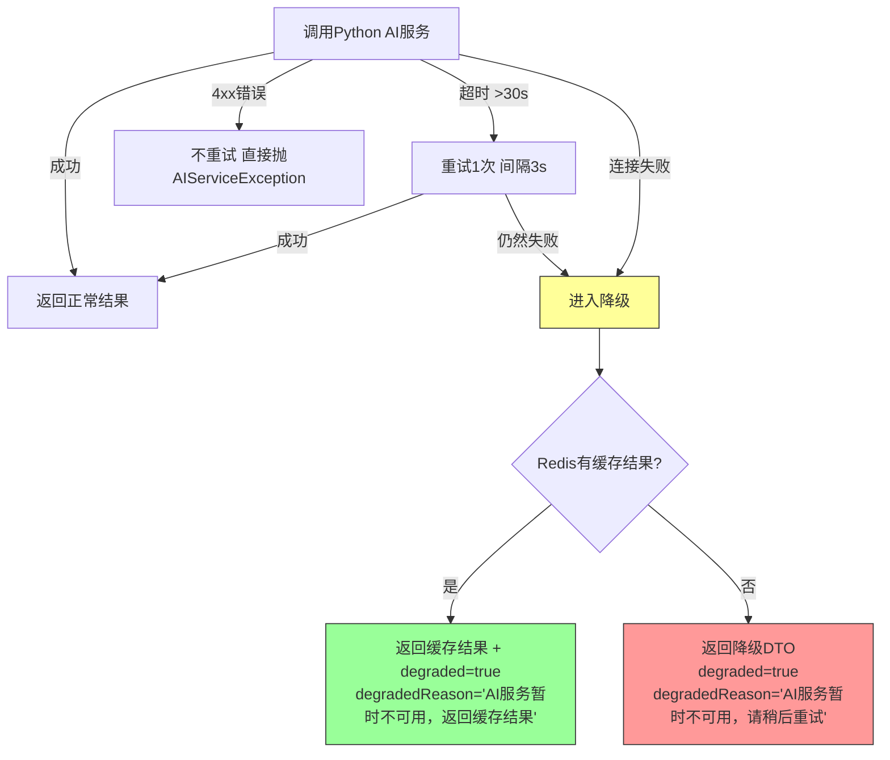

**降级响应示例**：
```json
{
    "analysisId": "anl_001",
    "status": "degraded",
    "report": null,
    "citations": null,
    "agentStates": null,
    "degraded": true,
    "degradedReason": "AI服务暂时不可用，返回缓存结果"
}
```

### 8.6 功能清单

| 编号 | 功能 | 优先级 | 状态 | 说明 |
|------|------|--------|------|------|
| F2.5.1 | Python服务客户端 | P0 | ✅已实现 | 双WebClient封装，独立连接池，超时30s/150s/5s，重试1次 |
| F2.5.2 | 请求转换 | P0 | ✅已实现 | AgentRequest(6字段) → Python JSON格式，含UserProfileDTO |
| F2.5.3 | 响应解析 | P0 | ✅已实现 | Python JSON → AnalysisResultDTO/ModelStatusDTO |
| F2.5.4 | SSE流式转发 | P1 | ✅已实现 | Flux<AgentSseEvent>，Last-Event-ID断线重连 |
| F2.5.5 | 降级机制 | P1 | ✅已实现 | 三级降级：正常→缓存→降级提示 |
| F2.5.6 | Agent状态Redis管理 | P1 | ✅已实现 | Hash存储，5分钟TTL，实时读写 |

---

## 9 缓存管理模块（F2.6）

### 9.1 模块概述

基于Spring Data Redis实现的统一缓存管理层，为所有业务模块提供缓存读写、失效、一致性保障能力。共管理9大缓存空间，采用Cache-Aside模式，写后删缓存策略。

### 9.2 RedisConfig

```java
@Configuration
@EnableCaching
public class RedisConfig {

    @Bean
    public RedisCacheManager cacheManager(RedisConnectionFactory factory) {
        // 默认TTL：30分钟
        RedisCacheConfiguration defaultConfig = RedisCacheConfiguration.defaultCacheConfig()
            .entryTtl(Duration.ofMinutes(30))
            .serializeKeysWith(RedisSerializationContext.SerializationPair
                .fromSerializer(new StringRedisSerializer()))
            .serializeValuesWith(RedisSerializationContext.SerializationPair
                .fromSerializer(new GenericJackson2JsonRedisSerializer()));

        // 各缓存空间的自定义TTL
        Map<String, RedisCacheConfiguration> cacheConfigurations = new HashMap<>();
        cacheConfigurations.put("userProfile", defaultConfig.entryTtl(Duration.ofHours(1)));
        cacheConfigurations.put("userInfo", defaultConfig.entryTtl(Duration.ofHours(1)));
        cacheConfigurations.put("paperDetail", defaultConfig.entryTtl(Duration.ofMinutes(30)));
        cacheConfigurations.put("paperSearch", defaultConfig.entryTtl(Duration.ofMinutes(10)));
        cacheConfigurations.put("analysisResult", defaultConfig.entryTtl(Duration.ofMinutes(30)));
        cacheConfigurations.put("sessionState", defaultConfig.entryTtl(Duration.ofHours(2)));

        return RedisCacheManager.builder(factory)
            .cacheDefaults(defaultConfig)
            .withInitialCacheConfigurations(cacheConfigurations)
            .build();
    }

    @Bean
    public RedisTemplate<String, String> redisTemplate(RedisConnectionFactory factory) {
        RedisTemplate<String, String> template = new RedisTemplate<>();
        template.setConnectionFactory(factory);
        template.setKeySerializer(new StringRedisSerializer());
        template.setValueSerializer(new StringRedisSerializer());
        return template;
    }
}
```

### 9.3 缓存策略详情

| 缓存空间 | Key格式 | TTL | 数据结构 | 失效策略 | 使用模块 |
|---------|---------|-----|---------|---------|---------|
| **用户画像** | `user:profile:{userId}` | 1小时 | String(JSON) | @CacheEvict on create/update | UserService |
| **用户信息** | `user:info:{userId}` | 1小时 | String(JSON) | @CacheEvict on update/createProfile/updateProfile | UserService |
| **论文详情** | `paper:detail:{paperId}` | 30分钟 | String(JSON) | 自然过期 | PaperService |
| **论文搜索** | `paperSearch` (SpEL组合Key) | 10分钟 | String(JSON) | 自然过期 | PaperService |
| **分析结果** | `analysisResult:{analysisId}` | 30分钟 | String(JSON) | @Cacheable on getAnalysisResult | AnalysisService |
| **会话状态** | `sessionState:{sessionId}` | 2小时 | String(JSON) | @CacheEvict on update/delete | SessionService |
| **Agent状态** | `agent:state:{analysisId}` | 5分钟 | Hash(field=agentName) | 自然过期 | AgentClientService |
| **分析结果缓存** | `analysis:result:{analysisId}` | 30分钟 | String(JSON) | AgentClientService.cacheAnalysisResult | AgentClientService |
| **Token黑名单** | `auth:blacklist:{tokenHash}` | Token剩余有效期 | String | 自然过期 | UserService |

### 9.4 缓存一致性策略

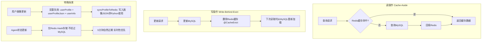

**Cache-Aside Pattern（旁路缓存）**：

```
读操作：
1. 先读Redis缓存
2. 缓存命中 → 直接返回
3. 缓存未命中 → 查MySQL → 回填Redis → 返回

写操作：
1. 先更新MySQL
2. 再删除Redis缓存（@CacheEvict）
3. 下次读取时从MySQL重新加载

特殊场景：
- 用户画像更新：三重失效（userProfile + userProfileJson + userInfo）
  userProfileJson供Python服务使用，需同步失效+重写
- Agent状态：仅通过Redis Hash存储，不经过MySQL
  实时性要求高，5分钟自然过期即可
- 分析结果缓存：AgentClientService手动管理
  成功时cacheAnalysisResult，降级时读取缓存
```

### 9.5 功能清单

| 编号 | 功能 | 优先级 | 缓存策略 | 验收标准 |
|------|------|--------|---------|---------|
| F2.6.1 | 用户画像缓存 | P0 | TTL 1小时，画像更新时主动失效 | 缓存命中率>50%，画像更新后缓存失效 |
| F2.6.2 | 论文检索缓存 | P1 | TTL 10分钟，SpEL组合Key | 相同查询直接返回缓存 |
| F2.6.3 | 分析结果缓存 | P1 | TTL 30分钟，同一论文+同一画像可复用 | 相同分析请求命中缓存 |
| F2.6.4 | 会话状态缓存 | P1 | TTL 2小时，会话结束时清除 | 会话状态读写正确 |
| F2.6.5 | Agent状态缓存 | P1 | TTL 5分钟，Redis Hash | SSE实时推送+状态查询 |
| F2.6.6 | Token黑名单 | P0 | TTL=Token剩余有效期 | 退出登录后Token不可用 |

---

## 10 模块间依赖与交互

### 10.1 模块依赖关系图

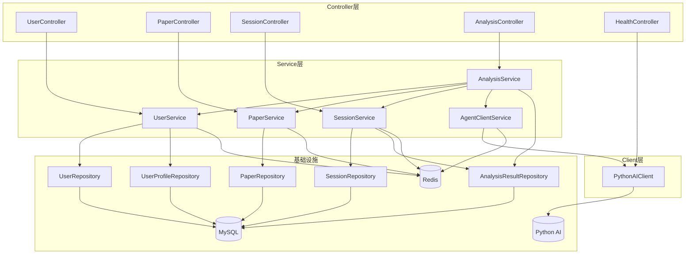

### 10.2 模块调用关系矩阵

| 调用方 | 被调用方 | 调用方式 | 说明 |
|--------|---------|---------|------|
| AnalysisService | UserService | 方法调用 | 获取用户画像（buildUserProfile） |
| AnalysisService | PaperService | 方法调用 | 获取论文详情 |
| AnalysisService | SessionService | 方法调用 | 解析/创建会话 |
| AnalysisService | AgentClientService | 方法调用 | 发起AI分析 |
| AnalysisService | AnalysisResultRepository | 直接调用 | 保存/查询分析结果 |
| AnalysisService | self（自注入） | @Lazy代理 | savePending/completeAnalysis事务 |
| AgentClientService | PythonAIClient | 方法调用 | HTTP调用Python服务 |
| AgentClientService | RedisTemplate | 直接调用 | Agent状态Hash + 分析结果缓存 |
| UserService | UserRepository | 方法调用 | 用户CRUD |
| UserService | UserProfileRepository | 方法调用 | 画像CRUD |
| UserService | RedisTemplate | 注解+直接 | 缓存 + 画像同步 + 黑名单 |
| PaperService | PaperRepository | 方法调用 | 论文查询 |
| PaperService | RedisTemplate | 注解调用 | 搜索结果缓存 |
| SessionService | SessionRepository | 方法调用 | 会话CRUD |
| SessionService | AnalysisResultRepository | 直接调用 | 查询analysisCount |
| SessionService | RedisTemplate | 注解调用 | 会话状态缓存 |
| HealthController | PythonAIClient | 方法调用 | AI服务健康检查 |

### 10.3 跨模块数据流

#### 论文分析完整数据流

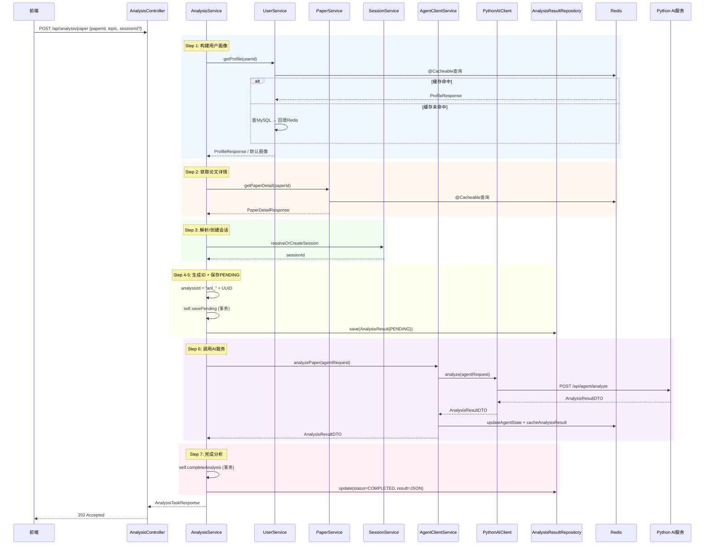

---

## 11 数据模型规范

### 11.1 Entity类设计规范

```java
// Entity类规范示例
@Entity
@Table(name = "users")
@Data                              // Lombok: getter/setter/toString/equals/hashCode
@NoArgsConstructor                 // Lombok: 无参构造器
@AllArgsConstructor                // Lombok: 全参构造器
@Builder                           // Lombok: Builder模式
public class User {

    @Id
    @GeneratedValue(strategy = GenerationType.IDENTITY)
    private Long id;

    @Column(name = "user_id", unique = true, nullable = false, length = 100)
    private String userId;

    @Column(nullable = false, length = 100)
    private String username;

    @Column(length = 200)
    private String email;

    @Column(name = "password_hash", nullable = false, length = 200)
    private String passwordHash;

    @Column(name = "created_at", updatable = false)
    private LocalDateTime createdAt;

    @PrePersist
    protected void onCreate() {
        createdAt = LocalDateTime.now();
    }
}
```

### 11.2 全部Entity定义

**User**：
| 字段 | 类型 | 列名 | 约束 | 说明 |
|------|------|------|------|------|
| id | Long | id | PK, AUTO_INCREMENT | 自增主键 |
| userId | String | user_id | UNIQUE, NOT NULL | 业务ID，"usr_"前缀 |
| username | String | username | NOT NULL | 用户名 |
| email | String | email | - | 邮箱 |
| passwordHash | String | password_hash | NOT NULL | BCrypt加密密码 |
| createdAt | LocalDateTime | created_at | NOT NULL | 创建时间（@PrePersist） |

**UserProfile**：
| 字段 | 类型 | 列名 | 约束 | 说明 |
|------|------|------|------|------|
| id | Long | id | PK, AUTO_INCREMENT | 自增主键 |
| userId | String | user_id | UNIQUE, NOT NULL | 关联User |
| educationLevel | EducationLevel | education_level | NOT NULL | 学历层次（Converter自动映射） |
| researchField | String | research_field | NOT NULL | 研究方向 |
| knowledgeLevel | KnowledgeLevel | knowledge_level | NOT NULL | 知识水平（Converter自动映射） |
| preferredStyle | PreferredStyle | preferred_style | NOT NULL | 偏好风格（Converter自动映射） |
| profileData | String | profile_data | - | 画像扩展数据（JSON） |
| updatedAt | LocalDateTime | updated_at | - | 更新时间（@PrePersist/@PreUpdate） |

**Paper**：
| 字段 | 类型 | 列名 | 约束 | 说明 |
|------|------|------|------|------|
| id | Long | id | PK, AUTO_INCREMENT | 自增主键 |
| paperId | String | paper_id | UNIQUE | 论文业务ID |
| title | String | title | - | 标题 |
| authors | String | authors | - | 作者列表（JSON数组） |
| abstractText | String | abstract | TEXT | 摘要 |
| year | Integer | year | - | 发表年份 |
| venue | String | venue | - | 发表会议/期刊 |
| keywords | String | keywords | - | 关键词（JSON数组） |
| citationCount | Integer | citation_count | - | 引用数 |
| pdfUrl | String | pdf_url | - | PDF链接 |
| createdAt | LocalDateTime | created_at | - | 创建时间 |
| updatedAt | LocalDateTime | updated_at | - | 更新时间 |

**Session**：
| 字段 | 类型 | 列名 | 约束 | 说明 |
|------|------|------|------|------|
| id | Long | id | PK, AUTO_INCREMENT | 自增主键 |
| sessionId | String | session_id | UNIQUE, NOT NULL | 业务ID，"ses_"前缀 |
| userId | String | user_id | NOT NULL | 关联User |
| topic | String | topic | NOT NULL | 会话主题 |
| status | SessionStatus | status | NOT NULL | 会话状态（Converter自动映射） |
| createdAt | LocalDateTime | created_at | - | 创建时间 |

**AnalysisResult**：
| 字段 | 类型 | 列名 | 约束 | 说明 |
|------|------|------|------|------|
| id | Long | id | PK, AUTO_INCREMENT | 自增主键 |
| analysisId | String | analysis_id | UNIQUE, NOT NULL | 业务ID，"anl_"前缀 |
| sessionId | String | session_id | NOT NULL | 关联Session |
| type | AnalysisType | type | NOT NULL | 分析类型（Converter自动映射） |
| result | String | result | JSON | 分析结果（JSON） |
| status | AnalysisStatus | status | NOT NULL | 分析状态（Converter自动映射） |
| createdAt | LocalDateTime | created_at | - | 创建时间 |

**PaperFavorite**：
| 字段 | 类型 | 列名 | 约束 | 说明 |
|------|------|------|------|------|
| - | - | - | - | Entity存在于代码中，⚠️ 待实现相关功能 |

### 11.3 Entity-Repository映射

| Entity | Repository | 主表 | 说明 |
|--------|-----------|------|------|
| `User` | `UserRepository` | users | 用户基础信息 |
| `UserProfile` | `UserProfileRepository` | user_profiles | 用户画像（1:1关联User） |
| `Paper` | `PaperRepository` + `PaperRepositoryCustom` | papers | 论文元数据 |
| `Session` | `SessionRepository` | sessions | 分析会话 |
| `AnalysisResult` | `AnalysisResultRepository` | analysis_results | 分析结果 |
| `PaperFavorite` | `PaperFavoriteRepository` | paper_favorites | 论文收藏（⚠️ 待实现） |

### 11.4 枚举类型定义与ORM映射

**设计原则**：Java层保持 `UPPER_SNAKE_CASE`（符合Java规范），数据库保持 `lowercase`（符合MySQL规范），通过 `AttributeConverter` 实现双向自动转换。

```java
// DbValueEnum — 所有枚举实现的接口
public interface DbValueEnum {
    String getDbValue();
}

// AbstractEnumConverter — 通用双向转换基类（autoApply=true自动生效）
public abstract class AbstractEnumConverter<E extends Enum<E> & DbValueEnum>
        implements AttributeConverter<E, String> {

    private final Map<String, E> dbValueMap; // O(1)反向映射

    @Override
    public String convertToDatabaseColumn(E attribute) {
        return attribute != null ? attribute.getDbValue() : null;
    }

    @Override
    public E convertToEntityAttribute(String dbData) {
        if (dbData == null) return null;
        E result = dbValueMap.get(dbData);
        if (result == null) throw new IllegalArgumentException(
                "Unknown dbValue '" + dbData + "' for enum " + enumClass.getSimpleName());
        return result;
    }
}

// 具体枚举示例
public enum AnalysisStatus implements DbValueEnum {
    PENDING("pending"),
    PROCESSING("processing"),
    COMPLETED("completed"),
    FAILED("failed");

    private final String dbValue;
    AnalysisStatus(String dbValue) { this.dbValue = dbValue; }
    @Override public String getDbValue() { return dbValue; }
}

// 具体Converter示例（@Converter(autoApply=true)自动生效，Entity无需@Convert注解）
@Converter(autoApply = true)
public class AnalysisStatusConverter extends AbstractEnumConverter<AnalysisStatus> {
    public AnalysisStatusConverter() { super(AnalysisStatus.class); }
}
```

**转换流程**：

```
Java枚举 (UPPER_SNAKE_CASE)             数据库 (lowercase)
  AnalysisStatus.PENDING  ── convertToDatabaseColumn() ──→  "pending"
  AnalysisStatus.PENDING  ←─ convertToEntityAttribute() ──  "pending"
```

**Entity中使用**（无需 `@Enumerated` 和 `@Convert` 注解）：

```java
@Column(nullable = false, length = 20)
private AnalysisStatus status;  // Converter自动处理
```

**Note**: 由于 `AttributeConverter` 将枚举映射为 `String` 类型存储，Hibernate 启动时（`ddl-auto=update`）会自动执行 `ALTER TABLE ... MODIFY COLUMN ... VARCHAR(20)`，将数据库中的 `ENUM` 列转换为 `VARCHAR` 列。这是正常行为，不影响数据存取。

**已有枚举映射表**：

```java
// 学历层次
public enum EducationLevel implements DbValueEnum {
    UNDERGRADUATE("undergraduate"),
    MASTER("master"),
    PHD("phd"),
    FACULTY("faculty");
}

// 知识水平
public enum KnowledgeLevel implements DbValueEnum {
    BEGINNER("beginner"),
    INTERMEDIATE("intermediate"),
    ADVANCED("advanced"),
    EXPERT("expert");
}

// 偏好风格
public enum PreferredStyle implements DbValueEnum {
    SIMPLE("simple"),
    BALANCED("balanced"),
    TECHNICAL("technical");
}

// 会话状态
public enum SessionStatus implements DbValueEnum {
    ACTIVE("active"),
    COMPLETED("completed"),
    EXPIRED("expired");
}

// 分析类型
public enum AnalysisType implements DbValueEnum {
    PAPER_ANALYSIS("paper_analysis"),
    COMPARE("compare"),
    REPORT("report");
}

// 分析状态
public enum AnalysisStatus implements DbValueEnum {
    PENDING("pending"),
    PROCESSING("processing"),
    COMPLETED("completed"),
    FAILED("failed");
}
```

### 11.5 JSON字段处理

Paper实体的`authors`和`keywords`字段以JSON数组形式存储在MySQL中，通过`JsonStringListHelper`实现JSON字符串与`List<String>`的双向转换：

```java
// JsonStringListHelper — JSON字符串↔List<String>转换
public class JsonStringListHelper {
    private static final ObjectMapper MAPPER = new ObjectMapper();

    public static List<String> fromJson(String json) {
        if (json == null || json.isBlank()) return Collections.emptyList();
        return MAPPER.readValue(json, new TypeReference<>() {});
    }

    public static String toJson(List<String> list) {
        if (list == null || list.isEmpty()) return null;
        return MAPPER.writeValueAsString(list);
    }
}

// PaperMapper中使用
@Mapper(componentModel = "spring")
public abstract class PaperMapper {
    // authors字段：Entity的String(JSON) ↔ DTO的List<String>
    // keywords字段：Entity的String(JSON) ↔ DTO的List<String>
}
```

---

## 12 统一响应与异常处理

### 12.1 统一响应格式

```java
@Data
@Builder
public class ApiResponse<T> {
    private int code;        // 业务状态码
    private String message;  // 响应消息
    private T data;          // 响应数据
    private long timestamp;  // 时间戳

    public static <T> ApiResponse<T> success(T data) {
        return ApiResponse.<T>builder()
            .code(200)
            .message("success")
            .data(data)
            .timestamp(System.currentTimeMillis())
            .build();
    }

    public static <T> ApiResponse<T> error(int code, String message) {
        return ApiResponse.<T>builder()
            .code(code)
            .message(message)
            .timestamp(System.currentTimeMillis())
            .build();
    }
}
```

**响应示例**：
```json
{
    "code": 200,
    "message": "success",
    "data": {...},
    "timestamp": 1716451200000
}
```

### 12.2 分页响应格式

```java
@Data
@Builder
public class PageResponse<T> {
    private List<T> items;     // 数据列表
    private long total;        // 总记录数
    private int page;          // 当前页码
    private int size;          // 每页大小
    private int totalPages;    // 总页数
}
```

### 12.3 ErrorCode枚举

```java
public enum ErrorCode {
    SUCCESS(200),
    BAD_REQUEST(400),
    UNAUTHORIZED(401),
    FORBIDDEN(403),
    NOT_FOUND(404),
    INTERNAL_ERROR(500),
    SERVICE_UNAVAILABLE(503);

    private final int code;
}
```

### 12.4 异常体系

```java
// 业务异常基类（4个构造器 + errorKey字段）
public class BusinessException extends RuntimeException {
    private final int code;
    private final String errorKey;

    public BusinessException(int code, String message) { ... }
    public BusinessException(int code, String message, String errorKey) { ... }
    public BusinessException(int code, String message, Throwable cause) { ... }
    public BusinessException(int code, String message, String errorKey, Throwable cause) { ... }
}

// 认证异常
public class AuthenticationException extends BusinessException {
    // code = 401, errorKey = "AUTHENTICATION_FAILED"
}

// 资源不存在异常
public class ResourceNotFoundException extends BusinessException {
    // code = 404, errorKey = "RESOURCE_NOT_FOUND"
}

// AI服务调用异常
public class AIServiceException extends BusinessException {
    // code = 502, errorKey = "AI_SERVICE_ERROR"
}
```

### 12.5 全局异常处理器

```java
@RestControllerAdvice
public class GlobalExceptionHandler {

    // 1. 参数校验异常
    @ExceptionHandler(MethodArgumentNotValidException.class)
    public ResponseEntity<ApiResponse<Void>> handleValidation(MethodArgumentNotValidException e);
    // → 400

    // 2. 认证异常
    @ExceptionHandler(AuthenticationException.class)
    public ResponseEntity<ApiResponse<Void>> handleAuth(AuthenticationException e);
    // → 401

    // 3. 资源不存在
    @ExceptionHandler(ResourceNotFoundException.class)
    public ResponseEntity<ApiResponse<Void>> handleNotFound(ResourceNotFoundException e);
    // → 404

    // 4. AI服务异常
    @ExceptionHandler(AIServiceException.class)
    public ResponseEntity<ApiResponse<Void>> handleAIService(AIServiceException e);
    // → 502, message: "AI服务暂时不可用，请稍后重试"

    // 5. 通用业务异常
    @ExceptionHandler(BusinessException.class)
    public ResponseEntity<ApiResponse<Void>> handleBusiness(BusinessException e);
    // → 根据code映射：400/401/403/404/409/503/500

    // 6. 非法参数
    @ExceptionHandler(IllegalArgumentException.class)
    public ResponseEntity<ApiResponse<Void>> handleIllegalArgument(IllegalArgumentException e);
    // → 400

    // 7. 缺少请求参数
    @ExceptionHandler(MissingServletRequestParameterException.class)
    public ResponseEntity<ApiResponse<Void>> handleMissingParam(MissingServletRequestParameterException e);
    // → 400

    // 8. 兜底异常
    @ExceptionHandler(Exception.class)
    public ResponseEntity<ApiResponse<Void>> handleGeneral(Exception e);
    // → 500, message: "服务器内部错误"
}
```

**所有处理器均返回 `ResponseEntity<ApiResponse<Void>>`，确保HTTP状态码与业务码一致。**

### 12.6 异常处理流程

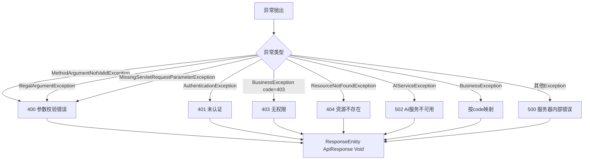

---

## 13 安全架构

### 13.1 JWT鉴权流程

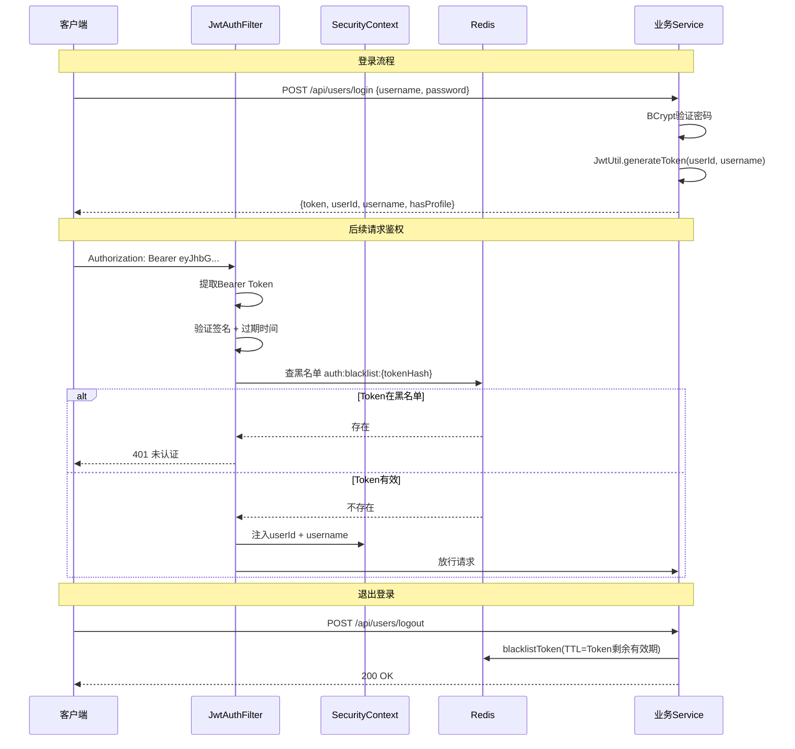

### 13.2 SecurityConfig配置

```java
@Configuration
@EnableWebSecurity
public class SecurityConfig {

    @Bean
    public SecurityFilterChain securityFilterChain(HttpSecurity http) throws Exception {
        http
            .csrf(csrf -> csrf.disable())
            .cors(cors -> cors.configurationSource(corsConfigurationSource()))
            .sessionManagement(session ->
                session.sessionCreationPolicy(SessionCreationPolicy.STATELESS))
            .exceptionHandling(exceptions -> exceptions
                .authenticationEntryPoint(customAuthenticationEntryPoint)
                .accessDeniedHandler(customAccessDeniedHandler))
            .authorizeHttpRequests(auth -> auth
                .requestMatchers("/api/users/register", "/api/users/login").permitAll()
                .requestMatchers("/health", "/actuator/**", "/error").permitAll()
                .anyRequest().authenticated())
            .formLogin(form -> form.disable())
            .logout(logout -> logout.disable())
            .addFilterBefore(jwtAuthFilter,
                UsernamePasswordAuthenticationFilter.class);

        return http.build();
    }

    @Bean
    public PasswordEncoder passwordEncoder() {
        return new BCryptPasswordEncoder(10);
    }

    // CORS配置
    private CorsConfigurationSource corsConfigurationSource() {
        // allowed-origins: 从配置读取（cors.allowed-origins）
        // methods: GET, POST, PUT, DELETE, OPTIONS
        // headers: Authorization, Content-Type, X-Request-Id
        // credentials: true
        // maxAge: 3600
    }
}
```

### 13.3 Security异常统一处理

```java
// CustomAuthenticationEntryPoint — 未认证请求返回统一ApiResponse
@Component
public class CustomAuthenticationEntryPoint implements AuthenticationEntryPoint {
    @Override
    public void commence(HttpServletRequest request, HttpServletResponse response,
                         AuthenticationException authException) throws IOException {
        ApiResponse<Void> apiResponse = ApiResponse.error(401, "未认证，请先登录");
        response.setContentType(MediaType.APPLICATION_JSON_VALUE);
        response.setStatus(HttpServletResponse.SC_UNAUTHORIZED);
        response.getWriter().write(objectMapper.writeValueAsString(apiResponse));
    }
}

// CustomAccessDeniedHandler — 无权限请求返回统一ApiResponse
@Component
public class CustomAccessDeniedHandler implements AccessDeniedHandler {
    @Override
    public void handle(HttpServletRequest request, HttpServletResponse response,
                       AccessDeniedException accessDeniedException) throws IOException {
        ApiResponse<Void> apiResponse = ApiResponse.error(403, "无权限访问");
        response.setContentType(MediaType.APPLICATION_JSON_VALUE);
        response.setStatus(HttpServletResponse.SC_FORBIDDEN);
        response.getWriter().write(objectMapper.writeValueAsString(apiResponse));
    }
}
```

### 13.4 安全措施清单

| 措施 | 实现方式 | 优先级 | 状态 |
|------|---------|--------|------|
| 密码加密 | BCryptPasswordEncoder(10) 哈希存储 | P0 | ✅已实现 |
| 请求鉴权 | JWT Token + Redis黑名单 | P0 | ✅已实现 |
| 参数校验 | Spring Validation (@Valid) | P0 | ✅已实现 |
| SQL注入防护 | JPA参数化查询，禁止拼接SQL | P0 | ✅已实现 |
| 数据隔离 | validateDataIsolation(userId) 校验SecurityContext | P0 | ✅已实现 |
| CORS配置 | 限制允许的Origin，credentials=true | P0 | ✅已实现 |
| 敏感配置 | JWT密钥通过环境变量注入 | P0 | ✅已实现 |
| Security异常统一处理 | CustomAuthenticationEntryPoint(401) + CustomAccessDeniedHandler(403) | P0 | ✅已实现 |
| 传输加密 | 生产环境HTTPS | P1 | ⚠️待部署 |
| XSS防护 | 前端输入转义，Content-Security-Policy头 | P1 | ⚠️待实现 |
| 请求限流 | Spring Boot Rate Limiter | P2 | ⚠️待实现 |

### 13.5 数据隔离机制

```java
// 所有涉及用户数据的Service方法均调用validateDataIsolation
private void validateDataIsolation(String userId) {
    String currentUserId = SecurityContext.getCurrentUserId();
    if (!currentUserId.equals(userId)) {
        throw new BusinessException(403, "无权访问其他用户数据", "ACCESS_DENIED");
    }
}
```

**隔离范围**：
- UserService：getUserInfo, updateUser, getProfile, createProfile, updateProfile, logoutWithAuth
- SessionService：getSessionDetail, updateStatus, deleteSession
- AnalysisService：getAnalysisResult, getAnalysisStatus, validateAnalysisAccess

---

## 14 配置管理

### 14.1 application.yml 主配置

```yaml
server:
  port: 8080

spring:
  datasource:
    url: ${MYSQL_URL:jdbc:mysql://localhost:3306/literature_assistant?useUnicode=true&characterEncoding=UTF-8&serverTimezone=Asia/Shanghai}
    username: ${MYSQL_USERNAME:root}
    password: ${MYSQL_PASSWORD:CHANGE_ME}            # ⚠️ 已移除明文默认值，必须通过环境变量注入
    driver-class-name: com.mysql.cj.jdbc.Driver
    hikari:
      maximum-pool-size: 20
      minimum-idle: 5
      connection-timeout: 30000

  jpa:
    hibernate:
      ddl-auto: update    # 开发环境: update; 生产环境: validate
    show-sql: false
    properties:
      hibernate:
        dialect: org.hibernate.dialect.MySQLDialect
        format_sql: true

  data:
    redis:
      host: ${REDIS_HOST:localhost}
      port: ${REDIS_PORT:6379}
      password: ${REDIS_PASSWORD:}
      timeout: 5000
      lettuce:
        pool:
          max-active: 20
          max-idle: 10
          min-idle: 5

  jackson:
    date-format: yyyy-MM-dd HH:mm:ss
    time-zone: Asia/Shanghai
    default-property-inclusion: non_null
    property-naming-strategy: SNAKE_CASE
    mapper:
      accept-case-insensitive-enums: true

ai-service:
  url: ${AI_SERVICE_URL:http://localhost:8000}
  retry-count: 1
  retry-interval: 3000
  sse-timeout: 150000

cors:
  allowed-origins: ${CORS_ALLOWED_ORIGINS:http://localhost:5173}

jwt:
  secret: ${JWT_SECRET}                      # 必须通过环境变量注入，无默认值
  expiration: ${JWT_EXPIRATION:86400000}     # 24小时（毫秒）

logging:
  level:
    root: INFO
    com.literatureassistant: DEBUG
    org.springframework.web: INFO
    org.hibernate.SQL: DEBUG
  pattern:
    console: "%d{yyyy-MM-dd HH:mm:ss} [%thread] %-5level %logger{36} - [%X{requestId}] %msg%n"
```

### 14.2 关键配置说明

| 配置项 | 值 | 说明 |
|--------|-----|------|
| `spring.jpa.hibernate.ddl-auto` | update | 开发环境自动建表，生产环境改为validate |
| `spring.jpa.properties.hibernate.dialect` | MySQLDialect | 适配MySQL8/9 |
| `spring.jackson.property-naming-strategy` | SNAKE_CASE | 全局JSON字段命名策略 |
| `spring.jackson.mapper.accept-case-insensitive-enums` | true | 枚举反序列化忽略大小写 |
| `ai-service.sse-timeout` | 150000 | SSE流式调用超时150秒 |
| `cors.allowed-origins` | 可配置 | 支持多Origin逗号分隔 |
| `jwt.secret` | 无默认值 | 必须通过环境变量注入 |

### 14.3 环境配置分离

```
application.yml           # 公共配置
application-dev.yml       # 开发环境（本地MySQL、Redis、AI服务）
application-prod.yml      # 生产环境（Docker内服务发现）
```

### 14.4 环境变量清单

| 环境变量 | 说明 | 默认值 |
|---------|------|--------|
| `MYSQL_URL` | MySQL连接URL | `jdbc:mysql://localhost:3306/literature_assistant?useUnicode=true&characterEncoding=UTF-8&serverTimezone=Asia/Shanghai` |
| `MYSQL_USERNAME` | MySQL用户名 | `root` |
| `MYSQL_PASSWORD` | MySQL密码 | `CHANGE_ME`（已轮换原 `Aa2105268075.`，必须通过环境变量覆盖） |
| `REDIS_HOST` | Redis主机 | `localhost` |
| `REDIS_PORT` | Redis端口 | `6379` |
| `REDIS_PASSWORD` | Redis密码 | 空 |
| `AI_SERVICE_URL` | Python AI服务URL | `http://localhost:8000` |
| `JWT_SECRET` | JWT签名密钥 | 无默认值（必须注入） |
| `JWT_EXPIRATION` | JWT过期时间（毫秒） | `86400000`（24小时） |
| `CORS_ALLOWED_ORIGINS` | 允许的跨域Origin | `http://localhost:5173` |

---

## 15 性能规范

### 15.1 性能指标

| 指标 | 目标值 | 说明 |
|------|--------|------|
| API接口平均响应时间（非AI调用） | ≤ 500ms | 用户、论文、会话等CRUD接口 |
| 论文检索响应时间 | ≤ 3秒 | MySQL动态查询 + Redis缓存 |
| JWT鉴权耗时 | ≤ 10ms | Token验证 + Redis黑名单查询 |
| Redis缓存命中率 | > 50% | 用户画像和检索结果缓存 |
| 数据库连接池利用率 | < 80% | HikariCP监控（max=20） |
| WebClient连接池利用率 | < 80% | 同步池(max=50) + SSE池(max=20) |
| 并发用户支持 | ≥ 50 | 单机部署 |

### 15.2 性能优化策略

| 优化项 | 策略 | 涉及模块 |
|--------|------|---------|
| 数据库查询 | JPA分页查询；排序白名单避免注入；动态查询条件 | Repository层 |
| 缓存 | Cache-Aside Pattern；9大缓存空间TTL分级；主动失效 | F2.6 |
| 异步调用 | WebFlux异步调用Python服务；SSE流式推送 | F2.5 |
| 连接池 | HikariCP(max=20)；Redis Lettuce(max-active=20)；WebClient双连接池(50+20) | Config |
| 分页 | 所有列表接口强制分页，safePage/safeSize边界处理 | Controller层 |
| SSE隔离 | SSE连接池独立（20连接），避免长连接占满同步池 | WebClientConfig |

### 15.3 分页边界处理

```java
// PaperService中的分页安全处理
int safePage = Math.max(1, page);       // 页码最小为1
int safeSize = Math.min(100, Math.max(1, size));  // 每页1-100条
// JPA使用0-based页码，需转换：PageRequest.of(safePage - 1, safeSize, sort)
```

---

## 16 日志与监控

### 16.1 日志规范

```
日志格式：
{时间} [{线程}] {级别} {类名} - [{请求ID}] {消息}

示例：
2026-06-08 10:30:00 [http-nio-8080-exec-1] INFO  c.l.service.UserService - [req_abc123] User logged in: userId=usr_def456

日志级别使用规范：
- ERROR：系统异常、AI服务不可用、数据库连接失败
- WARN：业务异常（用户不存在、参数错误）、降级触发
- INFO：关键业务操作（用户注册/登录、分析任务创建/完成）
- DEBUG：SQL查询、缓存命中/未命中、API请求/响应

请求ID（RequestId）：
- 每个HTTP请求进入时生成UUID（RequestIdFilter）
- 通过MDC注入日志上下文
- 用于链路追踪（前端 → Java → Python）
```

### 16.2 关键日志点

| 操作 | 日志级别 | 日志内容 |
|------|---------|---------|
| 用户注册 | INFO | `User registered: userId={}` |
| 用户登录 | INFO | `User logged in: userId={}` |
| 论文搜索 | DEBUG | `Paper search: query={}, results={}, time={}ms` |
| 分析任务创建 | INFO | `Analysis created: analysisId={}, type={}, userId={}` |
| AI服务调用 | DEBUG | `AI service call: url={}, duration={}ms` |
| AI服务超时 | WARN | `AI service timeout: url={}, timeout={}ms` |
| AI服务降级 | WARN | `AI service fallback: analysisId={}, reason={}` |
| 缓存命中 | DEBUG | `Cache hit: key={}` |
| 缓存未命中 | DEBUG | `Cache miss: key={}` |
| 数据隔离校验失败 | WARN | `Data isolation violation: currentUserId={}, requestedUserId={}` |
| 异常 | ERROR | `Exception: {}`, exception |

### 16.3 健康检查

```java
@RestController
public class HealthController {

    @GetMapping("/health")
    public ApiResponse<Map<String, Object>> health() {
        Map<String, Object> status = new LinkedHashMap<>();
        status.put("status", "UP");
        status.put("timestamp", System.currentTimeMillis());

        // 检查MySQL连接
        status.put("mysql", checkMySQL() ? "UP" : "DOWN");

        // 检查Redis连接
        status.put("redis", checkRedis() ? "UP" : "DOWN");

        // 检查Python AI服务
        status.put("aiService", agentClientService.isHealthy() ? "UP" : "DOWN");

        return ApiResponse.success(status);
    }
}
```

**健康检查响应示例**：
```json
{
    "code": 200,
    "message": "success",
    "data": {
        "status": "UP",
        "timestamp": 1716451200000,
        "mysql": "UP",
        "redis": "UP",
        "aiService": "UP"
    }
}
```

---

## 17 部署架构

### 17.1 Java后端Dockerfile

```dockerfile
FROM maven:3.9-eclipse-temurin-17 AS build
WORKDIR /build
COPY pom.xml .
RUN mvn dependency:go-offline -B
COPY src ./src
RUN mvn package -DskipTests -B

FROM eclipse-temurin:17-jre-alpine
RUN apk add --no-cache curl
RUN addgroup -S appgroup && adduser -S appuser -G appgroup
WORKDIR /app
COPY --from=build /build/target/*.jar app.jar
RUN chown appuser:appgroup app.jar
EXPOSE 8080
HEALTHCHECK --interval=30s --timeout=10s --retries=3 \
  CMD curl -f http://localhost:8080/health || exit 1
USER appuser
ENTRYPOINT ["java", "-jar", "/app/app.jar", "--spring.profiles.active=prod"]
```

### 17.2 Docker Compose中的Java后端配置

```yaml
java-backend:
  build: ./backend-java
  ports:
    - "8080:8080"
  environment:
    - SPRING_PROFILES_ACTIVE=prod
    - AI_SERVICE_URL=http://ai-service:8000
    - MYSQL_URL=jdbc:mysql://mysql:3306/literature_assistant?useUnicode=true&characterEncoding=UTF-8&serverTimezone=Asia/Shanghai
    - MYSQL_USERNAME=root
    - MYSQL_PASSWORD=${MYSQL_ROOT_PASSWORD}
    - REDIS_HOST=redis
    - JWT_SECRET=${JWT_SECRET}
    - CORS_ALLOWED_ORIGINS=http://localhost,http://localhost:5173
  networks:
    - app-network
  depends_on:
    mysql:
      condition: service_healthy
    redis:
      condition: service_healthy
    ai-service:
      condition: service_healthy
  healthcheck:
    test: ["CMD", "curl", "-f", "http://localhost:8080/health"]
    interval: 30s
    timeout: 10s
    retries: 3
```

### 17.3 启动依赖顺序

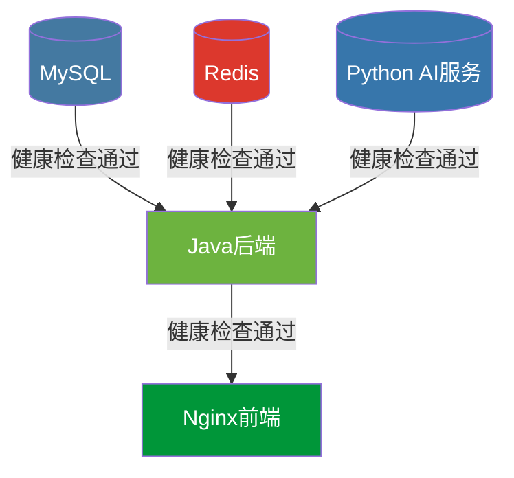

---

## 18 测试体系

### 18.1 测试概览

当前项目共有 **36个测试类**，约 **175个测试方法**，覆盖Controller、Service、Client、Filter、Mapper、DTO、Exception、Enum、Util等各层。

| 测试类别 | 测试类数 | 测试方法数 | 测试框架 | 说明 |
|---------|---------|-----------|---------|------|
| Controller测试 | 5 | 31 | MockMvc (standalone) | 验证API端点、参数校验、响应格式 |
| Service测试 | 8 | 48 | @InjectMocks + @Mock | 验证业务逻辑、缓存、数据隔离 |
| Client测试 | 1 | 7 | MockWebServer | 验证HTTP调用、超时、重试 |
| Filter测试 | 1 | 5 | MockHttpServletRequest | 验证JWT鉴权、黑名单 |
| Mapper测试 | 3 | 12 | 直接调用 | 验证Entity↔DTO转换、JSON字段 |
| DTO测试 | 5 | 31 | 直接调用 | 验证字段、@JsonProperty、序列化 |
| Exception测试 | 5 | 27 | 直接调用 | 验证异常码、errorKey、处理器 |
| Enum测试 | 2 | 26 | 直接调用 | 验证DbValueEnum、Converter双向转换 |
| Util测试 | 3 | 21 | 直接调用 | 验证JwtUtil、RedisKeyUtil、DateTimeUtil |
| Application测试 | 1 | 1 | @SpringBootTest | 验证上下文加载 |

### 18.2 关键测试模式

#### 18.2.1 数据隔离测试

```java
// 验证userId不匹配时返回403
@Test
void getUserInfo_otherUser_throwsForbidden() {
    // 设置SecurityContext为userA
    // 调用getUserInfo(userB_id)
    // 期望：BusinessException(code=403)
}
```

#### 18.2.2 AI降级测试

```java
// 验证AIServiceException触发降级
@Test
void analyzePaper_aiServiceDown_returnsDegraded() {
    // mock pythonAIClient.analyze() 抛出 AIServiceException
    // 期望：AnalysisResultDTO(degraded=true)
}

// 验证有缓存时返回缓存+降级标记
@Test
void analyzePaper_aiServiceDown_withCache_returnsCachedDegraded() {
    // 预设Redis缓存
    // mock pythonAIClient.analyze() 抛出 AIServiceException
    // 期望：AnalysisResultDTO(degraded=true, degradedReason="AI服务暂时不可用，返回缓存结果")
}
```

#### 18.2.3 状态机测试

```java
// 验证有效状态转换
@Test
void updateStatus_activeToCompleted_success() { ... }

// 验证无效状态转换
@Test
void updateStatus_completedToActive_throwsException() { ... }

// 验证同状态NOOP
@Test
void updateStatus_sameStatus_throwsSameStatusNoop() { ... }
```

#### 18.2.4 跨系统字段转换测试

```java
// 验证AnalysisTaskResponse的@JsonProperty snake_case
@Test
void analysisTaskResponse_serialization_usesSnakeCase() {
    AnalysisTaskResponse response = new AnalysisTaskResponse();
    response.setAnalysisId("anl_001");
    // 序列化后验证JSON字段名为 analysis_id
}

// 验证AgentStateResponse的@JsonProperty camelCase
@Test
void agentStateResponse_serialization_usesCamelCase() {
    AgentStateResponse response = new AgentStateResponse();
    response.setAgentName("coordinator");
    // 序列化后验证JSON字段名为 agentName
}
```

#### 18.2.5 分页边界测试

```java
@Test
void listPapers_pageLessThan1_correctedTo1() { ... }

@Test
void listPapers_sizeGreaterThan100_cappedTo100() { ... }

@Test
void listPapers_zeroBasedToOnBased_conversion() { ... }
```

#### 18.2.6 安全测试

```java
// 验证错误响应不暴露内部细节
@Test
void handleGeneral_noInternalDetailsExposed() {
    // 触发Exception
    // 期望：ApiResponse(message="服务器内部错误")，不包含堆栈信息
}
```

### 18.3 测试运行命令

```bash
# 运行全部测试
mvn test

# 运行指定测试类
mvn test -Dtest=UserServiceTest

# 运行指定测试方法
mvn test -Dtest=UserServiceTest#testRegister

# 跳过测试打包
mvn package -DskipTests
```

---

## 附录A：核心Maven依赖

```xml
<dependencies>
    <!-- Spring Boot Starters -->
    <dependency>
        <groupId>org.springframework.boot</groupId>
        <artifactId>spring-boot-starter-webflux</artifactId>
    </dependency>
    <dependency>
        <groupId>org.springframework.boot</groupId>
        <artifactId>spring-boot-starter-data-jpa</artifactId>
    </dependency>
    <dependency>
        <groupId>org.springframework.boot</groupId>
        <artifactId>spring-boot-starter-data-redis</artifactId>
    </dependency>
    <dependency>
        <groupId>org.springframework.boot</groupId>
        <artifactId>spring-boot-starter-validation</artifactId>
    </dependency>
    <dependency>
        <groupId>org.springframework.boot</groupId>
        <artifactId>spring-boot-starter-security</artifactId>
    </dependency>

    <!-- Database -->
    <dependency>
        <groupId>mysql</groupId>
        <artifactId>mysql-connector-j</artifactId>
        <scope>runtime</scope>
    </dependency>

    <!-- JWT -->
    <dependency>
        <groupId>io.jsonwebtoken</groupId>
        <artifactId>jjwt-api</artifactId>
        <version>0.12.5</version>
    </dependency>
    <dependency>
        <groupId>io.jsonwebtoken</groupId>
        <artifactId>jjwt-impl</artifactId>
        <version>0.12.5</version>
        <scope>runtime</scope>
    </dependency>
    <dependency>
        <groupId>io.jsonwebtoken</groupId>
        <artifactId>jjwt-jackson</artifactId>
        <version>0.12.5</version>
        <scope>runtime</scope>
    </dependency>

    <!-- Tools -->
    <dependency>
        <groupId>org.projectlombok</groupId>
        <artifactId>lombok</artifactId>
        <optional>true</optional>
    </dependency>
    <dependency>
        <groupId>org.mapstruct</groupId>
        <artifactId>mapstruct</artifactId>
        <version>1.5.5.Final</version>
    </dependency>

    <!-- Testing -->
    <dependency>
        <groupId>org.springframework.boot</groupId>
        <artifactId>spring-boot-starter-test</artifactId>
        <scope>test</scope>
    </dependency>
    <dependency>
        <groupId>org.springframework.security</groupId>
        <artifactId>spring-security-test</artifactId>
        <scope>test</scope>
    </dependency>
    <dependency>
        <groupId>com.squareup.okhttp3</groupId>
        <artifactId>mockwebserver</artifactId>
        <scope>test</scope>
    </dependency>
</dependencies>
```

---

## 附录B：开发检查清单

```
□ 每个Controller方法是否有@Valid参数校验？
□ 每个Service写操作是否有@Transactional？
□ 缓存Key是否使用RedisKeyUtil统一生成？
□ 缓存失效是否使用@CacheEvict（写操作）？
□ 敏感信息是否通过环境变量注入？
□ API响应是否使用ApiResponse统一包装？
□ 异常是否使用BusinessException体系？
□ 日志是否包含requestId用于链路追踪？
□ 用户数据隔离是否正确（validateDataIsolation）？
□ JPA查询是否避免了N+1问题？
□ 分页接口是否正确使用Pageable（safePage/safeSize）？
□ 枚举字段是否使用DbValueEnum接口+@Converter(autoApply=true)模式？
□ JSON字段是否使用JsonStringListHelper处理？
□ 密码是否使用BCrypt加密存储？
□ JWT Token验证是否包含黑名单检查？
□ SSE端点是否支持Last-Event-ID断线重连？
□ WebClient调用是否使用正确的Bean（同步/sse/健康检查）？
□ 跨系统字段转换是否正确（@JsonProperty snake_case/camelCase）？
□ 降级逻辑是否覆盖AIServiceException？
□ 测试是否覆盖数据隔离、降级、状态机、分页边界场景？
```

---

> **文档维护**：架构变更时需更新本文档，重大变更需记录修订历史
> **变更控制**：模块间接口变更需项目组讨论确认
> **下一步**：实现对比分析(F2.4.2)和综述生成(F2.4.3)端点；实现论文收藏(F2.2.4)和导入(F2.2.7)功能；部署HTTPS传输加密
