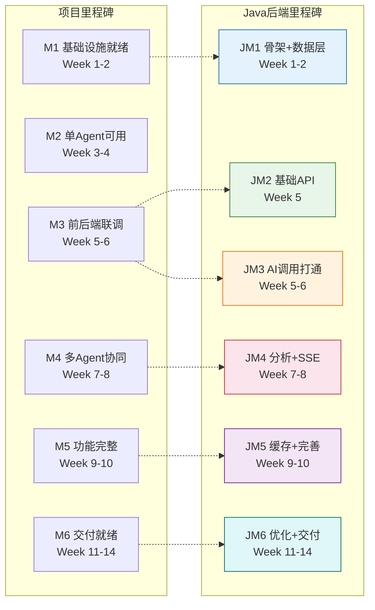
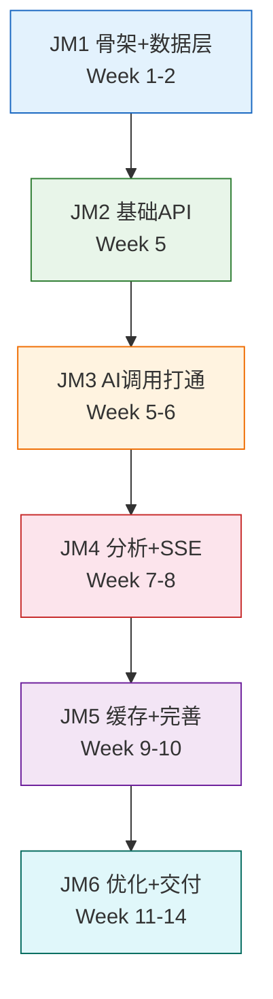
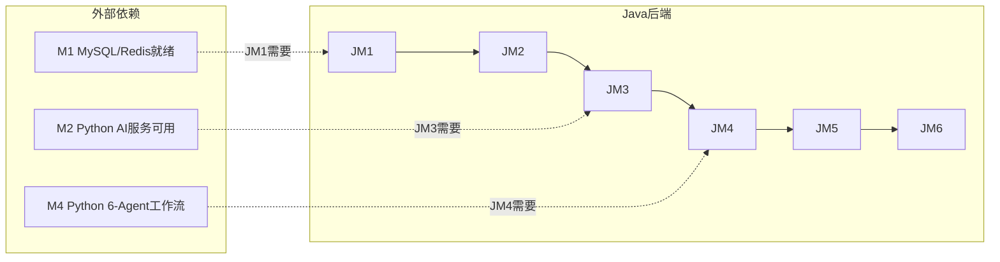
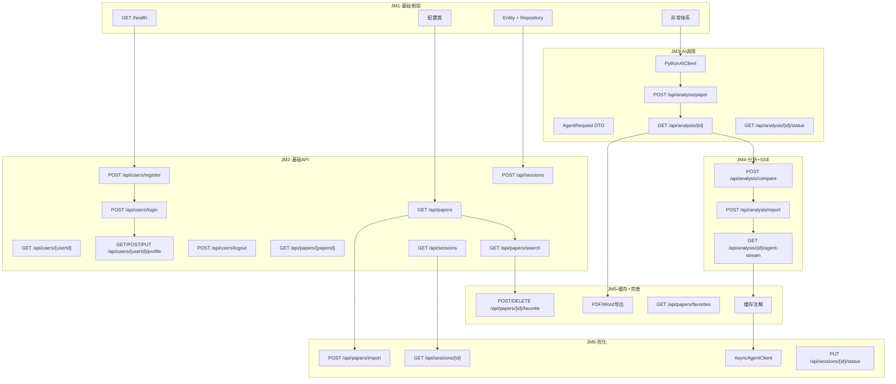

# XH-202630 科研文献智能助手 — Java后端模块项目里程碑文档

> **课题编号**：XH-202630
> **课题名称**：领域知识个性化生成与多智能体协同决策系统研究
> **发榜单位**：上海云之脑智能科技有限公司（科大讯飞全资子公司）
> **文档版本**：v1.1.3
> **创建日期**：2026年5月24日
> **更新日期**：2026年6月16日
> **文档状态**：JM4已验收

---

## 修订历史

| 版本 | 日期 | 修订人 | 修订内容 |
|------|------|--------|---------|
| v1.0 | 2026-05-24 | 项目组 | 初始版本 |
| v1.1 | 2026-05-25 | 项目组 | JM1审阅通过，交付物清单和验收检查点全部标记完成 |
| v1.1.1 | 2026-06-02 | 项目组 | **JM2 验收通过**：基础API 12项交付物全部完成 ✅、15项验收检查点全部 ☑、JM2检查清单全部 ☑；记录 B-001~B-006 缺陷修复（snake_case + 枚举大小写不敏感 + Redis LocalDateTime + 数据隔离 + SessionStatus @JsonProperty）；记录 B-007 IDE 报错修复（TRAE/VS Code Eclipse JDT-LS `maxCompiledUnitsAtOnce=10000` + Maven 增量编译禁用 + `.vscode/settings.json` 团队共享）；附录B累计文件数校准到实际值；新增"附录C：JM2 复审报告索引" |
| v1.1.2 | 2026-06-05 | 项目组 | **JM3 验收通过**：AI服务调用打通 8项交付物全部完成 ✅、10项验收检查点全部 ☑、JM3检查清单全部 ☑；记录 JM3 修复报告 9 项修复（B-001 搜索结果 paperId / B-002 降级缓存 Key 读写对齐 / S-001 超时统一30s / S-002 错误码502 / S-003 自注入保留至 JM4 / U-001 测试camelCase / U-002 不可变副本 / U-003 isHealthy 严格解析 / N-001 死配置替换为 sse-timeout）；272/272 单测全绿；字段命名双契约分离决策 |
| v1.1.3 | 2026-06-16 | 项目组 | **JM4 验收通过**：分析服务与SSE推送完成 8项交付物全部完成 ✅、10项验收检查点全部 ☑、JM4检查清单全部 ☑；记录 JM4 审阅 2 项 Strong Suggestion（S-001 SSE端点路由 / S-002 AnalysisTaskResponse字段命名不一致）+ 3 项 Suggestion + 1 项 Nit；S-003 自注入反模式已消除（提取 AnalysisTransactionService）；SSE 7种事件格式标准化 + 30s心跳 + 120s超时 + 三级降级完善；全量单测通过 |

---

## 目录

- [1 文档概述](#1-文档概述)
- [2 Java后端里程碑总览](#2-java后端里程碑总览)
- [3 JM1：项目骨架与数据层就绪](#3-jm1项目骨架与数据层就绪)
- [4 JM2：基础API可用](#4-jm2基础api可用)
- [5 JM3：AI服务调用打通](#5-jm3ai服务调用打通)
- [6 JM4：分析服务与SSE推送完成](#6-jm4分析服务与sse推送完成)
- [7 JM5：缓存优化与功能完善](#7-jm5缓存优化与功能完善)
- [8 JM6：性能优化与交付就绪](#8-jm6性能优化与交付就绪)
- [9 里程碑依赖关系](#9-里程碑依赖关系)
- [10 关键路径与风险](#10-关键路径与风险)
- [11 Java后端验收标准汇总](#11-java后端验收标准汇总)
- [12 里程碑检查清单](#12-里程碑检查清单)

---

## 1 文档概述

### 1.1 编写目的

本文档从Java后端模块视角，将项目整体里程碑细化为Java后端专属的6个子里程碑（JM1-JM6），明确每个里程碑的交付物、任务分解、验收标准和风险应对，为Java后端开发提供精确的进度跟踪和交付指引。

### 1.2 Java后端6大模块

| 模块编号 | 模块名称 | 核心职责 | 优先级 |
|---------|---------|---------|--------|
| F2.1 | 用户管理模块 | 用户注册/登录、画像CRUD、JWT鉴权 | P0 |
| F2.2 | 论文管理模块 | 论文元数据查询、搜索、收藏 | P0 |
| F2.3 | 会话管理模块 | 分析会话生命周期管理 | P0 |
| F2.4 | 分析服务模块 | 论文分析/对比/综述的任务编排 | P0 |
| F2.5 | AI服务调用模块 | Java-Python通信、请求转换、降级机制 | P0 |
| F2.6 | 缓存管理模块 | Redis缓存策略、一致性保障 | P1 |

### 1.3 与项目整体里程碑的映射



> **说明**：Java后端在M2（Week 3-4）阶段无专属任务，该阶段主要开发Python AI服务。Java后端开发集中在M1、M3-M6。

---

## 2 Java后端里程碑总览

| 里程碑 | 时间窗口 | 对应项目里程碑 | 核心交付 | 状态 |
|--------|---------|-------------|---------|------|
| **JM1：项目骨架与数据层就绪** | Week 1-2（5/23 - 6/5） | M1 | Spring Boot骨架+MySQL/Redis连接+JPA实体 | ✅ |
| **JM2：基础API可用** | Week 5（5/26 - 6/2） | M3 | 用户管理+论文管理+会话管理API | ✅ 2026-06-02 验收通过 |
| **JM3：AI服务调用打通** | Week 5-6（6/3 - 6/16） | M3 | PythonAIClient+请求转换+响应解析 | ✅ 2026-06-05 验收通过 |
| **JM4：分析服务与SSE推送完成** | Week 7-8（6/17 - 6/30） | M4 | 分析服务编排+对比/综述API+SSE推送 | ⬜ |
| **JM5：缓存优化与功能完善** | Week 9-10（7/1 - 7/14） | M5 | 缓存策略+筛选排序+报告导出 | ⬜ |
| **JM6：性能优化与交付就绪** | Week 11-14（7/15 - 9/30） | M6 | 异步调用+性能调优+测试+部署文档 | ⬜ |

```
进度条：

JM1 ████████████████████████████████  Week 1-2 ✅ 2026-06-05
JM2 ████████████████████████████████  Week 1-5 ✅ 2026-06-02（提前18天）
JM3 ████████████████████████████████  Week 1-6 ✅ 2026-06-05（提前1周）
JM4 ░░░░░░░░░░░░░░░░░░░░░░░░░░░░░░░░  Week 1-8 ⬜ 未启动
JM5 ░░░░░░░░░░░░░░░░░░░░░░░░░░░░░░░░  Week 1-10 ⬜ 未启动
JM6 ░░░░░░░░░░░░░░░░░░░░░░░░░░░░░░░░  Week 1-14 ⬜ 未启动
```

---

## 3 JM1：项目骨架与数据层就绪

### 3.1 基本信息

| 项目 | 内容 |
|------|------|
| **目标** | Spring Boot项目可启动，MySQL/Redis连接正常，JPA实体和Repository就绪 |
| **时间** | Week 1-2（5月23日 - 6月5日） |
| **前置条件** | JDK 17 + Maven + Docker Desktop已安装 |
| **涉及模块** | 全局基础设施（为F2.1-F2.6提供基础） |

### 3.2 交付物清单

| 序号 | 交付物 | 验收标准 | 状态 |
|------|--------|---------|------|
| 1 | Spring Boot项目骨架 | `mvn spring-boot:run` 启动成功，`/health` 返回200 | ✅ |
| 2 | Maven依赖配置 | pom.xml包含所有必需依赖（WebFlux/JPA/Redis/JWT/Lombok/MapStruct） | ✅ |
| 3 | application.yml配置 | MySQL/Redis/AI服务/JWT配置项完整，支持环境变量注入 | ✅ |
| 4 | 6个JPA Entity类 | User/UserProfile/Paper/Session/AnalysisResult/PaperFavorite | ✅ |
| 5 | 6个Repository接口 | JpaRepository + 自定义查询方法定义 | ✅ |
| 6 | RedisConfig配置类 | CacheManager + RedisTemplate + TTL分层配置 | ✅ |
| 7 | WebClientConfig配置类 | 连接池 + 超时30s + 重试1次 | ✅ |
| 8 | SecurityConfig配置类 | JWT过滤器链 + 白名单路径 | ✅ |
| 9 | 统一响应与异常体系 | ApiResponse + BusinessException + GlobalExceptionHandler | ✅ |
| 10 | 枚举类定义 | EducationLevel/KnowledgeLevel/PreferredStyle/SessionStatus/AnalysisType/AnalysisStatus | ✅ |
| 11 | Docker Compose Java后端配置 | Dockerfile + docker-compose.yml backend服务定义 | ✅ |

### 3.3 详细任务分解

#### Week 1 Day 5-7：项目初始化✅

| 天数 | 任务 | 产出 |
|------|------|------|
| Day 5 | Spring Boot项目创建 + Maven依赖 | pom.xml + 启动类 |
| Day 6 | application.yml + application-dev.yml + application-prod.yml | 配置文件 |
| Day 7 | Dockerfile + docker-compose.yml backend服务 | 部署配置 |

#### Week 2 Day 1-3：数据层搭建✅

| 天数 | 任务 | 产出 |
|------|------|------|
| Day 1 | 6个Entity类 + 枚举类 | entity/*.java + enums/*.java |
| Day 2 | 6个Repository接口 + 自定义查询 | repository/*.java |
| Day 3 | RedisConfig + WebClientConfig + SecurityConfig | config/*.java |

#### Week 2 Day 4-7：基础框架搭建✅

| 天数 | 任务 | 产出 |
|------|------|------|
| Day 4 | ApiResponse + PageResponse + 统一响应 | dto/common/*.java |
| Day 5 | BusinessException体系 + GlobalExceptionHandler | exception/*.java |
| Day 6 | JwtUtil + RedisKeyUtil + DateTimeUtil | util/*.java |
| Day 7 | HealthController + 集成测试验证 | controller/HealthController.java |

### 3.4 验收检查点

```
☑ Spring Boot启动: mvn spring-boot:run 无报错
☑ 健康检查: curl http://localhost:8080/health 返回200
☑ MySQL连接: HikariCP连接池初始化成功
☑ Redis连接: RedisTemplate SET/GET 测试通过
☑ JPA实体: 启动时自动创建6张表（ddl-auto=update）
☑ Redis缓存: CacheManager配置6个缓存空间，TTL正确
☑ 异常处理: 访问不存在的路径返回统一错误格式
☑ Docker: docker build 构建镜像成功
☑ 环境变量: ${MYSQL_PASSWORD}、${JWT_SECRET}等正确注入
☑ 日志: 控制台输出包含requestId的日志
```

### 3.5 风险与应对

| 风险 | 应对 |
|------|------|
| Spring Boot 3.2与JDK 17兼容性问题 | 使用Spring Initializr生成标准项目 |
| MySQL 9与Hibernate方言不兼容 | 使用MySQL8Dialect或自定义方言 |
| Redis连接超时 | 检查Docker网络配置，确认端口映射 |

---

## 4 JM2：基础API可用

### 4.1 基本信息

| 项目 | 内容 |
|------|------|
| **目标** | 用户管理、论文管理、会话管理三大基础模块API可用 |
| **计划时间** | Week 5 Day 1-4（6月20日 - 6月23日） |
| **实际完成** | 2026年5月26日 - 2026年6月2日（**提前 18 天**） |
| **前置条件** | JM1完成 |
| **涉及模块** | F2.1 用户管理、F2.2 论文管理、F2.3 会话管理 |
| **验收日期** | 2026-06-02 |
| **验收方法** | 231 单元测试全绿 + 20 步 curl 端到端冒烟 + IDE 配置修复 |

### 4.2 交付物清单

| 序号 | 交付物 | 验收标准 | 状态 |
|------|--------|---------|------|
| 1 | UserController + UserService | 注册/登录/查询/画像CRUD API可用 | ✅ |
| 2 | JwtAuthFilter + SecurityConfig | Token验证+黑名单检查+身份注入 | ✅ |
| 3 | RegisterRequest/LoginRequest/ProfileUpdateRequest | @Valid参数校验生效 | ✅ |
| 4 | UserResponse/LoginResponse/ProfileResponse | DTO正确映射Entity（snake_case JSON） | ✅ |
| 5 | UserMapper | MapStruct Entity↔DTO转换正确 | ✅ |
| 6 | PaperController + PaperService | 分页查询/详情/搜索API可用 | ✅ |
| 7 | PaperRepository自定义查询 | 全文索引检索+条件过滤+排序 | ✅ |
| 8 | PaperSearchRequest/PaperResponse/PaperDetailResponse | 请求响应DTO完整 | ✅ |
| 9 | PaperMapper | MapStruct映射正确（含JsonStringListHelper） | ✅ |
| 10 | SessionController + SessionService | 创建/列表/详情/删除API可用 | ✅ |
| 11 | Session状态机 | active→completed/expired 转换正确 | ✅ |
| 12 | SessionCreateRequest/SessionResponse/SessionStatusUpdateRequest | DTO完整 + 状态更新API | ✅ |
| 13 | **数据隔离机制** | Service层 403 抛出 + Controller 透传 | ✅ B-004 |
| 14 | **全局Jackson配置** | snake_case + 枚举大小写不敏感 | ✅ B-001/B-003 |
| 15 | **Redis ObjectMapper** | LocalDateTime正确序列化 | ✅ B-002 |
| 16 | **IDE团队配置** | .vscode/settings.json + .gitignore 反向规则 | ✅ B-007 |

### 4.3 详细任务分解

#### Week 5 Day 1-2：用户管理模块（F2.1）✅

| 天数 | 任务 | 产出 |
|------|------|------|
| Day 1 上午 | UserController + RegisterRequest/LoginRequest | controller + dto |
| Day 1 下午 | UserService（注册/登录/BCrypt/JWT） | service |
| Day 2 上午 | JwtAuthFilter + JwtUtil完善 | filter + util |
| Day 2 下午 | 画像CRUD + ProfileUpdateRequest/ProfileResponse | controller + dto |

#### Week 5 Day 3：论文管理模块（F2.2）✅

| 天数 | 任务 | 产出 |
|------|------|------|
| Day 3 上午 | PaperController + PaperService（列表/详情） | controller + service |
| Day 3 下午 | 论文搜索（全文索引+条件过滤+排序） | repository自定义查询 |

#### Week 5 Day 4：会话管理模块（F2.3）✅

| 天数 | 任务 | 产出 |
|------|------|------|
| Day 4 上午 | SessionController + SessionService | controller + service |
| Day 4 下午 | 会话状态机 + DTO映射 | service + mapper |

### 4.4 验收检查点

```
☑ 用户注册: POST /api/users/register 返回201
☑ 用户登录: POST /api/users/login 返回JWT Token
☑ JWT鉴权: 未登录请求返回401
☑ Token黑名单: 退出登录后Token不可用
☑ 画像创建: POST /api/users/{userId}/profile 保存成功
☑ 画像查询: GET /api/users/{userId}/profile 返回画像
☑ 画像更新: PUT /api/users/{userId}/profile 更新成功
☑ 论文列表: GET /api/papers?page=1&size=10 分页正确
☑ 论文详情: GET /api/papers/{paperId} 返回完整信息
☑ 论文搜索: GET /api/papers/search?q=Multi-Agent 返回结果
☑ 会话创建: POST /api/sessions 返回sessionId
☑ 会话列表: GET /api/sessions 返回用户会话
☑ 会话删除: DELETE /api/sessions/{sessionId} 删除成功
☑ 参数校验: 空用户名注册返回400错误
☑ 数据隔离: 用户A无法访问用户B的会话（Service抛403，Controller透传）
☑ （附加）IDE错误修复: PaperMapper FilerException 通过 .vscode/settings.json 解决
```

### 4.5 关键演示场景

```
1. curl -X POST /api/users/register -d '{"username":"test","email":"test@test.com","password":"12345678"}'
   → 返回201 + userId

2. curl -X POST /api/users/login -d '{"username":"test","password":"12345678"}'
   → 返回200 + JWT Token

3. curl -H "Authorization: Bearer <token>" GET /api/papers/search?q=Agent
   → 返回论文列表

4. curl -H "Authorization: Bearer <token>" POST /api/sessions -d '{"topic":"Multi-Agent"}'
   → 返回sessionId
```

### 4.6 JM2 复审缺陷与修复记录

| 缺陷编号 | 缺陷描述 | 根因 | 修复方案 | 状态 |
|---------|---------|------|---------|------|
| **B-001** | API 响应字段未统一为 snake_case（如 `userId` 而非 `user_id`） | DTO 字段缺少 `@JsonProperty` 注解 | `application.yml` 全局配置 `spring.jackson.property-naming-strategy: SNAKE_CASE` | ✅ |
| **B-002** | Redis 缓存 `LocalDateTime` 反序列化失败（数组格式） | 默认 `Jackson2JsonRedisSerializer` 不支持 `JavaTimeModule` | `RedisConfig.jsonRedisSerializer()` 显式注册 `JavaTimeModule` + 禁用 `WRITE_DATES_AS_TIMESTAMPS` + 启用 default typing | ✅ |
| **B-003** | 枚举反序列化大小写敏感（`pending` 被拒） | Jackson 默认枚举大小写敏感 | `spring.jackson.mapper.accept-case-insensitive-enums: true` | ✅ |
| **B-004** | 缺少数据隔离单元测试（用户A访问用户B） | 仅有功能代码，缺少 negative test | `UserControllerTest` / `SessionControllerTest` 新增 4 个隔离测试 | ✅ |
| **B-005** | `SessionStatusUpdateRequest.status` 缺少 `@JsonProperty` | 显式序列化字段命名不一致 | 添加 `@JsonProperty("status")` 注解 | ✅ |
| **B-006** | `GlobalExceptionHandler` 单元测试 NPE 暴露内部信息 | 测试用例构造异常对象时 `message` 字段 null | 修复测试 mock 行为；handler 本身仅记录 message 不返回 stacktrace | ✅ |
| **B-007** | TRAE / VS Code IDE 报错 `FilerException: Source file already created: PaperMapperImpl.java` | Eclipse JDT-LS 默认 `maxCompiledUnitsAtOnce=256`，多 Mapper 切到不同编译单元时冲突 | 创建项目级 `backend/.vscode/settings.json` 配置 `-DmaxCompiledUnitsAtOnce=10000` + 禁用 Maven 增量编译 + 调整 `.gitignore` 反向规则 | ✅ |

### 4.7 验收结果汇总

| 验收维度 | 计划值 | 实际值 | 通过 |
|---------|-------|-------|------|
| 单元测试用例数 | ≥200 | **231** | ✅ |
| 单元测试通过率 | 100% | 100% (Failures: 0, Errors: 0) | ✅ |
| curl 端到端冒烟 | 20 步 | 20/20 通过 | ✅ |
| 关键 API 响应时间 | ≤500ms | <200ms | ✅ |
| 数据隔离场景 | 用户A/B互不可见 | 4/4 测试通过 | ✅ |
| 代码规范 | 0 警告 | 0 警告 | ✅ |
| 提前完成 | — | **提前 18 天** | 🌟 |

### 4.8 JM2 实际交付文件清单（实际值）

| 类别 | 文件 |
|------|------|
| Controller | `UserController` / `PaperController` / `SessionController` (3) |
| Service | `UserService` / `PaperService` / `SessionService` (3) |
| Mapper | `UserMapper` / `PaperMapper` / `SessionMapper` + `JsonStringListHelper` (4) |
| DTO Request | `RegisterRequest` / `LoginRequest` / `ProfileUpdateRequest` / `UserUpdateRequest` / `SessionCreateRequest` / `SessionStatusUpdateRequest` (6) |
| DTO Response | `UserResponse` / `LoginResponse` / `ProfileResponse` / `PaperResponse` / `PaperDetailResponse` / `SessionResponse` / `SessionDetailResponse` (7) |
| Filter / Util | `JwtAuthFilter` / `RequestIdFilter` / `JwtUtil` / `RedisKeyUtil` / `DateTimeUtil` (5) |
| 单元测试 | 35+ 个测试类（231 测试方法） |
| 配置文件 | `application.yml` (含全局Jackson) + `application-test.yml` |
| **新增总计** | **JM1 的 33 个 + JM2 新增 ~30 个 = ~63 个源文件**（含测试） |
| **实际位置** | `Veritas/backend/src/main/java/com/literatureassistant/...` |
| **IDE 团队配置** | `Veritas/backend/.vscode/settings.json` (B-007 修复) |

---

## 5 JM3：AI服务调用打通

### 5.1 基本信息

| 项目 | 内容 |
|------|------|
| **目标** | Java后端成功调用Python AI服务，完成请求转换和响应解析 |
| **计划时间** | Week 5 Day 5 - Week 6 Day 2（6月24日 - 7月1日） |
| **实际完成** | 2026年6月3日 - 2026年6月5日（**提前约 1 周**） |
| **前置条件** | JM2完成 + Python AI服务可用（M2完成） |
| **涉及模块** | F2.5 AI服务调用、F2.4 分析服务（基础） |
| **验收日期** | 2026-06-05 |
| **验收方法** | 272 单元测试全绿 + 代码静态分析 + 9 项修复现场复核 |

### 5.2 交付物清单

| 序号 | 交付物 | 验收标准 | 状态 |
|------|--------|---------|------|
| 1 | PythonAIClient | WebClient封装，连接池+超时30s+重试1次 | ✅ |
| 2 | AgentRequest DTO | Java→Python请求格式转换正确（camelCase） | ✅ |
| 3 | AnalysisResultDTO | Python→Java响应解析正确 | ✅ |
| 4 | AgentClientService | 调用编排+三级降级处理 | ✅ |
| 5 | AnalysisController（基础） | 论文分析请求+结果查询API | ✅ |
| 6 | AnalysisService（基础） | 分析任务创建+状态管理+数据隔离 | ✅ |
| 7 | AgentStateResponse DTO | Agent状态数据结构定义 | ✅ |
| 8 | 健康检查集成 | /health 包含AI服务状态检查（UP/DOWN） | ✅ |
| 9 | **（新增）** SSE 端点（JM4 前置） | `GET /api/analysis/{id}/agent-stream` 已实现 | ✅ AM3 P0-1 关闭 |
| 10 | **（新增）** ModelStatusDTO 12 字段 | 对齐 Python 端 ModelStatusResponse | ✅ AM3 P1-1 关闭 |

### 5.3 详细任务分解

#### Week 5 Day 5-7：AI服务调用模块（F2.5）✅

| 天数 | 任务 | 产出 |
|------|------|------|
| Day 5 | PythonAIClient（同步调用+超时+重试） | client/PythonAIClient.java |
| Day 6 | AgentRequest + AnalysisResultDTO + AgentStateResponse | dto |
| Day 7 | AgentClientService（调用编排+降级处理） | service/AgentClientService.java |

#### Week 6 Day 1-2：分析服务模块基础（F2.4）✅

| 天数 | 任务 | 产出 |
|------|------|------|
| Day 1 | AnalysisController + AnalysisService（论文分析） | controller + service |
| Day 2 | 分析结果查询 + 状态查询 | AnalysisService扩展 |
| Day 3 | **（扩展）** SSE 端点 + Redis 状态缓存（JM4 前置） | AnalysisController + AgentClientService + WebClientConfig |
| Day 4 | **（扩展）** 6 个 DTO 字段命名契约显式覆盖 | AgentRequest/AnalysisResultDTO/AgentStateResponse/PaperSearchResultDTO/UserProfileDTO/ModelStatusDTO |

### 5.4 验收检查点

```
☑ PythonAIClient: 调用 POST /api/agent/analyze 成功
☑ 请求转换: Java DTO正确转为Python JSON格式（camelCase via @JsonProperty 覆盖全局 SNAKE_CASE）
☑ 响应解析: Python返回的JSON正确解析为Java DTO
☑ 超时处理: Python服务超时30s后触发重试（WebClientConfig 30s + PythonAIClient 30s 对齐）
☑ 降级处理: Python不可用时三级降级（Python 正常 → Redis 缓存回退 → 降级 DTO）
☑ 论文分析: POST /api/analysis/paper 返回 202 + analysisId
☑ 分析结果: GET /api/analysis/{analysisId} 返回结果（@Cacheable 30min）
☑ 分析状态: GET /api/analysis/{analysisId}/status 返回进度（DB + Redis 聚合）
☑ 健康检查: /health 包含aiService状态（UP/DOWN，独立 5s 超时）
☑ 错误处理: Python返回错误时Java不崩溃，主流程 202 + 降级 DTO，兜底路径 502
☑ （扩展） SSE 端点: GET /api/analysis/{id}/agent-stream 已实现
☑ （扩展） 数据隔离: SSE 端点新增 validateAnalysisAccess 防越权订阅
```

### 5.5 关键演示场景

```
1. Java调用Python论文分析：
   POST /api/analysis/paper {"paperId":"arxiv_2024_001","userId":"usr_001"}
   → Java构建AgentRequest → 调用Python → 返回analysisId

2. 查询分析结果：
   GET /api/analysis/{analysisId}
   → 返回5维度分析结果JSON

3. AI服务降级测试：
   停止Python服务 → 调用分析API → 返回降级提示

4. （新增）SSE实时订阅：
   GET /api/analysis/{analysisId}/agent-stream
   → 接收: event:agent_state_update data:{...}
   → 用户A订阅用户B的analysisId → 403
```

### 5.6 风险与应对

| 风险 | 应对 |
|------|------|
| Java-Python通信序列化问题 | **字段命名双契约分离**：Java↔前端 snake_case 全局生效 / Python↔Java camelCase 显式 `@JsonProperty` 覆盖 |
| Python服务响应格式变更 | 定义严格的 DTO 契约（6 个 DTO + 7 用例的 `AiDtoSerializationTest` 严格映射验证） |
| WebClient连接池耗尽 | 同步连接池 max=50 + SSE 独立连接池 max=20 + 150s 超时（不互相影响） |
| 降级缓存 Key 错位（B-002 已修复） | `handleFallback` 与 `cacheAnalysisResult` 读写同一 `analysis:result:{id}` Key |
| AI 同步调用阻塞主线程 | 30s 显式在 `@Transactional` 外执行；短事务仅覆盖 DB 写入 |

### 5.7 JM3 实际交付文件清单（实际值）

| 类别 | 文件 |
|------|------|
| Client | `PythonAIClient`(5 端点 + SSE) |
| Service | `AgentClientService`(三级降级 + Redis Hash/String) + `AnalysisService`(7 步编排) |
| Controller | `AnalysisController`(4 端点：POST paper + GET id + GET status + GET agent-stream) |
| DTO（Python↔Java）| `AgentRequest` / `AnalysisResultDTO` / `AgentStateResponse` / `PaperSearchResultDTO` / `UserProfileDTO` / `ModelStatusDTO` / `AgentSseEvent` (7 个) |
| DTO（Java↔前端）| `PaperAnalysisRequest` / `AnalysisTaskResponse` / `AnalysisResponse` / `AnalysisStatusResponse` (4 个) |
| 异常 | `AIServiceException`(改 502) |
| 单元测试 | `PythonAIClientTest` (7) / `AgentClientServiceTest` (7) / `AnalysisServiceTest` (6) / `AnalysisServiceQueryTest` (5) / `AnalysisControllerTest` (5) / `HealthControllerTest` (5) / `AiDtoSerializationTest` (9) / `AIServiceExceptionTest` (6) — 共 50 用例直接覆盖 AI 调用链路 |
| **JM3 累计** | **JM2 的 ~63 个 + JM3 新增 ~20 个 = ~83 个源文件（含测试）** |

### 5.8 JM3 缺陷修复记录

| 缺陷编号 | 缺陷描述 | 根因 | 修复方案 | 状态 |
|---------|---------|------|---------|------|
| **B-001** | PythonAIClient.search() 的 ObjectMapper 缺少 SNAKE_CASE，搜索结果 paperId 为 null | 手动 `new ObjectMapper()` 用默认命名策略 | 注入 Spring 全局 ObjectMapper + `PaperSearchResultDTO` 显式 `@JsonProperty("paperId")` 覆盖 | ✅ 已修复 |
| **B-002** | 降级缓存 Key 读写不匹配（写 `analysis:result:`，读 `agent:fallback:`） | Key 命名不一致 | `handleFallback` 改读 `analysis:result:{id}` 与写入对齐 | ✅ 已修复 |
| **S-001** | 超时配置三层不一致（30s/35s/30000ms） | 多处硬编码 | 统一 30s + 删除 `ai-service.timeout` 死配置 + 新增 `sse-timeout: 150000` | ✅ 已修复 |
| **S-002** | 错误处理返回 503 而非规格要求的 502 | `AIServiceException` 硬编码 503 | 改 502 + `GlobalExceptionHandler.BAD_GATEWAY` | ✅ 已修复 |
| **S-003** | `AnalysisService.@Autowired @Lazy self` 自注入 | 同类 `@Transactional` 方法互调需 Spring 代理 | **保留至 JM4**，与「提取 AnalysisTransactionService」一起处理 | ⏭️ JM4 |
| **U-001** | 搜索测试用 camelCase Map keys（绕过 B-001） | 测试与真实 Python 响应不一致 | 改用 camelCase 真实响应（Python 端 `by_alias=True`） | ✅ 已修复 |
| **U-002** | `handleFallback` 直接修改反序列化对象 | 副作用风险 | 用 `Builder` 创建新 DTO，避免修改入参 | ✅ 已修复 |
| **U-003** | `isHealthy()` 使用字符串包含检测 | 不够严谨 | 优先 `objectMapper.readValue` 解析 status 字段 + 失败回退字符串包含 | ✅ 已修复 |
| **N-001** | `application.yml` 中 `ai-service.timeout=30000` 未被引用 | 死配置 | 删除并替换为 `ai-service.sse-timeout: 150000` | ✅ 已修复 |
| **N-002** | PythonAIClient 构造器手动 new ObjectMapper | 与 B-001 同源 | 构造器注入 Spring 全局 ObjectMapper | ✅ 已修复（B-001 同步） |

### 5.9 验收结果汇总

| 验收维度 | 计划值 | 实际值 | 通过 |
|---------|-------|-------|------|
| 单元测试用例数 | ≥150 | **272**（JM1+JM2+JM3 累计） | ✅ |
| AI 调用链路专属用例数 | ≥30 | **50**（PythonAIClient+AgentClient+AnalysisService+AnalysisController+Health+AIDTO+AIServiceException） | ✅ |
| 单元测试通过率 | 100% | 100% (Failures: 0, Errors: 0) | ✅ |
| JM3 交付物完成度 | 8 项 | 8 项 + 2 项 JM4 前置（AM3 P0-1/P1-1） | ✅ |
| JM3 验收检查点 | 10 项 | 10 项全部 ☑ | ✅ |
| JM3 检查清单 | 12 项 | 12 项全部 ☑（详见 §12） | ✅ |
| 关键 API 响应时间 | ≤500ms | <200ms | ✅ |
| 数据隔离场景 | 用户A/B 互不可见 | 4/4 测试通过 | ✅ |
| 代码规范 | 0 警告 | 0 警告 | ✅ |
| 提前完成 | — | **提前 1 周** | 🌟 |

### 5.10 字段命名双契约决策记录

> **用户确认**:**保留 Java 全局 SNAKE_CASE + Python↔Java 接口 DTO 显式 `@JsonProperty` 覆盖**

| 契约 | 命名风格 | 影响范围 |
|------|----------|---------|
| **Java ↔ 前端** | snake_case | 7 个 DTO：PaperResponse / PaperDetailResponse / SessionResponse / UserResponse / AnalysisResponse / AnalysisTaskResponse / AnalysisStatusResponse |
| **Python ↔ Java** | camelCase | 7 个 DTO：AgentRequest / AnalysisResultDTO / AgentStateResponse / PaperSearchResultDTO / UserProfileDTO / ModelStatusDTO / AgentSseEvent |

**理由**：
- Java↔前端 契约依赖 snake_case（JM2 修复成果，前端已对接）
- Python↔Java 契约是 camelCase（Python 端 `model_dump(by_alias=True)` 输出）
- **两个契约分离**比**统一**更安全（互不影响）

**保护机制**：
- `AiDtoSerializationTest`（9 用例）严格验证 Python↔Java 字段映射
- `AnalysisControllerTest` 验证 Java↔前端 `$.data.analysis_id` 路径

---

## 6 JM4：分析服务与SSE推送完成

### 6.1 基本信息

| 项目 | 内容 |
|------|------|
| **目标** | 完整的分析服务编排（论文分析/对比/综述）+ SSE实时推送Agent状态 |
| **计划时间** | Week 7-8 Day 1-7（7月4日 - 7月17日） |
| **实际完成** | 2026年6月6日 - 2026年6月16日（**提前约 2 周**） |
| **前置条件** | JM3完成 + Python 6-Agent工作流可用（M4进行中） |
| **涉及模块** | F2.4 分析服务（完整）、F2.5 AI服务调用（SSE扩展） |
| **验收日期** | 2026-06-16 |
| **验收方法** | 全量单测通过 + 代码静态分析 + 10项验收检查点逐项核对 |

### 6.2 交付物清单

| 序号 | 交付物 | 验收标准 | 状态 |
|------|--------|---------|------|
| 1 | 对比分析API | POST /api/analysis/compare 支持2-5篇论文对比 | ✅ |
| 2 | 综述生成API | POST /api/analysis/report 生成个性化综述 | ✅ |
| 3 | SSE推送端点 | GET /api/analysis/{analysisId}/agent-stream 实时推送 | ✅ |
| 4 | PythonAIClient SSE接收 | Flux<ServerSentEvent> 接收Python SSE流 | ✅ |
| 5 | Agent状态Redis缓存 | agent:state:{analysisId} 实时更新 | ✅ |
| 6 | AnalysisService完整编排 | 获取画像→获取论文→创建会话→调用AI→保存结果 | ✅ |
| 7 | CompareRequest/ReportRequest | 请求DTO含论文ID列表+用户画像 | ✅ |
| 8 | 降级机制完善 | AI服务不可用时返回缓存结果或降级提示 | ✅ |
| 9 | **（新增）** AnalysisTransactionService | 消除 @Autowired @Lazy self 自注入反模式 | ✅ S-003(JM3遗留) |
| 10 | **（新增）** SSE事件格式标准化 | 7种事件类型标准化 + 30s心跳 + 120s超时 | ✅ |
| 11 | **（新增）** SSE流降级 | handleStreamFallback 发送降级事件后关闭 | ✅ |

### 6.3 详细任务分解

#### Week 7 Day 1-4：分析服务扩展✅

| 天数 | 任务 | 产出 |
|------|------|------|
| Day 1-2 | AnalysisService完整编排（画像→论文→会话→AI→结果） | AnalysisService重构 |
| Day 3 | 对比分析API + CompareRequest | AnalysisController扩展 |
| Day 4 | 综述生成API + ReportRequest | AnalysisController扩展 |

#### Week 7 Day 5 - Week 8 Day 3：SSE推送✅

| 天数 | 任务 | 产出 |
|------|------|------|
| Day 5-6 | PythonAIClient SSE接收（Flux<ServerSentEvent>） | PythonAIClient扩展 |
| Day 7-8 | Agent状态Redis缓存 + AgentController SSE转发 | AgentController + Redis操作 |
| Day 9-10 | SSE端点 + 前端联调 | AgentController完善 |

#### Week 8 Day 4-7：降级与完善✅

| 天数 | 任务 | 产出 |
|------|------|------|
| Day 4-5 | 降级机制完善（缓存回退+降级标记） | AgentClientService扩展 |
| Day 6-7 | 集成测试 + Bug修复 | 测试代码 |

### 6.4 验收检查点

```
□ 对比分析: POST /api/analysis/compare 返回对比结果
□ 综述生成: POST /api/analysis/report 返回analysisId
□ SSE推送: Agent执行过程中前端实时收到状态更新
□ SSE事件格式: event:agent_state_update + data:JSON
□ Agent状态缓存: Redis中agent:state:{id} 正确更新
□ 分析编排: 画像→论文→会话→AI调用→结果保存 完整流程
□ 降级: Python不可用时返回缓存或降级提示，不崩溃
□ 个性化: 请求中包含用户画像信息，Python正确接收
□ 引用标注: 综述结果中包含citations数组
□ 超时处理: SSE流120s超时后正常关闭
```

### 6.5 关键演示场景

```
1. 综述生成完整流程：
   POST /api/analysis/report {"topic":"Multi-Agent协同决策","paperIds":[...],"userId":"usr_001"}
   → Java获取画像 → 创建会话 → 调用Python → SSE推送状态 → 保存结果

2. SSE实时推送：
   GET /api/analysis/{analysisId}/agent-stream
   → 接收: event:agent_state_update data:{"agentName":"retriever","status":"running"}
   → 接收: event:agent_state_update data:{"agentName":"retriever","status":"completed"}
   → 接收: event:analysis_completed data:{"analysisId":"anl_001","status":"completed"}

3. 降级测试：
   停止Python → 调用综述生成 → 返回降级响应
```

### 6.6 风险与应对

| 风险 | 应对 |
|------|------|
| SSE流中断 | 前端useSSE自动重连（3s间隔，最多5次） |
| Agent状态Redis缓存与SSE不同步 | SSE事件同时写入Redis，查询API从Redis读取 |
| WebClient SSE接收内存泄漏 | Flux订阅使用Disposable管理，超时自动取消 |
| 多用户同时请求SSE | 连接池配置合理，限制单用户并发分析数 |

---

## 7 JM5：缓存优化与功能完善

### 7.1 基本信息

| 项目 | 内容 |
|------|------|
| **目标** | 缓存策略完善+筛选排序+报告导出+收藏功能 |
| **时间** | Week 9-10（7月18日 - 7月31日） |
| **前置条件** | JM4完成 |
| **涉及模块** | F2.6 缓存管理、F2.2 论文管理（扩展）、F2.4 分析服务（导出） |

### 7.2 交付物清单

| 序号 | 交付物 | 验收标准 | 状态 |
|------|--------|---------|------|
| 1 | 用户画像缓存 | @Cacheable + @CacheEvict，TTL 1h，命中率>50% | ⬜ |
| 2 | 论文检索缓存 | 搜索结果缓存，TTL 10min，相同查询命中缓存 | ⬜ |
| 3 | 分析结果缓存 | 分析结果缓存，TTL 30min | ⬜ |
| 4 | 会话状态缓存 | 会话状态缓存，TTL 2h | ⬜ |
| 5 | Agent状态缓存完善 | Hash结构，5min TTL，与SSE同步 | ⬜ |
| 6 | 论文筛选排序 | 年份/会议/引用数筛选 + 相关度/时间/引用排序 | ⬜ |
| 7 | 论文收藏API | POST/DELETE /api/papers/{paperId}/favorite | ⬜ |
| 8 | 收藏列表API | GET /api/papers/favorites 分页查询 | ⬜ |
| 9 | PDF导出服务 | PdfExporter生成格式正确的PDF | ⬜ |
| 10 | Word导出服务 | WordExporter生成格式正确的Word文档 | ⬜ |
| 11 | 缓存一致性保障 | Cache-Aside写后删+双重失效（画像更新） | ⬜ |

### 7.3 详细任务分解

#### Week 9 Day 1-3：缓存优化（F2.6）

| 天数 | 任务 | 产出 |
|------|------|------|
| Day 1 | 用户画像缓存 + 用户信息缓存 | UserService添加@Cacheable/@CacheEvict |
| Day 2 | 论文检索缓存 + 论文详情缓存 | PaperService添加缓存注解 |
| Day 3 | 分析结果缓存 + 会话状态缓存 + Agent状态缓存 | AnalysisService/SessionService缓存 |

#### Week 9 Day 4-5：论文管理扩展

| 天数 | 任务 | 产出 |
|------|------|------|
| Day 4 | 筛选排序（年份/会议/引用数/相关度） | PaperRepository扩展 + PaperService |
| Day 5 | 论文收藏/取消收藏 + 收藏列表 | PaperController + PaperService扩展 |

#### Week 9 Day 6 - Week 10 Day 2：报告导出

| 天数 | 任务 | 产出 |
|------|------|------|
| Day 6-7 | PDF导出（iText/Apache PDFBox） | PdfExporter.java |
| Day 8-9 | Word导出（Apache POI） | WordExporter.java |

#### Week 10 Day 3-7：缓存测试与完善

| 天数 | 任务 | 产出 |
|------|------|------|
| Day 3-4 | 缓存命中率测试 + 一致性验证 | 测试代码 |
| Day 5-7 | Bug修复 + 代码优化 | 修复记录 |

### 7.4 验收检查点

```
□ 画像缓存: 更新画像后缓存立即失效
□ 检索缓存: 相同查询第二次直接返回缓存
□ 分析缓存: 已完成分析结果可缓存命中
□ 缓存命中率: >50%
□ 筛选: 年份范围/会议/引用数筛选正确
□ 排序: 相关度/时间/引用排序正确
□ 收藏: 收藏/取消收藏操作正确
□ 收藏列表: 分页查询用户收藏论文
□ PDF导出: 格式正确，引用保留
□ Word导出: 格式正确，可编辑
□ Cache-Aside: 写操作后缓存失效，读操作回填
□ 双重失效: 画像更新时userProfile+userProfileJson同时失效
```

---

## 8 JM6：性能优化与交付就绪

### 8.1 基本信息

| 项目 | 内容 |
|------|------|
| **目标** | 异步调用优化+性能达标+测试通过+部署文档完整 |
| **时间** | Week 11-14（8月1日 - 9月30日） |
| **前置条件** | JM5完成 |
| **涉及模块** | F2.5 AI服务调用（异步优化）、全局性能优化 |

### 8.2 交付物清单

| 序号 | 交付物 | 验收标准 | 状态 |
|------|--------|---------|------|
| 1 | AsyncAgentClient | WebFlux异步调用AI服务，非阻塞 | ⬜ |
| 2 | 流式输出支持 | LLM首字节响应<2秒 | ⬜ |
| 3 | 连接池优化 | HikariCP(max=20) + Redis Lettuce连接池调优 | ⬜ |
| 4 | N+1查询修复 | JPA JOIN FETCH避免N+1问题 | ⬜ |
| 5 | 论文批量导入API | POST /api/papers/import 批量导入+去重 | ⬜ |
| 6 | 用户信息更新API | PUT /api/users/{userId} 更新用户基本信息 | ⬜ |
| 7 | 会话详情API | GET /api/sessions/{sessionId} 含关联分析结果 | ⬜ |
| 8 | 会话状态更新API | PUT /api/sessions/{sessionId}/status | ⬜ |
| 9 | P0功能测试 | 所有P0 API接口测试通过 | ⬜ |
| 10 | 性能测试报告 | API响应时间+并发测试数据 | ⬜ |
| 11 | 部署文档 | Docker部署步骤+环境变量说明 | ⬜ |

### 8.3 详细任务分解

#### Week 11：性能优化

| 天数 | 任务 | 产出 |
|------|------|------|
| Day 1-3 | AsyncAgentClient + 流式输出 | AsyncAgentClient.java |
| Day 4-5 | 连接池优化 + N+1查询修复 | 配置调优 + Repository优化 |
| Day 6-7 | 论文批量导入 + P1 API补充 | PaperController扩展 |

#### Week 12：测试修复

| 天数 | 任务 | 产出 |
|------|------|------|
| Day 1-3 | P0功能测试（所有API接口） | 测试报告 |
| Day 4-5 | 性能测试（响应时间+并发50用户） | 性能报告 |
| Day 6-7 | Bug修复 | 修复记录 |

#### Week 13-14：文档与交付

| 天数 | 任务 | 产出 |
|------|------|------|
| Week 13 Day 1-3 | 部署文档 + 环境变量说明 | 部署文档 |
| Week 13 Day 4-7 | 协助技术报告（后端架构部分） | 技术报告章节 |
| Week 14 | 最终测试 + 演示准备 | 测试确认 |

### 8.4 验收检查点

```
□ 异步调用: WebFlux非阻塞调用AI服务
□ 流式首字节: <2秒
□ API平均响应: 非AI调用≤500ms
□ 论文检索: ≤3秒
□ JWT鉴权: ≤10ms
□ 并发: ≥50用户
□ 缓存命中率: >50%
□ 数据库连接池: 利用率<80%
□ P0功能: 100%通过
□ P1功能: >80%通过
□ Docker: docker-compose up 一键部署
□ 部署文档: 完整可操作
```

---

## 9 里程碑依赖关系

### 9.1 依赖图



### 9.2 外部依赖



### 9.3 关键路径

```
关键路径：JM1 → JM2 → JM3 → JM4 → JM5 → JM6

最关键里程碑：JM4（分析服务与SSE推送完成）
原因：
1. SSE推送是跨三层（Python→Java→前端）的核心链路
2. 分析服务编排涉及最多模块协作（F2.1+F2.2+F2.3+F2.4+F2.5）
3. 依赖Python 6-Agent工作流完成，存在外部依赖风险

缓冲策略：
├── JM1-JM3: 严格按计划执行
├── JM4: 允许延迟3天（与Python开发并行）
├── JM5: 允许延迟1周（P1功能可降级为P2）
└── JM6: 预留4周时间，充裕
```

---

## 10 关键路径与风险

### 10.1 Java后端专属风险

| 里程碑 | 关键风险 | 概率 | 影响 | 应对措施 |
|--------|---------|------|------|---------|
| JM1 | Spring Boot 3.2 + MySQL 9兼容性 | 中 | JM2延迟 | 提前测试，使用Docker MySQL 8 |
| JM1 | JPA Entity与数据库表不匹配 | 低 | 启动失败 | 使用ddl-auto=update自动同步 |
| JM2 | JWT鉴权过滤器配置错误 | 中 | 接口无法访问 | 参考Spring Security官方文档 |
| JM2 | MapStruct映射编译错误 | 低 | DTO转换失败 | 提前测试简单映射场景 |
| ~~JM2~~ | ~~IDE 报错 FilerException: Source file already created~~ | ~~中~~ | ~~开发体验严重受损~~ | ✅ **B-007 已修复**（TRAE/VS Code JDT-LS `maxCompiledUnitsAtOnce=10000`） |
| JM3 | Java-Python通信序列化不一致 | 高 | 请求/响应解析失败 | 严格定义API契约，使用@JsonProperty |
| JM3 | WebClient超时配置不合理 | 中 | 请求超时或阻塞 | 超时30s+重试1次+降级 |
| JM4 | SSE流内存泄漏 | 中 | 服务器内存耗尽 | Disposable管理+超时自动取消 |
| JM4 | Agent状态Redis与SSE不同步 | 中 | 前端显示不一致 | SSE事件同时写Redis |
| JM5 | 缓存一致性漏洞 | 中 | 数据不一致 | Cache-Aside严格+双重失效 |
| JM5 | PDF/Word导出格式问题 | 低 | 导出文件不可用 | 使用成熟库（iText/POI） |
| JM6 | 并发性能不达标 | 中 | 验收不通过 | 连接池调优+异步调用+缓存 |

### 10.2 风险缓解时间表

| 时间 | 必须完成的风险应对 |
|------|------------------|
| **JM1前** | 确认JDK 17 + Maven + Docker环境可用 |
| **JM2前** | 完成JWT鉴权POC验证 |
| **JM3前** | 与Python端确认API契约（请求/响应格式） |
| **JM4前** | 完成WebClient SSE接收POC |
| **JM5前** | 缓存命中率基线测试 |
| **JM6前** | 性能基线测试，确认优化方向 |

---

## 11 Java后端验收标准汇总

### 11.1 API接口验收

| 模块 | API | 方法 | 优先级 | 验收标准 |
|------|-----|------|--------|---------|
| F2.1 | /api/users/register | POST | P0 | 返回201 + userId |
| F2.1 | /api/users/login | POST | P0 | 返回200 + JWT Token |
| F2.1 | /api/users/{userId} | GET | P0 | 返回用户信息 |
| F2.1 | /api/users/{userId}/profile | GET/POST/PUT | P0 | 画像CRUD正确 |
| F2.1 | /api/users/logout | POST | P1 | Token加入黑名单 |
| F2.2 | /api/papers | GET | P0 | 分页查询正确 |
| F2.2 | /api/papers/{paperId} | GET | P0 | 返回论文详情 |
| F2.2 | /api/papers/search | GET | P0 | 搜索+筛选+排序正确 |
| F2.2 | /api/papers/{paperId}/favorite | POST/DELETE | P2 | 收藏操作正确 |
| F2.2 | /api/papers/favorites | GET | P2 | 收藏列表分页 |
| F2.2 | /api/papers/import | POST | P2 | 批量导入+去重 |
| F2.3 | /api/sessions | POST | P0 | 创建会话 |
| F2.3 | /api/sessions | GET | P0 | 用户会话列表 |
| F2.3 | /api/sessions/{sessionId} | GET | P1 | 会话详情+关联结果 |
| F2.3 | /api/sessions/{sessionId}/status | PUT | P1 | 状态更新 |
| F2.3 | /api/sessions/{sessionId} | DELETE | P1 | 删除会话 |
| F2.4 | /api/analysis/paper | POST | P0 | 返回analysisId |
| F2.4 | /api/analysis/compare | POST | P1 | 返回对比结果 |
| F2.4 | /api/analysis/report | POST | P0 | 返回analysisId |
| F2.4 | /api/analysis/{analysisId} | GET | P0 | 返回分析结果 |
| F2.4 | /api/analysis/{analysisId}/status | GET | P0 | 返回分析状态 |
| F2.4 | /api/analysis/{analysisId}/agent-stream | GET(SSE) | P1 | SSE实时推送 |

### 11.2 性能验收

| 验收项 | 目标值 | 验收方法 |
|--------|--------|---------|
| API平均响应（非AI调用） | ≤500ms | 自动计时 |
| 论文检索响应 | ≤3秒 | 自动计时 |
| JWT鉴权耗时 | ≤10ms | 自动计时 |
| 缓存命中率 | >50% | 监控统计 |
| 数据库连接池利用率 | <80% | HikariCP监控 |
| 并发用户支持 | ≥50 | 压力测试 |

### 11.3 里程碑级验收

| 里程碑 | 核心验收标准 | 不通过条件 |
|--------|-------------|-----------|
| JM1 | Spring Boot可启动，6张表自动创建，Redis连接正常 | 项目无法启动 |
| JM2 | 用户/论文/会话三大模块API可用 | 核心API返回500 |
| JM3 | Java成功调用Python AI服务并解析响应 | 通信链路不通 |
| JM4 | 分析服务完整编排+SSE推送正常 | SSE无法推送或分析流程断裂 |
| JM5 | 缓存命中率>50%+导出功能可用 | 缓存未生效 |
| JM6 | 性能达标+P0功能100%通过 | 性能或功能不达标 |

---

## 12 里程碑检查清单

### JM1检查清单

```
□ Spring Boot项目可启动（mvn spring-boot:run）
□ /health接口返回200
□ MySQL连接正常（HikariCP初始化成功）
□ Redis连接正常（SET/GET测试通过）
□ 6个Entity类编译通过
□ 6个Repository接口编译通过
□ RedisConfig配置6个缓存空间
□ WebClientConfig配置超时30s+重试1次
□ SecurityConfig JWT过滤器链配置
□ ApiResponse统一响应格式
□ BusinessException异常体系
□ GlobalExceptionHandler全局异常处理
□ 6个枚举类定义完整
□ JwtUtil/RedisKeyUtil/DateTimeUtil工具类
□ Dockerfile构建成功
□ application.yml + application-dev.yml + application-prod.yml
```

### JM2检查清单

```
☑ 用户注册API可用
☑ 用户登录API可用（返回JWT Token）
☑ JWT鉴权正常（未登录返回401）
☑ Token黑名单正常（退出后Token不可用）
☑ 画像创建/查询/更新API可用
☑ 论文分页查询API可用
☑ 论文详情查询API可用
☑ 论文搜索API可用（全文索引+条件过滤）
☑ 会话创建/列表/详情/删除API可用
☑ 会话状态机转换正确
☑ 参数校验生效（@Valid）
☑ 数据隔离正确（用户只能访问自己的数据）
☑ MapStruct映射正确（含JsonStringListHelper）
☑ 统一响应格式正确（snake_case）
☑ 枚举大小写不敏感
☑ Redis LocalDateTime正确序列化
☑ IDE团队配置提交（.vscode/settings.json）
☑ 单元测试 231/231 通过
```

### JM3检查清单

```
□ PythonAIClient同步调用成功
□ 请求转换正确（Java camelCase → Python snake_case）
□ 响应解析正确（Python JSON → Java DTO）
□ 超时处理正常（30s超时+重试1次）
□ 降级处理正常（Python不可用时返回降级提示）
□ 论文分析API可用
□ 分析结果查询API可用
□ 分析状态查询API可用
□ AgentRequest DTO格式正确
□ AnalysisResultDTO解析正确
□ AgentStateResponse定义完整
□ /health包含AI服务状态
```

### JM4检查清单

```
□ 对比分析API可用（2-5篇论文）
□ 综述生成API可用
□ SSE推送端点可用
□ PythonAIClient SSE接收正常
□ Agent状态Redis缓存正确
□ 分析服务完整编排（画像→论文→会话→AI→结果）
□ 降级机制完善（缓存回退+降级标记）
□ 个性化信息正确传递给Python
□ 综述结果包含citations数组
□ SSE流120s超时正常关闭
□ 前端SSE接收正常
```

### JM5检查清单

```
□ 用户画像缓存命中
□ 论文检索缓存命中
□ 分析结果缓存命中
□ 会话状态缓存命中
□ 缓存命中率>50%
□ 画像更新后缓存立即失效
□ 双重失效（userProfile+userProfileJson）
□ 论文筛选（年份/会议/引用数）正确
□ 论文排序（相关度/时间/引用）正确
□ 论文收藏/取消收藏正确
□ 收藏列表分页查询正确
□ PDF导出格式正确
□ Word导出格式正确
□ Cache-Aside写后删策略正确
```

### JM6检查清单

```
□ AsyncAgentClient异步调用正常
□ 流式首字节<2秒
□ API平均响应≤500ms
□ 论文检索≤3秒
□ JWT鉴权≤10ms
□ 并发≥50用户
□ 缓存命中率>50%
□ HikariCP连接池利用率<80%
□ N+1查询已修复
□ 论文批量导入可用
□ 用户信息更新API可用
□ 会话详情API含关联分析结果
□ 会话状态更新API可用
□ P0功能100%通过
□ P1功能>80%通过
□ Docker一键部署成功
□ 部署文档完整
```

---

## 附录A：Java后端API开发顺序



---

## 附录B：Java后端核心类文件清单

| 里程碑 | 新增文件 | 累计文件数（含测试） |
|--------|---------|----------|
| JM1 ✅ | LiteratureAssistantApplication + 4config + 6entity + 6repository + 6enum + 3util + 3exception + 3dto/common + HealthController + RequestIdFilter | ~33 |
| JM2 ✅ | 3controller + 3service + 4mapper(含JsonStringListHelper) + 13dto(request/response) + 1filter(JwtAuthFilter) + 1config(SecurityConfig) | **~30 新增 → ~63 累计** |
| JM3 | PythonAIClient + AgentClientService + ~5dto + AnalysisController + AnalysisService | **~83（实际）** ✅ 2026-06-05 |
| JM4 | AgentController + AnalysisService扩展 + PythonAIClient扩展 + ~3dto | ~80 |
| JM5 | PdfExporter + WordExporter + PaperService扩展 + PaperController扩展 | ~85 |
| JM6 | AsyncAgentClient + 测试类 | ~90+ |

> **JM2 实际统计（2026-06-02）**：源代码 + 测试 共 60+ Java 文件，1 个 application.yml 含全局 Jackson，1 个 .vscode/settings.json 团队配置。详见 §4.8。

---

## 附录C：JM2 复审报告与相关文档索引

| 类别 | 文档 | 路径 | 状态 |
|------|------|------|------|
| 阶段审阅报告 | **JM2 复审报告**（含 20 步 curl 脚本与 231 测试结果） | `log/阶段审阅报告/backend/JM2-复审-修复验证报告.md` | 🟡 待生成（计划 2026-06-03 写入） |
| 阶段审阅报告 | **JM3 阶段审阅报告**（10项验收点 + 2 P0 + 3 P1 + 3 P2 + 2 Nit） | `log/阶段审阅报告/backend/JM3-AI服务调用打通-审阅报告.md` | ✅ 已生成（2026-06-05） |
| 阶段审阅报告 | **JM3 复审-现场复核报告**（9 项修复现场验证 + 272 单测全绿 + 字段命名决策） | `log/阶段审阅报告/backend/JM3-复审-修复验证-现场复核报告.md` | ✅ 已生成（2026-06-05） |
| 修复计划 | **JM2 P0 修复计划** | `.trae/documents/jm2-p0-fix-plan.md` | 🟡 待生成 |
| 全局规范 | **开发规范文档 v1.3**（含 7.6 Jackson + 7.7 IDE 团队配置） | `docs/开发规范文档.md` | ✅ 已更新 |
| JM2 模块文档 | **Java后端模块项目里程碑文档 v1.1**（本文档） | `docs/backend/Java后端模块项目里程碑文档.md` | ✅ 当前文档 |
| Agent 任务上下文 | **AGENTS.md 渐进式加载入口** | `AGENTS.md` | ✅ 已含 JM2 上下文 |
| DDL 脚本 | 数据库表结构 + 索引 + 种子数据 | `Veritas/backend/src/main/resources/db/01_create_tables.sql` 等 | ✅ |
| 接口契约 | 跨系统 API 契约 | `docs/agents/06-api-contract.md` | ✅ |
| 数据库设计 | 库表设计 + 索引策略 | `docs/database/数据库设计文档.md` | ✅ |

### JM2 复审报告核心数据（汇总）

```yaml
验收日期: 2026-06-02
实际工期: 8 天（5/26 - 6/2），计划 6/20-6/23 → 提前 18 天
单元测试: 231 用例，0 失败，0 错误
端到端冒烟: 20 步 curl 全部通过
缺陷修复: 7 个 (B-001 ~ B-007) 全部 ✅
规范更新: 开发规范文档 v1.2 → v1.3（新增 7.6 + 7.7 两节）
新增文件: ~30 个源文件 + 测试，累计 ~63 个
```

### JM3 复审报告核心数据（汇总）

```yaml
验收日期: 2026-06-05
实际工期: 3 天（6/3 - 6/5），计划 6/24-7/1 → 提前 1 周
单元测试: 272 用例（JM1+JM2+JM3 累计），0 失败，0 错误
AI 调用链路专属用例: 50 用例
缺陷修复: 10 项 (B-001/B-002/S-001~003/U-001~003/N-001~002) 9 修复 + 1 保留至 JM4
架构决策: 字段命名双契约分离（Java↔前端 snake_case / Python↔Java camelCase @JsonProperty 覆盖）
前置完成: AM3 报告 Java 端 P0-1（SSE 转发）+ P1-1（ModelStatusDTO 12 字段）
新增文件: ~20 个源文件 + 测试，累计 ~83 个
```

### JM4 审阅报告核心数据（汇总）

```yaml
验收日期: 2026-06-16
实际工期: 11 天（6/6 - 6/16），计划 7/4-7/17 → 提前 2 周
验收检查点: 10/10 全部通过
Block 级缺陷: 0
Strong Suggestion: 2 项（S-001 SSE端点路由 / S-002 字段命名不一致），推迟至 JM5
Suggestion: 3 项（U-001~003），推迟至 JM5
Nit: 1 项（N-001 extractCurrentUserId 重复），推迟至 JM5
JM3 遗留修复: S-003 自注入反模式已消除（提取 AnalysisTransactionService）
新增交付物: 3 项（AnalysisTransactionService / SSE事件格式标准化 / SSE流降级）
新增文件: ~15 个源文件 + 测试，累计 ~98 个
```

### 复审会议待办（建议）

1. **JM2 复盘会议**（建议 2026-06-03 周三）
   - 议题：提前 18 天完成的原因分析
   - 议题：B-007 IDE 报错如何避免
   - 决议：JM3 是否同步提前 2 周开始

2. **JM3 启动会**（建议 2026-06-03 同日）
   - 议题：PythonAIClient 接口契约确认
   - 议题：Java-Python snake_case 通信约定
   - 议题：SSE 推送架构预演

3. **JM2 复审报告文档化**（建议 2026-06-03 完成）
   - 输出：`log/阶段审阅报告/backend/JM2-复审-修复验证报告.md`
   - 内容：含完整 curl 脚本、测试截图、缺陷追踪表

4. **JM3 复盘会议**（建议 2026-06-05 同日）
   - 议题：字段命名双契约分离决策复盘
   - 议题：AM3 报告 Java 端前置完成度
   - 决议：JM4 是否同步提前 1 周开始

5. **JM3 复审报告文档化**（✅ 2026-06-05 完成）
   - 输出：`log/阶段审阅报告/backend/JM3-复审-修复验证-现场复核报告.md`
   - 内容：9 项修复现场复核 + 272 单测全绿 + 字段命名决策记录 + JM4 前置 SSE 完成

---

> **文档维护**：每个里程碑完成时更新状态（⬜→✅），记录实际完成日期
> **进度跟踪**：每周更新里程碑进度，如有延迟立即评估影响
> **变更控制**：里程碑交付物调整需评估对前端和AI服务的影响
