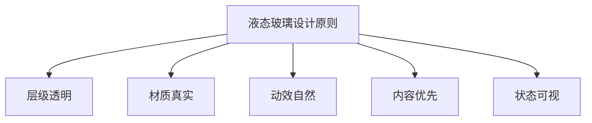

# XH-202630 科研文献智能助手 — 前端 UI/UX 设计手册

> **课题编号**：XH-202630  
> **课题名称**：领域知识个性化生成与多智能体协同决策系统研究  
> **设计风格**：高级液态玻璃（Liquid Glass）/ iOS 26 风格  
> **文档版本**：v1.0  
> **创建日期**：2026年5月27日  
> **适用范围**：前端开发、视觉设计、交互设计

---

## 目录

- [1 设计概述](#1-设计概述)
- [2 设计原则](#2-设计原则)
- [3 色彩体系](#3-色彩体系)
- [4 排版系统](#4-排版系统)
- [5 液态玻璃材质规范](#5-液态玻璃材质规范)
- [6 布局与间距](#6-布局与间距)
- [7 组件设计规范](#7-组件设计规范)
- [8 图标与图形](#8-图标与图形)
- [9 动效与交互](#9-动效与交互)
- [10 页面设计规范](#10-页面设计规范)
- [11 响应式适配](#11-响应式适配)
- [12 暗色模式](#12-暗色模式)
- [13 设计Token与变量](#13-设计token与变量)
- [14 设计资源](#14-设计资源)

---

## 1 设计概述

### 1.1 设计理念

本系统采用**高级液态玻璃（Liquid Glass）**设计风格，灵感源自 Apple iOS 26 的设计语言。液态玻璃是一种介于实体与虚拟之间的材质表现——它既保留了玻璃的物理质感（折射、反射、厚度），又具备数字界面的轻盈与通透。

**核心设计主张**：

> "知识如光，穿透玻璃，清晰呈现。"

科研文献智能助手的本质是**知识的透明传递**。液态玻璃材质隐喻了AI处理过程的可见性与可解释性——用户能够"看穿"系统的运作，如同透过玻璃观察Agent的协同工作。

### 1.2 风格关键词

| 关键词 | 说明 | 设计体现 |
|--------|------|---------|
| **通透** | 界面层次分明，信息浮于背景之上 | 毛玻璃背景、层级阴影 |
| **流动** | 状态转换自然，反馈即时 | 流体动效、弹性过渡 |
| **精致** | 细节考究，质感细腻 | 微渐变、边缘高光、材质厚度 |
| **沉浸** | 内容为王，减少视觉干扰 | 大面积留白、聚焦模式 |
| **智能** | AI特性可视化，科技感自然融入 | Agent状态光效、数据流动画 |

### 1.3 设计目标

1. **降低认知负荷**：通过清晰的视觉层级和充足的留白，让用户专注于文献内容
2. **增强信任感**：透明的Agent工作过程可视化，建立用户对AI的可信度
3. **体现专业度**：精致的液态玻璃质感传达科研工具的严谨与前沿
4. **支持个性化**：用户画像驱动的差异化视觉呈现（如初级用户的通俗解释区域采用更温暖的色调）

---

## 2 设计原则

### 2.1 五大核心原则



#### 原则一：层级透明（Layer Transparency）

每一层界面元素都应具有明确的深度感知。通过背景的模糊度、透明度、阴影强度来区分层级关系。

- **背景层**：纯色或微弱渐变，无模糊
- **内容层**：轻微模糊（`backdrop-filter: blur(8px)`）+ 半透明背景
- **浮层/弹窗**：中等模糊（`backdrop-filter: blur(20px)`）+ 更强阴影
- **Agent可视化层**：动态光效 + 深度模糊，营造"悬浮"感

#### 原则二：材质真实（Material Authenticity）

液态玻璃不是简单的"半透明"，它需要表现真实玻璃的光学特性：

- **边缘高光**：玻璃边缘有微妙的亮度提升（`border-top: 1px solid rgba(255,255,255,0.3)`）
- **厚度感**：通过内阴影和外阴影组合表现玻璃的物理厚度
- **折射感**：背景内容透过玻璃时有轻微的放大/扭曲效果（可选，性能敏感场景慎用）
- **反射感**：玻璃表面有 subtle 的环境反射（通过渐变模拟）

#### 原则三：动效自然（Natural Motion）

所有动画遵循物理世界的运动规律：

- **缓动函数**：优先使用 `cubic-bezier(0.25, 0.46, 0.45, 0.94)`（ease-out-quad）和 `cubic-bezier(0.34, 1.56, 0.64, 1)`（spring）
- **持续时间**：微交互 150-200ms，页面过渡 300-400ms，复杂动画 500-800ms
- **运动路径**：直线或 subtle 的曲线，避免突兀的跳跃
- **反馈即时**：用户操作后 50ms 内必须有视觉响应

#### 原则四：内容优先（Content First）

视觉装饰永远服务于内容：

- 论文卡片、分析结果等核心内容区域使用**高对比度**确保可读性
- 装饰性元素（光效、渐变）在内容区域外围或背景层
- 液态玻璃效果在导航栏、侧边栏、浮层等"容器"上表现，不在正文阅读区使用

#### 原则五：状态可视（Visible State）

系统状态对用户完全透明：

- Agent执行状态通过**颜色 + 光效 + 微动画**三重编码
- 加载状态不是枯燥的转圈，而是有进度感的流体动画
- 错误状态通过材质的"裂纹"感或色彩变化传达

---

## 3 色彩体系

### 3.1 主色调

系统采用**深空蓝（Deep Space Blue）**作为主色调，搭配**极光紫（Aurora Purple）**作为强调色，营造科技感和学术氛围。

| 色彩角色 | 名称 | Hex | RGBA | 用途 |
|---------|------|-----|------|------|
| **主色** | 深空蓝 | `#0A84FF` | `rgba(10, 132, 255, 1)` | 主要按钮、链接、Agent运行状态 |
| **强调色** | 极光紫 | `#BF5AF2` | `rgba(191, 90, 242, 1)` | 高亮、标签、Agent协调者 |
| **成功色** | 翡翠绿 | `#30D158` | `rgba(48, 209, 88, 1)` | 成功状态、Agent完成 |
| **警告色** | 琥珀橙 | `#FF9F0A` | `rgba(255, 159, 10, 1)` | 警告、矛盾发现、Agent降级 |
| **错误色** | 珊瑚红 | `#FF453A` | `rgba(255, 69, 58, 1)` | 错误、Agent失败 |
| **信息色** | 天青蓝 | `#64D2FF` | `rgba(100, 210, 255, 1)` | 提示信息、引用溯源 |

### 3.2 背景色阶

液态玻璃风格需要多层次的背景色来营造深度：

| 层级 | 名称 | 亮色模式 | 暗色模式 | 用途 |
|------|------|---------|---------|------|
| **底层** | 系统背景 | `#F5F5F7` | `#000000` | 页面最底层背景 |
| **一层** | 表面背景 | `#FFFFFF` | `#1C1C1E` | 卡片、面板底色 |
| **二层** |  elevated | `#FFFFFF` + 阴影 | `#2C2C2E` | 浮起卡片、弹窗 |
| **三层** | 液态玻璃 | `rgba(255,255,255,0.7)` + blur | `rgba(28,28,30,0.7)` + blur | 导航栏、侧边栏 |

### 3.3 文字色阶

| 层级 | 亮色模式 | 暗色模式 | 用途 |
|------|---------|---------|------|
| **主文字** | `#1D1D1F` | `#FFFFFF` | 标题、正文 |
| **次要文字** | `#86868B` | `#8E8E93` | 辅助说明、元数据 |
| **三级文字** | `#C7C7CC` | `#48484A` | 禁用状态、占位符 |
| **反色文字** | `#FFFFFF` | `#1D1D1F` | 彩色背景上的文字 |

### 3.4 Agent状态色

Agent可视化模块使用特定的状态色彩体系：

| Agent状态 | 色彩 | 光效 |
|-----------|------|------|
| **等待中** | `#8E8E93` | 无 |
| **执行中** | `#0A84FF` | 脉冲呼吸灯效果 |
| **已完成** | `#30D158` | 柔和常亮 |
| **失败** | `#FF453A` | 闪烁警示 |
| **降级** | `#FF9F0A` | 缓慢呼吸 |

### 3.5 渐变规范

液态玻璃风格中，渐变用于营造光感和深度：

**主渐变（按钮、重要元素）**：
```css
background: linear-gradient(135deg, #0A84FF 0%, #BF5AF2 100%);
```

**玻璃高光（顶部边缘）**：
```css
border-top: 1px solid rgba(255, 255, 255, 0.4);
```

**背景环境光（页面背景）**：
```css
background: radial-gradient(ellipse at top, rgba(10, 132, 255, 0.08) 0%, transparent 50%),
            radial-gradient(ellipse at bottom right, rgba(191, 90, 242, 0.06) 0%, transparent 50%),
            #F5F5F7;
```

---

## 4 排版系统

### 4.1 字体栈

```css
/* 中文优先 */
font-family: -apple-system, BlinkMacSystemFont, "SF Pro Display", "SF Pro Text", "Helvetica Neue", "PingFang SC", "Hiragino Sans GB", "Microsoft YaHei", sans-serif;

/* 等宽字体（代码、数据展示） */
font-family: "SF Mono", "Fira Code", "JetBrains Mono", "Consolas", monospace;
```

### 4.2 字号规范

| 层级 | 字号 | 字重 | 行高 | 字间距 | 用途 |
|------|------|------|------|--------|------|
| **Display** | 48px | 700 | 1.1 | -0.02em | 首页大标题 |
| **H1** | 32px | 700 | 1.2 | -0.01em | 页面标题 |
| **H2** | 24px | 600 | 1.3 | 0 | 区块标题 |
| **H3** | 20px | 600 | 1.4 | 0 | 卡片标题 |
| **H4** | 17px | 600 | 1.4 | 0 | 小标题 |
| **Body** | 15px | 400 | 1.6 | 0 | 正文 |
| **Body Small** | 13px | 400 | 1.5 | 0 | 辅助文字 |
| **Caption** | 12px | 400 | 1.4 | 0.01em | 标签、时间 |
| **Overline** | 11px | 600 | 1.2 | 0.05em | 分类标签 |

### 4.3 排版模式

**论文卡片标题**：
- 字号：17px，字重 600
- 最多两行，超出截断（`line-clamp: 2`）
- 行高 1.4，确保中英文混排舒适

**分析结果正文**：
- 字号：15px，字重 400
- 行高 1.6，段落间距 12px
- 引用文字使用斜体 + 左侧 3px 蓝色竖线装饰

**Agent状态文字**：
- 状态标签：12px，大写，字间距 0.05em
- 中间结果：13px，常规，行高 1.5

---

## 5 液态玻璃材质规范

### 5.1 基础液态玻璃

这是系统最核心的视觉元素，用于导航栏、侧边栏、浮层面板等。

```css
.liquid-glass {
  /* 半透明背景 */
  background: rgba(255, 255, 255, 0.65);
  
  /* 背景模糊 - 核心特性 */
  backdrop-filter: blur(20px) saturate(180%);
  -webkit-backdrop-filter: blur(20px) saturate(180%);
  
  /* 玻璃边缘高光 */
  border: 1px solid rgba(255, 255, 255, 0.3);
  border-top: 1px solid rgba(255, 255, 255, 0.5);
  
  /* 内阴影 - 玻璃厚度感 */
  box-shadow: 
    inset 0 1px 1px rgba(255, 255, 255, 0.4),
    0 8px 32px rgba(0, 0, 0, 0.08);
  
  /* 圆角 */
  border-radius: 16px;
}
```

### 5.2 深色液态玻璃（暗色模式）

```css
.liquid-glass-dark {
  background: rgba(28, 28, 30, 0.65);
  backdrop-filter: blur(20px) saturate(180%);
  -webkit-backdrop-filter: blur(20px) saturate(180%);
  
  /* 暗色模式下高光更 subtle */
  border: 1px solid rgba(255, 255, 255, 0.1);
  border-top: 1px solid rgba(255, 255, 255, 0.15);
  
  box-shadow: 
    inset 0 1px 1px rgba(255, 255, 255, 0.1),
    0 8px 32px rgba(0, 0, 0, 0.3);
  
  border-radius: 16px;
}
```

### 5.3 液态玻璃层级变体

| 变体 | 背景透明度 | 模糊度 | 阴影强度 | 用途 |
|------|-----------|--------|---------|------|
| **轻薄** | `rgba(255,255,255,0.4)` | `blur(12px)` | 微弱 | 下拉菜单、tooltip |
| **标准** | `rgba(255,255,255,0.65)` | `blur(20px)` | 中等 | 导航栏、侧边栏 |
| **厚重** | `rgba(255,255,255,0.85)` | `blur(30px)` | 强 | 弹窗、模态框 |
| **Agent专用** | `rgba(10,132,255,0.1)` | `blur(24px)` | 带光晕 | Agent状态面板 |

### 5.4 液态玻璃卡片

论文卡片、分析卡片等使用液态玻璃材质：

```css
.glass-card {
  background: rgba(255, 255, 255, 0.72);
  backdrop-filter: blur(16px) saturate(150%);
  -webkit-backdrop-filter: blur(16px) saturate(150%);
  
  border: 1px solid rgba(255, 255, 255, 0.35);
  border-radius: 20px;
  
  box-shadow: 
    0 4px 24px rgba(0, 0, 0, 0.06),
    inset 0 1px 0 rgba(255, 255, 255, 0.4);
  
  /* 悬停时的微妙抬升 */
  transition: transform 0.3s cubic-bezier(0.25, 0.46, 0.45, 0.94),
              box-shadow 0.3s ease;
}

.glass-card:hover {
  transform: translateY(-2px);
  box-shadow: 
    0 8px 32px rgba(0, 0, 0, 0.1),
    inset 0 1px 0 rgba(255, 255, 255, 0.4);
}
```

### 5.5 性能注意事项

- `backdrop-filter` 是 GPU 密集型属性，避免在大面积区域同时使用
- 建议对玻璃容器设置 `will-change: transform` 或 `will-change: backdrop-filter` 进行优化
- 在低端设备上可降级为纯色半透明背景（`background: rgba(255,255,255,0.9)`）
- 避免玻璃层嵌套超过 2 层（玻璃上的玻璃会导致性能急剧下降）

---

## 6 布局与间距

### 6.1 网格系统

采用 8px 基准网格系统：

| Token | 值 | 用途 |
|-------|-----|------|
| `space-1` | 4px | 图标间距、紧凑内边距 |
| `space-2` | 8px | 小间距、行内元素 |
| `space-3` | 12px | 按钮内边距、小卡片 |
| `space-4` | 16px | 标准间距、卡片内边距 |
| `space-5` | 20px | 中等间距 |
| `space-6` | 24px | 大卡片内边距、区块间距 |
| `space-8` | 32px | 大间距、页面边距 |
| `space-10` | 40px | 区块分隔 |
| `space-12` | 48px | 大区块间距 |
| `space-16` | 64px | 页面级间距 |

### 6.2 圆角规范

| Token | 值 | 用途 |
|-------|-----|------|
| `radius-sm` | 8px | 小按钮、标签 |
| `radius-md` | 12px | 输入框、小卡片 |
| `radius-lg` | 16px | 卡片、面板 |
| `radius-xl` | 20px | 大卡片、弹窗 |
| `radius-2xl` | 24px | 特殊容器 |
| `radius-full` | 9999px | 圆形按钮、头像 |

### 6.3 阴影规范

液态玻璃风格中，阴影用于表现深度而非"纸张感"：

```css
/* 微弱阴影 - 近距离元素 */
--shadow-sm: 0 2px 8px rgba(0, 0, 0, 0.04);

/* 标准阴影 - 卡片、面板 */
--shadow-md: 0 4px 24px rgba(0, 0, 0, 0.06);

/* 强阴影 - 浮层、弹窗 */
--shadow-lg: 0 12px 48px rgba(0, 0, 0, 0.12);

/* 特殊阴影 - Agent可视化 */
--shadow-glow: 0 0 24px rgba(10, 132, 255, 0.2);
```

### 6.4 页面布局结构

```
┌─────────────────────────────────────────────────────────┐
│  AppHeader (液态玻璃导航栏, 固定顶部, z-50)               │
│  ├── Logo                                              │
│  ├── 导航链接                                           │
│  └── 用户菜单                                           │
├─────────────────────────────────────────────────────────┤
│                                                         │
│  Main Content Area                                      │
│  ├── 页面标题区                                          │
│  ├── 内容区块（玻璃卡片）                                 │
│  │   ├── 卡片标题                                        │
│  │   └── 卡片内容                                        │
│  └── 辅助信息区                                          │
│                                                         │
├─────────────────────────────────────────────────────────┤
│  AppFooter (简洁底部)                                    │
└─────────────────────────────────────────────────────────┘
```

**内容最大宽度**：1280px，居中布局  
**页面边距**：移动端 16px，平板 24px，桌面 32px  
**卡片间距**：16px（紧凑）/ 24px（标准）

---

## 7 组件设计规范

### 7.1 按钮（Button）

#### 主按钮（Primary）

```css
.btn-primary {
  /* 渐变背景 */
  background: linear-gradient(135deg, #0A84FF 0%, #0077ED 100%);
  color: #FFFFFF;
  
  /* 尺寸 */
  padding: 12px 24px;
  border-radius: 12px;
  font-size: 15px;
  font-weight: 600;
  
  /* 阴影 */
  box-shadow: 0 4px 16px rgba(10, 132, 255, 0.3);
  
  /* 过渡 */
  transition: all 0.2s ease;
}

.btn-primary:hover {
  transform: translateY(-1px);
  box-shadow: 0 6px 20px rgba(10, 132, 255, 0.4);
}

.btn-primary:active {
  transform: translateY(0);
  box-shadow: 0 2px 8px rgba(10, 132, 255, 0.3);
}
```

#### 次按钮（Secondary / Glass）

```css
.btn-secondary {
  background: rgba(255, 255, 255, 0.5);
  backdrop-filter: blur(12px);
  border: 1px solid rgba(255, 255, 255, 0.4);
  color: #0A84FF;
  
  padding: 12px 24px;
  border-radius: 12px;
  font-size: 15px;
  font-weight: 600;
  
  transition: all 0.2s ease;
}

.btn-secondary:hover {
  background: rgba(255, 255, 255, 0.7);
}
```

#### 文字按钮（Text）

```css
.btn-text {
  background: transparent;
  color: #0A84FF;
  padding: 8px 12px;
  font-size: 15px;
  font-weight: 500;
  
  transition: opacity 0.2s ease;
}

.btn-text:hover {
  opacity: 0.7;
}
```

### 7.2 输入框（Input）

```css
.input-glass {
  background: rgba(255, 255, 255, 0.6);
  backdrop-filter: blur(12px);
  border: 1px solid rgba(0, 0, 0, 0.08);
  border-radius: 12px;
  
  padding: 12px 16px;
  font-size: 15px;
  color: #1D1D1F;
  
  transition: all 0.2s ease;
}

.input-glass:focus {
  outline: none;
  border-color: #0A84FF;
  box-shadow: 0 0 0 4px rgba(10, 132, 255, 0.15);
  background: rgba(255, 255, 255, 0.8);
}

.input-glass::placeholder {
  color: #C7C7CC;
}
```

### 7.3 卡片（Card）

#### 论文卡片（PaperCard）

```css
.paper-card {
  /* 液态玻璃材质 */
  background: rgba(255, 255, 255, 0.72);
  backdrop-filter: blur(16px) saturate(150%);
  border: 1px solid rgba(255, 255, 255, 0.35);
  border-radius: 20px;
  
  /* 阴影 */
  box-shadow: 
    0 4px 24px rgba(0, 0, 0, 0.06),
    inset 0 1px 0 rgba(255, 255, 255, 0.4);
  
  /* 布局 */
  padding: 24px;
  
  /* 交互 */
  transition: all 0.3s cubic-bezier(0.25, 0.46, 0.45, 0.94);
  cursor: pointer;
}

.paper-card:hover {
  transform: translateY(-4px) scale(1.01);
  box-shadow: 
    0 12px 40px rgba(0, 0, 0, 0.1),
    inset 0 1px 0 rgba(255, 255, 255, 0.4);
}

/* 选中状态 */
.paper-card--selected {
  border-color: #0A84FF;
  box-shadow: 
    0 4px 24px rgba(10, 132, 255, 0.15),
    inset 0 1px 0 rgba(255, 255, 255, 0.4);
}
```

#### 分析卡片（AnalysisCard）

分析卡片采用**分区设计**，每个维度有独立的视觉标识：

```css
.analysis-card {
  background: rgba(255, 255, 255, 0.75);
  backdrop-filter: blur(20px);
  border-radius: 24px;
  padding: 32px;
  
  /* 左侧彩色边框标识 */
  border-left: 4px solid #0A84FF;
}

/* 各维度颜色标识 */
.analysis-dimension--research { border-left-color: #0A84FF; }  /* 蓝 - 研究问题 */
.analysis-dimension--method { border-left-color: #BF5AF2; }    /* 紫 - 核心方法 */
.analysis-dimension--experiment { border-left-color: #30D158; } /* 绿 - 主要实验 */
.analysis-dimension--finding { border-left-color: #FF9F0A; }   /* 橙 - 核心结论 */
.analysis-dimension--limitation { border-left-color: #FF453A; } /* 红 - 局限性 */
```

### 7.4 标签（Tag / Badge）

```css
.tag-glass {
  display: inline-flex;
  align-items: center;
  gap: 4px;
  
  padding: 4px 12px;
  border-radius: 8px;
  font-size: 12px;
  font-weight: 600;
  
  /* 玻璃效果 */
  background: rgba(10, 132, 255, 0.1);
  backdrop-filter: blur(8px);
  border: 1px solid rgba(10, 132, 255, 0.2);
  color: #0A84FF;
}

/* 关键词标签 */
.tag-keyword {
  background: rgba(120, 120, 128, 0.12);
  border-color: rgba(120, 120, 128, 0.2);
  color: #8E8E93;
}

/* 状态标签 */
.tag-status--running {
  background: rgba(10, 132, 255, 0.12);
  border-color: rgba(10, 132, 255, 0.25);
  color: #0A84FF;
}
```

### 7.5 导航栏（AppHeader）

```css
.app-header {
  position: fixed;
  top: 0;
  left: 0;
  right: 0;
  z-index: 50;
  height: 60px;
  
  /* 液态玻璃 */
  background: rgba(255, 255, 255, 0.72);
  backdrop-filter: blur(20px) saturate(180%);
  -webkit-backdrop-filter: blur(20px) saturate(180%);
  
  /* 底部细线 */
  border-bottom: 1px solid rgba(0, 0, 0, 0.06);
  
  /* 内容 */
  display: flex;
  align-items: center;
  justify-content: space-between;
  padding: 0 32px;
}
```

### 7.6 加载状态（Loading）

#### 流体加载器（Fluid Loader）

替代传统的旋转圆圈，使用液态玻璃风格的流体动画：

```css
.fluid-loader {
  width: 48px;
  height: 48px;
  position: relative;
}

.fluid-loader::before {
  content: '';
  position: absolute;
  inset: 0;
  border-radius: 50%;
  background: linear-gradient(135deg, #0A84FF, #BF5AF2);
  opacity: 0.3;
  animation: fluid-pulse 2s ease-in-out infinite;
}

.fluid-loader::after {
  content: '';
  position: absolute;
  inset: 4px;
  border-radius: 50%;
  background: linear-gradient(135deg, #0A84FF, #BF5AF2);
  animation: fluid-pulse 2s ease-in-out infinite 0.5s;
}

@keyframes fluid-pulse {
  0%, 100% { transform: scale(0.8); opacity: 0.5; }
  50% { transform: scale(1.1); opacity: 1; }
}
```

#### 骨架屏（Skeleton）

```css
.skeleton {
  background: linear-gradient(
    90deg,
    rgba(0, 0, 0, 0.04) 25%,
    rgba(0, 0, 0, 0.08) 50%,
    rgba(0, 0, 0, 0.04) 75%
  );
  background-size: 200% 100%;
  animation: skeleton-shimmer 1.5s ease-in-out infinite;
  border-radius: 8px;
}

@keyframes skeleton-shimmer {
  0% { background-position: 200% 0; }
  100% { background-position: -200% 0; }
}
```

### 7.7 弹窗与浮层（Modal / Popover）

```css
.modal-overlay {
  position: fixed;
  inset: 0;
  background: rgba(0, 0, 0, 0.3);
  backdrop-filter: blur(4px);
  z-index: 100;
}

.modal-content {
  background: rgba(255, 255, 255, 0.85);
  backdrop-filter: blur(30px) saturate(180%);
  border: 1px solid rgba(255, 255, 255, 0.4);
  border-radius: 24px;
  
  box-shadow: 
    0 24px 64px rgba(0, 0, 0, 0.15),
    inset 0 1px 0 rgba(255, 255, 255, 0.5);
  
  padding: 32px;
  max-width: 560px;
  width: 90%;
  
  /* 入场动画 */
  animation: modal-enter 0.4s cubic-bezier(0.25, 0.46, 0.45, 0.94);
}

@keyframes modal-enter {
  from {
    opacity: 0;
    transform: scale(0.9) translateY(20px);
  }
  to {
    opacity: 1;
    transform: scale(1) translateY(0);
  }
}
```

### 7.8 时间线（Timeline）

Agent中间结果展示使用液态玻璃时间线：

```css
.timeline-item {
  position: relative;
  padding-left: 32px;
  padding-bottom: 24px;
}

/* 时间线竖线 */
.timeline-item::before {
  content: '';
  position: absolute;
  left: 8px;
  top: 8px;
  bottom: 0;
  width: 2px;
  background: linear-gradient(to bottom, #0A84FF, transparent);
}

/* 时间节点 */
.timeline-dot {
  position: absolute;
  left: 0;
  top: 4px;
  width: 18px;
  height: 18px;
  border-radius: 50%;
  background: #0A84FF;
  border: 3px solid rgba(255, 255, 255, 0.8);
  box-shadow: 0 0 0 3px rgba(10, 132, 255, 0.2);
}

/* 内容卡片 */
.timeline-content {
  background: rgba(255, 255, 255, 0.6);
  backdrop-filter: blur(12px);
  border-radius: 12px;
  padding: 16px;
  border: 1px solid rgba(255, 255, 255, 0.3);
}
```

---

## 8 图标与图形

### 8.1 图标风格

- **风格**：线性图标（Outline），2px 描边，圆角端点
- **尺寸**：标准 24px，小 20px，大 32px
- **颜色**：默认 `#86868B`，激活 `#0A84FF`，禁用 `#C7C7CC`

### 8.2 Agent可视化图形

Agent流程图节点使用**液态玻璃圆形**：

```css
.agent-node {
  width: 64px;
  height: 64px;
  border-radius: 50%;
  
  /* 玻璃材质 */
  background: rgba(255, 255, 255, 0.7);
  backdrop-filter: blur(12px);
  border: 2px solid rgba(255, 255, 255, 0.5);
  
  /* 阴影 */
  box-shadow: 
    0 4px 16px rgba(0, 0, 0, 0.1),
    inset 0 1px 0 rgba(255, 255, 255, 0.5);
  
  /* 居中内容 */
  display: flex;
  align-items: center;
  justify-content: center;
  
  /* 状态过渡 */
  transition: all 0.4s cubic-bezier(0.25, 0.46, 0.45, 0.94);
}

/* 执行中状态 - 脉冲光效 */
.agent-node--running {
  border-color: #0A84FF;
  box-shadow: 
    0 0 0 0 rgba(10, 132, 255, 0.4),
    0 4px 16px rgba(0, 0, 0, 0.1);
  animation: agent-pulse 2s ease-in-out infinite;
}

@keyframes agent-pulse {
  0%, 100% { 
    box-shadow: 
      0 0 0 0 rgba(10, 132, 255, 0.4),
      0 4px 16px rgba(0, 0, 0, 0.1);
  }
  50% { 
    box-shadow: 
      0 0 0 12px rgba(10, 132, 255, 0),
      0 4px 16px rgba(0, 0, 0, 0.1);
  }
}

/* 已完成状态 - 柔和绿光 */
.agent-node--completed {
  border-color: #30D158;
  box-shadow: 0 0 16px rgba(48, 209, 88, 0.3);
}

/* 失败状态 - 红色闪烁 */
.agent-node--failed {
  border-color: #FF453A;
  animation: agent-fail 1s ease-in-out infinite;
}

@keyframes agent-fail {
  0%, 100% { box-shadow: 0 0 0 rgba(255, 69, 58, 0); }
  50% { box-shadow: 0 0 16px rgba(255, 69, 58, 0.4); }
}
```

### 8.3 连接线

Agent之间的连线使用渐变流动效果：

```css
.agent-link {
  stroke: url(#gradient-blue);
  stroke-width: 2;
  fill: none;
  
  /* 流动动画 */
  stroke-dasharray: 8 4;
  animation: link-flow 1s linear infinite;
}

@keyframes link-flow {
  to { stroke-dashoffset: -12; }
}
```

---

## 9 动效与交互

### 9.1 动效原则

| 原则 | 说明 |
|------|------|
| **有意义** | 每个动画都服务于用户理解，不为动而动 |
| **有节奏** | 动画时长与元素重要性成正比 |
| **有反馈** | 用户操作后立即给予视觉响应 |
| **有节制** | 同时进行的动画不超过 3 个 |

### 9.2 页面过渡

```css
/* 页面进入 */
.page-enter {
  animation: page-enter 0.4s cubic-bezier(0.25, 0.46, 0.45, 0.94);
}

@keyframes page-enter {
  from {
    opacity: 0;
    transform: translateY(16px);
  }
  to {
    opacity: 1;
    transform: translateY(0);
  }
}

/* 页面离开 */
.page-leave {
  animation: page-leave 0.3s ease-in;
}

@keyframes page-leave {
  from {
    opacity: 1;
    transform: translateY(0);
  }
  to {
    opacity: 0;
    transform: translateY(-16px);
  }
}
```

### 9.3 列表动画

论文列表加载时的 stagger 动画：

```css
.list-item {
  animation: list-item-enter 0.4s cubic-bezier(0.25, 0.46, 0.45, 0.94) both;
}

/* 通过 JS 或 CSS 变量设置延迟 */
.list-item:nth-child(1) { animation-delay: 0ms; }
.list-item:nth-child(2) { animation-delay: 50ms; }
.list-item:nth-child(3) { animation-delay: 100ms; }
/* ... */

@keyframes list-item-enter {
  from {
    opacity: 0;
    transform: translateY(20px) scale(0.98);
  }
  to {
    opacity: 1;
    transform: translateY(0) scale(1);
  }
}
```

### 9.4 微交互

#### 按钮点击涟漪

```css
.btn-ripple {
  position: relative;
  overflow: hidden;
}

.btn-ripple::after {
  content: '';
  position: absolute;
  inset: 0;
  background: radial-gradient(circle at var(--x, 50%) var(--y, 50%), 
    rgba(255, 255, 255, 0.3) 0%, 
    transparent 60%);
  opacity: 0;
  transition: opacity 0.3s;
}

.btn-ripple:active::after {
  opacity: 1;
}
```

#### 收藏按钮心跳

```css
.btn-favorite:active {
  animation: heart-beat 0.4s ease;
}

@keyframes heart-beat {
  0% { transform: scale(1); }
  25% { transform: scale(1.2); }
  50% { transform: scale(0.95); }
  100% { transform: scale(1); }
}
```

### 9.5 Agent可视化动效

#### 数据流动画

当Agent之间传递数据时，连线上的粒子流动效果：

```css
.data-particle {
  offset-path: path('M100,100 C150,100 150,200 200,200');
  animation: data-flow 1.5s ease-in-out infinite;
}

@keyframes data-flow {
  0% { offset-distance: 0%; opacity: 0; }
  10% { opacity: 1; }
  90% { opacity: 1; }
  100% { offset-distance: 100%; opacity: 0; }
}
```

#### 进度光晕

Agent执行时的进度指示：

```css
.progress-glow {
  position: relative;
}

.progress-glow::before {
  content: '';
  position: absolute;
  inset: -2px;
  border-radius: inherit;
  background: linear-gradient(90deg, #0A84FF, #BF5AF2, #0A84FF);
  background-size: 200% 100%;
  animation: glow-rotate 2s linear infinite;
  opacity: 0.5;
  z-index: -1;
}

@keyframes glow-rotate {
  0% { background-position: 0% 50%; }
  100% { background-position: 200% 50%; }
}
```

---

## 10 页面设计规范

### 10.1 首页（HomeView）

```
┌─────────────────────────────────────────────────────────┐
│  [液态玻璃导航栏]                                        │
├─────────────────────────────────────────────────────────┤
│                                                         │
│                                                         │
│              ┌─────────────────────────┐                │
│              │   🔬 科研文献智能助手    │                │
│              │   领域知识个性化生成系统  │                │
│              └─────────────────────────┘                │
│                                                         │
│     ┌─────────────────────────────────────────────┐    │
│     │  🔍  输入研究主题，如"Multi-Agent协同决策"    │    │
│     └─────────────────────────────────────────────┘    │
│                                                         │
│              [  开 始 检 索  ]                          │
│                                                         │
│     最近搜索：                                           │
│     ┌──────────┐ ┌──────────┐ ┌──────────┐            │
│     │Multi-Agent│ │ RAG检索  │ │大模型微调│            │
│     └──────────┘ └──────────┘ └──────────┘            │
│                                                         │
│                                                         │
└─────────────────────────────────────────────────────────┘
```

**设计要点**：
- 背景使用 subtle 的径向渐变（蓝紫环境光）
- 搜索框使用厚重液态玻璃（`blur(30px)`），宽度 640px，圆角 16px
- 搜索框聚焦时有蓝色光晕扩散
- 最近搜索标签使用轻薄液态玻璃

### 10.2 检索结果页（SearchView）

```
┌─────────────────────────────────────────────────────────┐
│  [液态玻璃导航栏]                                        │
├─────────────────────────────────────────────────────────┤
│  🔍 [搜索框]                              排序 [相关度▼] │
├──────────┬──────────────────────────────────────────────┤
│          │                                              │
│ [筛选面板]│   ┌─ 论文卡片 ─────────────────────────┐   │
│          │   │ 📄 论文标题...                      │   │
│ 年份     │   │ 作者 · 年份 · 会议                   │   │
│ [滑块]   │   │ 摘要预览...                         │   │
│          │   │ [标签] [标签]  相关度 95%            │   │
│ 会议     │   │ [分析] [收藏]                        │   │
│ [☑ ACL]  │   └────────────────────────────────────┘   │
│          │                                              │
│ 引用数   │   ┌─ 论文卡片 ─────────────────────────┐   │
│ [≥ 50]   │   │ ...                                │   │
│          │   └────────────────────────────────────┘   │
│          │                                              │
│ [应用筛选]│   ← 1 2 3 ... 16 →                        │
│          │                                              │
└──────────┴──────────────────────────────────────────────┘
```

**设计要点**：
- 左侧筛选面板使用标准液态玻璃，宽度 240px
- 论文卡片使用 glass-card 样式，间距 16px
- 卡片悬停时有抬升效果
- 选中卡片有蓝色边框标识

### 10.3 论文详情页（PaperDetailView）

```
┌─────────────────────────────────────────────────────────┐
│  ← 返回                                    [液态玻璃栏]  │
├─────────────────────────────────────────────────────────┤
│                                                         │
│  ┌─ 论文信息卡片 ───────────────────────────────────┐  │
│  │ 📄 A Survey on Multi-Agent Systems               │  │
│  │ 作者：Zhang, Li, Wang · 2024 · ACL               │  │
│  │ 引用数：156  │  [查看PDF] [收藏]                   │  │
│  │ 关键词：[Multi-Agent] [LLM] [Survey]              │  │
│  └──────────────────────────────────────────────────┘  │
│                                                         │
│  ┌─ AI智能分析卡片 ─────────────────────────────────┐  │
│  │                                                  │  │
│  │  🎯 研究问题    │ 如何实现多Agent高效协同？       │  │
│  │  ──────────────┼────────────────────────────────  │  │
│  │  🔧 核心方法    │ 基于图结构的编排框架...          │  │
│  │  ──────────────┼────────────────────────────────  │  │
│  │  🧪 主要实验    │ 在4个数据集上评测...             │  │
│  │  ──────────────┼────────────────────────────────  │  │
│  │  📊 核心结论    │ 多Agent优于单Agent...            │  │
│  │  ──────────────┼────────────────────────────────  │  │
│  │  ⚠️ 局限性     │ 未考虑通信开销...                │  │
│  │                                                  │  │
│  └──────────────────────────────────────────────────┘  │
│                                                         │
│  ┌─ 通俗解释卡片（初级用户） ────────────────────────┐  │
│  │ 💡 就像项目组里，有人查资料、有人写代码...         │  │
│  └──────────────────────────────────────────────────┘  │
│                                                         │
└─────────────────────────────────────────────────────────┘
```

**设计要点**：
- 论文信息卡片使用厚重液态玻璃，顶部有 subtle 渐变装饰
- 分析卡片每个维度有左侧彩色边框标识
- 通俗解释卡片使用温暖的琥珀色调（`rgba(255, 159, 10, 0.08)` 背景）

### 10.4 Agent可视化页（AgentFlowView）

```
┌─────────────────────────────────────────────────────────┐
│  [液态玻璃导航栏]                                        │
├─────────────────────────────────────────────────────────┤
│                                                         │
│  ┌─ Agent协同流程图 ────────────────────────────────┐   │
│  │                                                  │   │
│  │         ┌─────────┐                              │   │
│  │         │ 协调者  │ ←── 脉冲光效                 │   │
│  │         └────┬────┘                              │   │
│  │              │                                   │   │
│  │    ┌─────────┼─────────┐                        │   │
│  │    ▼         ▼         ▼                        │   │
│  │ ┌──────┐ ┌──────┐ ┌──────┐                     │   │
│  │ │ 检索 │ │ 分析 │ │ 对比 │  ←── 状态颜色        │   │
│  │ └──┬───┘ └──┬───┘ └──┬───┘                     │   │
│  │    │        │        │                          │   │
│  │    └────────┴────────┘                          │   │
│  │              │                                   │   │
│  │              ▼                                   │   │
│  │         ┌─────────┐                              │   │
│  │         │  生成   │                              │   │
│  │         └────┬────┘                              │   │
│  │              │                                   │   │
│  │              ▼                                   │   │
│  │         ┌─────────┐                              │   │
│  │         │  审核   │                              │   │
│  │         └─────────┘                              │   │
│  │                                                  │   │
│  └──────────────────────────────────────────────────┘   │
│                                                         │
│  ┌─ 状态面板 ───────────┐ ┌─ 中间结果 ──────────────┐  │
│  │ 协调者 ● 已完成      │ │ 协调者：分解为4个子任务  │  │
│  │ 检索   ● 执行中 ←──  │ │ 检索：找到15篇相关论文   │  │
│  │ 分析   ○ 等待中      │ │ 分析：已分析 3/10 篇     │  │
│  │ ...                  │ │ ...                      │  │
│  └──────────────────────┘ └──────────────────────────┘  │
│                                                         │
└─────────────────────────────────────────────────────────┘
```

**设计要点**：
- 流程图区域使用深色背景（`#0A0A0F`），营造"指挥中心"氛围
- Agent节点使用液态玻璃圆形，状态通过光效和颜色表达
- 连线使用渐变 + 流动动画
- 状态面板使用轻薄液态玻璃
- 中间结果时间线使用渐变竖线

### 10.5 综述报告页（ReportView）

```
┌─────────────────────────────────────────────────────────┐
│  [液态玻璃导航栏]                              [导出▼]  │
├─────────────────────────────────────────────────────────┤
│                                                         │
│  主题：Multi-Agent协同决策                               │
│  论文范围：15篇 │ 生成时间：2026-05-23 16:30             │
│  用户画像：硕士 · NLP · 中级 · 均衡                       │
│                                                         │
│  ┌─ 综述内容 ───────────────────────────────────────┐   │
│  │                                                  │   │
│  │  # Multi-Agent协同决策研究综述                    │   │
│  │                                                  │   │
│  │  ## 1 引言                                       │   │
│  │  近年来，多智能体协同决策在... [Zhang,2024]       │   │
│  │                                                  │   │
│  │  ## 2 研究现状                                   │   │
│  │  当前主流方法可分为三类...                        │   │
│  │                                                  │   │
│  │  ## 3 方法对比                                   │   │
│  │  ...                                             │   │
│  │                                                  │   │
│  └──────────────────────────────────────────────────┘   │
│                                                         │
│  ┌─ 引用溯源 ───────────────────────────────────────┐   │
│  │ 点击引用标注可查看原文出处                         │   │
│  └──────────────────────────────────────────────────┘   │
│                                                         │
└─────────────────────────────────────────────────────────┘
```

**设计要点**：
- 综述内容区域使用白色/浅色背景（非玻璃），确保长文本阅读舒适
- 引用标注使用蓝色下划线 + 悬停浮窗
- 页面头部信息使用轻薄玻璃条

---

## 11 响应式适配

### 11.1 断点定义

| 断点 | 宽度 | 设备类型 |
|------|------|---------|
| `sm` | < 640px | 手机 |
| `md` | 640px - 1024px | 平板 |
| `lg` | 1024px - 1280px | 小桌面 |
| `xl` | > 1280px | 大桌面 |

### 11.2 适配规则

**导航栏**：
- `lg` 以下：汉堡菜单，Logo 居中
- `lg` 及以上：完整导航链接

**搜索页**：
- `md` 以下：筛选面板变为底部抽屉
- `md` 以下：论文卡片单列
- `md` 及以上：双列布局

**论文详情页**：
- `md` 以下：分析卡片垂直堆叠
- `md` 及以上：分析卡片网格布局

**Agent可视化**：
- `md` 以下：流程图简化，状态面板全宽
- `lg` 及以上：完整流程图 + 侧边面板

### 11.3 液态玻璃在移动端

移动端由于性能限制，液态玻璃需要降级：

```css
@media (max-width: 640px) {
  .liquid-glass {
    /* 移动端降级为纯色半透明 */
    background: rgba(255, 255, 255, 0.92);
    backdrop-filter: none;
    -webkit-backdrop-filter: none;
  }
  
  .glass-card {
    background: rgba(255, 255, 255, 0.95);
    backdrop-filter: none;
  }
}
```

---

## 12 暗色模式

### 12.1 暗色模式切换

系统支持自动跟随系统主题 + 手动切换：

```typescript
// 检测系统主题
const prefersDark = window.matchMedia('(prefers-color-scheme: dark)')

// 应用暗色模式
function applyDarkMode(isDark: boolean) {
  document.documentElement.classList.toggle('dark', isDark)
}
```

### 12.2 暗色模式色彩映射

| 亮色模式 | 暗色模式 |
|---------|---------|
| `#F5F5F7` | `#000000` |
| `#FFFFFF` | `#1C1C1E` |
| `#1D1D1F` | `#FFFFFF` |
| `#86868B` | `#8E8E93` |
| `rgba(255,255,255,0.72)` | `rgba(28,28,30,0.72)` |

### 12.3 暗色模式特殊处理

- Agent可视化页在暗色模式下更有沉浸感，使用更深的背景
- 液态玻璃在暗色模式下需要更强的边框高光来定义边缘
- 渐变色彩在暗色模式下适当提高饱和度

---

## 13 设计Token与变量

### 13.1 CSS 变量定义

```css
:root {
  /* 色彩 */
  --color-primary: #0A84FF;
  --color-accent: #BF5AF2;
  --color-success: #30D158;
  --color-warning: #FF9F0A;
  --color-danger: #FF453A;
  --color-info: #64D2FF;
  
  /* 背景 */
  --bg-system: #F5F5F7;
  --bg-surface: #FFFFFF;
  --bg-elevated: #FFFFFF;
  
  /* 文字 */
  --text-primary: #1D1D1F;
  --text-secondary: #86868B;
  --text-tertiary: #C7C7CC;
  
  /* 玻璃材质 */
  --glass-bg: rgba(255, 255, 255, 0.72);
  --glass-bg-light: rgba(255, 255, 255, 0.4);
  --glass-bg-heavy: rgba(255, 255, 255, 0.85);
  --glass-border: rgba(255, 255, 255, 0.35);
  --glass-border-highlight: rgba(255, 255, 255, 0.5);
  --glass-blur: blur(20px) saturate(180%);
  --glass-blur-light: blur(12px) saturate(150%);
  --glass-blur-heavy: blur(30px) saturate(180%);
  
  /* 阴影 */
  --shadow-sm: 0 2px 8px rgba(0, 0, 0, 0.04);
  --shadow-md: 0 4px 24px rgba(0, 0, 0, 0.06);
  --shadow-lg: 0 12px 48px rgba(0, 0, 0, 0.12);
  --shadow-glow: 0 0 24px rgba(10, 132, 255, 0.2);
  
  /* 间距 */
  --space-1: 4px;
  --space-2: 8px;
  --space-3: 12px;
  --space-4: 16px;
  --space-5: 20px;
  --space-6: 24px;
  --space-8: 32px;
  --space-10: 40px;
  --space-12: 48px;
  --space-16: 64px;
  
  /* 圆角 */
  --radius-sm: 8px;
  --radius-md: 12px;
  --radius-lg: 16px;
  --radius-xl: 20px;
  --radius-2xl: 24px;
  
  /* 过渡 */
  --transition-fast: 0.15s ease;
  --transition-normal: 0.3s cubic-bezier(0.25, 0.46, 0.45, 0.94);
  --transition-spring: 0.4s cubic-bezier(0.34, 1.56, 0.64, 1);
}

/* 暗色模式 */
.dark {
  --bg-system: #000000;
  --bg-surface: #1C1C1E;
  --bg-elevated: #2C2C2E;
  
  --text-primary: #FFFFFF;
  --text-secondary: #8E8E93;
  --text-tertiary: #48484A;
  
  --glass-bg: rgba(28, 28, 30, 0.72);
  --glass-bg-light: rgba(28, 28, 30, 0.4);
  --glass-bg-heavy: rgba(28, 28, 30, 0.85);
  --glass-border: rgba(255, 255, 255, 0.1);
  --glass-border-highlight: rgba(255, 255, 255, 0.15);
}
```

### 13.2 SCSS Mixins

```scss
// 液态玻璃基础
@mixin liquid-glass($opacity: 0.72, $blur: 20px) {
  background: rgba(255, 255, 255, $opacity);
  backdrop-filter: blur($blur) saturate(180%);
  -webkit-backdrop-filter: blur($blur) saturate(180%);
  border: 1px solid rgba(255, 255, 255, 0.35);
  border-top: 1px solid rgba(255, 255, 255, 0.5);
  box-shadow: 
    inset 0 1px 1px rgba(255, 255, 255, 0.4),
    0 8px 32px rgba(0, 0, 0, 0.08);
}

// 玻璃卡片
@mixin glass-card {
  @include liquid-glass(0.72, 16px);
  border-radius: 20px;
  box-shadow: 
    0 4px 24px rgba(0, 0, 0, 0.06),
    inset 0 1px 0 rgba(255, 255, 255, 0.4);
  transition: all 0.3s cubic-bezier(0.25, 0.46, 0.45, 0.94);
  
  &:hover {
    transform: translateY(-2px);
    box-shadow: 
      0 8px 32px rgba(0, 0, 0, 0.1),
      inset 0 1px 0 rgba(255, 255, 255, 0.4);
  }
}

// 脉冲光效
@mixin pulse-glow($color: #0A84FF, $duration: 2s) {
  animation: pulse-glow-#{$color} $duration ease-in-out infinite;
  
  @keyframes pulse-glow-#{$color} {
    0%, 100% { 
      box-shadow: 0 0 0 0 rgba($color, 0.4);
    }
    50% { 
      box-shadow: 0 0 0 12px rgba($color, 0);
    }
  }
}

// 渐变文字
@mixin gradient-text($from: #0A84FF, $to: #BF5AF2) {
  background: linear-gradient(135deg, $from, $to);
  -webkit-background-clip: text;
  -webkit-text-fill-color: transparent;
  background-clip: text;
}
```

---

## 14 设计资源

### 14.1 图标库

推荐使用 **Heroicons** 或 **Lucide** 图标库，风格为线性 outline：

| 用途 | 图标名称 | 尺寸 |
|------|---------|------|
| 搜索 | `search` | 24px |
| 分析 | `sparkles` | 24px |
| 收藏 | `heart` / `heart-filled` | 24px |
| 对比 | `git-compare` | 24px |
| 导出 | `download` | 24px |
| 用户 | `user` | 24px |
| 设置 | `settings` | 24px |
| Agent | `bot` | 24px |
| 引用 | `link` | 20px |
| 矛盾 | `alert-triangle` | 20px |

### 14.2 设计检查清单

```
□ 所有玻璃材质是否正确应用了 backdrop-filter？
□ 玻璃边缘是否有高光边框？
□ 阴影是否符合层级规范（sm/md/lg）？
□ 文字对比度是否满足 WCAG AA 标准？
□ 动画时长是否在 150-400ms 范围内？
□ 移动端是否降级了玻璃效果？
□ 暗色模式色彩是否正确映射？
□ Agent状态是否通过颜色+光效+动画三重编码？
□ 加载状态是否使用了流体动画而非传统转圈？
□ 卡片悬停效果是否自然（translateY + shadow）？
```

### 14.3 性能检查清单

```
□ 避免超过 2 层玻璃嵌套
□ 大面积玻璃区域设置 will-change: transform
□ 移动端降级为纯色半透明
□ 动画使用 transform 和 opacity（GPU 加速）
□ 减少同时进行的动画数量（≤3）
□ 使用 Intersection Observer 控制屏幕外动画
□ 图片使用懒加载（v-lazy）
```

---

> **文档维护**：UI/UX 设计随系统版本迭代更新  
> **当前版本**：v1.0（对应系统版本 v0.1 基础设施就绪阶段）  
> **下次更新**：前端页面开发完成后，补充实际界面截图和设计走查记录  
> **设计工具**：Figma（推荐）、Sketch、Adobe XD
