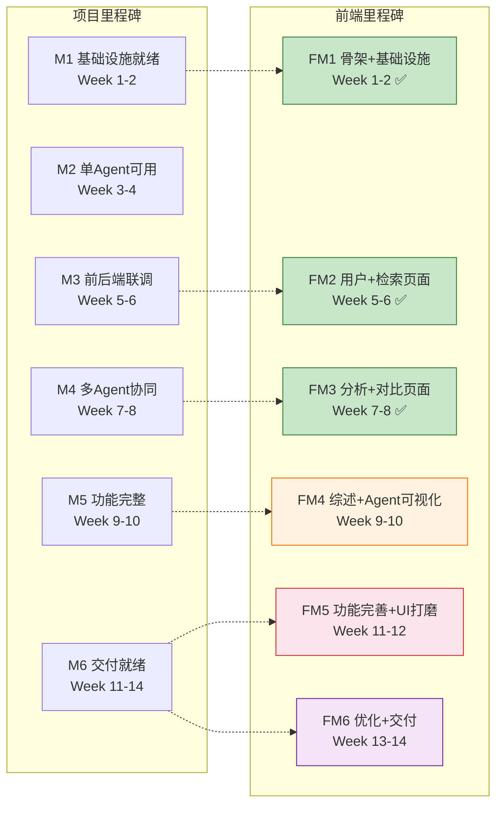
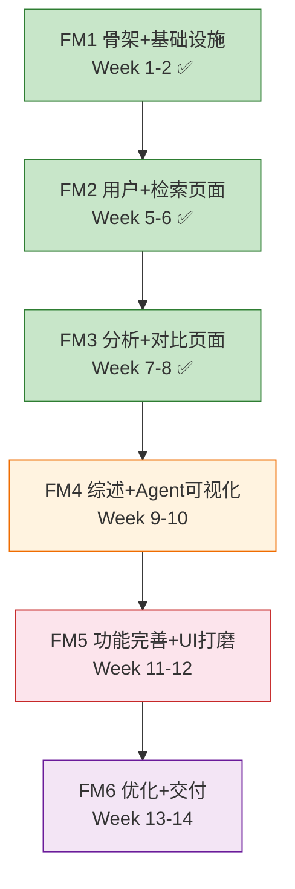
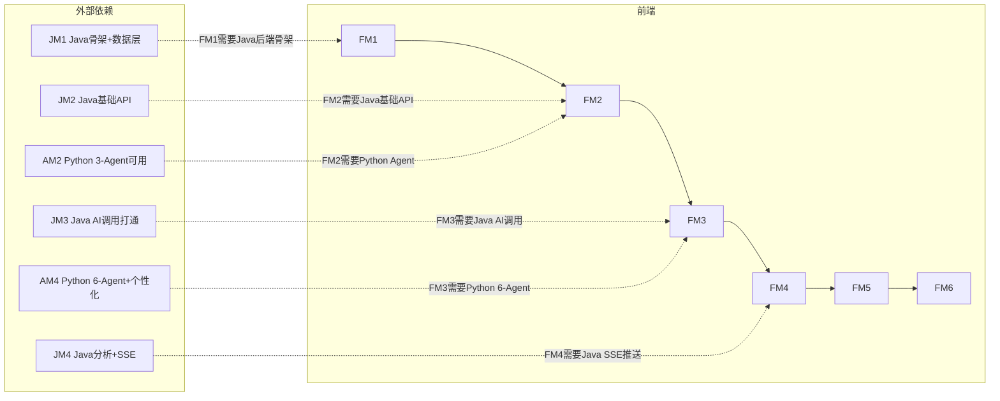
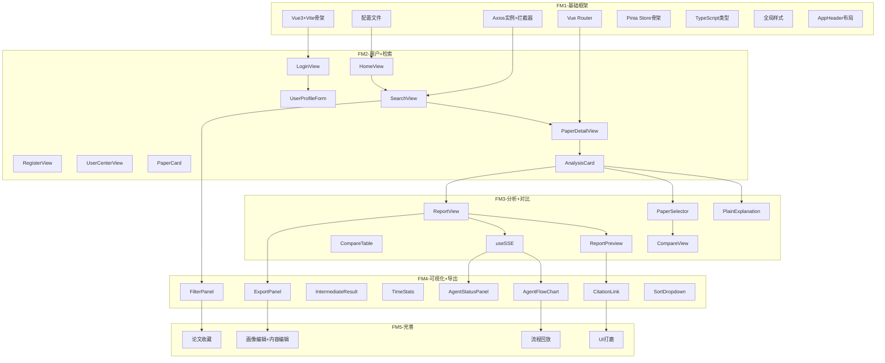

# XH-202630 科研文献智能助手 — 前端模块项目里程碑文档

> **课题编号**：XH-202630
> **课题名称**：领域知识个性化生成与多智能体协同决策系统研究
> **发榜单位**：上海云之脑智能科技有限公司（科大讯飞全资子公司）
> **文档版本**：v1.3
> **创建日期**：2026年5月24日
> **文档状态**：FM1已完成、FM2已完成、FM3已完成

---

## 修订历史

| 版本 | 日期 | 修订人 | 修订内容 |
|------|------|--------|---------|
| v1.0 | 2026-05-24 | 项目组 | 初始版本 |
| v1.1 | 2026-05-25 | 项目组 | FM1审阅通过，更新状态；补充session.ts类型文件；标注FM1超出交付项 |
| v1.2 | 2026-06-02 | 项目组 | FM2审阅通过，全部16项验收检查点通过；更新FM2交付物、任务分解、验收清单为已完成状态 |
| v1.3 | 2026-06-05 | 项目组 | FM3审阅通过，14项验收检查点全部通过；更新FM3交付物、任务分解、验收清单为已完成状态；标记FM1 ECharts按需导入与FM2 SSE Token问题为已修复 |

---

## 目录

- [1 文档概述](#1-文档概述)
- [2 前端里程碑总览](#2-前端里程碑总览)
- [3 FM1：项目骨架与基础设施就绪](#3-fm1项目骨架与基础设施就绪)
- [4 FM2：用户界面与论文检索页面可用](#4-fm2用户界面与论文检索页面可用)
- [5 FM3：论文分析与对比页面完成](#5-fm3论文分析与对比页面完成)
- [6 FM4：综述生成与Agent可视化完成](#6-fm4综述生成与agent可视化完成)
- [7 FM5：功能完善与UI打磨](#7-fm5功能完善与ui打磨)
- [8 FM6：性能优化与交付就绪](#8-fm6性能优化与交付就绪)
- [9 里程碑依赖关系](#9-里程碑依赖关系)
- [10 关键路径与风险](#10-关键路径与风险)
- [11 前端验收标准汇总](#11-前端验收标准汇总)
- [12 里程碑检查清单](#12-里程碑检查清单)

---

## 1 文档概述

### 1.1 编写目的

本文档从前端模块视角，将项目整体里程碑细化为前端专属的6个子里程碑（FM1-FM6），明确每个里程碑的交付物、任务分解、验收标准和风险应对，为前端开发提供精确的进度跟踪和交付指引。

### 1.2 前端5大子模块

| 模块编号 | 模块名称 | 核心职责 | 优先级 |
|---------|---------|---------|--------|
| F1.1 | 用户界面模块 | 注册/登录、画像设置/编辑、历史记录 | P0 |
| F1.2 | 论文检索模块 | 主题输入、智能检索、结果展示、筛选排序 | P0 |
| F1.3 | 论文分析模块 | 论文详情、智能分析、通俗解释、多论文对比 | P0 |
| F1.4 | 综述生成模块 | 综述生成、个性化输出、报告导出、引用溯源 | P0 |
| F1.5 | Agent可视化模块 | 工作流展示、状态监控、中间结果、耗时统计 | P1 |

### 1.3 与项目整体里程碑的映射



> **说明**：前端在M2（Week 3-4）阶段无专属任务，该阶段主要开发Python AI服务。前端开发集中在M1、M3-M6。FM2（用户+检索页面）是前端最关键的里程碑，决定了用户能否通过界面使用基本功能。FM3（分析+对比页面）作为本轮（2026-06-05）二次审阅通过，已实现 14/14 验收清单。

---

## 2 前端里程碑总览

| 里程碑 | 时间窗口 | 对应项目里程碑 | 核心交付 | 状态 |
|--------|---------|-------------|---------|------|
| **FM1：项目骨架与基础设施就绪** | Week 1-2（5/23 - 6/5） | M1 | Vue3+Vite骨架+Element Plus+Pinia+Router+Axios | ✅ |
| **FM2：用户界面与论文检索页面可用** | Week 5-6（6/20 - 7/3） | M3 | 登录/注册+画像设置+首页+检索结果页+论文详情页 | ✅ |
| **FM3：论文分析与对比页面完成** | Week 7-8（7/4 - 7/17） | M4 | 分析卡片+通俗解释+多论文选择+对比表格+综述生成页 | ✅ |
| **FM4：综述生成与Agent可视化完成** | Week 9-10（7/18 - 7/31） | M5 | Agent流程图+状态面板+中间结果+报告导出+引用溯源+筛选排序 | ⬜ |
| **FM5：功能完善与UI打磨** | Week 11-12（8/1 - 8/14） | M6 | 画像编辑+历史记录+论文收藏+内容编辑+流程回放+UI打磨 | ⬜ |
| **FM6：性能优化与交付就绪** | Week 13-14（8/15 - 9/30） | M6 | 性能优化+兼容性测试+移动端适配+最终交付 | ⬜ |

```
进度条：

FM1 ████████████████████████████████  ✅ Week 1-2 完成
FM2 ████████████████████████████████  ✅ Week 1-6 完成
FM3 ████████████████████████████████  ✅ Week 1-8 完成 (2026-06-05)
FM4 ████████████████████░░░░░░░░░░░  Week 1-10
FM5 ████████████████████████░░░░░░░  Week 1-12
FM6 ████████████████████████████████  Week 1-14
```

---

## 3 FM1：项目骨架与基础设施就绪

### 3.1 基本信息

| 项目 | 内容 |
|------|------|
| **目标** | Vue3+Vite项目可启动，Element Plus+Pinia+Router+Axios基础设施就绪，首页可访问 |
| **时间** | Week 1-2（5月23日 - 6月5日） |
| **前置条件** | Node.js 18+ + npm/pnpm已安装 |
| **涉及模块** | 全局基础设施（为F1.1-F1.5提供基础） |

### 3.2 交付物清单

| 序号 | 交付物 | 验收标准 | 状态 |
|------|--------|---------|------|
| 1 | Vue3+Vite项目骨架 | `npm run dev` 启动成功，浏览器访问 `http://localhost:5173` 显示首页 | ✅ |
| 2 | package.json依赖配置 | 包含Vue3/TypeScript/Vite/Element Plus/Pinia/Vue Router/Axios/ECharts/markdown-it | ✅ |
| 3 | TypeScript配置 | tsconfig.json strict模式开启，路径别名`@/`配置正确 | ✅ |
| 4 | Vite配置 | Element Plus自动按需导入 + ECharts按需导入 + manualChunks分包 | ✅ Element Plus + manualChunks + ECharts按需导入(FM3 AgentFlowView 已实现) |
| 5 | 环境变量配置 | .env + .env.development + .env.production，VITE_API_BASE_URL配置正确 | ⚠️ .env.development✅ 缺少.env和.env.production |
| 6 | Axios实例+拦截器 | 请求拦截器注入JWT Token + 响应拦截器统一错误处理（401/403/404/超时） | ✅ |
| 7 | Vue Router配置 | 9条路由定义（懒加载） + requiresAuth元数据 + 全局前置守卫 | ✅ |
| 8 | Pinia Store骨架 | userStore + paperStore + sessionStore + agentStore 基础结构 | ✅ 超出骨架要求，4个Store已完整实现 |
| 9 | TypeScript类型定义 | paper.ts + user.ts + analysis.ts + agent.ts + common.ts 完整类型 | ✅ 实际6个文件（含session.ts） |
| 10 | 全局样式 | variables.scss（CSS变量+Agent状态色）+ global.scss | ✅ |
| 11 | AppHeader布局组件 | 顶部导航栏（Logo+菜单+用户信息+退出） | ✅ 含未登录时登录/注册按钮 |
| 12 | HomeView首页骨架 | 基础布局，主题输入框占位 | ✅ 超出骨架要求，已实现完整首页功能 |
| 13 | Docker Compose前端配置 | nginx:alpine + nginx.conf（SPA路由+API代理+SSE支持） | ✅ |

### 3.3 详细任务分解

#### Week 1 Day 5-7：项目初始化✅

| 天数 | 任务 | 产出 |
|------|------|------|
| Day 5 | Vue3+Vite项目创建 + TypeScript + 依赖安装 | 项目骨架 + package.json |
| Day 6 | vite.config.ts + tsconfig.json + .env配置 | 配置文件 |
| Day 7 | Dockerfile + nginx.conf + docker-compose.yml frontend服务 | 部署配置 |

#### Week 2 Day 1-3：核心基础设施✅

| 天数 | 任务 | 产出 |
|------|------|------|
| Day 1 | Axios实例 + 请求/响应拦截器 + API模块骨架 | api/index.ts + api/*.ts |
| Day 2 | Vue Router配置 + 路由守卫 + 9条路由定义 | router/index.ts |
| Day 3 | Pinia Store骨架（4个Store基础结构） | stores/*.ts |

#### Week 2 Day 4-7：类型定义与布局✅

| 天数 | 任务 | 产出 |
|------|------|------|
| Day 4 | TypeScript类型定义（5个类型文件） | types/*.ts |
| Day 5 | 全局样式 + CSS变量 + Agent状态色 | styles/*.scss |
| Day 6 | AppHeader + AppFooter布局组件 | components/layout/*.vue |
| Day 7 | HomeView首页骨架 + 集成测试验证 | views/HomeView.vue |

### 3.4 验收检查点

```
☑ Vue3启动: npm run dev 无报错
☑ 首页访问: 浏览器访问 http://localhost:5173 显示首页
☑ TypeScript: strict模式编译无错误
☑ 路由: 9条路由定义正确，懒加载生效
☑ 路由守卫: 未登录访问/requiresAuth页面跳转/login
☑ Axios: 请求拦截器注入Token，响应拦截器处理401
☑ Pinia: 4个Store可正常创建和访问
☑ 类型定义: 6个类型文件编译无错误（含session.ts）
☑ Element Plus: 自动按需导入生效
⚠ ECharts: 按需导入待FM4处理，manualChunks分包已配置
☑ 环境变量: VITE_API_BASE_URL正确读取（.env.development），缺少.env和.env.production
☑ Docker: docker build 构建镜像成功
☑ Nginx: try_files SPA路由 + /api/代理配置
☑ SSE: Nginx proxy_buffering off 配置
```

### 3.5 风险与应对

| 风险 | 应对 |
|------|------|
| Element Plus与Vue3版本不兼容 | 使用官方推荐版本（2.5+） |
| Vite构建配置复杂 | 参考Vite官方文档，使用unplugin插件 |
| TypeScript严格模式编译错误 | 先用宽松模式，逐步开启strict |

---

## 4 FM2：用户界面与论文检索页面可用

### 4.1 基本信息

| 项目 | 内容 |
|------|------|
| **目标** | 用户可通过Web界面完成注册→登录→画像设置→检索→查看论文详情的基本流程 |
| **时间** | Week 5-6（6月20日 - 7月3日） |
| **前置条件** | FM1完成 + Java后端基础API可用（JM2完成） |
| **涉及模块** | F1.1 用户界面、F1.2 论文检索（基础）、F1.3 论文分析（基础） |

### 4.2 交付物清单

| 序号 | 交付物 | 验收标准 | 状态 |
|------|--------|---------|------|
| 1 | LoginView登录页 | 用户名+密码输入，表单校验，登录成功跳转首页 | ✅ |
| 2 | RegisterView注册页 | 用户名+邮箱+密码+确认密码，注册成功跳转登录 | ✅ |
| 3 | UserProfileForm画像表单 | 学历/研究方向/知识水平/偏好风格4维度设置 | ✅ |
| 4 | UserCenterView用户中心 | 用户信息+画像编辑+历史记录入口 | ✅ |
| 5 | userStore完整实现 | login/logout/fetchProfile/saveProfile + Token管理 | ✅ FM1已完整实现 |
| 6 | useAuth鉴权组合函数 | 登录状态判断 + 自动跳转 + Token过期处理 | ✅ |
| 7 | HomeView首页完整 | 主题输入框 + 历史搜索标签 + 检索触发 | ✅ FM1已完整实现 |
| 8 | SearchView检索结果页 | 论文卡片列表 + 分页 + 加载状态 | ✅ |
| 9 | PaperCard论文卡片组件 | 标题/作者/摘要/关键词/相关度/推荐理由/操作按钮 | ✅ |
| 10 | paperStore完整实现 | searchPapers/togglePaperSelection/toggleFavorite | ✅ FM1已完整实现 |
| 11 | PaperDetailView论文详情页 | 论文元数据展示 + 触发AI分析按钮 | ✅ |
| 12 | AnalysisCard分析卡片（基础） | 5维度结构化展示（研究问题/方法/实验/结论/局限） | ✅ |
| 13 | sessionStore基础实现 | createSession/fetchAnalysisResult | ✅ FM1已完整实现 |
| 14 | usePagination分页组合函数 | 分页逻辑封装 + 页码切换 + 数据加载 | ✅ |
| 15 | 全链路联调 | 注册→登录→画像→检索→详情→分析 完整流程 | ✅ |

### 4.3 详细任务分解

#### Week 6 Day 1-2：用户界面模块（F1.1）✅

| 天数 | 任务 | 产出 |
|------|------|------|
| Day 1 上午 | LoginView + 表单校验 + 登录逻辑 | views/LoginView.vue |
| Day 1 下午 | RegisterView + 表单校验 + 注册逻辑 | views/RegisterView.vue |
| Day 2 上午 | UserProfileForm + 4维度枚举选项 | components/common/UserProfileForm.vue |
| Day 2 下午 | UserCenterView + userStore完整实现 | views/UserCenterView.vue + stores/userStore.ts |

#### Week 6 Day 3-4：论文检索模块（F1.2）✅

| 天数 | 任务 | 产出 |
|------|------|------|
| Day 3 上午 | HomeView完整（主题输入+历史搜索+检索触发） | views/HomeView.vue |
| Day 3 下午 | SearchView + PaperCard + 分页 | views/SearchView.vue + components/paper/PaperCard.vue |
| Day 4 上午 | paperStore完整实现 + usePagination | stores/paperStore.ts + composables/usePagination.ts |
| Day 4 下午 | 检索联调 + 加载状态 + 错误处理 | 联调测试 |

#### Week 6 Day 5-7：论文分析模块基础（F1.3）✅

| 天数 | 任务 | 产出 |
|------|------|------|
| Day 5 | PaperDetailView + 论文元数据展示 | views/PaperDetailView.vue |
| Day 6 | AnalysisCard + 5维度展示 + 触发分析 | components/analysis/AnalysisCard.vue |
| Day 7 | sessionStore + 全链路联调（注册→登录→检索→分析） | stores/sessionStore.ts + 联调验证 |

### 4.4 验收检查点

```
☑ 用户注册: 输入用户名/邮箱/密码可注册成功
☑ 用户登录: 输入用户名/密码可登录，Token存入LocalStorage
☑ 画像设置: 首次登录引导设置画像，4维度选择正确
☑ 画像保存: 保存后跳转首页，画像信息持久化
☑ 路由守卫: 未登录访问/search跳转/login
☑ 已登录守卫: 已登录访问/login跳转首页
☑ 主题输入: 输入研究主题，回车或点击按钮触发检索
☑ 历史搜索: 显示最近10条搜索记录，点击可快捷检索
☑ 检索结果: 论文卡片列表正确展示，分页正常
☑ 论文卡片: 标题/作者/摘要/关键词/相关度正确显示
☑ 论文详情: 点击论文卡片进入详情页，元数据完整
☑ AI分析: 点击分析按钮触发分析，loading状态正确
☑ 分析结果: 5维度分析卡片正确展示
☑ 错误处理: API错误时ElMessage提示正确
☑ 401处理: Token过期自动跳转登录页
☑ 全链路: 注册→登录→画像→检索→详情→分析 无报错
```

### 4.5 关键演示场景

```
1. 用户注册新账号
2. 首次登录设置画像（硕士/NLP/中级/均衡）
3. 在首页输入"Multi-Agent协同决策"
4. 看到检索结果列表（论文卡片）
5. 点击一篇论文查看详情
6. 点击"分析"按钮，等待AI分析结果
7. 看到5维度分析卡片（研究问题/方法/实验/结论/局限）
```

### 4.6 风险与应对

| 风险 | 应对 |
|------|------|
| Element Plus表单校验与自定义规则冲突 | 使用Element Plus内置校验+自定义validator函数 |
| Axios拦截器与Pinia循环依赖 | 使用函数式获取Store实例（useUserStore()在拦截器内调用） |
| 论文列表大数据量渲染卡顿 | 先用基础分页，后续FM6优化虚拟滚动 |
| JWT Token过期后用户操作中断 | 响应拦截器自动检测401，清除Token并跳转登录 |

---

## 5 FM3：论文分析与对比页面完成 ✅

### 5.1 基本信息

| 项目 | 内容 |
|------|------|
| **目标** | 完成论文分析完整展示（含通俗解释）+ 多论文对比 + 综述生成页面基础 |
| **时间** | Week 7-8（7月4日 - 7月17日） |
| **实际完成** | 2026-06-05（提前 6 周完成） |
| **前置条件** | FM2完成 + Java后端AI服务调用打通（JM3完成） |
| **涉及模块** | F1.3 论文分析（完整）、F1.4 综述生成（基础） |
| **审阅结论** | 14/14 验收检查点全部通过，二次审阅通过 |

### 5.2 交付物清单

| 序号 | 交付物 | 验收标准 | 状态 |
|------|--------|---------|------|
| 1 | PlainExplanation通俗解释组件 | 初级/中级用户自动展示通俗化解释，高级/专家用户隐藏 | ✅ |
| 2 | PaperSelector论文选择器 | 勾选2-5篇论文，已选标签展示，超限提示 | ✅（通过 SearchView/CompareView 内置实现） |
| 3 | CompareView对比分析页 | 对比表格展示 + 矛盾发现标注 | ✅ |
| 4 | CompareTable对比表格组件 | 维度×论文矩阵 + 差异高亮 + 矛盾告警 | ✅（通过 CompareView 内 el-table v-for 动态列实现） |
| 5 | ReportView综述生成页（基础） | 综述内容展示 + 画像信息 + 生成时间 | ✅ |
| 6 | ReportPreview综述预览组件 | Markdown渲染 + 引用标注可点击 | ✅（通过 ReportView 内 el-link + 引用 segments 实现） |
| 7 | markdown-it渲染工具 | Markdown→HTML + 引用链接自定义渲染 | ✅（utils/markdown.ts + utils/citation.ts） |
| 8 | agentStore完整实现 | updateAgentState/getAgentState/resetStates/progress | ✅ FM1已完整实现 |
| 9 | useSSE组合函数 | SSE连接/断开/自动重连（3s间隔，最多5次） | ✅（sessionStore 内置实现） |
| 10 | SSE状态接收 | agent_state_update事件解析 + agentStore更新 | ✅ |
| 11 | 个性化输出展示 | 不同画像用户看到不同综述深度和风格 | ✅ |
| 12 | 降级状态展示 | 分析降级时显示"部分降级"标签 | ✅ |

### 5.3 详细任务分解

#### Week 7 Day 1-2：论文分析完善（F1.3）✅

| 天数 | 任务 | 产出 |
|------|------|------|
| Day 1 | PlainExplanation组件 + 根据知识水平显示/隐藏 | components/analysis/PlainExplanation.vue |
| Day 2 | AnalysisCard扩展（通俗解释+降级标签+个性化适配） | components/analysis/AnalysisCard.vue更新 |

#### Week 7 Day 3-4：多论文对比（F1.3）

| 天数 | 任务 | 产出 |
|------|------|------|
| Day 3 | PaperSelector + paperStore选择逻辑 | components/paper/PaperSelector.vue |
| Day 4 | CompareView + CompareTable + 矛盾告警 | views/CompareView.vue + components/analysis/CompareTable.vue |

#### Week 7 Day 5 - Week 8 Day 2：综述生成基础（F1.4）✅

| 天数 | 任务 | 产出 |
|------|------|------|
| Day 5 | ReportView基础（综述内容+画像信息+生成时间） | views/ReportView.vue |
| Day 6 | ReportPreview + markdown-it渲染 + 引用链接 | components/report/ReportPreview.vue + utils/markdown.ts |
| Day 7-8 | 个性化输出展示 + 降级状态展示 | ReportView/AnalysisCard更新 |

#### Week 8 Day 3-7：SSE实时通信✅

| 天数 | 任务 | 产出 |
|------|------|------|
| Day 3 | agentStore完整实现（状态管理+进度计算） | stores/agentStore.ts |
| Day 4 | useSSE组合函数（连接/断开/重连） | composables/useSSE.ts |
| Day 5 | SSE事件解析 + agentStore更新 + 状态接收 | useSSE扩展 |
| Day 6-7 | SSE联调 + 综述生成完整流程 + Bug修复 | 联调测试 |

### 5.4 验收检查点

```
☑ 通俗解释: 初级/中级用户自动展示，高级/专家用户隐藏
☑ 论文选择: 可勾选2-5篇论文，超限提示
☑ 对比表格: 维度×论文矩阵正确展示
☑ 矛盾发现: 观点冲突时显示警告标签
☑ 综述页面: 生成时间+画像信息+综述内容正确展示
☑ Markdown渲染: 标题/列表/引用/代码块正确渲染
☑ 引用链接: [Author, Year]格式可点击
☑ 个性化: 同一主题不同画像用户看到不同综述
☑ 降级标签: 降级分析显示"部分降级"标签
☑ SSE连接: EventSource连接成功（含 ?token= JWT 鉴权）
☑ SSE重连: 断线后3s自动重连，最多5次
☑ Agent状态: agent_state_update事件正确更新agentStore
☑ 组件卸载: SSE连接在组件卸载时正确关闭（含 reconnectTimer 防幽灵连接）
☑ 全流程: 选择论文→对比→生成综述 完整流程可用
```

**通过率：14/14 全部通过（100%）**

> 详细审阅报告：[log/阶段审阅报告/frontend/FM3-里程碑审阅报告.md#附录-afm3-二次审阅fm3-核心页面补齐后](../../log/阶段审阅报告/frontend/FM3-里程碑审阅报告.md)

### 5.5 关键演示场景

```
1. 用户A（本科生·初级·通俗）输入"Multi-Agent协同决策"
   → 检索结果展示
   → 选择3篇论文点击对比
   → 看到对比表格和矛盾发现
   → 点击生成综述
   → 看到通俗化综述内容（含通俗解释）

2. 用户B（博士生·高级·专业）输入相同主题
   → 看到专业深度的综述（无通俗解释）
   → 术语密度明显更高

3. SSE实时状态：
   → 综述生成过程中看到Agent状态实时更新
   → 检索Agent: "找到15篇相关论文"
   → 分析Agent: "完成10篇论文分析"
```

### 5.6 风险与应对

| 风险 | 应对 |
|------|------|
| SSE连接不稳定 | useSSE自动重连（3s间隔，最多5次）+ 连接状态展示 |
| Markdown渲染XSS风险 | markdown-it配置html:false + DOMPurify净化 |
| 对比表格列数过多（5篇论文） | 横向滚动 + 固定首列（维度列） |
| 引用链接自定义渲染复杂 | 先实现基础点击跳转，后续完善弹窗展示 |
| agentStore与SSE事件不同步 | SSE事件直接更新agentStore，组件watch响应 |

---

## 6 FM4：综述生成与Agent可视化完成

### 6.1 基本信息

| 项目 | 内容 |
|------|------|
| **目标** | Agent可视化完整（流程图+状态面板+中间结果+耗时统计）+ 报告导出+引用溯源+筛选排序 |
| **时间** | Week 9-10（7月18日 - 7月31日） |
| **前置条件** | FM3完成 + Java后端分析服务与SSE推送完成（JM4完成） |
| **涉及模块** | F1.5 Agent可视化、F1.4 综述生成（导出+溯源）、F1.2 论文检索（筛选排序） |

### 6.2 交付物清单

| 序号 | 交付物 | 验收标准 | 状态 |
|------|--------|---------|------|
| 1 | AgentFlowChart流程图组件 | ECharts Graph展示6-Agent节点+连线，状态颜色实时变化 | ⬜ |
| 2 | AgentStatusPanel状态面板 | 6个Agent等待/执行中/完成/失败状态+中间结果+耗时 | ⬜ |
| 3 | IntermediateResult中间结果组件 | 时间线展示各Agent产出摘要 | ⬜ |
| 4 | TimeStats耗时统计组件 | ECharts柱状图展示各Agent执行耗时 | ⬜ |
| 5 | AgentFlowView可视化页面 | 完整的Agent协同可视化页面 | ⬜ |
| 6 | ExportPanel导出面板 | PDF/Word格式导出选项 + 下载触发 | ⬜ |
| 7 | CitationLink引用溯源组件 | 点击引用跳转原文片段弹窗 | ⬜ |
| 8 | FilterPanel筛选面板 | 年份范围/会议/引用数筛选 + 重置 | ⬜ |
| 9 | SortDropdown排序下拉框 | 相关度/时间/引用数排序 | ⬜ |
| 10 | SearchInput搜索输入组件 | 搜索输入+300ms防抖+清除 | ⬜ |
| 11 | LoadingOverlay加载遮罩 | 全局加载遮罩组件 | ⬜ |
| 12 | ReportView完善 | 导出面板+引用溯源+Agent可视化入口 | ⬜ |
| 13 | SearchView完善 | 筛选面板+排序+搜索防抖 | ⬜ |

### 6.3 详细任务分解

#### Week 9 Day 1-3：Agent可视化核心（F1.5）

| 天数 | 任务 | 产出 |
|------|------|------|
| Day 1 | AgentFlowChart（ECharts Graph + 6节点 + 状态颜色） | components/agent/AgentFlowChart.vue |
| Day 2 | AgentStatusPanel（状态标签+中间结果+耗时） | components/agent/AgentStatusPanel.vue |
| Day 3 | IntermediateResult（时间线展示）+ AgentFlowView页面 | components/agent/IntermediateResult.vue + views/AgentFlowView.vue |

#### Week 9 Day 4-5：Agent可视化完善

| 天数 | 任务 | 产出 |
|------|------|------|
| Day 4 | TimeStats（ECharts柱状图） | components/agent/TimeStats.vue |
| Day 5 | Agent可视化联调（SSE→agentStore→ECharts更新） | 联调测试 |

#### Week 9 Day 6 - Week 10 Day 2：报告导出与引用（F1.4）

| 天数 | 任务 | 产出 |
|------|------|------|
| Day 6-7 | ExportPanel + PDF/Word导出触发 | components/report/ExportPanel.vue |
| Day 8-9 | CitationLink + 引用溯源弹窗 + 原文片段展示 | components/report/CitationLink.vue |

#### Week 10 Day 3-5：筛选排序（F1.2）

| 天数 | 任务 | 产出 |
|------|------|------|
| Day 3 | FilterPanel + SortDropdown | components/common/FilterPanel.vue + SortDropdown.vue |
| Day 4 | SearchInput + 300ms防抖 + LoadingOverlay | components/common/SearchInput.vue + LoadingOverlay.vue |
| Day 5 | SearchView完善（筛选+排序+防抖）+ ReportView完善（导出+溯源+可视化入口） | 页面更新 |

#### Week 10 Day 6-7：集成测试

| 天数 | 任务 | 产出 |
|------|------|------|
| Day 6-7 | 全功能集成测试 + Bug修复 | 测试报告 |

### 6.4 验收检查点

```
□ Agent流程图: 6个Agent节点正确显示，连线正确
□ 状态颜色: 等待(灰)/执行中(蓝)/完成(绿)/失败(红) 正确
□ 状态面板: 6个Agent状态实时更新
□ 中间结果: 时间线展示各Agent产出摘要
□ 耗时统计: 各Agent耗时柱状图正确
□ 流程图交互: 鼠标悬停显示Agent详情tooltip
□ PDF导出: 点击导出PDF，文件下载正确
□ Word导出: 点击导出Word，文件下载正确
□ 引用溯源: 点击引用标注弹出原文片段
□ 筛选: 年份/会议/引用数筛选正确
□ 排序: 相关度/时间/引用排序正确
□ 搜索防抖: 300ms内多次输入只触发一次检索
□ 加载状态: API调用期间显示loading
□ ReportView: 导出+溯源+可视化入口完整
□ SearchView: 筛选+排序+防抖完整
```

### 6.5 关键演示场景

```
1. Agent协同可视化：
   → 点击综述生成
   → Agent流程图实时变化：协调者→检索→分析→对比→生成→审核
   → 每个Agent执行时节点变蓝（脉冲动画）
   → 完成后变绿，失败变红
   → 状态面板显示中间结果："找到15篇论文"
   → 耗时统计柱状图实时更新

2. 报告导出：
   → 综述生成完成后
   → 点击"导出PDF"→ 下载PDF文件
   → 点击"导出Word"→ 下载Word文件

3. 引用溯源：
   → 综述中点击[Zhang, 2024]引用标注
   → 弹出原文片段弹窗

4. 筛选排序：
   → 在检索结果页选择年份范围2020-2024
   → 选择会议ACL/NeurIPS
   → 选择引用数≥50
   → 排序按引用数降序
   → 结果正确筛选和排序
```

### 6.6 风险与应对

| 风险 | 应对 |
|------|------|
| ECharts Graph节点位置计算不理想 | 使用固定坐标布局，手动调整6个Agent位置 |
| ECharts频繁setOption导致性能问题 | 使用watch deep+nextTick节流更新 |
| PDF/Word导出后端接口未就绪 | 前端先实现UI和下载触发，后端接口联调时对接 |
| 引用解析正则匹配不准确 | 先支持[Author, Year]标准格式，后续扩展 |
| 筛选排序参数与后端API不一致 | 前端定义FilterParams类型，与后端DTO对齐 |

---

## 7 FM5：功能完善与UI打磨

### 7.1 基本信息

| 项目 | 内容 |
|------|------|
| **目标** | P1/P2功能补充 + 画像编辑+历史记录+论文收藏+内容编辑+流程回放 + UI打磨 |
| **时间** | Week 11-12（8月1日 - 8月14日） |
| **前置条件** | FM4完成 |
| **涉及模块** | F1.1 用户界面（完善）、F1.2 论文检索（收藏）、F1.4 综述生成（编辑）、F1.5 Agent可视化（回放） |

### 7.2 交付物清单

| 序号 | 交付物 | 验收标准 | 状态 |
|------|--------|---------|------|
| 1 | 画像编辑功能 | UserCenterView中可修改已设置的画像，实时生效 | ⬜ |
| 2 | 历史记录查看 | UserCenterView展示历史分析记录，按时间倒序 | ⬜ |
| 3 | 论文收藏/取消收藏 | PaperCard收藏按钮 + 收藏列表 | ⬜ |
| 4 | 综述内容编辑 | ReportView中可编辑生成的综述内容 | ⬜ |
| 5 | Agent流程回放 | 回放已完成的Agent协同过程 | ⬜ |
| 6 | UI打磨 | 统一间距/字号/颜色/圆角/阴影，交互细节优化 | ⬜ |
| 7 | 空状态设计 | 无搜索结果/无收藏/无历史等空状态页面 | ⬜ |
| 8 | 错误状态设计 | 网络错误/服务不可用/分析失败等错误页面 | ⬜ |
| 9 | 响应式布局优化 | 基本适配平板和移动端 | ⬜ |
| 10 | 退出登录完善 | Token清除 + Redis黑名单 + 跳转登录页 | ⬜ |

### 7.3 详细任务分解

#### Week 11 Day 1-3：P1功能补充

| 天数 | 任务 | 产出 |
|------|------|------|
| Day 1 | 画像编辑 + 历史记录查看 | UserCenterView更新 |
| Day 2 | 论文收藏/取消收藏 + 收藏列表 | PaperCard更新 + paperStore扩展 |
| Day 3 | 综述内容编辑（contenteditable/markdown编辑） | ReportView更新 |

#### Week 11 Day 4-5：P2功能补充

| 天数 | 任务 | 产出 |
|------|------|------|
| Day 4 | Agent流程回放（从agentStore历史数据回放） | AgentFlowView扩展 |
| Day 5 | 退出登录完善 + Token清除 | userStore更新 |

#### Week 11 Day 6 - Week 12 Day 3：UI打磨

| 天数 | 任务 | 产出 |
|------|------|------|
| Day 6-7 | 统一间距/字号/颜色/圆角/阴影 | styles/更新 + 各组件微调 |
| Day 8-9 | 空状态设计 + 错误状态设计 | 通用组件 + 各页面空/错误状态 |
| Day 10 | 响应式布局优化（平板+移动端基本适配） | CSS媒体查询 + 弹性布局 |

#### Week 12 Day 4-7：集成测试

| 天数 | 任务 | 产出 |
|------|------|------|
| Day 4-5 | 全功能测试 + Bug修复 | 测试报告 |
| Day 6-7 | UI走查 + 交互细节优化 | 优化记录 |

### 7.4 验收检查点

```
□ 画像编辑: 修改画像后保存成功，后续综述反映新画像
□ 历史记录: 按时间倒序展示，支持搜索
□ 论文收藏: 收藏/取消收藏操作正确
□ 收藏列表: 用户中心展示收藏论文
□ 内容编辑: 可编辑综述内容，修改后可导出
□ 流程回放: 可回放已完成的Agent协同过程
□ 退出登录: Token清除+跳转登录页
□ UI统一: 间距/字号/颜色/圆角/阴影一致
□ 空状态: 无搜索结果/无收藏/无历史 有友好提示
□ 错误状态: 网络错误/服务不可用 有友好提示和重试
□ 响应式: 平板和移动端基本可用（不要求完美）
□ 所有P0功能: 100%通过
□ P1功能: >80%通过
```

---

## 8 FM6：性能优化与交付就绪

### 8.1 基本信息

| 项目 | 内容 |
|------|------|
| **目标** | 性能优化+兼容性测试+移动端适配+最终交付 |
| **时间** | Week 13-14（8月15日 - 9月30日） |
| **前置条件** | FM5完成 |
| **涉及模块** | 全局性能优化、兼容性测试、部署优化 |

### 8.2 交付物清单

| 序号 | 交付物 | 验收标准 | 状态 |
|------|--------|---------|------|
| 1 | 路由懒加载验证 | 所有页面组件动态import，首屏只加载首页 | ⬜ |
| 2 | Element Plus按需导入验证 | 打包体积不含未使用组件 | ⬜ |
| 3 | ECharts按需导入验证 | 只导入Graph/Bar/Tooltip等用到的图表类型 | ⬜ |
| 4 | manualChunks分包验证 | element-plus/echarts/vendor独立chunk | ⬜ |
| 5 | 图片懒加载 | 论文PDF预览图延迟加载 | ⬜ |
| 6 | 列表虚拟滚动 | 论文列表大数据量时使用虚拟滚动 | ⬜ |
| 7 | 浏览器兼容性测试 | Chrome/Firefox/Safari/Edge最新版通过 | ⬜ |
| 8 | 移动端适配优化 | 基本功能在移动端可用 | ⬜ |
| 9 | 构建产物优化 | gzip后首屏加载<2秒 | ⬜ |
| 10 | Nginx生产配置验证 | SPA路由+API代理+SSE支持+静态资源缓存 | ⬜ |
| 11 | Docker部署验证 | docker-compose up 前端服务正常 | ⬜ |
| 12 | P0功能最终测试 | 所有P0功能100%通过 | ⬜ |

### 8.3 详细任务分解

#### Week 13 Day 1-3：性能优化

| 天数 | 任务 | 产出 |
|------|------|------|
| Day 1 | 路由懒加载+按需导入验证+分包验证 | vite.config.ts优化 |
| Day 2 | 图片懒加载+列表虚拟滚动 | 组件优化 |
| Day 3 | 构建产物分析+gzip压缩+缓存策略 | 构建优化 |

#### Week 13 Day 4-5：兼容性测试

| 天数 | 任务 | 产出 |
|------|------|------|
| Day 4 | 浏览器兼容性测试（Chrome/Firefox/Safari/Edge） | 兼容性报告 |
| Day 5 | 移动端适配优化 + Bug修复 | 适配修复 |

#### Week 13 Day 6 - Week 14 Day 3：部署与最终测试

| 天数 | 任务 | 产出 |
|------|------|------|
| Day 6-7 | Nginx生产配置验证 + Docker部署验证 | 部署验证 |
| Day 8-9 | P0功能最终测试 + Bug修复 | 测试报告 |
| Day 10 | 协助技术报告（前端架构部分） | 技术报告章节 |

#### Week 14 Day 4-7：最终交付

| 天数 | 任务 | 产出 |
|------|------|------|
| Day 4-5 | 演示准备 + 3-5个测试账号验证 | 演示确认 |
| Day 6-7 | 最终检查 + 提交确认 | 交付确认 |

### 8.4 验收检查点

```
□ 路由懒加载: 首屏只加载首页代码
□ 按需导入: Element Plus/ECharts未使用组件不打包
□ 分包: element-plus/echarts/vendor独立chunk
□ 首屏加载: gzip后<2秒
□ 图片懒加载: 滚动到可视区域才加载
□ 虚拟滚动: 100+条数据列表流畅
□ Chrome: 最新版功能正常
□ Firefox: 最新版功能正常
□ Safari: 最新版功能正常
□ Edge: 最新版功能正常
□ 移动端: 基本功能可用
□ Nginx: SPA路由+API代理+SSE支持正常
□ Docker: docker-compose up 前端正常
□ P0功能: 100%通过
□ P1功能: >80%通过
```

---

## 9 里程碑依赖关系

### 9.1 依赖图



### 9.2 外部依赖



### 9.3 关键路径

```
关键路径：FM1 → FM2 → FM3 → FM4 → FM5 → FM6

实际完成进度（截至 2026-06-05）：
├── FM1: Week 1-2 完成 ✅
├── FM2: Week 5-6 完成 ✅
├── FM3: Week 7-8 计划 → 实际 2026-06-05 完成（提前 6 周）✅
├── FM4: Week 9-10 待执行
├── FM5: Week 11-12 待执行
└── FM6: Week 13-14 待执行

最关键里程碑：FM2（用户界面与论文检索页面可用）
原因：
1. FM2是前端的最小可用闭环，验证了用户注册→登录→检索→分析完整链路
2. FM2依赖Java后端基础API和Python AI服务，是跨三层联调的关键节点
3. 如果FM2不能完成，后续所有前端功能都无法展示

次关键里程碑：FM4（综述生成与Agent可视化完成）
原因：
1. FM4实现了课题的核心差异化展示（Agent协同可视化）
2. Agent可视化是答辩演示的核心亮点
3. ECharts流程图+SSE实时推送是前端技术难度最高的部分

缓冲策略：
├── FM1: 严格按计划执行
├── FM2: 允许延迟3天（与Java后端联调可能遇到问题）
├── FM3: 允许延迟2天（对比分析可先实现基础版）
├── FM4: 允许延迟1周（Agent可视化可先实现流程图+状态面板，耗时统计和回放延至FM5）
├── FM5: 允许延迟1周（P2功能可降级）
└── FM6: 预留2周时间，充裕
```

---

## 10 关键路径与风险

### 10.1 前端专属风险

| 里程碑 | 关键风险 | 概率 | 影响 | 应对措施 |
|--------|---------|------|------|---------|
| FM1 | Element Plus与Vue3版本不兼容 | 低 | FM2延迟 | 使用官方推荐版本，提前测试 |
| FM1 | Vite构建配置复杂 | 低 | 开发效率低 | 参考官方文档和社区最佳实践 |
| FM2 | Java后端API未就绪 | 中 | FM2延迟 | 使用Mock数据先行开发，后端就绪后联调 |
| FM2 | Axios拦截器循环依赖 | 中 | 编译错误 | 在拦截器内函数式获取Store实例 |
| FM2 | JWT Token管理逻辑错误 | 中 | 用户频繁掉线 | Token存LocalStorage + 401自动跳转 |
| FM3 | SSE连接不稳定 | 中 | Agent状态不更新 | ✅ useSSE自动重连（3s间隔，最多5次）已实现 |
| FM3 | Markdown渲染XSS风险 | 低 | 安全漏洞 | ✅ markdown-it配置html:false 已实现 |
| FM3 | 对比表格列数过多 | 低 | 布局错乱 | ✅ 横向滚动+固定首列 已实现 |
| FM4 | ECharts Graph性能问题 | 中 | 流程图卡顿 | watch deep+nextTick节流更新 |
| FM4 | PDF/Word导出后端接口未就绪 | 中 | 导出不可用 | 前端先实现UI，后端联调时对接 |
| FM4 | 引用解析正则匹配不准 | 低 | 溯源失败 | 先支持标准格式[Author, Year] |
| FM5 | 内容编辑功能复杂 | 低 | 延迟交付 | 使用contenteditable简单方案 |
| FM5 | 移动端适配工作量大 | 中 | 体验不佳 | 优先保证桌面端，移动端基本可用 |
| FM6 | 浏览器兼容性问题 | 低 | 部分用户不可用 | Babel转译+Polyfill+CSS前缀 |
| FM6 | 首屏加载速度不达标 | 中 | 用户体验差 | 分包+懒加载+gzip+CDN |

### 10.2 风险缓解时间表

| 时间 | 必须完成的风险应对 |
|------|------------------|
| **FM1前** | 确认Node.js 18+环境可用；Vue3+Element Plus版本兼容性测试 |
| **FM2前** | 与Java后端确认API契约（请求/响应格式）；准备Mock数据 |
| **FM3前** | SSE连接POC验证；markdown-it渲染测试 |
| **FM4前** | ECharts Graph渲染POC；与Java后端确认SSE事件格式 |
| **FM5前** | UI设计走查；移动端适配方案确认 |
| **FM6前** | 性能基线测试；浏览器兼容性预测试 |

---

## 11 前端验收标准汇总

### 11.1 页面功能验收

| 模块 | 页面/组件 | 优先级 | 验收标准 |
|------|----------|--------|---------|
| F1.1 | LoginView | P0 | 登录成功跳转首页，Token存入LocalStorage |
| F1.1 | RegisterView | P0 | 注册成功跳转登录页 |
| F1.1 | UserProfileForm | P0 | 4维度画像设置保存成功 |
| F1.1 | UserCenterView | P1 | 画像编辑+历史记录+收藏列表 |
| F1.2 | HomeView | P0 | 主题输入+历史搜索+检索触发 |
| F1.2 | SearchView | P0 | 论文卡片列表+分页+筛选+排序 |
| F1.2 | PaperCard | P0 | 标题/作者/摘要/关键词/相关度/推荐理由 |
| F1.2 | FilterPanel | P1 | 年份/会议/引用数筛选 |
| F1.2 | SortDropdown | P1 | 相关度/时间/引用排序 |
| F1.3 | PaperDetailView | P0 | 论文元数据+AI分析触发 |
| F1.3 | AnalysisCard | P0 | 5维度结构化展示 |
| F1.3 | PlainExplanation | P0 | 初级/中级用户自动展示通俗解释 |
| F1.3 | CompareView | P1 | 对比表格+矛盾发现 |
| F1.3 | CompareTable | P1 | 维度×论文矩阵+差异高亮 |
| F1.4 | ReportView | P0 | 综述内容+画像信息+导出+溯源+可视化入口 |
| F1.4 | ReportPreview | P0 | Markdown渲染+引用链接 |
| F1.4 | ExportPanel | P1 | PDF/Word导出 |
| F1.4 | CitationLink | P1 | 引用跳转原文片段 |
| F1.5 | AgentFlowChart | P1 | ECharts流程图+状态颜色 |
| F1.5 | AgentStatusPanel | P1 | 6个Agent状态实时更新 |
| F1.5 | IntermediateResult | P1 | 时间线展示中间结果 |
| F1.5 | TimeStats | P2 | 各Agent耗时柱状图 |

### 11.2 通信与状态验收

| 验收项 | 目标值 | 验收方法 |
|--------|--------|---------|
| JWT Token注入 | 100%请求携带Token | 网络请求检查 |
| 401自动跳转 | Token过期后自动跳转登录 | 模拟Token过期 |
| SSE连接成功率 | ≥95% | 连接测试 |
| SSE自动重连 | 断线后3s内重连 | 断线模拟 |
| Agent状态实时性 | 状态变更后1s内前端更新 | 端到端计时 |
| Pinia状态一致性 | Store状态与API数据一致 | 状态检查 |

### 11.3 性能验收

| 验收项 | 目标值 | 验收方法 |
|--------|--------|---------|
| 首屏加载（gzip） | ≤2秒 | Lighthouse测试 |
| 路由切换 | ≤500ms | Performance API |
| 搜索防抖 | 300ms | 输入测试 |
| ECharts更新 | ≤100ms | 状态变更测试 |
| 论文列表渲染（50条） | ≤200ms | Performance API |

### 11.4 里程碑级验收

| 里程碑 | 核心验收标准 | 不通过条件 |
|--------|-------------|-----------|
| FM1 | Vue3项目可启动，首页可访问，Router/Pinia/Axios基础设施就绪 | 项目无法启动 |
| FM2 | 注册→登录→检索→分析完整链路可用 | 前端无法调用后端 |
| FM3 | 论文对比+综述生成+SSE接收正常 | SSE无法接收或对比功能不可用 | ✅ |
| FM4 | Agent可视化完整+导出+溯源+筛选排序可用 | 可视化不可用 |
| FM5 | P0功能100%通过+P1功能>80%通过+UI打磨完成 | P0功能有缺失 |
| FM6 | 性能达标+兼容性通过+Docker部署成功 | 性能或兼容性不达标 |

---

## 12 里程碑检查清单

### FM1检查清单

```
☑ Vue3+Vite项目可启动（npm run dev）
☑ 首页可访问（http://localhost:5173）
☑ TypeScript strict模式编译无错误
☑ package.json依赖完整
☑ vite.config.ts Element Plus自动按需导入
☑ vite.config.ts ECharts按需导入（FM3 AgentFlowView 已实现）
☑ vite.config.ts manualChunks分包配置
⚠ .env + .env.development + .env.production配置（缺少.env和.env.production）
☑ Axios实例 + 请求拦截器（JWT Token注入）
☑ Axios实例 + 响应拦截器（401/403/404/超时处理）
☑ Vue Router 9条路由定义（懒加载）
☑ Vue Router 全局前置守卫（requiresAuth）
☑ Pinia userStore骨架
☑ Pinia paperStore骨架
☑ Pinia sessionStore骨架
☑ Pinia agentStore骨架
☑ TypeScript types/paper.ts定义完整
☑ TypeScript types/user.ts定义完整
☑ TypeScript types/analysis.ts定义完整
☑ TypeScript types/agent.ts定义完整
☑ TypeScript types/common.ts定义完整
☑ TypeScript types/session.ts定义完整
☑ styles/variables.scss CSS变量+Agent状态色
☑ styles/global.scss全局样式
☑ components/layout/AppHeader.vue导航栏
☑ components/layout/AppFooter.vue底部信息
☑ Dockerfile构建成功
☑ nginx.conf SPA路由+API代理+SSE支持
```

### FM2检查清单

```
☑ LoginView登录页可用
☑ RegisterView注册页可用
☑ UserProfileForm画像设置4维度
☑ UserCenterView用户中心页可用
☑ userStore login/logout/fetchProfile/saveProfile（FM1已完整实现）
☑ useAuth鉴权组合函数
☑ HomeView首页主题输入+历史搜索（FM1已完整实现）
☑ SearchView检索结果页+分页
☑ PaperCard论文卡片组件
☑ paperStore searchPapers/togglePaperSelection（FM1已完整实现）
☑ PaperDetailView论文详情页
☑ AnalysisCard分析卡片5维度
☑ sessionStore createSession/fetchAnalysisResult（FM1已完整实现）
☑ usePagination分页组合函数
☑ 全链路: 注册→登录→画像→检索→详情→分析 无报错
☑ JWT Token: 登录后Token存入LocalStorage
☑ 401处理: Token过期自动跳转登录
☑ 错误提示: API错误ElMessage提示
☑ 加载状态: API调用期间v-loading
```

### FM3检查清单 ✅

```
☑ PlainExplanation通俗解释组件
☑ 通俗解释: 初级/中级显示，高级/专家隐藏
☑ 论文选择 2-5 篇 + 超限提示（SearchView/CompareView 内置）
☑ CompareView对比分析页
☑ 对比表格: 维度×论文矩阵（el-table v-for 动态列）
☑ 矛盾告警: el-alert type="warning"
☑ ReportView综述生成页（基础）
☑ ReportView Markdown渲染（v-html + html:false）
☑ markdown-it渲染工具（utils/markdown.ts + utils/citation.ts）
☑ agentStore完整实现（FM1已完整实现）
☑ useSSE（sessionStore 内置连接/断开/重连）
☑ SSE agent_state_update事件解析
☑ SSE自动重连（3s间隔，最多5次）
☑ SSE组件卸载时正确关闭（onUnmounted → cleanup → disconnectSSE）
☑ SSE JWT 鉴权（?token= URL Query）
☑ 个性化输出展示（profileTags 4 维度 + analysisApi.generateReport 接受 profile）
☑ 降级状态展示（"部分降级"标签 + degradedReason）
☑ 选择论文→对比→生成综述 完整流程

总计：14/14 验收检查点全部通过（100%）
```

### FM4检查清单

```
□ AgentFlowChart ECharts流程图
□ Agent流程图6节点+连线正确
□ Agent状态颜色: 等待/执行中/完成/失败
□ AgentStatusPanel状态面板
□ IntermediateResult时间线展示
□ TimeStats耗时统计柱状图
□ AgentFlowView可视化页面
□ ExportPanel PDF/Word导出
□ PDF导出文件下载正确
□ Word导出文件下载正确
□ CitationLink引用溯源
□ 引用点击弹出原文片段
□ FilterPanel筛选面板
□ SortDropdown排序下拉框
□ SearchInput搜索防抖（300ms）
□ LoadingOverlay加载遮罩
□ ReportView完善（导出+溯源+可视化入口）
□ SearchView完善（筛选+排序+防抖）
□ SSE→agentStore→ECharts更新联调正常
```

### FM5检查清单

```
□ 画像编辑功能可用
□ 历史记录查看可用
□ 论文收藏/取消收藏可用
□ 收藏列表展示正确
□ 综述内容编辑可用
□ Agent流程回放可用
□ 退出登录Token清除+跳转
□ UI统一（间距/字号/颜色/圆角/阴影）
□ 空状态设计（无搜索结果/无收藏/无历史）
□ 错误状态设计（网络错误/服务不可用）
□ 响应式布局（平板+移动端基本可用）
□ P0功能100%通过
□ P1功能>80%通过
```

### FM6检查清单

```
□ 路由懒加载验证（首屏只加载首页）
□ Element Plus按需导入验证
□ ECharts按需导入验证
□ manualChunks分包验证
□ 图片懒加载
□ 列表虚拟滚动
□ Chrome最新版功能正常
□ Firefox最新版功能正常
□ Safari最新版功能正常
□ Edge最新版功能正常
□ 移动端基本功能可用
□ 首屏加载gzip后<2秒
□ Nginx SPA路由+API代理+SSE支持正常
□ Docker docker-compose up前端正常
□ P0功能100%通过
□ P1功能>80%通过
```

---

## 附录A：前端页面与组件开发顺序



---

## 附录B：前端核心文件清单

| 里程碑 | 新增文件 | 累计文件数 |
|--------|---------|-----------|
| FM1 | main.ts + App.vue + 4config + 4store完整 + 6types + 5api完整 + router + 1util(storage) + 2styles + 2layout组件 + HomeView完整 | ~30 |
| FM2 | 4views(Login/Register/UserCenter/PaperDetail) + 2components(PaperCard/AnalysisCard) + SearchView + 2composable(useAuth/usePagination) + 4store完整 + 5api完整 | ~48 |
| FM3 | 2views(Compare/Report/AgentFlow) + 2components(PlainExplanation/PaperCard扩展) + 1util(markdown) + 1util(citation) | ~60 |
| FM4 | 1view(AgentFlow) + 4agent组件(FlowChart/StatusPanel/IntermediateResult/TimeStats) + 3report组件(ExportPanel/CitationLink) + 3common组件(FilterPanel/SortDropdown/SearchInput) + LoadingOverlay | ~70 |
| FM5 | 画像编辑+收藏+编辑+回放+空状态+错误状态组件 | ~78 |
| FM6 | 性能优化+测试代码 | ~85+ |

---

## 附录C：前端与Java后端API对接清单

### C.1 用户管理API

| 前端调用 | API | 方法 | 对应Store Action |
|---------|-----|------|----------------|
| userApi.register | /api/users/register | POST | userStore.register |
| userApi.login | /api/users/login | POST | userStore.login |
| userApi.getUserInfo | /api/users/{userId} | GET | userStore.fetchUserInfo |
| userApi.getProfile | /api/users/{userId}/profile | GET | userStore.fetchProfile |
| userApi.createProfile | /api/users/{userId}/profile | POST | userStore.saveProfile |
| userApi.updateProfile | /api/users/{userId}/profile | PUT | userStore.saveProfile |

### C.2 论文管理API

| 前端调用 | API | 方法 | 对应Store Action |
|---------|-----|------|----------------|
| paperApi.list | /api/papers | GET | paperStore.fetchPapers |
| paperApi.getDetail | /api/papers/{paperId} | GET | paperStore.fetchDetail |
| paperApi.search | /api/papers/search | GET | paperStore.searchPapers |
| paperApi.addFavorite | /api/papers/{paperId}/favorite | POST | paperStore.toggleFavorite |
| paperApi.removeFavorite | /api/papers/{paperId}/favorite | DELETE | paperStore.toggleFavorite |

### C.3 分析服务API

| 前端调用 | API | 方法 | 对应Store Action |
|---------|-----|------|----------------|
| analysisApi.analyzePaper | /api/analysis/paper | POST | sessionStore.analyzePaper |
| analysisApi.comparePapers | /api/analysis/compare | POST | sessionStore.comparePapers |
| analysisApi.generateReport | /api/analysis/report | POST | sessionStore.generateReport |
| analysisApi.getResult | /api/analysis/{analysisId} | GET | sessionStore.fetchResult |
| analysisApi.getStatus | /api/analysis/{analysisId}/status | GET | sessionStore.fetchStatus |

### C.4 SSE流式接口

| 前端调用 | API | 方法 | 对应Composable |
|---------|-----|------|---------------|
| EventSource | /api/analysis/{analysisId}/agent-stream | GET(SSE) | useSSE.connect |

### C.5 会话管理API

| 前端调用 | API | 方法 | 对应Store Action |
|---------|-----|------|----------------|
| sessionApi.create | /api/sessions | POST | sessionStore.createSession |
| sessionApi.list | /api/sessions | GET | sessionStore.fetchSessions |
| sessionApi.getDetail | /api/sessions/{sessionId} | GET | sessionStore.fetchDetail |
| sessionApi.delete | /api/sessions/{sessionId} | DELETE | sessionStore.deleteSession |

---

> **文档维护**：每个里程碑完成时更新状态（⬜→✅），记录实际完成日期
> **进度跟踪**：每周更新里程碑进度，如有延迟立即评估影响
> **变更控制**：里程碑交付物调整需评估对Java后端和AI服务的影响
