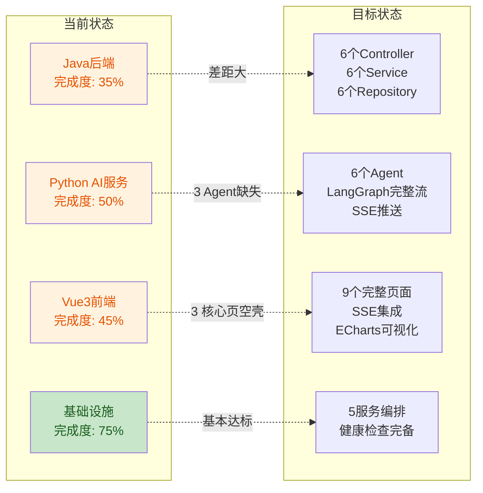
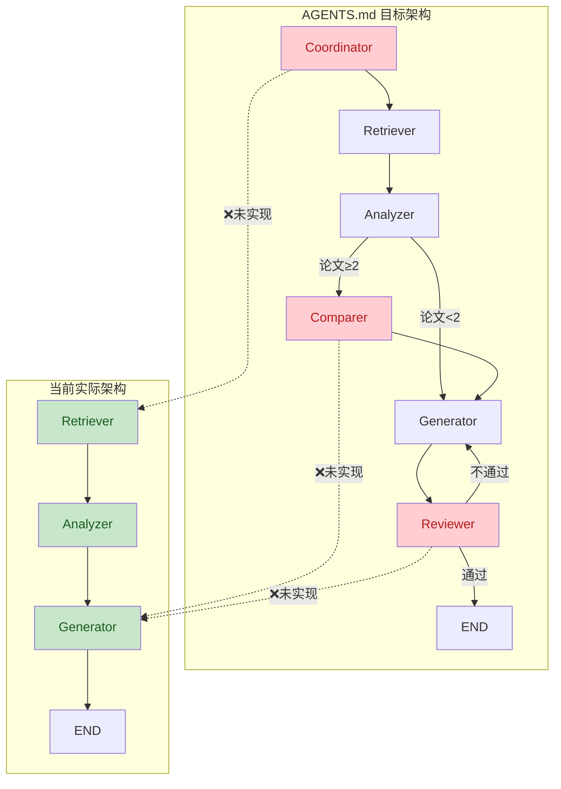
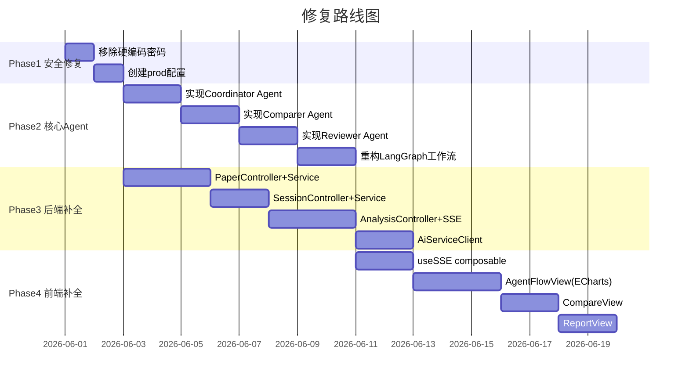

# 🔍 XH-202630 科研文献智能助手 — 代码检验报告

> **检验日期**: 2026-06-01 | **检验范围**: Java后端 + Python AI服务 + Vue3前端 + 基础设施 | **对照基准**: AGENTS.md 架构规范

---

## 一、总体评估

| 层级 | 完成度 | 评价 |
|------|--------|------|
| **Java后端** | 35% | 用户管理模块质量高，但论文/会话/分析三大核心模块缺失 |
| **Python AI服务** | 50% | LLM降级+RAG检索优秀，但3个Agent未实现、SSE缺失、工作流不完整 |
| **Vue3前端** | 45% | 骨架完整、类型定义规范，但3个核心创新页面为空壳、SSE未集成 |
| **基础设施** | 75% | Docker编排+Nginx配置基本达标，需补充AI服务环境变量 |

**结论**: 当前项目处于 **M1→M2 过渡期**，基础架构骨架已搭建，但距离工程级可用（端到端可演示）仍有显著差距。核心瓶颈在于 **3个Agent缺失 + 3个Controller缺失 + 3个页面空壳 + SSE全链路未打通**。

---

## 二、已实现功能清单 ✅

### Java后端 (12/34 项)

| 模块 | 已实现 | 文件 |
|------|--------|------|
| 用户注册/登录 | ✅ | `UserController.java` |
| JWT认证+黑名单 | ✅ | `JwtAuthFilter.java`, `JwtUtil.java` |
| BCrypt密码加密 | ✅ | `SecurityConfig.java` L35-37 |
| 用户画像CRUD | ✅ | UserService内含profile操作 |
| 全局异常处理 | ✅ | `GlobalExceptionHandler.java` |
| 6个Entity定义 | ✅ | User/UserProfile/Paper/Session/AnalysisResult/PaperFavorite |
| 6个Repository | ✅ | 含PaperRepositoryCustom自定义查询 |
| 枚举体系+JPA Converter | ✅ | 6个枚举 + AbstractEnumConverter抽象基类 |
| DTO体系(ApiResponse/ErrorCode/PageResponse) | ✅ | 完整的请求/响应DTO |
| RequestIdFilter(MDC) | ✅ | `RequestIdFilter.java` |
| Redis配置 | ✅ | `RedisConfig.java` |
| WebClient配置 | ✅ | `WebClientConfig.java` |

### Python AI服务 (10/20 项)

| 模块 | 已实现 | 文件 |
|------|--------|------|
| LLM三级降级+自动恢复 | ✅ | `llm_service.py` — Builtin→API→Local |
| Retriever Agent | ✅ | `retriever.py` |
| Analyzer Agent | ✅ | `analyzer.py` |
| Generator Agent | ✅ | `generator.py` |
| BaseAgent抽象基类 | ✅ | `base.py` — 含超时+降级 |
| RAG混合检索+RRF融合 | ✅ | `search_service.py` |
| Embedding服务(双Provider) | ✅ | `embedding_service.py` |
| 向量存储服务 | ✅ | `vector_store_service.py` |
| PersonalizationService | ✅ | `personalization_service.py` |
| Prompt模板(6个) | ✅ | prompts/目录下coordinator/retriever/analyzer/comparer/generator/reviewer |

### Vue3前端 (10/22 项)

| 模块 | 已实现 | 文件 |
|------|--------|------|
| 路由配置+懒加载 | ✅ | `router/index.ts` |
| 4个Pinia Store | ✅ | user/paper/session/agent |
| Axios封装+JWT拦截器 | ✅ | `api/index.ts` |
| 6个TypeScript类型定义 | ✅ | user/paper/session/agent/analysis/common |
| 5个API模块 | ✅ | user/paper/session/analysis |
| 登录/注册页 | ✅ | LoginView/RegisterView |
| 首页+搜索页 | ✅ | HomeView/SearchView |
| 论文详情页 | ✅ | PaperDetailView |
| 用户中心页 | ✅ | UserCenterView |
| useAuth/usePagination组合函数 | ✅ | composables/ |

---

## 三、缺失功能清单 ❌

### Java后端 — 缺失5个Controller + 5个Service

| 缺失模块 | 对照API契约 | 影响 |
|----------|-------------|------|
| **PaperController + PaperService** | `/api/papers` GET/POST/DELETE, `/api/papers/search`, `/api/papers/{id}/favorite` | 🔴 核心功能，论文管理完全不可用 |
| **SessionController + SessionService** | `/api/sessions` POST/GET/DELETE | 🔴 会话管理完全不可用 |
| **AnalysisController + AnalysisService** | `/api/analysis/paper`, `/api/analysis/compare`, `/api/analysis/report`, `/api/analysis/{id}/agent-stream` | 🔴 分析服务完全不可用 |
| **AiServiceClient** | Java→Python HTTP调用+SSE转发 | 🔴 前后端无法联调 |
| **Redis缓存操作** | @Cacheable/@CacheEvict未使用 | 🟡 缓存层形同虚设 |
| **application-prod.yml** | 生产环境配置 | 🟡 ddl-auto=update不应出现在生产环境 |

### Python AI服务 — 缺失3个Agent + SSE + 完整工作流

| 缺失模块 | 对照Agent体系 | 影响 |
|----------|--------------|------|
| **Coordinator Agent** | 任务分解与调度 | 🔴 工作流无协调者，sub_tasks始终为空 |
| **Comparer Agent** | 多论文对比+矛盾发现 | 🔴 四大创新点之一"矛盾发现"无法实现 |
| **Reviewer Agent** | 质量审核+反馈循环 | 🔴 生成内容无审核，幻觉风险高 |
| **SSE实时推送** | Agent状态流 `/api/analysis/{id}/agent-stream` | 🔴 四大创新点之一"Agent可视化"无法实现 |
| **LangGraph条件分支** | 论文数>=2→Comparer, <2→Generator | 🔴 当前是3节点线性流，无条件路由 |
| **Reviewer反馈循环** | 审核不通过→重新生成(最多1次) | 🔴 无质量保障机制 |
| **PersonalizationService注入** | 已实现但未在graph.py中使用 | 🟡 个性化引擎实际未生效 |

### Vue3前端 — 缺失3个核心页面 + SSE集成

| 缺失模块 | 对照前端功能 | 影响 |
|----------|-------------|------|
| **AgentFlowView** 实际内容 | Agent协同可视化(ECharts流程图) | 🔴 四大创新点之一，答辩演示关键 |
| **CompareView** 实际内容 | 多论文对比矩阵+矛盾展示 | 🔴 四大创新点之一 |
| **ReportView** 实际内容 | 个性化综述+引用溯源 | 🔴 核心输出页面 |
| **useSSE composable** | SSE连接+自动重连(3s,5次) | 🔴 Agent状态无法实时更新 |
| **ECharts集成** | Agent流程可视化 | 🟡 可视化创新点无法展示 |

---

## 四、问题清单（按严重程度）

### 🔴 Critical — 必须立即修复（安全/核心功能缺失）

| # | 问题 | 文件 | 行号 | 描述 | 修复建议 |
|---|------|------|------|------|---------|
| C-01 | **数据库密码硬编码** | `application.yml` | L13 | `password: ${MYSQL_PASSWORD:Aa2105268075.}` 默认值暴露真实密码 | 移除默认值，改为 `${MYSQL_PASSWORD}` 无fallback |
| C-02 | **3个Agent未实现** | `ai-service/app/agents/` | — | Coordinator/Comparer/Reviewer Agent类文件不存在，Prompt模板已就绪但无法调用 | 创建3个Agent类，继承BaseAgent |
| C-03 | **LangGraph工作流不完整** | `graph.py` | L144-155 | 仅3节点线性流(retrieve→analyze→generate)，缺少coordinator入口、comparer条件分支、reviewer反馈循环 | 重构为6节点+条件路由+反馈循环 |
| C-04 | **SSE全链路未实现** | Python→Java→前端 | — | Python端无SSE端点、Java端无SSE转发、前端无useSSE | 三层同步实现SSE推送 |
| C-05 | **3个核心Controller缺失** | `backend/controller/` | — | PaperController/SessionController/AnalysisController不存在 | 优先实现PaperController |
| C-06 | **3个核心页面为空壳** | `AgentFlowView.vue` | L1-9 | AgentFlow/Compare/Report仅含占位文字 | 实现实际业务逻辑 |

### 🟠 Major — 影响工程质量（应尽快修复）

| # | 问题 | 文件 | 行号 | 描述 | 修复建议 |
|---|------|------|------|------|---------|
| M-01 | **PersonalizationService未注入** | `graph.py` | 全文 | 已实现但未在graph.py中初始化和使用 | 在build_agent_graph中注入，传递给Generator |
| M-02 | **ddl-auto=update生产风险** | `application.yml` | L22 | 生产环境不应使用ddl-auto=update，可能导致数据丢失 | 创建application-prod.yml设为validate |
| M-03 | **AiServiceClient缺失** | `backend/client/` | — | Java→Python HTTP调用层未实现，WebClient已配置但无调用者 | 实现AiServiceClient调用Python API |
| M-04 | **Redis缓存未使用** | `backend/service/` | — | RedisConfig已配置但无@Cacheable使用 | UserService添加缓存，后续Service同步实现 |
| M-05 | **EventSource无法携带JWT** | 前端SSE实现 | — | 浏览器EventSource API不支持自定义Header | 改用fetch+ReadableStream或query参数传token |
| M-06 | **Docker AI服务缺环境变量** | `docker-compose.yml` | L37-53 | ai-service容器未传递LLM_API_KEY等环境变量 | 添加environment段传递必要配置 |
| M-07 | **Nginx未配置SSE专用location** | `nginx.conf` | L21-35 | /api/全局proxy_buffering off虽可用，但SSE需更精细配置 | 添加`location /api/analysis/`专用SSE配置 |
| M-08 | **LocalLLMProvider未处理torch_dtype** | `llm_service.py` | L185 | `torch_dtype="auto"` 应为 `torch_dtype=torch.float16`等实际类型 | 导入torch并使用正确的dtype |

### 🟡 Minor — 代码质量改进

| # | 问题 | 文件 | 行号 | 描述 | 修复建议 |
|---|------|------|------|------|---------|
| m-01 | **枚举fromDbValue重复实现** | `enums/` | 多文件 | 每个枚举重复实现fromDbValue静态方法 | 利用AbstractEnumConverter统一反向查找 |
| m-02 | **HealthController可替换** | `HealthController.java` | — | 自定义HealthController，Spring Boot Actuator更标准 | 引入spring-boot-starter-actuator |
| m-03 | **agentStore无SSE连接逻辑** | `agentStore.ts` | 全文 | Store定义了状态但无连接/断开/重连方法 | 抽取useSSE composable |
| m-04 | **.env.example不完整** | `.env.example` | 全文 | 缺少EMBEDDING/DASHSCOPE/AGENT相关变量 | 补全所有环境变量 |
| m-05 | **SQL seed数据可能过时** | `03_insert_seed_data.sql` | — | DDL与Entity可能不同步(Entity用ddl-auto=update) | 统一由Flyway/Liquibase管理 |
| m-06 | **前端API模块analysis.ts可能未对齐** | `analysis.ts` | — | 后端AnalysisController未实现，API调用会404 | 后端实现后对齐 |
| m-07 | **CORS未允许SSE所需Header** | `SecurityConfig.java` | L72 | allowedHeaders缺少`Cache-Control`、`Last-Event-ID` | SSE场景需补充 |
| m-08 | **前端缺少错误边界组件** | `components/` | — | 无全局ErrorBoundary，组件异常会导致白屏 | 添加ErrorBoundary包装 |

---

## 五、架构合规性分析

| 架构规范 | 合规状态 | 说明 |
|----------|---------|------|
| 三层分离(Vue+SpringBoot+FastAPI) | ✅ 合规 | 架构清晰，职责分离 |
| Controller→Service→Repository分层 | ⚠️ 部分合规 | 仅UserController有完整分层，其他缺失 |
| Entity与DTO分离 | ✅ 合规 | 无Entity直接暴露 |
| 全局异常处理 | ✅ 合规 | GlobalExceptionHandler + BusinessException体系 |
| JWT + Redis黑名单 | ✅ 合规 | JwtAuthFilter + RedisKeyUtil |
| 6-Agent协同 | ❌ 不合规 | 仅3个Agent，无协调/对比/审核 |
| LangGraph条件路由 | ❌ 不合规 | 线性流，无条件分支 |
| SSE实时推送 | ❌ 不合规 | 全链路未实现 |
| Cache-Aside缓存 | ❌ 不合规 | Redis配置就绪但未使用 |
| 个性化引擎注入 | ❌ 不合规 | 已实现但未接入工作流 |

---

## 六、亮点与优势 ✨

尽管存在差距，以下部分实现质量较高，值得肯定：

| 亮点 | 说明 |
|------|------|
| **LLM三级降级** | `llm_service.py` 的 Provider抽象+自动降级+5分钟恢复机制设计精良 |
| **BaseAgent抽象** | `base.py` 统一了超时、状态追踪、降级回退，扩展性好 |
| **枚举Converter体系** | AbstractEnumConverter + DbValueEnum接口设计优雅，避免重复代码 |
| **RAG混合检索** | 语义+关键词双路+RRF融合+Reranker个性化重排序，架构完整 |
| **Prompt模板设计** | 8-block结构（角色/背景/任务/输入/输出格式/约束/示例/个性化），专业度高 |
| **Nginx安全头** | X-Content-Type-Options/X-Frame-Options/X-XSS-Protection + server_tokens off |
| **TypeScript类型体系** | 6个类型定义文件覆盖所有业务域，类型安全 |

---

## 七、修复优先级路线图

| Phase | 内容 | 预计工作量 | 优先级 |
|-------|------|-----------|--------|
| **Phase 1** | 安全修复（C-01密码硬编码 + M-02 prod配置） | 0.5天 | 🔴 P0 |
| **Phase 2** | 3个Agent实现 + LangGraph重构（C-02/C-03） | 5天 | 🔴 P0 |
| **Phase 3** | Java后端3个Controller + AiServiceClient + SSE（C-05/M-03/M-04） | 7天 | 🟠 P1 |
| **Phase 4** | 前端3个核心页面 + useSSE + ECharts（C-06/M-05） | 6天 | 🟠 P1 |

---

## 八、下一步建议

1. **立即行动**: 修复 C-01（移除application.yml中的密码默认值），这是安全隐患
2. **本周重点**: 实现3个缺失Agent（Coordinator/Comparer/Reviewer）+ 重构graph.py为完整6节点工作流 — 这是M2的核心交付物
3. **下周重点**: 实现PaperController + AiServiceClient，打通"前端→Java→Python"最小闭环
4. **持续关注**: SSE全链路（Python SSE端点 → Java SSE转发 → 前端useSSE）是四大创新点之一"Agent可视化"的技术基础，需三层同步推进
