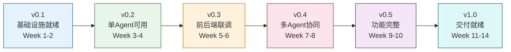
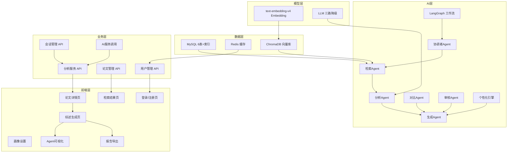
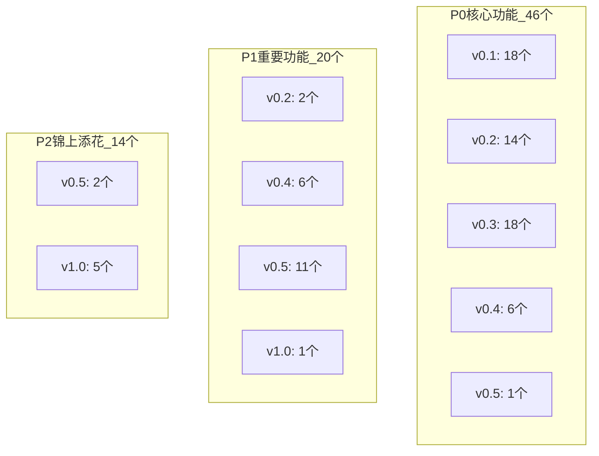
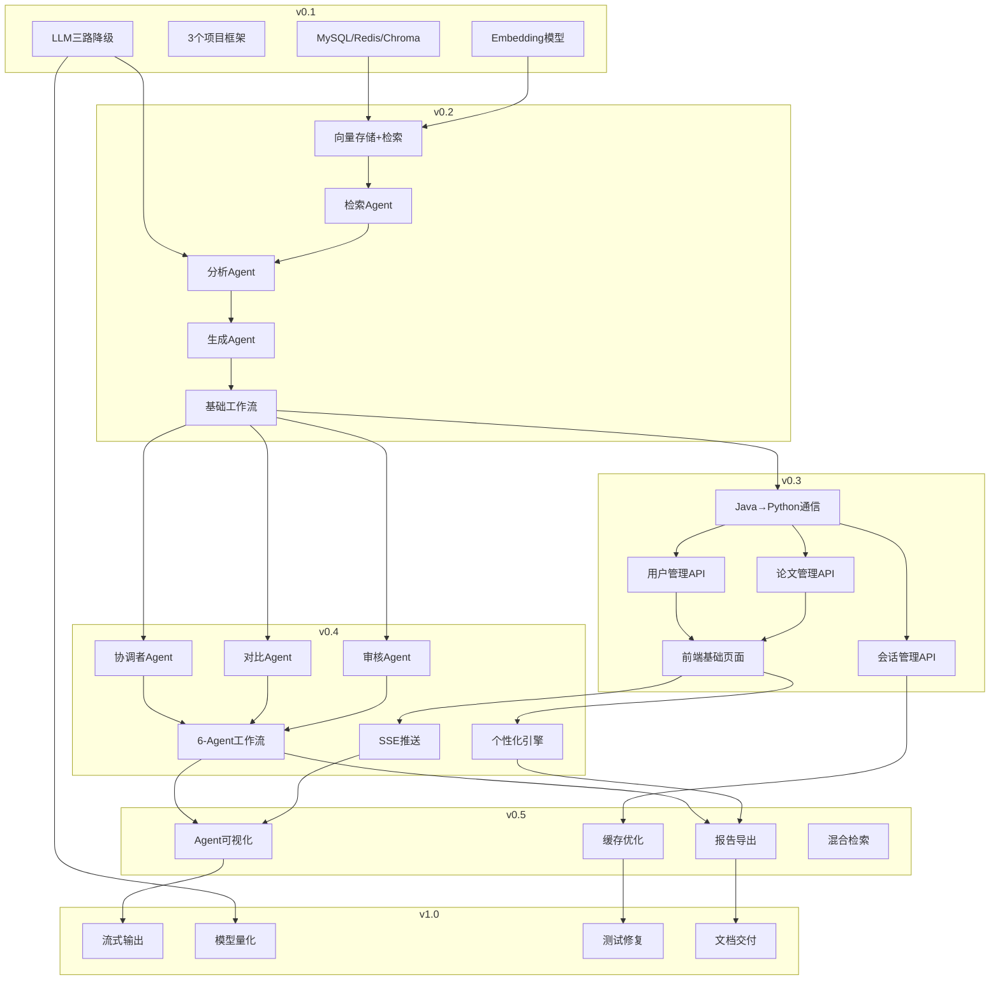
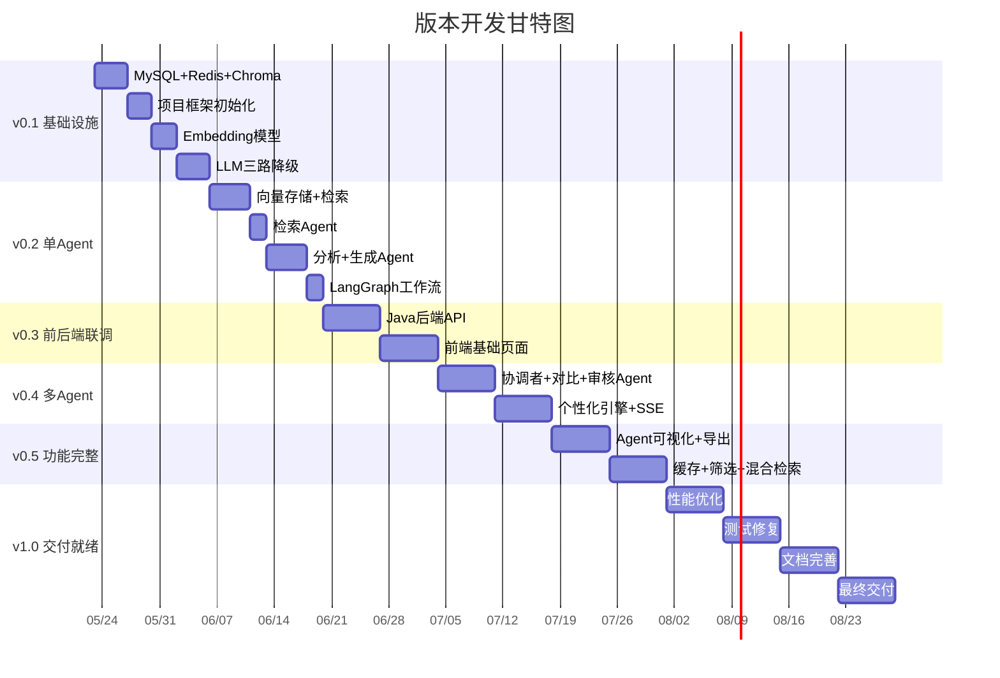

# XH-202630 科研文献智能助手 — 版本里程碑功能清单

> **课题编号**：XH-202630
> **课题名称**：领域知识个性化生成与多智能体协同决策系统研究
> **文档版本**：v1.2
> **创建日期**：2026年5月24日
> **更新日期**：2026年6月17日
> **文档目的**：按版本递进列出每个里程碑需要实现的功能，支持"一个版本一个版本做"的渐进式开发

---

## 修订历史

| 版本 | 日期 | 修订人 | 修订内容 |
|------|------|--------|---------|
| v1.0 | 2026-05-24 | 项目组 | 初始版本 |
| v1.1 | 2026-06-05 | 项目组 | **v0.1/v0.2/v0.3 全部完成 ✅**：JM1/AM1/AM2/AM3/JM3/FM1/FM2 全部审阅通过；v0.1 21 项、v0.2 17 项、v0.3 22 项功能全部交付 |

---

## 版本演进总览

| 版本 | 里程碑 | 时间窗口 | 核心目标 | 功能数 | 状态 |
|------|--------|---------|---------|--------|------|
| **v0.1** | M1：基础设施就绪 | Week 1-2（5/23 - 6/5） | 数据库+模型+框架就绪 | 21 | ✅ 已完成 |
| **v0.2** | M2：单Agent可用 | Week 3-4（6/6 - 6/19） | 基本论文分析+综述生成 | 17 | ✅ 已完成（代码就绪，待数据实测） |
| **v0.3** | M3：前后端联调成功 | Week 5-6（6/20 - 7/3） | 用户可通过界面使用基本功能 | 22 | ✅ 已完成 |
| **v0.4** | M4：多Agent协同完成 | Week 7-8（7/4 - 7/17） | 6个Agent协同+个性化引擎 | 15 | ⬜ 未开始（2026-06-05 启动） |
| **v0.5** | M5：功能完整 | Week 9-10（7/18 - 7/31） | 所有P0+P1功能完成 | 16 | 🔄 进行中（JM5 Java后端缓存优化+导出已完成 ✅） |
| **v1.0** | M6：交付就绪 | Week 11-14（8/1 - 9/30） | 优化+测试+文档+交付 | 19 | ⬜ 未开始 |

### 版本演进流程图



### 版本依赖关系图



---

## v0.1 — M1：基础设施就绪

> **时间**：Week 1-2（5月23日 - 6月5日）
> **前置条件**：开发环境搭建完成
> **核心目标**：完成所有基础设施搭建，至少一路模型可用
> **完成标志**：3个项目骨架可启动 + 数据库就绪 + 至少一路LLM可用

### 数据模块（F4）

| 序号 | 功能编号 | 功能名称 | 优先级 | 实现内容 | 产出文件 |
|------|---------|---------|--------|---------|---------|
| 1 | F4.1.1 | 论文元数据存储 | P0 | 创建papers表（标题、作者JSON、摘要、年份、会议、关键词JSON、引用数） | SQL脚本 |
| 2 | F4.1.2 | 用户数据存储 | P0 | 创建users表和user_profiles表 | SQL脚本 |
| 3 | F4.1.3 | 会话数据存储 | P0 | 创建sessions表和analysis_results表 | SQL脚本 |
| 4 | F4.1.4 | 全文索引 | P1 | 为papers表的title和abstract创建FULLTEXT索引 | SQL脚本 |
| 5 | F4.2.1 | Redis配置 | P0 | Docker启动Redis，Java和Python都能连接 | docker-compose.yml |
| 6 | F4.2.2 | 热点数据缓存 | P0 | Redis基本读写测试通过 | 测试代码 |
| 7 | F4.3.1 | Chroma初始化 | P0 | 初始化Chroma向量数据库，创建papers collection | 初始化脚本 |
| 8 | F4.3.2 | Chroma连接测试 | P0 | Python能连接Chroma并执行基本操作 | 测试代码 |

### 模型模块（F5）

| 序号 | 功能编号 | 功能名称 | 优先级 | 实现内容 | 产出文件 |
|------|---------|---------|--------|---------|---------|
| 9 | F5.2.1 | 阿里云百炼API配置 | P0 | 配置text-embedding-v4 API（DASHSCOPE_API_KEY、EMBEDDING_BASE_URL） | config.py |
| 10 | F5.2.2 | 文本向量化服务 | P0 | 实现文本转向量的服务，1024维向量（优先API，备选本地模型） | embedding_service.py |
| 11 | F5.2.3 | 批量向量化 | P0 | 支持批量处理，100条/10秒 | embedding_service.py |
| 12 | F5.1.1 | 方案A：软件方模型对接 | P0 | 对接软件方云端模型服务（最高优先级） | llm_config.py |
| 13 | F5.1.1 | 方案B：外接API配置 | P0 | 配置OpenAI兼容接口/DeepSeek等第三方API | api_config.py |
| 14 | F5.1.1 | 方案C：用户本地模型部署 | P0 | 支持本机部署模型（Qwen2-7B/1.5B等） | llm_service.py |
| 15 | F5.1.2 | 模型推理服务 | P0 | 统一推理接口，支持三路自动选择与降级 | llm_service.py |
| 16 | F3.3.4 | Prompt管理 | P0 | 创建Prompt模板管理模块 | prompt_templates.py |
| 17 | F5.1.5 | API密钥管理 | P0 | 统一管理各外接API密钥和调用接口 | api_config.py |

### 项目框架

| 序号 | 功能编号 | 功能名称 | 优先级 | 实现内容 | 产出文件 |
|------|---------|---------|--------|---------|---------|
| 18 | - | Java项目初始化 | P0 | Spring Boot项目，`/health`返回200 | 项目骨架 |
| 19 | - | Python项目初始化 | P0 | FastAPI项目，`/health`返回200 | 项目骨架 |
| 20 | - | 前端项目初始化 | P0 | Vue3+Vite项目，首页可访问 | 项目骨架 |
| 21 | - | Docker Compose配置 | P0 | `docker-compose up`可启动全部服务 | docker-compose.yml |

### 并行任务（非开发者A）

| 序号 | 功能编号 | 功能名称 | 优先级 | 实现内容 |
|------|---------|---------|--------|---------|
| A1 | F4.4.1 | arXiv数据采集 | P0 | 下载AI/Agent领域论文200+篇 |
| A2 | F4.4.2 | 数据清洗 | P0 | 去重、格式统一、元数据标准化 |

### v0.1 验收检查点

```
□ MySQL: SHOW TABLES 返回6张表，FULLTEXT索引可用
□ Redis: SET/GET 测试通过
□ Chroma: collection.count() 返回非负数
□ Java: curl http://localhost:8080/health 返回200
□ Python: curl http://localhost:8000/health 返回200
□ 前端: 浏览器访问 http://localhost:5173 显示首页
□ Embedding: embedding_service.encode("测试") 返回1024维向量
□ LLM: 至少一路模型调用成功，返回正确文本
□ Docker: docker-compose up -d 全部服务健康
□ 200+篇论文数据已采集
```

---

## v0.2 — M2：单Agent可用

> **时间**：Week 3-4（6月6日 - 6月19日）
> **前置条件**：v0.1完成
> **核心目标**：实现基础RAG检索 + 单Agent论文分析和综述生成
> **完成标志**：输入研究主题 → 端到端输出论文分析+综述，耗时<30秒

### RAG检索模块（F3.2）

| 序号 | 功能编号 | 功能名称 | 优先级 | 实现内容 | 产出文件 |
|------|---------|---------|--------|---------|---------|
| 1 | F3.2.1 | 论文向量化 | P0 | 将论文标题+摘要转为1024维向量 | vectorize_papers.py |
| 2 | F3.2.2 | 向量存储 | P0 | 将向量存入Chroma，关联元数据 | vector_store_service.py |
| 3 | F4.3.4 | 批量导入 | P0 | 批量导入200+篇论文向量 | import_vectors.py |
| 4 | F3.2.3 | 语义检索 | P0 | 根据查询向量检索TopK相似论文 | search_papers.py |
| 5 | F3.2.5 | 重排序 | P1 | 对检索结果进行相关性重排序 | reranker.py |
| 6 | F3.5.2 | 检索API | P0 | `POST /api/search` 返回论文列表 | search.py |

### 多Agent协同引擎（F3.1）— 基础3Agent

| 序号 | 功能编号 | 功能名称 | 优先级 | 实现内容 | 产出文件 |
|------|---------|---------|--------|---------|---------|
| 7 | F3.1.2 | 检索Agent | P0 | 接收查询关键词，调用向量检索，返回Top10论文 | retriever.py + tools.py |
| 8 | F3.1.3 | 分析Agent | P0 | 提取论文5维度核心信息（研究问题/方法/实验/结论/局限），输出JSON | analyzer.py + prompts/analyzer.txt |
| 9 | F3.1.5 | 生成Agent | P0 | 根据分析结果生成文献综述段落 | generator.py + prompts/generator.txt |

### 工作流与API

| 序号 | 功能编号 | 功能名称 | 优先级 | 实现内容 | 产出文件 |
|------|---------|---------|--------|---------|---------|
| 10 | F3.1.7 | LangGraph基础工作流 | P0 | 编排检索→分析→生成的基础流程 | graph.py |
| 11 | F3.5.1 | Agent调用API | P0 | `POST /api/agent/analyze` 返回分析结果 | agent.py |
| 12 | F3.5.3 | 健康检查 | P0 | `GET /health` 返回服务状态 | main.py |

### 个性化引擎（F3.4）— 基础

| 序号 | 功能编号 | 功能名称 | 优先级 | 实现内容 | 产出文件 |
|------|---------|---------|--------|---------|---------|
| 13 | F3.4.1 | 用户画像解析 | P0 | 解析用户画像JSON，提取4维度字段 | profile_parser.py |

### LLM服务（F3.3）— 完善

| 序号 | 功能编号 | 功能名称 | 优先级 | 实现内容 | 产出文件 |
|------|---------|---------|--------|---------|---------|
| 14 | F3.3.2 | 模型推理集成 | P0 | Agent调用LLM进行推理，统一接口 | llm_service.py更新 |
| 15 | F3.3.5 | 自动降级 | P0 | 软件方模型→外接API→用户本地模型自动切换 | llm_service.py更新 |
| 16 | F3.3.6 | 外接API管理 | P0 | 统一管理多种外接API密钥、端点、模型名称 | api_config.py更新 |
| 17 | F5.2.4 | 本地模型备选 | P1 | 配置本地Embedding模型作为备选方案 | embedding_service.py更新 |

### 并行任务（非开发者A）

| 序号 | 功能编号 | 功能名称 | 优先级 | 实现内容 |
|------|---------|---------|--------|---------|
| A3 | F4.4.3 | 文档分块 | P0 | 将论文按章节分块（500-1000字/块） |
| A4 | F4.4.4 | 质量检查 | P0 | 检查数据完整性、格式正确性 |

### v0.2 验收检查点

```
🟡 Chroma: collection.count() 返回200+（代码就绪，待执行导入）
⚠️ 语义检索: 输入"Multi-Agent"返回Top10论文，相关性>80%（代码就绪，待实测）
✅ 检索Agent: 接收查询，返回论文列表，格式正确
✅ 分析Agent: 输入论文，返回5维度JSON，提取准确率>80%
✅ 生成Agent: 输入分析结果，返回连贯的综述段落
✅ LangGraph: 输入研究主题，端到端输出论文分析+综述
⚠️ 全流程耗时: 单篇分析<30秒（超时保护完善，待实测）
✅ API: curl调用成功，返回结构化JSON
✅ LLM降级: 软件方模型→外接API→本地模型自动切换正常
```

### v0.2 关键演示场景

```
输入: "Multi-Agent协同决策"
预期输出:
1. 检索到10-15篇相关论文
2. 每篇论文提取了5维度核心信息
3. 生成了一段300-500字的文献综述
4. 全流程耗时<30秒
```

---

## v0.3 — M3：前后端联调成功

> **时间**：Week 5-6（6月20日 - 7月3日）
> **前置条件**：v0.2完成
> **核心目标**：用户可通过Web界面完成注册→登录→检索→分析的基本流程
> **完成标志**：前端到后端完整链路可用

### Java后端 — 用户管理（F2.1）

| 序号 | 功能编号 | 功能名称 | 优先级 | API接口 | 产出文件 |
|------|---------|---------|--------|---------|---------|
| 1 | F2.1.1 | 用户注册 | P0 | `POST /api/users/register` | UserController.java |
| 2 | F2.1.2 | 用户登录 | P0 | `POST /api/users/login` | UserController.java |
| 3 | F2.1.3 | 用户信息查询 | P0 | `GET /api/users/{userId}` | UserService.java |
| 4 | F2.1.5 | 用户画像管理 | P0 | `GET/POST/PUT /api/users/{userId}/profile` | UserProfileController.java |

### Java后端 — 论文管理（F2.2）

| 序号 | 功能编号 | 功能名称 | 优先级 | API接口 | 产出文件 |
|------|---------|---------|--------|---------|---------|
| 5 | F2.2.1 | 论文列表查询 | P0 | `GET /api/papers?page=1&size=10` | PaperController.java |
| 6 | F2.2.2 | 论文详情查询 | P0 | `GET /api/papers/{paperId}` | PaperService.java |
| 7 | F2.2.3 | 论文搜索 | P0 | `GET /api/papers/search?q=...` | PaperService.java |

### Java后端 — 会话管理（F2.3）

| 序号 | 功能编号 | 功能名称 | 优先级 | API接口 | 产出文件 |
|------|---------|---------|--------|---------|---------|
| 8 | F2.3.1 | 创建会话 | P0 | `POST /api/sessions` | SessionController.java |
| 9 | F2.3.2 | 会话列表 | P0 | `GET /api/sessions?userId=...` | SessionService.java |

### Java后端 — AI服务调用（F2.5）

| 序号 | 功能编号 | 功能名称 | 优先级 | 实现内容 | 产出文件 |
|------|---------|---------|--------|---------|---------|
| 10 | F2.5.1 | Python服务客户端 | P0 | 封装HTTP调用，连接池+超时30s+重试1次 | PythonAIClient.java |
| 11 | F2.5.2 | 请求转换 | P0 | Java DTO → Python JSON格式 | DtoMapper.java |
| 12 | F2.5.3 | 响应解析 | P0 | Python JSON → Java DTO | ResponseParser.java |

### Java后端 — 分析服务（F2.4）

| 序号 | 功能编号 | 功能名称 | 优先级 | API接口 | 产出文件 |
|------|---------|---------|--------|---------|---------|
| 13 | F2.4.1 | 论文分析请求 | P0 | `POST /api/analysis/paper` | AnalysisController.java |
| 14 | F2.4.4 | 分析结果查询 | P0 | `GET /api/analysis/{analysisId}` | AnalysisService.java |
| 15 | F2.4.5 | 分析状态查询 | P0 | `GET /api/analysis/{analysisId}/status` | AnalysisService.java |

### 前端 — 用户界面（F1.1）

| 序号 | 功能编号 | 功能名称 | 优先级 | 实现内容 | 产出文件 |
|------|---------|---------|--------|---------|---------|
| 16 | F1.1.1 | 登录页 | P0 | 用户登录界面 | LoginView.vue |
| 17 | F1.1.1 | 注册页 | P0 | 用户注册界面 | RegisterView.vue |
| 18 | F1.1.2 | 画像设置表单 | P0 | 首次登录引导设置画像 | UserProfileForm.vue |

### 前端 — 论文检索（F1.2）

| 序号 | 功能编号 | 功能名称 | 优先级 | 实现内容 | 产出文件 |
|------|---------|---------|--------|---------|---------|
| 19 | F1.2.1 | 首页主题输入 | P0 | 输入研究主题 | HomeView.vue |
| 20 | F1.2.2 | 智能检索调用 | P0 | 调用检索API | api/paper.ts |
| 21 | F1.2.3 | 检索结果展示 | P0 | 展示论文列表 | SearchView.vue + PaperCard.vue |

### 前端 — 论文分析（F1.3）

| 序号 | 功能编号 | 功能名称 | 优先级 | 实现内容 | 产出文件 |
|------|---------|---------|--------|---------|---------|
| 22 | F1.3.1 | 论文详情页 | P0 | 展示论文完整信息 | PaperDetailView.vue |
| 23 | F1.3.2 | 分析卡片组件 | P0 | 展示AI分析结果 | AnalysisCard.vue |
| 24 | F1.3.3 | 通俗解释 | P0 | 为初级用户提供通俗化解释 | AnalysisCard.vue扩展 |

### 并行任务（非开发者B）

| 序号 | 功能编号 | 功能名称 | 实现内容 |
|------|---------|---------|---------|
| B1 | - | 技术报告框架 | 编写技术报告大纲 |
| B2 | - | API文档 | 编写API接口文档 |

### v0.3 验收检查点

```
□ 用户注册: POST /api/users/register 返回201
□ 用户登录: POST /api/users/login 返回Token
□ JWT鉴权: 未登录请求返回401
□ 画像设置: POST /api/users/{id}/profile 保存成功
□ 论文搜索: GET /api/papers/search?q=Multi-Agent 返回结果
□ 论文详情: GET /api/papers/{id} 返回完整信息
□ Java调用Python: Java成功调用 /api/agent/analyze
□ 前端登录: 输入用户名密码可登录
□ 前端检索: 输入主题可看到论文列表
□ 前端分析: 点击分析按钮可看到AI分析结果
□ 全链路: 注册→登录→检索→分析 完整流程无报错
```

### v0.3 关键演示场景

```
1. 用户注册新账号
2. 首次登录设置画像（硕士/NLP/中级/均衡）
3. 在首页输入"Multi-Agent协同决策"
4. 看到检索结果列表
5. 点击一篇论文查看详情
6. 点击"分析"按钮，等待AI分析结果
7. 看到5维度分析卡片
```

---

## v0.4 — M4：多Agent协同完成

> **时间**：Week 7-8（7月4日 - 7月17日）
> **前置条件**：v0.3完成
> **核心目标**：6个Agent可协同工作，个性化引擎和Agent可视化基本可用
> **完成标志**：6-Agent协同可用 + 个性化差异>60% + SSE推送正常

### 多Agent协同引擎（F3.1）— 扩展3Agent

| 序号 | 功能编号 | 功能名称 | 优先级 | 实现内容 | 产出文件 |
|------|---------|---------|--------|---------|---------|
| 1 | F3.1.1 | 协调者Agent | P0 | 任务分解与调度，汇总多Agent结果 | coordinator.py + task_decomposer.py |
| 2 | F3.1.4 | 对比Agent | P1 | 对比2-5篇论文，生成对比表格+矛盾检测 | comparer.py |
| 3 | F3.1.6 | 审核Agent | P1 | 检测事实错误，核查引用 | reviewer.py + citation_checker.py |
| 4 | F3.1.7 | 完整6-Agent工作流 | P0 | LangGraph编排：协调→检索→分析→[对比]→生成→审核 | graph.py更新 |
| 5 | F3.1.8 | 降级机制 | P1 | 单Agent失败跳过，多Agent失败降级为单Agent模式 | graph.py更新 |

### 个性化引擎（F3.4）

| 序号 | 功能编号 | 功能名称 | 优先级 | 实现内容 | 产出文件 |
|------|---------|---------|--------|---------|---------|
| 6 | F3.4.2 | Prompt个性化 | P0 | 根据画像动态构建个性化Prompt片段 | prompt_builder.py |
| 7 | F3.4.3 | 内容难度适配 | P0 | 根据知识水平调整内容深度 | difficulty_adapter.py |
| 8 | F3.4.4 | 风格适配 | P1 | 根据偏好风格调整表达方式 | style_adapter.py |

### 前端 — 多论文对比（F1.3）

| 序号 | 功能编号 | 功能名称 | 优先级 | 实现内容 | 产出文件 |
|------|---------|---------|--------|---------|---------|
| 9 | F1.3.4 | 多论文选择 | P1 | 勾选2-5篇论文进行对比 | PaperSelector.vue |
| 10 | F1.3.5 | 对比分析展示 | P1 | 展示多论文对比表格 | CompareTable.vue |

### 前端 — 综述生成（F1.4）

| 序号 | 功能编号 | 功能名称 | 优先级 | 实现内容 | 产出文件 |
|------|---------|---------|--------|---------|---------|
| 11 | F1.4.1 | 综述生成页面 | P0 | 完整的综述生成流程 | ReportView.vue |
| 12 | F1.4.2 | 个性化输出展示 | P0 | 展示不同画像的个性化结果 | ReportView.vue更新 |

### Java后端 — 分析服务扩展

| 序号 | 功能编号 | 功能名称 | 优先级 | API接口 | 产出文件 |
|------|---------|---------|--------|---------|---------|
| 13 | F2.4.2 | 对比分析请求 | P1 | `POST /api/analysis/compare` | AnalysisController.java更新 |
| 14 | F2.4.3 | 综述生成请求 | P0 | `POST /api/analysis/report` | AnalysisController.java更新 |
| 15 | F2.5.4 | SSE推送 | P1 | Agent状态实时推送到前端 | AsyncAgentClient.java |

### v0.4 验收检查点

```
□ 协调者: 输入复杂问题，能分解为2-5个子任务
□ 对比: 输入3篇论文，生成对比表格，维度完整
□ 审核: 生成内容有事实错误时能检测出来
□ 工作流: 6-Agent顺序执行，条件分支正确
□ 降级: 人为制造Agent超时，系统不崩溃，返回降级结果
□ 个性化: 同一主题，本科生和博士生获得不同深度的综述
□ SSE: Agent执行过程中，前端能实时看到状态更新
□ 综述: 生成包含引言+现状+方法对比+趋势+参考文献的完整综述
□ 引用: 综述中引用标注格式正确
□ 差异度: 同一主题不同画像差异度>60%
```

### v0.4 关键演示场景

```
1. 用户A（本科生·初级·通俗）输入"Multi-Agent协同决策"
   → 获得通俗易懂的综述，有大量类比

2. 用户B（博士生·高级·专业）输入相同主题
   → 获得专业深度的综述，有论文引用和研究空白分析

3. 对比两次输出，差异度>60%

4. 观察Agent协同过程可视化
   → 看到各Agent的执行状态和中间结果
```

---

## v0.5 — M5：功能完整

> **时间**：Week 9-10（7月18日 - 7月31日）
> **前置条件**：v0.4完成
> **核心目标**：所有P0和P1功能完成，系统功能完整可用
> **完成标志**：P0功能100%通过 + P1功能>80%通过

### 前端 — Agent可视化（F1.5）

| 序号 | 功能编号 | 功能名称 | 优先级 | 实现内容 | 产出文件 |
|------|---------|---------|--------|---------|---------|
| 1 | F1.5.1 | 工作流展示 | P1 | ECharts展示6-Agent流程图，活跃节点高亮 | AgentFlowChart.vue |
| 2 | F1.5.2 | 状态监控 | P1 | Agent运行状态（等待/执行/完成/失败）实时更新 | AgentStatusPanel.vue |
| 3 | F1.5.3 | 中间结果 | P1 | 展示各Agent产出摘要 | IntermediateResult.vue |
| 4 | F1.5.4 | 耗时统计 | P2 | 各Agent执行耗时柱状图 | TimeStats.vue |

### 前端 — 报告导出与引用（F1.4）

| 序号 | 功能编号 | 功能名称 | 优先级 | 实现内容 | 产出文件 |
|------|---------|---------|--------|---------|---------|
| 5 | F1.4.4 | PDF导出 | P1 | 导出PDF格式报告，引用保留 | PdfExporter.java |
| 6 | F1.4.4 | Word导出 | P1 | 导出Word格式报告 | WordExporter.java |
| 7 | F1.4.5 | 引用溯源 | P1 | 点击引用跳转原文片段弹窗 | CitationLink.vue |

### 前端 — 筛选排序（F1.2）

| 序号 | 功能编号 | 功能名称 | 优先级 | 实现内容 | 产出文件 |
|------|---------|---------|--------|---------|---------|
| 8 | F1.2.4 | 筛选面板 | P1 | 年份/会议/引用数筛选 | FilterPanel.vue |
| 9 | F1.2.4 | 排序功能 | P1 | 相关度/时间/引用排序 | SortDropdown.vue |

### Python AI — 对比完善

| 序号 | 功能编号 | 功能名称 | 优先级 | 实现内容 | 产出文件 |
|------|---------|---------|--------|---------|---------|
| 10 | F1.3.6 | 矛盾发现 | P2 | 自动标注论文间观点冲突 | ConflictDetector.py |
| 11 | F3.2.4 | 混合检索 | P1 | 关键词+语义检索，RRF融合 | HybridSearcher.py |

### Java后端 — 缓存优化（F2.6）

| 序号 | 功能编号 | 功能名称 | 优先级 | 实现内容 | 产出文件 |
|------|---------|---------|--------|---------|---------|
| 12 | F2.6.1 | 用户画像缓存 | P0 | Redis缓存画像，TTL 1h，更新时失效 | UserProfileCache.java |
| 13 | F2.6.2 | 检索结果缓存 | P1 | Redis缓存检索结果，TTL 10min | SearchCache.java |
| 14 | F2.6.3 | 分析结果缓存 | P1 | Redis缓存分析结果，TTL 30min | AnalysisCache.java |
| 15 | F4.2.3 | Agent状态缓存 | P1 | Redis缓存Agent执行状态 | AgentStateCache.java |

### Python AI — 流式输出

| 序号 | 功能编号 | 功能名称 | 优先级 | 实现内容 | 产出文件 |
|------|---------|---------|--------|---------|---------|
| 16 | F3.3.3 | 流式输出 | P1 | LLM流式生成，首字节<2秒 | StreamingService.py |

### v0.5 验收检查点

```
□ Agent流程图: 6个Agent节点正确显示，状态颜色正确
□ Agent状态: SSE实时更新，等待/执行/完成/失败状态正确
□ 中间结果: 各Agent产出摘要正确展示
□ 耗时统计: 各Agent耗时柱状图正确
□ PDF导出: 导出文件格式正确，引用保留
□ Word导出: 导出文件格式正确
□ 引用溯源: 点击引用可跳转到原文片段弹窗
□ 矛盾发现: 对比3篇以上论文时能发现观点矛盾
□ 筛选: 年份/会议/引用数筛选正确
□ 排序: 相关度/时间/引用排序正确
□ 缓存: 命中率>50%
□ 混合检索: 准确率>纯语义检索
□ 所有P0功能通过测试
□ P1功能>80%通过测试
```

---

## v1.0 — M6：交付就绪

> **时间**：Week 11-14（8月1日 - 9月30日）
> **前置条件**：v0.5完成
> **核心目标**：所有交付物准备完毕，通过验收标准
> **完成标志**：5项交付物全部通过验收

### 性能优化

| 序号 | 功能编号 | 功能名称 | 优先级 | 实现内容 | 产出文件 |
|------|---------|---------|--------|---------|---------|
| 1 | F2.5.4 | 异步调用 | P1 | WebFlux异步调用AI服务 | AsyncAgentClient.java |
| 2 | F3.2.6 | 检索优化 | P2 | 调整检索参数，准确率>85% | SearchOptimizer.py |
| 3 | F3.3.6 | 模型量化 | P2 | INT4量化推理，速度提升30%+ | QuantizedModel.py |
| 4 | F3.3.5 | API降级完善 | P1 | 本地失败自动切换API | FallbackService.py |

### 测试修复

| 序号 | 功能编号 | 功能名称 | 实现内容 | 负责人 |
|------|---------|---------|---------|--------|
| 6 | - | P0功能测试 | 测试所有P0功能 | 全员 |
| 7 | - | Bug修复 | 修复发现的Bug | 开发者 |
| 8 | - | 性能测试 | 响应时间+并发测试 | 开发者 |
| 9 | - | 兼容性测试 | 浏览器兼容+移动端适配 | 非开发A |

### 文档交付

| 序号 | 交付物 | 格式要求 | 验收标准 | 负责人 |
|------|--------|---------|---------|--------|
| 10 | 源代码 | Git仓库 | 可编译运行，含README和部署文档 | 开发者 |
| 11 | 技术研究报告 | PDF 50-80页 | 含系统设计+实验数据+对比分析 | 非开发B |
| 12 | 演示视频 | MP4 10-15分钟 | 含所有核心功能演示 | 全员 |
| 13 | 答辩PPT | PPT 20-25页 | 含方案+创新点+实验结果 | 非开发B |
| 14 | 用户手册 | PDF | 非技术用户可按手册操作 | 非开发B |

### 前端完善（P2功能补充）

| 序号 | 功能编号 | 功能名称 | 优先级 | 实现内容 | 产出文件 |
|------|---------|---------|--------|---------|---------|
| 15 | F1.1.3 | 画像编辑 | P1 | 修改已设置的用户画像 | UserProfileForm.vue更新 |
| 16 | F1.1.4 | 历史记录查看 | P1 | 查看历史分析记录 | HistoryView.vue |
| 17 | F1.2.5 | 论文收藏 | P2 | 收藏/取消收藏论文 | FavoriteButton.vue |
| 18 | F1.4.3 | 内容编辑 | P2 | 用户可编辑生成的综述 | EditableReport.vue |
| 19 | F1.5.5 | 流程回放 | P2 | 回放Agent协同过程 | ReplayController.vue |
| 20 | F3.4.5 | 推荐策略 | P2 | 根据画像推荐相关论文 | recommendation_service.py |

### v1.0 验收检查点

```
□ 源代码: git clone + docker-compose up 即可运行
□ 技术报告: 50-80页，含4个创新点+对比实验数据
□ 演示视频: 10-15分钟，5个核心场景全部展示
□ 答辩PPT: 20-25页，重点展示创新点和实验结果
□ 用户手册: 包含安装、配置、使用步骤
□ 性能: 95%请求响应<5秒，支持50并发
□ 功能: P0功能100%通过，P1功能>80%通过
□ 流式: 首字节<2秒
□ 缓存: 命中率>50%
```

---

## 功能优先级分布总览

### 按版本统计



### 按模块统计

| 模块 | P0 | P1 | P2 | 总计 |
|------|-----|-----|-----|------|
| 前端模块（F1） | 10 | 8 | 6 | 24 |
| Java后端（F2） | 12 | 4 | 2 | 18 |
| Python AI（F3） | 12 | 6 | 4 | 22 |
| 数据模块（F4） | 8 | 2 | 2 | 12 |
| 模型模块（F5） | 4 | 0 | 0 | 4 |
| **总计** | **46** | **20** | **14** | **80** |

---

## 版本间依赖关系



---

## 降级缓冲策略

### 时间缓冲

| 版本 | 缓冲策略 |
|------|---------|
| v0.1 - v0.4 | 严格按计划执行，无缓冲 |
| v0.5 | 允许延迟1周（P1功能可降级为P2） |
| v1.0 | 预留4周时间，充裕 |

### 功能缓冲

| 优先级 | 要求 |
|--------|------|
| P0功能 | 必须在v0.5前完成 |
| P1功能 | v0.5前完成>80%，剩余可延至v1.0 |
| P2功能 | 时间充裕时实现 |

### 最低交付标准

```
如果8月底前只完成v0.4，9月集中做v0.5+v1.0
最低交付标准：v0.4完成即可提交（含P0功能）
P1/P2功能缺失不影响核心价值
```

---

## 每版本开发节奏建议



---

> **文档维护**：每完成一个版本，更新对应功能状态（⬜→✅），记录实际完成日期
> **进度跟踪**：每周更新版本进度，如有延迟立即评估影响
> **变更控制**：版本功能调整需评估对后续版本的影响
