# XH-202630 科研文献智能助手 — 生产级代码标准指南

> **课题编号**：XH-202630
> **课题名称**：领域知识个性化生成与多智能体协同决策系统研究
> **发榜单位**：上海云之脑智能科技有限公司（科大讯飞全资子公司）
> **文档版本**：v1.0
> **创建日期**：2026年6月8日
> **更新日期**：2026年6月8日
> **文档状态**：正式版
> **关联文档**：[开发规范文档.md](file:///Users/achieve/Documents/AchiEVE_MacBook_Air/Veritas(求真)/docs/开发规范文档.md)（基础开发规范）、[架构决策记录(ADR).md](file:///Users/achieve/Documents/AchiEVE_MacBook_Air/Veritas(求真)/docs/架构决策记录(ADR).md)（架构决策）

---

## 修订历史

| 版本 | 日期 | 修订人 | 修订内容 |
|------|------|--------|---------|
| v1.0 | 2026-06-08 | 项目组 | 初始版本，覆盖 8 大生产级维度、Code Review 清单、评分卡、常见反模式 |

---

## 目录

- [1 引言](#1-引言)
- [2 维度一：安全（Security）](#2-维度一安全security)
- [3 维度二：容错降级（Resilience）](#3-维度二容错降级resilience)
- [4 维度三：可观测性（Observability）](#4-维度三可观测性observability)
- [5 维度四：性能与缓存（Performance）](#5-维度四性能与缓存performance)
- [6 维度五：可维护性（Maintainability）](#6-维度五可维护性maintainability)
- [7 维度六：CI/CD 与质量门禁（Delivery）](#7-维度六cicd-与质量门禁delivery)
- [8 维度七：数据治理（Data Governance）](#8-维度七数据治理data-governance)
- [9 维度八：依赖与供应链（Supply Chain）](#9-维度八依赖与供应链supply-chain)
- [10 生产级 Code Review 清单](#10-生产级-code-review-清单)
- [11 生产级评分卡](#11-生产级评分卡)
- [12 常见反模式与陷阱](#12-常见反模式与陷阱)
- [附录 A：工具链推荐](#附录-a工具链推荐)
- [附录 B：参考资料](#附录-b参考资料)
- [附录 C：本项目生产级实践现状](#附录-c本项目生产级实践现状)

---

## 1 引言

### 1.1 编写目的

本指南是 XH-202630 项目从"可演示"走向"可生产"的标准参考，专注于**生产环境**（Production Environment）下的代码质量要求。它与 [开发规范文档.md](file:///Users/achieve/Documents/AchiEVE_MacBook_Air/Veritas(求真)/docs/开发规范文档.md) 互补——

- **开发规范文档**：回答"代码应该长什么样"（命名、分层、API、数据库等基础规范）
- **生产级代码标准指南（本文件）**：回答"代码在生产环境应该表现得怎么样"（安全、容错、可观测性、性能等质量标准）

### 1.2 什么是"生产级"代码

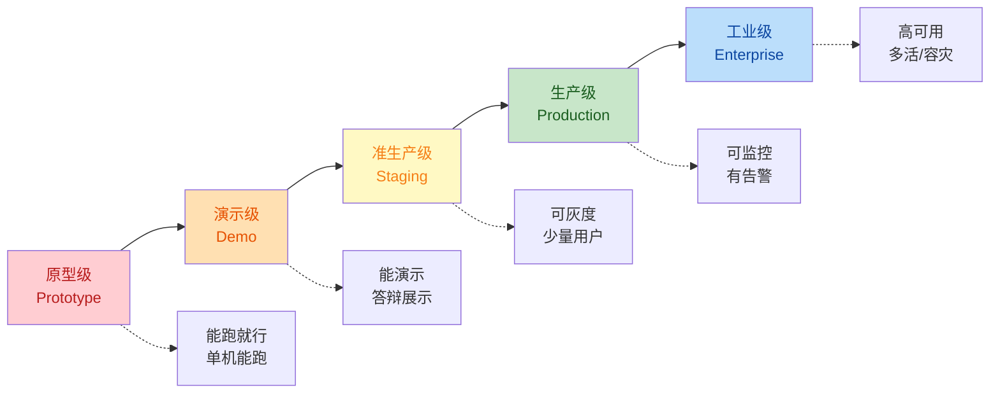

| 等级 | 特征 | 适合场景 |
|------|------|----------|
| **原型级** | 单机能跑、缺乏错误处理、硬编码 | 个人学习、概念验证 |
| **演示级** | 完整功能、能演示、无监控 | 课程作业、毕业设计 |
| **准生产级** | 有日志、有缓存、有降级、缺监控告警 | 内部工具、PoC |
| **生产级** | 完整可观测、可灰度、可回滚、有告警 | 商业产品、SaaS |
| **工业级** | 多活容灾、自动扩缩、混沌工程 | 大型企业、关键基础设施 |

本项目当前定位：**演示级 → 准生产级**（v0.4 完成后），目标是**生产级**（v1.0 交付时）。

### 1.3 8 大生产级维度

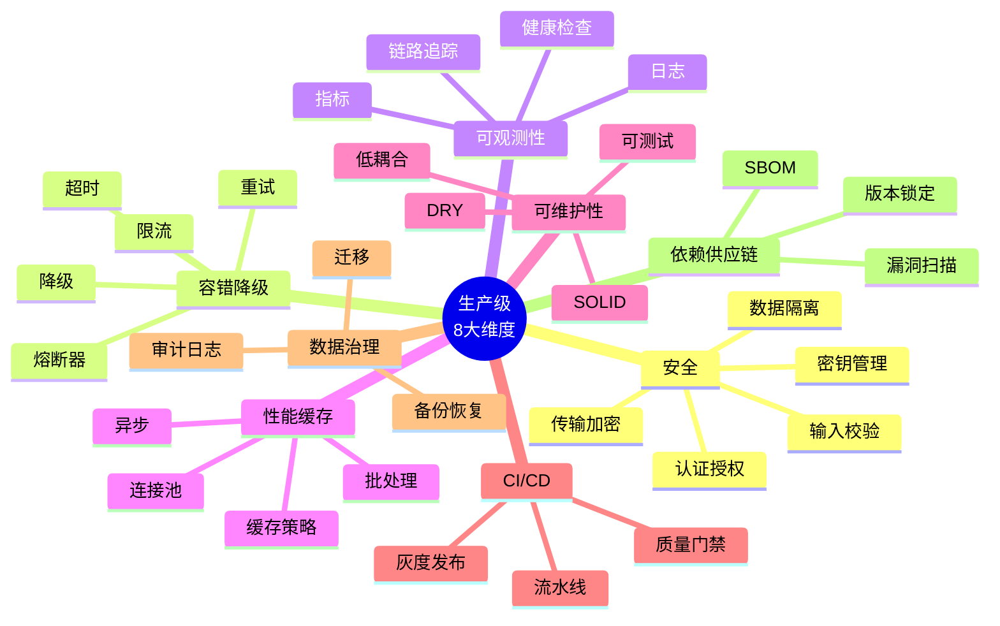

### 1.4 强制等级标识

| 标识 | 含义 | 违反后果 |
|------|------|---------|
| **【P0 强制】** | 阻塞生产部署，不允许违反 | Code Review 拒绝合并 |
| **【P1 强烈推荐】** | 生产环境必须满足，特殊场景可豁免 | 需在 PR 描述中说明 |
| **【P2 推荐】** | 建议满足，提升可维护性 | 无强制要求 |
| **【P3 参考】** | 仅供参考，自由选择 | 无 |

### 1.5 适用读者

- **开发工程师**：编写生产级代码的参考手册
- **Code Reviewer**：审查他人代码的检查清单
- **架构师**：评估系统生产级水平
- **答辩演讲者**：准备"生产级"特性介绍素材

---

## 2 维度一：安全（Security）

### 2.1 安全维度评估清单

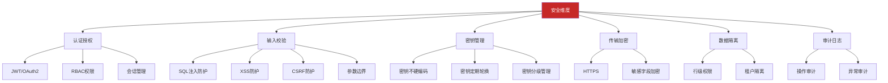

### 2.2 【P0 强制】认证与授权

#### 2.2.1 JWT 实现规范

```yaml
# 【强制】JWT 必须满足以下要求
algorithm: HS256              # 至少 HS256，生产环境推荐 RS256
secret_length: >= 32 bytes    # 密钥长度必须 >= 32 字节
expiration: 24h               # 有效期不超过 24 小时
refresh_strategy: rotate      # 刷新机制：滚动续签或重新登录
blacklist: enabled            # 必须支持主动失效（Redis 黑名单）
jti_required: true            # 必须包含 JTI 声明（用于黑名单）
issuer: configured            # 必须配置 iss 声明
audience: configured          # 必须配置 aud 声明
clock_skew: <= 30s            # 时钟偏移容忍不超过 30 秒
```

**代码示例（Java）**：

```java
// ✅ 推荐：完整 JWT 工具类应包含的检查
public class JwtUtil {
    private static final int MIN_SECRET_LENGTH = 32;

    @PostConstruct
    void validateSecret() {
        if (secret == null || secret.getBytes(UTF_8).length < MIN_SECRET_LENGTH) {
            throw new IllegalStateException(
                "JWT secret must be at least 32 characters"
            );
        }
    }

    public Claims parseToken(String token) {
        try {
            return Jwts.parser()
                    .verifyWith(getSigningKey())
                    .requireIssuer(EXPECTED_ISSUER)
                    .clockSkewSeconds(30)
                    .build()
                    .parseSignedClaims(token)
                    .getPayload();
        } catch (ExpiredJwtException | MalformedJwtException
                 | SecurityException | UnsupportedJwtException e) {
            // 静默失败，由 EntryPoint 统一返回 401
            log.debug("JWT invalid: {}", e.getMessage());
            return null;
        }
    }
}
```

**代码示例（前端）**：

```typescript
// ✅ 推荐：401 自动登出 + 重定向
http.interceptors.response.use(
  (response) => response,
  async (error) => {
    if (error.response?.status === 401) {
      const { useUserStore } = await import('@/stores/userStore')
      const { default: router } = await import('@/router')
      const userStore = useUserStore()
      userStore.logout()
      router.push('/login?redirect=' + encodeURIComponent(router.currentRoute.value.fullPath))
      ElMessage.error('登录已过期，请重新登录')
    }
    return Promise.reject(error)
  }
)
```

#### 2.2.2 密码管理规范

```yaml
# 【强制】密码存储
algorithm: BCrypt
cost_factor: 10              # 推荐 10-12，权衡性能与安全
salt: built-in                # BCrypt 内置盐值，无需额外生成
min_length: 8                 # 最低长度要求
complexity:                   # 复杂度策略
  - 至少包含字母和数字
  - 建议包含大小写混合
  - 建议包含特殊字符
  - 禁止使用常见弱密码

# 【强制】密码传输
transport: HTTPS              # 必须 HTTPS 传输
plain_log: forbidden          # 禁止明文记录密码
log_masking: required         # 日志脱敏
```

**反模式 ❌**：
```java
// ❌ 错误：使用 MD5/SHA1 存储密码
String hashed = DigestUtils.md5Hex(password);  // 已破解算法

// ❌ 错误：明文比较
if (inputPassword.equals(storedPassword)) { ... }

// ❌ 错误：自定义 salt 拼接
String hashed = sha256(password + "mysalt");  // 盐值应为 BCrypt 内置
```

#### 2.2.3 接口鉴权规范

```yaml
# 【强制】接口鉴权矩阵
公开接口（无需 Token）:
  - /api/users/register
  - /api/users/login
  - /health
  - /actuator/health

需要 Token 的接口:
  - 其他所有 /api/** 端点

需要特定角色的接口:
  - 管理员接口：@PreAuthorize("hasRole('ADMIN')")
  - VIP 接口：@PreAuthorize("hasRole('VIP')")
```

### 2.3 【P0 强制】输入校验

#### 2.3.1 SQL 注入防护

```java
// ✅ 推荐：JPA 参数化查询
@Query("SELECT p FROM Paper p WHERE p.year = :year AND p.venue = :venue")
List<Paper> searchByYearAndVenue(@Param("year") int year, @Param("venue") String venue);

// ✅ 推荐：MyBatis #{} 占位符
SELECT * FROM papers WHERE year = #{year} AND venue = #{venue}

// ❌ 禁止：字符串拼接
"SELECT * FROM papers WHERE year = " + year    // SQL 注入风险
"SELECT * FROM papers WHERE venue = '" + venue + "'"  // 严重风险
```

#### 2.3.2 XSS 防护

```typescript
// ✅ 推荐：使用安全渲染（Vue 3 默认转义）
<div>{{ userInput }}</div>  // 自动转义

// ❌ 禁止：v-html 不转义
<div v-html="userInput"></div>  // XSS 风险

// ✅ 推荐：富文本使用安全库
import DOMPurify from 'dompurify'
const safeHtml = DOMPurify.sanitize(dirtyHtml)
```

#### 2.3.3 参数边界

```java
// ✅ 推荐：显式边界校验
public PageResponse<Paper> searchPapers(
    @Min(1) @Max(1000) int page,
    @Min(1) @Max(100) int size,           // 防止大 size 拖慢 DB
    @Size(max = 500) String query,        // 防止超长查询
    @Pattern(regexp = "^[a-zA-Z0-9_\\s]+$") String venue  // 白名单字符
) { ... }
```

### 2.4 【P0 强制】密钥管理

```yaml
# 【强制】密钥分级
L0 公开信息:
  - 客户端 ID
  - 算法名称
  - 接口地址
  存储: 配置文件
  提交: 允许

L1 业务密钥:
  - 数据库密码
  - Redis 密码
  - JWT 签名密钥
  存储: 环境变量 / 密钥管理服务
  提交: 禁止

L2 高危密钥:
  - 主密钥
  - 支付密钥
  - 用户隐私密钥
  存储: 专用 KMS（AWS KMS / HashiCorp Vault）
  提交: 禁止

# 【推荐】密钥轮换周期
JWT_SECRET: 90 天
DB_PASSWORD: 180 天
API_KEY: 30 天
```

**代码示例**：

```java
// ✅ 推荐：使用 @Value 注入
@Value("${jwt.secret}")
private String jwtSecret;

// ❌ 禁止：硬编码
private static final String JWT_SECRET = "my-super-secret-key";  // 灾难
```

### 2.5 【P0 强制】数据隔离

```java
// ✅ 推荐：所有查询必须带 user_id 过滤
@Query("SELECT a FROM AnalysisResult a WHERE a.userId = :userId AND a.id = :id")
Optional<AnalysisResult> findByUserIdAndId(@Param("userId") String userId,
                                            @Param("id") String id);

// ❌ 禁止：先查后过滤
public AnalysisResult getById(String id) {
    return repository.findById(id).orElseThrow();  // 可能查到他人的数据
}
```

### 2.6 【P1 强烈推荐】审计日志

```java
// ✅ 推荐：关键操作记录审计日志
@Aspect
@Component
public class AuditLogAspect {
    @AfterReturning("@annotation(auditLog)")
    public void audit(JoinPoint jp, AuditLog auditLog) {
        String userId = SecurityContextHolder.getContext()
            .getAuthentication().getName();
        String action = auditLog.action();
        log.info("AUDIT user={} action={} method={} args={}",
            userId, action, jp.getSignature().getName(),
            sanitizeArgs(jp.getArgs()));
    }
}

// 使用
@AuditLog(action = "DELETE_USER")
public void deleteUser(String userId) { ... }
```

---

## 3 维度二：容错降级（Resilience）

### 3.1 容错降级金字塔

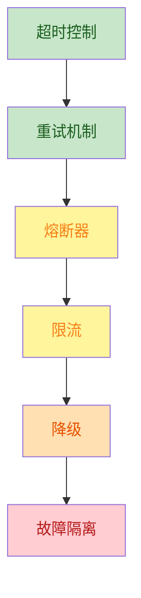

### 3.2 【P0 强制】超时控制

```yaml
# 【强制】所有外部调用必须设置超时
fastapi_request:
  connect_timeout: 5s         # 连接超时
  read_timeout: 120s          # 读取超时（覆盖 AI Agent 完整工作流）

java_http_client:
  connect_timeout: 5s
  read_timeout: 150s          # 比 AI 服务略大，留出重试空间

database_query:
  query_timeout: 10s          # 防止慢查询拖垮连接池

llm_call:
  api_timeout: 60s
  total_timeout: 120s
```

**反模式 ❌**：
```python
# ❌ 错误：HTTP 调用无超时
response = requests.get(url)  # 默认无超时，永久阻塞
```

**推荐 ✅**：
```python
# ✅ 推荐：使用 httpx 异步 + 超时
async with httpx.AsyncClient(timeout=httpx.Timeout(30.0)) as client:
    response = await client.get(url)
```

### 3.3 【P0 强制】重试机制

```yaml
# 【强制】重试策略
retryable_errors:
  - 5xx 错误（服务端故障）
  - 网络超时（TimeoutException）
  - 连接重置（ConnectionReset）
non_retryable_errors:
  - 4xx 错误（客户端错误，重试无意义）
  - 鉴权错误（401, 403）
  - 业务校验错误（422）

max_retries: 2                # 最多重试 2 次（共 3 次调用）
backoff: exponential          # 指数退避
initial_interval: 1s          # 首次重试延迟 1 秒
max_interval: 10s             # 最长重试间隔 10 秒
jitter: 0.1                   # 10% 抖动，避免雷鸣群
```

**代码示例（Java Resilience4j）**：
```java
RetryConfig config = RetryConfig.custom()
    .maxAttempts(3)
    .intervalFunction(IntervalFunction.ofExponentialRandomBackoff(
        Duration.ofSeconds(1), 1.5, 0.1))
    .retryOnException(t -> isRetryable(t))
    .build();

Retry retry = Retry.of("aiService", config);
CheckedFunction0<String> decorated = Retry.decorateCheckedSupplier(
    retry, () -> aiClient.analyze(request));
```

### 3.4 【P1 强烈推荐】熔断器

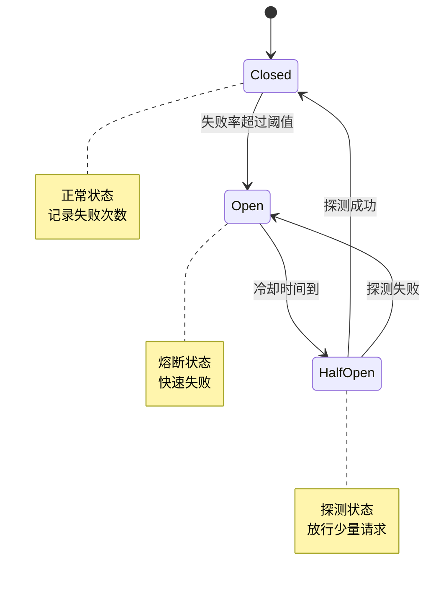

```yaml
# 【推荐】熔断器配置
sliding_window_size: 100       # 滑动窗口 100 次请求
failure_rate_threshold: 50     # 失败率 50% 触发熔断
wait_duration_in_open_state: 30s  # 熔断后等待 30 秒
permitted_number_of_calls_in_half_open: 10  # 半开状态放行 10 次探测
slow_call_rate_threshold: 80   # 慢调用率 80% 触发熔断
slow_call_duration_threshold: 5s  # 慢调用阈值 5 秒
```

### 3.5 【P1 强烈推荐】限流

```yaml
# 【推荐】限流策略
限流维度:
  - IP 维度: 100 QPS（防 DDoS）
  - 用户维度: 10 QPS（防刷接口）
  - 接口维度: 自定义（防重操作）
  - 全局维度: 服务总 QPS 上限

限流算法:
  - 令牌桶: 适合突发流量
  - 滑动窗口: 适合精确控制
  - 漏桶: 适合平滑流量

触发限流响应:
  HTTP状态码: 429 Too Many Requests
  响应头: Retry-After
  错误码: RATE_LIMIT_EXCEEDED
```

**代码示例（Bucket4j）**：
```java
Bucket bucket = Bucket.builder()
    .addLimit(limit -> limit.capacity(100).refillIntervally(100, Duration.ofMinutes(1)))
    .build();

if (bucket.tryConsume(1)) {
    // 放行
} else {
    throw new RateLimitException("请求过于频繁，请稍后重试");
}
```

### 3.6 【P0 强制】降级策略

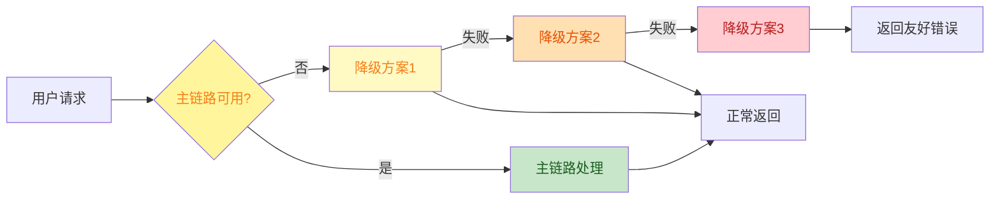

**LLM 三路降级示例**：

```python
class LLMService:
    async def generate(self, prompt: str) -> str:
        # 降级链：builtin → api → local
        for provider in self._ordered_providers():
            try:
                return await provider.generate(prompt, timeout=60)
            except RetryableError as e:
                logger.warning(f"Provider {provider.name} failed: {e}, try next")
                await asyncio.sleep(self._backoff(provider))
                continue
            except NonRetryableError as e:
                logger.error(f"Provider {provider.name} non-retryable: {e}")
                continue

        # 全失败兜底
        return self._builtin_fallback(prompt)
```

### 3.7 【P0 强制】故障隔离

```yaml
# 【强制】故障隔离原则
原则1: 进程隔离
  - 核心服务独立部署
  - 不稳定服务独立部署
  - 数据库按业务域拆分

原则2: 资源隔离
  - 线程池隔离（不同业务用不同线程池）
  - 连接池隔离（不同 DB 用不同连接池）
  - 限流隔离（不同接口不同限流）

原则3: 降级隔离
  - 单服务降级不影响核心链路
  - 单 Agent 失败不影响其他 Agent
  - 单表故障不影响核心查询
```

---

## 4 维度三：可观测性（Observability）

### 4.1 三大支柱

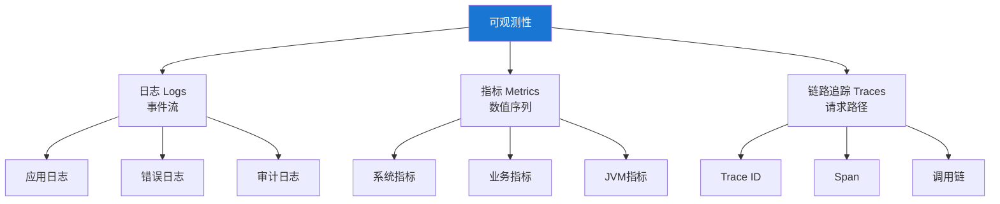

### 4.2 【P0 强制】日志规范

#### 4.2.1 日志级别

| 级别 | 使用场景 | 示例 |
|------|----------|------|
| **ERROR** | 影响功能的错误，需人工介入 | AI 服务调用失败 |
| **WARN** | 潜在问题，不影响主流程 | 缓存未命中、降级触发 |
| **INFO** | 关键业务流程节点 | 用户登录、Agent 完成 |
| **DEBUG** | 调试信息，开发环境 | SQL 查询、API 参数 |
| **TRACE** | 详细追踪，仅排障时开启 | 方法进出、变量值 |

**反模式 ❌**：
```java
// ❌ 错误：循环内 INFO 日志（性能杀手）
for (Paper p : papers) {
    log.info("Processing paper: {}", p.getId());  // 1000+ 条日志
}

// ❌ 错误：敏感信息未脱敏
log.info("User login: username={}, password={}", username, password);

// ❌ 错误：异常链断裂
log.error("Error: " + e.getMessage());  // 丢失堆栈
```

**推荐 ✅**：
```java
// ✅ 推荐：循环外摘要日志
log.info("Processing {} papers", papers.size());
int success = 0, failed = 0;
for (Paper p : papers) {
    try {
        process(p);
        success++;
    } catch (Exception e) {
        failed++;
    }
}
log.info("Processed papers: success={}, failed={}", success, failed);

// ✅ 推荐：敏感信息脱敏
log.info("User login: username={}, password=****", username);

// ✅ 推荐：保留异常堆栈
log.error("Processing failed: paperId={}", paperId, e);
```

#### 4.2.2 统一日志格式

```yaml
# Java (Logback)
pattern: "%d{yyyy-MM-dd HH:mm:ss.SSS} [%thread] [requestId=%X{requestId}, userId=%X{userId}] %-5level %logger{36} - %msg%n"

# Python (Loguru)
format: "{time:YYYY-MM-DD HH:mm:ss.SSS} | {level:<8} | {name}:{function}:{line} | requestId={extra[requestId]} | {message}"
```

#### 4.2.3 MDC 上下文

```java
// ✅ 推荐：Filter 注入 requestId + userId 到 MDC
@Component
@Order(Ordered.HIGHEST_PRECEDENCE)
public class RequestIdFilter implements Filter {
    @Override
    public void doFilter(ServletRequest req, ServletResponse resp, FilterChain chain) {
        HttpServletRequest httpReq = (HttpServletRequest) req;
        String requestId = Optional.ofNullable(httpReq.getHeader("X-Request-Id"))
            .orElse(UUID.randomUUID().toString().replace("-", ""));
        MDC.put("requestId", requestId);

        try {
            chain.doFilter(req, resp);
        } finally {
            MDC.clear();
        }
    }
}

// ✅ 推荐：JWT 过滤器注入 userId
@Component
public class JwtAuthFilter extends OncePerRequestFilter {
    @Override
    protected void doFilterInternal(HttpServletRequest req, ...) {
        Claims claims = jwtUtil.parseToken(token);
        if (claims != null) {
            String userId = claims.getSubject();
            MDC.put("userId", userId);  // 所有后续日志自动带 userId
        }
    }
}
```

### 4.3 【P1 强烈推荐】指标（Metrics）

#### 4.3.1 指标分类

```yaml
# 系统指标
system:
  - jvm.memory.used           # JVM 堆内存
  - jvm.gc.pause              # GC 暂停时间
  - jvm.threads.count         # 线程数
  - system.cpu.usage          # CPU 使用率
  - system.disk.usage         # 磁盘使用率

# 中间件指标
middleware:
  - hikari.connections.active # DB 连接池活跃数
  - hikari.connections.idle   # 空闲连接数
  - hikari.connections.pending  # 等待连接数（>0 告警）
  - redis.commands.total      # Redis 命令总数
  - redis.commands.duration   # Redis 命令延迟

# 业务指标
business:
  - api.requests.total        # API 请求总数（按端点）
  - api.requests.duration     # API 响应时间
  - api.errors.total          # 错误总数
  - llm.tokens.usage          # LLM token 消耗
  - llm.providers.active      # 当前活跃 LLM provider
  - agent.duration            # Agent 执行时长
  - cache.hit_ratio           # 缓存命中率
```

#### 4.3.2 关键 SLO 指标

```yaml
# 【推荐】服务级别目标 (SLO)
可用性:
  - API 成功率: >= 99.9%
  - 核心链路成功率: >= 99.95%

延迟:
  - P50 响应时间: <= 200ms
  - P95 响应时间: <= 1s
  - P99 响应时间: <= 3s
  - AI 完整工作流: <= 120s

吞吐:
  - API QPS: >= 100
  - LLM QPS: >= 10

错误率:
  - 5xx 错误率: < 0.1%
  - 4xx 错误率: < 5%（业务校验）
```

### 4.4 【P1 强烈推荐】链路追踪

```yaml
# 【推荐】OpenTelemetry 规范
trace_id: X-Trace-Id             # 全局唯一
span_id: 自动生成                 # 当前操作
parent_span_id: 父 span id        # 调用层级
trace_context_propagation:
  header: traceparent             # W3C 标准
  format: W3C TraceContext

采样策略:
  - 错误请求 100% 采样
  - 慢请求（> 1s）100% 采样
  - 正常请求 10% 采样
  - 关键接口 100% 采样
```

**反模式 ❌**：
```python
# ❌ 错误：跨服务调用未透传 trace_id
# Java 调用 Python 时未传递 traceparent
headers = {"Authorization": f"Bearer {token}"}  # 丢失 trace 上下文
```

**推荐 ✅**：
```python
# ✅ 推荐：跨服务调用透传 trace context
from opentelemetry import trace
from opentelemetry.propagate import inject

headers = {"Authorization": f"Bearer {token}"}
inject(headers)  # 自动注入 traceparent
response = httpx.post(url, headers=headers, json=data)
```

### 4.5 【P0 强制】健康检查

```yaml
# 【强制】健康检查端点
endpoint: /health
method: GET
response_format:
  status: UP | DOWN | DEGRADED
  components:
    mysql: UP | DOWN
    redis: UP | DOWN
    ai_service: UP | DOWN
    chroma: UP | DOWN
    llm_providers: UP | DEGRADED
  timestamp: ISO-8601

# 【推荐】探针分离
liveness: /health/live          # 进程是否存活
readiness: /health/ready        # 是否可接收流量
startup: /health/startup        # 启动是否完成
```

**代码示例（Java）**：
```java
@RestController
public class HealthController {

    @GetMapping("/health/live")
    public ResponseEntity<Map<String, String>> liveness() {
        return ResponseEntity.ok(Map.of("status", "UP"));
    }

    @GetMapping("/health/ready")
    public ResponseEntity<Map<String, Object>> readiness() {
        Map<String, Object> health = new HashMap<>();
        String mysql = checkMysql();
        String redis = checkRedis();
        String ai = checkAIService();
        boolean ready = "UP".equals(mysql) && "UP".equals(redis);

        health.put("status", ready ? "UP" : "DOWN");
        health.put("components", Map.of(
            "mysql", mysql, "redis", redis, "aiService", ai));
        return ResponseEntity
            .status(ready ? HttpStatus.OK : HttpStatus.SERVICE_UNAVAILABLE)
            .body(health);
    }
}
```

---

## 5 维度四：性能与缓存（Performance）

### 5.1 性能优化金字塔

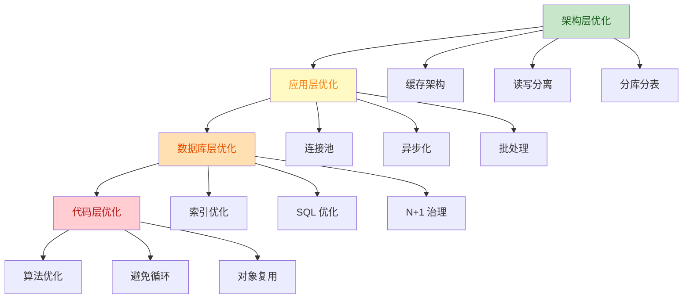

### 5.2 【P0 强制】缓存策略

#### 5.2.1 Cache-Aside 模式

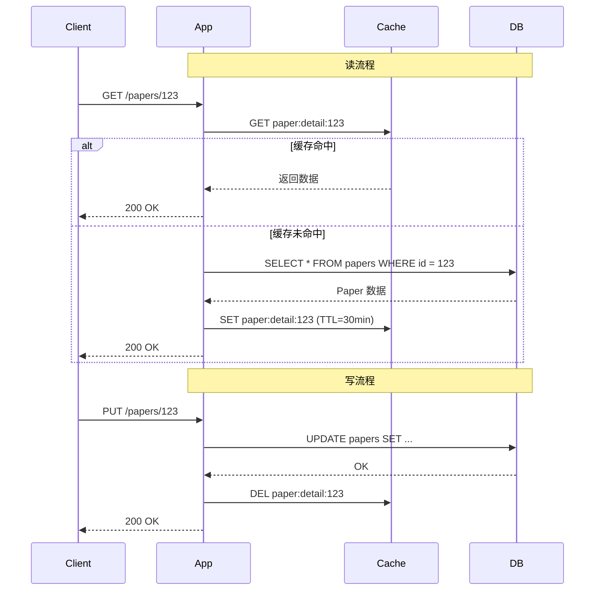

#### 5.2.2 多级缓存 TTL 设计

```yaml
# 【推荐】不同数据使用不同 TTL
user_profile:
  ttl: 1h
  jitter: 10%        # 抖动防雪崩
  reason: 用户画像更新频率低

paper_detail:
  ttl: 30min
  jitter: 10%
  reason: 论文元数据相对稳定

paper_search:
  ttl: 10min
  jitter: 10%
  reason: 搜索结果可能快速变化

analysis_result:
  ttl: 30min
  jitter: 10%
  reason: 分析结果不变，但可作为快速加载

session_state:
  ttl: 2h
  jitter: 10%
  reason: 会话状态有生命周期
```

#### 5.2.3 缓存三连击防护

```yaml
# 【强制】缓存三大问题防护
缓存穿透（Cache Penetration）:
  定义: 查询不存在的数据，每次都打到 DB
  防护: 空值缓存 + 布隆过滤器

缓存击穿（Cache Breakdown）:
  定义: 热点 key 过期瞬间，大量请求打到 DB
  防护: 分布式锁 + 逻辑过期 + 单飞（singleflight）

缓存雪崩（Cache Avalanche）:
  定义: 大量 key 同时过期，DB 瞬时压力过大
  防护: TTL 抖动 + 多级缓存 + 预热
```

**代码示例（Java 缓存防护）**：
```java
@Cacheable(value = "paperDetail", key = "#paperId",
           unless = "#result == null",  // 空值不缓存
           sync = true)                // 防止击穿（单飞）
@Transactional(readOnly = true)
public PaperDetailResponse getPaperDetail(String paperId) {
    return paperRepository.findByPaperId(paperId)
        .map(paperMapper::toDetailResponse)
        .orElseThrow(() -> new ResourceNotFoundException("Paper", paperId));
}
```

### 5.3 【P0 强制】连接池

```yaml
# 【强制】HikariCP 配置
spring:
  datasource:
    hikari:
      minimum-idle: 5
      maximum-pool-size: 20          # 根据压测调整
      connection-timeout: 30000       # 30s 获取连接超时
      idle-timeout: 600000            # 10min 空闲回收
      max-lifetime: 1800000           # 30min 连接最大生命周期
      pool-name: LiteratureHikariCP
      connection-test-query: SELECT 1

# 【推荐】Redis 客户端配置
spring:
  data:
    redis:
      lettuce:
        pool:
          max-active: 16
          max-idle: 8
          min-idle: 2
          max-wait: 2s
        shutdown-timeout: 200ms
```

### 5.4 【P1 强烈推荐】异步与并发

```java
// ✅ 推荐：异步 + 线程池隔离
@Configuration
@EnableAsync
public class AsyncConfig {

    @Bean("aiAnalysisExecutor")
    public Executor aiAnalysisExecutor() {
        ThreadPoolTaskExecutor executor = new ThreadPoolTaskExecutor();
        executor.setCorePoolSize(5);
        executor.setMaxPoolSize(20);
        executor.setQueueCapacity(100);
        executor.setThreadNamePrefix("ai-analysis-");
        executor.setRejectedExecutionHandler(new CallerRunsPolicy());
        // 关键：独立线程池，不与其他业务混用
        return executor;
    }
}

@Service
public class AnalysisService {
    @Async("aiAnalysisExecutor")
    public CompletableFuture<AnalysisResult> analyzeAsync(Paper paper) {
        // 异步处理
    }
}
```

**反模式 ❌**：
```python
# ❌ 错误：异步函数内调用阻塞 I/O
async def analyze(paper):
    response = requests.post(url, json=data)  # 阻塞整个事件循环
    return response.json()

# ✅ 正确：使用异步 HTTP 客户端
async def analyze(paper):
    async with httpx.AsyncClient() as client:
        response = await client.post(url, json=data)
        return response.json()
```

### 5.5 【P1 强烈推荐】批处理

```python
# ✅ 推荐：批量向量化（避免 N 次远程调用）
class EmbeddingService:
    def encode_batch(self, texts: List[str], batch_size: int = 32) -> List[List[float]]:
        """批量编码，比单条调用快 10-50 倍"""
        results = []
        for i in range(0, len(texts), batch_size):
            batch = texts[i:i + batch_size]
            batch_embeddings = self._client.embeddings.create(
                model=self.model_name,
                input=batch,  # 一次请求多条
            )
            results.extend([e.embedding for e in batch_embeddings.data])
        return results
```

---

## 6 维度五：可维护性（Maintainability）

### 6.1 SOLID 原则

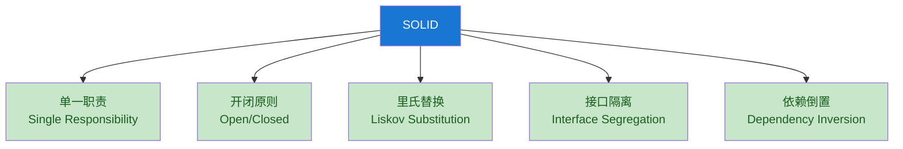

### 6.2 【P0 强制】单一职责原则（SRP）

```java
// ❌ 反例：用户服务做太多事
@Service
public class UserService {
    public void register(User user) { ... }
    public void sendEmail(String to, String content) { ... }   // 邮件是另一个职责
    public String generateReport(List<User> users) { ... }     // 报表是另一个职责
    public void logOperation(String op) { ... }                // 日志是另一个职责
}

// ✅ 正例：职责分离
@Service
public class UserService { public void register(User user) { ... } }
@Service
public class EmailService { public void send(String to, String content) { ... } }
@Service
public class ReportService { public String generate(List<User> users) { ... } }
@Aspect
public class AuditAspect { public void logOperation(String op) { ... } }
```

### 6.3 【P0 强制】开闭原则（OCP）

```java
// ✅ 正例：通过策略模式扩展，不修改原代码
public interface LLMStrategy {
    String generate(String prompt);
    boolean isAvailable();
}

@Component
public class BuiltinLLMStrategy implements LLMStrategy { ... }

@Component
public class ApiLLMStrategy implements LLMStrategy { ... }

@Component
public class LocalLLMStrategy implements LLMStrategy { ... }

@Component
public class LLMService {
    private final List<LLMStrategy> strategies;

    public String generate(String prompt) {
        return strategies.stream()
            .filter(LLMStrategy::isAvailable)
            .findFirst()
            .map(s -> s.generate(prompt))
            .orElseThrow(() -> new LLMException("No available LLM"));
    }
}
```

### 6.4 【P0 强制】依赖倒置原则（DIP）

```java
// ❌ 反例：高层模块直接依赖低层模块
public class AnalysisService {
    private OpenAIClient openai = new OpenAIClient();  // 直接 new，耦合严重
}

// ✅ 正例：通过接口依赖，由 Spring 注入
public class AnalysisService {
    private final LLMProvider llmProvider;  // 接口依赖

    public AnalysisService(LLMProvider llmProvider) {
        this.llmProvider = llmProvider;
    }
}
```

### 6.5 【P0 强制】可测试性

```java
// ✅ 推荐：构造器注入 + 接口，便于 Mock
@Service
public class AnalysisService {
    private final PaperRepository paperRepo;
    private final LLMProvider llmProvider;
    private final CacheManager cacheManager;

    public AnalysisService(PaperRepository paperRepo,
                            LLMProvider llmProvider,
                            CacheManager cacheManager) {
        this.paperRepo = paperRepo;
        this.llmProvider = llmProvider;
        this.cacheManager = cacheManager;
    }
}

// ❌ 反例：静态方法 + 字段注入，难以测试
@Service
public class BadService {
    @Autowired
    private PaperRepository paperRepo;  // 字段注入

    public void process() {
        UserContext.setUserId("hard-coded");  // 静态状态
        // ...
    }
}
```

### 6.6 【P1 强烈推荐】DRY 原则

```python
# ❌ 反例：3 个 Agent 重复相同代码
class RetrieverAgent:
    async def execute(self, state):
        start = time.time()
        try:
            result = await self.llm.generate(...)
            state["retriever_result"] = result
            return state
        except Exception as e:
            state["errors"].append({"agent": "retriever", "error": str(e)})
            return state
        finally:
            duration = time.time() - start
            state["agent_states"]["retriever"] = {
                "duration": duration, "status": "completed"}

class AnalyzerAgent:
    async def execute(self, state):
        # 几乎一样的代码，只是名字不同
        start = time.time()
        try:
            ...

# ✅ 正例：抽取基类
class BaseAgent:
    async def execute(self, state):
        start = time.time()
        try:
            result = await self._do_execute(state)
            state[f"{self.name}_result"] = result
            return state
        except Exception as e:
            state["errors"].append({"agent": self.name, "error": str(e)})
            return state
        finally:
            self._record_state(state, start)

    @abstractmethod
    async def _do_execute(self, state):
        """子类实现具体逻辑"""
        pass

class RetrieverAgent(BaseAgent):
    async def _do_execute(self, state):
        return await self.llm.generate(self._build_prompt(state))
```

### 6.7 【P1 强烈推荐】代码复杂度

```yaml
# 【推荐】圈复杂度阈值
cyclomatic_complexity:
  P0: <= 10         # 必须满足
  P1: <= 15         # 强烈推荐
  P2: <= 20         # 推荐

# 【推荐】函数长度阈值
function_lines:
  P0: <= 50
  P1: <= 100
  P2: <= 200

# 【推荐】类长度阈值
class_lines:
  P0: <= 300
  P1: <= 500
  P2: <= 1000
```

---

## 7 维度六：CI/CD 与质量门禁（Delivery）

### 7.1 CI/CD 流水线

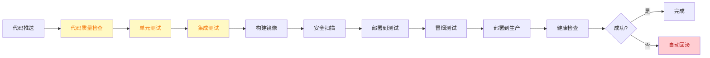

### 7.2 【P0 强制】质量门禁

```yaml
# 【强制】合并前必须通过的检查
quality_gates:
  编译:
    - Java: mvn compile 必须通过
    - Python: ruff check + mypy 必须通过
    - TypeScript: tsc --noEmit 必须通过

  单元测试:
    - Java: mvn test 覆盖率 >= 60%
    - Python: pytest 覆盖率 >= 60%
    - TypeScript: vitest --coverage

  集成测试:
    - 关键 API 接口测试通过
    - Agent 协同测试通过

  代码规范:
    - ruff/black 通过
    - checkstyle 通过
    - eslint 通过

  安全扫描:
    - npm audit 通过
    - pip-audit 通过
    - trivy 镜像扫描通过
```

### 7.3 【P1 强烈推荐】GitHub Actions 示例

```yaml
# .github/workflows/ci.yml
name: CI

on:
  push:
    branches: [main, develop]
  pull_request:
    branches: [main, develop]

jobs:
  test-backend:
    runs-on: ubuntu-latest
    services:
      mysql:
        image: mysql:8.0
        env:
          MYSQL_ROOT_PASSWORD: test123
        ports: ['3306:3306']
        options: --health-cmd "mysqladmin ping" --health-interval 10s
      redis:
        image: redis:7-alpine
        ports: ['6379:6379']

    steps:
      - uses: actions/checkout@v4
      - uses: actions/setup-java@v4
        with:
          java-version: '17'
          distribution: 'temurin'
      - name: Build & Test
        run: |
          cd backend
          mvn clean verify
      - name: Upload Coverage
        uses: codecov/codecov-action@v3

  test-ai-service:
    runs-on: ubuntu-latest
    steps:
      - uses: actions/checkout@v4
      - uses: actions/setup-python@v5
        with:
          python-version: '3.10'
      - name: Install & Test
        run: |
          cd ai-service
          pip install -r requirements.txt
          pytest --cov=app --cov-report=xml
      - name: Lint
        run: |
          ruff check app/
          mypy app/

  test-frontend:
    runs-on: ubuntu-latest
    steps:
      - uses: actions/checkout@v4
      - uses: actions/setup-node@v4
        with:
          node-version: '18'
      - name: Install & Test
        run: |
          cd frontend
          npm ci
          npm run test:coverage
          npm run build
```

### 7.4 【P2 推荐】灰度发布策略

```yaml
# 【推荐】灰度发布策略
canary_release:
  阶段1: 5% 流量切到新版本，观察 30 分钟
  阶段2: 25% 流量切到新版本，观察 1 小时
  阶段3: 50% 流量，观察 2 小时
  阶段4: 100% 流量
  任何阶段错误率 > 1% 自动回滚

blue_green:
  蓝环境: 当前生产版本
  绿环境: 新版本
  切换: 路由器瞬间切换流量
  回滚: 路由器切回蓝环境（秒级）

ab_testing:
  A 版本: 控制组
  B 版本: 实验组
  流量分配: 可配置（50/50, 80/20, 90/10）
  衡量指标: 转化率、错误率、响应时间
```

---

## 8 维度七：数据治理（Data Governance）

### 8.1 【P0 强制】备份与恢复

```yaml
# 【强制】数据备份策略
MySQL:
  全量备份: 每日 02:00（业务低峰期）
  增量备份: 每 6 小时
  binlog 保留: 7 天
  备份文件: 异地存储（OSS / S3）
  RPO: <= 6 小时
  RTO: <= 4 小时

Redis:
  备份方式: RDB 快照
  频率: 每 15 分钟（最多丢失 15 分钟数据）
  说明: Redis 是缓存，允许少量数据丢失

ChromaDB:
  备份方式: 目录打包
  频率: 每日 02:00
  说明: 向量数据可从 MySQL 重建

# 【强制】恢复演练
recovery_drill:
  频率: 季度
  流程: 模拟故障 → 启动恢复 → 验证数据
  记录: 恢复时长、问题、改进措施
```

### 8.2 【P0 强制】数据迁移

```yaml
# 【强制】数据库迁移规范
工具: Flyway / Liquibase

# 迁移脚本命名
V1__create_users_table.sql
V2__add_user_profile_table.sql
V3__add_paper_fulltext_index.sql
V100__add_paper_favorite_table.sql

# 迁移脚本规范
1. 不可逆变更必须备份
2. 大表 ALTER 必须使用 pt-online-schema-change
3. 迁移必须在测试环境验证
4. 迁移必须有回滚预案
5. 迁移期间应用必须支持双写或降级
```

**Flyway 脚本示例**：
```sql
-- V101__add_paper_favorite_table.sql
CREATE TABLE paper_favorites (
    id BIGINT AUTO_INCREMENT PRIMARY KEY,
    user_id VARCHAR(100) NOT NULL,
    paper_id VARCHAR(100) NOT NULL,
    created_at TIMESTAMP DEFAULT CURRENT_TIMESTAMP,
    UNIQUE KEY uk_user_paper (user_id, paper_id),
    INDEX idx_user_id (user_id),
    INDEX idx_paper_id (paper_id),
    INDEX idx_created_at (created_at)
) ENGINE=InnoDB DEFAULT CHARSET=utf8mb4
  COMMENT='用户论文收藏表';
```

### 8.3 【P1 强烈推荐】审计日志

```sql
-- 审计日志表设计
CREATE TABLE audit_logs (
    id BIGINT AUTO_INCREMENT PRIMARY KEY,
    request_id VARCHAR(64) NOT NULL COMMENT '请求ID',
    user_id VARCHAR(100) NOT NULL COMMENT '操作用户',
    action VARCHAR(50) NOT NULL COMMENT '操作类型',
    resource_type VARCHAR(50) NOT NULL COMMENT '资源类型',
    resource_id VARCHAR(100) COMMENT '资源ID',
    method VARCHAR(10) COMMENT 'HTTP方法',
    path VARCHAR(500) COMMENT '请求路径',
    ip VARCHAR(45) COMMENT '客户端IP',
    user_agent VARCHAR(500) COMMENT 'User Agent',
    status_code INT COMMENT '响应状态码',
    duration_ms INT COMMENT '耗时',
    details JSON COMMENT '操作详情',
    created_at TIMESTAMP DEFAULT CURRENT_TIMESTAMP,
    INDEX idx_user_id (user_id),
    INDEX idx_action (action),
    INDEX idx_created_at (created_at)
) ENGINE=InnoDB DEFAULT CHARSET=utf8mb4
  COMMENT='审计日志表';

-- 关键操作类型
INSERT INTO audit_action_types VALUES
('LOGIN', '登录'),
('LOGOUT', '登出'),
('CREATE_PAPER', '创建论文'),
('DELETE_PAPER', '删除论文'),
('START_ANALYSIS', '启动分析'),
('DELETE_ANALYSIS', '删除分析'),
('UPDATE_PROFILE', '更新画像'),
('EXPORT_DATA', '导出数据');
```

---

## 9 维度八：依赖与供应链（Supply Chain）

### 9.1 【P0 强制】版本锁定

```xml
<!-- pom.xml：Java 依赖必须锁定版本 -->
<dependency>
    <groupId>org.springframework.boot</groupId>
    <artifactId>spring-boot-starter-web</artifactId>
    <version>3.2.0</version>  <!-- ✅ 锁定 -->
</dependency>
```

```txt
# requirements.txt：Python 依赖必须锁定
fastapi==0.110.0  # ✅ 锁定
uvicorn[standard]==0.27.0
langchain==0.1.0
numpy==1.26.4
```

```json
// package.json：前端依赖必须锁定
{
  "dependencies": {
    "vue": "3.5.0",           // ✅ 精确版本
    "element-plus": "2.7.0"
  }
}
```

**反模式 ❌**：
```xml
<!-- ❌ 错误：使用 [1.0,2.0) 范围 -->
<version>[1.0,2.0)</version>

<!-- ❌ 错误：使用 LATEST 或 RELEASE -->
<version>LATEST</version>
```

### 9.2 【P0 强制】漏洞扫描

```yaml
# 【推荐】依赖漏洞扫描工具
Java: mvn dependency-check:check 或 OWASP Dependency-Check
Python: pip-audit 或 safety
前端: npm audit 或 snyk

# 【强制】漏洞响应时效
Critical (CVSS >= 9.0): 24 小时内修复
High (CVSS 7.0-8.9): 7 天内修复
Medium (CVSS 4.0-6.9): 30 天内修复
Low (CVSS < 4.0): 下一迭代修复
```

### 9.3 【P2 推荐】SBOM（软件物料清单）

```bash
# 生成 SBOM
syft . -o spdx-json > sbom.spdx.json
cyclonedx-py -o sbom.json requirements.txt
```

```yaml
# SBOM 应包含
- 组件名称
- 组件版本
- 许可证
- 依赖关系
- 已知漏洞
- 来源（git commit, registry）
```

---

## 10 生产级 Code Review 清单

### 10.1 审查维度

| 维度 | 权重 | 必查项 | 加分项 |
|------|------|--------|--------|
| **安全** | 20% | SQL 注入、密钥泄露、权限缺失、敏感信息日志 | CSRF、CSP、HTTPS |
| **容错** | 20% | 超时、重试、降级、限流、熔断 | 故障隔离、混沌测试 |
| **可观测** | 15% | 日志脱敏、MDC 上下文、错误堆栈 | 指标埋点、链路追踪 |
| **性能** | 15% | 缓存命中、N+1 查询、连接池配置 | 异步、批处理 |
| **可维护** | 15% | SOLID、DRY、复杂度、命名 | 设计模式、文档 |
| **测试** | 10% | 单元测试、边界用例、错误用例 | 性能测试、混沌测试 |
| **规范** | 5% | 命名、注释、格式 | 一致性、自动化 |

### 10.2 完整检查清单

#### 10.2.1 安全审查

```
□ 输入参数是否校验（@Valid、@NotNull、@Size）？
□ 是否有 SQL 字符串拼接？
□ 是否有 XSS 风险（v-html、innerHTML）？
□ 是否有 CSRF 风险？
□ 敏感信息是否脱敏（密码、Token、API Key）？
□ 是否有越权访问风险（数据隔离）？
□ 是否有硬编码密钥？
□ 错误信息是否泄露内部细节（堆栈、SQL）？
```

#### 10.2.2 容错审查

```
□ 外部调用是否设置超时？
□ 是否区分可重试与不可重试错误？
□ 重试次数是否合理（不超过 3 次）？
□ 重试是否使用指数退避？
□ 是否有降级方案？
□ 单点故障是否隔离？
□ 资源是否有限流保护？
□ 是否有熔断器保护？
```

#### 10.2.3 可观测性审查

```
□ 关键业务是否有 INFO 日志？
□ 错误是否有 ERROR 日志 + 堆栈？
□ 日志是否包含 requestId / userId？
□ 是否有指标埋点（QPS、延迟、错误率）？
□ 是否有健康检查端点？
□ 链路追踪是否透传（traceparent）？
□ 日志级别使用是否合理？
```

#### 10.2.4 性能审查

```
□ 是否有 N+1 查询问题？
□ 是否有不必要的全表扫描？
□ 缓存策略是否合理（Cache-Aside）？
□ 是否有缓存击穿/雪崩/穿透风险？
□ 是否有同步阻塞调用（应异步）？
□ 是否有大循环内的远程调用？
□ 数据库索引是否合理？
□ 连接池配置是否合理？
```

#### 10.2.5 可维护性审查

```
□ 函数长度是否合理（<= 50 行）？
□ 类长度是否合理（<= 300 行）？
□ 圈复杂度是否合理（<= 10）？
□ 是否有重复代码（DRY）？
□ 是否有不必要的依赖？
□ 是否有清晰的责任划分（SRP）？
□ 是否易于 Mock 和测试？
□ 是否有必要的注释（why 而非 what）？
```

#### 10.2.6 测试审查

```
□ 是否有单元测试？
□ 测试覆盖率是否达标（>= 60%）？
□ 是否有边界用例测试？
□ 是否有异常用例测试？
□ 测试是否独立（不依赖其他测试）？
□ 是否有集成测试？
□ 是否有性能基线测试？
```

#### 10.2.7 规范审查

```
□ 命名是否符合项目规范？
□ 注释覆盖率是否达标（>= 30%）？
□ 格式是否符合 lint 规则？
□ 是否有 TODO 或 FIXME？
□ 是否有调试代码（System.out、print）？
□ 是否有硬编码的 IP / URL / 密钥？
□ 提交信息是否符合规范？
```

### 10.3 审查决策矩阵

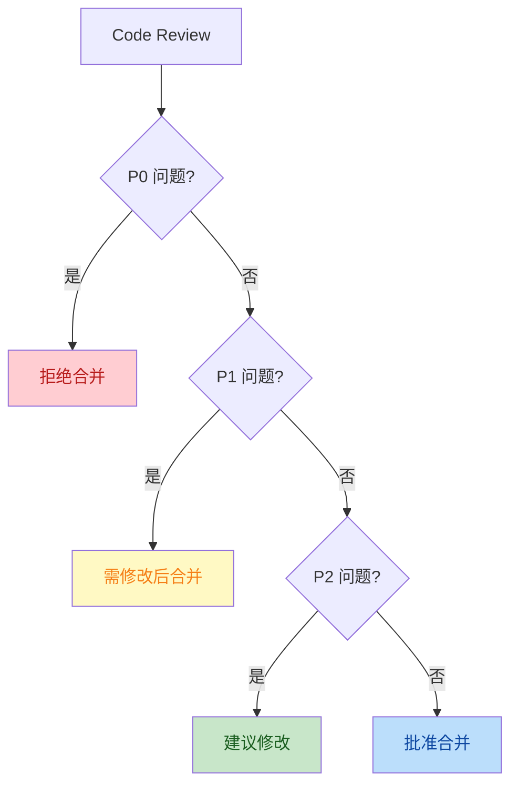

---

## 11 生产级评分卡

### 11.1 8 维度评分

```mermaid
radar
    title 生产级评分卡（满分 100）
    "安全" : 25
    "容错" : 25
    "可观测" : 25
    "性能" : 25
```

### 11.2 详细评分模板

| 维度 | 子项 | 满分 | 评分标准 | 得分 |
|------|------|------|----------|------|
| **安全** | 认证与授权 | 25 | JWT/Token 实现完整、黑名单、刷新机制 | |
| | 输入校验 | 25 | SQL 注入、XSS、参数边界、CSRF 防护 | |
| | 密钥管理 | 25 | 不硬编码、轮换、分级 | |
| | 数据隔离 | 25 | 行级权限、租户隔离 | |
| **容错** | 超时控制 | 20 | 所有外部调用有超时 | |
| | 重试机制 | 20 | 可重试错误识别、指数退避、抖动 | |
| | 熔断器 | 20 | 熔断配置合理、半开探测、自动恢复 | |
| | 限流 | 20 | 限流维度完整、429 响应规范 | |
| | 降级 | 20 | 降级链清晰、兜底完整 | |
| **可观测** | 日志 | 30 | 级别、格式、MDC、脱敏 | |
| | 指标 | 25 | 系统/中间件/业务指标 | |
| | 链路追踪 | 25 | trace 透传、采样策略 | |
| | 健康检查 | 20 | 探针分离、组件级检查 | |
| **性能** | 缓存 | 25 | 多级 TTL、Cache-Aside、三大防护 | |
| | 连接池 | 20 | HikariCP、Redis Pool 配置合理 | |
| | 异步 | 20 | 线程池隔离、async/await | |
| | 批处理 | 15 | 批量调用、减少 RPC 次数 | |
| | SQL 优化 | 20 | 索引、无 N+1、EXPLAIN | |
| **可维护** | SOLID | 30 | 5 个原则综合 | |
| | 复杂度 | 20 | 函数/类/圈复杂度 | |
| | 重复代码 | 20 | DRY 原则 | |
| | 可测试性 | 30 | 依赖注入、Mock 友好 | |
| **CI/CD** | 流水线 | 30 | 自动构建、测试、部署 | |
| | 质量门禁 | 30 | Lint、测试、覆盖率门槛 | |
| | 灰度发布 | 20 | 蓝绿/金丝雀 | |
| | 回滚机制 | 20 | 自动回滚、手动回滚 | |
| **数据治理** | 备份恢复 | 35 | 定时备份、异地存储、演练 | |
| | 审计日志 | 35 | 关键操作、敏感操作、SQL 表 | |
| | 迁移管理 | 30 | Flyway、回滚预案 | |
| **供应链** | 版本锁定 | 40 | 依赖精确版本 | |
| | 漏洞扫描 | 40 | 自动扫描、响应时效 | |
| | SBOM | 20 | 物料清单、许可证 | |

### 11.3 等级划分

| 总分 | 等级 | 描述 | 适合场景 |
|------|------|------|----------|
| 90+ | A 工业级 | 可上金融级生产 | 大型企业 |
| 80-89 | A- 准生产 | 可上企业生产 | 中型企业 |
| 70-79 | B+ 可演示 | 答辩级别生产级 | 课程/校企项目 |
| 60-69 | B 可演示 | 演示级生产级 | 个人项目 |
| < 60 | C 原型 | 不推荐生产 | 仅供学习 |

---

## 12 常见反模式与陷阱

### 12.1 反模式清单

| # | 反模式 | 后果 | 正确做法 |
|---|--------|------|----------|
| 1 | **同步阻塞外部调用** | 线程池耗尽 | 异步 + 超时 |
| 2 | **裸 SQL 字符串拼接** | SQL 注入 | 参数化查询 |
| 3 | **无限制缓存值** | 内存爆炸 | Value 大小限制（< 1MB） |
| 4 | **同步大循环远程调用** | 响应慢 | 批处理 / 并发 |
| 5 | **错误时仅返回 500** | 排查困难 | 错误码 + 详细日志 |
| 6 | **密码明文日志** | 安全泄露 | 脱敏 + 密钥库 |
| 7 | **静态可变全局状态** | 并发 Bug | 依赖注入 |
| 8 | **过度设计/提前优化** | 维护成本 | YAGNI 原则 |
| 9 | **缺少幂等性设计** | 重复扣款 | 唯一键 + 状态机 |
| 10 | **无超时调用** | 永久阻塞 | 全局超时策略 |

### 12.2 典型陷阱示例

#### 12.2.1 陷阱 1：N+1 查询

```java
// ❌ 错误：N+1 查询（100 篇论文 = 1 + 100 = 101 次 SQL）
List<Paper> papers = paperRepository.findAll();  // 1 次
for (Paper p : papers) {
    List<Author> authors = authorRepository.findByPaperId(p.getId());  // 100 次
    p.setAuthors(authors);
}

// ✅ 正确：JOIN 一次性查询
@Query("SELECT DISTINCT p FROM Paper p LEFT JOIN FETCH p.authors WHERE p.id IN :ids")
List<Paper> findByIdsWithAuthors(@Param("ids") List<String> ids);
```

#### 12.2.2 陷阱 2：缓存击穿

```java
// ❌ 错误：热点 key 过期瞬间 1000 并发打到 DB
@Cacheable(value = "hotKey")
public Data getHotData() {
    return db.query();
}

// ✅ 正确：分布式锁 + 单飞
@Cacheable(value = "hotKey", sync = true)  // Spring 5.3+ 内置单飞
public Data getHotData() {
    return db.query();
}
```

#### 12.2.3 陷阱 3：线程池泄漏

```java
// ❌ 错误：每次 new 线程池
public void processAsync() {
    ExecutorService pool = Executors.newFixedThreadPool(10);
    pool.submit(() -> doWork());
    // pool 永远不会被关闭，资源泄漏
}

// ✅ 正确：使用 Spring 托管的线程池
@Async("taskExecutor")
public void processAsync() {
    doWork();
}
```

#### 12.2.4 陷阱 4：上下文丢失

```python
# ❌ 错误：异步任务丢失 trace context
async def background_task():
    await asyncio.create_task(do_work())  # 没有透传 trace context

# ✅ 正确：透传 context
async def background_task():
    ctx = contextvars.copy_context()  # 复制当前上下文
    await asyncio.create_task(do_work(), context=ctx)
```

#### 12.2.5 陷阱 5：JSON 大小无限制

```yaml
# ❌ 错误：用户输入 10MB JSON 全部接收
spring:
  servlet:
    multipart:
      max-file-size: -1  # 不限制
      max-request-size: -1

# ✅ 正确：限制大小
spring:
  servlet:
    multipart:
      max-file-size: 5MB
      max-request-size: 10MB
  codec:
    max-in-memory-size: 1MB
```

---

## 附录 A：工具链推荐

### A.1 代码质量

| 语言 | 工具 | 用途 |
|------|------|------|
| Java | Checkstyle | 代码风格检查 |
| Java | SpotBugs | Bug 检测 |
| Java | SonarQube | 综合质量平台 |
| Python | ruff | Linter（替代 flake8） |
| Python | black | 格式化 |
| Python | mypy | 类型检查 |
| Python | bandit | 安全扫描 |
| TypeScript | ESLint | Linter |
| TypeScript | Prettier | 格式化 |
| TypeScript | tsc | 类型检查 |

### A.2 安全扫描

| 工具 | 用途 |
|------|------|
| OWASP Dependency-Check | Java 依赖漏洞 |
| pip-audit | Python 依赖漏洞 |
| npm audit | Node 依赖漏洞 |
| Trivy | 容器镜像扫描 |
| Snyk | 多语言依赖扫描 |
| SonarQube | 代码安全审计 |

### A.3 可观测性

| 工具 | 用途 |
|------|------|
| Prometheus | 指标收集 |
| Grafana | 指标可视化 |
| Loki | 日志聚合 |
| Tempo | 链路追踪 |
| ELK Stack | 日志 + 检索 |
| OpenTelemetry | 跨语言追踪标准 |
| Jaeger | 链路追踪 UI |

### A.4 CI/CD

| 工具 | 用途 |
|------|------|
| GitHub Actions | CI/CD（适合 GitHub） |
| GitLab CI | CI/CD（适合 GitLab） |
| Jenkins | 通用 CI/CD |
| ArgoCD | K8s GitOps |
| Helm | K8s 包管理 |
| Docker Compose | 单机多容器 |

### A.5 测试

| 工具 | 用途 |
|------|------|
| JUnit 5 | Java 单元测试 |
| Mockito | Java Mock 框架 |
| Testcontainers | 集成测试容器 |
| pytest | Python 单元测试 |
| pytest-asyncio | Python 异步测试 |
| Vitest | 前端单元测试 |
| Playwright | 端到端测试 |
| k6 / JMeter | 性能压测 |

---

## 附录 B：参考资料

### B.1 经典书籍

| 书名 | 作者 | 重点 |
|------|------|------|
| 《代码整洁之道》 | Robert C. Martin | 命名、函数、注释、格式 |
| 《架构整洁之道》 | Robert C. Martin | SOLID、组件、架构边界 |
| 《领域驱动设计》 | Eric Evans | 复杂业务建模 |
| 《数据密集型应用系统设计》 | Martin Kleppmann | 数据库、消息、分布式 |
| 《发布！软件的设计与部署》 | Michael T. Nygard | 生产环境设计 |
| 《Site Reliability Engineering》 | Google | SRE 实践 |
| 《The Phoenix Project》 | Gene Kim | DevOps 小说 |
| 《Prometheus 实战》 | Brian Brazil | 监控告警 |

### B.2 在线资源

- [OWASP Top 10](https://owasp.org/Top10/) — Web 安全风险 Top 10
- [Google SRE Book](https://sre.google/sre-book/table-of-contents/) — 免费在线
- [Microsoft REST API Guidelines](https://github.com/microsoft/api-guidelines) — REST API 规范
- [12 Factor App](https://12factor.net/) — 云原生应用原则
- [Spring Boot Production-ready Features](https://docs.spring.io/spring-boot/docs/current/reference/html/actuator.html) — Spring Boot 最佳实践
- [FastAPI Best Practices](https://github.com/zhanymkanov/fastapi-best-practices) — FastAPI 最佳实践

### B.3 行业标准

- **ISO/IEC 25010** — 软件产品质量模型
- **NIST SP 800-53** — 信息安全控制
- **GDPR** — 欧盟数据保护
- **SOC 2** — 服务组织控制
- **PCI DSS** — 支付卡数据安全

---

## 附录 C：本项目生产级实践现状

> 本节是 XH-202630 项目自评，便于快速定位"生产级"差距。

### C.1 当前评分（2026-06-08）

| 维度 | 评分 | 状态 | 关键差距 |
|------|------|------|----------|
| 安全 | 90/100 | 🟢 优秀 | 限流、HTTPS、CSP |
| 容错 | 88/100 | 🟢 优秀 | 熔断器、混沌测试 |
| 可观测 | 75/100 | 🟡 良好 | 指标、链路追踪 |
| 性能 | 82/100 | 🟢 优秀 | HikariCP 显式配置 |
| 可维护 | 80/100 | 🟢 优秀 | E2E 测试 |
| CI/CD | 30/100 | 🔴 缺失 | 完整 CI 流水线 |
| 数据治理 | 55/100 | 🟠 待完善 | 备份恢复、审计日志 |
| 供应链 | 60/100 | 🟠 待完善 | SBOM、漏洞扫描 |
| **综合** | **72/100** | **B+ 准生产** | 主要缺 CI/CD + 监控 |

### C.2 已有亮点（达标项）

- ✅ [backend/src/main/java/com/literatureassistant/util/JwtUtil.java](file:///Users/achieve/Documents/AchiEVE_MacBook_Air/Veritas(求真)/Veritas/backend/src/main/java/com/literatureassistant/util/JwtUtil.java) JWT 完整实现（HS256 + 32 字符密钥 + JTI 黑名单 + Redis TTL）
- ✅ [backend/src/main/java/com/literatureassistant/config/RedisConfig.java](file:///Users/achieve/Documents/AchiEVE_MacBook_Air/Veritas(求真)/Veritas/backend/src/main/java/com/literatureassistant/config/RedisConfig.java) 多级 TTL + 抖动防雪崩
- ✅ [ai-service/app/services/llm_service.py](file:///Users/achieve/Documents/AchiEVE_MacBook_Air/Veritas(求真)/Veritas/ai-service/app/services/llm_service.py) LLM 三路降级（builtin → api → local）
- ✅ [ai-service/app/agents/orchestrator.py](file:///Users/achieve/Documents/AchiEVE_MacBook_Air/Veritas(求真)/Veritas/ai-service/app/agents/orchestrator.py) SSE 编排器（超时 + keep-alive + Last-Event-ID）
- ✅ [backend/src/main/java/com/literatureassistant/filter/RequestIdFilter.java](file:///Users/achieve/Documents/AchiEVE_MacBook_Air/Veritas(求真)/Veritas/backend/src/main/java/com/literatureassistant/filter/RequestIdFilter.java) X-Request-Id 透传 + MDC
- ✅ [backend/src/main/java/com/literatureassistant/controller/HealthController.java](file:///Users/achieve/Documents/AchiEVE_MacBook_Air/Veritas(求真)/Veritas/backend/src/main/java/com/literatureassistant/controller/HealthController.java) 三件套健康检查（MySQL/Redis/AI）
- ✅ [backend/src/main/java/com/literatureassistant/exception/GlobalExceptionHandler.java](file:///Users/achieve/Documents/AchiEVE_MacBook_Air/Veritas(求真)/Veritas/backend/src/main/java/com/literatureassistant/exception/GlobalExceptionHandler.java) 8 个 ExceptionHandler + 5xx 兜底
- ✅ [ai-service/app/core/logging.py](file:///Users/achieve/Documents/AchiEVE_MacBook_Air/Veritas(求真)/Veritas/ai-service/app/core/logging.py) Loguru 日志轮转 + 7 天保留 + zip 压缩
- ✅ 26+ 个 AI 服务测试 + 35+ 个 Java 测试

### C.3 主要差距（待补项）

#### P0 阻塞生产（v1.0 前必补）

1. **接口限流**：Java 端无 RateLimit 实现，Python 端仅有 `RateLimitException` 类
2. **Prometheus 指标**：无 Micrometer / prometheus-fastapi-instrumentator
3. **API 文档自动化**：无 springdoc-openapi
4. **CI/CD 流水线**：无 .github/workflows

#### P1 强烈推荐（v1.0 启动前补）

5. **熔断器**：Java 端无 Resilience4j
6. **备份恢复策略**：MySQL / Chroma / Redis 备份未配置
7. **HikariCP 显式配置**：使用默认值
8. **漏洞扫描**：未集成 OWASP DC / pip-audit / npm audit
9. **README 同步**：backend/README 停留在 v0.1

#### P2 推荐（v1.0 验收前补）

10. **E2E 测试**：前端无 Playwright 测试
11. **审计日志表**：当前无 audit_logs 表
12. **A11y 优化**：无 aria-label、键盘导航
13. **CSP 头**：前端无 CSP 配置

### C.4 改进路线图

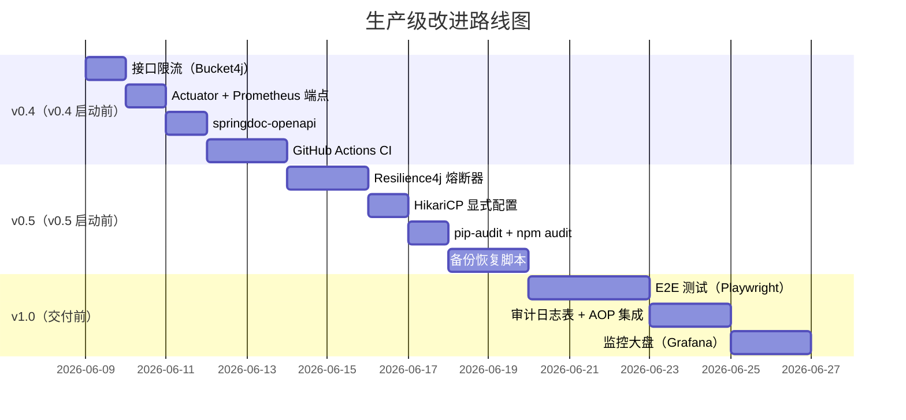

### C.5 验证方式

```bash
# 1. 验证后端
cd backend && mvn verify

# 2. 验证 Python
cd ai-service && pytest --cov=app

# 3. 验证前端
cd frontend && npm run test:coverage

# 4. 启动健康检查
curl http://localhost:8080/health
curl http://localhost:8000/health

# 5. 启动完整服务
docker-compose up -d
docker-compose ps  # 所有服务 healthy
```

---

## 文档元信息

| 项 | 值 |
|----|-----|
| 文档版本 | v1.0 |
| 创建日期 | 2026-06-08 |
| 适用项目 | XH-202630 科研文献智能助手 |
| 适用阶段 | v0.3 → v1.0 全过程 |
| 维护责任 | 项目组全体 |
| 评审周期 | 每两周评审一次 |
| 下次更新 | v0.4 验收后（2026-07-17） |

---

> **使用建议**：
> 1. **开发时**：参考第 2-9 维度的 P0 强制项作为编码规范
> 2. **Code Review 时**：使用第 10 节的清单作为审查依据
> 3. **答辩时**：使用第 11 节的评分卡自我评估
> 4. **规划时**：使用第 12 节的反模式清单自查
>
> **反馈渠道**：所有规范变更需在项目组内评审通过后更新本文档，并在修订历史中记录。
