# XH-202630 科研文献智能助手 — 系统完整工作流程文档

> **课题编号**：XH-202630
> **课题名称**：领域知识个性化生成与多智能体协同决策系统研究
> **文档版本**：v1.0
> **创建日期**：2026年5月26日
> **文档目的**：详细列出从用户发起请求到工作结束的完整工作流程，明确每个阶段涉及的模块、每个模块的具体工作内容

---

## 目录

- [1 文档概述](#1-文档概述)
- [2 系统全景工作流](#2-系统全景工作流)
- [3 核心业务流程详解](#3-核心业务流程详解)
- [4 多Agent协同工作流详解](#4-多agent协同工作流详解)
- [5 个性化引擎工作流](#5-个性化引擎工作流)
- [6 混合检索工作流](#6-混合检索工作流)
- [7 SSE实时推送工作流](#7-sse实时推送工作流)
- [8 降级与容错工作流](#8-降级与容错工作流)
- [9 缓存工作流](#9-缓存工作流)
- [10 安全认证工作流](#10-安全认证工作流)
- [11 各模块职责速查表](#11-各模块职责速查表)

---

## 1 文档概述

### 1.1 编写目的

本文档从用户视角出发，详细描述系统从"用户发起请求"到"工作结束"的完整工作流程，明确：

1. 每个业务场景的完整请求链路
2. 每个阶段涉及的模块（前端/Java后端/Python AI服务/数据层）
3. 每个模块在对应阶段的具体工作内容
4. 模块间的数据流转格式与通信协议

### 1.2 系统三层架构回顾

```
┌──────────────────────────────────────────────────────────────────────┐
│                          前端层（Vue3）                               │
│           用户交互 · 可视化 · 状态管理 · SSE接收                      │
└──────────────────────────┬───────────────────────────────────────────┘
                           │ HTTP REST + SSE
┌──────────────────────────▼───────────────────────────────────────────┐
│                    Java 业务层（Spring Boot 3.2+）                     │
│     用户认证 · 论文管理 · 会话管理 · 缓存 · AI服务代理                  │
└──────────────────────────┬───────────────────────────────────────────┘
                           │ HTTP REST + SSE
┌──────────────────────────▼───────────────────────────────────────────┐
│                   Python AI 服务层（FastAPI + LangGraph）              │
│     多Agent编排 · RAG检索 · LLM调用 · 个性化生成 · SSE推送            │
└──────────────────────────┬───────────────────────────────────────────┘
                           │
┌──────────────────────────▼───────────────────────────────────────────┐
│                          数据存储层                                    │
│     MySQL 8.0 · Redis 7.0 · ChromaDB 0.5+ · Neo4j 5.x(计划M4+)      │
└──────────────────────────────────────────────────────────────────────┘
```

---

## 2 系统全景工作流

### 2.1 用户完整使用旅程

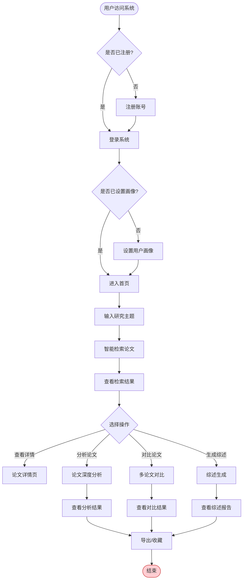
```mermaid
graph TD
    START([用户访问系统]) --> REG{是否已注册?}
    REG -->|否| REGISTER[注册账号]
    REG -->|是| LOGIN[登录系统]
    REGISTER --> LOGIN
    LOGIN --> PROFILE{是否已设置画像?}
    PROFILE -->|否| SET_PROFILE[设置用户画像]
    PROFILE -->|是| HOME[进入首页]
    SET_PROFILE --> HOME
    HOME --> INPUT[输入研究主题]
    INPUT --> SEARCH[智能检索论文]
    SEARCH --> VIEW_LIST[查看检索结果]
    VIEW_LIST --> SELECT{选择操作}
    SELECT -->|查看详情| DETAIL[论文详情页]
    SELECT -->|分析论文| ANALYZE[论文深度分析]
    SELECT -->|对比论文| COMPARE[多论文对比]
    SELECT -->|生成综述| REPORT[综述生成]
    ANALYZE --> VIEW_RESULT[查看分析结果]
    COMPARE --> VIEW_COMPARE[查看对比结果]
    REPORT --> VIEW_REPORT[查看综述报告]
    VIEW_RESULT --> EXPORT[导出/收藏]
    VIEW_COMPARE --> EXPORT
    VIEW_REPORT --> EXPORT
    EXPORT --> END([结束]):::endStyle

    classDef endStyle fill:#ffcdd2,stroke:#c62828
```

### 2.2 全景数据流转

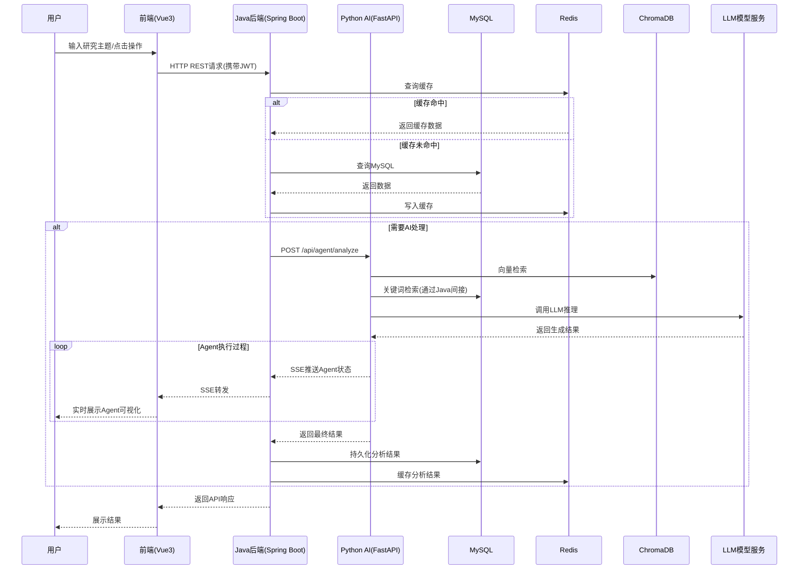
```mermaid
sequenceDiagram
    participant U as 用户
    participant FE as 前端(Vue3)
    participant JB as Java后端(Spring Boot)
    participant PA as Python AI(FastAPI)
    participant DB as MySQL
    participant RD as Redis
    participant CH as ChromaDB
    participant LLM as LLM模型服务

    U->>FE: 输入研究主题/点击操作
    FE->>JB: HTTP REST请求(携带JWT)
    JB->>RD: 查询缓存
    alt 缓存命中
        RD-->>JB: 返回缓存数据
    else 缓存未命中
        JB->>DB: 查询MySQL
        DB-->>JB: 返回数据
        JB->>RD: 写入缓存
    end

    alt 需要AI处理
        JB->>PA: POST /api/agent/analyze
        PA->>CH: 向量检索
        PA->>DB: 关键词检索(通过Java间接)
        PA->>LLM: 调用LLM推理
        LLM-->>PA: 返回生成结果

        loop Agent执行过程
            PA-->>JB: SSE推送Agent状态
            JB-->>FE: SSE转发
            FE-->>U: 实时展示Agent可视化
        end

        PA-->>JB: 返回最终结果
        JB->>DB: 持久化分析结果
        JB->>RD: 缓存分析结果
    end

    JB-->>FE: 返回API响应
    FE-->>U: 展示结果
```

---

## 3 核心业务流程详解

### 3.1 流程一：用户注册与登录

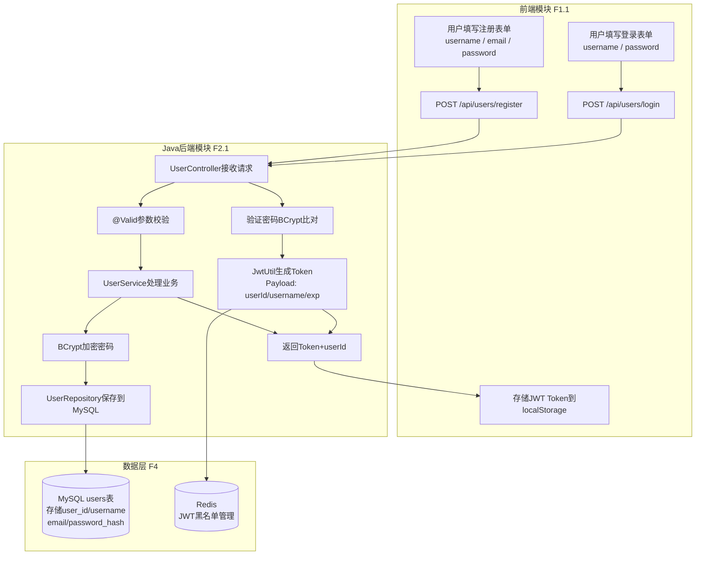
```mermaid
flowchart TD
    subgraph FE["前端模块 F1.1"]
        A1["用户填写注册表单\nusername / email / password"]
        A2["POST /api/users/register"]
        A3["用户填写登录表单\nusername / password"]
        A4["POST /api/users/login"]
        A5["存储JWT Token到localStorage"]
    end

    subgraph JB["Java后端模块 F2.1"]
        B1["UserController接收请求"]
        B2["@Valid参数校验"]
        B3["UserService处理业务"]
        B4["BCrypt加密密码"]
        B5["UserRepository保存到MySQL"]
        B6["验证密码BCrypt比对"]
        B7["JwtUtil生成Token\nPayload: userId/username/exp"]
        B8["返回Token+userId"]
    end

    subgraph DB["数据层 F4"]
        C1[("MySQL users表\n存储user_id/username\nemail/password_hash")]
        C2[("Redis\nJWT黑名单管理")]
    end

    A1 --> A2 --> B1
    B1 --> B2 --> B3
    B3 --> B4 --> B5
    B5 --> C1
    B3 --> B8 --> A5

    A3 --> A4 --> B1
    B1 --> B6
    B6 --> B7 --> C2
    B7 --> B8
```

| 阶段 | 模块 | 具体工作 | 数据格式 |
|------|------|---------|---------|
| 用户输入 | 前端 F1.1 | 展示注册/登录表单，收集用户名、邮箱、密码 | 表单数据 |
| 请求发送 | 前端 F1.1 | Axios发送POST请求，前端基础校验 | `{username, email, password}` |
| 参数校验 | Java后端 F2.1 | @Valid注解校验参数格式，用户名/邮箱唯一性检查 | — |
| 密码加密 | Java后端 F2.1 | BCrypt哈希+随机盐值加密密码 | password → password_hash |
| 数据持久化 | Java后端 F2.1 | UserRepository保存User实体到MySQL | User Entity |
| Token生成 | Java后端 F2.1 | JwtUtil生成JWT Token（24h有效期） | `Bearer eyJhbG...` |
| Token存储 | 前端 F1.1 | 存储到localStorage，Axios拦截器自动注入 | localStorage.token |

### 3.2 流程二：用户画像设置

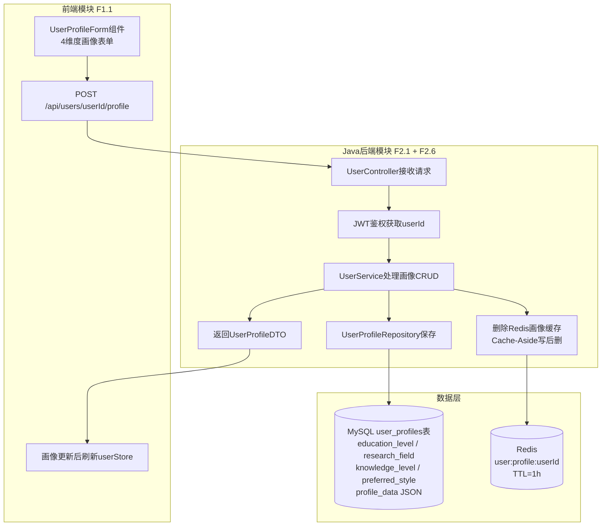
```mermaid
flowchart TD
    subgraph FE["前端模块 F1.1"]
        A1["UserProfileForm组件\n4维度画像表单"]
        A2["POST /api/users/userId/profile"]
        A3["画像更新后刷新userStore"]
    end

    subgraph JB["Java后端模块 F2.1 + F2.6"]
        B1["UserController接收请求"]
        B2["JWT鉴权获取userId"]
        B3["UserService处理画像CRUD"]
        B4["UserProfileRepository保存"]
        B5["删除Redis画像缓存\nCache-Aside写后删"]
        B6["返回UserProfileDTO"]
    end

    subgraph DB["数据层"]
        C1[("MySQL user_profiles表\neducation_level / research_field\nknowledge_level / preferred_style\nprofile_data JSON")]
        C2[("Redis\nuser:profile:userId\nTTL=1h")]
    end

    A1 --> A2 --> B1
    B1 --> B2 --> B3
    B3 --> B4 --> C1
    B3 --> B5 --> C2
    B3 --> B6 --> A3
```

| 阶段 | 模块 | 具体工作 | 画像字段 |
|------|------|---------|---------|
| 画像输入 | 前端 F1.1 | 展示4维度画像表单 | education_level / research_field / knowledge_level / preferred_style |
| 请求发送 | 前端 F1.1 | POST请求携带画像数据 | `{educationLevel, researchField, knowledgeLevel, preferredStyle}` |
| 鉴权 | Java后端 F2.1 | JWT鉴权，确认用户身份 | — |
| 画像保存 | Java后端 F2.1 | UserProfileRepository持久化到MySQL | UserProfile Entity |
| 缓存失效 | Java后端 F2.6 | 删除Redis中`user:profile:{userId}`缓存 | Cache-Aside |
| 状态更新 | 前端 F1.1 | 更新userStore.profile，后续请求携带画像 | Pinia State |

### 3.3 流程三：智能论文检索

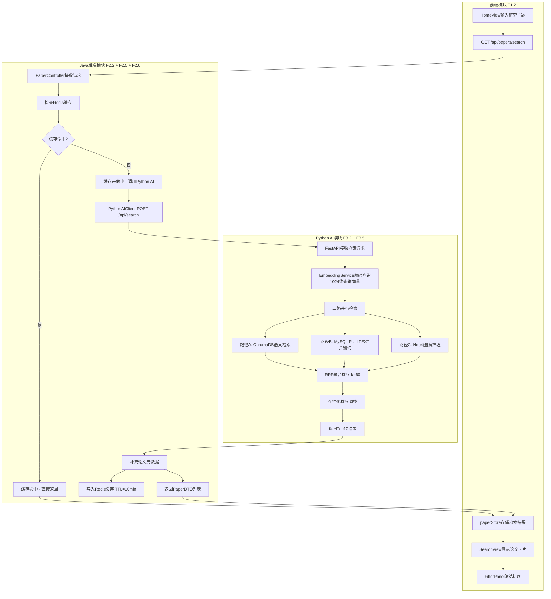
```mermaid
flowchart TD
    subgraph FE["前端模块 F1.2"]
        A1["HomeView输入研究主题"]
        A2["GET /api/papers/search"]
        A3["paperStore存储检索结果"]
        A4["SearchView展示论文卡片"]
        A5["FilterPanel筛选排序"]
    end

    subgraph JB["Java后端模块 F2.2 + F2.5 + F2.6"]
        B1["PaperController接收请求"]
        B2["检查Redis缓存"]
        B3{"缓存命中?"}
        B4["缓存命中 - 直接返回"]
        B5["缓存未命中 - 调用Python AI"]
        B6["PythonAIClient POST /api/search"]
        B7["补充论文元数据"]
        B8["写入Redis缓存 TTL=10min"]
        B9["返回PaperDTO列表"]
    end

    subgraph PA["Python AI模块 F3.2 + F3.5"]
        C1["FastAPI接收检索请求"]
        C2["EmbeddingService编码查询\n1024维查询向量"]
        C3["三路并行检索"]
        C4["路径A: ChromaDB语义检索"]
        C5["路径B: MySQL FULLTEXT关键词"]
        C6["路径C: Neo4j图谱推理"]
        C7["RRF融合排序 k=60"]
        C8["个性化排序调整"]
        C9["返回Top10结果"]
    end

    A1 --> A2 --> B1
    B1 --> B2 --> B3
    B3 -->|是| B4 --> A3
    B3 -->|否| B5 --> B6 --> C1
    C1 --> C2 --> C3
    C3 --> C4
    C3 --> C5
    C3 --> C6
    C4 --> C7
    C5 --> C7
    C6 --> C7
    C7 --> C8 --> C9 --> B7
    B7 --> B8
    B7 --> B9 --> A3 --> A4 --> A5
```

| 阶段 | 模块 | 具体工作 | 数据格式 |
|------|------|---------|---------|
| 主题输入 | 前端 F1.2 | 用户输入研究主题，支持中英文 | `"Multi-Agent协同决策"` |
| 缓存检查 | Java后端 F2.6 | 查询`search:result:{queryHash}` | Redis String(JSON) |
| 查询向量化 | Python AI F3.2 | text-embedding-v4将查询转为1024维向量 | `float[1024]` |
| 语义检索 | Python AI F3.2 | ChromaDB cosine相似度检索Top20 | `[{paper_id, score, ...}]` |
| 关键词检索 | Python AI F3.2 | MySQL FULLTEXT索引检索Top20 | `[{paper_id, relevance, ...}]` |
| 图谱检索 | Python AI F3.2 | Neo4j图谱推理扩展Top20(计划M4+) | `[{paper_id, graph_score, ...}]` |
| RRF融合 | Python AI F3.2 | 三路结果融合排序 | `score = Σ 1/(k + rank_i)` |
| 个性化调整 | Python AI F3.2 | 根据用户画像调整排序权重 | `score_final = rrf×0.5 + field×0.3 + popularity×0.2` |
| 元数据补充 | Java后端 F2.2 | 从MySQL/Redis补充论文完整信息 | PaperDTO |
| 缓存写入 | Java后端 F2.6 | 写入Redis，TTL=10分钟 | `search:result:{hash}` |
| 结果展示 | 前端 F1.2 | PaperCard卡片列表，含标题/作者/摘要/评分/推荐理由 | Vue组件渲染 |

### 3.4 流程四：论文深度分析

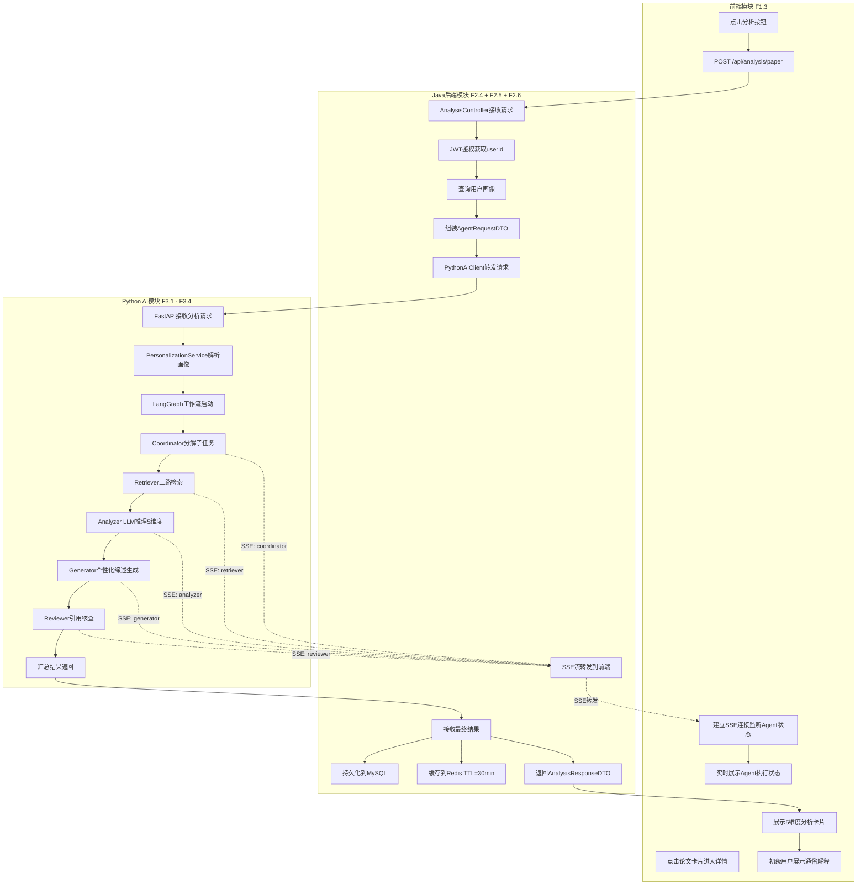
```mermaid
flowchart TD
    subgraph FE["前端模块 F1.3"]
        A1["点击论文卡片进入详情"]
        A2["点击分析按钮"]
        A3["POST /api/analysis/paper"]
        A4["建立SSE连接监听Agent状态"]
        A5["实时展示Agent执行状态"]
        A6["展示5维度分析卡片"]
        A7["初级用户展示通俗解释"]
    end

    subgraph JB["Java后端模块 F2.4 + F2.5 + F2.6"]
        B1["AnalysisController接收请求"]
        B2["JWT鉴权获取userId"]
        B3["查询用户画像"]
        B4["组装AgentRequestDTO"]
        B5["PythonAIClient转发请求"]
        B6["SSE流转发到前端"]
        B7["接收最终结果"]
        B8["持久化到MySQL"]
        B9["缓存到Redis TTL=30min"]
        B10["返回AnalysisResponseDTO"]
    end

    subgraph PA["Python AI模块 F3.1 - F3.4"]
        C1["FastAPI接收分析请求"]
        C2["PersonalizationService解析画像"]
        C3["LangGraph工作流启动"]
        C4["Coordinator分解子任务"]
        C5["Retriever三路检索"]
        C6["Analyzer LLM推理5维度"]
        C7["Generator个性化综述生成"]
        C8["Reviewer引用核查"]
        C9["汇总结果返回"]
    end

    A2 --> A3 --> B1
    B1 --> B2 --> B3
    B3 --> B4 --> B5 --> C1
    C1 --> C2 --> C3
    C3 --> C4 --> C5 --> C6 --> C7 --> C8 --> C9

    C4 -.->|"SSE: coordinator"| B6
    C5 -.->|"SSE: retriever"| B6
    C6 -.->|"SSE: analyzer"| B6
    C7 -.->|"SSE: generator"| B6
    C8 -.->|"SSE: reviewer"| B6
    B6 -.->|"SSE转发"| A4
    A4 --> A5

    C9 --> B7
    B7 --> B8
    B7 --> B9
    B7 --> B10 --> A6
    A6 --> A7
```

| 阶段 | 模块 | 具体工作 | 输出数据 |
|------|------|---------|---------|
| 发起分析 | 前端 F1.3 | 点击"分析"按钮，发送请求 | `{paperId, userId}` |
| 鉴权+画像 | Java后端 F2.4 | JWT鉴权，查询用户画像(Redis→MySQL) | UserProfile |
| DTO组装 | Java后端 F2.4 | 组装AgentRequestDTO(含画像) | `{topic, paper_ids, user_profile, analysis_type}` |
| 画像解析 | Python AI F3.4 | 解析画像JSON，映射策略参数 | difficulty=1-4, style=casual/standard/formal |
| Prompt构建 | Python AI F3.4 | 构建个性化Prompt片段，注入Agent模板 | 个性化系统Prompt |
| 协调者分解 | Python AI F3.1 | Coordinator分解查询为2-5个子任务 | `sub_tasks[]` |
| 检索论文 | Python AI F3.1 | Retriever三路检索Top10论文 | `search_results[]` |
| 深度分析 | Python AI F3.1 | Analyzer LLM推理提取5维度信息 | `{research_question, core_method, main_experiments, core_conclusion, limitations}` |
| 个性化生成 | Python AI F3.1 | Generator注入画像生成个性化综述 | `report: str` |
| 审核核查 | Python AI F3.1 | Reviewer引用核查+事实比对 | `review_result: {passed, suggestions}` |
| 结果持久化 | Java后端 F2.4 | 存MySQL+缓存Redis | AnalysisResult Entity |
| 结果展示 | 前端 F1.3 | 5维度分析卡片+通俗解释(初级用户) | Vue组件渲染 |

### 3.5 流程五：多论文对比分析

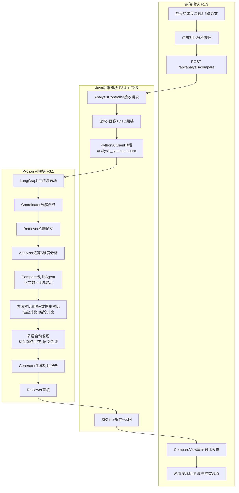
```mermaid
flowchart TD
    subgraph FE["前端模块 F1.3"]
        A1["检索结果页勾选2-5篇论文"]
        A2["点击对比分析按钮"]
        A3["POST /api/analysis/compare"]
        A4["CompareView展示对比表格"]
        A5["矛盾发现标注 高亮冲突观点"]
    end

    subgraph JB["Java后端模块 F2.4 + F2.5"]
        B1["AnalysisController接收请求"]
        B2["鉴权+画像+DTO组装"]
        B3["PythonAIClient转发\nanalysis_type=compare"]
        B4["持久化+缓存+返回"]
    end

    subgraph PA["Python AI模块 F3.1"]
        C1["LangGraph工作流启动"]
        C2["Coordinator分解任务"]
        C3["Retriever检索论文"]
        C4["Analyzer逐篇5维度分析"]
        C5["Comparer对比Agent\n论文数>=2时激活"]
        C6["方法对比矩阵+数据集对比\n性能对比+结论对比"]
        C7["矛盾自动发现\n标注观点冲突+原文佐证"]
        C8["Generator生成对比报告"]
        C9["Reviewer审核"]
    end

    A1 --> A2 --> A3 --> B1
    B1 --> B2 --> B3 --> C1
    C1 --> C2 --> C3 --> C4 --> C5
    C5 --> C6 --> C7 --> C8 --> C9
    C9 --> B4 --> A4
    A4 --> A5
```

| 阶段 | 模块 | 具体工作 | 输出数据 |
|------|------|---------|---------|
| 论文选择 | 前端 F1.3 | 勾选2-5篇论文，paperStore记录 | `paperIds[]` |
| 对比请求 | Java后端 F2.4 | 转发到Python AI，analysis_type=compare | AgentRequestDTO |
| 对比Agent | Python AI F3.1 | Comparer生成方法/数据集/性能/结论对比矩阵 | `compare_result` |
| 矛盾发现 | Python AI F3.1 | 自动检测观点冲突，标注原文出处 | `contradictions: [{dimension, paper_a_claim, paper_b_claim}]` |
| 结果展示 | 前端 F1.3 | CompareTable对比表格+矛盾高亮 | Vue组件渲染 |

### 3.6 流程六：综述生成（6-Agent完整协同）

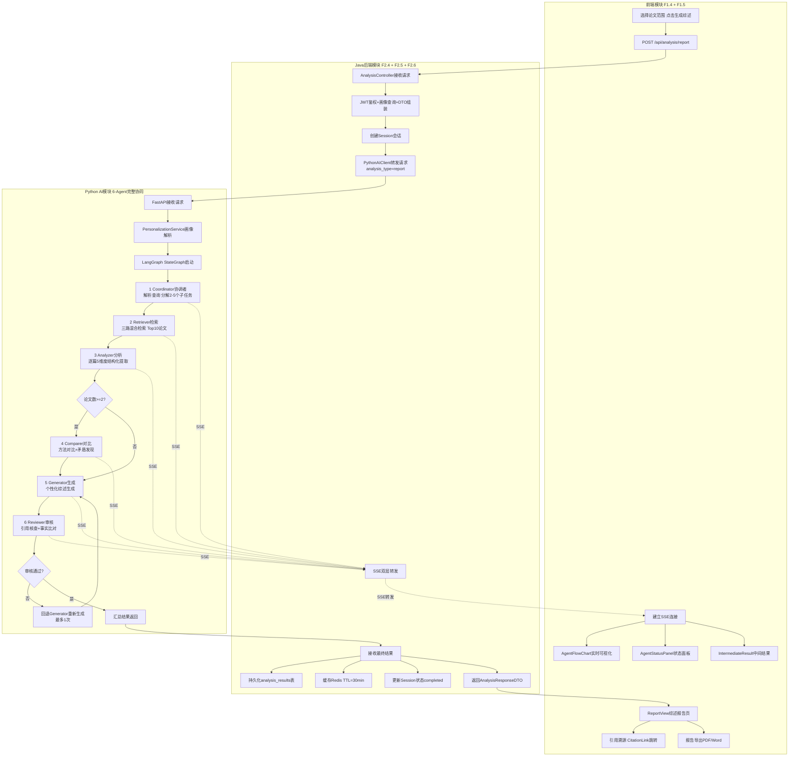
```mermaid
flowchart TD
    subgraph FE["前端模块 F1.4 + F1.5"]
        A1["选择论文范围 点击生成综述"]
        A2["POST /api/analysis/report"]
        A3["建立SSE连接"]
        A4["AgentFlowChart实时可视化"]
        A5["AgentStatusPanel状态面板"]
        A6["IntermediateResult中间结果"]
        A7["ReportView综述报告页"]
        A8["引用溯源 CitationLink跳转"]
        A9["报告导出PDF/Word"]
    end

    subgraph JB["Java后端模块 F2.4 + F2.5 + F2.6"]
        B1["AnalysisController接收请求"]
        B2["JWT鉴权+画像查询+DTO组装"]
        B3["创建Session会话"]
        B4["PythonAIClient转发请求\nanalysis_type=report"]
        B5["SSE双层转发"]
        B6["接收最终结果"]
        B7["持久化analysis_results表"]
        B8["缓存Redis TTL=30min"]
        B9["更新Session状态completed"]
        B10["返回AnalysisResponseDTO"]
    end

    subgraph PA["Python AI模块 6-Agent完整协同"]
        C1["FastAPI接收请求"]
        C2["PersonalizationService画像解析"]
        C3["LangGraph StateGraph启动"]
        C4["1 Coordinator协调者\n解析查询 分解2-5个子任务"]
        C5["2 Retriever检索\n三路混合检索 Top10论文"]
        C6["3 Analyzer分析\n逐篇5维度结构化提取"]
        C7{"论文数>=2?"}
        C8["4 Comparer对比\n方法对比+矛盾发现"]
        C9["5 Generator生成\n个性化综述生成"]
        C10["6 Reviewer审核\n引用核查+事实比对"]
        C11{"审核通过?"}
        C12["回退Generator重新生成\n最多1次"]
        C13["汇总结果返回"]
    end

    A1 --> A2 --> B1
    B1 --> B2 --> B3
    B3 --> B4 --> C1
    C1 --> C2 --> C3
    C3 --> C4
    C4 --> C5
    C5 --> C6
    C6 --> C7
    C7 -->|是| C8
    C7 -->|否| C9
    C8 --> C9
    C9 --> C10
    C10 --> C11
    C11 -->|否| C12 --> C9
    C11 -->|是| C13

    C4 -.->|"SSE"| B5
    C5 -.->|"SSE"| B5
    C6 -.->|"SSE"| B5
    C8 -.->|"SSE"| B5
    C9 -.->|"SSE"| B5
    C10 -.->|"SSE"| B5
    B5 -.->|"SSE转发"| A3
    A3 --> A4
    A3 --> A5
    A3 --> A6

    C13 --> B6
    B6 --> B7
    B6 --> B8
    B6 --> B9
    B6 --> B10 --> A7
    A7 --> A8
    A7 --> A9
```

| 阶段 | 模块 | 具体工作 | 输出数据 |
|------|------|---------|---------|
| 选择范围 | 前端 F1.4 | 选择全部检索结果或自选论文 | `{topic, paperIds[], userId}` |
| 会话创建 | Java后端 F2.3 | 创建Session会话，关联用户和主题 | Session Entity |
| 画像注入 | Java后端 F2.4 | 查询画像，组装AgentRequestDTO | `{topic, paper_ids, user_profile, analysis_type:"report"}` |
| ①协调者 | Python AI F3.1 | Coordinator分解查询为子任务 | `sub_tasks: ["检索Multi-Agent论文", "分析方法对比", ...]` |
| ②检索 | Python AI F3.1 | Retriever三路检索Top10论文 | `search_results: [{paper_id, title, score, ...}]` |
| ③分析 | Python AI F3.1 | Analyzer逐篇5维度分析 | `analysis_results: [{research_question, core_method, ...}]` |
| ④对比 | Python AI F3.1 | Comparer多论文对比+矛盾发现(条件执行) | `compare_result: {comparison_table, contradictions}` |
| ⑤生成 | Python AI F3.1 | Generator注入画像生成个性化综述 | `report: "引言...研究现状...方法对比...趋势...文献"` |
| ⑥审核 | Python AI F3.1 | Reviewer引用核查+事实比对 | `review_result: {passed: bool, suggestions: []}` |
| 持久化 | Java后端 F2.4 | 存MySQL+缓存Redis+更新Session状态 | AnalysisResult Entity |
| 报告展示 | 前端 F1.4 | markdown-it渲染综述，引用可点击 | Vue组件渲染 |
| 引用溯源 | 前端 F1.4 | 点击引用→跳转原文片段弹窗 | CitationLink组件 |
| 报告导出 | 前端 F1.4 | 导出PDF/Word格式 | 文件下载 |

---

## 4 多Agent协同工作流详解

### 4.1 LangGraph工作流状态流转

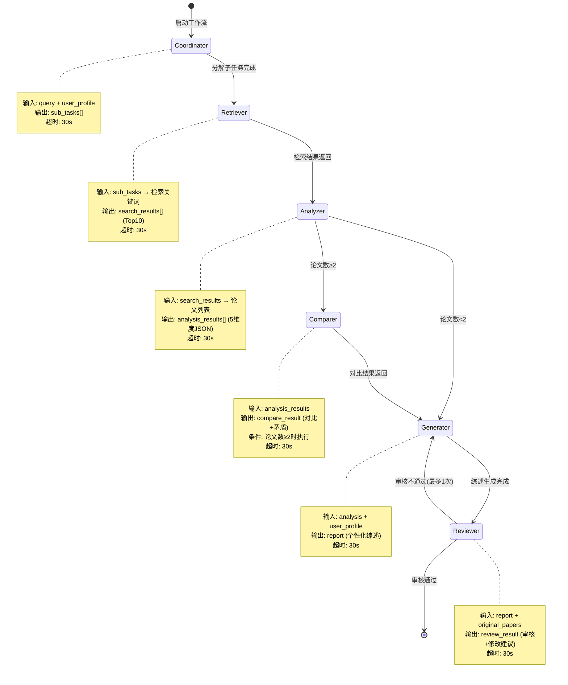
```mermaid
stateDiagram-v2
    [*] --> Coordinator: 启动工作流

    Coordinator --> Retriever: 分解子任务完成
    Retriever --> Analyzer: 检索结果返回
    Analyzer --> Comparer: 论文数≥2
    Analyzer --> Generator: 论文数<2
    Comparer --> Generator: 对比结果返回
    Generator --> Reviewer: 综述生成完成
    Reviewer --> [*]: 审核通过
    Reviewer --> Generator: 审核不通过(最多1次)

    note right of Coordinator
        输入: query + user_profile
        输出: sub_tasks[]
        超时: 30s
    end note

    note right of Retriever
        输入: sub_tasks → 检索关键词
        输出: search_results[] (Top10)
        超时: 30s
    end note

    note right of Analyzer
        输入: search_results → 论文列表
        输出: analysis_results[] (5维度JSON)
        超时: 30s
    end note

    note right of Comparer
        输入: analysis_results
        输出: compare_result (对比+矛盾)
        条件: 论文数≥2时执行
        超时: 30s
    end note

    note right of Generator
        输入: analysis + user_profile
        输出: report (个性化综述)
        超时: 30s
    end note

    note right of Reviewer
        输入: report + original_papers
        输出: review_result (审核+修改建议)
        超时: 30s
    end note
```

### 4.2 AgentState数据结构

```python
class AgentState(TypedDict):
    query: str                           # 用户原始查询
    user_profile: Dict[str, Any]         # 用户画像
    sub_tasks: List[str]                 # 协调者分解的子任务
    search_results: List[Dict]           # 检索结果
    analysis_results: List[Dict]         # 分析结果(5维度JSON列表)
    compare_result: Optional[Dict]       # 对比结果(条件产出)
    report: Optional[str]               # 综述报告
    review_result: Optional[Dict]       # 审核结果
    final_output: Optional[str]         # 最终输出
    agent_states: Dict[str, Dict]       # 各Agent执行状态(用于可视化)
    errors: List[Dict]                  # 错误记录
```

### 4.3 各Agent详细工作内容

| Agent | 角色 | 输入 | 处理逻辑 | 输出 | LLM调用 |
|-------|------|------|---------|------|---------|
| **Coordinator** | 项目经理 | query + user_profile | 1.解析用户查询语义 2.判断查询类型 3.分解为2-5个子任务 4.确定执行策略 | `sub_tasks[]` | 是(任务分解) |
| **Retriever** | 图书管理员 | sub_tasks → 检索关键词 | 1.提取检索关键词 2.调用EmbeddingService向量化 3.三路并行检索 4.RRF融合排序 5.个性化排序调整 | `search_results[]`(Top10) | 否(检索工具) |
| **Analyzer** | 论文审稿人 | search_results → 论文列表 | 1.逐篇读取论文摘要 2.构建分析Prompt(含个性化片段) 3.LLM推理提取5维度 4.输出结构化JSON | `analysis_results[]`(5维度) | 是(信息提取) |
| **Comparer** | 对比研究员 | analysis_results | 1.构建对比Prompt 2.多维度对比(方法/数据集/性能/结论) 3.检测观点矛盾 4.标注原文佐证 | `compare_result`(对比+矛盾) | 是(对比分析) |
| **Generator** | 学术写手 | analysis + compare + profile | 1.读取画像→确定策略 2.构建个性化Prompt 3.生成综述(引言→现状→对比→趋势→文献) 4.插入引用标注 | `report`(个性化综述) | 是(文本生成) |
| **Reviewer** | 学术编辑 | report + original_papers | 1.提取报告中的事实性声明 2.与原始论文比对 3.核查引用正确性 4.标记不一致之处 | `review_result`(审核+建议) | 是(事实核查) |

### 4.4 Analyzer 5维度分析输出结构

```json
{
    "research_question": "论文试图解决什么问题",
    "core_method": "论文提出的核心方法/架构",
    "main_experiments": "主要实验设置和结果",
    "core_conclusion": "核心结论和贡献",
    "limitations": "局限性和未来工作",
    "plain_explanation": "通俗解释（初级用户可见）"
}
```

---

## 5 个性化引擎工作流

### 5.1 画像到Prompt的完整映射

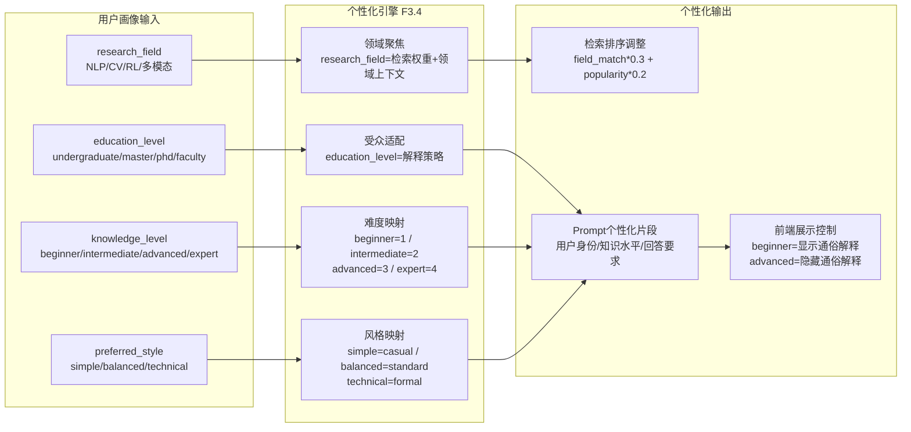
```mermaid
flowchart LR
    subgraph INPUT["用户画像输入"]
        P1["education_level\nundergraduate/master/phd/faculty"]
        P2["research_field\nNLP/CV/RL/多模态"]
        P3["knowledge_level\nbeginner/intermediate/advanced/expert"]
        P4["preferred_style\nsimple/balanced/technical"]
    end

    subgraph ENGINE["个性化引擎 F3.4"]
        M1["难度映射\nbeginner=1 / intermediate=2\nadvanced=3 / expert=4"]
        M2["风格映射\nsimple=casual / balanced=standard\ntechnical=formal"]
        M3["领域聚焦\nresearch_field=检索权重+领域上下文"]
        M4["受众适配\neducation_level=解释策略"]
    end

    subgraph OUTPUT["个性化输出"]
        O1["检索排序调整\nfield_match*0.3 + popularity*0.2"]
        O2["Prompt个性化片段\n用户身份/知识水平/回答要求"]
        O3["前端展示控制\nbeginner=显示通俗解释\nadvanced=隐藏通俗解释"]
    end

    P1 --> M4 --> O2
    P2 --> M3 --> O1
    P3 --> M1 --> O2
    P4 --> M2 --> O2
    O2 --> O3
```

### 5.2 个性化Prompt注入示例

```
基础Agent Prompt模板 + 个性化片段：

【重要】请根据以下用户信息调整回答：
- 用户身份：硕士二年级学生
- 知识水平：中级（请使用标准学术语言，关键术语需解释，可包含方法对比和代码示例）
- 研究方向：NLP（优先推荐NLP相关案例和方法）
- 回答要求：标准学术表达，适度展开，术语密度约20%
```

---

## 6 混合检索工作流

### 6.1 三路RRF融合检索

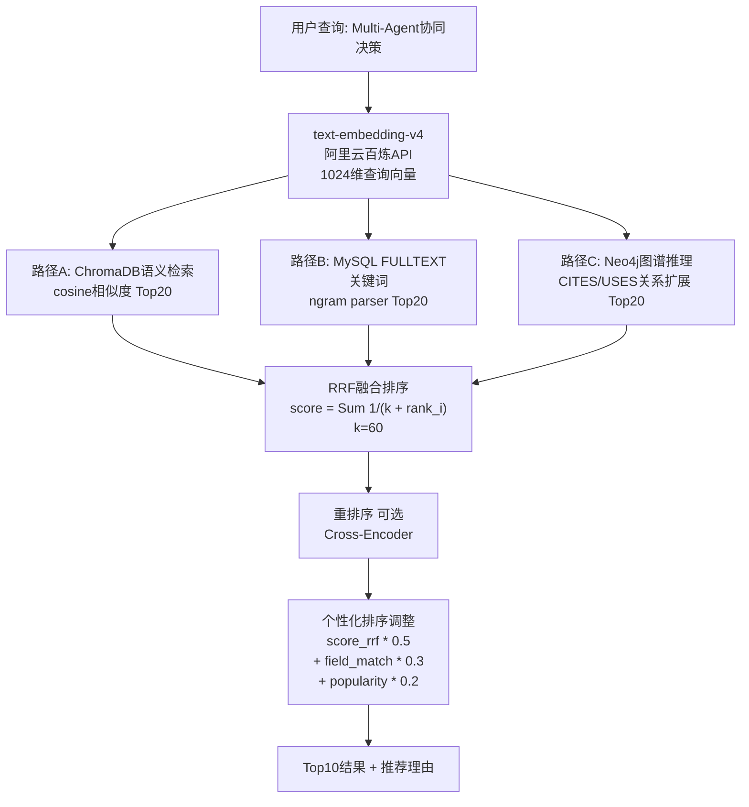
```mermaid
flowchart TD
    Q["用户查询: Multi-Agent协同决策"] --> EMB["text-embedding-v4\n阿里云百炼API\n1024维查询向量"]

    EMB --> A["路径A: ChromaDB语义检索\ncosine相似度 Top20"]
    EMB --> B["路径B: MySQL FULLTEXT关键词\nngram parser Top20"]
    EMB --> C["路径C: Neo4j图谱推理\nCITES/USES关系扩展 Top20"]

    A --> RRF["RRF融合排序\nscore = Sum 1/(k + rank_i)\nk=60"]
    B --> RRF
    C --> RRF

    RRF --> RERANK["重排序 可选\nCross-Encoder"]
    RERANK --> PERS["个性化排序调整\nscore_rrf * 0.5\n+ field_match * 0.3\n+ popularity * 0.2"]
    PERS --> TOP["Top10结果 + 推荐理由"]
```

| 检索路径 | 数据源 | 检索方式 | 优势 | 返回 |
|---------|--------|---------|------|------|
| 路径A | ChromaDB | 向量cosine相似度 | 语义理解，跨语言 | Top20 |
| 路径B | MySQL | FULLTEXT索引(ngram) | 精确关键词匹配 | Top20 |
| 路径C | Neo4j | 图谱关系推理 | 关联发现，引用链 | Top20(计划M4+) |

---

## 7 SSE实时推送工作流

### 7.1 SSE双层转发链路

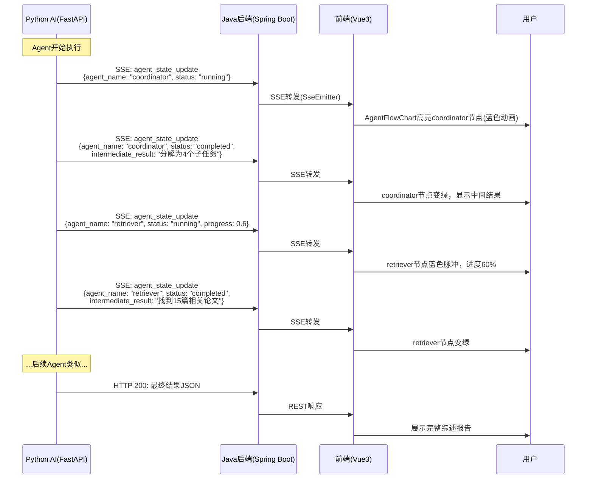
```mermaid
sequenceDiagram
    participant PA as Python AI(FastAPI)
    participant JB as Java后端(Spring Boot)
    participant FE as 前端(Vue3)
    participant US as 用户

    Note over PA: Agent开始执行

    PA->>JB: SSE: agent_state_update<br/>{agent_name: "coordinator", status: "running"}
    JB->>FE: SSE转发(SseEmitter)
    FE->>US: AgentFlowChart高亮coordinator节点(蓝色动画)

    PA->>JB: SSE: agent_state_update<br/>{agent_name: "coordinator", status: "completed",<br/>intermediate_result: "分解为4个子任务"}
    JB->>FE: SSE转发
    FE->>US: coordinator节点变绿，显示中间结果

    PA->>JB: SSE: agent_state_update<br/>{agent_name: "retriever", status: "running", progress: 0.6}
    JB->>FE: SSE转发
    FE->>US: retriever节点蓝色脉冲，进度60%

    PA->>JB: SSE: agent_state_update<br/>{agent_name: "retriever", status: "completed",<br/>intermediate_result: "找到15篇相关论文"}
    JB->>FE: SSE转发
    FE->>US: retriever节点变绿

    Note over PA: ...后续Agent类似...

    PA->>JB: HTTP 200: 最终结果JSON
    JB->>FE: REST响应
    FE->>US: 展示完整综述报告
```

### 7.2 SSE事件格式

```
event: agent_state_update
data: {
    "agent_name": "retriever",
    "status": "running",
    "progress": 0.6,
    "intermediate_result": "找到15篇相关论文",
    "started_at": "2026-05-26T10:00:02",
    "duration_ms": 1200
}
```

### 7.3 各模块在SSE推送中的职责

| 模块 | SSE职责 | 实现方式 |
|------|--------|---------|
| Python AI F3.5 | 产生SSE事件流 | `StreamingResponse(generator, media_type="text/event-stream")` |
| Java后端 F2.5 | 接收Python SSE，转发给前端 | WebClient接收 → SseEmitter推送 |
| 前端 F1.5 | 接收SSE，更新可视化 | `useSSE` composable → agentStore → ECharts |
| Redis F4.2 | 缓存Agent状态 | `agent:state:{analysisId}` Hash, TTL=5min |

---

## 8 降级与容错工作流

### 8.1 三级降级策略

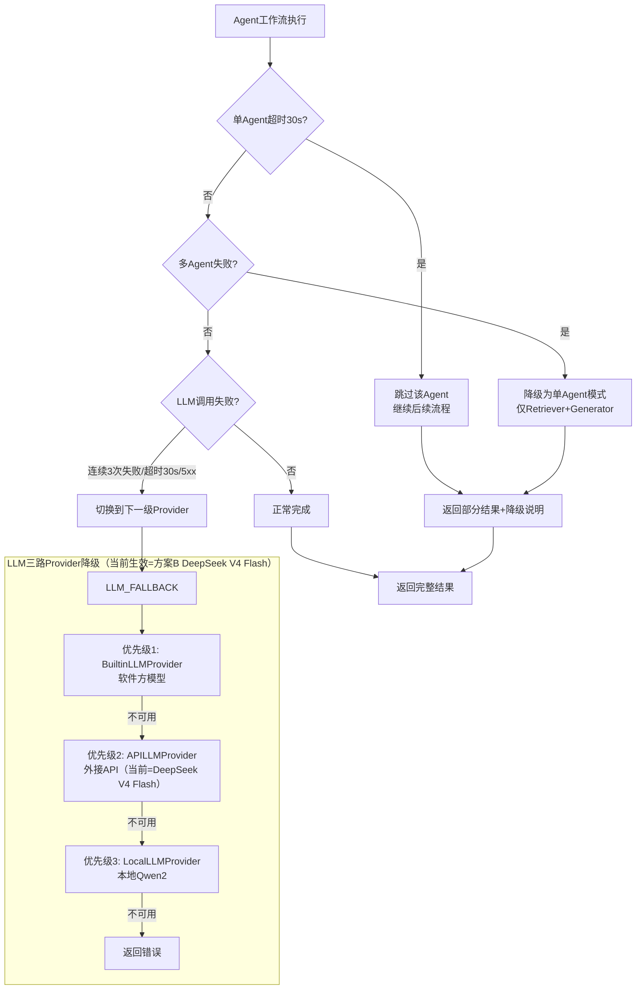
```mermaid
flowchart TD
    START["Agent工作流执行"] --> L1{"单Agent超时30s?"}

    L1 -->|是| SKIP["跳过该Agent\n继续后续流程"]
    L1 -->|否| L2{"多Agent失败?"}

    L2 -->|是| DEGRADE["降级为单Agent模式\n仅Retriever+Generator"]
    L2 -->|否| L3{"LLM调用失败?"}

    L3 -->|连续3次失败/超时30s/5xx| SWITCH["切换到下一级Provider"]
    L3 -->|否| SUCCESS["正常完成"]

    SKIP --> RESULT["返回部分结果+降级说明"]
    DEGRADE --> RESULT
    SWITCH --> LLM_FALLBACK

    subgraph LLM_CHAIN["LLM三路Provider降级（当前生效=方案B DeepSeek V4 Flash）"]
        LLM_FALLBACK --> P1["优先级1: BuiltinLLMProvider\n软件方模型"]
        P1 -->|不可用| P2["优先级2: APILLMProvider\n外接API（当前=DeepSeek V4 Flash）"]
        P2 -->|不可用| P3["优先级3: LocalLLMProvider\n本地Qwen2"]
        P3 -->|不可用| ERROR["返回错误"]
    end

    SUCCESS --> DONE["返回完整结果"]
    RESULT --> DONE
```

| 降级级别 | 触发条件 | 降级行为 | 对用户的影响 |
|---------|---------|---------|------------|
| Agent级 | 单Agent超时30s | 跳过该Agent，继续后续流程 | 部分功能缺失(如无对比/无审核) |
| 工作流级 | 多Agent失败 | 降级为单Agent模式(Retriever+Generator) | 仅检索+生成，无分析/对比/审核 |
| LLM级 | 连续3次失败/超时/5xx | 自动切换下一级Provider | 响应速度可能变化，功能不受影响 |

### 8.2 LLM降级恢复

```
降级链路：软件方模型 → 外接API → 本地模型
恢复策略：每5分钟尝试恢复到更高级别Provider
```

---

## 9 缓存工作流

### 9.1 Cache-Aside模式

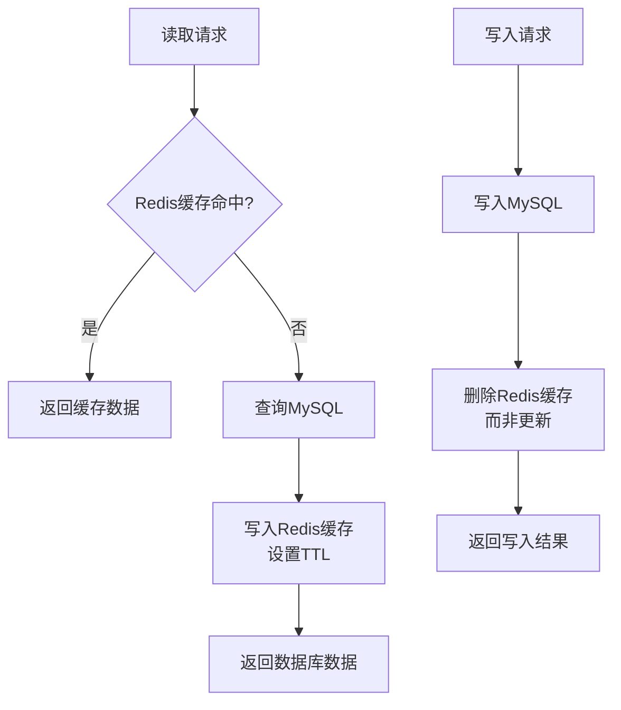
```mermaid
flowchart TD
    START["读取请求"] --> RD{"Redis缓存命中?"}
    RD -->|是| RETURN_CACHE["返回缓存数据"]
    RD -->|否| MYSQL["查询MySQL"]
    MYSQL --> FILL["写入Redis缓存\n设置TTL"]
    FILL --> RETURN_DB["返回数据库数据"]

    START2["写入请求"] --> WRITE_MYSQL["写入MySQL"]
    WRITE_MYSQL --> DEL_CACHE["删除Redis缓存\n而非更新"]
    DEL_CACHE --> RETURN_WRITE["返回写入结果"]
```

### 9.2 缓存Key与TTL分层

| 缓存Key模式 | TTL | 写入方 | 读取方 | 触发失效 |
|-------------|-----|--------|--------|---------|
| `user:profile:{userId}` | 1小时 | Java | Java | 画像更新时删除 |
| `user:info:{userId}` | 1小时 | Java | Java | 用户信息更新时删除 |
| `paper:detail:{paperId}` | 30分钟 | Java | Java | 论文更新时删除 |
| `search:result:{queryHash}` | 10分钟 | Java | Java | — |
| `analysis:result:{analysisId}` | 30分钟 | Java | Java | — |
| `session:state:{sessionId}` | 2小时 | Java | Java | 会话结束时删除 |
| `agent:state:{analysisId}` | 5分钟 | Python | Java→前端 | — |
| `auth:token:blacklist:{tokenHash}` | Token有效期 | Java | Java | — |
| `ai:provider:status` | 5分钟 | Python | Java | — |

---

## 10 安全认证工作流

### 10.1 JWT认证流程

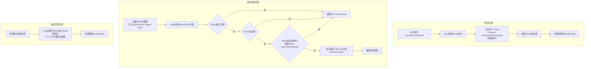
```mermaid
flowchart TD
    subgraph LOGIN["登录流程"]
        L1["用户提交username+password"]
        L2["Java后端BCrypt比对"]
        L3["生成JWT Token\nPayload: userId/username/exp/jti\n有效期24h"]
        L4["返回Token给前端"]
        L5["前端存储到localStorage"]
    end

    subgraph AUTH["请求鉴权流程"]
        R1["前端Axios拦截器\n注入Authorization: Bearer token"]
        R2["Java后端JwtAuthFilter拦截"]
        R3{"Token格式正确?"}
        R4{"Token未过期?"}
        R5{"Token在黑名单中?\n检查Redis auth:token:blacklist"}
        R6["验证通过 注入userId到SecurityContext"]
        R7["继续处理请求"]
        R8["返回401 Unauthorized"]
    end

    subgraph LOGOUT["退出登录流程"]
        O1["前端发送退出请求"]
        O2["Java后端将Token加入Redis黑名单\nTTL=Token剩余有效期"]
        O3["前端清除localStorage"]
    end

    L1 --> L2 --> L3 --> L4 --> L5
    R1 --> R2 --> R3
    R3 -->|否| R8
    R3 -->|是| R4
    R4 -->|否| R8
    R4 -->|是| R5
    R5 -->|是| R8
    R5 -->|否| R6 --> R7
    O1 --> O2 --> O3
```

### 10.2 数据隔离规则

| 安全措施 | 实现方式 | 模块 |
|---------|---------|------|
| 密码加密 | BCrypt哈希+随机盐值 | Java后端 F2.1 |
| 传输加密 | 生产环境HTTPS | Nginx配置 |
| SQL注入防护 | JPA参数化查询 | Java后端 F2.2-F2.4 |
| 数据隔离 | `WHERE user_id = currentUserId` | Java后端 F2.3-F2.4 |
| AI内容标注 | "AI生成，仅供参考" | 前端 F1.4 |

---

## 11 各模块职责速查表

### 11.1 前端模块（F1）

| 子模块 | 编号 | 核心页面/组件 | 主要工作 |
|--------|------|-------------|---------|
| 用户界面 | F1.1 | LoginView / RegisterView / UserCenterView / UserProfileForm | 注册登录、画像设置编辑、历史记录 |
| 论文检索 | F1.2 | HomeView / SearchView / PaperCard / FilterPanel / SortDropdown | 主题输入、检索调用、结果展示、筛选排序 |
| 论文分析 | F1.3 | PaperDetailView / AnalysisCard / PlainExplanation / CompareTable | 论文详情、5维度分析、通俗解释、多论文对比 |
| 综述生成 | F1.4 | ReportView / ReportPreview / CitationLink | 综述展示、引用溯源、报告导出 |
| Agent可视化 | F1.5 | AgentFlowView / AgentFlowChart / AgentStatusPanel / IntermediateResult / TimeStats | 工作流图、状态监控、中间结果、耗时统计 |

### 11.2 Java后端模块（F2）

| 子模块 | 编号 | 核心类 | 主要工作 |
|--------|------|--------|---------|
| 用户管理 | F2.1 | UserController / UserService / UserRepository | 注册登录、JWT鉴权、画像CRUD |
| 论文管理 | F2.2 | PaperController / PaperService / PaperRepository | 论文列表/详情/搜索/收藏 |
| 会话管理 | F2.3 | SessionController / SessionService / SessionRepository | 会话创建/查询/状态管理 |
| 分析服务 | F2.4 | AnalysisController / AnalysisService / AnalysisResultRepository | 分析请求编排、结果持久化、状态查询 |
| AI服务调用 | F2.5 | AgentClientService / PythonAIClient | HTTP调用Python、请求转换、SSE转发 |
| 缓存管理 | F2.6 | RedisConfig / CacheManager | Cache-Aside模式、TTL分层、缓存一致性 |

### 11.3 Python AI服务模块（F3）

| 子模块 | 编号 | 核心文件 | 主要工作 |
|--------|------|---------|---------|
| 多Agent协同引擎 | F3.1 | coordinator.py / retriever.py / analyzer.py / comparer.py / generator.py / reviewer.py / graph.py | 6-Agent编排、LangGraph工作流、降级机制 |
| RAG检索 | F3.2 | embedding_service.py / vector_store_service.py / search_service.py | 文档向量化、语义检索、混合检索、RRF融合 |
| LLM服务 | F3.3 | llm_service.py / api_config.py | 三路Provider降级、统一推理接口、流式输出 |
| 个性化引擎 | F3.4 | personalization_service.py / prompt_builder.py | 画像解析、Prompt个性化、难度/风格适配 |
| API服务 | F3.5 | main.py / router.py / agent.py / search.py / model.py | FastAPI路由、SSE推送、健康检查 |

### 11.4 数据模块（F4）

| 子模块 | 编号 | 存储技术 | 主要工作 |
|--------|------|---------|---------|
| MySQL | F4.1 | MySQL 8.0 | 结构化数据持久化(用户/论文/会话/分析结果) |
| Redis | F4.2 | Redis 7.0 | 缓存热点数据、Agent状态、JWT黑名单 |
| ChromaDB | F4.3 | ChromaDB 0.5+ | 论文向量存储、语义相似度检索 |
| 数据采集 | F4.4 | arXiv API + 脚本 | 论文采集、清洗、分块、质量检查 |

### 11.5 模型模块（F5）

| 子模块 | 编号 | 模型 | 主要工作 |
|--------|------|------|---------|
| 大语言模型 | F5.1 | 软件方模型/API/本地Qwen2 | LLM推理服务、三路降级 |
| Embedding模型 | F5.2 | text-embedding-v4(阿里云百炼) / bge-m3(本地) | 文本向量化、1024维输出 |

---

> **文档维护**：当系统工作流程发生变更时需同步更新本文档
> **变更控制**：核心流程变更需评估对全链路的影响
> **下次审查**：M2里程碑完成时进行首次文档审查
