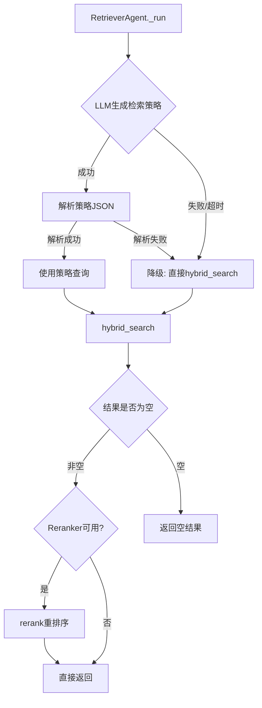

# Task16: RetrieverAgent + tools.py

## 任务概述

| 项目 | 内容 |
|------|------|
| **版本** | v0.2 |
| **里程碑** | M2 / AM2：RAG检索与3-Agent基础可用 |
| **功能编号** | F3.1.2, F3.2.1-F3.2.5 |
| **涉及层级** | python_ai_service |
| **优先级** | P0 |

## 需求描述

实现检索 Agent（RetrieverAgent）和 Agent 工具定义模块（tools.py），产出 `agents/retriever.py` + `agents/tools.py`。RetrieverAgent 继承 BaseAgent，角色为图书管理员，负责接收检索关键词、调用混合检索（语义+关键词+RRF融合）、返回 Top10 论文列表。tools.py 定义 Agent 可调用的工具函数，封装 SearchService 的调用为 Agent 可用的工具接口。

## 影响范围

| 操作 | 文件路径 | 说明 |
|------|---------|------|
| 新增 | `Veritas/ai-service/app/agents/retriever.py` | RetrieverAgent检索Agent实现 |
| 新增 | `Veritas/ai-service/app/agents/tools.py` | Agent工具定义模块 + TOOL_REGISTRY |
| 修改 | `Veritas/ai-service/app/agents/__init__.py` | 导出RetrieverAgent和工具函数 |

## 核心实现要求

### RetrieverAgent 类

```python
class RetrieverAgent(BaseAgent):
    def __init__(self, llm_service, prompt_manager, search_service, reranker=None, timeout=30): ...
    async def _run(self, prompt, input_data, context) -> dict: ...
    def build_prompt(self, input_data, context) -> str: ...
    def _parse_search_strategy(self, llm_output: str) -> dict: ...
```

**_run() 执行流程**：
1. 调用 `self.llm_service.generate(prompt)` 获取检索策略 JSON
2. 解析检索策略（`_parse_search_strategy`）
3. 提取 core_keywords 组合为查询字符串
4. 调用 `self.search_service.hybrid_search(query, top_k, filters)` 执行混合检索
5. 如果 `self.reranker` 存在且 `user_profile` 在 context 中，调用 `reranker.rerank(query, results, user_profile)`
6. 更新 `self.state.intermediate_result` 为 "找到N篇相关论文"
7. 返回 `{"papers": results[:top_k], "total_found": len(results), "search_strategy": strategy}`

**build_prompt()**：使用 `self.prompt_manager.get_prompt('retriever', topic=..., top_k=...)` 渲染 Prompt 模板

**_parse_search_strategy()**：解析 LLM 输出的 JSON 检索策略，提取 core_keywords/expanded_keywords/search_strategy/filters。JSON 解析失败时降级为使用原始 topic 作为查询词

**进度更新**：
- LLM 生成策略时 progress=0.2
- 混合检索时 progress=0.6
- 重排序时 progress=0.8
- 完成时 progress=1.0

### tools.py 工具模块

```python
async def vector_search_tool(search_service, query: str, top_k: int = 20, filters: dict = None) -> list: ...
async def keyword_search_tool(search_service, query: str, top_k: int = 20, filters: dict = None) -> list: ...
async def hybrid_search_tool(search_service, query: str, top_k: int = 10, filters: dict = None) -> list: ...
async def rerank_tool(reranker, query: str, results: list, user_profile: dict = None) -> list: ...

TOOL_REGISTRY: dict[str, Callable] = {
    "vector_search": vector_search_tool,
    "keyword_search": keyword_search_tool,
    "hybrid_search": hybrid_search_tool,
    "rerank": rerank_tool,
}
```

**工具函数异常处理**：
- 检索工具（vector/keyword/hybrid）：异常时返回空列表 `[]`，记录 WARNING 日志
- 重排序工具（rerank）：异常时返回原始 `results`，记录 WARNING 日志
- 所有工具函数**不向上层抛出异常**

## 降级策略



| 降级场景 | 触发条件 | 降级行为 |
|---------|---------|---------|
| LLM 策略生成失败 | 超时/异常/JSON解析失败 | 直接使用 topic 调用 hybrid_search |
| 检索结果为空 | hybrid_search 返回 [] | 返回空结果，不抛异常 |
| Reranker 失败 | rerank 抛出异常 | 返回原始检索结果 |
| Agent 整体超时 | execute() 超过 30s | BaseAgent 返回降级结果 |

## 依赖的已有模块

| 模块 | 复用方式 |
|------|---------|
| `app/agents/base.py` → BaseAgent/AgentStatus/AgentState | 直接继承 |
| `app/services/search_service.py` → SearchService | tools.py 封装调用 |
| `app/services/reranker.py` → Reranker | tools.py 封装调用 |
| `app/services/llm_service.py` → LLMService | RetrieverAgent 调用 |
| `app/services/prompt_manager.py` → PromptManager | RetrieverAgent 调用 |
| `app/core/events.py` → AppState | 获取全局服务实例 |
| `prompts/retriever.txt` | Prompt 模板 |

## 约束

- RetrieverAgent 属于 Agent 层，通过 tools.py 调用 Service 层，不直接操作 ChromaDB 或 EmbeddingService
- tools.py 中每个工具函数捕获异常返回空结果/原始结果，不抛出异常
- LLM 失败应降级为直接 hybrid_search，确保检索功能可用
- 配置从 settings 读取，不硬编码
- 日志使用 Loguru，不在日志中输出敏感信息
- Python 命名规范：类名 PascalCase，函数 snake_case

## 禁止行为

- ❌ 输出伪代码或 TODO 注释
- ❌ 修改需求范围外的模块（不修改 search_service.py/reranker.py/llm_service.py 等已有文件）
- ❌ RetrieverAgent 直接操作 ChromaDB 或 EmbeddingService
- ❌ tools.py 中的工具函数抛出异常到调用方
- ❌ LLM 检索策略失败时直接返回空结果而不降级检索
- ❌ 硬编码 ChromaDB 路径或 Embedding 模型名
- ❌ 忽略降级场景（检索失败/LLM失败/Reranker失败）

## 验证命令

```bash
cd Veritas/ai-service && python -m pytest tests/test_retriever_agent.py -v
cd Veritas/ai-service && python -c "from app.agents.retriever import RetrieverAgent; from app.agents.tools import TOOL_REGISTRY; print('Import OK, tools:', list(TOOL_REGISTRY.keys()))"
```

## 验收标准

- [ ] RetrieverAgent 继承 BaseAgent，name='retriever'，实现 _run() 和 build_prompt()
- [ ] build_prompt 使用 PromptManager 渲染 retriever.txt 模板，注入 topic 和 top_k
- [ ] _run 调用 hybrid_search 执行混合检索，返回 Top10 论文列表
- [ ] LLM 检索策略失败时降级为直接 hybrid_search，仍返回结果
- [ ] _parse_search_strategy 解析 LLM JSON 输出，失败时降级为原始 topic
- [ ] tools.py 中 4 个工具函数均捕获异常返回空结果/原始结果，不抛出异常
- [ ] TOOL_REGISTRY 包含 vector_search/keyword_search/hybrid_search/rerank 四个映射
- [ ] RetrieverAgent 通过 SearchService 间接调用检索，不直接操作 ChromaDB
- [ ] 执行过程中 state.progress 从 0.2 递增到 1.0，intermediate_result 更新
- [ ] 所有 pytest 单元测试通过
