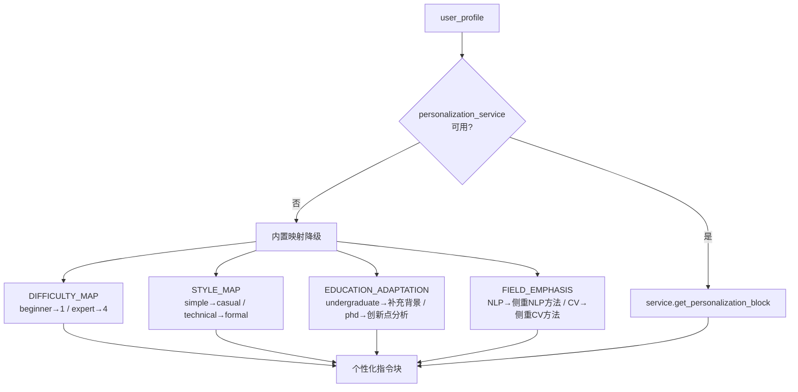

# Task20: GeneratorAgent 生成员Agent核心逻辑

## 任务概述

| 项目 | 内容 |
|------|------|
| **版本** | v0.2 |
| **里程碑** | M2 / AM2：RAG检索与3-Agent基础可用 |
| **功能编号** | F3.1.5 |
| **涉及层级** | python_ai_service |
| **优先级** | P0 |

## 需求描述

实现 GeneratorAgent 生成员Agent核心逻辑，产出 `agents/generator.py`。

GeneratorAgent 继承 BaseAgent，是3-Agent基础工作流的第3个Agent（Retriever → Analyzer → Generator）。它接收 AnalyzerAgent 的分析结果和可选的对比结果，通过 PersonalizationService 构建个性化Prompt，调用LLM生成结构化文献综述报告，提取引用列表，计算术语密度，验证报告必含章节。

### 输出Schema

```json
{
  "report": "Markdown格式综述报告",
  "citation_list": [
    {"index": 1, "paper_id": "arxiv_001", "citation": "Smith et al. Title. Venue, 2024."}
  ],
  "term_density_actual": 0.23,
  "personalization_applied": {
    "education_adaptation": "侧重方法论对比和实验设计分析",
    "term_density_target": 0.20,
    "style_guide": "standard"
  }
}
```

## 影响范围

| 操作 | 文件路径 | 说明 |
|------|---------|------|
| 新增 | `Veritas/ai-service/app/agents/generator.py` | GeneratorAgent核心逻辑 |

## 核心实现要求

### 类结构

```python
class GeneratorAgent(BaseAgent):
    REQUIRED_SECTIONS = ['引言', '研究现状', '方法对比', '研究趋势', '参考文献']
    TERM_DENSITY_TARGET = {'beginner': 0.05, 'intermediate': 0.20, 'advanced': 0.40, 'expert': 0.50}
    DIFFICULTY_MAP = {'beginner': 1, 'intermediate': 2, 'advanced': 3, 'expert': 4}
    STYLE_MAP = {'simple': 'casual', 'balanced': 'standard', 'technical': 'formal'}
    EDUCATION_ADAPTATION = {...}
    FIELD_EMPHASIS = {...}
    ACADEMIC_TERMS = [...]
    AI_DISCLAIMER = '⚠️ 本内容由 AI 生成，仅供参考'

    def __init__(self, llm_service, prompt_manager, personalization_service=None,
                 timeout=30, llm_temperature=0.7, llm_max_tokens=4096): ...
    def build_prompt(self, input_data, context) -> str: ...
    async def _run(self, prompt, input_data, context) -> dict: ...
    def _build_personalization_block(self, user_profile) -> str: ...
    def _extract_citations(self, report, analysis_results) -> list: ...
    def _validate_report(self, report) -> dict: ...
    def _calculate_term_density(self, report, knowledge_level) -> float: ...
    def _generate_fallback_report(self, analysis_results, compare_result=None) -> str: ...
    def _fallback_result(self, input_data) -> dict: ...
    def _summarize_result(self, result) -> str: ...
```

### _run 核心流程

1. 从 `input_data['analysis_results']` 获取分析结果，`input_data.get('compare_result')` 获取可选对比结果
2. 更新 progress=0.2, intermediate_result='Building personalized prompt'
3. 调用 `build_prompt` 构建完整prompt
4. 更新 progress=0.4, intermediate_result='Generating literature review'
5. 调用 `llm_service.generate(prompt)` 获取LLM综述输出
6. 更新 progress=0.7, intermediate_result='Extracting citations and validating'
7. 调用 `_validate_report` 验证章节完整性
8. 调用 `_extract_citations` 提取引用列表
9. 调用 `_calculate_term_density` 计算术语密度
10. 构建 `personalization_applied` 快照
11. 追加AI免责声明（若LLM输出未包含）
12. 更新 progress=1.0
13. 返回 `{report, citation_list, term_density_actual, personalization_applied}`

### 引用提取

支持两种引用格式：

| 格式 | 正则模式 | 示例 |
|------|---------|------|
| 作者-年份 | `\[([A-Z][a-z]+(?:\s+et\s+al\.)?,\s*\d{4})\]` | [Smith et al., 2024] |
| 数字引用 | `\[(\d+)\]` | [1] |

提取后映射回 `analysis_results` 中的 `paper_id`，无法映射时 `paper_id=None`。

### 个性化引擎（内置降级映射）



### 降级策略

| 场景 | 降级行为 |
|------|---------|
| LLM调用失败 | `_generate_fallback_report` 模板拼接生成简化综述 |
| PersonalizationService失败 | 内置DIFFICULTY_MAP/STYLE_MAP/EDUCATION_ADAPTATION/FIELD_EMPHASIS映射 |
| 引用提取失败 | 返回空 `citation_list=[]` |
| 章节验证缺失 | 自动追加模板段落修补报告 |

### 降级报告模板结构

```
## 1 引言
基于N篇论文的分析数据...

## 2 研究现状
- 论文1: title — core_method.summary
- 论文2: ...

## 3 方法对比
逐篇列出方法（如有compare_result则使用对比数据）

## 4 研究趋势
基于结论简单推断

## 5 参考文献
1. title (year)

⚠️ 本内容由 AI 生成，仅供参考
```

## 依赖的已有模块

| 模块 | 复用方式 |
|------|---------|
| `app/agents/base.py` → BaseAgent | 直接继承 |
| `app/agents/analyzer.py` → Agent实现模式 | 参考 |
| `app/agents/retriever.py` → Agent实现模式 | 参考 |
| `app/services/llm_service.py` → LLMService.generate() | 直接调用 |
| `app/services/prompt_manager.py` → get_prompt('generator', ...) | 直接调用 |
| `prompts/generator.txt` → 生成Prompt模板 | 直接使用 |
| `app/models/schemas.py` → UserProfile | 参考 |

## 约束

- 输出字段统一 snake_case（term_density_actual 而非 termDensityActual）
- LLM失败时走 `_generate_fallback_report` 降级路径，不抛异常
- 所有报告必须包含AI免责声明 `⚠️ 本内容由 AI 生成，仅供参考`
- 必含章节使用 `REQUIRED_SECTIONS` 常量定义
- 术语密度目标使用 `TERM_DENSITY_TARGET` 常量定义
- 日志使用 Loguru，不输出完整报告内容或敏感信息
- PersonalizationService仅通过接口调用，不实现其内部逻辑（task21实现）
- Agent超时30s（BaseAgent.execute覆盖）

## 禁止行为

- ❌ 输出伪代码或 TODO 注释
- ❌ 修改 base.py / analyzer.py / retriever.py / llm_service.py / generator.txt 等已有文件
- ❌ 输出字段使用 camelCase
- ❌ LLM失败时抛出异常而非降级处理
- ❌ 硬编码章节名或术语密度目标（必须用常量）
- ❌ 忽略降级场景
- ❌ 省略AI免责声明
- ❌ 实现PersonalizationService的具体逻辑（属于task21）

## 验证命令

```bash
cd Veritas/ai-service && python -m pytest tests/test_generator_agent.py -v
cd Veritas/ai-service && python -c "from app.agents.generator import GeneratorAgent; print('Import OK')"
```

## 验收标准

- [ ] GeneratorAgent 继承 BaseAgent，name='generator'
- [ ] build_prompt 正确调用 prompt_manager.get_prompt('generator', ...)
- [ ] _run 正常流程：分析结果输入 → 返回完整输出结构（report/citation_list/term_density_actual/personalization_applied）
- [ ] _build_personalization_block 根据user_profile返回不同个性化指令，service失败时降级
- [ ] _extract_citations 支持 [Author, Year] 和 [N] 两种格式
- [ ] _validate_report 检查5个必含章节，缺失时自动修补
- [ ] _calculate_term_density 返回0-1之间浮点数
- [ ] LLM失败时走降级路径，返回含降级报告的完整结构
- [ ] 所有报告包含AI免责声明，不重复添加
- [ ] 输出字段全部 snake_case
- [ ] 所有 pytest 测试通过（19+用例）
