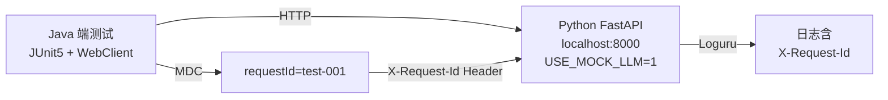

# AM3-4 — Java→Python 通信联调

> **里程碑**: AM3：API完善与Java对接（Week 5-6）
> **版本**: v0.3
> **涉及层级**: python_ai_service + java_backend
> **功能编号**: F3.5.1~F3.5.4 + F2.5.1/F2.5.2/F2.5.5

---

## 1. 任务目标

提供 Java→Python **真实端到端联调测试代码**（非 mock），验证：
1. 5 个 API 端点的请求/响应格式
2. Java camelCase ↔ Python snake_case 双向转换
3. 30s 超时 + 1 次重试 + 3s 间隔
4. X-Request-Id MDC 透传
5. isHealthy 5s 短超时独立验证
6. 5xx 错误重试与降级

**联调对象**：[backend/task19 PythonAIClient](file:///Users/achieve/Documents/AchiEVE_MacBook_Air/Veritas(求真)/json_prompt/backend/task19_python_ai_client/prompt.md) 已实现的 WebClient 客户端。

---

## 2. 涉及文件

| 操作 | 路径 | 说明 |
|------|------|------|
| 新增 | `Veritas/ai-service/tests/integration/java_python_link/PythonAIClientIntegrationTest.java` | Java 联调测试主类（JUnit5） |
| 新增 | `Veritas/ai-service/tests/integration/java_python_link/README.md` | 联调运行说明 |
| 新增 | `Veritas/ai-service/scripts/start_test_server.sh` | 启动 mock Python 服务 |
| 新增 | `Veritas/ai-service/tests/integration/python_side/conftest.py` | pytest mock fixtures |
| 新增 | `Veritas/ai-service/tests/integration/python_side/test_java_calls_python.py` | Python 侧配套测试 |

---

## 3. 联调架构

---

## 4. 关键测试场景

| 测试 | 输入 | 预期 | 关键验证 |
|------|------|------|---------|
| test_java_analyzePaper | 合法 AnalyzeRequest | 200 + AnalysisResultDTO | 字段名映射、report 内容非空 |
| test_java_comparePapers | analysisType=compare | 200 + status=completed | 触发 ComparerAgent（若已实现） |
| test_java_search | query="Transformer" | 200 + List<PaperSearchResultDTO> | paperId/score 字段 |
| test_java_isHealthy | 无 | boolean | 5s 内返回，不抛异常 |
| test_java_getModelStatus | 无 | ModelStatusDTO | currentProvider/embeddingDimension |
| test_retry_on_5xx | MockWebServer 5xx | 200 (重试 1 次成功) | 验证 retry 逻辑 |
| test_timeout_30s | MockWebServer 延迟 | AIServiceException(503) | 30s 内结束 |

---

## 5. 验收标准

- [ ] Java 联调测试类 7 个方法与 task19 PythonAIClient 7 个 FR 对应
- [ ] `start_test_server.sh` 启动后 5s 内 /health 返回 200
- [ ] Python 侧 conftest 提供 mock LLM/Chroma/Embedding
- [ ] 重试测试：Python 5xx → Java 重试 1 次后成功
- [ ] 超时测试：30s 超时不真等（用虚拟时间）
- [ ] X-Request-Id 透传：MDC → Python 端 loguru 日志可见
- [ ] 字段命名一致：Java camelCase → Python snake_case → JSON camelCase

---

## 6. 参考文档

- [Java 端 PythonAIClient 契约](file:///Users/achieve/Documents/AchiEVE_MacBook_Air/Veritas(求真)/json_prompt/backend/task19_python_ai_client/prompt.md)
- [AI服务架构 §4.4 + §附录B](file:///Users/achieve/Documents/AchiEVE_MacBook_Air/Veritas(求真)/docs/ai-service/AI服务模块系统架构文档.md)

---

## 7. 下一步建议

- 任务 5（task28）将基于本任务的联调结果，输出 **Java↔Python 字段映射文档**，供前端和 Java 端参考
- 建议在 CI/CD 流水线中集成该联调测试（GitHub Actions / GitLab CI）
- 真实部署时，K8s NetworkPolicy 应限制 Python 服务仅接受 Java 后端的请求
