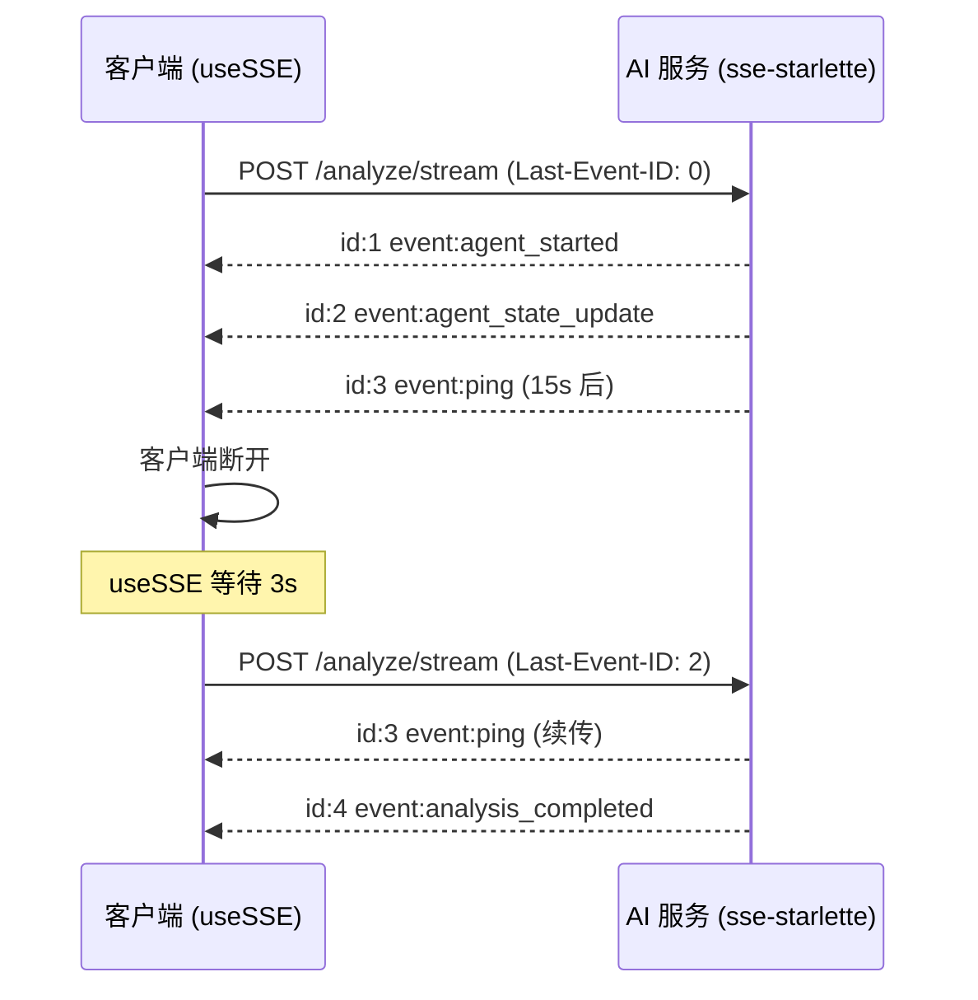

# AM3-7 — SSE推送稳定性测试 + 断线重连

> **里程碑**: AM3：API完善与Java对接（Week 5-6）
> **版本**: v0.3
> **涉及层级**: python_ai_service + frontend
> **功能编号**: F3.5.1 + F3.1.7

---

## 1. 任务目标

增强 SSE 推送稳定性，实现：
1. **AI 端 keep-alive**：长流程每 15s yield `ping` 事件
2. **异常优雅处理**：节点异常 yield `agent_failed` + `error` 事件，不中断流
3. **断点续传**：支持 HTTP `Last-Event-ID` Header，事件流可重连
4. **前后端协同**：AI 端 keep-alive + 前端 useSSE 3s 间隔最多 5 次重连

---

## 2. 涉及文件

| 操作 | 路径 | 说明 |
|------|------|------|
| 修改 | `Veritas/ai-service/app/agents/orchestrator.py` | keep-alive + Last-Event-ID |
| 修改 | `Veritas/ai-service/app/api/endpoints/agent.py` | 接收 Last-Event-ID Header |
| 新增 | `Veritas/ai-service/tests/test_sse_stability.py` | 稳定性 + 重连测试（6 用例） |
| 新增 | `Veritas/ai-service/tests/test_sse_reconnect_frontend.py` | 前后端联调测试 |

---

## 3. SSE 增强事件格式

```text
id: 5
event: agent_state_update
data: {"agentName":"retriever","status":"running","timestamp":1700000000000}

id: 6
event: ping
data: {}

id: 7
event: analysis_completed
data: {"analysisId":"anl_001","status":"completed","timestamp":1700000000000}
```

每个事件新增 `id: <int>` 字段（单调递增），用于 Last-Event-ID 续传。

---

## 4. 关键实现

### 4.1 Keep-alive 机制

```python
# app/agents/orchestrator.py
async def run_workflow_stream(self, request, agent_instances, last_event_id=0):
    self._event_id = last_event_id
    keepalive_task = asyncio.create_task(self._keepalive_loop())
    try:
        for node in self._nodes:
            async for event in self._run_node(node, request, agent_instances):
                yield event
    finally:
        keepalive_task.cancel()

async def _keepalive_loop(self):
    while True:
        await asyncio.sleep(15)
        self._event_id += 1
        yield {"id": str(self._event_id), "event": "ping", "data": "{}"}
```

### 4.2 Last-Event-ID 续传

```python
# app/api/endpoints/agent.py
@router.post("/analyze/stream")
async def analyze_stream(
    request: AnalyzeRequest,
    last_event_id: int = Header(0, alias="Last-Event-ID"),
):
    # 验证 last_event_id
    if last_event_id < 0:
        raise ValidationException(message="Last-Event-ID 必须为正整数")
    
    return EventSourceResponse(
        orchestrator.run_workflow_stream(
            request, agent_instances, last_event_id=last_event_id
        )
    )
```

### 4.3 客户端断开优雅处理

```python
# sse-starlette 自动处理 disconnect，捕获 CancelledError 即可
async def run_workflow_stream(...):
    try:
        for node in self._nodes:
            async for event in self._run_node(...):
                yield event
    except asyncio.CancelledError:
        logger.info(f"Client disconnected, analysis_id={request.analysis_id}")
        raise  # 必须 re-raise，让 sse-starlette 关闭连接
```

---

## 5. 前后端协同时序



---

## 6. 验收标准

- [ ] 长流程每 15s yield `ping` 事件
- [ ] 节点异常 yield `agent_failed` + `error` 事件，不中断流
- [ ] Last-Event-ID Header 支持断点续传
- [ ] 客户端断开服务器优雅关闭，无未捕获异常
- [ ] 10 并发 SSE 流无 OOM 无事件错乱
- [ ] 前后端联调：3s 间隔重连可成功，事件不丢
- [ ] Last-Event-ID 仅接受正整数

---

## 7. 参考文档

- [task25 SSE 基础推送](file:///Users/achieve/Documents/AchiEVE_MacBook_Air/Veritas(求真)/json_prompt/ai-service/task25_sse_basic_push/prompt.md)
- [前端 useSSE Composable](file:///Users/achieve/Documents/AchiEVE_MacBook_Air/Veritas(求真)/json_prompt/frontend/task28_use_sse_composable/prompt.md)
- [前端 SSE 事件解析](file:///Users/achieve/Documents/AchiEVE_MacBook_Air/Veritas(求真)/json_prompt/frontend/task29_sse_event_parsing/prompt.md)

---

## 8. 下一步建议

- 任务 8（task31）将基于本任务的稳定 SSE 做完整集成测试 + Bug 修复
- 建议在生产环境给 SSE 端点配置 Nginx `proxy_buffering off` + `proxy_read_timeout 180s`
- Redis 缓存事件流（TTL=120s）用于 Last-Event-ID 续传，K8s 多实例下需共享
