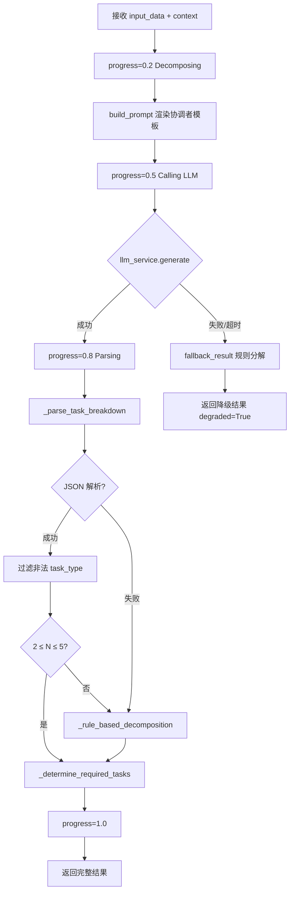

# Task32: CoordinatorAgent 协调者 Agent 核心逻辑

## 任务概述

| 项目 | 内容 |
|------|------|
| **版本** | v0.4 |
| **里程碑** | AM4：6-Agent协同与个性化引擎（Week 7-8，M4） |
| **功能编号** | F3.1.1, F3.1.7, F3.1.8 |
| **涉及层级** | python_ai_service |
| **优先级** | P0 |

## 需求描述

实现 CoordinatorAgent 协调者 Agent 核心逻辑，产出 `Veritas/ai-service/app/agents/coordinator.py`。

CoordinatorAgent 是 6-Agent 协同工作流的"项目经理"，位于 LangGraph StateGraph 入口节点。它接收用户原始 query、用户画像、analysis_type、analysis_id，通过 PromptManager 加载 `prompts/coordinator.txt` 模板，调用 LLMService.generate() 进行**任务分解**（task decomposition），将用户研究问题分解为 2-5 个结构化子任务（`retrieve` / `analyze` / `compare` / `generate` / `review`），并根据 `paper_ids` 数量和 `analysis_type` 自动决定是否启用 Comparer 子任务。

输出 `sub_tasks` 列表与 `reasoning` 字段供下游 LangGraph 节点按顺序执行。Agent 整体超时 30s（settings.AGENT_TIMEOUT），LLM 失败时**降级为基于规则的任务分解**（基于 query 关键词 + paper_ids 数量 + analysis_type 启发式），不阻塞 LangGraph 流程。

### 输出 Schema

```json
{
  "sub_tasks": [
    {"task_type": "retrieve", "description": "检索关于...的论文", "keywords": [...], "top_k": 10},
    {"task_type": "analyze", "description": "分析论文", "dimensions": [...]},
    {"task_type": "compare", "description": "对比论文", "required": true},
    {"task_type": "generate", "description": "生成综述", "style": "学术风格"},
    {"task_type": "review", "description": "审核内容", "focus": [...]}
  ],
  "reasoning": "LLM 任务分解推理说明",
  "task_count": 5,
  "requires_compare": true,
  "requires_review": true,
  "analysis_type": "report",
  "paper_count": 2,
  "agent": "coordinator"
}
```

## 影响范围

| 操作 | 文件路径 | 说明 |
|------|---------|------|
| 新增 | `Veritas/ai-service/app/agents/coordinator.py` | CoordinatorAgent 核心逻辑 |

## 核心实现要求

### 类结构

```python
class CoordinatorAgent(BaseAgent):
    VALID_TASK_TYPES = {'retrieve', 'analyze', 'compare', 'generate', 'review'}
    MIN_SUB_TASKS = 2
    MAX_SUB_TASKS = 5
    DEFAULT_ANALYSIS_TYPE = 'report'
    DEFAULT_TOP_K = 10
    DEFAULT_DIMENSIONS = ['research_problem', 'core_method', 'main_experiments', 'core_conclusions', 'limitations']

    def __init__(self, llm_service, prompt_manager, timeout=30,
                 llm_temperature=0.3, llm_max_tokens=1024): ...
    def build_prompt(self, input_data, context) -> str: ...
    async def _run(self, prompt, input_data, context) -> dict: ...
    def _parse_task_breakdown(self, llm_output, input_data) -> list: ...
    def _rule_based_decomposition(self, input_data) -> list: ...
    def _determine_required_tasks(self, input_data, sub_tasks) -> dict: ...
    def _summarize_sub_tasks(self, sub_tasks) -> str: ...
    def _fallback_result(self, input_data) -> dict: ...
    def _summarize_result(self, result) -> str: ...
    def _infer_style_from_profile(self, user_profile) -> str: ...
```

### _run 核心流程



### 任务分解决策表

| analysis_type | paper_ids | 子任务集 | requires_compare | requires_review |
|---------------|-----------|----------|------------------|-----------------|
| paper_analysis | [] | retrieve, analyze | False | False |
| paper_analysis | [id1] | retrieve, analyze | False | False |
| report | [] | retrieve, analyze, generate, review | False | True |
| report | [id1] | retrieve, analyze, generate, review | False | True |
| report | [id1, id2] | retrieve, analyze, compare, generate, review | True | True |
| compare | [id1, id2] | retrieve, analyze, compare, generate, review | True | True |

### 规则分解 _rule_based_decomposition 规则

| 条件 | 动作 |
|------|------|
| 总是添加 | `{task_type: 'retrieve', keywords, top_k: 10}` |
| 总是添加 | `{task_type: 'analyze', dimensions: 5个}` |
| `len(paper_ids) >= 2` 且 `analysis_type in ('compare', 'report')` | 添加 `{task_type: 'compare', required: True}` |
| `analysis_type != 'paper_analysis'` | 添加 `{task_type: 'generate', style: 推断}` |
| `analysis_type in ('report', 'compare')` | 添加 `{task_type: 'review', focus: [...]}` |

### 降级策略

| 场景 | 降级行为 | 流程影响 |
|------|---------|---------|
| LLM 不可用 | `_rule_based_decomposition` 生成子任务 | LangGraph 继续执行 |
| JSON 解析失败 | `_parse_task_breakdown` → `_rule_based_decomposition` | LangGraph 继续执行 |
| 子任务数 < 2 | 补全规则分解子任务 | LangGraph 继续执行 |
| 子任务数 > 5 | 截断到前 5 个 | LangGraph 继续执行 |
| task_type 非法 | 过滤丢弃，剩余不足时补全 | LangGraph 继续执行 |
| 30s 超时 | `_fallback_result` 返回规则分解，degraded=True | LangGraph 继续执行 |

## 测试覆盖

### 单元测试（pytest）

| 测试名称 | 覆盖场景 |
|---------|---------|
| test_coordinator_inherits_base_agent | 正常流程 |
| test_build_prompt_renders_template | 正常流程 |
| test_build_prompt_with_empty_paper_ids | 边界条件 |
| test_parse_task_breakdown_valid_json | 正常流程 |
| test_parse_task_breakdown_invalid_json | 异常流程 + 降级 |
| test_parse_task_breakdown_filter_invalid_task_types | 边界条件 |
| test_parse_task_breakdown_subtask_count_constraint | 边界条件 |
| test_rule_based_decomposition_paper_analysis | 正常流程 |
| test_rule_based_decomposition_compare_with_multi_papers | 正常流程 |
| test_rule_based_decomposition_report_with_single_paper | 正常流程 |
| test_rule_based_decomposition_report_with_multi_papers | 正常流程 |
| test_determine_required_tasks_compare | 正常流程 |
| test_determine_required_tasks_no_compare | 正常流程 |
| test_summarize_sub_tasks | 正常流程 |
| test_run_success_flow | 正常流程 |
| test_run_llm_failure_fallback | 异常流程 + 降级 |
| test_run_llm_empty_output_fallback | 异常流程 + 降级 |
| test_fallback_result_preserves_langgraph_flow | 降级 |
| test_infer_style_from_profile | 正常流程 |
| test_summarize_result | 正常流程 |

## 验证命令

```bash
# 1. 导入验证
cd /Users/achieve/Documents/AchiEVE_MacBook_Air/Veritas(求真)/Veritas/ai-service
python -c "from app.agents.coordinator import CoordinatorAgent; print('Import OK')"

# 2. 单元测试
python -m pytest tests/test_coordinator_agent.py -v

# 3. 全部 coordinator 相关测试
python -m pytest tests/ -k coordinator -v
```

## 验收标准

- [x] AC-001: CoordinatorAgent 继承 BaseAgent，name='coordinator'
- [x] AC-002: _run 正常流程返回完整 {sub_tasks, reasoning, task_count, requires_compare, requires_review, ...}
- [x] AC-003: progress 从 0.2 → 0.5 → 0.8 → 1.0 渐变
- [x] AC-004: _parse_task_breakdown JSON 解析失败降级 + 2-5 个子任务约束
- [x] AC-005: _rule_based_decomposition 正确生成 2-5 个子任务
- [x] AC-006: _determine_required_tasks 正确计算条件标记
- [x] AC-007: LLM 失败时 _fallback_result 返回规则分解，LangGraph 不中断
- [x] AC-008: 输出字段全部 snake_case
- [x] AC-009: 不硬编码子任务类型/数量阈值
- [x] AC-010: CoordinatorAgent 不直接调用其他 Agent
- [x] AC-011: Prompt 注入防护（topic 长度限制 + 控制字符清理）
- [x] AC-012: 日志不输出完整 LLM Prompt/输出
- [x] AC-013: 单元测试覆盖正常/异常/边界
- [x] AC-014: 未修改任何已有文件

## 关键设计决策

### 1. 为什么 CoordinatorAgent 必须降级？

CoordinatorAgent 是 6-Agent 工作流的**入口节点**。如果它失败，整个 LangGraph 流程无法启动。规则分解保证：
- **可用性**：即使 LLM 完全不可用（极端情况如 API 密钥失效、Provider 全部宕机），系统仍可输出基础综述
- **可恢复性**：规则分解的子任务集是预定义的有效集合，下游 Agent 可正常消费
- **优雅降级**：返回 `degraded=True` 让前端知晓当前结果质量，但流程不中断

### 2. 为什么强制 2-5 个子任务约束？

- **< 2 不可行**：少于 2 个子任务无法构成有意义的工作流（如仅 retrieve + generate 缺少 analyze）
- **> 5 不可控**：LangGraph 节点膨胀，状态管理复杂，超时风险增大
- **2-5 是经验值**：覆盖 5 种任务模式（search_only / single_paper_analysis / multi_paper_comparison / personalized_review / full_pipeline）

### 3. 为什么 requires_compare / requires_review 单独标记？

LangGraph 条件边需要明确的布尔判断依据：
- `requires_compare`：控制 `analyze → compare` 还是 `analyze → generate` 的分支
- `requires_review`：控制 `generate → review` 还是 `generate → END` 的分支
- 标记源自 `paper_count` + `analysis_type`，便于在 graph.py 中实现条件边

### 4. 为什么 llm_temperature=0.3 而 Generator 用 0.7？

- **Coordinator（0.3）**：任务分解需要**确定性 JSON 输出**，温度低以减少格式错误
- **Generator（0.7）**：综述生成需要**创造性和多样性**，温度高以避免重复套话
- 这是有意的差异化设计，符合各自职责

## 上下游关系

```
LangGraph 入口节点
       ↓ input: {topic, paper_ids, user_profile, analysis_type, analysis_id}
CoordinatorAgent.execute()
       ↓ output: {sub_tasks, requires_compare, requires_review, ...}
LangGraph 状态机
       ↓ 依据 sub_tasks 顺序执行
[Retriever → Analyzer → (Comparer) → Generator → (Reviewer)]
```

## 参考文档

- [AI服务模块系统架构文档 §5.4.1](file:///Users/achieve/Documents/AchiEVE_MacBook_Air/Veritas(求真)/docs/ai-service/AI服务模块系统架构文档.md)
- [AI服务模块项目里程碑文档 §6](file:///Users/achieve/Documents/AchiEVE_MacBook_Air/Veritas(求真)/docs/ai-service/AI服务模块项目里程碑文档.md)
- [架构决策记录 ADR-002](file:///Users/achieve/Documents/AchiEVE_MacBook_Air/Veritas(求真)/docs/架构决策记录(ADR).md)
- [AGENTS.md §3.1-3.3](file:///Users/achieve/Documents/AchiEVE_MacBook_Air/Veritas(求真)/AGENTS.md)

## 下一步建议

1. **task33 紧随其后**：升级 `prompts/coordinator.txt` 为结构化模板（任务分解 JSON Schema 强化 + few-shot 示例）
2. **task34-36**：实现 Comparer Agent + Reviewer Agent + 6-Agent 完整 LangGraph 工作流
3. **task37**：M4 集成测试（协调者 + 6-Agent 工作流 + 个性化差异度验证）
4. **未来增强**（AM5+）：
   - CoordinatorAgent 集成会话历史（session_summary 注入，支持多轮对话）
   - 协调者可视化（前端展示任务分解树）
   - 子任务依赖图（DAG 而非线性）
