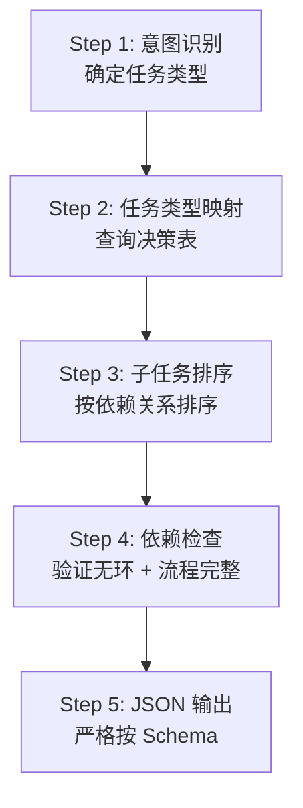

# Task33: Coordinator Prompt 模板与任务分解逻辑

## 任务概述

| 项目 | 内容 |
|------|------|
| **版本** | v0.4 |
| **里程碑** | AM4：6-Agent协同与个性化引擎（Week 7-8，M4） |
| **功能编号** | F3.1.1, F3.3.4, F3.1.7 |
| **涉及层级** | python_ai_service |
| **优先级** | P0 |

## 需求描述

升级协调者 Prompt 模板 `prompts/coordinator.txt`，产出符合 v2 标准的协调者 Prompt。本任务是 task32 CoordinatorAgent 的配套 Prompt 工程任务。

### 核心目标

1. **重写 `prompts/coordinator.txt`** 为结构化模板（符合 Prompt DSL 规范）
2. **定义任务分解 JSON Schema**（5 种子任务类型 + 必填字段 + 可选字段）
3. **内嵌 1 个 Few-shot 示例**（覆盖 multi_paper_comparison 模式）
4. **定义 Chain-of-Thought 推理步骤**（Step 1-5：意图识别 → 任务类型映射 → 子任务排序 → 依赖检查 → JSON 输出）
5. **显式 Self-Check 清单**（5 项检查）
6. **包含用户画像 → 子任务个性化映射**（education_level → analyze 深度、research_field → retrieve 关键词权重、knowledge_level → generate 风格、preferred_style → generate 表达）

### 关键约束

- 模板必须使用 **string.Template 兼容的 `$variable` 语法**（与现有 PromptManager 兼容，不引入 Jinja2 依赖）
- LLM 失败时由 task32 的 `_rule_based_decomposition` 降级，**模板不需包含降级逻辑**

## 影响范围

| 操作 | 文件路径 | 说明 |
|------|---------|------|
| 修改 | `Veritas/ai-service/prompts/coordinator.txt` | 协调者 Prompt 模板从 v1 升级到 v2 |

## 模板结构

```mermaid
graph TD
    A[System Context<br/>协调者身份 + 职责 + 失败策略] --> B[Task Context<br/>4个变量注入]
    B --> C[Execution Protocol<br/>5步CoT + 5种子任务Schema]
    C --> D[Few-shot Example<br/>multi_paper_comparison 模式]
    D --> E[Self-Check Checklist<br/>5项强制检查]
    E --> F[JSON 输出<br/>{sub_tasks, reasoning}]
```

## 任务分解决策表

| 用户意图 | query 特征 | paper_ids 数量 | analysis_type | 子任务集 | requires_compare | requires_review |
|---------|-----------|---------------|---------------|----------|------------------|-----------------|
| 仅检索 | "找...的论文" | 任意 | paper_analysis | retrieve | False | False |
| 单论文分析 | "分析这篇论文" | [id1] | paper_analysis | retrieve, analyze | False | False |
| 多论文对比 | "对比 A 和 B" | [id1, id2] | compare | retrieve, analyze, compare, generate, review | True | True |
| 综述生成 | "总结...的现状" | [] | report | retrieve, analyze, generate, review | False | True |
| 综述生成（多论文） | "总结...的现状" | [id1, id2] | report | retrieve, analyze, compare, generate, review | True | True |

## 用户画像 → 子任务个性化映射

| 画像字段 | 影响子任务 | 映射规则 |
|---------|-----------|---------|
| education_level | analyze (dimensions 深度) | undergraduate→简化、master→标准、phd→深入、faculty→教学视角 |
| research_field | retrieve (keywords 权重) | NLP/CV/RL/多模态 等关键词优先匹配 |
| knowledge_level | generate (style) | beginner→通俗、intermediate→均衡、advanced→专业、expert→前沿 |
| preferred_style | generate (表达) | simple→日常、balanced→学术、technical→正式 |

## 5 步 Chain-of-Thought



## 5 种子任务 JSON Schema

| task_type | 必填字段 | 可选字段 | 示例 |
|-----------|---------|---------|------|
| retrieve | task_type, description | keywords, top_k | `{task_type: 'retrieve', description: '...', keywords: [...], top_k: 10}` |
| analyze | task_type, description | dimensions | `{task_type: 'analyze', description: '...', dimensions: [5个]}` |
| compare | task_type, description | required | `{task_type: 'compare', description: '...', required: true}` |
| generate | task_type, description | style | `{task_type: 'generate', description: '...', style: '专业风格'}` |
| review | task_type, description | focus | `{task_type: 'review', description: '...', focus: [...]}` |

## Self-Check 清单（5 项）

1. **子任务数是否在 2-5 之间？**
2. **每个子任务是否以动词开头**（检索/分析/对比/生成/审核）？
3. **子任务是否按依赖排序**（retrieve → analyze → [compare] → generate → review）？
4. **是否考虑了用户画像的影响**（education_level 决定 analyze 深度、preferred_style 决定 generate 风格）？
5. **JSON 输出是否符合 Schema**（task_type ∈ VALID_TASK_TYPES）？

## 测试覆盖

### 单元测试（pytest）

| 测试名称 | 覆盖场景 |
|---------|---------|
| test_template_renders_with_all_variables | 正常流程 |
| test_template_renders_with_empty_paper_ids | 边界条件 |
| test_template_contains_system_context | 正常流程 |
| test_template_contains_task_context | 正常流程 |
| test_template_contains_execution_protocol_5_steps | 正常流程 |
| test_template_contains_few_shot_example | 正常流程 |
| test_template_contains_self_check_5_items | 正常流程 |
| test_template_contains_personalization_mapping | 正常流程 |
| test_template_contains_5_task_type_schemas | 正常流程 |
| test_template_no_sensitive_info | 正常流程 |
| test_template_token_count_within_budget | 边界条件 |
| test_template_no_jinja2_syntax | 正常流程 |
| test_template_no_degradation_logic | 正常流程 |
| test_template_no_cross_agent_calls | 正常流程 |
| test_template_snake_case_naming | 正常流程 |

## 验证命令

```bash
# 1. 加载验证
cd /Users/achieve/Documents/AchiEVE_MacBook_Air/Veritas(求真)/Veritas/ai-service
python -c "from app.services.prompt_manager import PromptManager; pm = PromptManager('prompts'); import asyncio; asyncio.run(pm.load_templates()); print(pm.list_templates())"

# 2. 渲染验证
python -c "from app.services.prompt_manager import PromptManager; pm = PromptManager('prompts'); import asyncio; asyncio.run(pm.load_templates()); prompt = pm.get_prompt('coordinator', query='test', user_profile='test', paper_ids='', analysis_type='report'); print(f'Length: {len(prompt)} chars')"

# 3. 单元测试
python -m pytest tests/test_prompt_manager.py -v -k coordinator

# 4. 敏感信息检查
grep -E '(api[_-]?key|password|secret|token)\s*[:=]\s*["\047][^"\047]+["\047]' \
  /Users/achieve/Documents/AchiEVE_MacBook_Air/Veritas(求真)/Veritas/ai-service/prompts/coordinator.txt \
  || echo 'No hardcoded secrets found'
```

## 验收标准

- [x] AC-001: v2 模板包含五层固定结构
- [x] AC-002: System Context 明确身份/职责/约束
- [x] AC-003: Task Context 注入 4 个变量
- [x] AC-004: Execution Protocol 5 步 CoT
- [x] AC-005: Few-shot 仅 1 个，multi_paper_comparison 模式
- [x] AC-006: Self-Check 5 项检查
- [x] AC-007: 4 项画像个性化映射
- [x] AC-008: 5 种子任务 JSON Schema 完整
- [x] AC-009: 仅 $variable 语法
- [x] AC-010: 不包含降级逻辑
- [x] AC-011: 无硬编码敏感信息
- [x] AC-012: Token 2000-3000
- [x] AC-013: PromptManager 正确渲染
- [x] AC-014: 未修改其他模板
- [x] AC-015: 未修改 PromptManager
- [x] AC-016: 无跨 Agent 调用指令

## 关键设计决策

### 1. 为什么仅 1 个 Few-shot 示例？

- **Token 成本控制**：Few-shot 是 Token 消耗大头，每多 1 个示例增加约 1000 Token
- **泛化能力**：1 个示例（multi_paper_comparison 最复杂场景）足以让 LLM 学会 5 种子任务 Schema
- **避免 Prompt Monster**：超出 Token 预算可能导致 LLM 忽略长尾约束

### 2. 为什么 Self-Check 是必要防线？

LLM 倾向于：
- 漏掉某些子任务（如忘记 review）
- 用非动词开头（如"论文检索"而非"检索论文"）
- 子任务顺序错误（analyze 出现在 retrieve 之前）

Self-Check 清单强制 LLM 在输出前逐项自检，显著降低格式错误率。

### 3. 为什么模板不包含降级逻辑？

职责分离：
- **模板层**：负责 LLM 推理的 Prompt 工程（CoT / Few-shot / Self-Check）
- **代码层**：负责 LLM 失败时的兜底（`_rule_based_decomposition`）

模板包含降级逻辑会导致：
- 重复实现（违反 DRY）
- 维护成本翻倍（改一处要改两处）
- 测试复杂（模板测试 + 代码测试都要覆盖）

### 4. 为什么使用 $variable 而非 {{variable}}？

兼容性约束：
- 现有 `PromptManager` 使用 `string.Template.safe_substitute` 渲染
- 引入 `{{variable}}` Jinja2 语法需修改 PromptManager（违反分层约束）
- `$variable` 是 Python 标准库自带，无额外依赖

## 上下游关系

```
CoordinatorAgent.build_prompt(input_data, context)
       ↓ 调用 prompt_manager.get_prompt('coordinator', query=, user_profile=, paper_ids=, analysis_type=)
PromptManager (string.Template.safe_substitute)
       ↓ 渲染
prompts/coordinator.txt (v2 模板)
       ↓ 输出
完整 Prompt 字符串
       ↓ 传入
LLMService.generate(prompt)
       ↓ LLM 推理
{sub_tasks, reasoning}
       ↓ 解析
CoordinatorAgent._parse_task_breakdown
       ↓ 返回
LangGraph 入口节点使用 sub_tasks 驱动后续 Agent
```

## 参考文档

- [.trae/skills/python-agent-prompt-generator/prompt-templates.md §Template 1](file:///Users/achieve/Documents/AchiEVE_MacBook_Air/Veritas(求真)/.trae/skills/python-agent-prompt-generator/prompt-templates.md)
- [.trae/skills/python-agent-prompt-generator/multi-agent-coordination.md](file:///Users/achieve/Documents/AchiEVE_MacBook_Air/Veritas(求真)/.trae/skills/python-agent-prompt-generator/multi-agent-coordination.md)
- [AI服务模块系统架构文档 §12 Prompt工程规范](file:///Users/achieve/Documents/AchiEVE_MacBook_Air/Veritas(求真)/docs/ai-service/AI服务模块系统架构文档.md)
- [Prompts/Analyzer.txt（参考模板）](file:///Users/achieve/Documents/AchiEVE_MacBook_Air/Veritas(求真)/Veritas/ai-service/prompts/analyzer.txt)
- [Prompts/Generator.txt（参考模板）](file:///Users/achieve/Documents/AchiEVE_MacBook_Air/Veritas(求真)/Veritas/ai-service/prompts/generator.txt)

## 下一步建议

1. **task34 紧随其后**：实现 Comparer Agent（task32 中 requires_compare=True 时触发）
2. **task35**：实现 Reviewer Agent（requires_review=True 时触发，最多重试 1 次）
3. **task36**：升级 graph.py 为 6-Agent 完整工作流（含条件分支）
4. **未来增强**（AM5+）：
   - Few-shot 示例扩展为 2-3 个（覆盖单论文/综述模式）
   - 协调者 Prompt 集成会话历史（多轮对话支持）
   - 子任务依赖图升级为 DAG（支持并行子任务）
