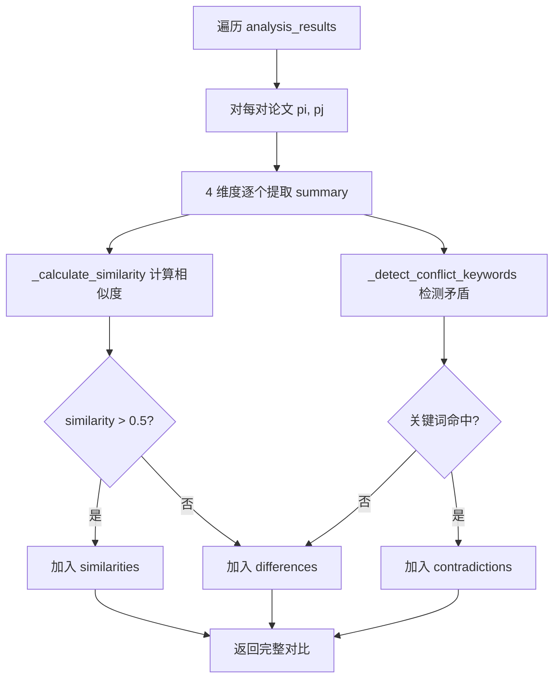

# Task34: ComparerAgent 对比员 Agent 核心逻辑

## 任务概述

| 项目 | 内容 |
|------|------|
| **版本** | v0.4 |
| **里程碑** | AM4：6-Agent协同与个性化引擎（Week 7-8，M4） |
| **功能编号** | F3.1.4, F3.1.7, F3.1.8 |
| **涉及层级** | python_ai_service |
| **优先级** | P0 |

## 需求描述

实现 ComparerAgent 对比员 Agent 核心逻辑，产出 `Veritas/ai-service/app/agents/comparer.py`。

ComparerAgent 是 6-Agent 协同工作流的**可选节点**（仅在 `requires_compare=True` 时激活），位于 Analyzer 之后、Generator 之前。它接收 AnalyzerAgent 输出的多篇论文 5 维度分析结果（`analysis_results`），通过 PromptManager 加载 `prompts/comparer.txt` 模板，调用 LLMService.generate() 进行**多论文对比与矛盾发现**，输出结构化对比矩阵 `{comparison_matrix, summary, contradictions, paper_count}`。

### 核心职责

1. **4 维度对比矩阵**: research_problem / core_method / main_experiments / core_conclusions
2. **5 类矛盾根因检测**: dataset_bias / metric_difference / condition_difference / assumption_difference / methodological_conflict
3. **客观呈现矛盾**: 不裁决、不偏袒双方（参考 multi-agent-coordination.md 立场冲突解决策略）
4. **防御性论文数校验**: < 2 篇返回空对比，> 5 篇截断

### 输出 Schema

```json
{
  "comparison_matrix": {
    "dimensions": ["research_problem", "core_method", "main_experiments", "core_conclusions"],
    "papers": ["arxiv_2024_001", "arxiv_2024_002", "arxiv_2024_003"],
    "similarities": [
      {"dimension": "core_method", "papers": ["id1", "id2"], "similarity": 0.85, "description": "都使用 Transformer 架构"}
    ],
    "differences": [
      {"dimension": "core_method", "papers": ["id1", "id3"], "description": "A 使用自注意力，C 使用交叉注意力"}
    ],
    "contradictions": [
      {
        "papers": ["id1", "id2"],
        "topic": "层数对性能的影响",
        "claim_a": "更多层更好",
        "claim_b": "层数存在最优值",
        "evidence_a": "...",
        "evidence_b": "...",
        "root_cause": "methodological_conflict",
        "resolution_suggestion": "数据集规模不同导致结论差异"
      }
    ]
  },
  "summary": "基于 3 篇论文对比...",
  "contradictions": [...],
  "paper_count": 3,
  "agent": "comparer"
}
```

## 影响范围

| 操作 | 文件路径 | 说明 |
|------|---------|------|
| 新增 | `Veritas/ai-service/app/agents/comparer.py` | ComparerAgent 核心逻辑 |

## 核心实现要求

### 类结构

```python
class ComparerAgent(BaseAgent):
    VALID_ROOT_CAUSES = {'dataset_bias', 'metric_difference', 'condition_difference',
                         'assumption_difference', 'methodological_conflict'}
    COMPARE_DIMENSIONS = ['research_problem', 'core_method',
                          'main_experiments', 'core_conclusions']
    MIN_PAPERS = 2
    MAX_PAPERS = 5
    CONFLICT_KEYWORDS = ['但是', '然而', '不同于', '相比之下', '相反',
                        'contradict', 'however', 'but', 'unlike', 'whereas', 'on the other hand']
    FALLBACK_NOTE = '论文未明确提及'
    AI_DISCLAIMER = '⚠️ 本对比由 AI 生成，仅供参考'

    def __init__(self, llm_service, prompt_manager, timeout=30,
                 llm_temperature=0.4, llm_max_tokens=3072,
                 min_papers_for_compare=2, max_papers_for_compare=5): ...
    def build_prompt(self, input_data, context) -> str: ...
    async def _run(self, prompt, input_data, context) -> dict: ...
    def _parse_comparison(self, llm_output, input_data) -> dict: ...
    def _rule_based_comparison(self, input_data) -> dict: ...
    def _extract_dimension_summary(self, result, dimension) -> str: ...
    def _calculate_similarity(self, text1, text2) -> float: ...
    def _detect_conflict_keywords(self, text1, text2) -> list: ...
    def _summarize_comparison(self, comparison_result) -> str: ...
    def _fallback_result(self, input_data) -> dict: ...
    def _summarize_result(self, result) -> str: ...
```

### _run 核心流程

```mermaid
graph TD
    A[接收 analysis_results] --> B{paper_count 校验}
    B -->|< 2| EMPTY[返回空对比 + 提示]
    B -->|> 5| TRUNCATE[截断到 5 篇 + warning]
    B -->|[2, 5]| C[progress=0.2 Building prompt]
    TRUNCATE --> C
    C --> D[build_prompt 渲染对比模板]
    D --> E[progress=0.5 Calling LLM]
    E --> F{llm_service.generate}
    F -->|成功| G[progress=0.8 Parsing]
    F -->|失败/超时| FB[fallback_result 规则对比]
    G --> H[_parse_comparison]
    H --> I{JSON 解析?}
    I -->|成功| J[验证 root_cause + 补全 paper_id]
    I -->|失败| K[_rule_based_comparison]
    J --> L[_summarize_comparison]
    K --> L
    L --> M[progress=1.0]
    M --> N[返回完整对比结果]
    FB --> O[返回降级结果 degraded=True]
    EMPTY --> P[返回空对比结构]
```

### 5 类矛盾根因映射

| root_cause | 适用场景 | 典型示例 |
|-----------|---------|---------|
| `dataset_bias` | 双方使用不同数据集 | "论文 A 在 ImageNet 上 F1 92%，论文 B 在 CIFAR-10 上 F1 88%" |
| `metric_difference` | 双方使用不同评估指标 | "A 用 BLEU 评估，B 用 ROUGE 评估" |
| `condition_difference` | 双方实验条件不同 | "A 在 GPU 集群训练，B 在单卡训练" |
| `assumption_difference` | 双方基于不同假设 | "A 假设数据独立同分布，B 假设数据存在时序依赖" |
| `methodological_conflict` | 双方方法论层面冲突 | "A 使用监督学习，B 使用强化学习"（兜底根因） |

### 规则降级 _rule_based_comparison 流程



## 测试覆盖

### 单元测试（pytest，25+ 用例）

| 测试名称 | 覆盖场景 |
|---------|---------|
| test_comparer_inherits_base_agent | 正常流程 |
| test_build_prompt_renders_template | 正常流程 |
| test_build_prompt_with_two_papers | 边界条件（最少 2 篇） |
| test_parse_comparison_valid_json | 正常流程 |
| test_parse_comparison_invalid_json | 异常流程 + 降级 |
| test_parse_comparison_invalid_root_cause | 边界条件 |
| test_parse_comparison_missing_paper_id | 边界条件 |
| test_rule_based_comparison_with_three_papers | 正常流程 |
| test_rule_based_comparison_detects_conflict_keywords | 正常流程 |
| test_extract_dimension_summary_dict/str/none | 正常流程 + 边界条件 |
| test_calculate_similarity_identical/completely_different | 边界条件 |
| test_detect_conflict_keywords_chinese/english | 正常流程 |
| test_summarize_comparison | 正常流程 |
| test_run_success_flow | 正常流程 |
| test_run_with_single_paper_returns_empty | 边界条件 |
| test_run_with_too_many_papers_truncates | 边界条件 |
| test_run_llm_failure_fallback | 异常流程 + 降级 |
| test_run_llm_empty_output_fallback | 异常流程 + 降级 |
| test_fallback_result_preserves_langgraph_flow | 降级 |
| test_ai_disclaimer_in_summary | 正常流程 |
| test_summarize_result | 正常流程 |

## 验证命令

```bash
# 1. 导入验证
cd /Users/achieve/Documents/AchiEVE_MacBook_Air/Veritas(求真)/Veritas/ai-service
python -c "from app.agents.comparer import ComparerAgent; print('Import OK')"

# 2. 单元测试
python -m pytest tests/test_comparer_agent.py -v

# 3. 全部 comparer 相关测试
python -m pytest tests/ -k comparer -v
```

## 验收标准

- [x] AC-001: ComparerAgent 继承 BaseAgent，name='comparer'
- [x] AC-002: _run 正常流程返回完整 {comparison_matrix, summary, contradictions, paper_count, agent}
- [x] AC-003: progress 从 0.2 → 0.5 → 0.8 → 1.0 渐变
- [x] AC-004: _parse_comparison JSON 解析失败降级 + 矛盾根因非法替换
- [x] AC-005: _rule_based_comparison 对 C(N,2) 个论文对生成对比
- [x] AC-006: 论文数 < 2 / > 5 边界校验
- [x] AC-007: LLM 失败时 _fallback_result 返回规则对比，LangGraph 不中断
- [x] AC-008: summary 末尾始终包含 AI 免责声明
- [x] AC-009: 输出字段全部 snake_case
- [x] AC-010: 不硬编码对比维度或矛盾根因
- [x] AC-011: ComparerAgent 不直接调用其他 Agent
- [x] AC-012: ComparerAgent 不包含综述生成逻辑
- [x] AC-013: 日志不输出完整 LLM Prompt/输出
- [x] AC-014: 单元测试覆盖正常/异常/边界
- [x] AC-015: 未修改任何已有文件

## 关键设计决策

### 1. 为什么 ComparerAgent 是可选节点？

不是所有分析都需要对比：
- **单论文分析** (analysis_type='paper_analysis'): 1 篇论文，无对比对象
- **多论文对比** (analysis_type='compare' 或 analysis_type='report' + 2+ papers): 需要激活 Comparer
- 由 CoordinatorAgent 输出的 `requires_compare` 标记控制（LangGraph 条件边）

### 2. 为什么矛盾检测要分 5 类根因？

**根因分析的价值**远大于**单纯指出矛盾**：
- `dataset_bias`: 数据集不同导致结论不可比 → 读者知道"无法直接比较"
- `metric_difference`: 评估指标不同 → 读者知道"换算后可能一致"
- `condition_difference`: 实验条件不同 → 读者知道"实际效果可能一致"
- `assumption_difference`: 假设不同 → 读者知道"理论框架不一致"
- `methodological_conflict`: 方法论根本冲突 → 读者知道"两者不兼容"

这样下游 Generator 生成综述时可对症下药（如矛盾章节分别说明根因 + 给出调和建议）。

### 3. 为什么规则降级要支持 C(N,2) 两两对比？

LLM 失败时仍需输出有效对比结构：
- 简化 Jaccard 相似度（关键词重叠率）作为相似性度量
- 矛盾关键词匹配作为简单矛盾检测
- 不需要 LLM 也能给出"这两篇论文在 X 维度相似/不同"的结论
- Generator 可基于此生成简化版"方法对比"章节

### 4. 为什么 llm_temperature=0.4 而非 Generator 的 0.7？

- **Comparer (0.4)**: 对比任务需要**结构化 JSON 输出**（4 维度矩阵），温度不能太高
- **Generator (0.7)**: 综述生成需要**创造性和多样性**
- **Analyzer (0.3)**: 提取任务需要**高度确定性**
- 这是有意的差异化设计，符合各自职责

## 上下游关系

```
AnalyzerAgent
       ↓ output: analysis_results (5维度 × N篇)
LangGraph 条件边 (Coordinator.requires_compare=True)
       ↓
ComparerAgent.execute()
       ↓ output: {comparison_matrix, summary, contradictions, paper_count}
LangGraph 状态机
       ↓
GeneratorAgent (消费 compare_result 用于综述'方法对比'章节)
```

## 参考文档

- [AI服务模块系统架构文档 §5.4.4](file:///Users/achieve/Documents/AchiEVE_MacBook_Air/Veritas(求真)/docs/ai-service/AI服务模块系统架构文档.md)
- [AI服务模块项目里程碑文档 §6](file:///Users/achieve/Documents/AchiEVE_MacBook_Air/Veritas(求真)/docs/ai-service/AI服务模块项目里程碑文档.md)
- [架构决策记录 ADR-002](file:///Users/achieve/Documents/AchiEVE_MacBook_Air/Veritas(求真)/docs/架构决策记录(ADR).md)
- [AGENTS.md §3.1-3.3](file:///Users/achieve/Documents/AchiEVE_MacBook_Air/Veritas(求真)/AGENTS.md)
- [Prompt Templates §Template 4 Comparer Agent](file:///Users/achieve/Documents/AchiEVE_MacBook_Air/Veritas(求真)/.trae/skills/python-agent-prompt-generator/prompt-templates.md)
- [Multi-Agent Coordination 立场冲突解决](file:///Users/achieve/Documents/AchiEVE_MacBook_Air/Veritas(求真)/.trae/skills/python-agent-prompt-generator/multi-agent-coordination.md)

## 下一步建议

1. **task35 紧随其后**: 升级 `prompts/comparer.txt` 为 v2 标准模板（4 维度对比矩阵 + 5 类根因检测 + Few-shot 示例 + Self-Check）
2. **task36**: 升级 graph.py 为 6-Agent 完整工作流（含 should_compare 条件边）
3. **task37**: Reviewer Agent 核心逻辑 — 5 维度审核 + 1 次重试
4. **task38**: M4 集成测试 — 6-Agent 工作流 + 个性化差异度验证
5. **未来增强** (AM5+):
   - 矛盾根因扩展（增加 reproducibility_issue / theoretical_framework 等）
   - 引入知识图谱增强（Neo4j 方法演化链）
   - 矛盾发现结合 Cross-Encoder 重排序
