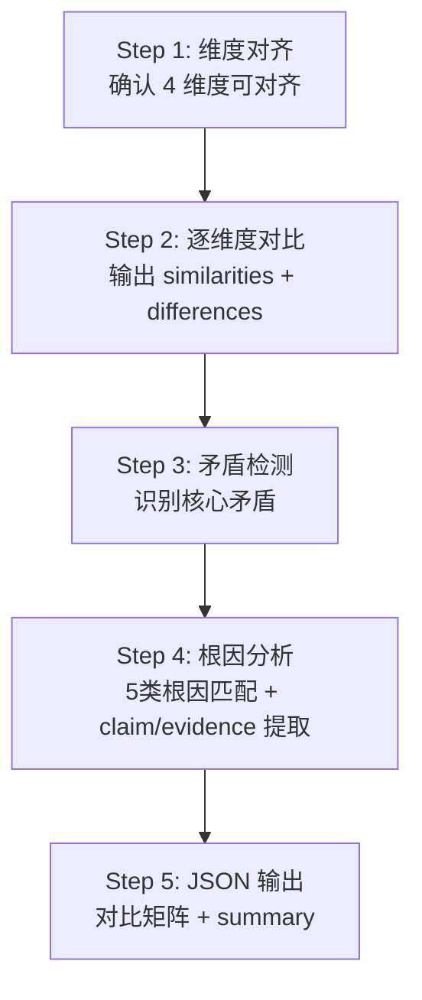

# Task35: Comparer Prompt 模板与矛盾检测基础

## 任务概述

| 项目 | 内容 |
|------|------|
| **版本** | v0.4 |
| **里程碑** | AM4：6-Agent协同与个性化引擎（Week 7-8，M4） |
| **功能编号** | F3.1.4, F3.3.4 |
| **涉及层级** | python_ai_service |
| **优先级** | P0 |

## 需求描述

升级对比员 Prompt 模板 `prompts/comparer.txt`，产出符合 v2 标准的对比 Prompt。本任务是 task34 ComparerAgent 的配套 Prompt 工程任务。

### 核心目标

1. **重写 `prompts/comparer.txt`** 为五层固定结构（System/Task/Memory/Tool/Execution）
2. **定义对比矩阵 JSON Schema**（4 维度 + similarities + differences + contradictions + 5 类根因）
3. **内嵌 1 个 Few-shot 示例**（multi_paper_comparison 模式，含真实矛盾根因分析）
4. **定义 Chain-of-Thought 推理步骤**（Step 1-5：维度对齐 → 逐维度对比 → 矛盾检测 → 根因分析 → JSON 输出）
5. **矛盾根因判定决策表**（5 类根因：dataset_bias / metric_difference / condition_difference / assumption_difference / methodological_conflict）
6. **客观性原则**（不裁决、不偏袒双方）
7. **Self-Check 清单**（5 项检查）

### 关键约束

- 模板必须使用 **string.Template 兼容的 `$variable` 语法**（与现有 PromptManager 兼容，不引入 Jinja2 依赖）
- LLM 失败时由 task34 的 `_rule_based_comparison` 降级（C(N,2) 两两对比 + 关键词矛盾检测），**模板不需包含降级逻辑**

## 影响范围

| 操作 | 文件路径 | 说明 |
|------|---------|------|
| 修改 | `Veritas/ai-service/prompts/comparer.txt` | 对比 Prompt 模板从 v1 升级到 v2 |

## 模板结构

```mermaid
graph TD
    A[System Context<br/>对比员身份 + 客观性原则 + 失败策略] --> B[Task Context<br/>3个变量 + 4维度 + 5根因]
    B --> C[Execution Protocol<br/>5步CoT + 矛盾根因决策表 + JSON Schema]
    C --> D[Few-shot Example<br/>multi_paper_comparison 模式]
    D --> E[Self-Check Checklist<br/>5项强制检查]
    E --> F[JSON 输出<br/>{comparison_matrix, summary}]
```

## 4 维度对比矩阵

| 维度 | 对比内容 | 典型字段 |
|------|---------|---------|
| `research_problem` | 研究问题是否相同/互补/无关 | research_problem.summary |
| `core_method` | 方法是否类似/改进/完全不同 | core_method.summary |
| `main_experiments` | 实验设计/数据集/指标是否可比 | main_experiments.summary |
| `core_conclusions` | 结论是否一致/互补/矛盾 | core_conclusions.summary |

## 5 类矛盾根因

| root_cause | 适用场景 | 典型示例 |
|-----------|---------|---------|
| `dataset_bias` | 双方使用不同数据集 | "A 在 ImageNet 测试集 F1=92%，B 在 CIFAR-10 测试集 F1=88%" |
| `metric_difference` | 双方使用不同评估指标 | "A 用 BLEU 评估，B 用 ROUGE 评估" |
| `condition_difference` | 双方实验条件不同 | "A 在 GPU 集群训练，B 在单卡训练" |
| `assumption_difference` | 双方基于不同假设 | "A 假设数据独立同分布，B 假设数据存在时序依赖" |
| `methodological_conflict` | 双方方法论根本冲突 | "A 使用监督学习，B 使用强化学习"（兜底根因） |

## 客观性原则（4 项强制要求）

1. **不裁决矛盾**：客观呈现双方 claim/evidence，不判断谁对谁错
2. **不偏袒任何一方**：避免"显然"/"毫无疑问"/"错误的"/"正确的"等价值判断
3. **矛盾根因标注**：标注矛盾可能由数据集/指标/条件/假设/方法论差异导致
4. **客观调和建议**：resolution_suggestion 须是"建议进一步验证"等客观描述

## 5 步 Chain-of-Thought



## 对比矩阵 JSON Schema

```json
{
  "comparison_matrix": {
    "dimensions": ["research_problem", "core_method", "main_experiments", "core_conclusions"],
    "papers": ["paper_id_1", "paper_id_2"],
    "similarities": [
      {"dimension": "core_method", "papers": ["id1", "id2"], "similarity": 0.85, "description": "都使用 Transformer 架构"}
    ],
    "differences": [
      {"dimension": "core_method", "papers": ["id1", "id3"], "description": "A 使用自注意力，C 使用交叉注意力"}
    ],
    "contradictions": [
      {
        "papers": ["id1", "id2"],
        "topic": "层数对性能的影响",
        "claim_a": "更多层更好",
        "claim_b": "层数存在最优值",
        "evidence_a": "论文 A 报告：20 层 > 10 层",
        "evidence_b": "论文 B 报告：12 层最优",
        "root_cause": "methodological_conflict",
        "resolution_suggestion": "数据集规模不同导致结论差异，建议在相同数据集上重新对比"
      }
    ]
  },
  "summary": "基于 3 篇论文对比...",
  "contradictions": [...]
}
```

## Self-Check 清单（5 项）

1. **4 维度是否完整覆盖？**（dimensions 必须含 4 个固定值）
2. **similarities / differences / contradictions 数组是否对齐 4 维度结构？**
3. **每条矛盾是否包含完整的 8 字段**（papers / topic / claim_a / claim_b / evidence_a / evidence_b / root_cause / resolution_suggestion）？
4. **root_cause 是否在 5 类枚举中**（dataset_bias / metric_difference / condition_difference / assumption_difference / methodological_conflict）？
5. **summary 末尾是否包含 AI 免责声明**（"⚠️ 本对比由 AI 生成，仅供参考"）？

## 测试覆盖

### 单元测试（pytest，18 个用例）

| 测试名称 | 覆盖场景 |
|---------|---------|
| test_template_renders_with_all_variables | 正常流程 |
| test_template_renders_with_two_papers | 边界条件（最少 2 篇） |
| test_template_renders_with_five_papers | 边界条件（最多 5 篇） |
| test_template_contains_system_context | 正常流程 |
| test_template_contains_task_context | 正常流程 |
| test_template_contains_execution_protocol_5_steps | 正常流程 |
| test_template_contains_few_shot_example | 正常流程 |
| test_template_contains_self_check_5_items | 正常流程 |
| test_template_contains_root_cause_decision_table | 正常流程 |
| test_template_contains_objectivity_principle | 正常流程 |
| test_template_contains_comparison_matrix_schema | 正常流程 |
| test_template_no_sensitive_info | 正常流程 |
| test_template_token_count_within_budget | 边界条件 |
| test_template_no_jinja2_syntax | 正常流程 |
| test_template_no_degradation_logic | 正常流程 |
| test_template_no_review_generation | 正常流程 |
| test_template_snake_case_naming | 正常流程 |
| test_template_contains_ai_disclaimer | 正常流程 |

## 验证命令

```bash
# 1. 加载验证
cd /Users/achieve/Documents/AchiEVE_MacBook_Air/Veritas(求真)/Veritas/ai-service
python -c "from app.services.prompt_manager import PromptManager; pm = PromptManager('prompts'); import asyncio; asyncio.run(pm.load_templates()); print(pm.list_templates())"

# 2. 渲染验证
python -c "from app.services.prompt_manager import PromptManager; pm = PromptManager('prompts'); import asyncio; asyncio.run(pm.load_templates()); prompt = pm.get_prompt('comparer', analysis_data='test', user_profile='test', paper_count='3'); print(f'Length: {len(prompt)} chars')"

# 3. 单元测试
python -m pytest tests/test_prompt_manager.py -v -k comparer

# 4. 敏感信息检查
grep -E '(api[_-]?key|password|secret|token)\s*[:=]\s*["\047][^"\047]+["\047]' \
  /Users/achieve/Documents/AchiEVE_MacBook_Air/Veritas(求真)/Veritas/ai-service/prompts/comparer.txt \
  || echo 'No hardcoded secrets found'
```

## 验收标准

- [x] AC-001: v2 模板包含五层固定结构
- [x] AC-002: System Context 明确身份/职责/客观性原则
- [x] AC-003: Task Context 注入 3 个变量
- [x] AC-004: 4 维度 + 5 根因显式定义
- [x] AC-005: 5 步 CoT + 矛盾根因决策表
- [x] AC-006: Few-shot 仅 1 个 + 真实矛盾根因
- [x] AC-007: Self-Check 5 项检查
- [x] AC-008: 客观性原则 4 项要求
- [x] AC-009: 对比矩阵 Schema 完整
- [x] AC-010: 仅 $variable 语法
- [x] AC-011: 不包含降级逻辑
- [x] AC-012: 不包含综述生成指令
- [x] AC-013: 无硬编码敏感信息
- [x] AC-014: Token 2500-4000
- [x] AC-015: PromptManager 正确渲染
- [x] AC-016: 未修改其他模板
- [x] AC-017: 未修改 PromptManager

## 关键设计决策

### 1. 为什么矛盾根因要分 5 类？

**根因分析的价值**远大于**单纯指出矛盾**：

| root_cause | 读者反应 | 调和建议 |
|-----------|---------|---------|
| `dataset_bias` | "数据集不同导致结论不可比" | 提示需在相同数据集上重新对比 |
| `metric_difference` | "评估指标不同 → 换算后可能一致" | 提示换算或对齐评估指标 |
| `condition_difference` | "实验条件不同 → 实际效果可能一致" | 提示在相同条件下重新实验 |
| `assumption_difference` | "理论框架不一致" | 提示统一理论框架 |
| `methodological_conflict` | "两者不兼容" | 提示场景化选用 |

这样下游 Generator 生成综述时可对症下药（如矛盾章节分别说明根因 + 给出调和建议）。

### 2. 为什么客观性原则如此重要？

LLM 在处理矛盾时容易"和稀泥"或"站队"：
- ❌ "论文 A 的方法更优，应作为推荐方案"（带价值判断）
- ❌ "论文 B 显然是错误的"（偏袒一方）
- ❌ "综合来看，A 和 B 各有优劣"（模糊化处理）

客观性原则强制 LLM：
- ✅ "双方 claim 如下：X vs Y，evidence 分别为..."
- ✅ "可能根因为 methodological_conflict / condition_difference"
- ✅ "建议进一步在统一条件下验证"

这是科研论文对比的**学术伦理底线**。

### 3. 为什么 4 维度是固定的？

| 维度 | 排除其他可能 |
|------|-------------|
| `research_problem` | 不对比"研究背景"（背景可能不同但问题相同） |
| `core_method` | 不对比"实现细节"（细节差异不影响核心结论） |
| `main_experiments` | 不对比"具体数值"（数值受条件影响） |
| `core_conclusions` | 不对比"未来工作"（未来工作不构成矛盾） |

固定 4 维度让 LLM 输出**结构化对比**，避免自由发挥。

### 4. 为什么仅 1 个 Few-shot 示例？

- **Token 成本**：Few-shot 1 个 ≈ 1500 Token，2 个 ≈ 3000 Token
- **示例质量 > 数量**：1 个高质量示例（含真实矛盾根因） > 3 个浅显示例
- **泛化能力**：LLM 通过 1 个示例学会"如何输出完整 8 字段矛盾 + 根因分析"

## 上下游关系

```
AnalyzerAgent
       ↓ output: analysis_results (5维度 × N篇)
ComparerAgent.build_prompt(input_data, context)
       ↓ 调用 prompt_manager.get_prompt('comparer', analysis_data=, user_profile=, paper_count=)
PromptManager (string.Template.safe_substitute)
       ↓ 渲染
prompts/comparer.txt (v2 模板)
       ↓ 输出
完整 Prompt 字符串
       ↓ 传入
LLMService.generate(prompt)
       ↓ LLM 推理
{comparison_matrix, summary, contradictions}
       ↓ 解析
ComparerAgent._parse_comparison
       ↓ 返回
LangGraph 状态机
       ↓
GeneratorAgent (消费 compare_result 用于综述'方法对比'章节)
```

## 参考文档

- [.trae/skills/python-agent-prompt-generator/prompt-templates.md §Template 4](file:///Users/achieve/Documents/AchiEVE_MacBook_Air/Veritas(求真)/.trae/skills/python-agent-prompt-generator/prompt-templates.md)
- [.trae/skills/python-agent-prompt-generator/multi-agent-coordination.md §立场冲突](file:///Users/achieve/Documents/AchiEVE_MacBook_Air/Veritas(求真)/.trae/skills/python-agent-prompt-generator/multi-agent-coordination.md)
- [AI服务模块系统架构文档 §12](file:///Users/achieve/Documents/AchiEVE_MacBook_Air/Veritas(求真)/docs/ai-service/AI服务模块系统架构文档.md)
- [Prompts/Analyzer.txt（参考模板）](file:///Users/achieve/Documents/AchiEVE_MacBook_Air/Veritas(求真)/Veritas/ai-service/prompts/analyzer.txt)
- [Prompts/Coordinator.txt（v2 参考模板）](file:///Users/achieve/Documents/AchiEVE_MacBook_Air/Veritas(求真)/Veritas/ai-service/prompts/coordinator.txt)

## 下一步建议

1. **task36 紧随其后**: 升级 `graph.py` 为 6-Agent 完整工作流（含 should_compare 条件边）
2. **task37**: Reviewer Agent 核心逻辑 — 5 维度审核 + 1 次重试（消费 Generator 输出）
3. **task38**: M4 集成测试 — 6-Agent 工作流 + 个性化差异度验证
4. **未来增强** (AM5+):
   - 矛盾根因扩展为 7-8 类（增加 `reproducibility_issue` / `theoretical_framework_difference`）
   - 引入知识图谱增强（Neo4j 方法演化链）
   - Few-shot 示例扩展为 2-3 个（覆盖单论文对比 / 综述对比模式）
   - 矛盾发现结合 Cross-Encoder 重排序（提高矛盾检测准确率）
