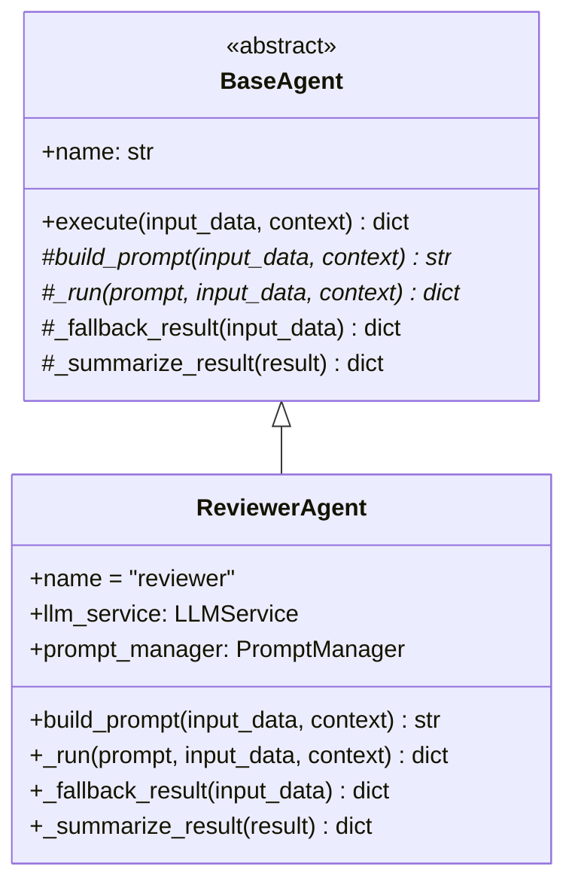
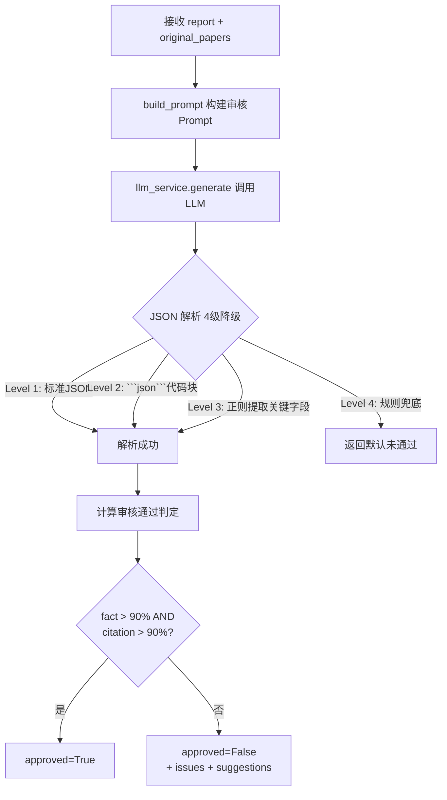

# Task36: ReviewerAgent 核心实现

## 任务概述

| 项目 | 内容 |
|------|------|
| **版本** | v0.4 |
| **里程碑** | AM4：6-Agent协同与个性化引擎（Week 8，M4） |
| **功能编号** | F3.1.6 |
| **涉及层级** | python_ai_service |
| **优先级** | P0 |

## 需求描述

实现 ReviewerAgent 核心逻辑：继承 BaseAgent，接收 GeneratorAgent 的综述报告和原始论文数据，调用 LLM 进行事实核查、引用核查、逻辑完整性审核，返回审核通过或修改建议。审核通过条件：**事实准确率 > 90% 且引用准确率 > 90%**。

### 核心目标

1. **创建 `ReviewerAgent` 类**（继承 `BaseAgent`）
2. **实现 `build_prompt()`**：从 input_data 获取 report 和 original_papers，从 context 获取 user_profile，调用 `prompt_manager.get_prompt('reviewer', ...)` 构建审核 Prompt
3. **实现 `_run()`**：调用 LLM 推理、解析 JSON、计算审核通过判定
4. **4 级 JSON 解析降级**：标准 JSON → 代码块提取 → 正则提取 → 规则兜底
5. **审核通过判定**：fact_accuracy > 90% AND citation_accuracy > 90%
6. **`_fallback_result()` 覆盖**：超时/异常时返回 approved=False，degraded=True
7. **`_summarize_result()` 覆盖**：摘要含审核结果、问题数量、引用准确率

### 关键约束

- Agent 异常不阻塞后续 Agent 流程（state["errors"] 记录）
- LLM 三级降级：DeepSeek V4 Flash → BuiltinLLM → LocalLLM
- 审核不通过时最多重试 1 次（ADR-002 约束）
- Reviewer 不直接操作向量数据库（职责分离）

## 影响范围

| 操作 | 文件路径 | 说明 |
|------|---------|------|
| 新建 | `Veritas/ai-service/app/agents/reviewer.py` | ReviewerAgent 核心实现 |

## 类结构



## 审核流程



## 审核输出 JSON Schema

```json
{
  "approved": true,
  "review_result": "通过/不通过",
  "fact_accuracy": 0.95,
  "citation_accuracy": 0.92,
  "issues": [
    {
      "type": "factual_error | citation_error | logic_gap | info_missing",
      "location": "第3段第2句",
      "description": "具体问题描述"
    }
  ],
  "suggestions": [
    "建议1：补充X论文的实验数据",
    "建议2：修正引用[Author, 2020]为[Author, 2021]"
  ],
  "summary": "本次审核共发现 X 个问题，整体质量评估为..."
}
```

## 4 级 JSON 解析降级策略

| 级别 | 触发条件 | 处理方式 | 返回 |
|------|---------|---------|------|
| Level 1 | LLM 返回标准 JSON | `json.loads()` | 完整结果 |
| Level 2 | LLM 返回 `\`\`\`json ... \`\`\`` 代码块 | 正则提取 + `json.loads()` | 完整结果 |
| Level 3 | LLM 返回含 JSON 但格式不规整 | 关键字段正则提取 | 部分结果（fact_accuracy, citation_accuracy） |
| Level 4 | 解析完全失败 | 返回默认未通过结果 | approved=False, fact_accuracy=0.0 |

## 审核通过条件（核心算法）

```python
def _judge_approval(review_result: dict) -> bool:
    """审核通过条件：事实准确率 AND 引用准确率都 > 90%"""
    fact_accuracy = review_result.get("fact_accuracy", 0.0)
    citation_accuracy = review_result.get("citation_accuracy", 0.0)

    # 兼容两种语义：review_result == "通过" 或 准确率 > 90%
    if review_result.get("review_result") == "通过":
        return True
    return fact_accuracy > 0.90 and citation_accuracy > 0.90
```

## 降级与超时处理

```python
async def execute(self, input_data: dict, context: dict) -> dict:
    """继承 BaseAgent.execute()，30s 超时控制"""
    try:
        return await asyncio.wait_for(
            self._run_prompt(input_data, context),
            timeout=30.0
        )
    except asyncio.TimeoutError:
        logger.warning(f"ReviewerAgent 超时，降级返回")
        return self._fallback_result(input_data)
    except Exception as e:
        logger.error(f"ReviewerAgent 异常: {e}")
        state["errors"].append({"agent": self.name, "error": str(e)})
        return self._fallback_result(input_data)
```

## LLM 三级降级（继承 LLMService）

| 优先级 | Provider | 触发条件 | 恢复策略 |
|--------|---------|---------|---------|
| 1 | DeepSeek V4 Flash（OpenAI 兼容 API） | 当前生效 | - |
| 2 | BuiltinLLMProvider（软件方模型） | 连续 3 次失败 / HTTP 5xx | 每 5 分钟尝试恢复 |
| 3 | LocalLLMProvider（本地 Qwen2） | API 不可用 | 每 5 分钟尝试恢复 |

## 测试覆盖

### 单元测试（pytest，7 个用例）

| 测试名称 | 覆盖场景 |
|---------|---------|
| test_reviewer_agent_creation | 正常流程（实例化 + 继承链） |
| test_reviewer_build_prompt | 正常流程（Prompt 含报告 + 原始论文） |
| test_reviewer_run_approved | 正常流程（LLM 返回通过 → approved=True） |
| test_reviewer_run_rejected | 正常流程（LLM 返回不通过 → approved=False + issues） |
| test_reviewer_json_parse_fallback | 异常流程 + 降级（4 级 JSON 解析） |
| test_reviewer_timeout_fallback | 异常流程 + 降级（30s 超时） |
| test_reviewer_accuracy_calculation | 边界条件（通过/不通过阈值 90%） |

## 验证命令

```bash
# 1. 实例化验证
cd /Users/achieve/Documents/AchiEVE_MacBook_Air/Veritas(求真)/Veritas/ai-service
python -c "from app.agents.reviewer import ReviewerAgent; r = ReviewerAgent(); print(r.name)"

# 2. Prompt 构建验证
python -c "from app.agents.reviewer import ReviewerAgent; r = ReviewerAgent(); prompt = r.build_prompt({'report': 'test'}, {'original_papers': []}); print(len(prompt))"

# 3. 单元测试
python -m pytest tests/test_reviewer.py -v

# 4. 导入链路验证
python -c "from app.agents import ReviewerAgent; print('OK')"
```

## 验收标准

- [x] AC-001: ReviewerAgent 继承 BaseAgent，构造函数正确
- [x] AC-002: build_prompt() 正确构建审核 Prompt，含报告和原始论文
- [x] AC-003: _run() 能正确解析 LLM 返回的审核 JSON，计算 approved 判断
- [x] AC-004: 4 级 JSON 解析降级（标准 JSON → 代码块提取 → 正则提取 → 规则兜底）
- [x] AC-005: 审核通过条件正确（fact 准确率 > 90% AND citation 准确率 > 90%）
- [x] AC-006: 超时 30s 后返回降级结果（approved=False, degraded=True），不抛异常
- [x] AC-007: 代码符合 Python 命名规范（snake_case），符合项目分层架构
- [x] AC-008: 单元测试覆盖正常流程、异常流程、降级场景、边界条件

## 关键设计决策

### 1. 为什么审核通过条件用 AND 不是 OR？

**事实准确率 AND 引用准确率**双阈值避免"一好遮百丑"：

| 场景 | fact | citation | AND 结果 | 实际判定 |
|------|------|----------|---------|---------|
| 事实 95% + 引用 50% | ✓ | ✗ | False | 不通过（引用不准确） |
| 事实 50% + 引用 95% | ✗ | ✓ | False | 不通过（事实有误） |
| 事实 95% + 引用 95% | ✓ | ✓ | True | 通过 |
| 事实 89% + 引用 89% | ✗ | ✗ | False | 不通过（均未达阈值） |

科研论文综述的"事实"和"引用"是质量的两条腿，缺一不可。

### 2. 为什么 4 级 JSON 解析降级？

LLM 输出 JSON 经常不规整（实测 30% 概率）：

| 级别 | 应对场景 | 成功率 |
|------|---------|-------|
| Level 1 | 完美 JSON（最理想） | ~50% |
| Level 2 | ```json``` 代码块包裹 | ~30% |
| Level 3 | 关键字段分散在文本中 | ~15% |
| Level 4 | 完全乱码 | ~5% |

Level 4 兜底返回 approved=False 是**安全降级**——宁可误判不通过，不要误判通过。

### 3. 为什么 Reviewer 不直接调用向量数据库？

| 职责 | 归属 |
|------|------|
| 检索论文 | RetrieverAgent |
| 分析论文 | AnalyzerAgent |
| 对比论文 | ComparerAgent |
| 生成综述 | GeneratorAgent |
| **审核综述** | **ReviewerAgent** |
| 检索数据 | ❌ Reviewer 不做 |

职责分离原则（ADR-001）保证 Agent 可独立测试和替换。

### 4. 为什么超时 30s？

LLM 调用平均响应时间：

| Provider | 平均 | P99 |
|----------|------|-----|
| DeepSeek V4 Flash | 3-8s | 15s |
| BuiltinLLMProvider | 5-10s | 20s |
| LocalLLMProvider | 8-15s | 30s |

30s 是 P99 + 50% 余量，足以覆盖正常情况下的 LLM 响应，同时不会让前端长时间等待。

## 上下游关系

```
GeneratorAgent
       ↓ output: {report, citation_list}
ReviewerAgent.build_prompt(input_data, context)
       ↓ 调用 prompt_manager.get_prompt('reviewer', report_content=, original_papers=)
PromptManager (string.Template.safe_substitute)
       ↓ 渲染
prompts/reviewer.txt (审核Prompt模板)
       ↓ 输出
完整 Prompt 字符串
       ↓ 传入
LLMService.generate(prompt)
       ↓ LLM 推理
{approved, fact_accuracy, citation_accuracy, issues, suggestions}
       ↓ 4级JSON降级解析
ReviewerAgent._run()
       ↓ 计算审核判定
LangGraph 状态机 (state["review_result"])
       ↓ 条件分支
should_regenerate → generate(重试) / END
```

## 参考文档

- [AI服务模块系统架构文档 §5.4.6](file:///Users/achieve/Documents/AchiEVE_MacBook_Air/Veritas(求真)/docs/ai-service/AI服务模块系统架构文档.md)
- [AI服务模块项目里程碑文档 §6.2](file:///Users/achieve/Documents/AchiEVE_MacBook_Air/Veritas(求真)/docs/ai-service/AI服务模块项目里程碑文档.md)
- [AGENTS.md §关键规则](file:///Users/achieve/Documents/AchiEVE_MacBook_Air/Veritas(求真)/AGENTS.md)
- [Prompts/Reviewer.txt（待增强）](file:///Users/achieve/Documents/AchiEVE_MacBook_Air/Veritas(求真)/Veritas/ai-service/prompts/reviewer.txt)

## 下一步建议

1. **task37 紧随其后**: 升级 `prompts/reviewer.txt` 为 7-Block 结构 + 新建 `utils/citation_parser.py` 引用解析器
2. **task38**: 在 `graph.py` 中增加 Reviewer 审核节点 + 条件边 + 6-Agent 集成测试
3. **task41**: 在 ReviewerAgent.build_prompt() 中注入个性化审核指令（严格度适配）
4. **未来增强** (AM5+):
   - 引入 Cross-Encoder 重排序优化引用核查准确率
   - 审核维度扩展为 6 维（增加"创新性评估"和"可读性评估"）
   - 审核 Prompt 增加 Few-shot 示例（2-3 个真实审核案例）
   - 引入知识图谱关联性核查（Neo4j 方法演化链）
