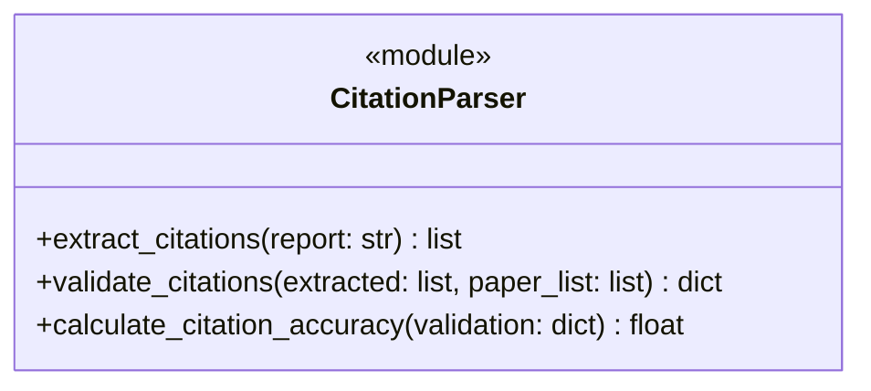

# Task37: Reviewer Prompt 模板增强 + 引用解析器

## 任务概述

| 项目 | 内容 |
|------|------|
| **版本** | v0.4 |
| **里程碑** | AM4：6-Agent协同与个性化引擎（Week 8，M4） |
| **功能编号** | F3.1.6, F3.4.1 |
| **涉及层级** | python_ai_service |
| **优先级** | P0 |

## 需求描述

增强 `prompts/reviewer.txt` 审核 Prompt 模板，使其符合项目 Prompt 工程规范（**7-Block 结构**）；新建 `utils/citation_parser.py` 引用解析器，能提取综述中的引用标注并计算引用准确率。本任务是 task36 ReviewerAgent 的配套 Prompt 工程任务。

### 核心目标

1. **重构 `prompts/reviewer.txt` 为 7-Block 结构**（Role/Task/Input/Review Chain/Output Schema/Constraint/Fallback）
2. **统一 `${variable}` 语法**（与 PromptManager 的 string.Template 预处理兼容）
3. **增强引用校验规则**：准确性、完整性、一致性三类
4. **增加 4 类错误分类标准**：factual_error / citation_error / logic_gap / info_missing
5. **增加重试上下文**（`${retry_context}` 变量）
6. **新建 `utils/citation_parser.py`**：独立工具模块，不依赖 Agent 框架

### 关键约束

- 模板必须使用 **`${variable}` 语法**（PromptManager 通过 `re.sub(r'\$\{(\w+)\}', r'$\1', template)` 预处理）
- 引用解析器仅依赖标准库 `re` 和 `typing`，可独立导入
- 不修改其他 Prompt 模板（generator.txt 等保持不变）

## 影响范围

| 操作 | 文件路径 | 说明 |
|------|---------|------|
| 修改 | `Veritas/ai-service/prompts/reviewer.txt` | 审核 Prompt 模板从 v1 升级到 7-Block 结构 |
| 新建 | `Veritas/ai-service/app/utils/citation_parser.py` | 引用解析器（独立工具模块） |

## 7-Block 模板结构

```mermaid
graph TD
    A[Role Block<br/>学术编辑身份定义] --> B[Task Block<br/>4维审核任务说明]
    B --> C[Input Block<br/>${report_content}, ${original_papers}]
    C --> D[Review Chain<br/>4步审核推理]
    D --> E[Output Schema<br/>JSON Schema定义]
    E --> F[Constraint Block<br/>4类错误分类 + 引用校验]
    F --> G[Fallback Block<br/>降级说明]
    G --> H[完整Prompt字符串]
```

| Block | 内容 | 变量 |
|-------|------|------|
| Role | 学术编辑身份 + 职责范围 | - |
| Task | 事实核查 + 引用核查 + 逻辑完整性 + 内容准确性 | - |
| Input | 报告 + 原始论文 + 重试上下文 | `${report_content}`, `${original_papers}`, `${retry_context}` |
| Review Chain | Step 1-4 审核推理 | - |
| Output Schema | JSON 输出格式定义 | - |
| Constraint | 4 类错误分类 + 3 类引用校验规则 | - |
| Fallback | 解析失败时降级 | - |

## 4 类错误分类

| error_type | 判定标准 | 示例 |
|-----------|---------|------|
| `factual_error` | 报告中陈述与论文原文不一致 | "论文 A 报告 F1=92%，但综述中写为 F1=88%" |
| `citation_error` | 引用标注与论文不匹配或引用格式错误 | "[Smith, 2020] 应为 [Smith, 2021]" |
| `logic_gap` | 推理链断裂，前后文不连贯 | "第2段结论'X'与第1段前提'Y'无逻辑关联" |
| `info_missing` | 重要信息未引用或遗漏关键论文 | "未引用论文 C（2023）关于鲁棒性的实验" |

## 3 类引用校验规则

| 规则类型 | 校验内容 | 通过条件 |
|---------|---------|---------|
| **准确性校验** | 引用是否对应正确论文 | 作者+年份匹配论文列表 |
| **完整性校验** | 是否遗漏重要论文 | 引用数 ≥ 论文列表 80% |
| **一致性校验** | 同一论文引用是否一致 | 同一论文的作者+年份字符串一致 |

## 引用解析器设计



### 函数签名

```python
def extract_citations(report: str) -> list[dict]:
    """
    提取综述中的引用标注
    支持两种格式：[作者, 年份] 和 (Author, Year)
    返回: [{"author": str, "year": int, "raw": str, "position": int}, ...]
    """

def validate_citations(
    extracted_citations: list[dict],
    paper_list: list[dict]
) -> dict:
    """
    比对提取的引用与论文列表
    返回: {
        "matched": [{"citation": ..., "paper_id": ...}],
        "unmatched": [...],  # 引用但论文列表中无
        "missing": [...],    # 论文列表中有但未引用
        "total_citations": int,
        "matched_count": int
    }
    """

def calculate_citation_accuracy(validation_result: dict) -> float:
    """
    计算引用准确率 = 准确引用数 / 总引用数
    返回: 0.0-1.0
    """
```

### 引用格式正则

| 格式 | 正则模式 | 示例 |
|------|---------|------|
| 中文方括号 | `\[([\u4e00-\u9fa5A-Za-z\s,]+),\s*(\d{4})\]` | `[张三, 2023]` |
| 英文方括号 | `\[([A-Z][a-z]+(?:\s+et\s+al\.)?),\s*(\d{4})\]` | `[Smith, 2020]` / `[Smith et al., 2020]` |
| 英文圆括号 | `\(([A-Z][a-z]+(?:\s+et\s+al\.)?),\s*(\d{4})\)` | `(Smith, 2020)` / `(Smith et al., 2020)` |

## 审核 Prompt 模板示例（7-Block 结构）

```text
# Role Block
你是一位资深学术编辑，负责审核科研文献综述的质量。
你的职责是确保综述的事实准确、引用规范、逻辑完整。

# Task Block
请从以下 4 个维度审核报告：
1. 事实核查（fact_check）：报告中的事实陈述与原始论文是否一致
2. 引用核查（citation_check）：引用标注是否准确、完整、一致
3. 逻辑完整性（logic_check）：推理链是否连贯
4. 内容准确性（content_check）：是否存在错误信息

# Input Block
## 待审核报告
${report_content}

## 原始论文列表
${original_papers}

${retry_context}

# Review Chain
Step 1: 逐句扫描报告，记录每条事实主张
Step 2: 与原始论文对比，标记 factual_error
Step 3: 提取所有引用标注，运行引用校验规则
Step 4: 输出结构化 JSON 审核结果

# Output Schema
```json
{
  "approved": true|false,
  "review_result": "通过/不通过",
  "fact_accuracy": 0.0-1.0,
  "citation_accuracy": 0.0-1.0,
  "issues": [...],
  "suggestions": [...]
}
```

# Constraint Block
- 审核通过条件：fact_accuracy > 0.90 AND citation_accuracy > 0.90
- 错误类型 4 类：factual_error / citation_error / logic_gap / info_missing
- 引用规则 3 类：准确性 / 完整性 / 一致性

# Fallback Block
若 JSON 解析失败，请确保输出以 { 开头、} 结尾的合法 JSON 字符串。
```

## 跨系统字段映射

| Java 字段 | Python 字段 | JSON 字段 |
|----------|------------|---------|
| `citationAccuracy` | `citation_accuracy` | `citation_accuracy` |
| `paperId` | `paper_id` | `paper_id` |

## 测试覆盖

### 单元测试（pytest，8 个用例）

| 测试名称 | 覆盖场景 |
|---------|---------|
| test_reviewer_prompt_structure | 正常流程（验证 7 个 Block） |
| test_reviewer_prompt_variable_rendering | 正常流程（`${report_content}` 和 `${original_papers}` 替换） |
| test_reviewer_prompt_error_categories | 正常流程（4 类错误分类） |
| test_citation_parser_extract_author_year | 正常流程（`[作者, 年份]` 提取） |
| test_citation_parser_extract_parentheses | 正常流程（`(Author, Year)` 提取） |
| test_citation_parser_empty_report | 边界条件（空报告 → 空列表） |
| test_citation_parser_no_citations | 边界条件（无引用 → 空列表） |
| test_citation_validate_accuracy | 正常流程 + 边界条件（准确率计算） |

## 验证命令

```bash
# 1. 模板结构验证
cd /Users/achieve/Documents/AchiEVE_MacBook_Air/Veritas(求真)/Veritas/ai-service
python -c "from app.services.prompt_manager import PromptManager; pm = PromptManager('prompts'); import asyncio; asyncio.run(pm.load_templates()); prompt = pm.get_prompt('reviewer', report_content='test', original_papers='[]'); print(len(prompt))"

# 2. 引用解析器验证
python -c "from app.utils.citation_parser import extract_citations; result = extract_citations('根据[Smith, 2020]的研究...'); print(result)"

# 3. 单元测试
python -m pytest tests/test_reviewer_prompt.py tests/test_citation_parser.py -v

# 4. 独立导入验证（不依赖 Agent 框架）
python -c "from app.utils.citation_parser import extract_citations, validate_citations, calculate_citation_accuracy; print('OK')"
```

## 验收标准

- [x] AC-001: reviewer.txt 符合 7-Block 结构，变量使用 `${}` 语法
- [x] AC-002: Prompt 中包含详细的引用校验规则和 4 类错误分类标准
- [x] AC-003: Prompt 支持 `${retry_context}` 变量传递重试上下文
- [x] AC-004: citation_parser.extract_citations() 正确提取两种引用格式
- [x] AC-005: citation_parser.validate_citations() 正确比对引用与论文列表
- [x] AC-006: citation_parser.calculate_citation_accuracy() 返回正确准确率
- [x] AC-007: citation_parser 不依赖 Agent 框架，可独立导入使用
- [x] AC-008: 单元测试覆盖正常流程、边界条件、异常输入

## 关键设计决策

### 1. 为什么是 7-Block 不是 5-Block？

参考 `prompts/generator.txt` 已有的 8-Block 结构（含 Personalization Block），Reviewer 需要 7 个 Block：

| Block | 必要性 |
|-------|-------|
| Role | ✅ 明确身份 |
| Task | ✅ 明确任务 |
| Input | ✅ 注入变量 |
| Review Chain | ✅ 推理步骤（与 CoT 等价） |
| Output Schema | ✅ 输出格式约束 |
| Constraint | ✅ 错误分类 + 引用规则 |
| Fallback | ✅ 降级处理 |

比 v1 简单结构（仅任务 + 输出）更稳定，比 v2 8-Block 更精简（不需要 Personalization Block，因为审核相对客观）。

### 2. 为什么引用解析器独立于 Agent 框架？

| 优势 | 体现 |
|------|------|
| 可独立测试 | `pytest` 直接调用，无需 mock Agent |
| 可独立复用 | 前端 / 离线工具 / 数据分析都能用 |
| 依赖最小化 | 仅 `re` + `typing` 标准库 |
| 性能可预测 | 无 LLM 调用，纯正则匹配（毫秒级） |

职责分离：解析 = 纯文本处理，审核 = LLM 推理。

### 3. 为什么支持两种引用格式？

学术论文引用格式不统一：

| 学科 | 主流格式 |
|------|---------|
| 中文社科 | `[张三, 2020]` |
| 英文理工 | `(Smith, 2020)` 或 `[Smith, 2020]` |
| IEEE | `[1]`, `[2]`（暂不支持） |
| APA | `(Smith, 2020)` |

先支持 2 种主流格式（中文方括号 + 英文方括号/圆括号），后续可扩展 IEEE 数字格式。

### 4. 为什么错误类型固定为 4 类？

| 错误类型 | 修复策略 |
|---------|---------|
| `factual_error` | Generator 重新核对原文 |
| `citation_error` | Generator 修正引用标注 |
| `logic_gap` | Generator 补充过渡句 |
| `info_missing` | Generator 补充遗漏论文 |

4 类错误对应 4 种修复策略，粒度刚好。增加更多类型会导致修复策略模糊。

## 上下游关系

```
ReviewerAgent (task36)
       ↓ 调用
prompt_manager.get_prompt('reviewer', report_content=, original_papers=, retry_context=)
       ↓ 渲染
prompts/reviewer.txt (7-Block 模板)
       ↓ 输出
完整 Prompt 字符串
       ↓ 传入
LLMService.generate(prompt)
       ↓ LLM 推理
{approved, fact_accuracy, citation_accuracy, issues, suggestions}
       ↓ 反向验证
citation_parser.validate_citations()  # 双保险
       ↓ 引用准确率二次校验
ReviewerAgent._run() 输出
```

## 参考文档

- [AI服务模块系统架构文档 §12 Prompt工程规范](file:///Users/achieve/Documents/AchiEVE_MacBook_Air/Veritas(求真)/docs/ai-service/AI服务模块系统架构文档.md)
- [AI服务模块系统架构文档 §5.4.6 ReviewerAgent设计](file:///Users/achieve/Documents/AchiEVE_MacBook_Air/Veritas(求真)/docs/ai-service/AI服务模块系统架构文档.md)
- [AI服务模块项目里程碑文档 §6.2](file:///Users/achieve/Documents/AchiEVE_MacBook_Air/Veritas(求真)/docs/ai-service/AI服务模块项目里程碑文档.md)
- [Prompts/Generator.txt（8-Block 参考模板）](file:///Users/achieve/Documents/AchiEVE_MacBook_Air/Veritas(求真)/Veritas/ai-service/prompts/generator.txt)
- [Utils/Text_processing.py（代码风格参考）](file:///Users/achieve/Documents/AchiEVE_MacBook_Air/Veritas(求真)/Veritas/ai-service/app/utils/text_processing.py)

## 下一步建议

1. **task38 紧随其后**: 在 `graph.py` 中增加 Reviewer 审核节点 + 条件边（should_regenerate）+ 6-Agent 集成测试
2. **task41**: 验证引用准确率作为个性化审核严格度的指标
3. **未来增强** (AM5+):
   - 支持 IEEE 数字引用格式 `[1]`, `[2]`
   - 支持 APA 格式 `(Smith, 2020, p. 15)` 含页码
   - 引用解析器集成 Cross-Encoder 重排序优化
   - 错误分类扩展为 6 类（增加 `reproducibility_issue` 和 `theoretical_framework_difference`）
   - Few-shot 示例扩展为 2-3 个（覆盖中英文论文）
