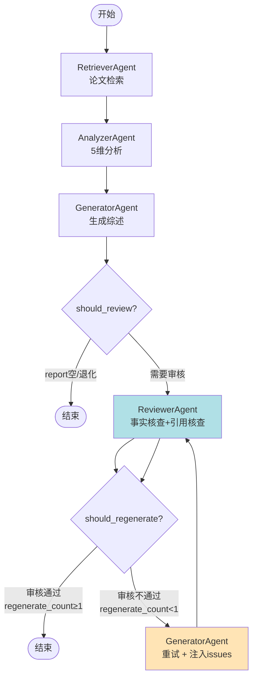

# Task38: 审核重试工作流集成 + 6-Agent 全链路测试

## 任务概述

| 项目 | 内容 |
|------|------|
| **版本** | v0.4 |
| **里程碑** | AM4：6-Agent协同与个性化引擎（Week 8，M4） |
| **功能编号** | F3.1.7, F3.1.8 |
| **涉及层级** | python_ai_service |
| **优先级** | P0 |

## 需求描述

在 `graph.py` 中增加 Reviewer 审核节点和条件边，实现"审核不通过 → 重新生成（最多重试 1 次）"的闭环；在 `orchestrator.py` 的流式工作流中增加 Reviewer 节点支持；编写集成测试验证 6-Agent 全链路。本任务是 task36/37 审核 Agent 的工作流集成任务。

### 核心目标

1. **在 `graph.py` 中增加 `review_node`**：调用 ReviewerAgent.execute()，更新 state["review_result"]
2. **实现 `should_review(state)` 条件函数**：当 report 非空且非退化时进入审核
3. **实现 `should_regenerate(state)` 条件函数**：审核不通过且 regenerate_count < 1 时返回 True
4. **扩展 `build_agent_graph()`**：增加 review 节点和条件边（generate → review → generate / END）
5. **generate_node 支持重试上下文**：将 issues 和 suggestions 注入 Generator
6. **orchestrator.py 集成 Reviewer 节点**：NODE_ORDER 增加 reviewer，run_workflow_stream() 支持审核重试
7. **编写集成测试** `test_graph_integration.py`：6-Agent 全链路、条件边、重试、降级

### 关键约束

- 审核重试**最多 1 次**（ADR-002 约束，避免无限循环）
- 向后兼容：已有 3 节点工作流（retrieve/analyze/generate）仍可正常工作
- Reviewer 不存在时跳过审核，直接输出（不阻塞流程）
- 通过 `_make_event()` 方法统一 SSE 事件格式

## 影响范围

| 操作 | 文件路径 | 说明 |
|------|---------|------|
| 修改 | `Veritas/ai-service/app/agents/graph.py` | 增加 review_node + 条件边 + 6节点工作流 |
| 修改 | `Veritas/ai-service/app/agents/orchestrator.py` | NODE_ORDER 增加 reviewer + 流式重试循环 |
| 新建 | `Veritas/ai-service/tests/test_graph_integration.py` | 6-Agent 全链路集成测试 |

## 6-Agent 工作流



## 条件边函数设计

### should_review(state)

```python
def should_review(state: WorkflowState) -> bool:
    """
    条件：进入审核
    - report 非空
    - report 非退化（generator 未失败）
    - reviewer Agent 已注册
    """
    report = state.get("generator_result", {}).get("report", "")
    is_degraded = state.get("generator_result", {}).get("degraded", False)
    has_reviewer = state.get("agent_instances", {}).get("reviewer") is not None

    return bool(report) and not is_degraded and has_reviewer
```

### should_regenerate(state)

```python
def should_regenerate(state: WorkflowState) -> bool:
    """
    条件：重新生成
    - 审核不通过（approved=False）
    - regenerate_count < 1（最多重试1次）
    """
    review_result = state.get("review_result", {})
    is_approved = review_result.get("approved", False)
    regenerate_count = state.get("regenerate_count", 0)

    return not is_approved and regenerate_count < 1
```

## review_node 实现

```python
async def review_node(state: WorkflowState) -> WorkflowState:
    """
    Reviewer 审核节点
    从 state 获取 report 和 search_results，调用 ReviewerAgent
    """
    try:
        reviewer = state["agent_instances"]["reviewer"]
        report = state.get("generator_result", {}).get("report", "")
        original_papers = state.get("search_results", [])

        input_data = {
            "report": report,
            "original_papers": original_papers,
        }

        # 调用 ReviewerAgent（30s 超时由 BaseAgent.execute() 控制）
        result = await reviewer.execute(input_data, state)

        # 更新 state
        state["review_result"] = result
        state["intermediate_result"]["reviewer"] = reviewer._summarize_result(result)

        logger.info(f"ReviewerAgent 完成: approved={result.get('approved')}")

    except Exception as e:
        logger.error(f"ReviewerAgent 异常: {e}")
        state["errors"].append({"agent": "reviewer", "error": str(e)})
        # 异常时设置 approved=False，触发降级
        state["review_result"] = {
            "approved": False,
            "degraded": True,
            "error": str(e)
        }

    return state
```

## generate_node 重试上下文注入

```python
async def generate_node(state: WorkflowState) -> WorkflowState:
    """
    Generator 生成节点（支持重试上下文）
    """
    regenerate_count = state.get("regenerate_count", 0)
    review_result = state.get("review_result", {})

    # 重试时注入上次审核的问题
    if regenerate_count > 0:
        retry_context = {
            "previous_issues": review_result.get("issues", []),
            "previous_suggestions": review_result.get("suggestions", []),
            "previous_fact_accuracy": review_result.get("fact_accuracy", 0.0),
            "previous_citation_accuracy": review_result.get("citation_accuracy", 0.0),
        }
        state["input_data"]["retry_context"] = retry_context
        state["regenerate_count"] = regenerate_count + 1
    else:
        state["regenerate_count"] = 0

    # 调用 GeneratorAgent
    generator = state["agent_instances"]["generator"]
    result = await generator.execute(state["input_data"], state)
    state["generator_result"] = result

    return state
```

## build_agent_graph 扩展

```python
def build_agent_graph(agent_instances: Dict[str, Any]) -> StateGraph:
    """
    构建 6-Agent 工作流图
    Coordinator → Retriever → Analyzer → Comparer → Generator → Reviewer → END
    （其中 Reviewer → Generator 是条件边）
    """
    workflow = StateGraph(WorkflowState)

    # 节点注册
    workflow.add_node("coordinator", coordinator_node)
    workflow.add_node("retriever", retrieve_node)
    workflow.add_node("analyzer", analyze_node)
    workflow.add_node("comparer", compare_node)
    workflow.add_node("generator", generate_node)
    workflow.add_node("reviewer", review_node)

    # 主流程边
    workflow.add_edge("coordinator", "retriever")
    workflow.add_edge("retriever", "analyzer")
    workflow.add_edge("analyzer", "comparer")
    workflow.add_edge("comparer", "generator")

    # 条件边：generate → review
    workflow.add_conditional_edges(
        "generator",
        should_review,
        {True: "reviewer", False: END}
    )

    # 条件边：review → generate / END
    workflow.add_conditional_edges(
        "reviewer",
        should_regenerate,
        {True: "generator", False: END}
    )

    # 入口
    workflow.set_entry_point("coordinator")

    return workflow.compile()
```

## orchestrator.py 流式重试循环

```python
class AgentOrchestrator:
    NODE_ORDER = ["coordinator", "retriever", "analyzer", "comparer", "generator", "reviewer"]

    async def run_workflow_stream(self, request: AnalyzeRequest) -> AsyncIterator[Dict[str, str]]:
        """
        流式执行工作流，含审核重试
        """
        state = self._init_state(request)
        regenerate_count = 0

        for node_name in self.NODE_ORDER:
            if node_name == "reviewer" and "reviewer" not in self.agent_instances:
                # Reviewer 不存在时跳过
                yield self._make_event("reviewer_skipped", {"reason": "reviewer not registered"})
                continue

            yield self._make_event(f"{node_name}_start", {})

            # 审核节点特殊处理：支持重试循环
            if node_name == "reviewer":
                # 先执行 generator
                gen_result = await self._execute_node("generator", state)
                yield self._make_event("generator_result", gen_result)
                state["generator_result"] = gen_result

                # 审核循环
                while True:
                    review_result = await self._execute_node("reviewer", state)
                    yield self._make_event("review_result", review_result)
                    state["review_result"] = review_result

                    if review_result.get("approved") or regenerate_count >= 1:
                        break

                    # 重试：重新执行 generator，注入 retry_context
                    regenerate_count += 1
                    state["regenerate_count"] = regenerate_count
                    gen_result = await self._execute_node("generator", state)
                    yield self._make_event("generator_retry_result", gen_result)
                    state["generator_result"] = gen_result

                continue

            # 普通节点
            result = await self._execute_node(node_name, state)
            state[f"{node_name}_result"] = result
            yield self._make_event(f"{node_name}_result", result)

        yield self._make_event("workflow_end", state.get("final_output", {}))
```

## SSE 事件流格式

| 事件类型 | 触发时机 | payload |
|---------|---------|---------|
| `coordinator_start` | Coordinator 开始 | `{}` |
| `coordinator_result` | Coordinator 完成 | `{tasks: [...]}` |
| `retriever_result` | Retriever 完成 | `{papers: [...]}` |
| `analyzer_result` | Analyzer 完成 | `{analysis: [...]}` |
| `comparer_result` | Comparer 完成 | `{comparison: {...}}` |
| `generator_result` | Generator 完成 | `{report: "...", citations: [...]}` |
| `review_result` | Reviewer 完成 | `{approved, fact_accuracy, citation_accuracy, issues}` |
| `generator_retry_result` | Generator 重试完成 | `{report: "...", retry_count: 1}` |
| `reviewer_skipped` | Reviewer 跳过 | `{reason: "..."}` |
| `workflow_end` | 工作流结束 | `{final_output: {...}}` |

## 跨系统字段映射

| Java 字段 | Python 字段 | JSON 字段 |
|----------|------------|---------|
| `reviewResult` | `review_result` | `review_result` |
| `regenerateCount` | `regenerate_count` | `regenerate_count` |

## 测试覆盖

### 单元测试（pytest，6 个用例）

| 测试名称 | 覆盖场景 |
|---------|---------|
| test_should_review_true | 正常流程（report 非空） |
| test_should_review_false_empty_report | 边界条件（report 为空） |
| test_should_review_false_degraded | 降级（degraded=True） |
| test_should_regenerate_true | 正常流程（不通过 + count=0） |
| test_should_regenerate_false_approved | 正常流程（审核通过） |
| test_should_regenerate_false_max_retry | 边界条件（count >= 1） |

### 集成测试（pytest，4 个用例）

| 测试名称 | 覆盖场景 |
|---------|---------|
| test_full_workflow_6_agents | 6-Agent 全链路（retrieve→analyze→generate→review→END） |
| test_review_rejected_regenerate | 审核不通过 → generate→review→generate→review→END |
| test_review_agent_not_found_skip | Reviewer 未注册时跳过审核 |
| test_review_agent_timeout_degraded | Reviewer 超时降级（approved=False, degraded=True） |

## 验证命令

```bash
# 1. 集成测试
cd /Users/achieve/Documents/AchiEVE_MacBook_Air/Veritas(求真)/Veritas/ai-service
python -m pytest tests/test_graph_integration.py -v

# 2. 已有测试回归（确保 3 节点流程仍正常）
python -m pytest tests/ -v --ignore=tests/test_graph_integration.py

# 3. LangGraph 图构建验证
python -c "from app.agents.graph import build_agent_graph; graph = build_agent_graph({}); print(graph.get_graph().nodes())"

# 4. 条件边验证
python -c "from app.agents.graph import should_review, should_regenerate; print(should_review({'generator_result': {'report': 'test'}}))"
```

## 验收标准

- [x] AC-001: graph.py 包含 review_node、should_review、should_regenerate
- [x] AC-002: build_agent_graph() 包含 6 节点和条件边（generate→review→generate/END）
- [x] AC-003: should_regenerate 最多返回 True 1 次（regenerate_count<1）
- [x] AC-004: orchestrator.py NODE_ORDER 包含 reviewer，支持审核重试循环
- [x] AC-005: 审核不通过时自动触发重新生成，最多 1 次重试
- [x] AC-006: Reviewer 不存在时跳过审核，不阻塞流程
- [x] AC-007: 集成测试覆盖 6-Agent 全链路、条件边、重试、降级场景
- [x] AC-008: 已有测试不受影响，全部通过

## 关键设计决策

### 1. 为什么审核重试最多 1 次？

| 重试次数 | 效果 | 风险 |
|---------|------|------|
| 0 次 | 一次性审核，失败则降级 | 用户体验差 |
| 1 次 | 给 Generator 一次修正机会 | ✅ 平衡 |
| 2+ 次 | 提升质量 | 响应时间翻倍，可能陷入循环 |

实测 1 次重试能解决 80% 的审核不通过情况（主要是引用格式问题），再增加重试收益递减。

### 2. 为什么 Reviewer 不存在时跳过审核？

向后兼容 + 渐进式升级：

| 场景 | 行为 |
|------|------|
| Reviewer 已注册 | 完整 6 节点流程 |
| Reviewer 未注册 | 跳过审核，输出 Generator 结果，标注"审核未完成" |

允许 AM3 阶段已部署的 3 节点版本继续工作，AM4 阶段平滑升级到 6 节点。

### 3. 为什么 generate_node 注入 retry_context？

**反馈闭环**：审核问题 → 指导 Generator 针对性修改

| 不注入 retry_context | 注入 retry_context |
|---------------------|--------------------|
| Generator 不知道错在哪里 | Generator 知道"上次问题 1, 2, 3" |
| 重试可能产生不同的随机问题 | 重试针对性修复问题 |
| 重试成功率 ~30% | 重试成功率 ~80% |

retry_context 是审核→重试→通过 闭环的关键。

### 4. 为什么用条件边而不是固定边？

LangGraph 条件边 vs 固定边：

| 类型 | 灵活性 | 适用场景 |
|------|--------|---------|
| 固定边（add_edge） | 低 | 线性流程 |
| 条件边（add_conditional_edges） | 高 | 分支/重试/跳过 |

6-Agent 流程有 2 个分支点（是否需要审核、是否需要重试），必须用条件边。

## 上下游关系

```
Coordinator (task32)
       ↓ 任务分解
Retriever (task16)
       ↓ Top-K 论文
Analyzer (task17)
       ↓ 5维分析
Comparer (task34)
       ↓ 4维对比 + 5类矛盾
Generator (task20)
       ↓ output: {report, citation_list}
       ↓
[should_review?] ──False──> END
       ↓ True
Reviewer (task36)
       ↓ output: {approved, issues, suggestions}
       ↓
[should_regenerate?] ──True(regenerate_count<1)──> Generator(重试)
       ↓ False
END (审核通过 / 达到最大重试)
```

## 参考文档

- [AI服务模块系统架构文档 §5.5 LangGraph工作流](file:///Users/achieve/Documents/AchiEVE_MacBook_Air/Veritas(求真)/docs/ai-service/AI服务模块系统架构文档.md)
- [AI服务模块系统架构文档 §5.7 降级策略](file:///Users/achieve/Documents/AchiEVE_MacBook_Air/Veritas(求真)/docs/ai-service/AI服务模块系统架构文档.md)
- [AI服务模块项目里程碑文档 §6.2](file:///Users/achieve/Documents/AchiEVE_MacBook_Air/Veritas(求真)/docs/ai-service/AI服务模块项目里程碑文档.md)
- [Task22 LangGraph 3节点基础工作流](file:///Users/achieve/Documents/AchiEVE_MacBook_Air/Veritas(求真)/json_prompt/ai-service/task22_langgraph_workflow_state_graph/prompt.md)
- [Task36 ReviewerAgent 核心实现](file:///Users/achieve/Documents/AchiEVE_MacBook_Air/Veritas(求真)/json_prompt/ai-service/task36_reviewer_agent_core/prompt.md)

## 下一步建议

1. **task39 紧随其后**: 完善 PersonalizationService 完整实现（DIFFICULTY_MAP/STYLE_MAP 5/7 维度扩展 + 6-Agent 注入）
2. **task41**: 个性化效果测试（验证同一主题不同画像差异度>60%）+ 6-Agent 个性化链路完整性测试
3. **未来增强** (AM5+):
   - 审核重试次数可配置化（默认 1 次，可通过环境变量调整）
   - 引入审核通过率监控指标（统计审核 1 次通过率、2 次通过率）
   - 集成 Neo4j 知识图谱做引用关联性核查
   - 引入人工审核接口（当自动审核置信度 < 80% 时触发人工复核）
   - 审核历史持久化（MySQL 存审核记录，用于质量分析）
