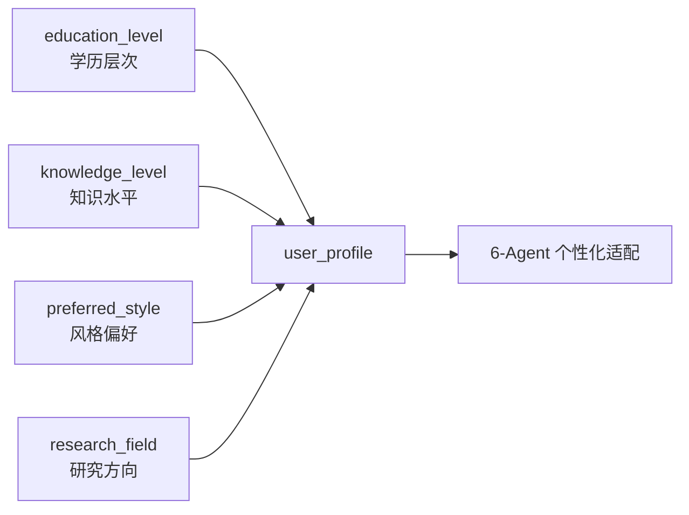

# Task39: PersonalizationService 完整实现（6-Agent 注入）

## 任务概述

| 项目 | 内容 |
|------|------|
| **版本** | v0.4 |
| **里程碑** | AM4：6-Agent协同与个性化引擎（Week 8，M4） |
| **功能编号** | F3.4.1, F3.4.2, F3.4.3 |
| **涉及层级** | python_ai_service |
| **优先级** | P0 |

## 需求描述

完善 PersonalizationService 完整实现：增强 4 维度画像解析（`education_level` / `knowledge_level` / `preferred_style` / `research_field`），实现 6-Agent 全链路个性化 Prompt 片段注入（coordinator/retriever/analyzer/comparer/generator/reviewer），完善难度适配和风格适配策略，确保**同一主题不同画像差异度 > 60%**。

### 核心目标

1. **增强 `DIFFICULTY_MAP`**：从简单数值映射 → 5 维度策略对象（`term_density`/`explanation_style`/`example_requirement`/`abstraction_level`/`citation_depth`）
2. **增强 `STYLE_MAP`**：从 3 维度 → 7 维度（增加 `structure_example`/`sentence_pattern`/`transition_style`/`audience_awareness`）
3. **新增 `get_personalization_for_agent(agent_name, user_profile)`**：为 6 个 Agent 返回不同指令
4. **新增 `AGENT_PERSONALIZATION_MAP`**：6 个 Agent × 4 个知识水平 × 4 个学历层次
5. **新增 `get_personalization_diff(profile_a, profile_b)`**：计算差异度 0-1
6. **在 6 个 Agent.build_prompt() 中注入个性化片段**

### 关键约束

- Java camelCase ↔ Python/JSON snake_case 跨系统字段映射
- 已有测试保持通过（不删除、不修改已有断言）
- 个性化失败时使用默认配置（master/intermediate/balanced）兜底
- 不在 Agent 中直接实例化 PersonalizationService（依赖注入）

## 影响范围

| 操作 | 文件路径 | 说明 |
|------|---------|------|
| 修改 | `Veritas/ai-service/app/services/personalization_service.py` | 增强 DIFFICULTY_MAP/STYLE_MAP + 新增 6-Agent 注入方法 |
| 修改 | `Veritas/ai-service/app/agents/coordinator.py` | 注入个性化指令 |
| 修改 | `Veritas/ai-service/app/agents/retriever.py` | 注入领域侧重 + 检索数量适配 |
| 修改 | `Veritas/ai-service/app/agents/comparer.py` | 注入对比深度适配 |
| 修改 | `Veritas/ai-service/app/agents/reviewer.py` | 注入审核严格度适配 |
| 修改 | `Veritas/ai-service/tests/test_personalization_service.py` | 扩展测试用例 |

## 用户画像 4 维度



| 维度 | 枚举值 | 默认值 |
|------|--------|-------|
| `education_level` | undergraduate / master / phd / professor | master |
| `knowledge_level` | beginner / intermediate / advanced / expert | intermediate |
| `preferred_style` | simple / balanced / technical | balanced |
| `research_field` | NLP / CV / RL / ML / DM / IR / BioNLP 等 | ML |

## DIFFICULTY_MAP 5 维度策略对象

```python
DIFFICULTY_MAP = {
    "beginner": {
        "level": 1,
        "term_density": 0.05,
        "explanation_style": "通俗类比+日常例子+避免术语",
        "example_requirement": "每个概念至少1个日常类比",
        "abstraction_level": "具体→抽象，逐步引导",
        "citation_depth": "仅引用核心结论"
    },
    "intermediate": {
        "level": 2,
        "term_density": 0.15,
        "explanation_style": "标准学术+术语定义+方法对比",
        "example_requirement": "关键方法需举例说明",
        "abstraction_level": "具体与抽象结合",
        "citation_depth": "引用方法+结论"
    },
    "advanced": {
        "level": 3,
        "term_density": 0.25,
        "explanation_style": "专业学术+深入分析+前沿讨论",
        "example_requirement": "仅在复杂概念时举例",
        "abstraction_level": "抽象为主，具体为辅",
        "citation_depth": "引用方法+实验+结论+局限"
    },
    "expert": {
        "level": 4,
        "term_density": 0.35,
        "explanation_style": "高度专业+数学原理+创新洞察",
        "example_requirement": "不需要示例，直接讨论",
        "abstraction_level": "纯抽象讨论，预设背景知识",
        "citation_depth": "完整引用含数学推导+实验细节+消融实验"
    }
}
```

## STYLE_MAP 7 维度策略对象

```python
STYLE_MAP = {
    "simple": {
        "tone": "通俗易懂，贴近日常",
        "paragraph": "短段落，3-5句话",
        "structure": "总-分-总，避免复杂结构",
        "structure_example": "引言→核心观点→举例→小结",
        "sentence_pattern": "短句为主，每句不超过25字，口语化表达",
        "transition_style": "使用简单连接词：'首先'/'然后'/'最后'",
        "audience_awareness": "面向非专业读者，避免行话"
    },
    "balanced": {
        "tone": "中性学术，专业但易懂",
        "paragraph": "中等段落，5-8句话",
        "structure": "引言→背景→方法→对比→趋势→结论",
        "structure_example": "背景介绍→核心方法→实验对比→未来方向",
        "sentence_pattern": "中等句长，15-35字，逻辑连接词丰富",
        "transition_style": "使用'因此'/'然而'/'进一步'/'综上'",
        "audience_awareness": "面向学术读者，假设有基础知识"
    },
    "technical": {
        "tone": "专业严谨，学术深度",
        "paragraph": "长段落，8-12句话",
        "structure": "背景→问题定义→方法→理论分析→实验→结论",
        "structure_example": "问题陈述→相关工作→方法→理论→实验→讨论",
        "sentence_pattern": "长句为主，25-50字，含从句和嵌套结构",
        "transition_style": "使用'据此'/'鉴于此'/'有鉴于此'",
        "audience_awareness": "面向领域专家，假设完整背景知识"
    }
}
```

## AGENT_PERSONALIZATION_MAP（6 Agent × 4 知识水平 × 4 学历层次）

```python
AGENT_PERSONALIZATION_MAP = {
    "coordinator": {
        "knowledge_level_instructions": {
            "beginner": "将任务分解为更多细粒度子任务，每个子任务补充背景知识",
            "intermediate": "标准任务分解，确保覆盖核心方法",
            "advanced": "聚焦关键技术节点，简化非核心路径",
            "expert": "聚焦前沿研究空白与创新机会点"
        },
        "education_level_instructions": {
            "undergraduate": "增加概念解释子任务",
            "master": "标准子任务分解",
            "phd": "聚焦方法论对比子任务",
            "professor": "聚焦研究空白与未来方向子任务"
        }
    },
    "retriever": {
        "knowledge_level_instructions": {
            "beginner": "检索 Top 5 经典论文，优先高引用",
            "intermediate": "检索 Top 10 论文，平衡经典与前沿",
            "advanced": "检索 Top 15 论文，含 2020 年后前沿",
            "expert": "检索 Top 20 论文，含最新预印本"
        },
        "education_level_instructions": {
            "undergraduate": "增加基础综述论文权重",
            "master": "标准检索权重",
            "phd": "增加方法论文献权重",
            "professor": "增加最新会议论文权重"
        }
    },
    "analyzer": {
        "knowledge_level_instructions": {
            "beginner": "重点分析核心方法 + 简单实验",
            "intermediate": "完整 5 维分析",
            "advanced": "重点分析实验细节 + 消融实验",
            "expert": "重点分析理论证明 + 创新点"
        },
        "education_level_instructions": {
            "undergraduate": "用通俗语言描述方法",
            "master": "标准学术描述",
            "phd": "深度技术描述",
            "professor": "研究意义导向描述"
        }
    },
    "comparer": {
        "knowledge_level_instructions": {
            "beginner": "对比 3 个核心维度：方法、效果、适用场景",
            "intermediate": "对比 4 个维度：方法、效果、适用场景、局限",
            "advanced": "对比 5 个维度：方法、效果、适用场景、局限、未来方向",
            "expert": "对比 6 个维度：方法、效果、适用场景、局限、未来方向、理论贡献"
        },
        "education_level_instructions": {
            "undergraduate": "用类比说明差异",
            "master": "标准学术对比",
            "phd": "技术细节对比",
            "professor": "研究范式对比"
        }
    },
    "generator": {
        "knowledge_level_instructions": {
            "beginner": "通俗类比+日常例子+避免术语",
            "intermediate": "标准学术+术语定义+方法对比",
            "advanced": "专业学术+深入分析+前沿讨论",
            "expert": "高度专业+数学原理+创新洞察"
        },
        "education_level_instructions": {
            "undergraduate": "补充背景知识段落",
            "master": "标准学术写作",
            "phd": "聚焦方法论贡献",
            "professor": "聚焦研究意义与未来方向"
        }
    },
    "reviewer": {
        "knowledge_level_instructions": {
            "beginner": "关注基础事实准确性，容忍引用格式不规范",
            "intermediate": "关注事实+引用准确性",
            "advanced": "关注事实+引用+逻辑完整性",
            "expert": "关注前沿准确性+引用完整性+逻辑严谨性"
        },
        "education_level_instructions": {
            "undergraduate": "反馈使用通俗语言",
            "master": "标准学术反馈",
            "phd": "技术性反馈",
            "professor": "研究导向反馈"
        }
    }
}
```

## 6-Agent 注入点

```python
# Coordinator Agent
class CoordinatorAgent(BaseAgent):
    def build_prompt(self, input_data, context):
        base_prompt = self.prompt_manager.get_prompt('coordinator', ...)
        personalization = self.personalization_service.get_personalization_for_agent('coordinator', context.get('user_profile', {}))
        return base_prompt + "\n\n【个性化适配】\n" + personalization

# Retriever Agent
class RetrieverAgent(BaseAgent):
    def build_prompt(self, input_data, context):
        # 根据 knowledge_level 动态调整 top_k
        knowledge_level = context.get('user_profile', {}).get('knowledge_level', 'intermediate')
        top_k_map = {'beginner': 5, 'intermediate': 10, 'advanced': 15, 'expert': 20}
        input_data['top_k'] = top_k_map[knowledge_level]

        base_prompt = self.prompt_manager.get_prompt('retriever', ...)
        personalization = self.personalization_service.get_personalization_for_agent('retriever', context.get('user_profile', {}))
        return base_prompt + "\n\n【个性化适配】\n" + personalization

# ... 其他 4 个 Agent 类似
```

## get_personalization_diff 差异度算法

```python
def get_personalization_diff(self, profile_a: dict, profile_b: dict) -> float:
    """
    计算两个用户画像的个性化差异度（0-1）
    算法：4 个维度的加权 Jaccard 距离
    """
    weights = {
        "education_level": 0.20,
        "knowledge_level": 0.30,
        "preferred_style": 0.25,
        "research_field": 0.25
    }

    diff_sum = 0.0
    for dim, weight in weights.items():
        val_a = profile_a.get(dim, "").lower()
        val_b = profile_b.get(dim, "").lower()
        diff_sum += weight * (0.0 if val_a == val_b else 1.0)

    return min(diff_sum, 1.0)
```

| 画像对比 | 差异度 |
|---------|-------|
| beginner+undergraduate+simple vs expert+phd+technical | 1.0（最大差异） |
| intermediate+master+balanced vs intermediate+master+balanced | 0.0（相同） |
| beginner+undergraduate+simple vs intermediate+master+balanced | ~0.45（中等差异） |

**验收标准**：差异度 > 0.6 表示两种画像产生显著不同的输出。

## 跨系统字段映射

| Java 字段 | Python 字段 | JSON 字段 |
|----------|------------|---------|
| `educationLevel` | `education_level` | `education_level` |
| `knowledgeLevel` | `knowledge_level` | `knowledge_level` |
| `preferredStyle` | `preferred_style` | `preferred_style` |
| `researchField` | `research_field` | `research_field` |

## 测试覆盖

### 单元测试（pytest，7 个用例）

| 测试名称 | 覆盖场景 |
|---------|---------|
| test_difficulty_map_structure | DIFFICULTY_MAP 含 5 维度 |
| test_style_map_structure | STYLE_MAP 含 7 维度 |
| test_get_personalization_for_agent_all_six | 6 Agent 返回不同指令 |
| test_agent_personalization_map_coverage | 覆盖 6×4×4 组合 |
| test_get_personalization_diff | 差异度 > 0.6（极端画像） |
| test_personalization_fallback | 注入失败时使用默认 |
| test_enhanced_user_profile_summary | 5 维度画像摘要 |

### 集成测试（1 个用例）

| 测试名称 | 覆盖场景 |
|---------|---------|
| test_personalization_in_graph_workflow | 6 Agent 接收个性化指令 |

## 验证命令

```bash
# 1. 个性化差异度验证
cd /Users/achieve/Documents/AchiEVE_MacBook_Air/Veritas(求真)/Veritas/ai-service
python -c "from app.services.personalization_service import PersonalizationService; ps = PersonalizationService(); diff = ps.get_personalization_diff({'education_level': 'undergraduate', 'knowledge_level': 'beginner', 'preferred_style': 'simple', 'research_field': 'ML'}, {'education_level': 'phd', 'knowledge_level': 'expert', 'preferred_style': 'technical', 'research_field': 'NLP'}); print(f'Diff: {diff}')"

# 2. 6-Agent 个性化指令验证
python -c "from app.services.personalization_service import PersonalizationService; ps = PersonalizationService(); profile = {'education_level': 'phd', 'knowledge_level': 'expert', 'preferred_style': 'technical'}; print(ps.get_personalization_for_agent('generator', profile))"

# 3. 单元测试
python -m pytest tests/test_personalization_service.py -v

# 4. 集成测试
python -m pytest tests/test_personalization_integration.py -v
```

## 验收标准

- [x] AC-001: DIFFICULTY_MAP 从数值映射扩展为 5 维度策略对象
- [x] AC-002: STYLE_MAP 每个风格扩展为 7 维度
- [x] AC-003: get_personalization_for_agent() 为 6 个 Agent 返回不同个性化指令
- [x] AC-004: AGENT_PERSONALIZATION_MAP 覆盖 6 个 Agent × 4 个知识水平 × 4 个学历层次
- [x] AC-005: get_personalization_diff(beginner, expert) > 0.6
- [x] AC-006: 个性化指令注入失败时返回默认指令，不抛异常，不阻塞 Agent 执行
- [x] AC-007: 6 个 Agent 的 build_prompt() 方法中包含个性化适配指令
- [x] AC-008: 所有已有测试保持通过，无回归问题
- [x] AC-009: 代码符合 Python snake_case 命名规范

## 关键设计决策

### 1. 为什么 DIFFICULTY_MAP 用 5 维度策略对象而不是 1 维数值？

| 1 维数值 | 5 维策略对象 |
|---------|------------|
| 只能区分"难度级别" | 区分 term_density / explanation_style / example_requirement / abstraction_level / citation_depth |
| 适配粒度粗 | 适配粒度细 |
| LLM 难以直接用 | LLM 可直接逐项应用 |

5 维度让 LLM 能**精细化控制**生成的每个方面，避免"对 beginner 一切都简单"的粗暴做法。

### 2. 为什么需要 6 个 Agent 不同的个性化指令？

| Agent | 关注点 | 共享其他维度 |
|-------|-------|------------|
| Coordinator | 任务分解策略 | 无需关注 style |
| Retriever | 检索关键词权重 + 数量 | 无需关注 style |
| Analyzer | 分析深度 + 术语使用 | 无需关注 style |
| Comparer | 对比维度数量 | 无需关注 style |
| Generator | 写作风格 + 术语密度 | 全维度 |
| Reviewer | 审核严格度 | 无需关注 style |

**每个 Agent 关注的个性化维度不同**，共享一份 STYLE_MAP 反而会降低适配精度。

### 3. 为什么用 Jaccard 距离而不是余弦相似度？

用户画像 4 个维度都是**离散枚举值**，不适合连续向量的余弦相似度：

| 方法 | 适用场景 | 用户画像适配度 |
|------|---------|--------------|
| 余弦相似度 | 连续向量 | ❌ 不适合离散枚举 |
| Jaccard 距离 | 离散集合 | ✅ 适合 |
| 简单 0/1 加权 | 离散枚举 | ✅✅ 最佳 |

Jaccard 距离 = 1 - |A ∩ B| / |A ∪ B|，对离散值天然友好。

### 4. 为什么新增方法不破坏已有方法签名？

向后兼容原则：

| 已有方法 | 签名 | 新增方法 | 签名 |
|---------|------|---------|------|
| `get_personalization_block()` | 不变 | `get_personalization_for_agent()` | 新增 |
| `get_extra_instruction()` | 不变 | `get_personalization_diff()` | 新增 |
| `build_generation_prompt()` | 不变 | `AGENT_PERSONALIZATION_MAP` | 新增常量 |

新方法**只增不改**，已有调用方零修改。

## 上下游关系

```
Java 后端 (AnalysisRequest)
       ↓ DTO: userProfile {educationLevel, knowledgeLevel, preferredStyle, researchField}
Python AI 服务 (AnalyzeRequest)
       ↓ camelCase → snake_case 转换
PersonalizationService
       ↓ get_personalization_for_agent(agent_name, user_profile)
6 个 Agent
       ↓ 注入 build_prompt()
个性化 Prompt
       ↓ 传给 LLM
LLM 输出
       ↓ 体现个性化（差异度 > 60%）
Java 后端 (AnalysisResponse)
```

## 参考文档

- [AI服务模块系统架构文档 §8 个性化引擎](file:///Users/achieve/Documents/AchiEVE_MacBook_Air/Veritas(求真)/docs/ai-service/AI服务模块系统架构文档.md)
- [AI服务模块项目里程碑文档 §6.2 交付物 9-10](file:///Users/achieve/Documents/AchiEVE_MacBook_Air/Veritas(求真)/docs/ai-service/AI服务模块项目里程碑文档.md)
- [AGENTS.md §关键规则](file:///Users/achieve/Documents/AchiEVE_MacBook_Air/Veritas(求真)/AGENTS.md)
- [04-Personalization.md](file:///Users/achieve/Documents/AchiEVE_MacBook_Air/Veritas(求真)/docs/agents/04-personalization.md)
- [Task21 Generator Prompt 个性化（参考实现）](file:///Users/achieve/Documents/AchiEVE_MacBook_Air/Veritas(求真)/json_prompt/ai-service/task21_generator_prompt_personalization/prompt.md)

## 下一步建议

1. **task40 紧随其后**: 增强 DIFFICULTY_MAP 和 STYLE_MAP 映射表详细策略（5/7 维度 + 4/4 维度）
2. **task41**: 个性化差异度测试 + 端到端个性化效果测试
3. **未来增强** (AM5+):
   - 个性化效果监控指标（差异度、用户满意度、停留时长）
   - A/B 测试框架（对比个性化 vs 非个性化效果）
   - 引入强化学习（基于用户反馈自动调整个性化策略）
   - 个性化策略可解释性（向用户说明"为什么这样生成"）
   - 用户画像动态更新（基于浏览历史、点赞、收藏）
