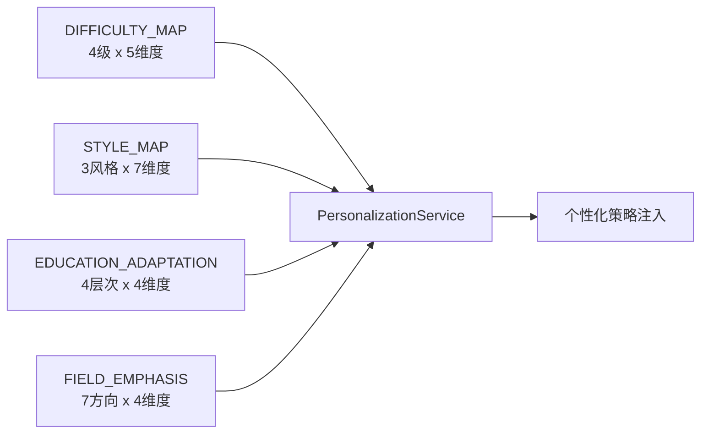

# Task40: 难度/风格映射表详细策略增强

## 任务概述

| 项目 | 内容 |
|------|------|
| **版本** | v0.4 |
| **里程碑** | AM4：6-Agent协同与个性化引擎（Week 8 Day 2，M4） |
| **功能编号** | F3.4.2, F3.4.3 |
| **涉及层级** | python_ai_service |
| **优先级** | P0 |

## 需求描述

增强 `DIFFICULTY_MAP` 和 `STYLE_MAP` 映射表：`DIFFICULTY_MAP` 从简单数值映射扩展为包含 `term_density`、`explanation_style`、`example_requirement`、`abstraction_level`、`citation_depth` **5 个维度**的完整策略对象；`STYLE_MAP` 从 3 维度扩展为包含 `tone`、`paragraph`、`structure`、`structure_example`、`sentence_pattern`、`transition_style`、`audience_awareness` **7 个维度**的完整风格定义。同时新增 `EDUCATION_ADAPTATION` 和 `FIELD_EMPHASIS` 的详细策略。本任务是 task39 PersonalizationService 的配套映射表增强任务。

### 核心目标

1. **DIFFICULTY_MAP**：数值映射 → 5 维度策略对象
2. **STYLE_MAP**：3 维度 → 7 维度完整风格
3. **EDUCATION_ADAPTATION**：简单文本 → 4 维度策略对象
4. **FIELD_EMPHASIS**：简单文本 → 4 维度策略对象
5. **保持向后兼容**：已有方法签名不变

### 关键约束

- 已有方法（`get_education_adaptation()`/`get_term_density_target()`/`get_style_guide()`/`get_field_emphasis()`）签名不变
- 所有映射表访问使用 `.get(key, default)` 模式
- 已有测试保持通过（无回归）
- 常量定义在模块顶层（不在类内部）

## 影响范围

| 操作 | 文件路径 | 说明 |
|------|---------|------|
| 修改 | `Veritas/ai-service/app/services/personalization_service.py` | 增强 4 个映射表 |
| 修改 | `Veritas/ai-service/tests/test_personalization_service.py` | 新增映射表结构测试 |

## 4 个映射表增强概览



| 映射表 | 增强前 | 增强后 | 维度 |
|-------|--------|-------|------|
| `DIFFICULTY_MAP` | 数值 `{beginner: 1}` | 5 维度策略对象 | term_density / explanation_style / example_requirement / abstraction_level / citation_depth |
| `STYLE_MAP` | 3 维度 | 7 维度 | + structure_example / sentence_pattern / transition_style / audience_awareness |
| `EDUCATION_ADAPTATION` | 4 个文本 | 4 维度策略对象 | background_knowledge / methodology_focus / innovation_emphasis / teaching_applicability |
| `FIELD_EMPHASIS` | 7 个文本 | 4 维度策略对象 | primary_keywords / secondary_keywords / methodology_bias / evaluation_focus |

## DIFFICULTY_MAP 5 维度定义

```python
DIFFICULTY_MAP = {
    "beginner": {
        "level": 1,
        "term_density": 0.05,  # 5% 术语密度
        "explanation_style": "通俗类比+日常例子+避免术语",
        "example_requirement": "每个概念至少1个日常类比",
        "abstraction_level": "具体→抽象，逐步引导",
        "citation_depth": "仅引用核心结论"
    },
    "intermediate": {
        "level": 2,
        "term_density": 0.15,  # 15% 术语密度
        "explanation_style": "标准学术+术语定义+方法对比",
        "example_requirement": "关键方法需举例说明",
        "abstraction_level": "具体与抽象结合",
        "citation_depth": "引用方法+结论"
    },
    "advanced": {
        "level": 3,
        "term_density": 0.25,  # 25% 术语密度
        "explanation_style": "专业学术+深入分析+前沿讨论",
        "example_requirement": "仅在复杂概念时举例",
        "abstraction_level": "抽象为主，具体为辅",
        "citation_depth": "引用方法+实验+结论+局限"
    },
    "expert": {
        "level": 4,
        "term_density": 0.35,  # 35% 术语密度
        "explanation_style": "高度专业+数学原理+创新洞察",
        "example_requirement": "不需要示例，直接讨论",
        "abstraction_level": "纯抽象讨论，预设背景知识",
        "citation_depth": "完整引用含数学推导+实验细节+消融实验"
    }
}
```

### 5 维度说明

| 维度 | 含义 | LLM 用途 |
|------|------|---------|
| `term_density` | 术语占比（0-1） | 控制"专业词汇密度" |
| `explanation_style` | 解释风格描述 | 控制"如何解释概念" |
| `example_requirement` | 示例要求 | 控制"是否举例 + 举例粒度" |
| `abstraction_level` | 抽象层次 | 控制"具体 vs 抽象比例" |
| `citation_depth` | 引用深度 | 控制"引用哪些信息" |

## STYLE_MAP 7 维度定义

```python
STYLE_MAP = {
    "simple": {
        "tone": "通俗易懂，贴近日常",
        "paragraph": "短段落，3-5句话",
        "structure": "总-分-总，避免复杂结构",
        "structure_example": "引言→核心观点→举例→小结",
        "sentence_pattern": "短句为主，每句不超过25字，口语化表达",
        "transition_style": "使用简单连接词：'首先'/'然后'/'最后'",
        "audience_awareness": "面向非专业读者，避免行话"
    },
    "balanced": {
        "tone": "中性学术，专业但易懂",
        "paragraph": "中等段落，5-8句话",
        "structure": "引言→背景→方法→对比→趋势→结论",
        "structure_example": "背景介绍→核心方法→实验对比→未来方向",
        "sentence_pattern": "中等句长，15-35字，逻辑连接词丰富",
        "transition_style": "使用'因此'/'然而'/'进一步'/'综上'",
        "audience_awareness": "面向学术读者，假设有基础知识"
    },
    "technical": {
        "tone": "专业严谨，学术深度",
        "paragraph": "长段落，8-12句话",
        "structure": "背景→问题定义→方法→理论分析→实验→结论",
        "structure_example": "问题陈述→相关工作→方法→理论→实验→讨论",
        "sentence_pattern": "长句为主，25-50字，含从句和嵌套结构",
        "transition_style": "使用'据此'/'鉴于此'/'有鉴于此'",
        "audience_awareness": "面向领域专家，假设完整背景知识"
    }
}
```

### 7 维度说明

| 维度 | 含义 | LLM 用途 |
|------|------|---------|
| `tone` | 语气 | 控制"整体语气" |
| `paragraph` | 段落长度 | 控制"段落大小" |
| `structure` | 文档结构 | 控制"章节组织" |
| `structure_example` ✨ | 结构示例 | 给出具体结构模板 |
| `sentence_pattern` ✨ | 句式模式 | 控制"句子长度 + 复杂度" |
| `transition_style` ✨ | 过渡风格 | 控制"段落/章节衔接" |
| `audience_awareness` ✨ | 受众意识 | 明确"目标读者" |

✨ 为新增维度（v2 增强）

## EDUCATION_ADAPTATION 4 维度定义

```python
EDUCATION_ADAPTATION = {
    "undergraduate": {
        "background_knowledge": "补充基础概念和定义",
        "methodology_focus": "关注方法直觉而非数学细节",
        "innovation_emphasis": "低（关注经典方法）",
        "teaching_applicability": "高（适合教学场景）"
    },
    "master": {
        "background_knowledge": "假设有基础概念",
        "methodology_focus": "标准方法论描述",
        "innovation_emphasis": "中（关注近期改进）",
        "teaching_applicability": "中（适合研究生课程）"
    },
    "phd": {
        "background_knowledge": "假设有深入背景",
        "methodology_focus": "深入方法论分析",
        "innovation_emphasis": "高（关注最新方法）",
        "teaching_applicability": "低（专注研究）"
    },
    "professor": {
        "background_knowledge": "假设有完整背景",
        "methodology_focus": "批判性分析 + 理论贡献",
        "innovation_emphasis": "极高（关注研究意义）",
        "teaching_applicability": "低（专注前沿）"
    }
}
```

## FIELD_EMPHASIS 4 维度定义

```python
FIELD_EMPHASIS = {
    "NLP": {
        "primary_keywords": ["language model", "transformer", "tokenization", "embedding", "attention"],
        "secondary_keywords": ["BERT", "GPT", "LLaMA", "fine-tuning", "prompt"],
        "methodology_bias": "深度学习主导",
        "evaluation_focus": "困惑度(perplexity)、BLEU、ROUGE、GLUE 基准"
    },
    "CV": {
        "primary_keywords": ["CNN", "ResNet", "ViT", "object detection", "segmentation"],
        "secondary_keywords": ["YOLO", "Mask R-CNN", "data augmentation", "transfer learning"],
        "methodology_bias": "CNN + Transformer 双驱动",
        "evaluation_focus": "mAP、IoU、COCO 基准、ImageNet 准确率"
    },
    "RL": {
        "primary_keywords": ["Q-learning", "policy gradient", "actor-critic", "reward", "exploration"],
        "secondary_keywords": ["DQN", "PPO", "SAC", "MDP", "environment"],
        "methodology_bias": "强化学习算法",
        "evaluation_focus": "累计奖励、收敛速度、样本效率"
    },
    "ML": {
        "primary_keywords": ["supervised learning", "unsupervised learning", "regression", "classification"],
        "secondary_keywords": ["SVM", "random forest", "gradient boosting", "cross-validation"],
        "methodology_bias": "经典机器学习",
        "evaluation_focus": "准确率、F1、AUC、交叉验证分数"
    },
    "DM": {
        "primary_keywords": ["data mining", "clustering", "association rules", "anomaly detection"],
        "secondary_keywords": ["K-means", "DBSCAN", "Apriori", "FP-Growth"],
        "methodology_bias": "无监督 + 统计方法",
        "evaluation_focus": "轮廓系数、支持度、置信度、提升度"
    },
    "IR": {
        "primary_keywords": ["information retrieval", "BM25", "TF-IDF", "ranking", "indexing"],
        "secondary_keywords": ["inverted index", "vector search", "query expansion", "relevance"],
        "methodology_bias": "检索模型 + 排序学习",
        "evaluation_focus": "NDCG、MAP、MRR、Recall@K"
    },
    "BioNLP": {
        "primary_keywords": ["biomedical NLP", "named entity recognition", "relation extraction"],
        "secondary_keywords": ["BioBERT", "PubMedBERT", "UMLS", "gene mention"],
        "methodology_bias": "领域预训练模型",
        "evaluation_focus": "F1（严格匹配）、AUC、领域专家人工评估"
    }
}
```

## 向后兼容方案

```python
class PersonalizationService:
    def get_education_adaptation(self, education_level: str) -> str:
        """
        【向后兼容】返回 string，但内部合并 4 维度
        """
        config = EDUCATION_ADAPTATION.get(education_level, EDUCATION_ADAPTATION["master"])

        # 如果是 dict，合并为字符串
        if isinstance(config, dict):
            return (
                f"{config['background_knowledge']}；"
                f"{config['methodology_focus']}；"
                f"创新关注度：{config['innovation_emphasis']}；"
                f"教学适用性：{config['teaching_applicability']}"
            )
        return config  # 兼容旧字符串

    def get_term_density_target(self, knowledge_level: str) -> float:
        """【向后兼容】term_density 数值"""
        config = DIFFICULTY_MAP.get(knowledge_level, DIFFICULTY_MAP["intermediate"])
        return config.get("term_density", 0.15) if isinstance(config, dict) else 0.15

    def get_style_guide(self, preferred_style: str) -> str:
        """【向后兼容】合并 STYLE_MAP 7 维度为字符串"""
        config = STYLE_MAP.get(preferred_style, STYLE_MAP["balanced"])
        if isinstance(config, dict):
            return (
                f"语气：{config['tone']}；"
                f"段落：{config['paragraph']}；"
                f"结构：{config['structure']}；"
                f"结构示例：{config['structure_example']}；"
                f"句式：{config['sentence_pattern']}；"
                f"过渡：{config['transition_style']}；"
                f"受众：{config['audience_awareness']}"
            )
        return config

    def get_field_emphasis(self, research_field: str) -> str:
        """【向后兼容】合并 FIELD_EMPHASIS 4 维度为字符串"""
        config = FIELD_EMPHASIS.get(research_field, FIELD_EMPHASIS["ML"])
        if isinstance(config, dict):
            return (
                f"主要关键词：{', '.join(config['primary_keywords'])}；"
                f"次要关键词：{', '.join(config['secondary_keywords'])}；"
                f"方法论偏好：{config['methodology_bias']}；"
                f"评估关注点：{config['evaluation_focus']}"
            )
        return config
```

## 降级策略

```python
# 所有映射表访问使用 .get(key, default) 模式
def get_difficulty_config(knowledge_level: str) -> dict:
    return DIFFICULTY_MAP.get(knowledge_level, DIFFICULTY_MAP["intermediate"])

def get_style_config(preferred_style: str) -> dict:
    return STYLE_MAP.get(preferred_style, STYLE_MAP["balanced"])

def get_education_config(education_level: str) -> dict:
    return EDUCATION_ADAPTATION.get(education_level, EDUCATION_ADAPTATION["master"])

def get_field_config(research_field: str) -> dict:
    return FIELD_EMPHASIS.get(research_field, FIELD_EMPHASIS["ML"])
```

## 跨系统字段映射

| Java 字段 | Python 字段 | JSON 字段 |
|----------|------------|---------|
| `educationLevel` | `education_level` | `education_level` |
| `knowledgeLevel` | `knowledge_level` | `knowledge_level` |
| `preferredStyle` | `preferred_style` | `preferred_style` |
| `researchField` | `research_field` | `research_field` |

## 测试覆盖

### 单元测试（pytest，6 个用例）

| 测试名称 | 覆盖场景 |
|---------|---------|
| test_difficulty_map_all_levels_have_5_dimensions | 4 个知识水平均含 6 个 key |
| test_style_map_all_styles_have_7_dimensions | 3 个风格均含 7 个 key |
| test_education_adaptation_all_levels_have_4_dimensions | 4 个学历层次均含 4 维度 |
| test_field_emphasis_all_fields_have_4_dimensions | 7 个研究方向均含 4 维度 |
| test_backward_compatibility_all_methods | 已有方法在结构变更后仍正常 |
| test_difficulty_map_default_fallback | 未知 key 返回默认值 |

## 验证命令

```bash
# 1. 映射表结构验证
cd /Users/achieve/Documents/AchiEVE_MacBook_Air/Veritas(求真)/Veritas/ai-service
python -c "from app.services.personalization_service import DIFFICULTY_MAP, STYLE_MAP; print(len(DIFFICULTY_MAP['beginner']), len(STYLE_MAP['balanced']))"

# 2. 向后兼容验证
python -c "from app.services.personalization_service import PersonalizationService; ps = PersonalizationService(); print(ps.get_style_guide('balanced'))"

# 3. 单元测试
python -m pytest tests/test_personalization_service.py -v -k 'test_difficulty or test_style or test_education or test_field or test_helper or test_unknown or test_get_personalization_block or test_camelcase'

# 4. 已有测试回归
python -m pytest tests/test_personalization_service.py -v
```

## 验收标准

- [x] AC-001: DIFFICULTY_MAP 每个级别包含 6 个 key（level/term_density/explanation_style/example_requirement/abstraction_level/citation_depth）
- [x] AC-002: STYLE_MAP 每个风格包含 7 个 key
- [x] AC-003: EDUCATION_ADAPTATION 每个学历层次扩展为策略对象（dict），含 4 个维度
- [x] AC-004: FIELD_EMPHASIS 每个研究方向扩展为策略对象（dict），含 4 个维度
- [x] AC-005: 所有已有方法在映射表结构变更后返回结果不变或更丰富
- [x] AC-006: 映射表查询失败时使用默认值兜底，不抛异常
- [x] AC-007: 代码符合 Python snake_case 命名规范，常量使用 UPPER_SNAKE_CASE

## 关键设计决策

### 1. 为什么 DIFFICULTY_MAP 从数值改为 5 维度对象？

| 数值映射 | 5 维度对象 |
|---------|----------|
| 只能区分"难度" | 区分 term_density / explanation_style / example_requirement / abstraction_level / citation_depth |
| LLM 难以直接使用 | LLM 可逐项应用 |
| 适配粒度粗 | 适配粒度细 |

5 维度让 LLM 能**精细化控制**生成的每个方面。

### 2. 为什么 STYLE_MAP 新增 4 个维度？

| 已有 3 维度 | 新增 4 维度 |
|------------|------------|
| tone / paragraph / structure | + structure_example / sentence_pattern / transition_style / audience_awareness |
| 缺乏具体模板 | 提供结构示例 |
| 缺乏句式约束 | 控制句子长度 |
| 缺乏过渡策略 | 给出过渡词 |
| 缺乏受众意识 | 明确目标读者 |

新增 4 维度补齐了"如何写"的具体指导，让 LLM 有可操作的指引。

### 3. 为什么 EDUCATION_ADAPTATION 用 4 维度而不是简单文本？

简单文本是**单一信号**，4 维度提供**多维信号**：

| 维度 | 体现的差异 |
|------|----------|
| `background_knowledge` | undergraduate 需要补充 vs phd 假设有 |
| `methodology_focus` | undergraduate 看直觉 vs professor 看理论 |
| `innovation_emphasis` | undergraduate 低 vs professor 极高 |
| `teaching_applicability` | undergraduate 高 vs phd 低 |

4 个维度让 PersonalizationService 在 4 个方面差异化适配。

### 4. 为什么 FIELD_EMPHASIS 用 primary/secondary keywords？

| 单层关键词 | 双层关键词 |
|----------|----------|
| 检索权重无差异 | 检索时区分主次 |
| 关键词过多 | 主关键词 5 个 + 次关键词 5 个 = 10 个 |
| LLM 难以处理 | 易于理解 |

双层关键词让 RetrieverAgent 能**加权检索**，提高领域相关论文的召回率。

## 上下游关系

```
Java 后端 (ProfileDTO)
       ↓ educationLevel, knowledgeLevel, preferredStyle, researchField
PersonalizationService.__init__()
       ↓ 加载 4 个映射表常量
       ├─ DIFFICULTY_MAP.get(knowledge_level)
       ├─ STYLE_MAP.get(preferred_style)
       ├─ EDUCATION_ADAPTATION.get(education_level)
       └─ FIELD_EMPHASIS.get(research_field)
       ↓ 合并为策略对象
6 个 Agent (task39 注入)
       ↓ 注入 build_prompt()
LLM 输出（个性化）
```

## 参考文档

- [AI服务模块系统架构文档 §8 个性化引擎](file:///Users/achieve/Documents/AchiEVE_MacBook_Air/Veritas(求真)/docs/ai-service/AI服务模块系统架构文档.md)
- [AI服务模块项目里程碑文档 §6.3 Week 8 Day 2](file:///Users/achieve/Documents/AchiEVE_MacBook_Air/Veritas(求真)/docs/ai-service/AI服务模块项目里程碑文档.md)
- [04-Personalization.md](file:///Users/achieve/Documents/AchiEVE_MacBook_Air/Veritas(求真)/docs/agents/04-personalization.md)
- [Task39 PersonalizationService 完整实现](file:///Users/achieve/Documents/AchiEVE_MacBook_Air/Veritas(求真)/json_prompt/ai-service/task39_personalization_service_complete/prompt.md)

## 下一步建议

1. **task41 紧随其后**: 个性化 Prompt 片段注入到 6 个 Agent + 效果测试（差异度 > 60%）
2. **未来增强** (AM5+):
   - 引入**动态难度适配**（基于用户阅读行为自动调整 knowledge_level）
   - 引入**风格聚类**（用 LLM 将新风格映射到现有 3 种风格之一）
   - 引入**领域关键词向量检索**（ChromaDB 中按 FIELD_EMPHASIS 加权）
   - 增加**新兴研究领域**（如 LLM Agent、Multimodal、AI Safety）
   - 引入**用户反馈闭环**（点赞 → 加强该领域 / 点踩 → 调整难度）
   - 个性化策略可解释面板（向用户展示"为什么这样生成"）
