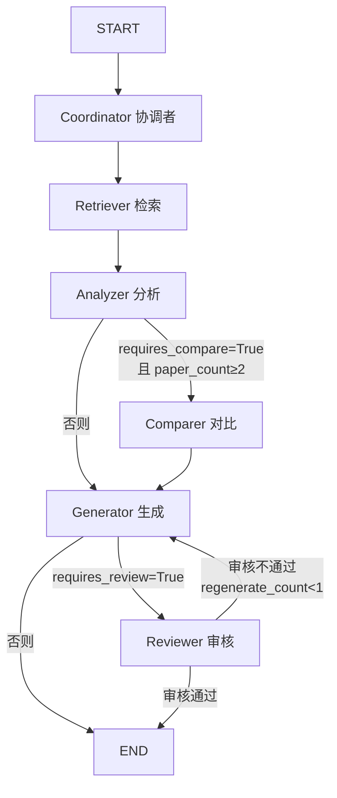

# Task42: 完整6-Agent LangGraph工作流

> **里程碑**: M4 / AM4：6-Agent协同与个性化引擎
> **版本**: v0.4
> **需求编号**: F3.1.1, F3.1.2, F3.1.3, F3.1.4

---

## 任务概述

将现有4-Agent LangGraph工作流（retrieve→analyze→generate→review）扩展为完整6-Agent工作流（Coordinator→Retriever→Analyzer→[Comparer]→Generator→Reviewer），实现条件分支和审核重试机制。

### 目标工作流拓扑



### 当前问题

| 文件 | 现状 | 缺失 |
|------|------|------|
| `graph.py` | 4-Agent工作流（retrieve→analyze→generate→review） | 缺少 coordinator 入口节点、comparer 条件节点、should_compare 条件函数 |
| `orchestrator.py` | NODE_ORDER 仅4个Agent | 缺少 coordinator/comparer 节点执行逻辑 |
| `agent.py` | _build_agent_instances() 仅构建3个Agent | 缺少 coordinator/comparer/reviewer 实例构建 |
| `WorkflowState` | 无 requires_compare/requires_review/coordinator_result | 条件分支无法基于 coordinator 输出决策 |

---

## 影响范围

### 涉及层级

- **python_ai_service**（仅此一层）

### 需修改文件

| 操作 | 文件 | 变更说明 |
|------|------|---------|
| **modify** | `Veritas/ai-service/app/agents/graph.py` | 核心变更：WorkflowState新增3字段 + coordinator_node/compare_node + should_compare + build_agent_graph重构 + run_workflow更新 |
| **modify** | `Veritas/ai-service/app/agents/orchestrator.py` | NODE_ORDER扩展为6 + run_workflow_stream新增coordinator/comparer执行逻辑 |
| **modify** | `Veritas/ai-service/app/api/endpoints/agent.py` | _build_agent_instances()新增3个Agent实例 |
| **modify** | `Veritas/ai-service/app/agents/__init__.py` | 新增导出 |
| **modify** | `Veritas/ai-service/tests/test_graph.py` | 适配6-Agent工作流 |
| **modify** | `Veritas/ai-service/tests/test_graph_integration.py` | 新增条件函数测试 + 6-Agent全链路测试 |

### 可直接复用的已有实现

| 文件 | 说明 |
|------|------|
| `coordinator.py` | CoordinatorAgent完整实现，直接集成到graph.py |
| `comparer.py` | ComparerAgent完整实现，直接集成到graph.py条件边 |
| `reviewer.py` | ReviewerAgent完整实现，graph.py已有review_node但agent.py未构建实例 |
| `base.py` | BaseAgent基类，不需修改 |

---

## 实现要求

### FR-001: WorkflowState 新增字段

```python
class WorkflowState(TypedDict):
    # ... 现有字段保持不变 ...
    requires_compare: bool          # 新增：由coordinator_node设置
    requires_review: bool           # 新增：由coordinator_node设置
    coordinator_result: Optional[Dict]  # 新增：存储coordinator完整输出
```

### FR-002: coordinator_node 节点函数

- 调用 `CoordinatorAgent.execute(input_data={query, analysis_type, paper_ids}, context={user_profile})`
- 将输出中的 `requires_compare`/`requires_review`/`sub_tasks` 写入 state
- 完整输出存入 `coordinator_result`
- 异常降级：`requires_compare=False, requires_review=True, sub_tasks=[], degraded=True`

### FR-003: compare_node 节点函数

- 调用 `ComparerAgent.execute(input_data={analysis_results}, context={user_profile})`
- 输出写入 `state.compare_result`
- 异常降级：`compare_result=None, degraded=True`

### FR-004: should_compare 条件函数

```python
def should_compare(state: WorkflowState) -> str:
    if state.get("requires_compare", False) and len(state.get("search_results", [])) >= 2:
        return "compare"
    return "generate"
```

### FR-005: build_agent_graph 重构

```
entry_point → coordinator
coordinator → retrieve（固定边）
retrieve → analyze（固定边）
analyzer → should_compare（条件边：compare | generate）
compare → generate（固定边）
generate → should_review（条件边：review | end）
review → should_regenerate（条件边：regenerate → generate | end）
```

### FR-006: run_workflow 更新

initial_state 新增默认值：`requires_compare=False, requires_review=False, coordinator_result=None`

### FR-007: _build_agent_instances 扩展

新增3个Agent实例构建：CoordinatorAgent、ComparerAgent、ReviewerAgent，personalization_service通过`getattr(events.app_state, 'personalization_service', None)`获取。

### FR-008: orchestrator.py 更新

- NODE_ORDER: `['coordinator', 'retriever', 'analyzer', 'comparer', 'generator', 'reviewer']`
- run_workflow_stream() 新增 coordinator 入口执行和 comparer 条件执行逻辑

### FR-009: __init__.py 导出更新

新增：CoordinatorAgent、ComparerAgent、ReviewerAgent、coordinator_node、compare_node、should_compare

### FR-010: 测试更新

- _make_initial_state() 新增3个字段默认值
- 新增 TestShouldCompare 测试类（3种场景）
- 更新 TestBuildAgentGraph 验证6个节点
- 更新 TestRunWorkflow 验证6-Agent端到端

---

## 降级策略

| 场景 | 降级行为 |
|------|---------|
| coordinator_node 失败 | requires_compare=False, requires_review=True, sub_tasks=[], degraded=True |
| compare_node 失败 | compare_result=None, degraded=True, generator使用analysis_results直接生成 |
| review_node 失败 | 跳过审核，标记approved=True, degraded=True |
| 多Agent失败(≥2) | degraded=True, 返回部分结果和degraded_reason |

---

## 验收标准

| 编号 | 验收标准 | 验证方式 |
|------|---------|---------|
| AC-001 | WorkflowState 包含3个新字段，现有字段不变 | 自动化测试 |
| AC-002 | build_agent_graph() 包含6个节点和正确的条件边拓扑 | 自动化测试 |
| AC-003 | should_compare 条件函数3种场景正确 | 自动化测试 |
| AC-004 | coordinator_node 正常/异常降级两种路径正确 | 自动化测试 |
| AC-005 | compare_node 正常/异常降级两种路径正确 | 自动化测试 |
| AC-006 | _build_agent_instances() 返回6个Agent实例 | 自动化测试 |
| AC-007 | orchestrator NODE_ORDER和run_workflow_stream()支持6-Agent | 自动化测试 |
| AC-008 | 6-Agent全链路集成测试通过（5种场景） | 自动化测试 |
| AC-009 | 所有已有测试无回归 | 自动化测试 |
| AC-010 | Agent超时30s/全流程120s/审核重试≤1次 | 代码审查 |
| AC-011 | __init__.py 导出包含新增符号 | 自动化测试 |

---

## 验证命令

```bash
# 全量测试
cd Veritas/ai-service && python -m pytest tests/test_graph.py tests/test_graph_integration.py -v

# should_compare 条件函数测试
cd Veritas/ai-service && python -m pytest tests/test_graph_integration.py::TestShouldCompare -v

# 6-Agent全链路集成测试
cd Veritas/ai-service && python -m pytest tests/test_graph_integration.py::TestFullWorkflow -v

# 导出验证
cd Veritas/ai-service && python -c "from app.agents import CoordinatorAgent, ComparerAgent, ReviewerAgent, should_compare; print('Import OK')"
```
