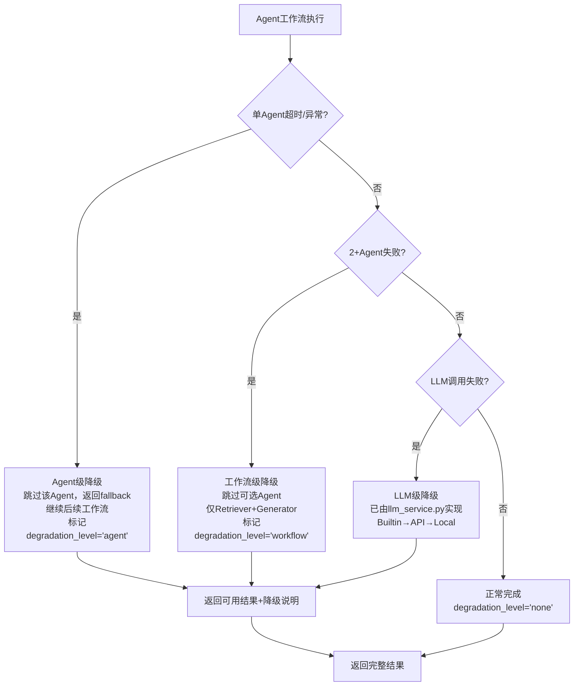

# Task43: Agent级 + 工作流级降级机制

## 项目信息

| 项目 | 内容 |
|------|------|
| **课题编号** | XH-202630 |
| **里程碑** | M4 / AM4：6-Agent协同与个性化引擎 |
| **版本** | v0.4 |
| **需求编号** | F3.1.5, F3.1.6 |
| **所属层级** | Python AI Service |

## 需求描述

在 `agents/graph.py` 中实现完整的二级降级机制：

1. **Agent级降级**：单Agent超时/异常时跳过该Agent，返回fallback结果，继续后续工作流
2. **工作流级降级**：多Agent失败时降级为仅 Retriever + Generator 的最小工作流

同时添加 `degraded_agents` 和 `degradation_level` 到 WorkflowState，在 `orchestrator.py` 中添加 `workflow_degraded` SSE 事件，确保降级后仍返回可用结果。

---

## 当前实现分析

### graph.py 现有降级

- 每个节点有基本 try-except，失败时设置 `degraded=True` 并 append errors
- `run_workflow()` 检查 `error_count >= 2` 设置 degraded status
- **缺少**：Agent级 skip-and-continue 逻辑（Comparer 失败时 `compare_result=None` 继续，Reviewer 失败时 auto-approve 继续）
- **缺少**：工作流级降级路径（2+Agent 失败 → 跳过 Analyzer/Comparer/Reviewer 直接到 Generator）
- **缺少**：`degraded_agents`、`degradation_level` 字段
- **缺少**：`_should_degrade_workflow()` 辅助函数

### orchestrator.py 现有降级

- `_run_node()` 捕获异常并 yield `agent_failed` 事件
- 设置 `self._degraded = True`，`_yield_final()` 根据 error_count 判断 degraded status
- **缺少**：工作流级降级路径
- **缺少**：`workflow_degraded` SSE 事件
- **缺少**：`agent_failed` 事件缺少 `degradation_level` 信息

### BaseAgent 已有降级（无需修改）

- `execute()` 超时 30s → `_fallback_result()` 返回 `{degraded: True, agent: name, error: str}`
- 异常 → `_fallback_result()` 返回同样的降级结果
- graph.py 节点函数需要正确检测 `result.get('degraded')` 并处理

---

## 降级层级设计



### Level 1: Agent级降级（单Agent失败）

| Agent | 降级行为 | fallback结果 |
|-------|---------|-------------|
| Retriever | `search_results=[]`，继续 | 空检索结果，后续Agent可处理 |
| Analyzer | `analysis_results=[]`，继续 | 空分析结果，Generator可处理 |
| Generator | 返回fallback报告文本 | `"综述生成过程中发生错误，请稍后重试。"` |
| Reviewer | auto-approve（`approved=True`），继续 | 跳过审核，不阻塞流程 |

**关键**：将失败Agent名称加入 `degraded_agents`，设置 `degradation_level='agent'`

### Level 2: 工作流级降级（多Agent失败）

- **触发条件**：`len(errors) >= 2`
- **降级路径**：跳过 Analyzer / Comparer / Reviewer，直接执行 Generator
- **输出标注**：`degradation_level='workflow'`，`degraded_agents` 包含所有失败Agent名称
- **SSE事件**：yield `workflow_degraded` 事件通知前端

### Level 3: LLM级降级（已实现，无需修改）

- `BuiltinLLMProvider` → `APILLMProvider` → `LocalLLMProvider`
- graph.py 只需正确处理 Agent 返回的 `degraded=True` 信号

---

## 修改文件清单

### 1. 修改 `Veritas/ai-service/app/agents/graph.py`

#### 1.1 扩展 WorkflowState

```python
class WorkflowState(TypedDict):
    # ... 现有字段 ...
    degraded_agents: List[str]       # 新增：降级的Agent名称列表
    degradation_level: str           # 新增：降级级别 'none'/'agent'/'workflow'
```

#### 1.2 新增 `_should_degrade_workflow()` 辅助函数

```python
def _should_degrade_workflow(state: WorkflowState) -> bool:
    """判断是否需要工作流级降级：errors>=2 时返回 True"""
    return len(state.get("errors", [])) >= 2
```

#### 1.3 增强各节点函数

每个节点函数需检测 `result.get('degraded')` 并正确处理：

- **retrieve_node**：Retriever 返回 degraded 时，`degraded_agents` 加入 `'retriever'`，`degradation_level='agent'`
- **analyze_node**：Analyzer 返回 degraded 时，`degraded_agents` 加入 `'analyzer'`，`degradation_level='agent'`
- **generate_node**：Generator 返回 degraded 时，`degraded_agents` 加入 `'generator'`，`degradation_level='agent'`，确保 report 不为空
- **review_node**：Reviewer 返回 degraded 时，auto-approve（`approved=True`），`degraded_agents` 加入 `'reviewer'`，`degradation_level='agent'`

#### 1.4 增强工作流图条件边

在 `build_agent_graph()` 中增加工作流级降级条件边：

- `retrieve` → `_should_degrade_workflow` → `generate`（跳过 analyze）或 `analyze`（正常）
- `analyze` → `_should_degrade_workflow` → `generate`（跳过 review）或 `generate`（正常，走 should_review 判断）

#### 1.5 增强 `run_workflow()` 返回结果

```python
return {
    # ... 现有字段 ...
    "degradation_level": degradation_level,  # 新增
    "degraded_agents": degraded_agents,      # 新增
}
```

### 2. 修改 `Veritas/ai-service/app/agents/orchestrator.py`

#### 2.1 新增 `_should_degrade_workflow()` 方法

```python
def _should_degrade_workflow(self) -> bool:
    """判断是否需要工作流级降级"""
    return len(self._errors) >= 2
```

#### 2.2 新增 `_degradation_level` 属性

```python
self._degradation_level: str = "none"  # 'none'/'agent'/'workflow'
self._degraded_agents: List[str] = []
```

#### 2.3 增强 `run_workflow_stream()` 工作流级降级路径

在每个 Agent 执行后检查 `_should_degrade_workflow()`：
- 若为 True → yield `workflow_degraded` 事件 → 跳过可选 Agent → 直接执行 Generator
- 若为 False → 继续正常流程

#### 2.4 新增 `workflow_degraded` SSE 事件

```python
self._make_event("workflow_degraded", {
    "analysisId": self.analysis_id,
    "degradedAgents": self._degraded_agents,
    "skippedAgents": ["analyzer", "reviewer"],  # 将被跳过的Agent
    "reason": f"多Agent失败({', '.join(self._degraded_agents)})，降级为最小工作流",
})
```

#### 2.5 增强 `agent_failed` 事件

```python
self._make_event("agent_failed", {
    # ... 现有字段 ...
    "degradationLevel": self._degradation_level,  # 新增
})
```

#### 2.6 增强 `analysis_completed` 事件

```python
self._make_event("analysis_completed", {
    # ... 现有字段 ...
    "degradationLevel": self._degradation_level,  # 新增
    "degradedAgents": self._degraded_agents,       # 新增
})
```

### 3. 新建 `Veritas/ai-service/tests/test_degradation.py`

降级机制测试，覆盖四种场景。

---

## 测试用例

### 单元测试

| 测试名 | 描述 | 覆盖场景 |
|--------|------|---------|
| `test_should_degrade_workflow_no_errors` | 无错误时返回 False | 正常流程 |
| `test_should_degrade_workflow_one_error` | 1个错误时返回 False | Agent级降级 |
| `test_should_degrade_workflow_two_errors` | 2个错误时返回 True | 工作流级降级 |
| `test_workflow_state_new_fields` | 新字段正确初始化 | 状态定义 |
| `test_retrieve_node_degraded_result` | Retriever降级处理 | Agent级降级 |
| `test_review_node_auto_approve_on_degradation` | Reviewer降级auto-approve | Agent级降级 |
| `test_generate_node_fallback_report` | Generator降级返回非空报告 | Agent级降级 |

### 集成测试

| 测试名 | 描述 | 覆盖场景 |
|--------|------|---------|
| `test_normal_workflow_no_degradation` | 正常流程 degradation_level='none' | 正常流程 |
| `test_single_agent_failure_agent_degradation` | 单Agent失败 Agent级降级 | Agent级降级 |
| `test_multi_agent_failure_workflow_degradation` | 多Agent失败 工作流级降级 | 工作流级降级 |
| `test_full_timeout_degradation` | 全流程超时降级 | 超时降级 |
| `test_orchestrator_workflow_degraded_event` | workflow_degraded SSE事件 | SSE事件 |
| `test_orchestrator_agent_failed_with_degradation_level` | agent_failed含degradationLevel | SSE事件 |
| `test_degraded_result_not_empty` | 降级后report不为空 | 降级保证 |

### 验证命令

```bash
# 降级测试
cd Veritas/ai-service && python -m pytest tests/test_degradation.py -v

# 已有集成测试
cd Veritas/ai-service && python -m pytest tests/test_graph_integration.py -v

# 全量测试
cd Veritas/ai-service && python -m pytest tests/ -v --ignore=tests/test_degradation.py
```

---

## 约束与禁止

| ID | 禁止行为 | 原因 | 严重度 |
|----|---------|------|--------|
| FA-001 | 输出伪代码或TODO注释 | 必须输出完整可执行代码 | critical |
| FA-002 | 修改需求范围外的模块 | 避免引入无关变更 | high |
| FA-003 | 降级后返回空结果 | 降级必须返回可用结果 | critical |
| FA-004 | 破坏已有4节点工作流 | 必须向后兼容 | high |
| FA-005 | 硬编码SSE事件格式 | 使用 `_make_event()` 统一构造 | medium |
| FA-006 | 忽略BaseAgent返回的degraded信号 | 必须正确处理 | high |
| FA-007 | 工作流级降级时仍执行可选Agent | 应跳过直接到Generator | high |
| FA-008 | Reviewer重试超过1次 | AGENT_MAX_REGENERATE=1 | critical |

---

## 验收标准

| ID | 验收条件 | 验证方式 |
|----|---------|---------|
| AC-001 | WorkflowState 包含 degraded_agents 和 degradation_level | 代码审查 |
| AC-002 | 各节点函数正确处理 degraded=True 结果 | 自动测试 |
| AC-003 | Reviewer 降级时 auto-approve | 自动测试 |
| AC-004 | `_should_degrade_workflow()` errors>=2 返回 True | 自动测试 |
| AC-005 | 工作流级降级跳过可选Agent直接到Generator | 自动测试 |
| AC-006 | orchestrator yield workflow_degraded SSE事件 | 自动测试 |
| AC-007 | agent_failed 事件包含 degradationLevel | 代码审查 |
| AC-008 | analysis_completed 事件包含 degradationLevel | 代码审查 |
| AC-009 | 降级后 report 不为空 | 自动测试 |
| AC-010 | run_workflow() 返回 degradation_level 和 degraded_agents | 自动测试 |
| AC-011 | 正常流程 degradation_level='none' | 自动测试 |
| AC-012 | 已有测试不受影响 | 自动测试 |
