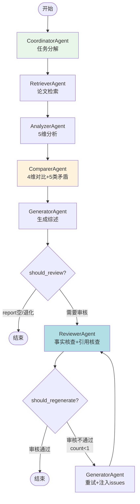

# Task44: SSE推送完善 + Agent状态数据结构

## 任务概述

| 项目 | 内容 |
|------|------|
| **版本** | v0.4 |
| **里程碑** | AM4：6-Agent协同与个性化引擎（Week 8 Day 6，M4） |
| **功能编号** | F3.5.1, F3.5.2, F3.1.4 |
| **涉及层级** | python_ai_service |
| **优先级** | P0 |

## 需求描述

完善 SSE 推送以支持 6-Agent 全量状态推送，扩展 AgentStateResponse 数据结构，更新 API 层和编排器层以适配完整的 6-Agent 工作流。具体包括：

1. **AgentStateResponse 扩展**：新增 error/started_at/completed_at/degraded 4 个字段
2. **AnalyzeResponse 扩展**：新增 degradation_level 字段
3. **_build_agent_instances() 扩展**：从 3 个 Agent 扩展到 6 个（+coordinator/comparer/reviewer）
4. **_convert_agent_states() 扩展**：映射新字段
5. **orchestrator.py NODE_ORDER 更新**：从 4 节点扩展到 6 节点（+coordinator/comparer）
6. **SSE 事件数据结构增强**：agent_started/agent_state_update/agent_completed/agent_failed/analysis_completed 均增加新字段
7. **新增 workflow_degraded SSE 事件**：Agent 失败后立即推送降级通知

### 核心目标

1. **6-Agent 全量 SSE 推送**：coordinator→retriever→analyzer→comparer→generator→reviewer 全链路事件
2. **Agent 状态数据结构完善**：error/startedAt/completedAt/degraded 字段补全
3. **降级等级量化**：degradationLevel（none/partial/severe/critical）+ degradedAgents 列表
4. **实时降级通知**：workflow_degraded 事件在 Agent 失败后立即推送
5. **SSE 事件数据增强**：每个事件类型增加语义化字段
6. **向后兼容**：不删除/重命名已有字段，新字段使用 Optional

### 关键约束

- SSE 事件 data 字段使用 **camelCase**（与 Java 端 JSON 解析器一致）
- 不修改 BaseAgent.execute() 核心逻辑
- 不破坏已有 SSE 事件格式（向后兼容）
- agent_completed 的 intermediateResult 使用**完整结果**而非截断摘要
- Agent 失败后立即 yield workflow_degraded 事件（不等 analysis_completed）

## 影响范围

| 操作 | 文件路径 | 说明 |
|------|---------|------|
| 修改 | `Veritas/ai-service/app/models/schemas.py` | AgentStateResponse +4字段，AnalyzeResponse +1字段 |
| 修改 | `Veritas/ai-service/app/agents/orchestrator.py` | NODE_ORDER 6节点 + coordinator/comparer 执行 + SSE事件增强 + workflow_degraded |
| 修改 | `Veritas/ai-service/app/api/endpoints/agent.py` | _build_agent_instances 6个 + _convert_agent_states 新字段 + degradation_level |
| 新建 | `Veritas/ai-service/tests/test_sse_agent_state_structure.py` | 6-Agent SSE事件完整性 + 新字段 + 降级场景测试 |

## 当前实现分析

### orchestrator.py 现状

```python
NODE_ORDER = ["retriever", "analyzer", "generator", "reviewer"]
# 缺少: coordinator, comparer
```

**SSE 事件 7 种**：agent_started / agent_state_update / agent_completed / agent_failed / analysis_completed / error / ping

**问题**：
- NODE_ORDER 缺少 coordinator 和 comparer
- agent_started 缺少 analysisType
- agent_state_update 缺少 degraded/errorMessage
- agent_completed 的 intermediateResult 使用截断摘要（200字符）
- agent_failed 缺少 errorType/degraded/fallback
- analysis_completed 缺少 degradationLevel/degradedAgents
- 无 workflow_degraded 实时降级事件

### agent.py 现状

```python
def _build_agent_instances() -> dict:
    # 仅构建 retriever/analyzer/generator 3个Agent
    return {"retriever": ..., "analyzer": ..., "generator": ...}

def _convert_agent_states(agent_states: dict) -> list[AgentStateResponse]:
    # 仅映射5个字段，缺少 error/started_at/completed_at/degraded
```

### schemas.py 现状

```python
class AgentStateResponse(BaseModel):
    agent_name: str    # alias="agentName"
    status: str
    progress: Optional[float] = None
    intermediate_result: Optional[str] = None  # alias="intermediateResult"
    duration_ms: Optional[int] = None           # alias="durationMs"
    # 缺少: error, started_at, completed_at, degraded

class AnalyzeResponse(BaseModel):
    # 缺少: degradation_level
```

### base.py AgentState（已有完整字段）

```python
@dataclass
class AgentState:
    name: str
    status: AgentStatus
    started_at: Optional[datetime] = None      # ✅ 已有
    completed_at: Optional[datetime] = None     # ✅ 已有
    duration_ms: Optional[int] = None
    progress: float = 0.0
    intermediate_result: Optional[str] = None
    error: Optional[str] = None                 # ✅ 已有

    def to_dict(self) -> dict:
        # ✅ 已输出 started_at/completed_at/error
```

**关键发现**：AgentState 已包含 started_at/completed_at/error，to_dict() 已输出，但 API 层和 SSE 层未使用这些字段。

## 6-Agent 工作流



## SSE 事件数据结构增强

### 事件类型总览（9种）

| 事件类型 | 触发时机 | 增强字段 |
|---------|---------|---------|
| `agent_started` | Agent 开始执行 | +analysisType |
| `agent_state_update` | Agent 状态变更 | +degraded, +errorMessage |
| `agent_completed` | Agent 正常完成 | +intermediateResult(完整), +degraded |
| `agent_failed` | Agent 执行失败 | +errorType, +degraded, +fallback |
| `analysis_completed` | 全流程结束 | +degradationLevel, +degradedAgents |
| `workflow_degraded` | **新增** Agent失败后立即推送 | degradedAgents, reason, fallbackMode |
| `review_rejected` | 审核不通过 | 已有 |
| `error` | 错误事件 | 已有 |
| `ping` | keep-alive | 已有 |

### agent_started 增强后

```json
{
  "agentName": "coordinator",
  "status": "running",
  "analysisId": "ana_20240616001",
  "timestamp": 1718505600000,
  "analysisType": "report"
}
```

### agent_state_update 增强后

```json
{
  "agentName": "analyzer",
  "status": "running",
  "progress": 0.5,
  "analysisId": "ana_20240616001",
  "intermediateResult": "正在分析第3篇论文...",
  "durationMs": 3000,
  "degraded": false,
  "errorMessage": null
}
```

### agent_completed 增强后

```json
{
  "agentName": "retriever",
  "status": "completed",
  "progress": 1.0,
  "analysisId": "ana_20240616001",
  "intermediateResult": "{\"papers\": [...], \"total\": 10}",
  "durationMs": 1200,
  "degraded": false
}
```

**关键变化**：intermediateResult 使用完整结果（`json.dumps(agent._last_result)`），而非截断到 200 字符的摘要。

### agent_failed 增强后

```json
{
  "agentName": "analyzer",
  "status": "failed",
  "analysisId": "ana_20240616001",
  "errorMessage": "Agent analyzer timed out after 30s",
  "durationMs": 30000,
  "errorType": "TimeoutError",
  "degraded": true,
  "fallback": "跳过分析，使用默认分析结果"
}
```

**errorType 取值**：

| 异常类型 | errorType |
|---------|-----------|
| asyncio.TimeoutError | `TimeoutError` |
| Agent not in instances | `AgentNotFound` |
| LLM API 调用失败 | `LLMError` |
| 其他异常 | `UnknownError` |

**fallback 取值**：

| Agent | fallback 描述 |
|-------|-------------|
| coordinator | "跳过任务分解，使用默认检索策略" |
| retriever | "使用默认检索结果" |
| analyzer | "跳过分析，使用原始论文信息" |
| comparer | "跳过对比分析" |
| generator | "使用简化模板生成报告" |
| reviewer | "跳过审核，直接输出" |

### analysis_completed 增强后

```json
{
  "analysisId": "ana_20240616001",
  "status": "degraded",
  "finalReport": "## 文献综述\n...",
  "degraded": true,
  "degradedReason": "Agent analyzer 失败，已降级处理",
  "totalDurationMs": 45000,
  "degradationLevel": "partial",
  "degradedAgents": ["analyzer"]
}
```

### workflow_degraded（新增）

```json
{
  "analysisId": "ana_20240616001",
  "degradedAgents": ["analyzer"],
  "reason": "Agent analyzer timed out after 30s",
  "fallbackMode": "skip_agent"
}
```

**fallbackMode 取值**：

| 失败Agent数 | fallbackMode | 说明 |
|-----------|-------------|------|
| 1 个 | `skip_agent` | 跳过失败Agent继续执行 |
| 2+ 个 | `single_agent` | 降级为单Agent模式（仅Retriever+Generator） |

## AgentStateResponse 扩展

```python
class AgentStateResponse(BaseModel):
    agent_name: str = Field(alias="agentName", description="Agent名称")
    status: str = Field(description="Agent状态: waiting/running/completed/failed")
    progress: Optional[float] = Field(default=None, description="执行进度(0.0-1.0)")
    intermediate_result: Optional[str] = Field(default=None, alias="intermediateResult", description="中间结果摘要")
    duration_ms: Optional[int] = Field(default=None, alias="durationMs", description="执行耗时(毫秒)")
    # === 新增字段 ===
    error: Optional[str] = Field(default=None, description="Agent错误信息")
    started_at: Optional[str] = Field(default=None, alias="startedAt", description="开始时间(ISO 8601)")
    completed_at: Optional[str] = Field(default=None, alias="completedAt", description="完成时间(ISO 8601)")
    degraded: Optional[bool] = Field(default=None, description="是否降级")

    model_config = ConfigDict(
        populate_by_name=True,
        json_schema_extra={
            "example": {
                "agentName": "retriever",
                "status": "completed",
                "progress": 1.0,
                "intermediateResult": "Found 10 papers",
                "durationMs": 1200,
                "error": None,
                "startedAt": "2024-01-01T00:00:00",
                "completedAt": "2024-01-01T00:00:01",
                "degraded": False,
            }
        },
    )
```

## AnalyzeResponse 扩展

```python
class AnalyzeResponse(BaseModel):
    # ... 已有字段 ...
    degradation_level: Optional[str] = Field(
        default=None,
        alias="degradationLevel",
        description="降级等级: none/partial/severe/critical",
    )
```

**degradationLevel 计算规则**：

| 失败Agent数 | degradationLevel | 含义 |
|-----------|-----------------|------|
| 0 | `none` | 全部Agent正常 |
| 1 | `partial` | 部分降级，结果基本可用 |
| 2 | `severe` | 严重降级，结果可能不完整 |
| 3+ | `critical` | 极严重降级，建议重试 |

## _build_agent_instances() 扩展

```python
def _build_agent_instances() -> dict:
    if events.app_state.llm_service is None or events.app_state.llm_service.status != "loaded":
        raise ModelNotLoadedException("LLM服务未就绪")
    if events.app_state.prompt_manager is None:
        raise ModelNotLoadedException("Prompt管理器未就绪")
    if events.app_state.search_service is None:
        raise ModelNotLoadedException("搜索服务未就绪")

    personalization = getattr(events.app_state, "personalization_service", None)

    coordinator = CoordinatorAgent(
        llm_service=events.app_state.llm_service,
        prompt_manager=events.app_state.prompt_manager,
        search_service=events.app_state.search_service,
        personalization_service=personalization,
    )

    retriever = RetrieverAgent(
        llm_service=events.app_state.llm_service,
        prompt_manager=events.app_state.prompt_manager,
        search_service=events.app_state.search_service,
        reranker=events.app_state.reranker,
    )

    analyzer = AnalyzerAgent(
        llm_service=events.app_state.llm_service,
        prompt_manager=events.app_state.prompt_manager,
        personalization_service=personalization,
    )

    comparer = ComparerAgent(
        llm_service=events.app_state.llm_service,
        prompt_manager=events.app_state.prompt_manager,
        personalization_service=personalization,
    )

    generator = GeneratorAgent(
        llm_service=events.app_state.llm_service,
        prompt_manager=events.app_state.prompt_manager,
        personalization_service=personalization,
    )

    reviewer = ReviewerAgent(
        llm_service=events.app_state.llm_service,
        prompt_manager=events.app_state.prompt_manager,
        personalization_service=personalization,
    )

    return {
        "coordinator": coordinator,
        "retriever": retriever,
        "analyzer": analyzer,
        "comparer": comparer,
        "generator": generator,
        "reviewer": reviewer,
    }
```

## _convert_agent_states() 扩展

```python
def _convert_agent_states(agent_states: dict) -> list[AgentStateResponse]:
    result = []
    for agent_name, state_dict in agent_states.items():
        status = state_dict.get("status", "unknown")
        is_degraded = status == "failed" or state_dict.get("degraded", False)

        result.append(
            AgentStateResponse(
                agent_name=agent_name,
                status=status,
                progress=state_dict.get("progress"),
                intermediate_result=state_dict.get("intermediate_result"),
                duration_ms=state_dict.get("duration_ms"),
                # 新增字段
                error=state_dict.get("error"),
                started_at=state_dict.get("started_at"),
                completed_at=state_dict.get("completed_at"),
                degraded=is_degraded,
            )
        )
    return result
```

## orchestrator.py 关键修改

### NODE_ORDER 更新

```python
class AgentOrchestrator:
    NODE_ORDER = ["coordinator", "retriever", "analyzer", "comparer", "generator", "reviewer"]
```

### run_workflow_stream() 增加 coordinator 和 comparer

```python
async def run_workflow_stream(self, request: AnalyzeRequest) -> AsyncIterator[Dict[str, str]]:
    try:
        user_profile_dict = {}
        if request.user_profile is not None:
            user_profile_dict = request.user_profile.model_dump(by_alias=False)

        # === Coordinator (新增) ===
        async for event in self._run_node(
            node_name="coordinator",
            input_data={"topic": request.topic, "paper_ids": request.paper_ids},
            context={"user_profile": user_profile_dict},
        ):
            if self._should_skip_event(int(event["id"])):
                continue
            self._update_event_time()
            yield event

        coordinator = self.agent_instances.get("coordinator")
        coordinator_tasks = []
        if coordinator and coordinator.state.status == AgentStatus.COMPLETED:
            coord_result = self._get_last_result(coordinator, None, {})
            if isinstance(coord_result, dict):
                coordinator_tasks = coord_result.get("tasks", [])

        # === Retriever ===
        # ... (已有逻辑，input_data可使用coordinator_tasks) ...

        # === Analyzer ===
        # ... (已有逻辑) ...

        # === Comparer (新增) ===
        async for event in self._run_node(
            node_name="comparer",
            input_data={"analysis_results": analysis_results},
            context={"user_profile": user_profile_dict},
        ):
            if self._should_skip_event(int(event["id"])):
                continue
            self._update_event_time()
            yield event

        comparer = self.agent_instances.get("comparer")
        compare_result = None
        if comparer and comparer.state.status == AgentStatus.COMPLETED:
            compare_result = self._get_last_result(comparer, None, {})

        # === Generator ===
        # input_data 增加 compare_result
        async for event in self._run_node(
            node_name="generator",
            input_data={
                "analysis_results": analysis_results,
                "compare_result": compare_result,
            },
            context={"user_profile": user_profile_dict},
        ):
            # ...

        # === Reviewer (已有) ===
        # ...
```

### _run_node() SSE 事件增强

```python
async def _run_node(self, node_name, input_data, context):
    agent = self.agent_instances.get(node_name)

    if agent is None:
        # agent_failed 增强
        yield self._make_event("agent_failed", {
            "agentName": node_name,
            "status": "failed",
            "analysisId": self.analysis_id,
            "errorMessage": f"{node_name} Agent not found",
            "errorType": "AgentNotFound",
            "degraded": True,
            "fallback": FALLBACK_MESSAGES.get(node_name, "使用默认结果"),
        })
        # workflow_degraded (新增)
        yield self._make_event("workflow_degraded", {
            "analysisId": self.analysis_id,
            "degradedAgents": [node_name],
            "reason": f"{node_name} Agent not found",
            "fallbackMode": "skip_agent" if len(self._errors) < 2 else "single_agent",
        })
        yield self._make_event("error", { ... })
        self._errors.append({"agent": node_name, "error": "Agent not found"})
        self._degraded = True
        return

    # agent_started 增强：+analysisType
    yield self._make_event("agent_started", {
        "agentName": node_name,
        "status": "running",
        "analysisId": self.analysis_id,
        "timestamp": int(datetime.now().timestamp() * 1000),
        "analysisType": self._analysis_type,  # 新增
    })

    # agent_state_update 增强：+degraded, +errorMessage
    yield self._make_event("agent_state_update", {
        "agentName": node_name,
        "status": "running",
        "progress": 0.1,
        "analysisId": self.analysis_id,
        "intermediateResult": "",
        "durationMs": 0,
        "degraded": False,       # 新增
        "errorMessage": None,    # 新增
    })

    try:
        result = await agent.execute(input_data=input_data, context=context)
        agent._last_result = result
        state_dict = agent.state.to_dict()

        if agent.state.status == AgentStatus.FAILED:
            # agent_failed 增强：+errorType, +degraded, +fallback
            error_type = self._classify_error(agent.state.error)
            yield self._make_event("agent_failed", {
                "agentName": state_dict.get("name", node_name),
                "status": "failed",
                "analysisId": self.analysis_id,
                "errorMessage": agent.state.error or "Agent 执行失败",
                "durationMs": state_dict.get("duration_ms"),
                "errorType": error_type,                          # 新增
                "degraded": True,                                 # 新增
                "fallback": FALLBACK_MESSAGES.get(node_name, "使用默认结果"),  # 新增
            })
            # workflow_degraded (新增)
            degraded_agents = [e["agent"] for e in self._errors] + [node_name]
            yield self._make_event("workflow_degraded", {
                "analysisId": self.analysis_id,
                "degradedAgents": degraded_agents,
                "reason": agent.state.error or "unknown",
                "fallbackMode": "skip_agent" if len(degraded_agents) < 2 else "single_agent",
            })
            yield self._make_event("error", { ... })
            self._errors.append({"agent": node_name, "error": agent.state.error or "unknown"})
            self._degraded = True
        else:
            # agent_completed 增强：+完整intermediateResult, +degraded
            is_degraded = bool(result.get("degraded", False)) if isinstance(result, dict) else False
            yield self._make_event("agent_completed", {
                "agentName": state_dict.get("name", node_name),
                "status": state_dict.get("status", "completed"),
                "progress": 1.0,
                "analysisId": self.analysis_id,
                "intermediateResult": json.dumps(result, ensure_ascii=False) if isinstance(result, dict) else str(result),  # 完整结果
                "durationMs": state_dict.get("duration_ms"),
                "degraded": is_degraded,  # 新增
            })

    except Exception as e:
        # agent_failed 增强
        error_type = self._classify_error(str(e))
        yield self._make_event("agent_failed", {
            "agentName": node_name,
            "status": "failed",
            "analysisId": self.analysis_id,
            "errorMessage": str(e)[:200],
            "durationMs": state_dict.get("duration_ms"),
            "errorType": error_type,
            "degraded": True,
            "fallback": FALLBACK_MESSAGES.get(node_name, "使用默认结果"),
        })
        # workflow_degraded (新增)
        degraded_agents = [err["agent"] for err in self._errors] + [node_name]
        yield self._make_event("workflow_degraded", {
            "analysisId": self.analysis_id,
            "degradedAgents": degraded_agents,
            "reason": str(e)[:200],
            "fallbackMode": "skip_agent" if len(degraded_agents) < 2 else "single_agent",
        })
        # ...
```

### _yield_final() 增强

```python
async def _yield_final(self, report: Optional[str]) -> AsyncIterator[Dict[str, str]]:
    error_count = len(self._errors)
    degraded_agents = [e.get("agent", "unknown") for e in self._errors]

    # 计算 degradationLevel
    if error_count == 0:
        degradation_level = "none"
    elif error_count == 1:
        degradation_level = "partial"
    elif error_count == 2:
        degradation_level = "severe"
    else:
        degradation_level = "critical"

    if error_count >= 2 or self._degraded:
        final_status = "degraded"
        # ... (已有降级原因逻辑) ...
    else:
        final_status = "completed"

    yield self._make_event("analysis_completed", {
        "analysisId": self.analysis_id,
        "status": final_status,
        "finalReport": report or "（无报告）",
        "degraded": self._degraded,
        "degradedReason": self._degraded_reason,
        "totalDurationMs": int((datetime.now() - self._start_time).total_seconds() * 1000),
        "degradationLevel": degradation_level,    # 新增
        "degradedAgents": degraded_agents,         # 新增
    })
```

### 辅助常量和方法

```python
# Agent降级回退描述
FALLBACK_MESSAGES = {
    "coordinator": "跳过任务分解，使用默认检索策略",
    "retriever": "使用默认检索结果",
    "analyzer": "跳过分析，使用原始论文信息",
    "comparer": "跳过对比分析",
    "generator": "使用简化模板生成报告",
    "reviewer": "跳过审核，直接输出",
}

class AgentOrchestrator:
    def __init__(self, ...):
        # ...
        self._analysis_type: str = "report"  # 新增，从request获取

    @staticmethod
    def _classify_error(error_message: str) -> str:
        """根据错误信息分类错误类型"""
        if not error_message:
            return "UnknownError"
        msg = error_message.lower()
        if "timeout" in msg or "timed out" in msg:
            return "TimeoutError"
        if "not found" in msg:
            return "AgentNotFound"
        if "llm" in msg or "api" in msg or "model" in msg:
            return "LLMError"
        return "UnknownError"
```

## 跨系统字段映射

| Java 字段 | Python 字段 | JSON 字段 | 说明 |
|----------|------------|---------|------|
| `error` | `error` | `error` | Agent错误信息 |
| `startedAt` | `started_at` | `startedAt` | ISO 8601 开始时间 |
| `completedAt` | `completed_at` | `completedAt` | ISO 8601 完成时间 |
| `degraded` | `degraded` | `degraded` | 是否降级 |
| `degradationLevel` | `degradation_level` | `degradationLevel` | 降级等级 |
| `degradedAgents` | `degraded_agents` | `degradedAgents` | 降级Agent列表 |
| `errorType` | `error_type` | `errorType` | 错误类型分类 |
| `fallback` | `fallback` | `fallback` | 降级回退描述 |
| `fallbackMode` | `fallback_mode` | `fallbackMode` | 降级模式 |
| `analysisType` | `analysis_type` | `analysisType` | 分析类型 |

## 测试覆盖

### 单元测试（pytest，10 个用例）

| 测试名称 | 覆盖场景 |
|---------|---------|
| test_agent_state_response_new_fields | 正常流程（含新字段） |
| test_agent_state_response_camelcase_alias | 正常流程（camelCase别名） |
| test_analyze_response_degradation_level | 正常流程（degradationLevel字段） |
| test_degradation_level_calculation | 边界条件（0/1/2/3+降级等级） |
| test_build_agent_instances_six_agents | 正常流程（6个Agent实例） |
| test_convert_agent_states_new_fields | 正常流程（新字段映射） |
| test_sse_agent_started_has_analysis_type | 正常流程（analysisType字段） |
| test_sse_agent_completed_has_full_intermediate_result | 正常流程（完整intermediateResult） |
| test_sse_agent_failed_has_error_type_and_fallback | 异常流程（errorType/fallback） |
| test_sse_workflow_degraded_event | 降级流程（workflow_degraded事件） |

### 集成测试（pytest，4 个用例）

| 测试名称 | 覆盖场景 |
|---------|---------|
| test_sse_six_agents_full_workflow | 6-Agent全链路SSE事件序列 |
| test_sse_degradation_level_in_final_event | 降级等级在最终事件中正确 |
| test_sse_workflow_degraded_on_agent_failure | Agent失败后workflow_degraded事件 |
| test_sse_all_event_types_complete | 全部9种事件类型覆盖 |

## 验证命令

```bash
# 1. 新测试
cd /Users/achieve/Documents/AchiEVE_MacBook_Air/Veritas(求真)/Veritas/ai-service
python -m pytest tests/test_sse_agent_state_structure.py -v

# 2. 已有测试回归
python -m pytest tests/ -v --ignore=tests/test_sse_agent_state_structure.py

# 3. AgentStateResponse 新字段验证
python -c "
from app.models.schemas import AgentStateResponse
r = AgentStateResponse(
    agentName='retriever', status='completed',
    error=None, startedAt='2024-01-01T00:00:00',
    completedAt='2024-01-01T00:00:01', degraded=False
)
d = r.model_dump(by_alias=True)
assert 'error' in d and 'startedAt' in d and 'completedAt' in d and 'degraded' in d
print('AgentStateResponse OK:', d)
"

# 4. AnalyzeResponse degradationLevel 验证
python -c "
from app.models.schemas import AnalyzeResponse
r = AnalyzeResponse(analysisId='test', status='degraded', degradationLevel='partial')
d = r.model_dump(by_alias=True)
assert 'degradationLevel' in d
print('AnalyzeResponse OK:', d)
"

# 5. SSE 流验证（需启动服务）
curl -N -X POST http://localhost:8000/api/agent/analyze/stream \
  -H 'Content-Type: application/json' \
  -d '{"topic":"transformer","userId":"u1","analysisType":"report"}' 2>&1 | head -100
```

## 验收标准

- [x] AC-001: AgentStateResponse 包含 error/startedAt/completedAt/degraded 新字段，camelCase 别名正确
- [x] AC-002: AnalyzeResponse 包含 degradationLevel 字段，降级等级计算正确
- [x] AC-003: _build_agent_instances() 返回 6 个 Agent 实例
- [x] AC-004: _convert_agent_states() 映射新字段
- [x] AC-005: orchestrator.py NODE_ORDER 包含 6 个节点，按 6-Agent 顺序执行
- [x] AC-006: agent_started 事件包含 analysisType 字段
- [x] AC-007: agent_completed 事件 intermediateResult 为完整结果（非截断），包含 degraded 字段
- [x] AC-008: agent_failed 事件包含 errorType/degraded/fallback 字段
- [x] AC-009: analysis_completed 事件包含 degradationLevel 和 degradedAgents 字段
- [x] AC-010: workflow_degraded 事件在 Agent 失败后立即推送
- [x] AC-011: 已有 SSE 事件格式向后兼容，不删除或重命名已有字段
- [x] AC-012: 已有测试全部通过，无回归问题

## 关键设计决策

### 1. 为什么 intermediateResult 使用完整结果而非截断摘要？

| 截断摘要（200字符） | 完整结果 |
|-----------------|---------|
| Java 端无法获取 Agent 详细输出 | Java 端可解析完整 JSON 结果 |
| 前端无法展示 Agent 执行详情 | 前端可展示论文列表/分析结果等 |
| 调试困难 | 调试友好 |

**注意**：完整结果可能较大（如检索 20 篇论文），但 SSE 事件无大小限制，且 Java 端可按需截断。

### 2. 为什么新增 workflow_degraded 事件而非仅在 analysis_completed 中体现？

| 仅 analysis_completed | + workflow_degraded |
|---------------------|---------------------|
| 前端需等到全流程结束才知降级 | 前端可实时感知降级并提示用户 |
| 无法在流程中调整 UI | 可在流程中显示降级提示 |
| 用户体验差 | 用户体验好 |

workflow_degraded 是**实时通知**，analysis_completed 中的 degradationLevel 是**最终汇总**。

### 3. 为什么 degradationLevel 用 4 级而非 2 级？

| 2 级（normal/degraded） | 4 级（none/partial/severe/critical） |
|----------------------|----------------------------------|
| 无法区分降级严重程度 | 可精确表达降级程度 |
| 前端无法差异化展示 | 前端可根据等级调整提示样式 |
| 无法指导重试策略 | 可根据等级决定是否建议重试 |

4 级降级对应前端展示策略：
- `none`：正常展示
- `partial`：黄色提示"部分结果可能不完整"
- `severe`：橙色警告"结果严重不完整，建议重新分析"
- `critical`：红色错误"分析失败，请重试"

### 4. 为什么 errorType 需要分类？

| 不分类 | 分类 |
|-------|------|
| 前端无法区分超时和 API 错误 | 前端可针对性提示 |
| 无法统计错误类型分布 | 可监控超时率/API 错误率 |
| 无法指导重试策略 | 超时→建议重试，API错误→检查配置 |

## 上下游关系

```
Java 后端 (AnalysisRequest)
       ↓ DTO: userProfile + analysisType
Python AI 服务
       ↓
_build_agent_instances() → 6个Agent实例
       ↓
AgentOrchestrator.run_workflow_stream()
       ↓
Coordinator → Retriever → Analyzer → Comparer → Generator → Reviewer
       ↓ SSE事件流（9种事件类型）
       ↓ agent_started(+analysisType)
       ↓ agent_state_update(+degraded+errorMessage)
       ↓ agent_completed(+完整intermediateResult+degraded)
       ↓ agent_failed(+errorType+degraded+fallback)
       ↓ workflow_degraded(新增：实时降级通知)
       ↓ analysis_completed(+degradationLevel+degradedAgents)
       ↓
Java WebClient.stream() → SSE转发 → 前端 useSSE
       ↓
前端根据 degradationLevel 调整UI展示
```

## 参考文档

- [AI服务模块系统架构文档 §4.4.1 SSE事件格式](file:///Users/achieve/Documents/AchiEVE_MacBook_Air/Veritas(求真)/docs/ai-service/AI服务模块系统架构文档.md)
- [AI服务模块系统架构文档 §5.5 LangGraph工作流](file:///Users/achieve/Documents/AchiEVE_MacBook_Air/Veritas(求真)/docs/ai-service/AI服务模块系统架构文档.md)
- [AI服务模块系统架构文档 §5.7 降级策略](file:///Users/achieve/Documents/AchiEVE_MacBook_Air/Veritas(求真)/docs/ai-service/AI服务模块系统架构文档.md)
- [AI服务模块项目里程碑文档 §6.2 Week 8 Day 6](file:///Users/achieve/Documents/AchiEVE_MacBook_Air/Veritas(求真)/docs/ai-service/AI服务模块项目里程碑文档.md)
- [Task25 SSE基础推送](file:///Users/achieve/Documents/AchiEVE_MacBook_Air/Veritas(求真)/json_prompt/ai-service/task25_sse_basic_push/prompt.md)
- [Task30 SSE稳定性+断线重连](file:///Users/achieve/Documents/AchiEVE_MacBook_Air/Veritas(求真)/json_prompt/ai-service/task30_sse_stability_reconnect/prompt.md)
- [Task38 审核重试工作流集成](file:///Users/achieve/Documents/AchiEVE_MacBook_Air/Veritas(求真)/json_prompt/ai-service/task38_review_retry_graph_integration/prompt.md)
- [AGENTS.md](file:///Users/achieve/Documents/AchiEVE_MacBook_Air/Veritas(求真)/AGENTS.md)

## 下一步建议

1. **AM4 阶段收尾**: 跑完 6-Agent 全链路集成测试 + SSE 事件完整性验证
2. **Java 后端适配**: 更新 Java 端 SSE 解析器以处理新字段（degradationLevel/degradedAgents/errorType 等）
3. **前端适配**: 更新 useSSE 事件处理器，根据 degradationLevel 调整 UI 展示策略
4. **未来增强** (AM5+):
   - SSE 事件压缩（对大 intermediateResult 使用 gzip）
   - 降级事件持久化到 MySQL（用于质量分析和监控）
   - 降级等级可配置化（阈值可通过环境变量调整）
   - 引入 SSE 事件版本号（eventVersion 字段，便于前端兼容性处理）
   - Agent 执行时间预测（基于历史数据，在 agent_started 中预估 durationMs）
   - 实时进度条（agent_state_update 更频繁推送 progress 更新）
   - 降级自动恢复（检测到 Agent 恢复后推送 workflow_recovered 事件）
