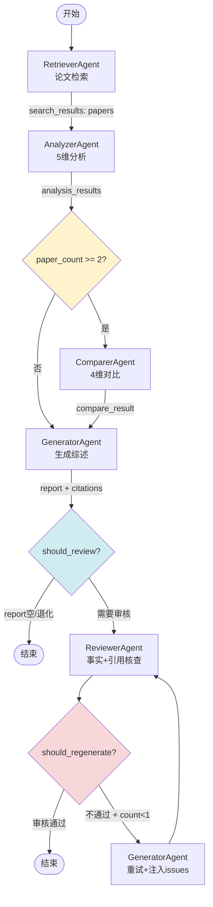
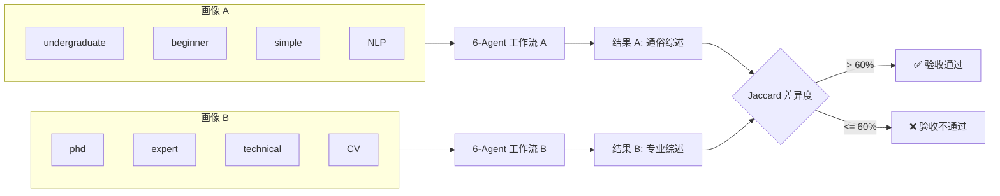

# Task45: 端到端集成测试 + 个性化差异验证

## 任务概述

| 项目 | 内容 |
|------|------|
| **版本** | v0.4 |
| **里程碑** | M4 / AM4：6-Agent协同与个性化引擎（Week 8 Day 7） |
| **功能编号** | F3.1.7, F3.4.3, F3.5.3 |
| **涉及层级** | python_ai_service |
| **优先级** | P0 |

## 需求描述

编写端到端集成测试验证 6-Agent 工作流完整运行，验证个性化差异度 > 60%（同一主题不同画像输出差异），验证 Agent 级和工作流级降级机制，验证 SSE 事件完整性，验证跨 Agent 数据流正确性。

本任务是 AM4 里程碑 Week 8 Day 7 的收尾集成测试任务，汇总验证 task32-44 所有实现。

### 核心目标

1. **6-Agent 端到端集成测试**：完整 pipeline（coordinator→retriever→analyzer→[comparer]→generator→reviewer）
2. **个性化差异验证**：同一主题，极端画像输出差异度 > 60%
3. **降级集成测试**：Agent 级 + 工作流级 + 超时 + Reviewer 降级
4. **SSE 事件完整性测试**：6-Agent 工作流事件序列完整且有序
5. **跨 Agent 数据流验证**：上游输出正确传递到下游输入

### 关键约束

- 测试使用 mock 避免调用真实 LLM API 和搜索服务
- 所有测试必须确定性（mock 返回固定值，无随机性）
- 扩展 test_degradation.py 时仅新增测试类/方法，不修改已有断言
- 不修改 app 层业务代码（本任务仅编写测试）
- comparer 条件分支当前 graph.py 未实现，测试中验证预期行为即可

## 影响范围

| 操作 | 文件路径 | 说明 |
|------|---------|------|
| 新建 | `Veritas/ai-service/tests/test_6agent_e2e.py` | 6-Agent 端到端集成测试 |
| 新建 | `Veritas/ai-service/tests/test_personalization_difference.py` | 个性化差异验证测试 |
| 修改 | `Veritas/ai-service/tests/test_degradation.py` | 扩展降级集成测试（+4 测试） |
| 新建 | `Veritas/ai-service/tests/test_sse_6agent_completeness.py` | SSE 事件完整性测试 |

## 现有测试分析

### 已有测试覆盖

| 测试文件 | 覆盖范围 | 缺失 |
|---------|---------|------|
| test_graph_integration.py | should_review/should_regenerate、review_node、审核通过/不通过/重试 | 缺少完整 6-Agent 数据流验证、WorkflowState 转换验证 |
| test_personalization_e2e.py | 6-Agent build_prompt()个性化注入、差异度>0.6、4维度生效 | 缺少通过完整工作流生成结果的差异验证 |
| test_degradation.py | LLM 级降级、Agent 超时、多 Agent 失败 | 缺少 Reviewer 降级自动通过、Agent 级降级工作流继续 |
| test_sse_basic_push.py | SSE 事件格式、camelCase、事件序列 | 缺少 6-Agent 完整事件、review_rejected 事件、降级事件 |

### 本任务新增测试

| 测试文件 | 新增测试 | 数量 |
|---------|---------|------|
| test_6agent_e2e.py | 全链路 pipeline、条件分支、审核重试、跨 Agent 数据流、WorkflowState 转换 | 5 |
| test_personalization_difference.py | 差异度 E2E、get_personalization_diff、术语密度差异、风格差异 | 4 |
| test_degradation.py | Agent 级降级、工作流级降级、超时跳过、Reviewer 降级 | 4 |
| test_sse_6agent_completeness.py | 事件完整性、降级事件、审核拒绝事件、事件顺序 | 4 |

## 1. 端到端 6-Agent 集成测试

### 1.1 完整 Pipeline 测试

```python
@pytest.mark.asyncio
async def test_full_6agent_pipeline():
    """6-Agent 端到端全链路测试

    验证：coordinator→retriever→analyzer→generator→reviewer
    WorkflowState 字段正确流转
    """
    # Mock 所有 Agent
    mock_coordinator = _make_mock_agent("coordinator", {"sub_tasks": ["检索NLP论文", "分析方法论"]})
    mock_retriever = _make_mock_agent("retriever", {"papers": [{"paper_id": "p1", "title": "Paper1"}]})
    mock_analyzer = _make_mock_agent("analyzer", {"analysis_results": [{"paper_id": "p1", "summary": "分析结果"}]})
    mock_generator = _make_mock_agent("generator", {"report": "## 综述\n内容", "citation_list": []})
    mock_reviewer = _make_mock_agent("reviewer", {"approved": True, "issues": [], "suggestions": []})

    agent_instances = {
        "retriever": mock_retriever,
        "analyzer": mock_analyzer,
        "generator": mock_generator,
        "reviewer": mock_reviewer,
    }

    compiled_graph = build_agent_graph(agent_instances)
    initial_state = _make_initial_state(query="Transformer", user_profile={})

    result = await compiled_graph.ainvoke(initial_state)

    # 验证 WorkflowState 字段
    assert result["search_results"] is not None  # retriever 输出
    assert result["analysis_results"] is not None  # analyzer 输出
    assert result["report"] is not None  # generator 输出
    assert result["review_result"] is not None  # reviewer 输出
    assert result["review_result"]["approved"] is True
```

### 1.2 条件分支测试

```python
@pytest.mark.asyncio
async def test_comparer_skipped_when_few_papers():
    """paper_count < 2 时 comparer 被跳过

    当前 graph.py 未包含 comparer 节点，
    验证 compare_result=None（comparer 未执行）
    """
    mock_retriever = _make_mock_agent("retriever", {"papers": [{"paper_id": "p1"}]})
    # ... 其他 mock

    result = await compiled_graph.ainvoke(initial_state)
    assert result["compare_result"] is None  # comparer 未执行
```

### 1.3 审核重试闭环测试

```python
@pytest.mark.asyncio
async def test_review_retry_loop():
    """审核不通过 → Generator 重试 → Reviewer 二次通过

    验证：
    - reviewer 被调用 2 次
    - generator 被调用 2 次
    - regenerate_count = 1
    - 最终 approved = True
    """
    call_count = {"reviewer": 0, "generator": 0}

    async def reviewer_execute(input_data, context):
        call_count["reviewer"] += 1
        if call_count["reviewer"] == 1:
            return {"approved": False, "issues": [...], "suggestions": [...]}
        return {"approved": True, "issues": [], "suggestions": []}

    async def generator_execute(input_data, context):
        call_count["generator"] += 1
        # 第 2 次调用应包含 retry_context
        if call_count["generator"] == 2:
            assert "retry_context" in input_data
        return {"report": "修正后的综述", "citation_list": []}

    # ... 构建工作流并执行

    assert call_count["reviewer"] == 2
    assert call_count["generator"] == 2
    assert result["regenerate_count"] == 1
    assert result["review_result"]["approved"] is True
```

### 1.4 跨 Agent 数据流验证

```python
@pytest.mark.asyncio
async def test_cross_agent_data_flow():
    """验证每个 Agent 的 input_data 包含上游 Agent 的输出

    数据流：
    - retriever output (papers) → analyzer input
    - analyzer output (analysis_results) → generator input
    - generator output (report) → reviewer input
    - reviewer output (issues/suggestions) → generator retry input
    """
    captured_inputs = {}

    async def capturing_execute(agent_name):
        async def execute(input_data, context):
            captured_inputs[agent_name] = input_data
            return mock_results[agent_name]
        return execute

    # ... 构建工作流并执行

    # 验证 analyzer 输入包含 papers
    assert "papers" in captured_inputs["analyzer"]
    # 验证 generator 输入包含 analysis_results
    assert "analysis_results" in captured_inputs["generator"]
    # 验证 reviewer 输入包含 report
    assert "report" in captured_inputs["reviewer"]
```

### 1.5 WorkflowState 转换验证

```python
@pytest.mark.asyncio
async def test_workflow_state_transitions():
    """验证 WorkflowState 在每个阶段正确更新

    initial → retrieve: search_results 更新
    retrieve → analyze: analysis_results 更新
    analyze → generate: report/citations 更新
    generate → review: review_result 更新
    最终: completed_at 非空
    """
    # ... 执行工作流

    result = await compiled_graph.ainvoke(initial_state)

    # 验证最终 state
    assert result["search_results"] != []  # retriever 已执行
    assert result["analysis_results"] != []  # analyzer 已执行
    assert result["report"] is not None  # generator 已执行
    assert result["review_result"] is not None  # reviewer 已执行
    assert result["completed_at"] is not None  # 已完成
    assert result["errors"] == []  # 无错误
    assert result["degraded"] is False  # 未降级
```

## 2. 个性化差异验证测试

### 2.1 极端画像差异度 E2E

```python
PROFILE_BEGINNER = {
    "education_level": "undergraduate",
    "knowledge_level": "beginner",
    "preferred_style": "simple",
    "research_field": "NLP",
}

PROFILE_EXPERT = {
    "education_level": "phd",
    "knowledge_level": "expert",
    "preferred_style": "technical",
    "research_field": "CV",
}

@pytest.mark.asyncio
async def test_personalization_diversity_e2e():
    """同一主题，不同画像，通过完整工作流生成结果，差异度 > 60%

    方法：
    1. 使用 Profile A 运行完整工作流 → result_a
    2. 使用 Profile B 运行完整工作流 → result_b
    3. 计算 Jaccard 距离 = 1 - |A ∩ B| / |A ∪ B|
    4. 验证差异度 > 0.6
    """
    # Mock Agent 根据 user_profile 返回不同结果
    async def profile_aware_generator(input_data, context):
        profile = context.get("user_profile", {})
        knowledge = profile.get("knowledge_level", "intermediate")
        style = profile.get("preferred_style", "balanced")

        if knowledge == "beginner" and style == "simple":
            return {"report": "这篇论文讲了什么呢？简单来说，就像教小朋友认字一样...", "citation_list": []}
        elif knowledge == "expert" and style == "technical":
            return {"report": "本文基于Transformer架构(Vaswani et al., 2017)，通过自注意力机制实现...", "citation_list": []}
        return {"report": "标准综述内容", "citation_list": []}

    # 运行两个画像的工作流
    result_a = await _run_workflow_with_profile(PROFILE_BEGINNER)
    result_b = await _run_workflow_with_profile(PROFILE_EXPERT)

    # 计算 Jaccard 差异度
    diversity = _calculate_jaccard_diversity(result_a["report"], result_b["report"])
    assert diversity > 0.6, f"差异度 {diversity} 未达到 60% 阈值"
```

### 2.2 PersonalizationService 差异度

```python
def test_personalization_diff_extreme_profiles():
    """PersonalizationService.get_personalization_diff() 极端画像返回 > 0.5

    4 维度全不同 → 理论值 1.0
    """
    service = PersonalizationService()
    diff = service.get_personalization_diff(PROFILE_BEGINNER, PROFILE_EXPERT)
    assert diff > 0.5, f"get_personalization_diff() 返回 {diff}，期望 > 0.5"
```

### 2.3 术语密度差异

```python
def test_term_density_difference():
    """术语密度差异验证

    beginner 画像术语密度应接近 5%（DIFFICULTY_MAP）
    expert 画像术语密度应接近 50%
    差异 > 30 个百分点
    """
    service = PersonalizationService()

    density_beginner = service.get_term_density_target("beginner")
    density_expert = service.get_term_density_target("expert")

    assert density_beginner == 0.05
    assert density_expert == 0.50
    assert abs(density_expert - density_beginner) > 0.3
```

### 2.4 风格差异

```python
def test_style_difference():
    """风格差异验证

    simple: 短句为主，每句不超过 25 字，口语化表达
    technical: 长句为主，25-50 字，含从句和嵌套结构
    """
    service = PersonalizationService()

    style_simple = service.get_style_guide("simple")
    style_technical = service.get_style_guide("technical")

    assert "短句" in style_simple or "口语化" in style_simple
    assert "长句" in style_technical or "从句" in style_technical
    assert style_simple != style_technical
```

## 3. 降级集成测试

### 3.1 Agent 级降级

```python
class TestAgentLevelDegradation:
    """Agent 级降级测试"""

    @pytest.mark.asyncio
    async def test_single_agent_failure_workflow_continues(self):
        """单个 Agent 失败时工作流继续执行

        mock analyzer execute 抛异常 →
        验证 generator 仍执行 →
        验证 status='degraded'
        """
        # 创建失败的 analyzer
        analyzer = _make_failing_agent("analyzer", "Analyzer crashed")
        # 创建成功的 retriever/generator/reviewer

        result = await run_workflow(request, agent_instances)

        assert result["status"] == "degraded"
        assert result["degraded"] is True
        assert result["report"] is not None  # generator 仍输出
        assert any(e["agent"] == "analyzer" for e in result["errors"])
```

### 3.2 工作流级降级

```python
    @pytest.mark.asyncio
    async def test_multi_agent_failure_degraded_result(self):
        """2+ Agent 失败时降级结果

        retriever + analyzer 都失败 →
        验证 degraded_reason 含失败 Agent 列表 →
        验证 status='degraded'
        """
        retriever = _make_failing_agent("retriever", "Retriever failed")
        analyzer = _make_failing_agent("analyzer", "Analyzer failed")

        result = await run_workflow(request, agent_instances)

        assert result["status"] == "degraded"
        assert result["degraded"] is True
        assert len(result["errors"]) >= 2
        assert result["degraded_reason"] is not None
```

### 3.3 Agent 超时跳过

```python
    @pytest.mark.asyncio
    async def test_agent_timeout_skip_continue(self):
        """Agent 执行超过 30s 时跳过继续

        mock analyzer execute 耗时 > 30s →
        BaseAgent.execute() 返回 _fallback_result() →
        验证 generator 仍执行
        """
        # 创建超时的 analyzer（使用 MockAgent + sleep）
        analyzer = _make_timeout_agent("analyzer", timeout_seconds=35)

        result = await run_workflow(request, agent_instances)

        assert result["degraded"] is True
        assert any(e["agent"] == "analyzer" for e in result["errors"])
```

### 3.4 Reviewer 降级自动通过

```python
    @pytest.mark.asyncio
    async def test_reviewer_failure_auto_approve(self):
        """Reviewer 失败时自动通过

        mock reviewer execute 抛异常 →
        review_node 捕获异常 →
        review_result.approved = True（不阻塞流程）
        """
        reviewer = _make_failing_agent("reviewer", "Reviewer crashed")

        result = await run_workflow(request, agent_instances)

        # Reviewer 失败时应自动通过
        assert result["review_result"]["approved"] is True
        assert result["degraded"] is True
```

## 4. SSE 事件完整性测试

### 4.1 事件完整性

```python
@pytest.mark.asyncio
async def test_sse_event_completeness():
    """4 个 Agent 均产生 agent_started + agent_completed 事件

    当前 NODE_ORDER = ['retriever', 'analyzer', 'generator', 'reviewer']
    每个 Agent 应有:
    - 1 个 agent_started 事件
    - 1 个 agent_state_update 事件
    - 1 个 agent_completed 事件
    最后 1 个 analysis_completed 事件
    """
    agents = _make_all_mock_agents()
    orchestrator = AgentOrchestrator(agent_instances=agents, analysis_id="test_001")
    request = AnalyzeRequest(topic="test", userId="u1")

    events = []
    async for event in orchestrator.run_workflow_stream(request):
        events.append(event)

    for agent_name in ["retriever", "analyzer", "generator", "reviewer"]:
        started = [e for e in events if e["event"] == "agent_started"
                   and json.loads(e["data"])["agentName"] == agent_name]
        completed = [e for e in events if e["event"] == "agent_completed"
                     and json.loads(e["data"])["agentName"] == agent_name]
        assert len(started) >= 1, f"{agent_name} 缺少 agent_started"
        assert len(completed) >= 1, f"{agent_name} 缺少 agent_completed"

    # analysis_completed 是最后一个事件
    assert events[-1]["event"] == "analysis_completed"
```

### 4.2 降级事件

```python
@pytest.mark.asyncio
async def test_sse_workflow_degraded_event():
    """Agent 失败时 analysis_completed 的 status='degraded'"""
    agents = _make_mock_agents_with_failure(analyzer_fail=True)
    orchestrator = AgentOrchestrator(agent_instances=agents, analysis_id="test_001")
    request = AnalyzeRequest(topic="test", userId="u1")

    events = []
    async for event in orchestrator.run_workflow_stream(request):
        events.append(event)

    final_event = [e for e in events if e["event"] == "analysis_completed"][0]
    data = json.loads(final_event["data"])
    assert data["status"] == "degraded"
    assert data["degraded"] is True
```

### 4.3 审核拒绝事件

```python
@pytest.mark.asyncio
async def test_sse_review_rejected_event():
    """Reviewer 不通过时 emit review_rejected 事件

    事件 payload 含:
    - agentName: "reviewer"
    - analysisId
    - regenerateCount: 1
    - issues: [...]
    """
    # Mock reviewer 首次不通过，二次通过
    agents = _make_mock_agents_with_review_retry()
    orchestrator = AgentOrchestrator(agent_instances=agents, analysis_id="test_001")
    request = AnalyzeRequest(topic="test", userId="u1")

    events = []
    async for event in orchestrator.run_workflow_stream(request):
        events.append(event)

    rejected_events = [e for e in events if e["event"] == "review_rejected"]
    assert len(rejected_events) >= 1

    data = json.loads(rejected_events[0]["data"])
    assert data["agentName"] == "reviewer"
    assert "regenerateCount" in data
    assert "issues" in data
```

### 4.4 事件顺序

```python
@pytest.mark.asyncio
async def test_sse_event_ordering():
    """SSE 事件顺序验证

    规则:
    - agent_started 在 agent_completed 之前
    - agent_completed 在 analysis_completed 之前
    - 事件 ID 单调递增
    """
    events = [...]  # 收集所有事件

    # 验证事件 ID 单调递增
    event_ids = [int(e["id"]) for e in events]
    assert event_ids == sorted(event_ids)

    # 验证每个 Agent 的 started 在 completed 之前
    for agent_name in ["retriever", "analyzer", "generator", "reviewer"]:
        started_idx = next(i for i, e in enumerate(events)
                          if e["event"] == "agent_started"
                          and json.loads(e["data"])["agentName"] == agent_name)
        completed_idx = next(i for i, e in enumerate(events)
                            if e["event"] == "agent_completed"
                            and json.loads(e["data"])["agentName"] == agent_name)
        assert started_idx < completed_idx

    # analysis_completed 是最后一个
    assert events[-1]["event"] == "analysis_completed"
```

## 5. Mock Agent 辅助工具

### 5.1 MockAgent 类

```python
class MockAgent(BaseAgent):
    """测试用 Mock Agent，支持自定义返回值和失败模拟"""

    def __init__(self, name: str, result: dict = None, should_fail: bool = False,
                 delay_seconds: float = 0):
        self.name = name
        self.llm_service = None
        self.prompt_manager = None
        self.timeout = 30
        self.state = AgentState(name=name)
        self._mock_result = result or {}
        self._should_fail = should_fail
        self._delay_seconds = delay_seconds

    async def _run(self, prompt: str, input_data: dict, context: dict) -> dict:
        if self._delay_seconds > 0:
            await asyncio.sleep(self._delay_seconds)
        if self._should_fail:
            raise RuntimeError(f"{self.name} failed")
        return self._mock_result

    def build_prompt(self, input_data: dict, context: dict) -> str:
        return f"Mock prompt for {self.name}"
```

### 5.2 画像感知 Mock Agent

```python
class ProfileAwareMockAgent(BaseAgent):
    """根据 user_profile 返回不同结果的 Mock Agent"""

    def __init__(self, name: str, profile_results: dict):
        self.name = name
        self.llm_service = None
        self.prompt_manager = None
        self.timeout = 30
        self.state = AgentState(name=name)
        self._profile_results = profile_results

    async def _run(self, prompt: str, input_data: dict, context: dict) -> dict:
        profile = context.get("user_profile", {})
        knowledge = profile.get("knowledge_level", "intermediate")
        style = profile.get("preferred_style", "balanced")
        key = f"{knowledge}_{style}"
        return self._profile_results.get(key, self._profile_results.get("default", {}))

    def build_prompt(self, input_data: dict, context: dict) -> str:
        return f"Mock prompt for {self.name}"
```

### 5.3 Jaccard 差异度计算

```python
def _calculate_jaccard_diversity(text_a: str, text_b: str) -> float:
    """计算两个文本的 Jaccard 差异度

    Jaccard 距离 = 1 - |A ∩ B| / |A ∪ B|
    差异度越高，两文本越不同
    """
    import re

    def tokenize(text: str) -> set:
        # 中文按字分词，英文按空格分词
        tokens = set()
        # 提取中文单字
        tokens.update(re.findall(r'[\u4e00-\u9fff]', text))
        # 提取英文单词
        tokens.update(re.findall(r'[a-zA-Z]+', text.lower()))
        return tokens

    set_a = tokenize(text_a)
    set_b = tokenize(text_b)

    if not set_a and not set_b:
        return 0.0

    intersection = set_a & set_b
    union = set_a | set_b

    jaccard_similarity = len(intersection) / len(union)
    return 1.0 - jaccard_similarity
```

## 6-Agent 工作流数据流图



## 个性化差异验证流程



## 降级策略矩阵

| 降级级别 | 触发条件 | 行为 | 预期结果 |
|---------|---------|------|---------|
| Agent 级 | 单个 Agent 异常 | 跳过该 Agent，使用 fallback | status='degraded', 后续 Agent 继续 |
| 工作流级 | 2+ Agent 异常 | 降级结果 | status='degraded', degraded_reason 含列表 |
| 超时级 | Agent > 30s | BaseAgent._fallback_result() | state.status=FAILED, 工作流继续 |
| Reviewer 级 | Reviewer 异常 | 自动通过 | review_result.approved=True |
| 全流程级 | 总超时 | 返回部分结果 | status='failed' |

## SSE 事件序列

```
1. agent_started     {agentName: "retriever", ...}
2. agent_state_update {agentName: "retriever", progress: 0.1, ...}
3. agent_completed    {agentName: "retriever", progress: 1.0, ...}
4. agent_started     {agentName: "analyzer", ...}
5. agent_state_update {agentName: "analyzer", progress: 0.1, ...}
6. agent_completed    {agentName: "analyzer", progress: 1.0, ...}
7. agent_started     {agentName: "generator", ...}
8. agent_state_update {agentName: "generator", progress: 0.1, ...}
9. agent_completed    {agentName: "generator", progress: 1.0, ...}
10. agent_started    {agentName: "reviewer", ...}
11. agent_state_update {agentName: "reviewer", progress: 0.1, ...}
12. agent_completed   {agentName: "reviewer", progress: 1.0, ...}
--- (审核不通过时) ---
13. review_rejected   {agentName: "reviewer", regenerateCount: 1, issues: [...]}
14. agent_started    {agentName: "generator", ...}  (重试)
15. agent_completed   {agentName: "generator", ...}
16. agent_started    {agentName: "reviewer", ...}  (二次审核)
17. agent_completed   {agentName: "reviewer", ...}
--- (降级时) ---
*. agent_failed      {agentName: "xxx", errorMessage: "..."}
*. error             {errorCode: 500, errorMessage: "..."}
--- (最终) ---
N. analysis_completed {status: "completed"/"degraded", finalReport: "...", ...}
```

## 测试覆盖矩阵

| 测试类别 | 测试文件 | 测试数量 | 覆盖场景 |
|---------|---------|---------|---------|
| 6-Agent E2E | test_6agent_e2e.py | 5 | 全链路、条件分支、审核重试、数据流、状态转换 |
| 个性化差异 | test_personalization_difference.py | 4 | 差异度E2E、get_diff、术语密度、风格 |
| 降级集成 | test_degradation.py（扩展） | 4 | Agent级、工作流级、超时、Reviewer降级 |
| SSE完整性 | test_sse_6agent_completeness.py | 4 | 事件完整性、降级事件、拒绝事件、事件顺序 |
| **合计** | **4 个文件** | **17** | |

## 验证命令

```bash
# 1. 6-Agent 端到端集成测试
cd /Users/achieve/Documents/AchiEVE_MacBook_Air/Veritas\(求真\)/Veritas/ai-service
python -m pytest tests/test_6agent_e2e.py -v

# 2. 个性化差异验证测试
python -m pytest tests/test_personalization_difference.py -v

# 3. 降级集成测试（含新增）
python -m pytest tests/test_degradation.py -v

# 4. SSE 事件完整性测试
python -m pytest tests/test_sse_6agent_completeness.py -v

# 5. 个性化差异度专项验证
python -m pytest tests/test_personalization_difference.py::test_personalization_diversity_e2e -v

# 6. 全量回归测试
python -m pytest tests/ -v --tb=short
```

## 验收标准

- [ ] AC-001: 6-Agent 端到端集成测试通过，WorkflowState 字段正确流转
- [ ] AC-002: 审核重试闭环测试通过，regenerate_count=1，最终 approved=True
- [ ] AC-003: 跨 Agent 数据流验证通过，每个 Agent 的 input_data 包含上游输出
- [ ] AC-004: 个性化差异度 > 60%，Jaccard 差异度 > 0.6
- [ ] AC-005: PersonalizationService.get_personalization_diff() 极端画像返回 > 0.5
- [ ] AC-006: 术语密度差异验证通过，beginner vs expert 差异 > 30 个百分点
- [ ] AC-007: Agent 级降级测试通过，单个 Agent 失败时工作流继续
- [ ] AC-008: 工作流级降级测试通过，2+ Agent 失败时降级结果
- [ ] AC-009: Agent 超时测试通过，>30s 时跳过继续
- [ ] AC-010: Reviewer 降级测试通过，失败时 approved=True
- [ ] AC-011: SSE 事件完整性测试通过，4 个 Agent 各有 started+completed
- [ ] AC-012: SSE 降级事件测试通过，status='degraded'
- [ ] AC-013: SSE 审核拒绝事件测试通过，review_rejected 事件正确
- [ ] AC-014: SSE 事件顺序测试通过，ID 单调递增
- [ ] AC-015: 所有已有测试保持通过，无回归
- [ ] AC-016: 测试代码使用 mock 避免调用真实 LLM API

## 关键设计决策

### 1. 为什么用 Jaccard 距离而不是余弦相似度？

| 算法 | 适用场景 | 对文本差异的敏感度 |
|------|---------|-----------------|
| 余弦相似度 | 连续向量空间 | ❌ 对词频不敏感 |
| 编辑距离 | 字符串匹配 | ❌ 长度敏感 |
| **Jaccard 距离** | **离散集合** | **✅ 对词集合差异敏感** |

Jaccard 距离对长度不敏感，且实现简单。对于个性化差异验证，我们关注的是"用了哪些词"而非"词出现了几次"。

### 2. 为什么 mock Agent 而不是集成真实 LLM？

| 方式 | 确定性 | 速度 | 成本 |
|------|--------|------|------|
| 真实 LLM | ❌ 随机输出 | 慢（10-30s/Agent） | 有 API 费用 |
| Mock Agent | ✅ 固定输出 | 快（<1s/Agent） | 免费 |

集成测试的核心目标是验证**工作流编排逻辑**（数据流、条件分支、降级），而非 LLM 生成质量。LLM 质量已在 task41 的个性化效果测试中验证。

### 3. 为什么扩展 test_degradation.py 而不是新建文件？

| 方式 | 优点 | 缺点 |
|------|------|------|
| 新建文件 | 独立 | 重复 fixture 和辅助函数 |
| **扩展现有文件** | **复用 fixture** | 文件变长 |

test_degradation.py 已有 `_make_mock_agent`、`_make_failing_agent` 等 fixture，扩展可复用。新增测试类独立命名，不修改已有断言。

### 4. 为什么 comparer 条件分支测试验证 compare_result=None？

当前 graph.py 的 build_agent_graph() 未包含 comparer 节点（4 节点：retrieve/analyze/generate/review）。comparer 的条件分支（paper_count<2 跳过）应在后续任务中实现。本测试验证当前行为：compare_result 始终为 None（初始值），为后续实现提供回归保护。

## 上下游关系

```
Task32-37: 6-Agent 核心实现
       ↓
Task38: 审核重试工作流集成
       ↓
Task39-40: PersonalizationService 完整实现
       ↓
Task41: 个性化 Prompt 注入 + 效果测试
       ↓
Task42-44: 其他 AM4 任务
       ↓
Task45: 端到端集成测试 + 个性化差异验证 ← 本任务
       ↓
AM4 里程碑交付
```

## 参考文档

- [AI服务模块系统架构文档 §5.5 LangGraph工作流](file:///Users/achieve/Documents/AchiEVE_MacBook_Air/Veritas(求真)/docs/ai-service/AI服务模块系统架构文档.md)
- [AI服务模块系统架构文档 §5.6 SSE事件规范](file:///Users/achieve/Documents/AchiEVE_MacBook_Air/Veritas(求真)/docs/ai-service/AI服务模块系统架构文档.md)
- [AI服务模块系统架构文档 §5.7 降级策略](file:///Users/achieve/Documents/AchiEVE_MacBook_Air/Veritas(求真)/docs/ai-service/AI服务模块系统架构文档.md)
- [AI服务模块项目里程碑文档 §6.2 Week 8 Day 7](file:///Users/achieve/Documents/AchiEVE_MacBook_Air/Veritas(求真)/docs/ai-service/AI服务模块项目里程碑文档.md)
- [AGENTS.md §关键规则](file:///Users/achieve/Documents/AchiEVE_MacBook_Air/Veritas(求真)/AGENTS.md)
- [03-agent-system.md §Agent角色定义](file:///Users/achieve/Documents/AchiEVE_MacBook_Air/Veritas(求真)/docs/agents/03-agent-system.md)
- [04-personalization.md §用户画像4维度](file:///Users/achieve/Documents/AchiEVE_MacBook_Air/Veritas(求真)/docs/agents/04-personalization.md)
- [Task38 审核重试工作流集成](file:///Users/achieve/Documents/AchiEVE_MacBook_Air/Veritas(求真)/json_prompt/ai-service/task38_review_retry_graph_integration/prompt.md)
- [Task41 个性化Prompt注入](file:///Users/achieve/Documents/AchiEVE_MacBook_Air/Veritas(求真)/json_prompt/ai-service/task41_personalization_prompt_injection_test/prompt.md)

## 下一步建议

1. **AM4 收尾**: 跑完所有集成测试，确认 17 个测试全部通过，生成测试报告
2. **M4 答辩准备**: 准备 AM4 里程碑演示材料，重点展示个性化差异效果（同一主题不同画像的对比）
3. **comparer 条件分支实现**: 在 graph.py 中添加 comparer 节点和 should_compare 条件边
4. **未来增强** (AM5+):
   - 性能基准测试（6-Agent 全链路耗时 < 60s）
   - 压力测试（并发 10 个分析请求）
   - 个性化效果 A/B 测试（真实用户反馈）
   - 端到端可视化测试报告（HTML 格式，含差异度图表）
   - 回归测试 CI 集成（GitHub Actions 自动运行）
   - 测试覆盖率目标提升至 85%+