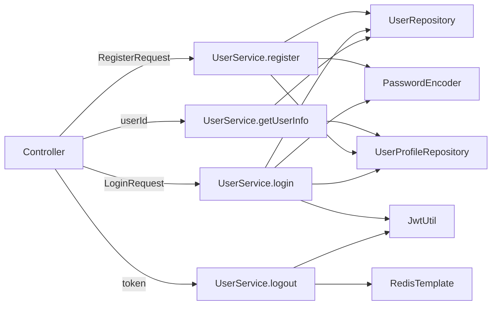

# Task12: UserService（注册/登录/BCrypt/JWT/查询用户/退出登录）

| 项目 | 内容 |
|------|------|
| **项目** | XH-202630 科研文献智能助手 |
| **版本** | v0.2 |
| **里程碑** | M3：前后端联调 / JM2：基础API可用 |
| **功能编号** | F2.1.1, F2.1.2, F2.1.3, F2.1.4 |

## 需求描述

创建UserService（用户管理核心业务逻辑层），实现4个方法：register（注册）、login（登录）、getUserInfo（查询用户）、logout（退出登录）。同时在SecurityConfig中添加PasswordEncoder @Bean。UserService是Controller与Repository之间的业务逻辑层，所有密码加密、JWT生成、缓存、黑名单逻辑均在Service中实现。

## 涉及层级

- **java_backend** — com.literatureassistant.service（新增UserService）
- **java_backend** — com.literatureassistant.config（修改SecurityConfig）
- **data_layer** — Redis（JWT黑名单操作）

## 需要修改/新增的文件

| 操作 | 文件路径 | 说明 |
|------|---------|------|
| 新增 | `service/UserService.java` | 用户Service：@Service @Slf4j，构造器注入5个依赖，实现register/login/getUserInfo/logout |
| 修改 | `config/SecurityConfig.java` | 新增@Bean PasswordEncoder passwordEncoder()，返回BCryptPasswordEncoder(10) |

## 已有依赖代码

| 文件 | 说明 | 复用方式 |
|------|------|---------|
| `entity/User.java` | User实体(userId/username/email/passwordHash/createdAt) | 参考 |
| `entity/UserProfile.java` | UserProfile实体(userId/educationLevel等) | 参考 |
| `repository/UserRepository.java` | findByUserId/findByUsername/existsByUsername/existsByEmail | 直接复用 |
| `repository/UserProfileRepository.java` | findByUserId/existsByUserId | 直接复用 |
| `util/JwtUtil.java` | generateToken/validateToken/isTokenBlacklisted/getTokenJti/getTokenRemainingTime | 直接复用 |
| `util/RedisKeyUtil.java` | authBlacklistKey(jti) → "auth:blacklist:{jti}" | 直接复用 |
| `exception/BusinessException.java` | BusinessException(code, message, errorKey) | 直接复用 |
| `exception/AuthenticationException.java` | AuthenticationException(message), code=401 | 直接复用 |
| `config/SecurityConfig.java` | 已有SecurityFilterChain+CORS，需扩展 | 扩展 |

## 功能要求

### FR-001: register（注册）— P0

```
输入: RegisterRequest(username, email, password)
流程:
  1. 检查用户名唯一性 → existsByUsername → 重复抛 BusinessException(409, "用户名已存在", "USERNAME_DUPLICATE")
  2. 检查邮箱唯一性 → existsByEmail → 重复抛 BusinessException(409, "邮箱已被注册", "EMAIL_DUPLICATE")
  3. BCrypt加密密码 → passwordEncoder.encode(password)
  4. 生成userId → "usr_" + UUID.randomUUID().toString().replace("-","").substring(0,8)
  5. 构建User实体 → User.builder()...build()
  6. 保存 → userRepository.save(user)
  7. 检查画像 → userProfileRepository.existsByUserId(userId)
  8. 返回UserResponse(userId, username, email, createdAt, hasProfile)
日志: log.info("User registered: userId={}, username={}", userId, username)
禁止: 输出password
```

### FR-002: login（登录）— P0

```
输入: LoginRequest(username, password)
流程:
  1. 查询用户 → findByUsername → 不存在抛 AuthenticationException("用户名或密码错误")
  2. BCrypt校验密码 → passwordEncoder.matches(password, passwordHash) → 不匹配抛 AuthenticationException("用户名或密码错误")
  3. 生成JWT → jwtUtil.generateToken(userId, username)
  4. 检查画像 → userProfileRepository.existsByUserId(userId)
  5. 返回LoginResponse(token, userId, username, hasProfile)
日志: log.info("User logged in: userId={}, username={}", userId, username)
注意: 用户不存在和密码错误统一返回"用户名或密码错误"，防止用户名枚举攻击
```

### FR-003: getUserInfo（查询用户）— P0

```
输入: String userId
流程:
  1. 查询用户 → findByUserId → 不存在抛 BusinessException(404, "用户不存在", "USER_NOT_FOUND")
  2. 检查画像 → userProfileRepository.existsByUserId(userId)
  3. 返回UserResponse(userId, username, email, createdAt, hasProfile)
缓存: @Cacheable(value = "userInfo", key = "#userId")，TTL=1h
```

### FR-004: logout（退出登录）— P0

```
输入: String token (Bearer Token已由Controller提取)
流程:
  1. 解析Token获取jti → jwtUtil.getTokenJti(token) → null则静默返回(幂等)
  2. 获取Token剩余有效期 → jwtUtil.getTokenRemainingTime(token) → <=0则静默返回(已过期)
  3. 加入Redis黑名单 → redisTemplate.opsForValue().set(authBlacklistKey(jti), "1", Duration.ofMillis(remainingTime))
日志: log.info("User logged out: jti={}", jti)
```

### FR-005: PasswordEncoder Bean — P0

在SecurityConfig中新增：
```java
@Bean
public PasswordEncoder passwordEncoder() {
    return new BCryptPasswordEncoder(10);
}
```

### FR-006: 构造器注入 — P0

```java
@Service @Slf4j
public class UserService {
    private final UserRepository userRepository;
    private final UserProfileRepository userProfileRepository;
    private final JwtUtil jwtUtil;
    private final PasswordEncoder passwordEncoder;
    private final RedisTemplate<String, String> redisTemplate;

    public UserService(UserRepository userRepository,
                       UserProfileRepository userProfileRepository,
                       JwtUtil jwtUtil,
                       PasswordEncoder passwordEncoder,
                       RedisTemplate<String, String> redisTemplate) {
        this.userRepository = userRepository;
        this.userProfileRepository = userProfileRepository;
        this.jwtUtil = jwtUtil;
        this.passwordEncoder = passwordEncoder;
        this.redisTemplate = redisTemplate;
    }
}
```

## 关键约束

- **禁止**在UserService中手动`new BCryptPasswordEncoder()`，必须通过@Bean注入
- **禁止**UserResponse包含passwordHash字段
- **禁止**Entity直接返回前端，必须Entity→DTO转换
- **禁止**日志输出password明文或完整JWT Token
- **禁止**登录失败区分"用户不存在"和"密码错误"
- **禁止**使用字段注入(@Autowired on field)，必须构造器注入
- **禁止**Controller包含业务逻辑
- **禁止**硬编码敏感配置

## 跨系统字段映射

| Java | JSON | Python |
|------|------|--------|
| userId | user_id | user_id |
| hasProfile | has_profile | has_profile |
| createdAt | created_at | created_at |
| passwordHash | password_hash | password_hash |

## 测试要求

### UserServiceTest（JUnit5 + Mockito）

| 方法 | 场景 | 预期 |
|------|------|------|
| register | 正常注册 | 返回UserResponse，userId格式usr_xxxxxxxx，密码BCrypt加密 |
| register | 重复用户名 | 抛BusinessException(409, "USERNAME_DUPLICATE") |
| register | 重复邮箱 | 抛BusinessException(409, "EMAIL_DUPLICATE") |
| login | 正常登录 | 返回LoginResponse(含JWT Token) |
| login | 密码错误 | 抛AuthenticationException("用户名或密码错误") |
| login | 用户不存在 | 抛AuthenticationException("用户名或密码错误") |
| getUserInfo | 正常查询 | 返回UserResponse(含hasProfile=true/false) |
| getUserInfo | 用户不存在 | 抛BusinessException(404, "USER_NOT_FOUND") |
| getUserInfo | 缓存命中 | @Cacheable生效，不查数据库 |
| logout | 正常退出 | Token jti加入Redis黑名单，TTL正确 |
| logout | Token无效 | 静默返回，不抛异常 |
| logout | Token已过期 | 不加入黑名单，静默返回 |

注意：PasswordEncoder使用BCryptPasswordEncoder真实实例（非Mock），因为BCrypt.matches需要真实加密验证。

## 验收标准

| ID | 标准 | 验证方式 |
|----|------|---------|
| AC-001 | register创建用户：BCrypt加密、UUID userId(usr_xxxxxxxx)、返回UserResponse | 自动化测试 |
| AC-002 | login验证密码：BCrypt matches、生成JWT、返回LoginResponse | 自动化测试 |
| AC-003 | getUserInfo返回UserResponse含hasProfile标记，@Cacheable缓存生效 | 自动化测试 |
| AC-004 | logout将Token jti加入Redis黑名单，TTL=Token剩余有效期 | 自动化测试 |
| AC-005 | 重复用户名抛BusinessException(409) | 自动化测试 |
| AC-006 | 密码错误/用户不存在均抛AuthenticationException(401) | 自动化测试 |
| AC-007 | PasswordEncoder为Spring Bean，UserService构造器注入 | 代码审查 |
| AC-008 | @Cacheable(value="userInfo", key="#userId")注解在getUserInfo上 | 代码审查 |
| AC-009 | userId格式usr_xxxxxxxx | 自动化测试 |
| AC-010 | 所有单元测试通过 | 自动化测试 |

## 验证命令

```bash
cd Veritas/backend && mvn compile
cd Veritas/backend && mvn test -Dtest=UserServiceTest
```

## 数据流


