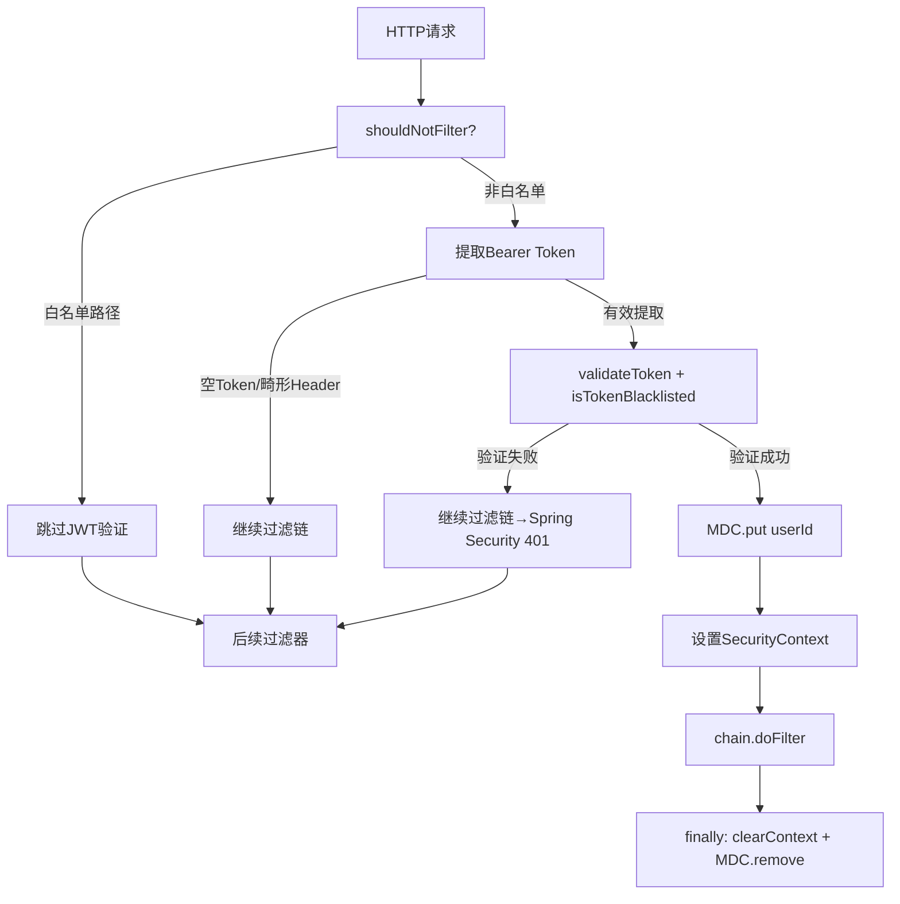

# Task13: JwtAuthFilter完善 + JwtUtil完善

| 项目 | 内容 |
|------|------|
| **项目** | XH-202630 科研文献智能助手 |
| **版本** | v0.2 |
| **里程碑** | M3：前后端联调 / JM2：用户认证与论文管理 |
| **功能编号** | F2.1.2, F2.1.3 |

## 需求描述

完善JwtAuthFilter和JwtUtil两个核心安全组件。JwtAuthFilter增加白名单路径跳过、MDC userId注入与清理、SecurityContext请求后清理、请求URI日志、Token提取边界情况处理。JwtUtil增加blacklistToken方法、isTokenExpired方法、token_type声明、parseToken错误日志增强。

## 涉及层级

- **java_backend** — com.literatureassistant.filter + com.literatureassistant.util
- **data_layer** — Redis黑名单存储

## 需要修改的文件

| 操作 | 文件路径 | 说明 |
|------|---------|------|
| 修改 | `filter/JwtAuthFilter.java` | 白名单跳过 + MDC userId + SecurityContext清理 + 边界处理 |
| 修改 | `util/JwtUtil.java` | blacklistToken + isTokenExpired + token_type + 错误日志增强 |
| 修改 | `filter/JwtAuthFilterTest.java` | 扩展测试用例 |
| 修改 | `util/JwtUtilTest.java` | 扩展测试用例 |

## 当前实现现状

### JwtAuthFilter（需完善）

```java
@Component
@RequiredArgsConstructor
@Slf4j
public class JwtAuthFilter extends OncePerRequestFilter {
    private static final String AUTHORIZATION_HEADER = "Authorization";
    private static final String BEARER_PREFIX = "Bearer ";
    private final JwtUtil jwtUtil;

    @Override
    protected void doFilterInternal(HttpServletRequest request,
            HttpServletResponse response, FilterChain chain)
            throws ServletException, IOException {
        String authHeader = request.getHeader(AUTHORIZATION_HEADER);
        if (authHeader != null && authHeader.startsWith(BEARER_PREFIX)) {
            String token = authHeader.substring(BEARER_PREFIX.length());
            if (jwtUtil.validateToken(token) && !jwtUtil.isTokenBlacklisted(token)) {
                String userId = jwtUtil.getUserIdFromToken(token);
                String username = jwtUtil.getUsernameFromToken(token);
                UsernamePasswordAuthenticationToken authentication =
                        new UsernamePasswordAuthenticationToken(userId, null, List.of());
                SecurityContextHolder.getContext().setAuthentication(authentication);
                log.debug("JWT认证成功: userId={}, username={}", userId, username);
            }
        }
        chain.doFilter(request, response);
    }
}
```

**缺失项**：白名单路径跳过、MDC userId注入/清理、SecurityContext finally清理、空Token/畸形Header处理

### JwtUtil（需完善）

已有方法：`generateToken()`, `parseToken()`, `validateToken()`, `isTokenBlacklisted()`, `getUserIdFromToken()`, `getUsernameFromToken()`, `getTokenJti()`, `getTokenRemainingTime()`, `maskToken()`

**缺失项**：`blacklistToken()`, `isTokenExpired()`, token_type声明, parseToken错误类型区分

## 功能要求

### JwtAuthFilter增强

| ID | 优先级 | 描述 |
|----|--------|------|
| FR-001 | P0 | **白名单路径跳过**：重写`shouldNotFilter()`，白名单路径（/api/users/register、/api/users/login、/health、/actuator/**、/error）跳过JWT验证。使用AntPathMatcher匹配通配符 |
| FR-002 | P0 | **MDC userId注入**：Token验证成功后`MDC.put("userId", userId)`，finally块中`MDC.remove("userId")`清理 |
| FR-003 | P0 | **SecurityContext清理**：doFilterInternal使用try-finally，finally中执行`SecurityContextHolder.clearContext()`和`MDC.remove()`，防止线程池复用泄漏 |
| FR-004 | P1 | **请求URI日志**：`log.debug("处理请求: {}", request.getRequestURI())` |
| FR-005 | P0 | **边界情况处理**：空Token（"Bearer "后无内容）、"Bearer"无空格、非Bearer格式 → 均不抛异常，跳过验证 |

### JwtUtil增强

| ID | 优先级 | 描述 |
|----|--------|------|
| FR-006 | P0 | **blacklistToken(String token)**：提取jti → Redis Key=`auth:blacklist:{jti}` → Value="1" → TTL=Token剩余有效期 → 返回boolean。无效/已过期Token返回false |
| FR-007 | P0 | **isTokenExpired(String token)**：不抛异常判断Token是否过期。null/无效/过期→true，有效→false |
| FR-008 | P1 | **token_type声明**：generateToken增加`.claim("token_type", "access")`，向后兼容 |
| FR-009 | P1 | **parseToken错误日志增强**：5种异常类型使用不同日志前缀（已过期/格式错误/签名无效/不支持/为空） |

## JWT认证流程（完善后）



## 白名单路径

| 路径 | 说明 |
|------|------|
| `/api/users/register` | 用户注册 |
| `/api/users/login` | 用户登录 |
| `/health` | 健康检查 |
| `/actuator/**` | Spring Boot Actuator |
| `/error` | Spring默认错误页 |

## blacklistToken Redis存储

| 项目 | 值 |
|------|-----|
| Key | `auth:blacklist:{jti}` |
| Value | `"1"` |
| TTL | Token剩余有效期（毫秒精度） |
| 过期Token | 不入黑名单（返回false） |

## 关键约束

- **禁止**在日志中输出完整Token、JWT Secret、完整jti
- **禁止**不在finally块中清理SecurityContext（线程池复用泄漏风险）
- **禁止**blacklistToken使用固定TTL（必须=Token剩余有效期）
- **禁止**isTokenExpired抛出异常
- **禁止**白名单路径仍执行JWT验证
- **禁止**MDC userId请求后未清理
- **禁止**修改generateToken方法签名或破坏现有Token兼容性
- **禁止**使用System.out.println或非SLF4J日志

## 参考实现

RequestIdFilter的MDC模式（JwtAuthFilter应遵循相同模式）：

```java
// RequestIdFilter.java — MDC注入+清理参考
MDC.put(MDC_KEY, requestId);
try {
    chain.doFilter(request, response);
} finally {
    MDC.remove(MDC_KEY);
}
```

## 验收标准

| ID | 标准 | 验证方式 |
|----|------|---------|
| AC-001 | 白名单路径跳过JWT验证 | 自动化测试 |
| AC-002 | 有效Token设置SecurityContext(userId) + MDC(userId) | 自动化测试 |
| AC-003 | 黑名单Token不设置SecurityContext，返回401 | 自动化测试 |
| AC-004 | MDC请求期间包含userId，请求后清理 | 自动化测试 |
| AC-005 | SecurityContext请求后清理（finally块） | 自动化测试 |
| AC-006 | blacklistToken写入Redis，Key=auth:blacklist:{jti}，TTL=剩余有效期 | 自动化测试 |
| AC-007 | isTokenExpired不抛异常，有效→false，过期/无效→true | 自动化测试 |
| AC-008 | 日志不含完整Token/Secret/jti | 代码审查 |
| AC-009 | generateToken包含token_type=access声明 | 自动化测试 |
| AC-010 | parseToken不同异常类型不同日志前缀 | 代码审查 |
| AC-011 | 空Token/畸形Header不抛异常 | 自动化测试 |
| AC-012 | 所有单元测试通过，无回归 | 自动化测试 |

## 验证命令

```bash
cd Veritas/backend && mvn compile
cd Veritas/backend && mvn test -Dtest=JwtAuthFilterTest,JwtUtilTest
cd Veritas/backend && mvn test
```
