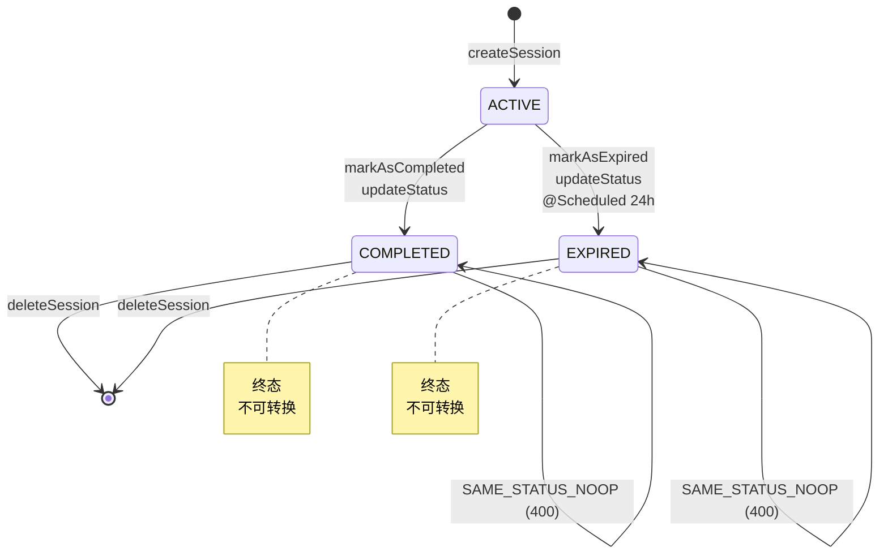

# 会话状态机 + DTO映射 Coding Task

> 任务编号：`task18_session_state_machine_dto_mapping`
> 对应需求编号：`F2.3.1` ~ `F2.3.5`（增强）
> 里程碑：M3 前后端联调 / JM2 Java后端M2（Week 5 Day 4 下午）
> 前置依赖：[task17_session_controller_service_basic](file:///Users/achieve/Documents/AchiEVE_MacBook_Air/Veritas(求真)/json_prompt/backend/task17_session_controller_service_basic/prompt.md)

---

## 1. Context（项目上下文）

| 字段 | 值 |
|------|-----|
| 项目 | XH-202630 科研文献智能助手 |
| 版本 | v0.2 |
| 里程碑 | M3 / JM2 Java后端M2（Week 5 Day 4 下午） |
| 涉及模块 | F2.3 会话管理模块增强（状态机 + DTO映射） |
| 涉及层级 | `java_backend` + `data_layer` |

### 需求描述

在 **task17** 基础上完善会话管理模块：

1. **完整状态机**：定义 `ALLOWED_TRANSITIONS` 常量（ACTIVE→{COMPLETED, EXPIRED}，COMPLETED→{}，EXPIRED→{}），`validateStatusTransition(current, target)` 校验非法转换抛 `BusinessException(400, INVALID_STATUS_TRANSITION)`，`isTerminal(status)` 判定终态，`markAsCompleted`/`markAsExpired` 业务封装方法
2. **SessionMapper (MapStruct)**：`toResponse`/`toDetailResponse`/`toResponseList` 三个方法，使用 `@Mapping(expression='java(session.getStatus().getDbValue())')` 处理 `SessionStatus` 枚举→String dbValue 转换
3. **完善 `SessionStatusUpdateRequest` DTO**：添加 `@NotNull` 校验
4. **新增 `SessionDetailResponse` DTO**：继承 `SessionResponse` + `analysisCount` 字段
5. **重构 `SessionService`**：5 个方法统一通过 `SessionMapper` 转换，注入 `AnalysisResultRepository` 计算 `analysisCount`

### 参考文档

| 路径 | 用途 |
|------|------|
| `docs/backend/Java后端模块系统架构文档.md` | §6.3 会话状态机规则、§11.3 枚举类型定义、§6.2.2 SessionService 方法签名 |
| `docs/database/数据库设计文档.md` | §3.4 sessions 表、§3.5 analysis_results 表外键 |
| `AGENTS.md` | §9.2 Java 后端规范（MapStruct + @JsonProperty + Entity/DTO 分离） |
| `json_prompt/backend/task17_*/prompt.md` | task17 任务说明（前置依赖） |
| `json_prompt/backend/task15_*/prompt.md` | PaperMapper 模式参考（MapStruct + 内嵌 Helper） |

---

## 2. Current Architecture（当前架构）

**涉及层级**：`Controller → Service → Mapper → Repository → Database (MySQL)`

**已有实现（task17 完成后，本任务开始时）**：

| 文件 | 说明 | 复用方式 |
|------|------|---------|
| `entity/Session.java` | Session 实体（6 字段，@Convert 显式转换） | direct_reuse |
| `enums/SessionStatus.java` | 3 枚举值 + getDbValue() + fromDbValue() | direct_reuse |
| `repository/SessionRepository.java` | findBySessionId + findByUserIdOrderByCreatedAtDesc | direct_reuse |
| `repository/AnalysisResultRepository.java` | findByAnalysisId + findBySessionId + findBySessionIdAndStatus — **本任务需新增 countBySessionId** | extend |
| `dto/common/ApiResponse.java` | 统一响应包装 | direct_reuse |
| `dto/common/PageResponse.java` | 分页响应 + fromPage 工厂 | direct_reuse |
| `exception/ResourceNotFoundException.java` | 404 异常 | direct_reuse |
| `exception/BusinessException.java` | 业务异常基类 | direct_reuse |
| `exception/AuthenticationException.java` | 401 异常 | direct_reuse |
| `mapper/UserMapper.java` | `@Mapping(expression='java(entity.getField().getDbValue())')` 枚举转换模式 | reference |
| `mapper/PaperMapper.java` | `@Mapper(componentModel='spring', uses={JsonStringListHelper.class})` 模式 | reference |
| `task17/SessionCreateRequest.java` | 1 字段 topic（@NotBlank + @Size） | direct_reuse |
| `task17/SessionResponse.java` | 5 字段（snake_case + status String） | direct_reuse |
| `task17/SessionStatusUpdateRequest.java` | 1 字段 status（**task18 需添加 @NotNull**） | modify |
| `task17/SessionService.java` | 5 个核心方法（手动构建 DTO，**task18 需重构**） | modify |
| `task17/SessionController.java` | 5 个端点（**task18 不修改**） | direct_reuse |

---

## 3. Relevant Modules（相关模块）

### SessionMapper（新）

- 路径：`com.literatureassistant.mapper.SessionMapper`
- 职责：MapStruct 映射器，Session Entity ↔ DTO 双向转换
- 关键方法：
  - `toResponse(Session)` → `SessionResponse`（`@Mapping(target='status', expression='java(session.getStatus().getDbValue())')`）
  - `toDetailResponse(Session)` → `SessionDetailResponse`（同上，analysisCount 由 Service 设置）
  - `toResponseList(List<Session>)` → `List<SessionResponse>`（批量转换）

### SessionStatusUpdateRequest（完善）

- 路径：`com.literatureassistant.dto.request.SessionStatusUpdateRequest`
- 职责：状态更新请求 DTO（task18 完善）
- 关键字段：`@NotNull(message="状态不能为空") private SessionStatus status`

### SessionDetailResponse（新）

- 路径：`com.literatureassistant.dto.response.SessionDetailResponse`
- 职责：会话详情响应 DTO
- 继承：`@SuperBuilder @EqualsAndHashCode(callSuper=true) @ToString(callSuper=true)` 继承 SessionResponse
- 关键字段：`@JsonProperty("analysis_count") private Integer analysisCount`

### SessionService（重构）

- 路径：`com.literatureassistant.service.SessionService`
- 职责：状态机核心 + 5 个方法统一 Mapper 转换
- 新增依赖：`SessionMapper sessionMapper`、`AnalysisResultRepository analysisResultRepository`
- 新增方法：
  - `validateStatusTransition(Session, SessionStatus)` — 私有
  - `isTerminal(SessionStatus)` — 私有
  - `markAsCompleted(String sessionId)` — 公开（P1 业务封装）
  - `markAsExpired(String sessionId)` — 公开（P1 业务封装）
- 重构方法：`updateStatus` 内调用 `validateStatusTransition`；5 个核心方法改用 `sessionMapper.toResponse/toDetailResponse/toResponseList`

### AnalysisResultRepository（扩展）

- 路径：`com.literatureassistant.repository.AnalysisResultRepository`
- 新增方法：`long countBySessionId(String sessionId)`（Spring Data JPA 自动派生）

---

## 4. Files To Modify（待修改文件）

| 操作 | 路径 | 说明 |
|------|------|------|
| 新增 | `com/literatureassistant/mapper/SessionMapper.java` | MapStruct 映射器，3 个方法处理状态枚举转换 |
| 新增 | `com/literatureassistant/dto/response/SessionDetailResponse.java` | 详情 DTO，继承 SessionResponse + analysisCount |
| 修改 | `com/literatureassistant/dto/request/SessionStatusUpdateRequest.java` | status 字段添加 `@NotNull` 校验 |
| 修改 | `com/literatureassistant/repository/AnalysisResultRepository.java` | 新增 `countBySessionId(String)` 派生方法 |
| 修改 | `com/literatureassistant/service/SessionService.java` | 注入 SessionMapper + AnalysisResultRepository + 4 个状态机方法 |
| 新增（测试） | `src/test/java/com/literatureassistant/mapper/SessionMapperTest.java` | MapStruct 转换测试 |
| 新增（测试） | `src/test/java/com/literatureassistant/service/SessionStateMachineTest.java` | 状态机核心方法测试（独立测试类） |
| 新增（测试） | `src/test/java/com/literatureassistant/service/SessionServiceRefactorTest.java` | SessionService 重构后行为测试 |

> **注意**：本任务 **不修改** `SessionController`（task17 已实现）+ **不修改** `Session Entity/Repository`（已有）

---

## 5. Implementation Requirements（实现要求）

### 5.1 功能要求

| 编号 | 描述 | 优先级 | 验收条件 |
|------|------|--------|---------|
| FR-001 | SessionMapper 3 个方法 + `@Mapping expression` 处理状态枚举→String dbValue | P0 | status 字段成功转换为小写 dbValue |
| FR-002 | SessionStatusUpdateRequest 添加 `@NotNull` 校验 | P0 | 缺 status 字段返回 400 |
| FR-003 | SessionDetailResponse 继承 SessionResponse + `analysisCount` 字段 | P0 | JSON 输出包含 `analysis_count` |
| FR-004 | AnalysisResultRepository 新增 `countBySessionId(String)` 派生方法 | P0 | 返回 long 计数 |
| FR-005 | SessionService 状态机：`ALLOWED_TRANSITIONS` + `validateStatusTransition` + `isTerminal` | P0 | 非法转换抛 400 (INVALID_STATUS_TRANSITION) |
| FR-006 | SessionService.updateStatus 调用 `validateStatusTransition` 校验后 save + `@CacheEvict` | P0 | 缓存清空 + 非法转换抛 400 |
| FR-007 | SessionService.markAsCompleted（仅 ACTIVE→COMPLETED）| P1 | 其他状态抛 400 |
| FR-008 | SessionService.markAsExpired（仅 ACTIVE→EXPIRED）| P1 | 其他状态抛 400 |
| FR-009 | SessionService 5 个核心方法统一使用 SessionMapper 转换 | P0 | Controller 无需修改业务逻辑 |
| FR-010 | SessionController.getSessionDetail 返回 SessionDetailResponse | P0 | JSON 含 `analysis_count` |

### 5.2 状态机转换规则（核心）



| From | To | 结果 |
|------|----|------|
| ACTIVE | COMPLETED | ✅ 合法（markAsCompleted / updateStatus） |
| ACTIVE | EXPIRED | ✅ 合法（markAsExpired / updateStatus / 定时任务） |
| ACTIVE | ACTIVE | ❌ 400 `SAME_STATUS_NOOP` |
| COMPLETED | ACTIVE | ❌ 400 `INVALID_STATUS_TRANSITION` |
| COMPLETED | EXPIRED | ❌ 400 `INVALID_STATUS_TRANSITION` |
| COMPLETED | COMPLETED | ❌ 400 `SAME_STATUS_NOOP` |
| EXPIRED | ACTIVE | ❌ 400 `INVALID_STATUS_TRANSITION` |
| EXPIRED | COMPLETED | ❌ 400 `INVALID_STATUS_TRANSITION` |
| EXPIRED | EXPIRED | ❌ 400 `SAME_STATUS_NOOP` |

### 5.3 跨系统一致性

- 字段命名：Java camelCase ↔ Python/JSON snake_case
- 关键映射：`sessionId`↔`session_id`、`userId`↔`user_id`、`createdAt`↔`created_at`、`analysisCount`↔`analysis_count`
- API 契约：
  - `GET /api/sessions/{sessionId}` 返回 SessionDetailResponse（含 `analysis_count`）
  - `PUT /api/sessions/{sessionId}/status` 缺 status 字段 → 400
  - `PUT /api/sessions/{sessionId}/status` 非法转换 → 400 (`INVALID_STATUS_TRANSITION`)

### 5.4 降级要求

- 本任务不涉及 LLM/Agent 调用，无降级要求

### 5.5 安全要求

- 5 个端点均需 JWT 认证
- `updateStatus` 需数据隔离校验（越权 403）
- `markAsCompleted`/`markAsExpired` 是受信任内部方法，**不**走数据隔离校验（由 AnalysisService/定时任务调用）

---

## 6. Constraints（约束）

### 6.1 命名规范

- Java：类名 PascalCase、方法/变量 camelCase、常量 UPPER_SNAKE_CASE、文件 PascalCase.java
- JSON：字段名 `snake_case`
- 数据库：表名/列名 `snake_case`

### 6.2 分层规范

- `Controller → Service → Mapper → Repository → Database`，禁止跨层
- Entity 与 DTO 分离（必须通过 Mapper 转换）
- DTO 命名：`XxxRequest` / `XxxResponse` / `XxxDetailResponse`

### 6.3 错误处理

- `BusinessException` + `GlobalExceptionHandler`（`@RestControllerAdvice`）
- 业务异常字段：`code`（HTTP 状态码）、`message`、`errorKey`
- 状态机错误码：
  - `SAME_STATUS_NOOP`：当前状态与目标状态相同
  - `INVALID_STATUS_TRANSITION`：非法的状态转换

### 6.4 缓存策略

- Cache-Aside：写 MySQL 后删 Redis 缓存（`@CacheEvict`）
- `sessionState` TTL = 2h（RedisConfig 已配置）

### 6.5 日志规范

- SLF4J + Logback
- 状态转换 log.info 包含 sessionId/from/to
- 禁止在循环中打印 INFO 及以上级别日志

### 6.6 数据库规范

- JPA 参数化查询，禁止 SQL 拼接
- 所有列表接口强制分页

### 6.7 安全规范

- JWT Token (24h) + Redis 黑名单
- 数据隔离：WHERE user_id = currentUserId

---

## 7. Forbidden Actions（禁止行为）

- ❌ 输出伪代码或 TODO 注释
- ❌ 修改需求范围外的模块（`UserService` / `PaperService` / `AnalysisService` / `SessionController` 等）
- ❌ 破坏三层分离架构
- ❌ 破坏分层调用规范
- ❌ Session Entity 直接返回给前端
- ❌ 硬编码敏感配置
- ❌ 违反跨系统字段命名约定
- ❌ 在循环中打印 INFO 及以上级别日志
- ❌ 使用 SQL 拼接
- ❌ **在 `SessionMapper` 中实现业务逻辑**（如计算 analysisCount）— Mapper 仅做字段映射
- ❌ **在状态机方法中跳过 `validateStatusTransition` 校验直接 save** — 状态机是核心约束
- ❌ **在 `markAsCompleted`/`markAsExpired` 中添加数据隔离校验** — 这两个是受信任内部方法

---

## 8. Test Requirements（测试要求）

### 8.1 单元测试

| 测试类 | 验证点 |
|--------|--------|
| `SessionMapperTest` | 3 个值枚举→String 转换、List 批量转换、null 防御 |
| `SessionStateMachineTest` | 9 种状态转换规则 + isTerminal 终态判定 + markAsCompleted/markAsExpired 业务封装 + @CacheEvict 缓存清空 |
| `SessionServiceRefactorTest` | 5 个核心方法使用 Mapper 转换（验证 mapper 被调用）+ getSessionDetail 注入 analysisCount |

### 8.2 集成测试

- `SessionControllerRefactorTest`（可选，task17 已有）：GET 返回 SessionDetailResponse、PUT 缺 status 返 400、PUT 非法转换返 400

### 8.3 验证命令

```bash
cd Veritas/backend && mvn compile                                                                                  # 编译
cd Veritas/backend && mvn test -Dtest=SessionMapperTest,SessionStateMachineTest,SessionServiceRefactorTest       # 单元测试
cd Veritas/backend && mvn test                                                                                    # 全部测试
```

---

## 9. Acceptance Criteria（验收标准）

- [ ] AC-001：SessionMapper.toResponse 正确转换 `SessionStatus.ACTIVE` → `'active'`
- [ ] AC-002：SessionMapper.toDetailResponse 继承 SessionResponse 全部字段 + analysisCount 初始 null
- [ ] AC-003：SessionStatusUpdateRequest 缺 status 字段返回 400（@NotNull 校验）
- [ ] AC-004：AnalysisResultRepository.countBySessionId 返回 long 计数
- [ ] AC-005：状态机 `ACTIVE→{COMPLETED, EXPIRED}` 合法；其他转换全部抛 400
- [ ] AC-006：SessionService.updateStatus 调用 validateStatusTransition 后 save + @CacheEvict
- [ ] AC-007：SessionService.markAsCompleted 仅 ACTIVE→COMPLETED 合法
- [ ] AC-008：SessionService.markAsExpired 仅 ACTIVE→EXPIRED 合法
- [ ] AC-009：5 个核心方法统一通过 SessionMapper 转换，Controller 无需修改
- [ ] AC-010：GET /api/sessions/{sessionId} 返回 SessionDetailResponse（含 `analysis_count`）
- [ ] AC-011：PUT 缺 status 字段返回 400
- [ ] AC-012：PUT 非法状态转换返回 400（`INVALID_STATUS_TRANSITION`）
- [ ] AC-013：SessionMapperTest + SessionStateMachineTest + SessionServiceRefactorTest 全部通过，`mvn compile` + `mvn test` 成功
- [ ] AC-014：未修改 `SessionController`（task17 已实现）+ 未修改其他模块

---

## 10. 数据契约示例

### SessionDetailResponse 继承字段

```java
@EqualsAndHashCode(callSuper = true)
@ToString(callSuper = true)
@Data
@NoArgsConstructor
@AllArgsConstructor
@SuperBuilder
public class SessionDetailResponse extends SessionResponse {
    @JsonProperty("analysis_count")
    private Integer analysisCount;
}
```

### 状态机校验实现（核心代码）

```java
private static final Map<SessionStatus, Set<SessionStatus>> ALLOWED_TRANSITIONS = Map.of(
    SessionStatus.ACTIVE,   Set.of(SessionStatus.COMPLETED, SessionStatus.EXPIRED),
    SessionStatus.COMPLETED, Set.of(),
    SessionStatus.EXPIRED,   Set.of()
);

private void validateStatusTransition(Session session, SessionStatus targetStatus) {
    if (session.getStatus() == targetStatus) {
        throw new BusinessException(400,
            "会话状态已是目标状态: " + targetStatus.getDbValue(),
            "SAME_STATUS_NOOP");
    }
    Set<SessionStatus> allowed = ALLOWED_TRANSITIONS.getOrDefault(session.getStatus(), Set.of());
    if (!allowed.contains(targetStatus)) {
        throw new BusinessException(400,
            "非法的状态转换：从 " + session.getStatus().getDbValue() + " 到 " + targetStatus.getDbValue(),
            "INVALID_STATUS_TRANSITION");
    }
}
```

### GET /api/sessions/{sessionId} 响应（task18 升级）

```json
{
  "code": 200,
  "message": "success",
  "data": {
    "session_id": "ses_a1b2c3d4",
    "user_id": "usr_xxxx",
    "topic": "Multi-Agent",
    "status": "active",
    "created_at": "2026-05-23T10:00:00",
    "analysis_count": 3
  },
  "timestamp": 1716451200000
}
```

### PUT /api/sessions/{sessionId}/status 非法转换响应

**请求**：
```json
{ "status": "active" }
```

**响应（400）**：
```json
{
  "code": 400,
  "message": "非法的状态转换：从 completed 到 active",
  "data": null,
  "timestamp": 1716451200000
}
```

---

## 11. 后续建议

- **task19 / AnalysisService**（F2.4）：分析结果模块 — 在分析完成时调用 `sessionService.markAsCompleted(sessionId)` 触发状态机转换
- **JM6 优化**：`@Scheduled` 定时任务（24h 未操作）扫描 ACTIVE 会话，批量调用 `markAsExpired` 触发状态机
- **JM6 监控**：状态机转换错误码（`INVALID_STATUS_TRANSITION`）可通过 Micrometer 监控指标暴露，便于排查异常调用链
- **JM6 限流**：`markAsCompleted` 可加上 `synchronized` 或分布式锁（JM6 性能调优阶段），防止并发场景下重复标记
- **可选优化**：将 `ALLOWED_TRANSITIONS` 暴露为 `GET /api/sessions/status/transitions` 配置端点，便于前端 UI 动态展示可选状态

---

> **任务完成后必须**：
> 1. 运行 `mvn compile && mvn test` 验证编译和测试
> 2. 验证状态机 9 种转换规则的单元测试全部通过
> 3. 在 `json_prompt/Coding.md` 的 backend 序号映射表中追加新行（task18_session_state_machine_dto_mapping / v0.2 / M3:JM2 / F2.3.1-F2.3.5 增强）
