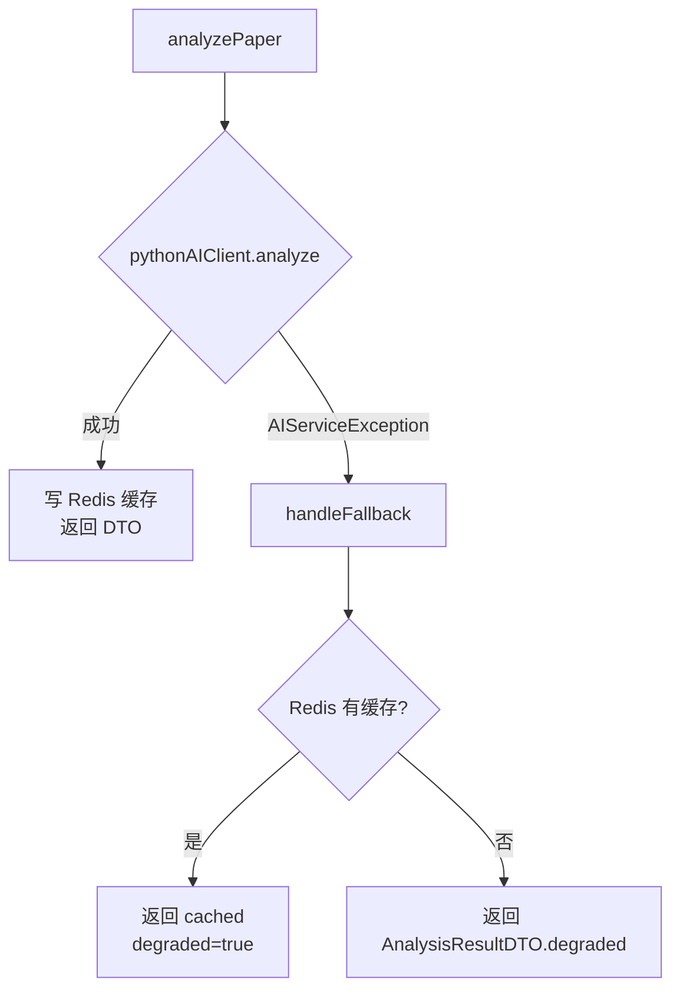

# task21: AgentClientService 调用编排+降级处理 (JM3 Day 7)

> **里程碑**：M3：前后端联调成功 / **JM3 Day 7**：AI 服务调用打通
> **版本**：v0.3
> **优先级**：P0
> **功能编号**：F2.5.4, F2.5.5, F2.4.1, F2.4.4, F2.4.5

---

## 任务概述

实现 `AgentClientService`（编排层），作为 `AnalysisService` 与 `PythonAIClient` 之间的桥梁。提供 3 大能力：

1. **三级降级策略**：Python 正常 → 缓存回退 → 降级提示 DTO
2. **Agent 状态 Redis 缓存**：Hash 结构，TTL 5min，支持 `getAnalysisStatus` 实时查询
3. **Mono 异步扩展占位**：为 JM4 SSE 推送预留 `generateReport(Mono<AnalysisResultDTO>)`

---

## 上下文定位

| 涉及层级 | 模块 |
|----------|------|
| java_backend | `com.literatureassistant.service.AgentClientService`（新增） |

**已有可复用**：
- `task19 PythonAIClient` — 4 个端点同步调用 + 重试 + AIServiceException 转换
- `task20 AnalysisResultDTO.degraded(analysisId, reason)` 静态工厂
- `RedisKeyUtil.agentStateKey(analysisId)` / `analysisResultKey(analysisId)` — Redis Key 生成
- `RedisConfig.jsonRedisSerializer()` — JavaTimeModule 已配置
- `UserService.syncProfileToRedis` — 缓存写入模式参考

---

## 涉及文件

| 操作 | 路径 | 说明 |
|------|------|------|
| 新增 | `Veritas/backend/src/main/java/com/literatureassistant/service/AgentClientService.java` | 主类（6 个 public 方法） |
| 新增 | `Veritas/backend/src/test/java/com/literatureassistant/service/AgentClientServiceTest.java` | 7 个单元测试 |

---

## 核心实现：三级降级



**Redis Key 约定**（与 task22 共享）：

| Key | 结构 | TTL | 写入方 |
|-----|------|-----|--------|
| `analysis:result:{analysisId}` | String(JSON) | 30min | AgentClientService.analyzePaper 成功后 |
| `agent:state:{analysisId}` | Hash | 5min | updateAgentState |
| `agent:fallback:{analysisId}` | String(JSON) | 30min | 降级路径读取目标 |

---

## 关键方法签名

```java
@Service
@Slf4j
@RequiredArgsConstructor
public class AgentClientService {
    private final PythonAIClient pythonAIClient;
    private final RedisTemplate<String, String> redisTemplate;
    private final ObjectMapper objectMapper;
    
    public AnalysisResultDTO analyzePaper(AgentRequest request);
    public Mono<AnalysisResultDTO> generateReport(AgentRequest request);
    public List<PaperSearchResultDTO> search(String query, int topK, Map<String,Object> filters);
    public void updateAgentState(String analysisId, List<AgentStateResponse> agentStates);
    public List<AgentStateResponse> getAgentStates(String analysisId);
    public boolean isHealthy();
    
    private AnalysisResultDTO handleFallback(AgentRequest request, Exception e);
}
```

---

## 关键实现要点

### 1. analyzePaper 核心逻辑

```java
public AnalysisResultDTO analyzePaper(AgentRequest request) {
    String analysisId = request.getAnalysisId();
    if (analysisId == null || analysisId.isBlank()) {
        analysisId = "anl_" + UUID.randomUUID().toString().replace("-", "").substring(0, 16);
        request.setAnalysisId(analysisId);
    }
    
    try {
        AnalysisResultDTO result = pythonAIClient.analyze(request);
        // 成功：写缓存 + 写 Agent 状态
        if (result.getAgentStates() != null) {
            updateAgentState(analysisId, result.getAgentStates());
        }
        cacheResult(analysisId, result);  // 写入 analysis:result:{id}
        return result;
    } catch (AIServiceException e) {
        log.warn("AI service fallback: analysisId={}, reason={}", analysisId, e.getMessage());
        return handleFallback(analysisId, e);
    }
}
```

### 2. handleFallback 降级

```java
private AnalysisResultDTO handleFallback(String analysisId, Exception e) {
    // 1) 查 Redis 缓存（同 analysisId 的历史结果）
    String key = RedisKeyUtil.analysisResultKey(analysisId);
    String cachedJson = redisTemplate.opsForValue().get(key);
    if (cachedJson != null) {
        try {
            AnalysisResultDTO cached = objectMapper.readValue(cachedJson, AnalysisResultDTO.class);
            cached.setDegraded(true);
            cached.setDegradedReason("AI服务暂时不可用，返回缓存结果");
            return cached;
        } catch (Exception ex) {
            log.warn("Failed to deserialize cached result: analysisId={}", analysisId, ex);
        }
    }
    // 2) 无缓存，返回降级 DTO
    return AnalysisResultDTO.degraded(analysisId, "AI服务暂时不可用，请稍后重试");
}
```

### 3. Agent 状态 Hash 存储

```java
public void updateAgentState(String analysisId, List<AgentStateResponse> agentStates) {
    if (agentStates == null || agentStates.isEmpty()) return;
    String key = RedisKeyUtil.agentStateKey(analysisId);
    Map<String, String> hash = new HashMap<>();
    for (AgentStateResponse s : agentStates) {
        try {
            hash.put(s.getAgentName(), objectMapper.writeValueAsString(s));
        } catch (JsonProcessingException e) {
            log.warn("Failed to serialize agent state: agentName={}", s.getAgentName(), e);
        }
    }
    redisTemplate.opsForHash().putAll(key, hash);
    redisTemplate.expire(key, Duration.ofMinutes(5));
}
```

---

## 禁止行为

- ❌ 降级路径吞掉异常不记录日志
- ❌ 把 Python 端原始异常信息原样抛给 Controller
- ❌ 跨用户读取缓存（必须按 analysisId 严格匹配）
- ❌ AgentClientService 直接调 Repository
- ❌ 使用 StringRedisTemplate（必须 RedisTemplate<String,String> + JavaTimeModule）

---

## 测试要求

| 测试名 | 覆盖 |
|--------|------|
| `analyzePaper_normal_returnsDTO` | 正常路径 + 缓存写入 |
| `analyzePaper_aiServiceException_triggers_fallback` | 降级 + 无缓存 |
| `analyzePaper_cache_hit_returns_cached` | 降级 + 有缓存 |
| `updateAgentState_writes_to_redis_hash` | Hash 写入 + TTL |
| `getAgentStates_empty_redis_returns_empty_list` | 空 Redis 返回空 List |
| `getAgentStates_with_data_deserializes` | Hash 反序列化 |
| `generateReport_mono_subscribable` | Mono 可订阅 |

**验证命令**：
```bash
cd Veritas/backend && mvn -Dtest=AgentClientServiceTest test
```

---

## 验收标准

- [ ] AgentClientService 编译通过，6 个 public 方法
- [ ] analyzePaper 失败时三级降级正确
- [ ] Agent 状态用 Hash 结构 + TTL 5min
- [ ] getAgentStates 空 Redis 返回空 List
- [ ] generateReport 返回 Mono
- [ ] AgentClientServiceTest 7/7 通过
- [ ] 未修改 PythonAIClient / Python 端代码

---

## 下一步

- **task22**：构建 AnalysisController + AnalysisService.analyzePaper（论文分析 + 任务记录 + 调用 AgentClientService）
- **task23**：扩展 HealthController 集成 `agentClientService.isHealthy()`，构建 getAnalysisResult / getAnalysisStatus API
