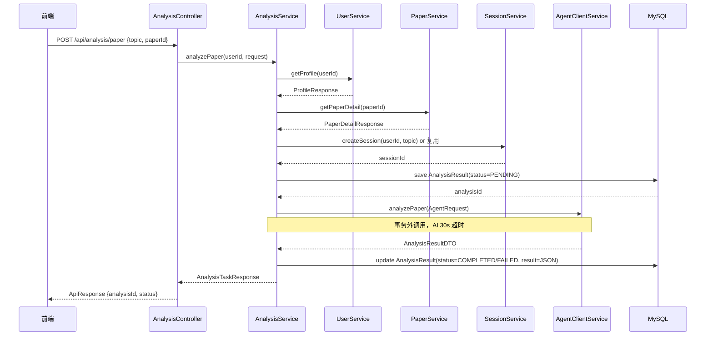

# task22: AnalysisController + AnalysisService.analyzePaper (JM3 Week 6 Day 1)

> **里程碑**：M3：前后端联调成功 / **JM3 Week 6 Day 1**：分析服务基础
> **版本**：v0.3
> **优先级**：P0
> **功能编号**：F2.4.1, F2.4.4, F2.4.5, F2.5.5

---

## 任务概述

实现分析服务模块的**基础层**：

1. **`AnalysisController`** — 暴露 `POST /api/analysis/paper` 端点
2. **`AnalysisService.analyzePaper`** — 完整编排 7 步流程
3. **2 个新 DTO** — `PaperAnalysisRequest`（请求）/ `AnalysisTaskResponse`（响应）

**核心编排流程**：



---

## 上下文定位

| 涉及层级 | 模块 |
|----------|------|
| java_backend | `com.literatureassistant.controller.AnalysisController`（新增） |
| java_backend | `com.literatureassistant.service.AnalysisService`（新增） |
| java_backend | `com.literatureassistant.dto.request.PaperAnalysisRequest`（新增） |
| java_backend | `com.literatureassistant.dto.response.AnalysisTaskResponse`（新增） |

**已有可复用**：
- `UserService.getProfile(userId)` — 返回 4 维度画像
- `PaperService.getPaperDetail(paperId)` — 论文详情
- `SessionService.createSession(userId, request)` — 新建会话
- `SessionService.getCurrentUserId()` — 从 SecurityContext 取 userId
- `SessionService.validateDataIsolation(userId)` — 403 抛出模式
- `AnalysisResultRepository` — findByAnalysisId / save
- `AnalysisResult Entity` — status/result(JSON) 字段
- `AgentClientService.analyzePaper(request)` — 编排层入口（task21）

---

## 涉及文件

| 操作 | 路径 | 说明 |
|------|------|------|
| 新增 | `controller/AnalysisController.java` | POST /api/analysis/paper |
| 新增 | `service/AnalysisService.java` | 7 步编排 |
| 新增 | `dto/request/PaperAnalysisRequest.java` | 请求 DTO（3 字段） |
| 新增 | `dto/response/AnalysisTaskResponse.java` | 响应 DTO（4 字段） |
| 新增 | `test/controller/AnalysisControllerTest.java` | 5 个 MockMvc 测试 |
| 新增 | `test/service/AnalysisServiceTest.java` | 6 个 Service 测试 |

---

## 关键实现

### 1. PaperAnalysisRequest

```java
@Data
@Builder
@NoArgsConstructor
@AllArgsConstructor
public class PaperAnalysisRequest {

    @NotBlank(message = "研究主题不能为空")
    @Size(max = 500, message = "研究主题长度不能超过500")
    private String topic;

    @NotBlank(message = "论文ID不能为空")
    private String paperId;

    private String sessionId;  // 可选；为空时新建
}
```

### 2. AnalysisService.analyzePaper 核心

```java
@Service
@Slf4j
@RequiredArgsConstructor
public class AnalysisService {

    private final UserService userService;
    private final PaperService paperService;
    private final SessionService sessionService;
    private final AgentClientService agentClientService;
    private final AnalysisResultRepository analysisResultRepository;
    private final ObjectMapper objectMapper;

    public AnalysisTaskResponse analyzePaper(String userId, PaperAnalysisRequest request) {
        validateUserId(userId);
        
        // 1) 画像
        ProfileResponse profile = userService.getProfile(userId);
        UserProfileDTO userProfile = toUserProfileDTO(profile);
        
        // 2) 论文
        paperService.getPaperDetail(request.getPaperId());  // 触发 404 if not found
        
        // 3) Session
        String sessionId = resolveOrCreateSession(userId, request);
        
        // 4) 生成 analysisId + 保存 PENDING
        String analysisId = generateAnalysisId();
        AnalysisResult entity = saveAnalysisResult(analysisId, sessionId, AnalysisType.PAPER_ANALYSIS, AnalysisStatus.PENDING, "{}");
        
        // 5) 构造 AgentRequest
        AgentRequest agentRequest = AgentRequest.builder()
                .topic(request.getTopic())
                .paperIds(List.of(request.getPaperId()))
                .userId(userId)
                .userProfile(userProfile)
                .analysisType(AnalysisType.PAPER_ANALYSIS)
                .analysisId(analysisId)
                .build();
        
        // 6) 调用 AI（事务外）
        AnalysisResultDTO result = agentClientService.analyzePaper(agentRequest);
        
        // 7) 更新 AnalysisResult
        updateAnalysisResult(analysisId, result);
        
        return AnalysisTaskResponse.builder()
                .analysisId(analysisId)
                .status(result.getStatus())
                .message(buildMessage(result))
                .build();
    }
    
    @Transactional
    protected AnalysisResult saveAnalysisResult(...) { ... }
    
    @Transactional
    protected void updateAnalysisResult(String analysisId, AnalysisResultDTO result) { ... }
}
```

> **关键约束**：AI 调用（步骤 6）必须在事务外。`saveAnalysisResult` 和 `updateAnalysisResult` 各自带 `@Transactional`，事务粒度为单个 DB 操作。

### 3. 状态机映射

| Python status | Java AnalysisStatus | 说明 |
|----------------|---------------------|------|
| `processing` | `PROCESSING` | 进行中 |
| `completed`（degraded=false） | `COMPLETED` | 成功 |
| `completed`（degraded=true） | `COMPLETED` + degraded 标记 | 缓存回退 |
| `failed` | `FAILED` | 失败 |
| `degraded`（无 result） | `FAILED` + degraded=true | 降级无缓存 |

---

## 禁止行为

- ❌ 把 userId 从前端 request.userId 取（必须 SecurityContext）
- ❌ 在 @Transactional 方法内调 agentClientService.analyzePaper
- ❌ AgentRequest 完整内容写入日志
- ❌ AnalysisService 直接返回 Entity
- ❌ SQL 拼接（必须用 Repository）
- ❌ 复用他人 sessionId

---

## 测试要求

| 测试名 | 框架 | 覆盖 |
|--------|------|------|
| `analyzePaperController_success_returns202` | junit5 | 正常流程 |
| `analyzePaperController_blank_topic_returns400` | junit5 | 参数校验 |
| `analyzePaperController_unauthenticated_returns401` | junit5 | 未授权 |
| `analyzeService_normal_completes_analysisResult` | junit5 | 状态机 |
| `analyzeService_aiFailure_marks_degraded` | junit5 | 降级 |
| `analyzeService_sessionIsolation_throws403` | junit5 | 数据隔离 |

**验证命令**：
```bash
cd Veritas/backend && mvn -Dtest='AnalysisControllerTest,AnalysisServiceTest' test
```

---

## 验收标准

- [ ] POST /api/analysis/paper 参数校验生效
- [ ] 完整编排 7 步全部执行
- [ ] 任务状态机 PENDING→PROCESSING→COMPLETED/FAILED 正确
- [ ] userId 从 SecurityContext 获取
- [ ] 事务边界正确：AI 调用在事务外
- [ ] 复用他人 sessionId 抛 403
- [ ] 11 个单元测试全部通过

---

## 下一步

- **task23**：在 AnalysisService 扩展 `getAnalysisResult` + `getAnalysisStatus` 方法；AnalysisController 增加 2 个 GET 端点；HealthController 集成 `agentClientService.isHealthy()`
