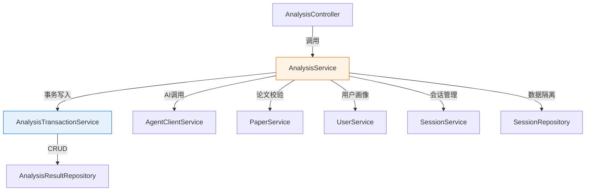

# task24: AnalysisService 完整编排重构 — 消除自注入 + 模板方法 (JM4 Week 7 Day 1-2)

> **里程碑**：M4：多Agent协同完成 / **JM4 Week 7 Day 1-2**：AnalysisService 重构
> **版本**：v0.4
> **优先级**：P0
> **功能编号**：F4.1.1, F4.1.2

---

## 任务概述

重构 `AnalysisService`，消除 `@Autowired @Lazy` 自注入反模式（S-003），提取 `AnalysisTransactionService` 处理事务方法，统一三种分析类型的编排逻辑为模板方法模式。

| 变更 | 说明 |
|------|------|
| 新建 `AnalysisTransactionService` | 提取 savePending() + completeAnalysis() 事务方法 |
| 修改 `AnalysisService` | 删除 @Autowired @Lazy self，注入 AnalysisTransactionService |
| 重构 `analyzePaper()` | 调用 transactionService 替代 self 调用 |
| 预留骨架 | comparePapers() + generateReport() 抛 UnsupportedOperationException |

---

## 上下文定位

| 涉及层级 | 模块 |
|----------|------|
| java_backend | `AnalysisService`（重构） / `AnalysisTransactionService`（新增） |

**已有可复用**：
- `AnalysisService` 完整代码（362行）：含 `@Autowired @Lazy self` + `savePending()` + `completeAnalysis()`
- `AnalysisResultRepository`：save()、findById()、findByAnalysisId()
- `AgentRequest` 构建模式
- `AnalysisServiceTest` 6 个现有测试（重构后必须全部通过）

---

## 涉及文件

| 操作 | 路径 | 说明 |
|------|------|------|
| 新增 | `service/AnalysisTransactionService.java` | 事务方法提取：savePending + completeAnalysis |
| 修改 | `service/AnalysisService.java` | 消除自注入 + 模板方法重构 + 骨架方法 |
| 新增 | `test/service/AnalysisTransactionServiceTest.java` | 事务方法单元测试 |
| 修改 | `test/service/AnalysisServiceTest.java` | 修改 self → transactionService 验证 |

---

## 关键实现

### 1. AnalysisTransactionService（新建）

```java
@Slf4j
@Service
@RequiredArgsConstructor
public class AnalysisTransactionService {

    private final AnalysisResultRepository analysisResultRepository;
    private final ObjectMapper objectMapper;

    /**
     * 保存 AnalysisResult(PENDING) 记录 — 短事务。
     * 从 AnalysisService.savePending 迁移。
     */
    @Transactional
    public AnalysisResult savePending(String analysisId, String sessionId, AnalysisType type) {
        AnalysisResult entity = AnalysisResult.builder()
                .analysisId(analysisId)
                .sessionId(sessionId)
                .type(type)
                .status(AnalysisStatus.PENDING)
                .result("{}")
                .build();
        return analysisResultRepository.save(entity);
    }

    /**
     * 更新 AnalysisResult 状态 + 持久化 result JSON — 短事务。
     * 从 AnalysisService.completeAnalysis 迁移。
     */
    @Transactional
    public AnalysisTaskResponse completeAnalysis(Long id, AnalysisResultDTO result) {
        // 原样迁移 AnalysisService.completeAnalysis 逻辑
        AnalysisResult entity = analysisResultRepository.findById(id)
                .orElseThrow(() -> new ResourceNotFoundException("AnalysisResult", String.valueOf(id)));
        AnalysisStatus newStatus = (result != null && Boolean.TRUE.equals(result.getDegraded()))
                ? AnalysisStatus.COMPLETED
                : mapStatus(result);
        entity.setStatus(newStatus);
        entity.setResult(serializeResult(result));
        AnalysisResult saved = analysisResultRepository.save(entity);

        String message = buildMessage(result);
        return AnalysisTaskResponse.builder()
                .analysisId(saved.getAnalysisId())
                .status(saved.getStatus())
                .message(message)
                .createdAt(saved.getCreatedAt() != null ? saved.getCreatedAt() : LocalDateTime.now())
                .build();
    }

    // 私有辅助方法：mapStatus / serializeResult / buildMessage 从 AnalysisService 迁移
}
```

### 2. AnalysisService 重构

```java
@Slf4j
@Service
@RequiredArgsConstructor
public class AnalysisService {

    private final UserService userService;
    private final PaperService paperService;
    private final SessionService sessionService;
    private final AgentClientService agentClientService;
    private final AnalysisTransactionService transactionService;  // 替代 self
    private final AnalysisResultRepository analysisResultRepository;
    private final SessionRepository sessionRepository;
    private final ObjectMapper objectMapper;

    // ❌ 删除: @Autowired @Lazy private AnalysisService self;

    public AnalysisTaskResponse analyzePaper(String userId, PaperAnalysisRequest request) {
        // 编排流程不变，self → transactionService
        // ...
        AnalysisResult pending = transactionService.savePending(analysisId, sessionId, AnalysisType.PAPER_ANALYSIS);
        // ...
        return transactionService.completeAnalysis(pending.getId(), result);
    }

    /**
     * 对比分析骨架（task25 实现）
     */
    public AnalysisTaskResponse comparePapers(String userId, CompareRequest request) {
        throw new UnsupportedOperationException("对比分析尚未实现");
    }

    /**
     * 综述生成骨架（后续任务实现）
     */
    public AnalysisTaskResponse generateReport(String userId, ReportRequest request) {
        throw new UnsupportedOperationException("综述生成尚未实现");
    }

    // 查询方法（task23）保持不变
    // 私有方法（buildUserProfile / resolveOrCreateSession / validateDataIsolation 等）保持不变
    // 删除 savePending / completeAnalysis（已迁移到 AnalysisTransactionService）
    // 删除 mapStatus / serializeResult / buildMessage（已迁移到 AnalysisTransactionService）
}
```

---

## 依赖关系



---

## 禁止行为

- ❌ AnalysisService 中保留任何形式的自注入（@Autowired @Lazy self、ApplicationContext.getBean 等）
- ❌ AnalysisTransactionService 反向依赖 AnalysisService
- ❌ 修改 analyzePaper 编排流程的步骤顺序或逻辑
- ❌ 删除或修改 getAnalysisResult / getAnalysisStatus 查询方法
- ❌ comparePapers / generateReport 骨架方法包含实际业务逻辑
- ❌ AnalysisTransactionService 中注入 AgentClientService 或 UserService

---

## 测试要求

| 测试名 | 覆盖 |
|--------|------|
| `savePending_creates_pending_analysis_result` | 正常流程 + 字段验证 |
| `savePending_returns_saved_entity` | 返回值验证 |
| `completeAnalysis_updates_status_and_result` | 状态更新 + result 持久化 |
| `completeAnalysis_degraded_result_sets_COMPLETED` | 降级场景 |
| `completeAnalysis_entity_not_found_throws_404` | 异常流程 |
| `analyzePaper_uses_transactionService_not_self` | 重构验证 |
| `comparePapers_throws_unsupported_operation` | 骨架方法 |
| `generateReport_throws_unsupported_operation` | 骨架方法 |

**验证命令**：
```bash
# 单元测试
cd Veritas/backend && mvn -Dtest='AnalysisTransactionServiceTest,AnalysisServiceTest' test

# 全量回归
cd Veritas/backend && mvn test
# 期望: 全部测试通过（272+ 个），0 失败
```

---

## 验收标准

- [ ] AnalysisService 中不存在 @Autowired @Lazy self 注入
- [ ] AnalysisTransactionService 包含 savePending + completeAnalysis 两个 @Transactional 方法
- [ ] analyzePaper 编排流程不变，调用 transactionService 替代 self
- [ ] comparePapers / generateReport 骨架方法存在且抛 UnsupportedOperationException
- [ ] AnalysisTransactionService 不反向依赖 AnalysisService
- [ ] 全部现有测试通过（272+ 个），重构不改变行为

---

## 下一步（task25）

- **JM4 Day 3**: 实现 comparePapers() 完整编排 + CompareRequest DTO + POST /api/analysis/compare 端点
- **JM4 Day 4**: 实现 generateReport() 完整编排 + ReportRequest DTO + POST /api/analysis/report 端点

---

## 未来建议 / 补充

1. **建议引入模板方法抽象类**：当三种分析类型（PAPER_ANALYSIS/COMPARE/REPORT）编排逻辑稳定后，可提取 `AbstractAnalysisExecutor` 抽象类，将公共编排步骤（画像→Session→savePending→callAI→completeAnalysis）固化在模板方法中，各子类仅实现差异步骤（如论文校验策略、AgentRequest 构建策略）
2. **建议 AnalysisTransactionService 增加 @CacheEvict**：completeAnalysis 更新 AnalysisResult 后应主动清除 `analysisResult` 缓存，避免 getAnalysisResult 返回过期数据
3. **建议增加事务监控**：通过 Micrometer 暴露 `analysis_transaction_duration_seconds` 指标，监控 savePending/completeAnalysis 事务耗时
4. **S-003 消除验证**：重构完成后，建议全局搜索 `@Autowired @Lazy` 确认项目中无其他自注入反模式
