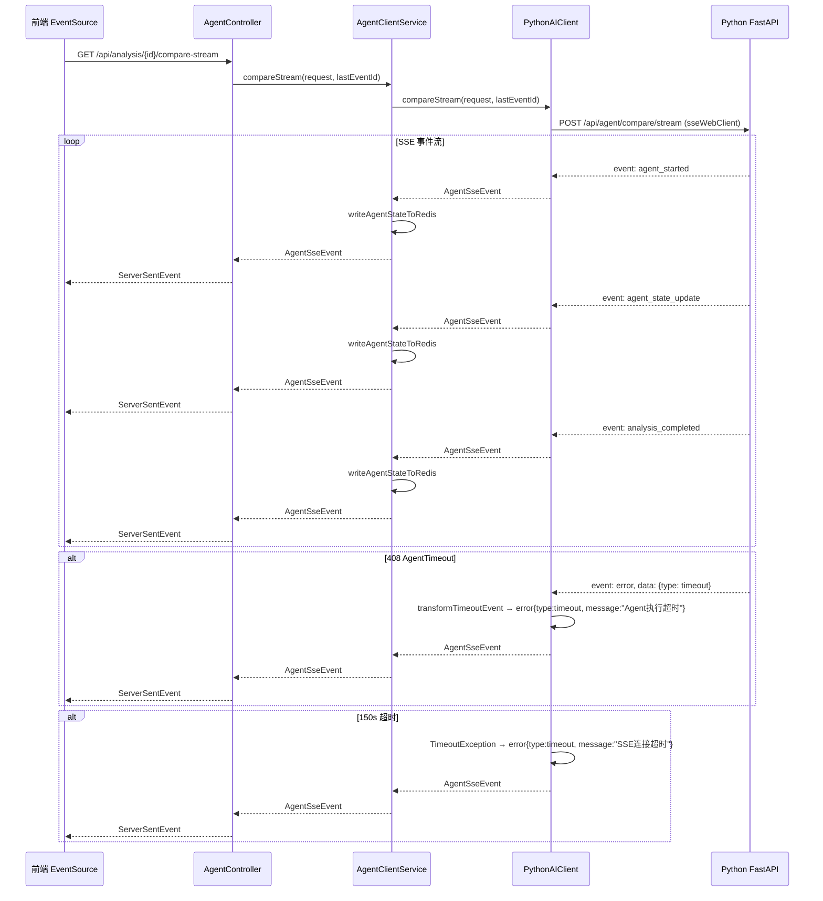

# task27: PythonAIClient SSE 接收扩展 (JM4 Week 7-8 Day 5-6)

> **里程碑**：M4：多Agent协同 / **JM4 Week 7-8 Day 5-6**：SSE 接收扩展 + 408 超时处理
> **版本**：v0.4
> **优先级**：P0
> **功能编号**：F2.4.7, F2.5.3

---

## 任务概述

扩展 PythonAIClient 的 SSE 接收能力，支持对比分析和综述生成的 SSE 流，处理 408 超时事件，确保 SSE 流的错误恢复和资源清理。

| 方法 | Python 端点 | 说明 |
|------|------------|------|
| `compareStream` | POST /api/agent/compare/stream | 对比分析 SSE 流 |
| `reportStream` | POST /api/agent/report/stream | 综述生成 SSE 流 |

---

## 上下文定位

| 涉及层级 | 模块 |
|----------|------|
| java_backend | `PythonAIClient`（扩展 — 新增 compareStream/reportStream + 408 处理） |
| java_backend | `AgentClientService`（扩展 — 新增 compareStream/reportStream 包装） |

**已有可复用**：
- `PythonAIClient.analyzeStream` — 基础 SSE 接收（sseWebClient + Last-Event-ID + 150s timeout）
- `AgentClientService.generateReportStream` — SSE + Redis 状态写入模式
- `AgentSseEvent` — 7 种事件类型 DTO（agent_started/agent_state_update/agent_completed/agent_failed/analysis_completed/error/ping）
- `WebClientConfig.sseWebClient` — 独立连接池（20 connections, 150s timeout, Accept: text/event-stream）
- `writeAgentStateToRedis` — SSE 事件 → Redis Hash 写入逻辑

---

## 涉及文件

| 操作 | 路径 | 说明 |
|------|------|------|
| 修改 | `client/PythonAIClient.java` | 新增 compareStream/reportStream + 提取公共 streamSse + 408 处理 |
| 修改 | `service/AgentClientService.java` | 新增 compareStream/reportStream 包装 + Redis 写入 |
| 修改 | `test/client/PythonAIClientTest.java` | 扩展 SSE 测试（compareStream/reportStream/408/超时） |
| 修改 | `test/service/AgentClientServiceTest.java` | 扩展 Redis 写入测试 |

---

## 关键实现

### 1. 提取公共 streamSse 私有方法

```java
private static final String ENDPOINT_COMPARE_STREAM = "/api/agent/compare/stream";
private static final String ENDPOINT_REPORT_STREAM = "/api/agent/report/stream";

/**
 * 公共 SSE 流逻辑：发送 POST 请求到指定端点，接收 SSE 事件流。
 * <p>三个 public 方法（analyzeStream/compareStream/reportStream）复用此方法，仅 endpoint 不同。
 *
 * @param endpoint    Python SSE 端点路径
 * @param request     AgentRequest 请求体
 * @param lastEventId SSE Last-Event-ID Header（断线重连时透传，可空）
 * @return SSE 事件流
 */
private Flux<AgentSseEvent> streamSse(String endpoint, AgentRequest request, String lastEventId) {
    WebClient.RequestBodySpec bodySpec = sseWebClient.post()
            .uri(endpoint);
    // Last-Event-ID Header 透传
    if (lastEventId != null && !lastEventId.isBlank()) {
        bodySpec = bodySpec.header("Last-Event-ID", lastEventId);
    }
    return bodySpec
            .bodyValue(request)
            .retrieve()
            .bodyToFlux(AgentSseEvent.class)
            .timeout(Duration.ofSeconds(150))
            .onErrorResume(TimeoutException.class, e -> {
                log.warn("SSE stream timeout: analysisId={}, endpoint={}", request.getAnalysisId(), endpoint);
                AgentSseEvent timeoutEvent = AgentSseEvent.builder()
                        .event("error")
                        .data(Map.of("type", "timeout", "message", "SSE连接超时"))
                        .build();
                return Flux.just(timeoutEvent);
            })
            .map(this::transformTimeoutEvent)  // 408 事件转换
            .doOnError(e -> log.warn("SSE stream error: analysisId={}, endpoint={}, error={}",
                    request.getAnalysisId(), endpoint, e.getMessage()))
            .onErrorContinue((err, item) ->
                    log.warn("SSE event 跳过: {}", err.getMessage()));
}
```

### 2. 三个 public SSE 方法

```java
public Flux<AgentSseEvent> analyzeStream(AgentRequest request, String lastEventId) {
    return streamSse(ENDPOINT_ANALYZE_STREAM, request, lastEventId);
}

public Flux<AgentSseEvent> compareStream(AgentRequest request, String lastEventId) {
    return streamSse(ENDPOINT_COMPARE_STREAM, request, lastEventId);
}

public Flux<AgentSseEvent> reportStream(AgentRequest request, String lastEventId) {
    return streamSse(ENDPOINT_REPORT_STREAM, request, lastEventId);
}
```

### 3. 408 超时事件转换

```java
/**
 * 将 Python 端 408 AgentTimeout 事件转为前端可理解的降级事件。
 * <p>触发条件：event="error" + data.type="timeout" 或 data.type="agent_timeout"
 */
private AgentSseEvent transformTimeoutEvent(AgentSseEvent event) {
    if (event == null || event.getData() == null) {
        return event;
    }
    Object typeObj = event.getData().get("type");
    if (typeObj != null && ("timeout".equals(typeObj.toString())
            || "agent_timeout".equals(typeObj.toString()))) {
        return AgentSseEvent.builder()
                .id(event.getId())
                .event("error")
                .data(Map.of(
                        "type", "timeout",
                        "message", "Agent执行超时",
                        "analysisId", event.getData().getOrDefault("analysisId", "")
                ))
                .build();
    }
    return event;
}
```

### 4. AgentClientService 包装方法

```java
/**
 * SSE 流式调用 Python 进行对比分析。
 * <p>同步把 SSE 事件写入 Redis Hash 供 GET /api/analysis/{id}/status 读取。
 */
public Flux<AgentSseEvent> compareStream(AgentRequest request, String lastEventId) {
    return pythonAIClient.compareStream(request, lastEventId)
            .doOnNext(event -> writeAgentStateToRedis(request.getAnalysisId(), event))
            .onErrorContinue((err, item) ->
                    log.warn("compareStream SSE event 解析失败: {}", err.getMessage()));
}

/**
 * SSE 流式调用 Python 进行综述生成。
 * <p>同步把 SSE 事件写入 Redis Hash 供 GET /api/analysis/{id}/status 读取。
 */
public Flux<AgentSseEvent> reportStream(AgentRequest request, String lastEventId) {
    return pythonAIClient.reportStream(request, lastEventId)
            .doOnNext(event -> writeAgentStateToRedis(request.getAnalysisId(), event))
            .onErrorContinue((err, item) ->
                    log.warn("reportStream SSE event 解析失败: {}", err.getMessage()));
}
```

---

## SSE 事件流



---

## 连接池隔离

| WebClient | 连接池 | 超时 | 用途 |
|-----------|--------|------|------|
| `webClient` | 50 connections | 30s | 同步调用（analyze/search/health） |
| `sseWebClient` | 20 connections | 150s | SSE 流式调用（analyzeStream/compareStream/reportStream） |
| `healthWebClient` | 1 connection | 5s | 健康探测 |

---

## 禁止行为

- ❌ compareStream/reportStream 使用同步 webClient（必须用 sseWebClient）
- ❌ SSE 流异常直接抛出而不转为 error 事件
- ❌ 408 超时事件直接透传 Python 原始错误信息给前端
- ❌ SSE 流无超时保护（必须 150s timeout）
- ❌ compareStream/reportStream 不写 Redis Agent 状态
- ❌ 复制 analyzeStream 完整代码到 compareStream/reportStream（必须提取公共方法）

---

## 测试要求

| 测试名 | 覆盖 |
|--------|------|
| `compareStream_constructs_correct_request` | 验证 endpoint + body + header |
| `reportStream_constructs_correct_request` | 验证 endpoint + body + header |
| `compareStream_parses_sse_events` | SSE 事件解析 |
| `reportStream_parses_sse_events` | SSE 事件解析 |
| `sse_408_event_transformed_to_timeout_error` | 408 → error{type:timeout} |
| `sse_timeout_150s_sends_error_event` | 超时 → error 终止事件 |
| `agentClientService_compareStream_writes_redis` | Redis Hash 写入 |
| `agentClientService_reportStream_writes_redis` | Redis Hash 写入 |
| `streamSse_reuses_common_logic` | 公共方法复用验证 |

**验证命令**：
```bash
# PythonAIClient 测试
cd Veritas/backend && mvn -Dtest='PythonAIClientTest' test

# AgentClientService 测试
cd Veritas/backend && mvn -Dtest='AgentClientServiceTest' test

# 手动验证 SSE 流
curl -s -N -H 'Authorization: Bearer {jwt}' \
  -H 'Accept: text/event-stream' \
  'http://localhost:8080/api/analysis/{analysisId}/agent-stream' | head -20
```

---

## 验收标准

- [ ] PythonAIClient.compareStream 调用 /api/agent/compare/stream 并返回 Flux<AgentSseEvent>
- [ ] PythonAIClient.reportStream 调用 /api/agent/report/stream 并返回 Flux<AgentSseEvent>
- [ ] 三个 SSE 方法复用公共 streamSse 私有方法（DRY）
- [ ] 408 超时事件转为 AgentSseEvent(event='error', data={type:timeout})
- [ ] AgentClientService.compareStream/reportStream 写入 Redis Agent 状态
- [ ] SSE 流 150s 超时后自动关闭并发送 error 终止事件
- [ ] 所有 SSE 流使用 sseWebClient（不使用同步 webClient）
- [ ] 9+ 个 SSE 扩展测试全部通过

---

## 下一步（JM4 Day 7-8）

### AgentController（独立控制器）
- 新增 GET /api/analysis/{id}/compare-stream 端点
- 新增 GET /api/analysis/{id}/report-stream 端点
- 复用 AnalysisController 的 agent-stream 模式
- JWT 认证 + 数据隔离 + Last-Event-ID

### JM4 Day 9-10: JM4 验收
- SSE 前端集成（EventSource 订阅）
- 全链路联调测试
- JM4 验收检查点

---

## 未来建议 / 补充

1. **建议引入 SSE 心跳机制**：当前 Python 端有 ping 事件，但 Java 端未主动发送心跳；建议 AgentController 层增加 30s 间隔心跳，防止 Nginx/CDN 超时断连
2. **建议 SSE 重连策略增强**：当前仅透传 Last-Event-ID，建议前端增加指数退避重连（1s → 2s → 4s → 8s → 16s max）
3. **建议 SSE 事件 ID 单调递增校验**：当前信任 Python 端 event id，建议 Java 端增加校验，防止乱序
4. **建议 SSE 流量监控**：通过 Micrometer 暴露 sse_stream_duration_seconds + sse_events_total 指标，便于 JM6 性能监控
5. **建议 408 降级策略细化**：当前 408 直接转 error 事件，未来可根据 Agent 阶段（retriever 已完成 vs analyzer 超时）返回部分结果 + 降级标记