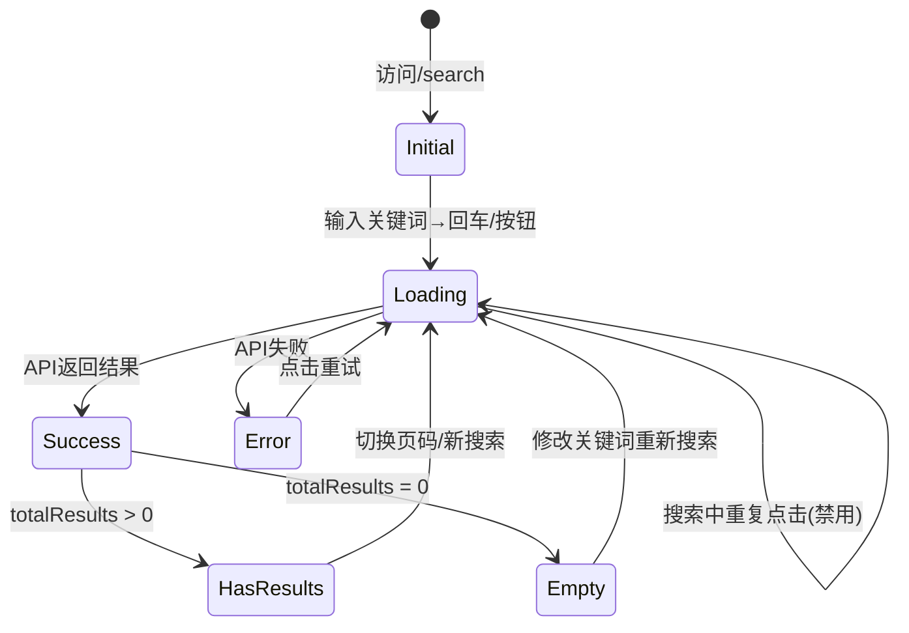
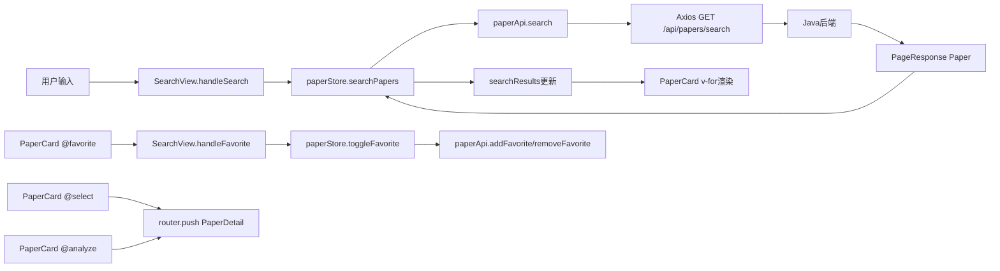

# Task15: SearchView 检索结果页 + PaperCard 论文卡片组件 + 分页

## 任务概述

实现论文检索结果页面（SearchView.vue）和论文卡片业务组件（PaperCard.vue），并创建通用分页composable（usePagination.ts）。SearchView展示搜索栏、结果统计、论文卡片列表和分页；PaperCard为独立可复用组件，可被SearchView和CompareView共同使用。

## 里程碑

FM2：用户界面与论文检索页面可用

## 功能编号

F1.2.1 / F1.2.2 / F1.2.3

## UI分析

```
页面类型：搜索+列表型
用户目标：浏览检索结果，选择感兴趣的论文进行分析或收藏
信息层级：
  L1：搜索框 + 论文标题 + 相关度
  L2：摘要 + 关键词标签 + 作者·年份·会议
  L3：推荐理由 + 收藏按钮
视觉重点：论文卡片列表
操作路径：输入关键词 → 回车/点击检索 → 浏览结果 → 点击标题→详情 → 收藏/分析
核心CTA：[检索] / [分析] / [收藏]
数据密度：中
```

## 组件层级

```
SearchView.vue (页面)
├── 搜索栏区域 (search-view__header)
│   └── el-input + el-button
├── 结果统计 (search-view__stats)
├── 结果列表区域 (search-view__results)
│   └── PaperCard.vue (业务组件) × N
├── 空状态 (el-empty)
├── 错误状态 (el-result + 重试按钮)
└── 分页区域 (search-view__pagination)
    └── el-pagination (usePagination composable)
```

## 涉及模块

| 模块 | 路径 | 职责 |
|------|------|------|
| paperStore | `src/stores/paperStore.ts` | 搜索/分页/收藏/选择状态管理 |
| Paper类型 | `src/types/paper.ts` | Paper/FilterParams接口定义 |
| paperApi | `src/api/paper.ts` | 论文搜索/收藏HTTP API |
| PageResponse | `src/types/common.ts` | 分页响应通用类型 |
| 路由 | `src/router/index.ts` | /search路由(已配置, requiresAuth:true) |

## 文件变更

| 操作 | 文件 | 说明 |
|------|------|------|
| 修改 | `Veritas/frontend/src/views/SearchView.vue` | 替换占位骨架为完整检索结果页 |
| 新增 | `Veritas/frontend/src/components/paper/PaperCard.vue` | 论文卡片业务组件(可复用) |
| 新增 | `Veritas/frontend/src/composables/usePagination.ts` | 通用分页composable |

## 已有实现（直接复用）

| 文件 | 说明 |
|------|------|
| `paperStore.ts` | searchPapers(query,page)/toggleFavorite(paperId)/togglePaperSelection(paper)/searchResults/totalResults/currentPage/pageSize/favorites/selectedPaperIds |
| `types/paper.ts` | Paper{paperId,title,authors[],abstract,year,venue?,keywords?,citationCount?,score?,recommendReason?} / FilterParams |
| `api/paper.ts` | paperApi.search({q,page,size,...FilterParams})→PageResponse<Paper> / addFavorite / removeFavorite |
| `types/common.ts` | PageResponse<T>{items,total,page,size,totalPages} |
| `router/index.ts` | /search路由已配置(requiresAuth:true)，全局守卫已实现 |

## 功能要求

### SearchView.vue

| ID | 要求 | 优先级 | 验收条件 |
|----|------|--------|----------|
| FR-001 | 顶部搜索栏：el-input clearable + el-button，回车/按钮触发搜索，搜索中禁用交互 | P0 | 回车和按钮均可触发；搜索中loading+禁用 |
| FR-002 | 结果统计："找到 N 篇相关论文"，仅totalResults>0时显示 | P1 | 搜索后正确显示总数；无结果不显示 |
| FR-003 | PaperCard列表：v-for渲染，v-loading覆盖，卡片间距16px | P0 | 结果正确渲染；Loading遮罩；16px间距 |
| FR-004 | Empty状态：el-empty "未找到相关论文，试试调整搜索词？"，仅hasSearched&&无结果时显示 | P0 | 搜索后无结果显示；初始不显示 |
| FR-005 | Error状态：ElMessage.error + el-result错误区域 + 重试按钮 | P0 | 失败时提示+重试按钮可重新搜索 |
| FR-006 | 分页：el-pagination，@current-change→searchPapers，不足一页不显示 | P0 | 分页正确工作；切换页码请求数据+滚动顶部 |
| FR-016 | 收藏逻辑：toggleFavorite + ElMessage反馈(成功/取消/失败) | P1 | 收藏操作有Toast反馈 |
| FR-017 | 路由跳转：select/analyze→router.push PaperDetail | P1 | 点击标题/分析按钮跳转详情页 |
| FR-018 | 初始化：route.query.q存在时自动填充搜索并执行 | P1 | 从首页跳转时自动搜索 |
| FR-020 | BEM样式 + CSS变量 + 8px间距 + max-width居中 | P0 | 命名规范；无硬编码色值 |

### PaperCard.vue

| ID | 要求 | 优先级 | 验收条件 |
|----|------|--------|----------|
| FR-008 | Props: `{paper:Paper, selectable?:boolean, selected?:boolean}` | P0 | TypeScript泛型Props完整 |
| FR-009 | Emits: `select(paperId) / analyze(paperId) / favorite(paperId)` | P0 | TypeScript泛型Emits完整 |
| FR-010 | 标题区：h3可点击触发select，元数据(作者·年份·会议) | P0 | 标题点击→select；元数据用'·'分隔 |
| FR-011 | 摘要截断：truncateText(text, 200)，超出显示'...' | P0 | 200字截断正确；工具函数可复用 |
| FR-012 | 关键词：最多3个el-tag(info,small)，无关键词不渲染 | P0 | ≤3个标签；间距8px；空时不渲染 |
| FR-013 | 相关度：el-tag(success)显示百分比，score不存在不渲染 | P1 | 百分比取整正确；无score不显示 |
| FR-014 | 推荐理由：前缀warning + 内容info，不存在不渲染 | P2 | 有推荐理由时显示；无则不渲染 |
| FR-015 | 操作按钮：[分析]primary + [收藏]default/danger，emit事件 | P0 | 按钮事件正确触发；收藏状态正确 |
| FR-019 | BEM样式 + CSS变量 + 8px间距 + el-card shadow=hover | P0 | 命名规范；悬停效果；无硬编码色值 |

### usePagination.ts

| ID | 要求 | 优先级 | 验收条件 |
|----|------|--------|----------|
| FR-007 | 封装分页逻辑：currentPage/pageSize/total/handlePageChange，页码切换后滚动顶部 | P1 | composable返回正确；切换后调用fetchFn+scrollTo |

## 交互状态覆盖



| 状态 | 实现方式 | 说明 |
|------|----------|------|
| Loading | v-loading on 结果区域 | 搜索/翻页时显示 |
| Empty | el-empty | "未找到相关论文，试试调整搜索词？" |
| Error | ElMessage.error + el-result + 重试按钮 | 失败提示+可重试 |
| Success | PaperCard列表 + 统计信息 | 正常结果展示 |
| Hover | el-card shadow="hover" | 卡片悬停提升效果 |

## 数据流



## 跨系统字段映射

| Java(camelCase) | JSON(snake_case) | Paper字段 |
|------------------|-------------------|-----------|
| paperId | paper_id | paperId |
| citationCount | citation_count | citationCount? |
| recommendReason | recommend_reason | recommendReason? |
| pdfUrl | pdf_url | pdfUrl? |

## 关键约束

1. **`<script setup lang="ts">`** + Composition API + scoped样式
2. **组件结构顺序**：imports → Props/Emits → ref/reactive → computed → methods → onMounted
3. **单组件≤300行**，超过必须拆分
4. **API调用通过paperStore**，SearchView不直接调paperApi
5. **PaperCard纯展示组件**，不依赖paperStore，只通过emit上行事件
6. **BEM CSS命名**：search-view__* / paper-card__*
7. **CSS变量**：--el-color-primary/success/info等，禁止硬编码色值
8. **8px间距网格**：4/8/12/16/24/32/48，禁止奇数或非8px倍数
9. **前端只调Java后端API**，禁止直接调Python AI服务
10. **PaperCard可复用**：SearchView和CompareView都会使用

## 禁止行为

| ID | 禁止 | 原因 | 严重度 |
|----|------|------|--------|
| FA-001 | SearchView直接调axios/paperApi | View→Store→API分层 | critical |
| FA-002 | PaperCard内部调用paperStore | 保证组件独立可复用 | critical |
| FA-003 | 搜索无loading状态 | 产品级必备(AP-006) | high |
| FA-004 | 空列表显示空白 | 必须el-empty(AP-007) | high |
| FA-005 | 失败无用户反馈 | 必须ElMessage+重试(AP-008) | high |
| FA-006 | 硬编码颜色值 | 必须CSS变量(AP-010) | high |
| FA-007 | 非法间距值 | 8px间距系统(AP-005) | medium |
| FA-008 | 组件超过300行 | 体积约束(AP-001) | high |
| FA-009 | 前端直调Python | 三层架构ADR-001 | critical |
| FA-010 | 输出伪代码/TODO | 必须完整可执行代码 | critical |
| FA-011 | PaperCard硬编码收藏判断 | 收藏状态应通过props传入 | high |

## 验收标准

| ID | 标准 | 验证方式 |
|----|------|----------|
| AC-001 | 搜索栏：回车/按钮触发，搜索中loading禁用 | 手动测试 |
| AC-002 | 结果统计正确显示 | 手动测试 |
| AC-003 | PaperCard列表+v-loading+16px间距 | 代码审查 |
| AC-004 | Empty状态：搜索后无结果显示el-empty | 手动测试 |
| AC-005 | Error状态：ElMessage.error+重试按钮 | 手动测试 |
| AC-006 | 分页正确工作，切换页码滚动到顶部 | 手动测试 |
| AC-007 | route.query.q自动填充搜索 | 手动测试 |
| AC-008 | PaperCard完整展示：标题/作者/摘要截断/关键词/相关度/推荐理由 | 代码审查 |
| AC-009 | 操作按钮事件正确触发 | 手动测试 |
| AC-010 | PaperCard可复用：不依赖paperStore | 代码审查 |
| AC-011 | usePagination正确封装 | 自动化测试 |
| AC-012 | BEM命名+scoped样式 | 代码审查 |
| AC-013 | 所有颜色使用CSS变量 | 代码审查 |
| AC-014 | 8px间距系统 | 代码审查 |
| AC-015 | TypeScript类型检查通过 | 自动化测试 |
| AC-016 | 单组件≤300行 | 代码审查 |
| AC-017 | 组件结构顺序正确 | 代码审查 |

## 验证命令

```bash
cd Veritas/frontend && npx vue-tsc --noEmit
cd Veritas/frontend && npx vitest run src/components/paper/PaperCard.vue
cd Veritas/frontend && npx vitest run src/views/SearchView.vue
cd Veritas/frontend && npx vitest run src/composables/usePagination.ts
```
