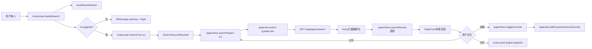

# Task17: 论文检索模块联调测试

## 任务概述

论文检索模块联调测试，验证 HomeView → SearchView → paperStore → API 全链路数据流和交互逻辑。本任务为联调验证任务，侧重发现并修复已实现组件间的衔接问题，补充缺失文件（PaperCard.vue、usePagination.ts、SearchView.vue完整实现），确保全链路畅通。

## 里程碑

FM2：用户界面与论文检索页面可用

## 版本

v0.2

## 涉及模块

| 模块 | 路径 | 当前状态 | 联调角色 |
|------|------|---------|---------|
| HomeView.vue | `src/views/HomeView.vue` | ✅ 已实现 | 搜索入口→跳转 |
| SearchView.vue | `src/views/SearchView.vue` | ⚠️ 仅骨架 | 检索结果展示（需补充实现） |
| PaperCard.vue | `src/components/paper/PaperCard.vue` | ❌ 不存在 | 论文卡片UI（需创建） |
| paperStore.ts | `src/stores/paperStore.ts` | ✅ 已实现 | 状态管理（需补充loading/error） |
| usePagination.ts | `src/composables/usePagination.ts` | ❌ 不存在 | 分页逻辑（需创建） |
| paper.ts | `src/api/paper.ts` | ✅ 已实现 | API封装 |
| api/index.ts | `src/api/index.ts` | ✅ 已实现 | Axios拦截器+JWT |
| router/index.ts | `src/router/index.ts` | ✅ 已实现 | 路由+守卫 |
| userStore.ts | `src/stores/userStore.ts` | ✅ 已实现 | 登录状态判断 |
| storage.ts | `src/utils/storage.ts` | ✅ 已实现 | 搜索历史管理 |

## 文件变更

| 操作 | 文件 | 说明 |
|------|------|------|
| modify | `src/views/HomeView.vue` | 联调验证搜索跳转逻辑，如发现bug则修复 |
| modify | `src/views/SearchView.vue` | 补充完整实现（当前仅骨架占位符） |
| create | `src/components/paper/PaperCard.vue` | 创建论文卡片组件（当前文件不存在） |
| create | `src/composables/usePagination.ts` | 创建分页composable（当前文件不存在） |
| modify | `src/stores/paperStore.ts` | 补充searchLoading/searchError状态，toggleFavorite错误回滚 |

## 数据流图



## 功能要求

### FR-001 首页检索流程联调验证 [P0]

验证 HomeView 搜索输入 → 点击检索/回车 → router.push('/search?q=xxx') 的完整链路：

- handleSearch 中 saveRecentSearch 调用后 recentSearches 正确更新
- router.push({name:'Search', query:{q:query}}) 正确传递查询参数
- 未登录用户 → ElMessage.warning → router.push('/login')
- 历史标签点击 handleRecentClick 正确填入搜索框并触发检索

**验收条件**：首页输入 "Multi-Agent" → 点击检索 → URL 跳转 /search?q=Multi-Agent

### FR-002 SearchView 检索结果页联调验证 [P0]

验证 SearchView 加载时读取 route.query.q → paperStore.searchPapers(q) → 展示 searchResults：

- onMounted 从 route.query.q 读取查询词，无查询词显示 el-empty
- 调用 paperStore.searchPapers(q, 1) 发起搜索
- 搜索中显示 v-loading 状态
- 搜索结果为空 → el-empty('未找到相关论文，试试调整搜索词？')
- 搜索失败 → 错误提示 + 重试按钮
- watch route.query.q 变化时重新搜索

**验收条件**：从首页跳转搜索页 → Loading → 成功展示论文卡片列表

### FR-003 PaperCard 组件联调验证 [P0]

验证 PaperCard 展示完整论文信息：

- 标题（超长截断）、作者（逗号分隔）、摘要（截断+展开/收起）
- 关键词（el-tag 列表）、相关度（百分比/星级）、推荐理由
- 收藏按钮：isFavorited prop 控制实心/空心 → @favorite-click 事件上行
- 分析按钮：@analyze-click 事件上行
- 卡片 hover 时 shadow 提升

**验收条件**：PaperCard 正确展示所有字段，按钮交互正常

### FR-004 分页联调验证 [P0]

- el-pagination 绑定 current-page/page-size/total
- current-change 触发 paperStore.searchPapers(currentQuery, page)
- 分页切换时显示 loading 状态
- page/size 参数正确传递给 API

**验收条件**：搜索 >10 条结果 → 切换第2页 → 数据正确加载

### FR-005 收藏功能联调验证 [P0]

- 点击收藏 → paperStore.toggleFavorite → API 调用 → favorites 列表更新
- 再次点击取消收藏 → API 调用 → favorites 列表移除
- PaperCard 收藏图标根据 paperStore.favorites 状态显示
- API 失败时 ElMessage.error 提示，favorites 状态回滚

**验收条件**：收藏按钮状态与 favorites 列表同步，失败时正确回滚

### FR-006 分析按钮联调验证 [P1]

- 分析按钮 → @analyze-click → SearchView → router.push({name:'PaperDetail', params:{paperId}})
- 路由跳转正确传递 paperId 参数

**验收条件**：点击分析 → URL 跳转 /paper/{paperId}

### FR-007 paperStore 状态一致性验证 [P0]

- searchPapers 成功后 searchResults/totalResults/currentQuery/currentPage 与 API 返回一致
- selectedPapers 添加/移除正确，上限5篇
- toggleFavorite 成功后 favorites 更新，失败时回滚
- filteredResults 计算属性正确筛选和排序

**验收条件**：paperStore 各状态值与 API 返回数据一致

### FR-008 API 对接验证 [P0]

- GET /api/papers/search 参数 {q, page, size, ...filters} 正确传递
- 响应经过 Axios 拦截器解包后得到 PageResponse\<Paper\> 格式
- paperApi.search 返回值与 paperStore.searchPapers 中赋值对应
- 401 → 拦截器自动跳转 /login + logout
- 网络错误 → ElMessage.error 提示

**验收条件**：API 请求参数格式正确，响应数据正确解析

### FR-009 Loading/Empty/Error 三态验证 [P0]

- Loading：搜索期间 v-loading / el-skeleton
- Empty：searchResults.length === 0 且非 loading → el-empty
- Error：searchPapers 异常 → 错误提示 + 重试按钮
- 三态互斥

**验收条件**：三种状态正确展示且互斥

### FR-010 历史搜索记录联调验证 [P1]

- 搜索后 saveRecentSearch → recentSearches 更新 → 标签刷新
- 历史去重（重复词移到首位）
- 上限10条
- 点击标签快捷检索
- 清除按钮清空历史

**验收条件**：搜索3个主题 → 首页显示3条标签 → 点击可检索 → 清除后消失

### FR-011 paperStore 缺失功能补充 [P0]

- 补充 searchLoading=ref(false)，searchPapers 中 loading=true/finally 中 loading=false
- 补充 searchError=ref\<string|null\>(null)，searchPapers catch 中设置
- toggleFavorite 补充 try-catch-rollback 逻辑（API失败时回滚 favorites）

**验收条件**：paperStore 补充 loading/error 状态，toggleFavorite 失败时回滚

### FR-012 缺失组件补充 [P0]

- PaperCard.vue：创建论文卡片组件
- usePagination.ts：创建分页 composable
- SearchView.vue：补充完整实现（如当前仅有骨架）

**验收条件**：文件存在且功能完整，TypeScript 编译无错误

### FR-013 TypeScript 编译验证 [P0]

npx vue-tsc --noEmit 确保所有文件类型正确

**验收条件**：编译无错误

### FR-014 开发服务器验证 [P0]

npm run dev 确保所有页面可访问

**验收条件**：首页和搜索页可正常访问和交互

## 验证场景

| # | 场景 | 预期结果 |
|---|------|---------|
| 1 | 正常流程：首页输入 "Multi-Agent" | 跳转搜索页 → 看到论文卡片列表 → 翻页 → 收藏 |
| 2 | 空结果：输入无意义字符串 | 搜索页显示 el-empty |
| 3 | 未登录：未登录状态输入查询 | 跳转登录页 |
| 4 | 历史记录：搜索3个不同主题 | 首页显示3条历史标签 → 点击标签快捷检索 |
| 5 | 收藏操作：点击收藏按钮 | 按钮状态变化 → 再次点击取消收藏 |
| 6 | 分页：搜索返回 >10 条结果 | 切换到第2页 → 数据正确加载 |
| 7 | 错误处理：断网状态搜索 | ElMessage.error 提示 |

## API 契约

### GET /api/papers/search

```
请求参数: { q: string, page?: number, size?: number, yearFrom?: number, yearTo?: number, venue?: string, minCitations?: number, sort?: string }
响应格式: { code: 200, message: "success", data: { items: Paper[], total: number, page: number, size: number, totalPages: number } }
```

### POST /api/papers/{paperId}/favorite

```
请求参数: paperId (路径参数)
响应格式: { code: 200, message: "success", data: null }
```

### DELETE /api/papers/{paperId}/favorite

```
请求参数: paperId (路径参数)
响应格式: { code: 200, message: "success", data: null }
```

## 约束

- **分层**：View → Store → API，组件不直接调 API
- **三态**：所有异步操作覆盖 Loading/Empty/Error
- **命名**：Store 层 camelCase，API 层 snake_case
- **安全**：前端只调 Java 后端 API，禁止直接调 Python
- **收藏回滚**：toggleFavorite 失败时必须回滚 favorites 状态
- **选中上限**：selectedPapers 最多5篇
- **历史上限**：搜索历史最多10条

## 禁止行为

| ID | 禁止 | 严重程度 |
|----|------|---------|
| FA-001 | 输出伪代码或 TODO 注释 | critical |
| FA-002 | 组件中直接调用 API（跳过 Store） | high |
| FA-003 | 前端直接调用 Python AI 服务 API | critical |
| FA-004 | 使用非 scoped 样式 | high |
| FA-005 | 硬编码颜色值或尺寸 | medium |
| FA-006 | 使用 any 类型 | high |
| FA-007 | 忽略 Loading/Empty/Error 三态中的任何一种 | high |
| FA-008 | 修改非本任务范围内的文件 | medium |
| FA-009 | PaperCard 中硬编码收藏状态判断 | high |
| FA-010 | paperStore.searchPapers 缺少 loading/error 状态 | high |
| FA-011 | toggleFavorite 失败时不回滚 favorites 状态 | high |

## 验收标准

| ID | 验收标准 | 验证方式 |
|----|---------|---------|
| AC-001 | 首页输入检索词 → 跳转/search?q=xxx | manual_test |
| AC-002 | 未登录检索 → 提示登录 → 跳转/login | manual_test |
| AC-003 | SearchView 完整实现：卡片列表+分页+三态 | code_review |
| AC-004 | PaperCard 展示完整论文信息，按钮交互正常 | manual_test |
| AC-005 | 收藏功能正常，失败时回滚 | manual_test |
| AC-006 | 分页切换数据正确加载 | manual_test |
| AC-007 | paperStore 状态与 API 返回一致 | code_review |
| AC-008 | API 参数正确传递，响应正确解析 | code_review |
| AC-009 | 401 响应自动跳转登录 | code_review |
| AC-010 | 网络错误 ElMessage.error 提示 | manual_test |
| AC-011 | 搜索历史记录功能正确 | manual_test |
| AC-012 | paperStore 补充 loading/error 状态 | code_review |
| AC-013 | npx vue-tsc --noEmit 无错误 | automated_test |
| AC-014 | npm run dev 启动成功 | automated_test |
| AC-015 | npm run build 构建成功 | automated_test |

## 验证命令

```bash
# TypeScript编译检查
cd Veritas/frontend && npx vue-tsc --noEmit

# 开发服务器启动
cd Veritas/frontend && npm run dev

# 生产构建
cd Veritas/frontend && npm run build
```
