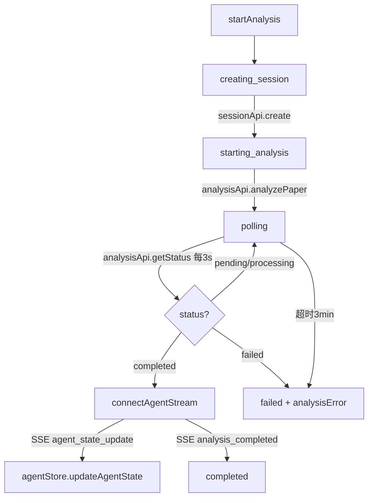

# Task20: sessionStore + 全链路联调

## 任务概述
增强sessionStore会话状态管理，添加分析流程编排方法（创建会话→触发分析→轮询状态→SSE监听→获取结果），实现注册→登录→检索→分析全链路联调验证。

## 里程碑
FM3：论文分析+对比页面可用

## 涉及模块
- F1.1.1 用户注册/登录
- F1.2.2 智能检索
- F1.3.1 论文详情
- F1.3.2 智能分析
- F2.3 会话管理
- F2.4 分析服务

## 文件变更
| 操作 | 文件 | 说明 |
|------|------|------|
| 修改 | Veritas/frontend/src/stores/sessionStore.ts | 增强分析流程编排 |
| 修改 | Veritas/frontend/src/views/PaperDetailView.vue | 重构为使用sessionStore统一编排 |
| 新增 | Veritas/frontend/src/__tests__/integration/fullChain.spec.ts | 全链路联调集成测试 |

## 功能要求

### P0 - 必须实现
1. **sessionStore新增状态**：analysisStatus(idle/creating_session/starting_analysis/polling/connecting_sse/completed/failed)、analysisError、pollTimer、eventSource、reconnectAttempts
2. **startAnalysis编排方法**：创建会话→启动分析→轮询→SSE连接→返回结果，每阶段更新analysisStatus
3. **pollAnalysisStatus轮询**：递归setTimeout 3s间隔、completed停止并缓存、failed停止报错、60次(3分钟)超时保护
4. **connectAgentStream SSE**：手动创建EventSource（不用useSSE composable）、监听agent_state_update→agentStore.updateAgentState、analysis_completed→disconnect、onerror自动重连5次
5. **cleanup清理**：clearTimeout+close EventSource+agentStore.resetStates+重置状态
6. **PaperDetailView重构**：内联分析逻辑替换为sessionStore.startAnalysis()调用
7. **全链路联调测试**：注册→登录→搜索→详情→分析→结果获取（vi.mock模拟API）

### P1 - 应该实现
1. **Getters**：isAnalyzing、isAnalysisCompleted、isAnalysisFailed

## 分析流程编排



## 全链路数据流

```
注册 → 登录 → 搜索论文 → 查看详情 → 触发分析 → 轮询状态 → SSE监听 → 获取结果
  ↓       ↓        ↓          ↓           ↓           ↓          ↓         ↓
userApi  userStore  paperStore  paperApi  sessionStore  analysisApi  agentStore  AnalysisCard
.register .login   .searchPapers .getDetail .startAnalysis .getStatus  .updateAgentState
```

## 验收标准
- [ ] sessionStore.startAnalysis正确编排5阶段流程
- [ ] 轮询3s间隔、completed停止缓存、failed停止报错、3分钟超时
- [ ] SSE连接建立、事件监听、自动重连5次
- [ ] cleanup清理定时器+SSE+Agent状态
- [ ] PaperDetailView使用sessionStore.startAnalysis()统一编排
- [ ] 全链路联调测试通过（注册→登录→搜索→分析→结果）
- [ ] 无内存泄漏（定时器+SSE正确清理）
- [ ] SSE认证不通过URL暴露Token
- [ ] TypeScript类型检查通过
- [ ] sessionStore代码≤300行
