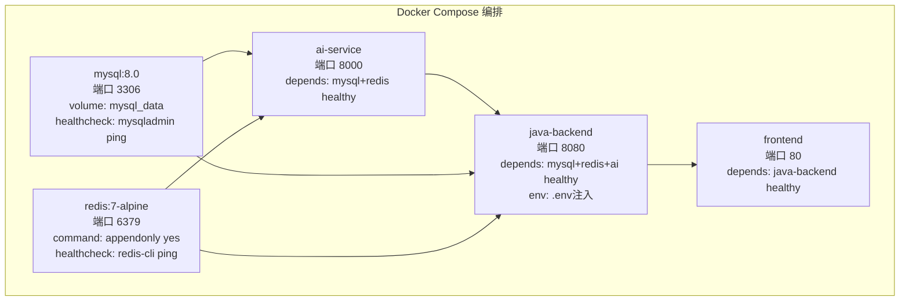

# 技术教学文档 — Docker 配置与编排

## 开发思路

### 需求分析过程
项目需要 5 个服务协同运行（MySQL、Redis、AI 服务、Java 后端、前端），手动逐个启动既繁琐又容易出错。核心需求：
1. **一键启动**：`docker-compose up -d` 启动全部服务
2. **启动顺序保证**：MySQL/Redis 必须先就绪，Java 后端才能连接数据库
3. **数据持久化**：MySQL 数据和 Redis AOF 日志不能因容器重启丢失
4. **安全配置**：密码等敏感信息不硬编码在 YAML 中
5. **镜像体积优化**：Java 后端镜像不应包含 Maven 和 JDK，仅 JRE 即可

### 技术选型考虑
- **Docker Compose** vs **Kubernetes**：项目规模小（5 服务），单机部署，Docker Compose 足够，K8s 过于复杂
- **eclipse-temurin** vs **openjdk**：Eclipse Temurin 是 Adoptium 项目维护的 OpenJDK 发行版，社区活跃、更新及时、Alpine 变体体积小
- **Alpine Linux** 基础镜像：相比 Debian/Ubuntu 镜像，Alpine 仅 ~5MB，大幅减小镜像体积

### 架构设计思路



### 遇到的问题及解决方案

| 问题 | 解决方案 |
|------|---------|
| Docker 磁盘空间不足（no space left on device） | `docker system prune -af --volumes` 清理未使用的镜像和卷，回收 2.3GB |
| 原始 SQL 脚本在 `backend-java/` 而非 `Veritas/backend/` | 迁移 SQL 脚本到正确目录，docker-compose 挂载路径对齐 |
| MySQL 初始化脚本需按顺序执行 | 利用 `/docker-entrypoint-initdb.d/` 自动按文件名排序执行（01→02→03） |
| HEALTHCHECK 需要 curl 但 jre-alpine 默认不含 | 在 run 阶段 `apk add --no-cache curl` |
| 非 root 用户运行时 jar 文件权限问题 | `COPY --from=build` 后 `chown appuser:appgroup app.jar` |

## 实现步骤

1. **迁移 SQL 脚本**：将 `backend-java/src/main/resources/db/` 下的 3 个 SQL 文件复制到 `Veritas/backend/src/main/resources/db/`
2. **创建 Dockerfile**：编写多阶段构建，build 阶段用 JDK 编译，run 阶段仅 JRE 运行
3. **创建 .dockerignore**：排除 target/、.idea/ 等无关文件，加速构建
4. **创建 docker-compose.yml**：定义 5 个服务、网络、数据卷，配置 healthcheck 和 depends_on
5. **创建 .env.example**：列出所有环境变量及占位符，复制为 .env 后使用
6. **验证**：`docker-compose config` → `docker-compose up -d mysql redis` → 健康检查 → 数据库初始化验证

## 解决了什么问题

### 核心问题描述
项目涉及 5 个服务（MySQL、Redis、AI 服务、Java 后端、前端），手动管理启动顺序和依赖关系极易出错。Java 后端如果先于 MySQL 启动会连接失败，AI 服务如果先于 Redis 启动会缓存不可用。

### 解决方案对比

| 方案 | 优点 | 缺点 |
|------|------|------|
| 手动逐个启动 | 简单 | 容易出错、不可重复 |
| shell 脚本 + sleep | 自动化 | sleep 时间不可控，可能过长或过短 |
| **depends_on + healthcheck** | 精确控制、自动重试 | 配置稍复杂 |

### 最终方案的优势
- **精确性**：healthcheck 确认服务真正就绪（而非仅进程启动）
- **自动重试**：healthcheck 配置 retries，短暂故障可自动恢复
- **声明式**：依赖关系在 YAML 中一目了然
- **可移植**：`docker-compose up -d` 一键启动，任何环境一致

## 变更内容

### 新增文件
- `Veritas/backend/Dockerfile` — Java 后端多阶段构建镜像（build: jdk-alpine + Maven → run: jre-alpine）
- `Veritas/backend/.dockerignore` — Docker 构建忽略文件（target/、.idea/、.env 等）
- `Veritas/docker-compose.yml` — 5 服务编排（mysql/redis/ai-service/java-backend/frontend）
- `Veritas/.env.example` — 环境变量模板（11 个变量，仅占位符）
- `Veritas/.env` — 从 .env.example 复制的实际配置文件（不提交 Git）

### 修改文件
- `Veritas/backend/src/main/resources/db/01_create_tables.sql` — 迁移自 backend-java/
- `Veritas/backend/src/main/resources/db/02_create_indexes.sql` — 迁移自 backend-java/
- `Veritas/backend/src/main/resources/db/03_insert_seed_data.sql` — 迁移自 backend-java/

### 配置变更
- Docker Network: `veritas_app-network`（bridge 驱动）
- Docker Volume: `veritas_mysql_data`（MySQL 数据持久化）
- MySQL 8.0: `--character-set-server=utf8mb4 --collation-server=utf8mb4_unicode_ci`
- Redis 7: `redis-server --appendonly yes`（AOF 持久化）

## 关键技术点

### 1. Dockerfile 多阶段构建
```dockerfile
# 阶段1: 构建（包含Maven和JDK，体积大但不进入最终镜像）
FROM eclipse-temurin:17-jdk-alpine AS build
COPY pom.xml .
RUN mvn dependency:go-offline -B    # 关键：依赖层独立缓存
COPY src ./src
RUN mvn package -DskipTests -B

# 阶段2: 运行（仅JRE，体积小）
FROM eclipse-temurin:17-jre-alpine
COPY --from=build /build/target/*.jar app.jar
```
**核心收益**：最终镜像不含 Maven 和 JDK，体积从 ~500MB 降至 ~200MB 以内。

### 2. Docker 缓存优化
先 `COPY pom.xml` + `RUN mvn dependency:go-offline`，再 `COPY src`。这样当仅修改源码时，依赖下载层可复用缓存，构建速度从分钟级降至秒级。

### 3. healthcheck + depends_on 启动顺序
```yaml
depends_on:
  mysql:
    condition: service_healthy    # 不是 service_started！
```
`service_started` 仅表示容器进程启动，`service_healthy` 表示 healthcheck 通过，服务真正可用。

### 4. MySQL 自动初始化
`/docker-entrypoint-initdb.d/` 是 MySQL 官方镜像的特殊目录，首次启动时自动执行其中的 `.sql`、`.sh`、`.sql.gz` 文件，按文件名排序。这意味着建表、建索引、插入种子数据全自动完成。

### 5. 非 root 用户运行
```dockerfile
RUN addgroup -S appgroup && adduser -S appuser -G appgroup
USER appuser
```
容器内以非 root 用户运行是安全最佳实践，即使容器被攻破，攻击者也没有 root 权限。

## 经验总结

### 开发过程中的收获
1. **Docker Compose 的 healthcheck 是生产级部署的关键**：单纯 `depends_on` 不够，必须配合 `condition: service_healthy`
2. **多阶段构建是 Java 容器化的标准模式**：JDK 仅在构建时需要，运行时 JRE 足够
3. **环境变量外部化**：`.env` 文件 + `${VAR}` 引用，既安全又灵活

### 踩过的坑及如何避免
1. **Docker 磁盘空间不足**：长期使用 Docker 会积累大量未使用的镜像和卷。**建议**：定期执行 `docker system prune`，或在 Docker Desktop 中设置自动清理
2. **SQL 脚本路径问题**：原始脚本在 `backend-java/` 而非 `Veritas/backend/`，导致 docker-compose 挂载路径需要修正。**建议**：先确认项目实际目录结构再编写配置
3. **jre-alpine 不含 curl**：HEALTHCHECK 依赖 curl 但 Alpine 默认不含。**解决方案**：在 run 阶段 `apk add --no-cache curl`

### 最佳实践建议
1. **始终使用 .env.example**：提交 Git 的模板文件仅含占位符，真实密码只在本地 .env 中
2. **MySQL 字符集配置**：在 command 中指定 `--character-set-server=utf8mb4`，避免中文乱码
3. **Redis AOF 持久化**：`--appendonly yes` 确保 JWT 黑名单等关键数据不丢失
4. **容器命名**：使用 `container_name` 明确命名，方便 `docker exec` 操作
5. **验证顺序**：先 `docker-compose config` 验证语法，再逐服务启动验证，最后全量启动
