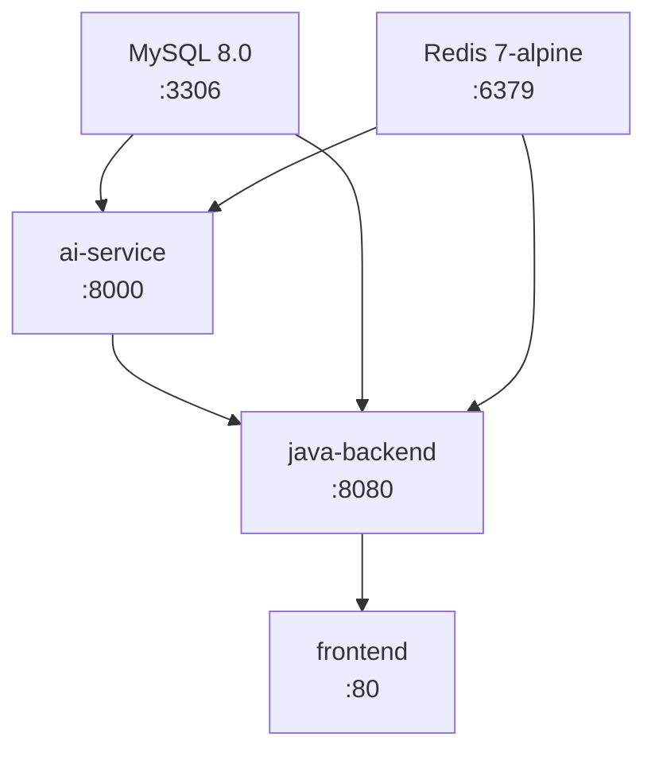

# Task 03: Dockerfile + docker-compose.yml 实施计划

## 项目目录结构（修正后）

```
Veritas(求真)/
├── Veritas/                          # ← 项目代码根目录
│   ├── backend/                      # ← Java 后端（实际根目录）
│   │   ├── Dockerfile                # ← 创建
│   │   ├── .dockerignore             # ← 创建
│   │   └── src/main/resources/db/    # ← SQL 脚本将迁移至此
│   ├── ai-service/                   # ← Python AI 服务（空）
│   ├── frontend/                     # ← 前端（空）
│   ├── docker-compose.yml            # ← 创建
│   └── .env.example                  # ← 创建
├── backend-java/                     # ← 旧目录，SQL 脚本将迁移走
│   └── src/main/resources/db/        # ← 迁移源
├── docs/
└── ...
```

**关键路径修正**:
- JSON 任务中的 `backend-java/` → 实际为 `Veritas/backend/`
- JSON 任务中的 `ai-service-python/` → 实际为 `Veritas/ai-service/`
- docker-compose.yml 放在 `Veritas/` 下（与 backend/、ai-service/、frontend/ 同级）
- SQL 初始化脚本从 `backend-java/src/main/resources/db/` 迁移到 `Veritas/backend/src/main/resources/db/`

---

## 需创建/迁移的文件（5个操作）

### 0. 迁移 SQL 脚本
- 源: `backend-java/src/main/resources/db/` (01_create_tables.sql, 02_create_indexes.sql, 03_insert_seed_data.sql)
- 目标: `Veritas/backend/src/main/resources/db/`
- 迁移后 `backend-java/` 目录可删除

### 1. `Veritas/backend/Dockerfile` — 多阶段构建

**构建阶段 (build)**:
```dockerfile
FROM eclipse-temurin:17-jdk-alpine AS build
WORKDIR /build
COPY pom.xml .
RUN mvn dependency:go-offline -B          # Docker 缓存优化：依赖层独立
COPY src ./src
RUN mvn package -DskipTests -B
```

**运行阶段 (run)**:
```dockerfile
FROM eclipse-temurin:17-jre-alpine
RUN apk add --no-cache curl               # healthcheck 需要
RUN addgroup -S appgroup && adduser -S appuser -G appgroup
WORKDIR /app
COPY --from=build /build/target/*.jar app.jar
RUN chown appuser:appgroup app.jar
EXPOSE 8080
HEALTHCHECK --interval=30s --timeout=10s --retries=3 \
  CMD curl -f http://localhost:8080/health || exit 1
USER appuser
ENTRYPOINT ["java", "-jar", "/app/app.jar", "--spring.profiles.active=prod"]
```

### 2. `Veritas/backend/.dockerignore` — 构建忽略文件

忽略: `target/`, `.idea/`, `*.iml`, `.git/`, `.env`, `*.log`, `node_modules/`

### 3. `Veritas/docker-compose.yml` — 5 服务编排



**5个服务定义**:

| 服务 | 镜像/构建 | 端口 | 依赖 | 健康检查 |
|------|----------|------|------|---------|
| mysql | `mysql:8.0` | 3306:3306 | 无 | `mysqladmin ping` 10s/5s/5 |
| redis | `redis:7-alpine` | 6379:6379 | 无 | `redis-cli ping` 10s/5s/5 |
| ai-service | `./ai-service` | 8000:8000 | mysql+redis(healthy) | `curl /health` 30s/10s/3 |
| java-backend | `./backend` | 8080:8080 | mysql+redis+ai-service(healthy) | `curl /health` 30s/10s/3 |
| frontend | `./frontend` | 80:80 | java-backend(healthy) | 无(占位) |

**顶级定义**:
- `networks: app-network` (driver: bridge)
- `volumes: mysql_data` (MySQL 持久化)

**MySQL 服务细节**:
- environment: `MYSQL_ROOT_PASSWORD=${MYSQL_ROOT_PASSWORD}`, `MYSQL_DATABASE=literature_assistant`
- volumes: `mysql_data:/var/lib/mysql` + `./backend/src/main/resources/db/:/docker-entrypoint-initdb.d/`（自动执行 SQL 初始化脚本）
- command: `--character-set-server=utf8mb4 --collation-server=utf8mb4_unicode_ci`

**Redis 服务细节**:
- command: `redis-server --appendonly yes`（AOF 持久化）

**java-backend 环境变量**:
- `SPRING_PROFILES_ACTIVE=prod`
- `AI_SERVICE_URL=http://ai-service:8000`
- `MYSQL_URL=jdbc:mysql://mysql:3306/literature_assistant?useUnicode=true&characterEncoding=utf8mb4&serverTimezone=Asia/Shanghai`
- `MYSQL_USERNAME=root`
- `MYSQL_PASSWORD=${MYSQL_ROOT_PASSWORD}`
- `REDIS_HOST=redis`
- `REDIS_PORT=6379`
- `JWT_SECRET=${JWT_SECRET}`

**ai-service 和 frontend**: 占位定义，标注 `# TODO: 待后续任务完善`

### 4. `Veritas/.env.example` — 环境变量模板

包含所有环境变量及注释说明（仅占位符，不含真实密码）:
- `MYSQL_ROOT_PASSWORD=change_me_root_password`
- `MYSQL_DATABASE=literature_assistant`
- `REDIS_HOST=redis`
- `REDIS_PORT=6379`
- `JWT_SECRET=change_me_jwt_secret_at_least_32_chars`
- `AI_SERVICE_URL=http://ai-service:8000`
- `LLM_MODE=auto`
- `LLM_BUILTIN_URL=https://llm.literature-assistant.com/v1`
- `LLM_API_KEY=`
- `LLM_API_BASE=`
- `LLM_MODEL_NAME=`

---

## 安全约束检查清单

- [x] 敏感信息通过 `${VAR}` 引用 .env，不硬编码
- [x] .env.example 仅含占位符
- [x] Dockerfile 非 root 用户运行 (appuser)
- [x] MySQL volume 持久化 (mysql_data)
- [x] Redis AOF 持久化 (appendonly yes)
- [x] 所有服务配置 healthcheck
- [x] depends_on 使用 condition: service_healthy

---

## 验证步骤

1. **语法验证**: `cd Veritas && docker-compose config` — 验证 YAML 语法正确
2. **MySQL + Redis 启动测试**: `docker-compose up -d mysql redis` — 验证基础服务启动
3. **MySQL 健康检查**: `docker exec mysql容器 mysqladmin ping -h localhost`
4. **Redis 健康检查**: `docker exec redis容器 redis-cli ping`
5. **MySQL 数据库初始化**: 验证 `literature_assistant` 数据库和表自动创建
6. **启动顺序验证**: `docker-compose up -d` — 观察服务按 mysql→redis→ai-service→java-backend→frontend 顺序启动

> **注意**: 完整的 `docker build` 和全量 `docker-compose up` 验证需要 Task 01 (Maven 骨架) 完成后才能执行，因为当前 `Veritas/backend/` 中没有 pom.xml。但 MySQL 和 Redis 的启动验证可以立即执行。

---

## 实施步骤

### Step 1: 迁移 SQL 脚本
- 将 `backend-java/src/main/resources/db/` 下的 3 个 SQL 文件迁移到 `Veritas/backend/src/main/resources/db/`

### Step 2: 创建 `Veritas/backend/Dockerfile`
- 多阶段构建: build (jdk-alpine + Maven) → run (jre-alpine)
- Docker 缓存优化: 先 COPY pom.xml 下载依赖
- 非 root 用户运行 (appuser)
- HEALTHCHECK 配置
- ENTRYPOINT 激活 prod profile

### Step 3: 创建 `Veritas/backend/.dockerignore`
- 忽略 target/, .idea/, *.iml, .git/, .env, *.log

### Step 4: 创建 `Veritas/docker-compose.yml`
- 5 个服务定义 (mysql/redis/ai-service/java-backend/frontend)
- 顶级 networks (app-network) 和 volumes (mysql_data)
- depends_on + condition: service_healthy 保证启动顺序
- 环境变量注入 (引用 .env)
- MySQL 初始化脚本挂载 (./backend/src/main/resources/db/)
- Redis AOF 持久化

### Step 5: 创建 `Veritas/.env.example`
- 所有环境变量及注释
- 仅占位符值

### Step 6: 验证
- `docker-compose config` 语法验证
- `docker-compose up -d mysql redis` 基础服务启动测试
- MySQL/Redis 健康检查验证
- MySQL 数据库和表自动创建验证
