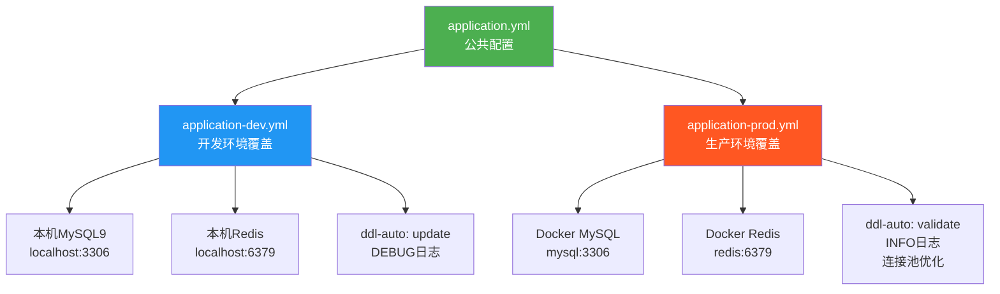

# 技术教学文档 — Spring Boot 三层配置文件

## 开发思路

### 需求分析过程
任务要求创建 Spring Boot 三层配置文件体系（application.yml / application-dev.yml / application-prod.yml），核心需求：
1. **公共配置集中**：所有环境共享的配置放在 application.yml
2. **环境配置分离**：开发环境和生产环境的差异配置分别放在对应 profile 文件
3. **安全合规**：生产环境敏感配置必须通过环境变量注入，不提供默认值
4. **开发便利**：不设置任何环境变量时，应用能以开发环境默认值启动

### 技术选型考虑
- **Spring Boot Profile 机制**：Spring Boot 原生支持 `application-{profile}.yml`，激活 profile 后自动与 `application.yml` 合并，profile 中的配置覆盖公共配置
- **环境变量占位符**：`${VAR:defaultValue}` 格式，VAR 为环境变量名，defaultValue 为未设置环境变量时的回退值
- **HikariCP 连接池**：Spring Boot 3.x 默认连接池，性能优于 Tomcat JDBC
- **Lettuce 连接池**：Spring Boot 3.x 默认 Redis 客户端，基于 Netty 异步非阻塞

### 架构设计思路



**配置合并规则**：Spring Boot 先加载 application.yml，再加载 application-{profile}.yml，后者覆盖前者的同名配置项。

### 遇到的问题及解决方案

| 问题 | 根因 | 解决方案 |
|------|------|---------|
| `Unsupported character encoding 'utf8mb4'` | JDBC URL 中 `characterEncoding` 参数需要 Java 字符集名，而非 MySQL 字符集名 | `utf8mb4` → `UTF-8`（Java charset `UTF-8` 映射到 MySQL `utf8mb4`） |
| `MySQL8Dialect has been deprecated` | Hibernate 6.4+ 弃用了版本特定 Dialect，推荐自动检测 | `MySQL8Dialect` → `MySQLDialect` |
| pom.xml MySQL connector groupId 错误 | Spring Boot 3.x 使用 `com.mysql:mysql-connector-j`，而非旧版 `mysql:mysql-connector-java` | 使用正确的 Maven 坐标 |

## 实现步骤

1. **创建目录结构**：`mkdir -p Veritas/backend/src/main/resources` 和 Java 包目录
2. **创建 application.yml**：写入完整公共配置，所有环境相关值使用 `${VAR:defaultValue}` 格式
3. **创建 application-dev.yml**：覆盖本机开发环境值（MySQL9/Redis/AI服务地址、ddl-auto=update、DEBUG日志）
4. **创建 application-prod.yml**：覆盖生产环境值（`${VAR}` 无默认值、ddl-auto=validate、连接池优化）
5. **创建 pom.xml**：最小化 Spring Boot 3.2.5 项目骨架（webflux/JPA/Redis/MySQL/JJWT/Lombok/MapStruct）
6. **创建主启动类**：`LiteratureAssistantApplication.java`
7. **验证**：确认本机 MySQL9/Redis 运行中 → 创建 `literature_assistant` 数据库 → `mvn spring-boot:run -Dspring-boot.run.profiles=dev` → 验证 HikariCP/Redis 连接成功

## 解决了什么问题

### 核心问题描述
项目需要在不同环境（开发/生产）中使用不同的数据库连接、日志级别、JPA策略等配置，同时保证：
- 开发环境零配置启动（不设环境变量也能跑）
- 生产环境安全合规（不暴露密码和密钥）
- 配置集中管理，避免散落各处

### 解决方案对比

| 方案 | 优点 | 缺点 |
|------|------|------|
| **单文件 + 全环境变量** | 简单 | 开发每次都要设环境变量，体验差 |
| **多文件硬编码** | 开发方便 | 生产环境密码泄露风险 |
| **三层Profile + ${VAR:default}** ✅ | 开发零配置 + 生产安全 | 文件多一个，但结构清晰 |

### 最终方案的优势
1. 开发者 clone 后直接 `mvn spring-boot:run -Dspring-boot.run.profiles=dev` 即可启动
2. 生产部署通过 Docker 环境变量注入，零硬编码
3. 配置分层清晰：公共 → 环境，覆盖关系明确
4. 默认值仅在 application.yml 中提供，dev 文件显式覆盖，prod 文件无默认值

## 变更内容

### 新增文件
- `Veritas/backend/src/main/resources/application.yml` — 公共配置（server/datasource/JPA/Redis/Jackson/ai-service/jwt/logging）
- `Veritas/backend/src/main/resources/application-dev.yml` — 开发环境配置
- `Veritas/backend/src/main/resources/application-prod.yml` — 生产环境配置
- `Veritas/backend/pom.xml` — Maven 项目描述文件
- `Veritas/backend/src/main/java/com/literatureassistant/LiteratureAssistantApplication.java` — 主启动类
- `Veritas/backend/src/test/java/com/literatureassistant/LiteratureAssistantApplicationTests.java` — 测试类

### 修改文件
- 无（本次为全新创建）

### 配置变更

| 配置项 | 值 | 说明 |
|--------|-----|------|
| `server.port` | 8080 | 服务端口 |
| `spring.datasource.url` | `${MYSQL_URL:jdbc:mysql://localhost:3306/...}` | MySQL连接URL |
| `spring.datasource.hikari.maximum-pool-size` | 20 | HikariCP最大连接数 |
| `spring.datasource.hikari.minimum-idle` | 5（公共）/ 10（prod） | HikariCP最小空闲连接 |
| `spring.jpa.hibernate.ddl-auto` | update（dev）/ validate（prod） | JPA DDL策略 |
| `spring.data.redis.lettuce.pool.max-active` | 20 | Redis连接池最大活跃连接 |
| `ai-service.url` | `${AI_SERVICE_URL:http://localhost:8000}` | Python AI服务地址 |
| `jwt.secret` | `${JWT_SECRET:...}` | JWT签名密钥 |
| `jwt.expiration` | 86400000（24小时） | JWT过期时间 |
| `logging.pattern.console` | 含 `%X{requestId}` | 日志格式含请求ID |

## 关键技术点

### 1. Spring Boot Profile 合并机制
Spring Boot 配置加载顺序：
1. `application.yml`（公共配置，始终加载）
2. `application-{profile}.yml`（profile 配置，覆盖公共配置中的同名项）

激活方式：`-Dspring-boot.run.profiles=dev` 或环境变量 `SPRING_PROFILES_ACTIVE=dev`

### 2. `${VAR:defaultValue}` 占位符语法
- `${MYSQL_URL}` — 必须提供环境变量，否则启动失败
- `${MYSQL_URL:jdbc:mysql://localhost:3306/...}` — 未设置环境变量时使用默认值
- `${REDIS_PASSWORD:}` — 默认值为空字符串（Redis无密码场景）

### 3. characterEncoding 参数的正确使用
这是一个常见的坑：
- **MySQL 字符集名**：`utf8mb4`（MySQL 5.7.4+ 的完整 UTF-8 实现）
- **Java 字符集名**：`UTF-8`（Java 标准 charset 名称）
- **JDBC URL 中必须使用 Java 字符集名**：`characterEncoding=UTF-8`
- MySQL Connector/J 会自动将 Java 的 `UTF-8` 映射到 MySQL 的 `utf8mb4`

```
❌ characterEncoding=utf8mb4  → java.io.UnsupportedEncodingException: utf8mb4
✅ characterEncoding=UTF-8    → MySQL自动使用utf8mb4
```

### 4. Hibernate Dialect 演进
- Hibernate 5.x：需要手动指定 `MySQL8Dialect`
- Hibernate 6.4+：`MySQL8Dialect` 已弃用，推荐使用 `MySQLDialect`（自动检测MySQL版本）
- Spring Boot 3.2.5 使用 Hibernate 6.4.4.Final，应使用 `MySQLDialect`

### 5. HikariCP 连接池分层优化
- **公共配置**：max=20, min-idle=5, timeout=30s（开发够用）
- **生产覆盖**：min-idle=10（保持更多空闲连接应对突发流量）, idle-timeout=10min, max-lifetime=30min

## 经验总结

### 开发过程中的收获
1. **配置分离是 Spring Boot 最佳实践**：公共/环境三层分离让配置清晰可维护
2. **默认值策略很关键**：`${VAR:default}` 让开发零配置，`${VAR}` 让生产安全
3. **JDBC URL 参数要区分 MySQL 和 Java 命名空间**：`utf8mb4` vs `UTF-8` 是经典踩坑点

### 踩过的坑及如何避免
1. **`characterEncoding=utf8mb4` 导致启动失败**：记住 JDBC URL 用 Java charset 名，不是 MySQL charset 名
2. **`MySQL8Dialect` 弃用警告**：Hibernate 6.x 推荐自动检测，不需要手动指定版本 Dialect
3. **pom.xml 中 MySQL connector 的 Maven 坐标变更**：Spring Boot 3.x 使用 `com.mysql:mysql-connector-j`，旧版 `mysql:mysql-connector-java` 已废弃

### 最佳实践建议
1. **永远不要在 prod 配置中提供默认值**：`${MYSQL_PASSWORD}` 而非 `${MYSQL_PASSWORD:root123}`
2. **dev 配置允许硬编码**：开发环境的本机密码可以明文写在 application-dev.yml，但确保 `.gitignore` 排除或仓库私有
3. **MySQL URL 必须包含三个参数**：`useUnicode=true&characterEncoding=UTF-8&serverTimezone=Asia/Shanghai`
4. **logging pattern 包含 MDC 占位符**：`%X{requestId}` 为后续链路追踪预留
5. **JPA ddl-auto 策略**：开发用 `update`（自动建表），生产用 `validate`（仅验证），**绝对禁止**生产用 `update/create`
