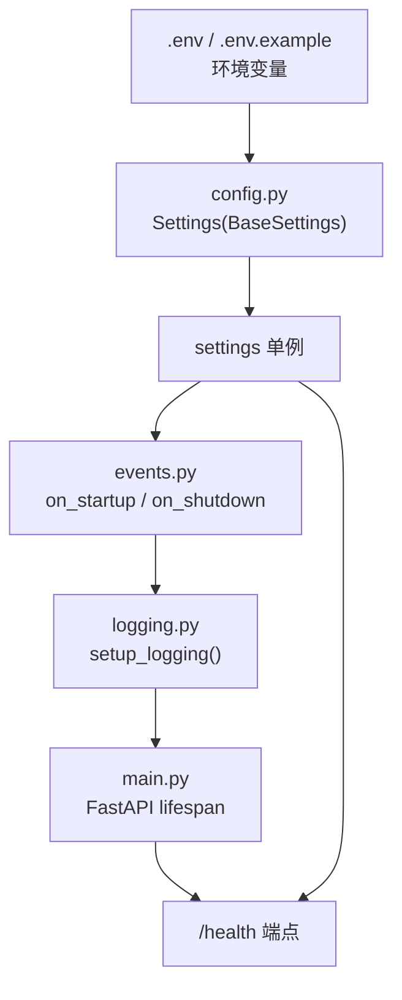

# Task05: Python AI服务核心配置模块实现计划

## 任务概述

实现Python AI服务的核心配置模块，包含4个文件（3个修改+1个新建），为后续Agent、LLM、RAG等模块提供配置和日志基础设施。

## 当前状态

- `ai-service/` 目录骨架已存在（含 `__init__.py` 占位）
- `requirements.txt` 已包含 `pydantic-settings==2.2.1`、`loguru==0.7.0`、`fastapi==0.110.0`
- **不存在** `app/main.py`、`app/core/config.py`、`app/core/logging.py`、`app/core/events.py`、`.env.example`
- 任务JSON中标注为"modify"的文件实际需从零创建（之前任务4的占位文件不存在）

## 架构参考

## 实现步骤

### Step 1: 创建 `app/core/config.py` — Settings配置类

**依据**: 架构文档 §16.1 代码 + 任务JSON FR-001/FR-002

实现要点：
- 继承 `pydantic_settings.BaseSettings`
- 6组配置：应用/ChromaDB/Embedding/LLM/Agent/日志
- 所有字段提供合理默认值（应用可在无.env时启动）
- 使用 `model_config = SettingsConfigDict(env_file=".env", env_file_encoding="utf-8")`（pydantic-settings v2 推荐方式）
- 创建全局 `settings = Settings()` 单例
- 敏感字段（API Key等）默认值为空字符串，禁止硬编码

**配置字段清单**：共25个字段，涵盖应用/ChromaDB/Embedding/LLM/Agent/日志6组。

### Step 2: 创建 `app/core/logging.py` — Loguru日志配置

**依据**: 架构文档 §18.1 代码 + 任务JSON FR-004

- `setup_logging(level: str = "INFO") -> None`
- `logger.remove()` 移除默认handler
- 控制台：`sys.stdout`，colorize=True
- 文件：按天轮转，保留7天，zip压缩
- 日志格式：`{time:YYYY-MM-DD HH:mm:ss} | {level:<8} | {name}:{function}:{line} | {message}`

### Step 3: 创建 `app/core/events.py` — 生命周期事件

- `on_startup()`: 初始化日志 → 记录非敏感配置
- `on_shutdown()`: 记录关闭日志
- **禁止记录** API Key 等敏感值

### Step 4: 创建/修改 `app/main.py` — FastAPI应用入口

- lifespan 集成 on_startup/on_shutdown
- `/health` 端点返回占位状态
- 使用 `settings.APP_NAME` 作为 FastAPI title

### Step 5: 创建 `.env.example` — 环境变量示例

- 6组分组 + 中文注释 + LLM三路方案优先级说明
- 敏感值留空

### Step 6: 验证

执行任务JSON中的验证命令并全部通过。

## 文件变更清单

| 操作 | 文件路径 | 说明 |
|------|---------|------|
| create | `Veritas/ai-service/app/core/config.py` | Settings配置类 + 全局单例 |
| create | `Veritas/ai-service/app/core/logging.py` | Loguru日志配置 |
| create | `Veritas/ai-service/app/core/events.py` | 启动/关闭事件处理 |
| modify | `Veritas/ai-service/app/main.py` | 集成settings和events |
| create | `Veritas/ai-service/.env.example` | 环境变量示例文件 |

## 安全检查

- [x] 无硬编码API Key/密码
- [x] 敏感字段默认值为空字符串
- [x] 日志中不输出API Key等敏感信息
- [x] .env.example中敏感值留空

## 验收标准映射

| AC | 对应实现 | 验证方式 |
|----|---------|---------|
| AC-001 | config.py 6组配置字段 | code_review |
| AC-002 | model_config含env_file配置 | code_review |
| AC-003 | settings.LLM_MODE=='auto' | automated_test |
| AC-004 | .env.example分组+中文注释+敏感值留空 | code_review |
| AC-005 | cp .env.example .env后正常启动 | automated_test |
| AC-006 | setup_logging格式含时间/级别/模块:函数:行号/消息 | code_review |
| AC-007 | rotation/retention/compression参数 | code_review |
| AC-008 | logs/目录自动创建 | automated_test |
| AC-009 | on_startup记录配置，不记录敏感值 | code_review |
| AC-010 | lifespan调用on_startup/on_shutdown | code_review |
| AC-011 | 无硬编码敏感信息 | code_review |